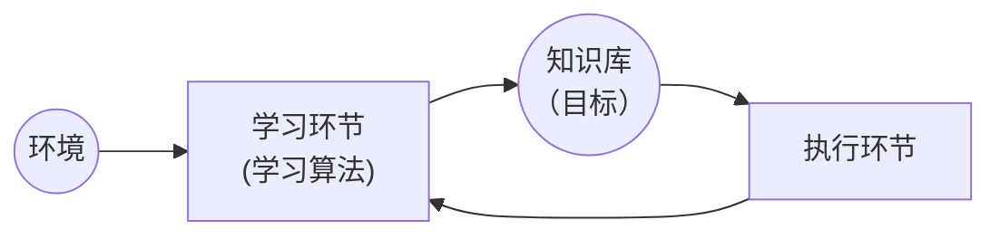

> **阅读导引**：本文档系统梳理了《人工智能导论》课程的核心知识点，涵盖搜索策略、机器学习、自然语言处理、分布式人工智能及归结原理五大模块。每个知识点均配有详细解释与具体示例，语言力求严谨易懂。标注 ★★★ 的为重点/高频考点。

---
# 第一章 基于图的知识表示与图搜索技术

**图（Graph）** 是由**节点（Node/Vertex）** 和**边（Edge）** 构成的数学结构，记作 $G = (V, E)$，其中 $V$ 为节点集合，$E \subseteq V \times V$ 为边集合。在人工智能中，图被广泛用于表示知识结构、问题状态及其转换关系——节点表示概念或状态，边表示概念间的关系或状态间的转移操作。

**搜索（Search）** 是指在图（或状态空间）中，从初始节点出发，沿边逐步探索、寻找一条通往目标节点的路径的过程。搜索是人工智能中被广泛使用的基础技术，从路径规划到定理证明，从博弈对弈到自然语言理解，其核心均可归结为搜索。

**搜索树（Search Tree）** 是搜索过程展开后形成的一棵树形结构：
- **根节点**：对应搜索的初始状态
- **树枝**：对应一次操作/状态转移
- **叶节点**：对应尚未扩展的状态或搜索终止的状态

> 注意区分**搜索树**与**状态空间图**：状态空间图描述问题本身的所有可能状态与转移；搜索树是搜索算法在状态空间图上遍历时逐步展开的树，同一条路径不会重复出现（但不同路径可能到达同一状态）。

**搜索策略（Search Strategy）** 决定搜索过程中选择节点的次序，直接影响搜索的效率和效果。搜索策略主要分为两大类：

| 类型        | 别称                        | 核心思想                                   | 是否利用领域知识 | 代表算法           |
| :-------- | :------------------------ | :------------------------------------- | :------- | :------------- |
| **盲目搜索**  | 无信息搜索 (Uninformed Search) | 仅按固定规则扩展节点，不利用与问题领域相关的启发信息             | ❌ 不使用    | BFS、DFS、代价一致搜索 |
| **启发式搜索** | 有信息搜索 (Informed Search)   | 利用启发函数 $h(n)$ 评估节点到目标的距离，优先扩展"更有希望"的节点 | ✅ 使用     | A 算法、A* 算法、爬山法 |

> **搜索策略评价维度**：
> - **完备性（Completeness）**：若问题有解，算法是否能保证找到一个解？
> - **最优性（Optimality）**：找到的解是否是最优（代价最小）的？
> - **时间复杂度**：算法找到解所需的时间（通常用搜索树节点数衡量）
> - **空间复杂度**：算法在搜索过程中所需存储的节点数量

本章后续各节将围绕上述概念逐步展开——首先介绍状态空间图的形式化表示（1.1 节），然后分别讨论盲目搜索（1.2 节）和启发式搜索（1.3 节）的具体算法，进而推广到与或图搜索（1.5 节）和博弈树搜索（1.6 节）。

---

## 1.1 状态空间图的表示

**状态空间（State Space）** 是人工智能中用于描述问题的一种形式化框架。一个状态空间由以下三元组定义：

$$SS = \langle S, F, G \rangle$$

| 组成要素       | 符号  | 含义                      | 示例（八数码问题）          |
| :--------- | :-- | :---------------------- | :----------------- |
| **初始状态集合** | $S$ | 问题求解的起点集合（可包含一个或多个初始状态） | 给定的初始棋局布局          |
| **操作集合**   | $F$ | 从当前状态转移到下一状态的所有可能操作     | 空格上/下/左/右移动        |
| **目标状态集合** | $G$ | 问题求解的终点集合（可包含一个或多个目标状态） | 目标棋局布局（如 1-8 顺序排列） |

> **说明**：$S$、$F$、$G$ 均为集合——初始状态和目标状态可能不唯一，操作也包含所有合法的状态转移动作。

**状态空间图**是由状态（节点）和操作（有向边）构成的有向图：

- **节点**：表示某个状态 -> 叙述性知识
- **边**：表示一次操作（状态转移）-> 过程性知识
- **路径**：从初始状态到目标状态的一系列操作的序列 -> 搜索策略 -> 控制性知识

问题的**状态空间图**就是一个**描述该问题全部可能的状态及相互关系的有向图**，如考虑操作的代价，状态空间图就是一个**赋值有向图**。

> **核心思想**：将问题求解转化为在状态空间图中寻找一条从初始节点到目标节点的路径。

**示例——旅行商问题 (TSP) 的状态空间表示**：
- **状态**：已访问城市的序列（如 `[A, B]` 表示从 A 出发已访问 B）
- **初始状态**：起始城市（如 `[A]`）
- **目标状态**：访问完所有城市并返回起点
- **操作**：从当前城市移动到未访问的城市
- **状态空间规模**：n 个城市的状态空间大小为 $(n-1)!$

---

## 1.2 盲目搜索

**盲目搜索**（Blind Search）又称**无信息搜索**（Uninformed Search），在搜索过程中仅使用**状态空间的定义信息**，不利用任何与问题相关的领域知识。

### 1.2.1 广度优先搜索 (BFS)

**核心思想**：逐层扩展节点，先扩展根节点的所有子节点，再扩展这些子节点的子节点，以此类推。

**数据结构**：使用**队列（FIFO）** 存储待扩展节点。
- OPEN表：主队列
- CLOSED表：Visited表，存储已被访问过的节点，防止重复访问。

```
算法流程：
1. 将初始节点 S₀ 放入 OPEN 表（队列）
2. 若 OPEN 为空，则无解，退出
3. 取 OPEN 的第一个节点 n，放入 CLOSED 表
4. 若 n 为目标节点，则成功，返回解路径
5. 扩展 n，生成所有子节点，将未在 OPEN 和 CLOSED 中的子节点放入 OPEN 末尾
6. 返回第 2 步
```

> 对于 OPEN/CLOSED 表的详细求解方式，详见[第七章](#第七章%20A/A*%20算法%20OPEN/CLOSED%20表计算专题（★★★）)的相关内容。

**性质分析**：

| 性质        | 结论                           |
| :-------- | :--------------------------- |
| **完备性**   | ✅ 完备（若解存在，一定能找到）             |
| **最优性**   | ✅ 最优（若边权相等，找到的第一解即为最短路径解）    |
| **时间复杂度** | $O(b^d)$，$b$ 为分支因子，$d$ 为解的深度 |
| **空间复杂度** | $O(b^d)$，需存储所有已生成节点          |
> **完备性**：在搜索算法中，若一个算法**总能找到解（只要解存在）**，则称该算法是**完备的**。

> 由上表可发现，BFS 的时间/空间复杂度均为指数级别，其仅适合解决简单问题。

**示例——BFS 在八数码问题中的搜索过程**：

```
初始状态：       目标状态：
2 8 3           1 2 3
1 6 4           8   4
7   5           7 6 5

第一层扩展（空格右移、上移、下移、左移）：
   (1) 空格右移      (2) 空格上移      (3) 空格下移      (4) 空格左移
   2 8 3            2 8 3            2 8 3            2 8 3
   1 6 4            1   4            1 6 4            1 6 4
     7 5            7 6 5            7   5            7 5

BFS 按层逐一遍历每个子节点，直至找到目标状态。
```

### 1.2.2 深度优先搜索 (DFS)

**核心思想**：优先向深度方向扩展，从当前节点选择一个子节点继续深入，直到到达叶节点再回溯。

**数据结构**：使用**栈（LIFO）** 存储待扩展节点。

```
算法流程：
1. 将初始节点 S₀ 放入 OPEN 表（栈）
2. 若 OPEN 为空，则无解，退出
3. 取 OPEN 的第一个节点 n，放入 CLOSED 表
4. 若 n 为目标节点，则成功，返回解路径
5. 若 n 的深度达到深度界限，则返回第 2 步（若设定界限）
6. 扩展 n，生成所有子节点，将未在 OPEN 和 CLOSED 中的子节点放入 OPEN 前端
7. 返回第 2 步
```

**性质分析**：

| 性质        | 结论                              |
| :-------- | :------------------------------ |
| **完备性**   | ❌ 非完备（在无限深状态空间中可能陷入死路）；加深度界限后完备 |
| **最优性**   | ❌ 非最优（找到的解不一定是最短路径）             |
| **时间复杂度** | $O(b^m)$，$m$ 为最大深度              |
| **空间复杂度** | $O(b \cdot m)$，只需存储当前路径上的节点     |

### 1.2.3 BFS 与 DFS 对比

| 维度   | BFS      | DFS          |
| :--- | :------- | :----------- |
| 数据结构 | 队列（FIFO） | 栈（LIFO）      |
| 完备性  | 完备       | 可能不完备        |
| 最优性  | 最优（等边权）  | 不一定最优        |
| 空间消耗 | 大（指数级）   | 小（线性级）       |
| 适用场景 | 解较浅的问题   | 解较深、状态空间大的问题 |

---

## 1.3 启发式搜索

**启发式搜索**（Heuristic Search）利用与问题相关的启发信息来引导搜索方向，避免盲目搜索中对所有节点的均匀扩展，从而显著提高搜索效率。

**启发函数 $h(n)$**：估计从节点 $n$ 到目标节点所需的最小代价。$h(n)$ 是启发式搜索的核心。

> **启发函数的要求**：$h(n) \geq 0$，且 $h(goal) = 0$。

### 1.3.1 贪心最佳优先搜索

贪心最佳优先搜索算法的评估函数仅包含启发函数分量：

$$f(n) = h(n)$$

即每次都选择**看起来离目标最近**的节点进行扩展。（即每次均取局部最优解，但**局部最优解有时$\neq$ 全局最优解**）

**特点**：
- 搜索效率高，但**不保证找到最优解**（局部贪心的局限性：即使存在一条总代价更小的绕行路径，它也可能因为“看起来绕远了”而被忽略）
- 可能陷入**局部最优**（即无法正确找出全局最优解，甚至可能找不到解）
	- 在存在障碍、多峰地形或误导性启发信息的环境中，算法可能：
	    1. 被引向死胡同；
	    2. 在局部“伪目标”附近循环；
	    3. 找到一个次优解后停止（若实现中未强制继续搜索）；
	    4. 甚至在某些图结构中**不完备**（即解存在却找不到）。

### 1.3.2 A* 算法（★★★）

**A* 算法** 是最著名的启发式搜索算法，它将到达节点 $n$ 的实际代价和从 $n$ 到目标的估计代价综合考虑：
$$f(n) = g(n) + h(n)$$

| 符号     | 含义                               |
| :----- | :------------------------------- |
| $f(n)$ | 从初始节点经节点 $n$ 到目标节点的**估计总代价**     |
| $g(n)$ | 从初始节点到节点 $n$ 的**实际代价**（已走过的路径代价） |
| $h(n)$ | 从节点 $n$ 到目标节点的**估计代价**（启发函数值）    |

> **注意：当$h(n)$不保证可采纳时，该算法为A算法，只有当$h(n)$保证可采纳时，该算法才叫做A\*算法** 

#### 1. **A* 算法的可采纳性条件（最优性保证）**

> 若启发函数 $h(n)$ 满足  $$ h(n) \leq h^*(n) \quad \text{（对所有节点 } n \text{ 成立）} $$  
> 其中 $h^*(n)$ 是从节点 $n$ 到目标节点的**真实最小代价**，  
> 则称 $h(n)$ 是**可采纳的（admissible）**，此时 $A*$ 算法**保证找到全局最优解**。

---
##### ✅ 核心含义（通俗理解）：

- **“不高估” = 乐观估计**：  
	- $h(n)$ 被设计为永远不会高估从当前节点到目标的实际剩余代价。即对所有节点，永远存在$f(n) = g(n) + h(n) \leq g(n) + h^*(n) = f^*(n)$
- **“高估”的定义**：  
	- 若 $h(n) > h^*(n)$，即启发值大于真实最小剩余代价，则称为**高估**。  
	- 一旦发生高估，$A*$ 可能误判路径优劣，从而**失去最优性保证**。
---
##### 🔑 关键性质：

1. **全局性要求**：  
    可采纳性必须对**搜索空间中的每一个节点**成立，而不仅限于最优路径上的节点。  
    因为 A* 在搜索时并不知道哪些节点属于最优路径。
    
2. **评价函数的安全性**：  
    由于 $h(n) \leq h^*(n)$，有  $$ f(n) = g(n) + h(n) \leq g(n) + h^*(n) = f^*(n) $$
    即 $A*$ 的估计总代价 $f(n)$ **永远不会高估**从起点经 $n$ 到目标的真实最小总代价。
3. **最优性机制**：  
    所有通向最优解的节点其 $f(n) \leq C^*$（$C^*$ 为最优解总代价），  
    而任何次优路径在被完全展开时其 $f$ 值必大于 $C^*$。  
    因此，A* 按 $f(n)$ 递增顺序扩展节点，**首次到达目标时即得到最优解**。
4. **“过于乐观”是安全的但低效**：  
    若 $h(n) \ll h^*(n)$（如 $h(n) = 0$），A* 退化为 Dijkstra 算法——虽然仍能求出全局最优解，但搜索范围大、效率低。
5. **理想启发函数**：  
    在满足 $h(n) \leq h^*(n)$ 的前提下，**$h(n)$ 越接近 $h^*(n)$ 越好**。  
    当 $h(n) = h^*(n)$ 时，A* 将**直接沿最优路径前进，不扩展任何无关节点**，达到最高效率。
    

> 💡 **设计启发函数的艺术**：  
> 构造一个**尽可能紧致（tight）的下界**——既不越界（保证最优性），又足够接近真实代价（提升效率）。

---

#### 2. **A* 算法的性质**：

| 性质 | 条件 | 结论 |
|:---|:---|:---|
| 完备性 | 分支因子有限 | ✅ 完备 |
| 最优性 | $h(n)$ 可采纳 | ✅ 最优 |
| 效率 | $h(n)$ 越接近 $h^*(n)$ | 搜索越高效 |

#### 3. **常见的启发函数设计（以八数码为例）**：

1. **$h_1(n)$ = 错位棋子数**：统计不在目标位置的棋子数量（不含空格）
2. **$h_2(n)$ = 曼哈顿距离和**：每个棋子到其目标位置的曼哈顿距离之和（不含空格）

> $h_2(n) \geq h_1(n)$ 对所有 $n$ 都成立，且两者均是可采纳的。由于 $h_2$ 更接近 $h^*$，使用 $h_2$ 的 A* 算法搜索效率更高。

#### 4. **A* 算法流程**：

```
1. OPEN = {S₀}，CLOSED = ∅
   计算 f(S₀) = g(S₀) + h(S₀) = 0 + h(S₀)
2. 若 OPEN 为空，则无解，退出
3. 从 OPEN 中取出 f 值最小的节点 n，放入 CLOSED
4. 若 n 是目标节点，则成功，回溯路径
5. 扩展 n，生成所有子节点 m：
   a) 计算 g(m) = g(n) + cost(n, m)
   b) 计算 h(m)
   c) 计算 f(m) = g(m) + h(m)
   d) 若 m 已在 OPEN 中且新 g(m) < 原 g(m)：
      更新 m 的 g、f 值，将 m 的父指针指向 n
   e) 若 m 已在 CLOSED 中且新 g(m) < 原 g(m)：
      将 m 移回 OPEN，更新其值，将父指针指向 n
   f) 若 m 不在 OPEN 也不在 CLOSED 中：
      将 m 加入 OPEN，设置父指针指向 n
6. 返回第 2 步
```

> 注：$A*$ 算法的OPEN表可认为是按照 $f(n)$ 从小到大进行排序的（`从 OPEN 中取出 f 值最小的节点 n，放入 CLOSED`），也就是说其如果检测到这条路线的后续代价变高，会直接切换到另一条代价更小的候选路线进行搜索，而不会出现DFS的那种”回溯“现象

---
## 1.4 八数码问题的 A* 求解（★★★ 重点示例）

> **问题描述**：在一个 $3 \times 3$ 的棋盘上有 8 个编号为 1~8 的棋子和一个空格。每次可以将与空格相邻的棋子移入空格（等价于空格向相邻方向移动）。给定初始布局和目标布局，求从初始状态到目标状态的最优移动序列。

### 1.4.1 初始条件设定

```
初始状态 S₀：       目标状态 G：
2 8 3           1 2 3
1 6 4           8   4
7   5           7 6 5
```

> 3和8放反了，导致这道题的解全部有问题，但整体算法是没问题的
### 1.4.2 启发函数选择

采用**曼哈顿距离和**作为启发函数 $h(n)$：

$$h(n) = \sum_{i=1}^{8} |x_i - x_i^{goal}| + |y_i - y_i^{goal}|$$

其中 $(x_i, y_i)$ 是棋子 $i$ 在当前状态中的坐标，$(x_i^{goal}, y_i^{goal})$ 是其在目标状态中的坐标。

### 1.4.3 第一步：计算初始状态的 $h(S_0)$ 和 $f(S_0)$

**目标状态中各棋子的位置**：

| 棋子 | 目标行 | 目标列 |
|:---|:---|:---|
| 1 | 1 | 1 |
| 2 | 1 | 2 |
| 3 | 1 | 3 |
| 4 | 2 | 3 |
| 5 | 3 | 3 |
| 6 | 3 | 2 |
| 7 | 3 | 1 |
| 8 | 2 | 1 |

**初始状态各棋子的曼哈顿距离计算**：

| 棋子  | 初始位置 (行,列) | 目标位置 (行,列) | $\Delta$行 + $\Delta$列              | 曼哈顿距离 |
| :-- | :--------- | :--------- | :--------------------------------- | ----- |
| 1   | (2, 1)     | (1, 1)     | $\vert 2-1 \vert +\vert 1-1 \vert$ | 1     |
| 2   | (1, 1)     | (1, 2)     | $\vert 1-1 \vert +\vert 1-2 \vert$ | 1     |
| 3   | (1, 2)     | (1, 3)     | $\vert 1-1 \vert +\vert 2-3 \vert$ | 1     |
| 4   | (2, 3)     | (2, 3)     | $\vert 2-2 \vert +\vert 3-3 \vert$ | 0     |
| 5   | (3, 3)     | (3, 3)     | $\vert 3-3 \vert +\vert 3-3 \vert$ | 0     |
| 6   | (2, 2)     | (3, 2)     | $\vert 2-3 \vert +\vert 2-2 \vert$ | 1     |
| 7   | (3, 1)     | (3, 1)     | $\vert 3-3 \vert +\vert 1-1 \vert$ | 0     |
| 8   | (1, 3)     | (2, 1)     | $\vert 1-2 \vert +\vert 3-1 \vert$ | 3     |

$$h(S_0) = 1+1+1+0+0+1+0+3 = 7$$
$$g(S_0) = 0$$
$$f(S_0) = g(S_0) + h(S_0) = 0 + 7 = 7$$

### 1.4.4 第二步：扩展 $S_0$

初始状态中空格位于 (3, 2)（行列从 1 开始计数）。

**空格可能的移动方向**：
- 上移：空格与棋子 6 交换
- 下移：不可行（已到底部）
- 左移：空格与棋子 7 交换
- 右移：空格与棋子 5 交换

**生成三个子节点**：

#### 1. 子节点 $S_1$（空格上移，与 6 交换）：

```
2 8 3      g = 1 (走了 1 步)
1   4
7 6 5
```

| 棋子  | 新位置   | 目标位置  | 曼哈顿距离 |
| :-- | :---- | :---- | :---: |
| 1   | (2,1) | (1,1) |   1   |
| 2   | (1,1) | (1,2) |   1   |
| 3   | (1,2) | (1,3) |   1   |
| 4   | (2,3) | (2,3) |   0   |
| 5   | (3,3) | (3,3) |   0   |
| 6   | (3,2) | (3,2) |   0   |
| 7   | (3,1) | (3,1) |   0   |
| 8   | (1,3) | (2,1) |   3   |

$$h(S_1) = 1+1+1+0+0+0+0+3 = 6$$
$$f(S_1) = 1 + 6 = 7$$

#### 2. 子节点 $S_2$（空格左移，与 7 交换）：

```
2 8 3      g = 1
1 6 4
  7 5
```

$$h(S_2) = 1+1+1+0+0+1+1+3 = 8$$
$$f(S_2) = 1 + 8 = 9$$

#### 3. 子节点 $S_3$（空格右移，与 5 交换）：

```
2 8 3      g = 1
1 6 4
7 5
```

$$h(S_3) = 1+1+1+0+0+1+0+3 = 7$$
$$f(S_3) = 1 + 7 = 8$$

```
OPEN 表（按 f 值升序）：
[(S₁, f=7), (S₃, f=8), (S₂, f=9)]
```

### 1.4.5 第三步：扩展 $S_1$（$f=7$ 最小）

当前 $S_1$ 布局：
```
2 8 3
1   4
7 6 5
```

空格在 (2, 2)，可能的移动：上、下、左、右。

| 移动方向 | 与哪个棋子交换 | 新状态 | g | h | f |
|:---|:---|:---|:---|:---|:---|
| 上 | 棋子 8 | S₄ | 2 | 5 | 7 |
| 下 | 棋子 6 | S₅ (= S₀ 回退) | 2 | - | - |
| 左 | 棋子 1 | S₆ | 2 | 7 | 9 |
| 右 | 棋子 4 | S₇ | 2 | 7 | 9 |

S₅ 是回退到初始状态，忽略（在 CLOSED 中）。

### 1.4.6 第四步：扩展 $S_4$（$f=7$ 最小，且为目标状态的前一步）

继续按 A* 算法的流程——每次从 OPEN 中选 $f$ 最小的节点进行扩展……

经过若干步后，A* 将找到目标状态：

```
1 2 3
8   4
7 6 5
```

而此时 $g = 5$，即最少的移动步数为 **5 步**。

**最终得到的最优解路径**为：

```
(初始)           第 1 步           第 2 步           第 3 步           第 4 步           第 5 步
2 8 3           2 8 3            2   3            2 3              2 3              1 2 3
1 6 4    →      1   4      →     1 8 4     →     1 8 4     →     1 8 4     →      8   4
7   5           7 6 5            7 6 5            7 6 5            7 6   5          7 6 5
```

> **详细步骤解释**：
> 1. 空格上移（与 6 交换）
> 2. 空格上移（与 8 交换）
> 3. 空格右移（与 3 交换）
> 4. 空格右移（与 4 交换）
> 5. 空格上移（与 2 交换）→ 到达目标！

---

## 1.5 与或图表示及搜索技术

**与或图**（AND-OR Graph）是状态空间图的一种扩展，用于表示问题分解与归约的求解过程。与普通状态空间图不同，与或图中的节点分为**或节点（OR Node）** 和**与节点（AND Node）** 两种类型。

### 1.5.1 与或图的基本概念

#### 1. 问题归约与分解

复杂问题通常可以通过以下两种方式求解：

- **分解（AND）**：将一个问题分解为若干个子问题，**所有子问题都必须被解决**，原问题才算解决。
- **变换（OR）**：将一个问题变换为若干个等价问题，**只需解决其中任意一个**，原问题即算解决。

#### 2. 节点类型

| 节点类型              | 含义              | 求解条件             | 图示表示                    |
| :---------------- | :-------------- | :--------------- | :---------------------- |
| **或节点（OR Node）**  | 表示问题有多种可选的求解途径  | 只需求解**任意一个**后继节点 | 普通连线（单线弧）               |
| **与节点（AND Node）** | 表示问题必须被分解为多个子问题 | **所有**后继节点都必须被求解 | 用圆弧（$\smallfrown$）连接所有边 |

- **几种结点：**
    - **终止结点**：本原问题对应的结点。
    - **端结点**：无子结点的结点。
    - **与结点**：子结点为与关系的结点。
    - **或结点**：子结点为或关系的结点。

> **直观理解**：或节点对应"多选一"，与节点对应"全都要"。

#### 3. 与或图的形式化定义

与或图可以看作一个超图（Hypergraph），其中：

- **或节点**的后继边称为 **OR 连接符**（1-连接符）
- **与节点**的后继边称为 **AND 连接符**（k-连接符，$k \geq 1$），由一条圆弧跨接

#### 4. 示例——梵塔问题（Tower of Hanoi）的与或图表示

三圆盘梵塔问题：将三个大小不同的圆盘从柱 1 移动到柱 3，每次只能移动一个圆盘，且大盘不能放在小盘上。

```
问题归约思路：
原问题 (1,1,1)→(3,3,3)
  ├── 与分解 { (1,1,1)→(1,2,2), (1,2,2)→(3,2,2), (3,2,2)→(3,3,3) }
  │    进一步对每个子问题递归分解...
  └── 通过本原问题（单步移动）最终求解
```

其中 `(1,1,1)→(3,3,3)` 是一个三阶梵塔问题，可被分解为三个子问题（AND 关系），每个子问题又可以变换为更简单的移动（OR 关系）。

### 1.5.2 可解节点与不可解节点

与或图的求解过程本质上是自底向上标记节点的**可解性（Solvability）**。

#### 1. 可解节点（Solved Node）

满足以下任一条件的节点为可解节点：

1. **终节点（Terminal Node）**：对应于本原问题（Primitive Problem），即可以直接求解的问题。
2. **或节点**：至少有一个后继节点是可解节点。
3. **与节点**：所有后继节点都是可解节点。

#### 2. 不可解节点（Unsolved Node）

满足以下任一条件的节点为不可解节点：

1. **非终节点的端节点**（没有后继，且不是本原问题）。
2. **或节点**：所有后继节点都是不可解节点。
3. **与节点**：至少有一个后继节点是不可解节点。

> - **可解结点：**
>     - 终止结点。
>     - 子结点全部可解的“与”结点。
>     - 子结点至少有一个可解的“或”结点。
> - **不可解结点：**
>     - 非终止的端结点。
>     - 子结点至少有一个不可解的“与”结点。
>     - 子结点全部不可解的“或”结点。

#### 3. 标记过程

```
算法流程——自底向上的可解标记：
1. 找到所有终节点（本原问题），标记为"可解"
2. 对于未标记的节点：
   a) 若是或节点，且存在一个可解的后继 → 标记为"可解"
   b) 若是与节点，且所有后继均可解 → 标记为"可解"
   c) 若是或节点，且所有后继均不可解 → 标记为"不可解"
   d) 若是与节点，且存在一个不可解的后继 → 标记为"不可解"
3. 重复步骤 2，直到根节点被标记或无法继续标记
```

> 若根节点（原始问题）被标记为可解，则问题有解；否则无解。
> 
- **与节点 (AND)**：全部子节点有解 →→ 有解；任一子节点无解 →→ 无解。
- **或节点 (OR)**：任一子节点有解 →→ 有解；全部子节点无解 →→ 无解。

> 注：若一个==与节点==的某几颗子树有解，但只要存在**任意一个**子树没有解，则这个与节点也没有解。因为其子问题无法被同时解决。
#### 4. 示例——可解标记过程

```
设有如下与或图（T = 终节点/本原问题）：

              A (或节点)
             / \
            /   \
           B     C (或节点)
         (与)    / \
          /\    D   E
         F  G   |   |
        (T)(T) (T) (T)

标记过程：
第 1 步：F、G、D、E 为终节点 → 标记为"可解"
第 2 步：B 是与节点，F 和 G 均可解 → B 标记"可解"
第 3 步：C 是或节点，D 可解 → C 标记"可解"
第 4 步：A 是或节点，B 和 C 均可解 → A 标记"可解"

结论：根节点 A 可解，问题有解。
求解图（Solution Graph）为 A → B → {F, G} 或 A → C → D。
```


### 1.5.3 与或图搜索——AO* 算法

与状态空间搜索不同，与或图搜索不仅要找到一条从初始节点到目标节点的路径，还要处理与节点的**全部子问题求解**。

#### 1. 与或图的启发式估价（重点！！！）

对于与或图中的节点 $n$，定义两个估价函数：

| 符号     | 含义                                   |
| :----- | :----------------------------------- |
| $h(n)$ | 从节点 $n$ 到一组终节点的**最优解图**的估计代价         |
| $q(n)$ | 从节点 $n$ 到一组终节点的**当前已知最优解图**的代价（动态更新） |

**$q(n)$ 的计算规则**：

- 若 $n$ 是**终节点**：$q(n) = 0$
- 若 $n$ 是**或节点**，其后继为 $n_1, n_2, ..., n_k$：
  $$q(n) = \min_{i} \{ c(n, n_i) + q(n_i) \}$$
- 若 $n$ 是**与节点**，其后继为 $n_1, n_2, ..., n_k$（全部需要求解）
  $$q(n) = \sum_{i=1}^{k} [c(n, n_i) + q(n_i)]$$

其中 $c(n, n_i)$ 是从 $n$ 到 $n_i$ 的连接符代价。

-------
#### 补充：解树的代价：

- 这个和上面说的是一个意思。
- 代价计算统一**自底向上计算**：从终止节点（已解的目标节点）开始，逐层向上修正代价估值。
- **终止节点代价为 0**，表示到达目标后不再需要额外代价。
- **或节点取所有（子节点代价+对应连接边代价）的最小值**：$g(x)=\text{min}⁡\{g(y_i)+c(x,y_i)\}$；
- 与节点的聚合方式**依赖于问题模型**：
	- **和代价法则**： $g(x)=∑[g(y_i)+c(x,y_i)]$
		- 取所有子节点代价的**累加和**，衡量串行执行的总资源消耗。
	- **最大代价法则**： $g(x)=\text{max}⁡_i\{g(y_i)+c(x,y_i)\}$
		- 取所有（子节点代价+对应连接边代价）的**最大值**，衡量并行执行的关键路径耗时（⚠️ 不是单条边的最大权值）。

两者均通过 **AO 算法**自底向上回溯修正，配合可采纳启发函数即可保证找到全局最优解树。

-----
#### 2. AO* 算法流程

AO* 算法是对 A* 算法在与或图上的推广，核心区别在于需要处理与节点的代价累加。

```
AO* 算法：
1. 创建初始图 G = {S}，q(S) = h(S)
2. 若 S 已被标记为可解或不可解，则终止
3. 从 S 出发，沿已标记的连接符向下遍历，找出一条当前最优的
   局部解图 G'（即按 q 值最小选择的路径）
4. 在 G' 中选择一个非终节点 n 进行扩展：
   a) 生成 n 的所有后继节点
   b) 对每个后继节点 m：
      - 若 m 不在 G 中：计算 h(m)，置 q(m) = h(m)
      - 若 m 是终节点：标记为可解
   c) 将后继节点加入 G
5. 自底向上更新 q 值和可解标记：
   a) 从被扩展的节点 n 开始，沿祖先链向上
   b) 对每个祖先节点 a：
      - 重新计算 q(a)（或节点取 min，与节点取 sum）
      - 重新标记可解性
6. 返回步骤 2
```

#### 3. AO* 与 A* 的关键区别

| 维度       | A* 算法                       | AO* 算法                               |
| :------- | :-------------------------- | :----------------------------------- |
| **图类型**  | 普通状态空间图（仅有或节点）              | 与或图（同时包含与节点和或节点）                     |
| **解的形式** | 一条路径（节点序列）                  | 一个解图（AND/OR 子图）                      |
| **代价计算** | $f(n) = g(n) + h(n)$，沿单路径累加 | 与节点代价为子节点代价之和（$\sum$），或节点取最小（$\min$） |
| **更新策略** | 仅在发现更短路径时更新                 | 每次扩展后必须自底向上重算整条祖先链的 $q$ 值            |
| **搜索目标** | 找到从起点到终点的最优路径               | 找到覆盖根节点的最优解图                         |

#### 4. 示例——AO* 算法搜索过程

设有如下与或图（节点旁数字为 $h(n)$，边旁数字为代价）：

```
                  S (h=5)
                 / \
            (OR)     \
              /       \
        ┌─── A (h=4)   B (h=3) ───┐
        │    /\                     │
        │(AND)                      │
        │  /  \                     │
        ▼ ▼    ▼                    ▼
        C(h=2) D(h=1)              E(h=1)
         |      |                   |
         ▼      ▼                   ▼
        T1     T2                  T3
       (终节点) (终节点)            (终节点)

边代价：S→A=1, S→B=2, A→C=1, A→D=2, C→T1=1, D→T2=1, B→E=1, E→T3=1
```

**AO* 计算过程**：

```
Step 1：初始化
  q(S) = h(S) = 5

Step 2：扩展 S
  生成 A (h=4), B (h=3)
  S 是或节点：q(S) = min(1+4, 2+3) = min(5,5) = 5
  选 A（假设取左分支）

Step 3：扩展 A（与节点）
  生成 C (h=2), D (h=1)
  A 是与节点：q(A) = (1+2) + (2+1) = 3+3 = 6
  回溯更新：
  q(S) = min(1+6, 2+3) = min(7, 5) = 5
  现在 B 分支更优！转为选择 B

Step 4：扩展 B
  生成 E (h=1)
  B 的后继代价：q(B) = 1+1 = 2
  回溯更新：
  q(S) = min(1+6, 2+2) = min(7, 4) = 4
  选 B

Step 5：扩展 E
  生成 T3（终节点），q(T3)=0，标记为可解
  回溯更新：
  q(E) = 1+0 = 1
  B 是或节点（只有一个后继 E），q(B) = 1+1 = 2，且 E 可解 → B 可解
  S 是或节点，B 可解 → q(S) = 2+2 = 4，S 可解

最优解图：S → B → E → T3，总代价 = 4
```

> **关键观察**：AO* 算法在搜索过程中会根据新增信息不断回溯更新 $q$ 值，可能改变最初选择的分支（如第 3 步中从 A 切换到 B）。

#### 5. 与或图在博弈树中的应用

博弈树本质上是一种特殊的与或图：

- **MAX 节点**（我方选择）→ **或节点**：在多个走法中任选最优
- **MIN 节点**（对方选择）→ **与节点**（从 MAX 视角）：对手会选择对 MAX 最不利的走法，MAX 必须考虑 MIN 的所有可能回应

> 博弈树的搜索与一般与或图搜索的区别在于：博弈树中的"与节点"（MIN 节点）代价是取 $\min$ 而非 $\sum$——因为对手会选对 MAX 最不利的走法，MAX 只能以最坏情况来衡量。


### 思考：状态空间图表示和与或图表示的区别是什么？

> 1. **节点不同**：分别为==状态==和==问题==（子问题）  
> 2. **边不同**：分别为==操作==和==问题求解==  
> 3. **解决问题方向不同**：状态图采用==自下而上==分析方法，与或图采用==自上而下==分析  
> 4. **子节点关系不同**：状态图为==或==关系，与或图为==与或==关系。

---

## 1.6 博弈树搜索——极大极小分析与 α-β 剪枝（★★★）

在双人零和博弈（如国际象棋、围棋、井字棋）中，博弈树搜索是一种经典策略。

### 1.6.1 极大极小分析 (Minimax)

**核心思想**：假设双方都采取最优策略。
- **MAX 方（我方）**：希望最大化自己的收益
- **MIN 方（对方）**：希望最小化 MAX 的收益（即最大化自己收益）
- **静态估值函数** $e(n)$：对叶节点（终局或搜索深度限制处）的局面评分。
	- $e(n) > 0$：对 MAX 有利
	- $e(n) < 0$：对 MIN 有利
	- $e(n) = 0$：平局
- **终端节点：** 游戏结束的状态（胜、负、平），具有确定的效用值（Utility Value）。
- **回溯：** 算法从叶子节点向根节点传递数值的过程。

**算法规则**：
- **MAX 节点**：选择子节点中估值**最大**的值
- **MIN 节点**：选择子节点中估值**最小**的值

**算法步骤**：
- 整个过程可以分为 **“构建”、“评估”、“回溯”** 和 **“决策”** 四个阶段。
- **第一步：生成博弈树**：从当前局面（根节点）开始，递归地展开所有可能的合法走法，直到达到预设的搜索深度或游戏结束状态。
	- 层与层之间交替标记为 MAX 层和 MIN 层。
	- **注意**：对于复杂游戏，无法生成完整树，通常只生成有限深度的子树。
- **第二步：评估叶子节点**：当搜索到达边界（最大深度或终端节点）时，使用**静态评估函数**计算该节点的分数。
	- 如果是终端节点（如将死），返回无穷大或特定胜负值。
	- 如果是中间截断节点，根据棋子价值、位置优势、机动性等特征估算分数。
- **第三步：自底向上回溯（核心逻辑）**：这是 Minimax 的灵魂所在。数值从叶子节点向上传递，规则如下：
	- **MAX 节点取子节点中的最大值**（我要选最好的）
	- **MIN 节点取子节点中的最小值**（对手会让我得到最差的）
	- **示例**：假设某 MIN 节点有三个子节点，估值分别为 ${3,5,2}$ 。
		1. 因为这是对手的回合，对手会选择让局面变成 $2$ （对我方最差）。
		2. 所以该 MIN 节点的值被确定为 $2$ 。
		3. 这个 $2$ 继续向上传递给它的父节点（MAX 节点）。
- **第四步：选择最佳行动**：当回溯完成回到根节点（MAX 节点）时，根节点已经获得了每个可行走法的最终估值。智能体只需选择**导致最高估值的那个子节点**对应的动作即可。

**示例——简化博弈树分析**：

```
              ┌── MAX ──┐
              │  (选最大) │
              ▼          ▼
          ┌─ MIN ─┐  ┌─ MIN ─┐
          │(选最小)│  │(选最小)│
          ▼  ▼  ▼  ▼  ▼  ▼  ▼
 叶节点: 3  5  2  9  7  4  6  1

MIN 左子树：min(3,5,2,9) = 2
MIN 右子树：min(7,4,6,1) = 1
MAX 根节点：max(2, 1) = 2

结论：MAX 方最优收益为 2，选择左分支。
```

### 1.6.2 α-β 剪枝

**核心思想**：在搜索过程中，利用已搜索的分支信息，剪除不可能被选择的分支，减少搜索量。

- **α 值（Alpha）**：MAX 节点当前能保证的**最小收益**（下界），初始为 $-\infty$
- **β 值（Beta）**：MIN 节点当前能保证 MAX 获得的**最大收益**（上界），初始为 $+\infty$

**剪枝条件**：
- **α 剪枝**：在 MIN 节点，若当前估值 $\leq \alpha$，则剪除该节点的其余分支
- **β 剪枝**：在 MAX 节点，若当前估值 $\geq \beta$，则剪除该节点的其余分支

**通俗理解**：
- 当 MIN 层发现某个分支的值已经 ≤ MAX 层已知能得到的值（α），那再搜索其余分支已无意义（对手不会让你得到更好的结果）
- 当 MAX 层发现某个分支的值已经 ≥ MIN 层已知能限制的值（β），同理剪枝

**我的理解**：
- 极小极大分析是博弈树的求解逻辑， α-β 剪枝是极小极大分析的无损优化技术，当 α = -∞、β = +∞ 时，α-β 剪枝退化为极小极大分析，即不考虑剪枝。
- 在实际算法中，极小极大分析和 α-β 剪枝的搜索策略都是 DFS，只不过 α-β 剪枝能够提早监测到该路径是否值得走，省去了很多时间。但需要明确：**α-β 的效率极度依赖于子节点的搜索顺序！**
-  α 和 β 这对值，是从树的最顶端开始，沿着当前搜索的路径**一层一层往下传，再一层一层往回带的**。它们在每个节点内部会被局部修改，但这个“修改”会随着回溯影响父节点。
	- 在代码实现里，它们通常是**函数参数**，所以：
		- 不同路径上的节点，手里的 α/β 可以完全不同。
		- 一条路径的剪枝，绝不会污染另一条路径的 α/β。
- 如果是 MAX 层，对每条子路径，将其返回值与现在的 α 进行比较，如果大于现在的 α ，说明走这条路能获得的分数比我方当前的保底分数还更高，所以更新 α ；然后比较 α 和 β ，若 α ≥ β ，则意味着我方走这条线能获得的分数（α）大于对方的容忍上限（β），对方肯定不会选这条路，直接剪掉。
	- **上一层的对方（MIN）**，因为看到你（MAX）现在居然能拿到不低于他容忍上限的分数，他就**不会让你有机会走这条路**，所以剩下的路不用看了。==你在替对方做这个判断==。
- 如果是 MIN 层，对每条子路径，将其返回值与现在的 β 进行比较，如果小于现在的 β ，说明这条路获取的分数比对方当前的容忍上限更低，选这条路可以比之前的路更对我方不利，所以更新β；然后比较 α 和 β ，若 α ≥ β ，则意味着我方走这条线能获取的分数（β）比我方的最低估计（α）还少，所以我方当然不可能过来，可以直接剪掉。
	- **上一层的我方（MAX）**，发现选你（MIN）这条路，最多只能得β分，而这β分还不如我已有的保底α高，那我当然**不会过来**，所以后面的子节点全剪掉。==同样，对方在替你做这个判断==
- 剪枝时机：假如说我有一个MAX节点，从一个子树搜回这个MAX节点，并**用其返回值更新了 α** 之后，如果发现 α >= β，则减去该节点下**剩余所有**未搜索的子树；MIN节点对称类似。

- 父节点的α和β作为逻辑上的“全局值”，子树的值是按照子树求出来的局部α和β，做剪枝时将局部值跟全局值进行比较，max节点就是局部α大于等于全局β剪枝，min节点就是全局α大于局部β剪枝。
	- 这里的“全局值”不是整棵树全局，而是**祖先传下来的边界**。

**示例——α-β 剪枝过程**：

```
                       MAX (α=-∞, β=+∞)
                      /    \
           MIN       /      \      MIN
      (α=-∞,β=+∞)  /        \  (α=4, β=+∞)
                  /          \
               MAX          MAX
              /|\          /|\
             5 3 4        6 2 ?

遍历过程：
Step 1: 左子树的第一个 MAX 叶节点 → 5
        左 MIN 节点：α = 5，β = +∞
Step 2: 左子树的第二个叶节点 → 3
        左 MIN 节点：α 保持 5 (5>3)，β = 5
Step 3: 左子树的第三个叶节点 → 4
        左 MIN 节点：α 保持 5，β = 5（4<5 不更新）
        左 MIN 节点值 = 5，向上传递
Step 4: 根 MAX 节点：α = 5
Step 5: 根 MAX α=5，传给右 MIN：右 MIN 的 β=5
Step 6': 右子树第一个叶节点 → 6
         右 MIN：更新 α = 6
         此时 α = 6，β = 5
         因为 α(=6) ≥ β(=5)，触发 β 剪枝！
         剩余叶节点 2 和 ? 被剪除，不再搜索

最终结果：MAX 选择左分支，值 = 5
α-β 剪枝节省了对 2 和 ? 节点的搜索。
```

> **α-β 剪枝的效率**：
> - 最好情况下（子节点按最优顺序排列），时间复杂度从 $O(b^d)$ 降至 $O(b^{d/2})$
> - 等价于将搜索深度翻倍（在相同时间内）
> - 剪枝不会影响最终结果（只剪不可能被选中的分支）

---

# 第二章 机器学习

## 2.1 机器学习概念

### 1. 概念：

- **学习**：系统在不断重复的工作中对本身能力的**增强和改进**，使得系统在下一次执行同样任务或类似任务时会比现在**做得更好或效率更高**
- **机器学习（Machine Learning）** 是人工智能的核心分支之一，研究如何让计算机系统从==数据==中==自动学习和改进==，而无需显式编程。
	- **机器学习**：实现通过**经验**来**提高**对某任务处理**性能**的行为的计算机程序。
- **机器学习系统的要素**：学习任务、学习经验、性能评价标准、学习机制或算法。
- **形式化定义（Tom Mitchell, 1997）**：对于某类任务 $T$ 和性能度量 $P$，若计算机程序在 $T$ 上的性能（以 $P$ 衡量）随经验 $E$ 而改进，则称该程序从经验 $E$ 中学习。

### 2. **三大学习范式**：

| 范式        | 数据特点               | 典型任务  | 代表算法                       |
| :-------- | :----------------- | :---- | :------------------------- |
| **监督学习**  | 有标签数据 $(x_i, y_i)$ | 分类、回归 | 决策树、神经网络、SVM               |
| **无监督学习** | 无标签数据 $x_i$        | 聚类、降维 | K-Means、PCA、自编码器           |
| **强化学习**  | 交互反馈（奖励信号）         | 决策、控制 | Q-Learning、Policy Gradient |
- **有指导学习（监督学习）**：输入数据中==有导师信号（标签）==，以概率函数、代数函数或人工神经网络为基函数模型，采用==迭代计算==方法，学习结果为==函数==。
- **无指导学习（非监督学习）** ：输入数据中==无导师信号（标签）==，采用==聚类==方法，学习结果为==类别==。典型的无导师学习有发现学习、聚类、竞争学习等。（K均值聚类）
- **强化学习（增强学习）**：以==环境反馈（奖/惩信号）==作为输入，以==统计和动态规划技术==为指导的一种学习方法。（相似的样本，拥有相似的输出）
### 3. **机器学习的基本流程**：

```
数据收集 → 数据预处理 → 特征工程 → 模型选择 → 训练 → 评估 → 调参 → 部署
```

### 4. 机器学习系统的基本结构：

- **学习环节**：处理环境提供的信息，并接受执行环节的反馈信息，以便得到并改善知识库中的知识，直到满足性能标准，相当于各种学习算法。
	- 其是机器学习的核心，不同的学习算需要不同的环境信息，也会产生不同的知识形式。如遗传算法、神经网络的BP算法、最小均方算法、CNN等。
- **知识库**：即学习到的知识，通常是学习的目标函数的逼近，以某种知识表示形式存储学习到的知识。
	- **具体样例**：
		- 概念学习：规则  
		- 决策树学习：决策树  
		- 神经网络学习：网络拓扑及权值参数
- **执行环节**：利用知识库中的知识完成某种任务，目的是测试所学习到的知识的性能，并把执行中的某种情况回送给学习环节（进行评价）。进一步可以运用所学知识解决实际问题。
	- 过程中会引入各种评价指标，用于评价算法的性能。

- **一个学习系统的例子：**
	1. 选择训练经验（环境）
	2. 选择目标函数表示形式（知识库）
	3. 选择函数逼近算法（学习环节）
	4. 选择测试数据测试算法性能（执行环节）
---

## 2.2 决策树（★★★）

**决策树（Decision Tree）** 是一种基于**树结构**进行决策的监督学习算法，可用于分类和回归。
- 每个**内部节点**表示对一个属性的测试（==属性==）
- 每个**分支（边）** 代表测试的一个输出（==属性值==）
- 每个**叶节点**代表一个类别标签（分类）或数值（回归）（==决策结果/样本类别==）。

**决策树构建的核心问题**：
1. **选择哪个属性作为当前节点的分裂属性？**（属性选择度量）
2. **何时停止分裂？**（停止条件）
3. **如何防止过拟合？**（剪枝）

### 2.2.1 ID3 算法（★★★ 重点）

**ID3（Iterative Dichotomiser 3）** 由 Ross Quinlan 于 1986 年提出，是最经典的决策树算法之一。

#### 1. 核心概念：信息熵与信息增益

**信息熵（Entropy）**：度量数据集的**不确定性**（纯度）。

$$Entropy(S) = -\sum_{i=1}^{n} p_i \cdot \log_2(p_i)$$

其中 $S$ 为数据集，$n$ 为类别数，$p_i$ 为第 $i$ 类样本的占比。

- 熵越大 → 数据集越混乱（不确定性高）
- 熵为 0 → 所有样本属于同一类（完全纯净）

> 示例：有一个贷款申请的数据集，数据集大小为15，其中只有批准和拒绝两个类，其中9个批准，6个拒绝。
> 
> 由题可知：批准=$\frac{9}{15}$，拒绝=$\frac{6}{15}$
> 
> 则信息熵 $\text{Entropy}(S)=-(\frac{9}{15} * \log_2\frac{9}{15} + \frac{6}{15} * \log_2\frac{6}{15}) \approx 0.971$

---

**信息增益（Information Gain）**：以属性 $A$ 分裂数据集后，熵的减少量。

$$Gain(S, A) = \underbrace{Entropy(S)}_{\text{总样本集信息熵}} - \underbrace{\sum_{v \in Values(A)} \frac{|S_v|}{|S|} \cdot Entropy(S_v)}_{\text{按照属性A进行分裂后，各子集信息熵的加权平均值}}$$

- $S$ 是总样本集
- $A$ 是某个划分属性，该属性共有 $V$ 个取值
- $S^v$ 是 $S$ 中在属性 $A$ 上取值为第 $v$ 个值的子集
- $\frac{|S^v|}{|S|}$ 就是权重（即该子集占总样本的比例）

**概念解析**：
- **总信息熵**：代表当前数据集的"混乱程度"或"不确定性"。
- **加权平均子集信息熵**：代表按某属性划分后，各子集"混乱程度"的平均水平。
- **信息增益**：两者之差，表示**使用该属性进行划分后，不确定性减少了多少**。

> 其量化了选择某个特征进行划分后数据集纯度的提升。**信息增益越大**，说明使用属性 $A$ 进行分裂后，数据集的纯度提升越多，该属性越适合作为分裂属性。

> **示例：** 仍考虑贷款申请数据集，计算信誉的信息增益。
> (信誉=**低**时，4拒绝，1批准；信誉=**中**时，2拒绝，4批准；信誉=**高**时，0拒绝，4批准)
> 
> 式子如下：
$$ \begin{aligned} 
\text{Gain}(D, \text{信誉}) &= \text{Entropy}(D) - \left[ \frac{5}{15}\text{Entropy}(D_{\text{信誉=低}}) + \frac{6}{15}\text{Entropy}(D_{\text{信誉=中}}) + \frac{4}{15}\text{Entropy}(D_{\text{信誉=高}}) \right] \\ 
&= 0.971 - \left[ \frac{5}{15}\left(-\frac{4}{5}\log_2\frac{4}{5} - \frac{1}{5}\log_2\frac{1}{5}\right) + \frac{6}{15}\left(-\frac{2}{6}\log_2\frac{2}{6} - \frac{4}{6}\log_2\frac{4}{6}\right) + \frac{4}{15}\left(-\frac{0}{4}\log_2\frac{0}{4} -\frac{4}{4}\log_2\frac{4}{4}\right) \right] \\
&= 0.3630 
\end{aligned} $$

> 注：其中 $\log_2\frac{0}{4}$ 项在实际计算中按惯例取 $0$（因 $\lim_{x\to0^+} x\log_2 x = 0$），故最后一项为 0。

---
#### 2. ID3 算法流程

ID3 通过选择数据集中**信息增益最大**的属性作为决策树的分裂属性。共有三种情况会停止分裂：
- **结果相同**：如果按照某属性进行划分后，所有子集内的结果都是某一类结果（例如全是拒绝/全是同意），则无需再对该子集进行进一步划分，该子树的分裂结束。
	- 如果**当前节点本身的样本就已经全部属于同一类**，此时甚至不需要再尝试选择属性划分，直接将其标记为叶节点即可。
- **属性耗尽：** 当前节点可用的划分属性集合为空，但样本仍不纯。此时无法继续分裂，应将该节点标记为**叶节点**，类别取该节点中**样本数最多的类**（多数表决）。
	1. **特征缺失/不足**：例如贷款审批中，两个申请人年龄、收入、信誉完全相同，但一个批准一个拒绝——可能是因为决策因素是某些未记录的隐性因素（如内部关系、临时政策等）。
	2. **数据噪声/标注错误：** 真实数据集难免有脏数据或人工标注失误，导致相同特征组合对应了不同标签。
	3. **特征本身区分力有限：** 即使还有属性没用完，但剩余属性在当前子集上的**信息增益均为零**（包括取值完全相同、或虽有不同取值但无法区分类别两种情况），效果也等同于"属性耗尽"。
- **子集为空：** 按某属性划分后，某个分支对应的子集 $S_v=∅$ 。此时该分支也应作为叶节点，类别取其**父节点中样本数最多的类**（取父节点中出现最多的结果作为这个叶结点的值）。
	- 注：叶节点中存放的是决策树按照这条路所做出的决策，也就是最终判断结果。

> 是否已经纯 → 条件1
> 是否还有能力继续分 → 条件2
> 分支是否有数据可以继续 → 条件3

ID3的具体算法如下：

```
ID3(S, Attributes, TargetAttribute):
1. 若 S 中所有样本属于同一类别 C，则创建叶节点，标记为 C，返回
2. 若 Attributes 为空，则创建叶节点，标记为 S 中最多的类别，返回
3. 选择 Attributes 中信息增益最大的属性 A 作为分裂属性
4. 以 A 为根节点创建决策节点
5. 对 A 的每个取值 v_i：
   a) S_vi = {样本 | 样本的 A 属性值为 v_i}
   b) 若 S_vi 为空：创建叶节点，标记为 S 中最多的类别
   c) 否则：递归调用 ID3(S_vi, Attributes - {A}, TargetAttribute)
```

#### 3. ID3 的特点

| 方面     | 说明                                            |
| :----- | :-------------------------------------------- |
| **优点** | 理论清晰、易于理解、能够处理离散属性                            |
| **缺点** | ① 偏向选择取值较多的属性；② 只能处理离散属性；③ 对噪声敏感；④ 不能处理缺失值    |
| **偏好** | 信息增益偏好可取值数目多的属性（如"编号"属性每个样本取值不同，信息增益最大但无泛化能力） |

### 2.2.2 C4.5 算法

C4.5 是 ID3 的改进版本，主要改进如下：

#### 1. 使用**信息增益率**代替信息增益

$$SplitInfo(S, A) = -\sum_{v \in Values(A)} \frac{|S_v|}{|S|} \cdot \log_2\left(\frac{|S_v|}{|S|}\right)$$

$$GainRatio(S, A) = \frac{Gain(S, A)}{SplitInfo(S, A)}$$

- **SplitInfo**：属性 $A$ 的"分裂信息"，衡量按属性 $A$ 分裂的"均匀度"
- 属性取值越多，SplitInfo 越大，从而惩罚了取值过多的属性

#### 2. 处理连续属性

将连续属性离散化：
1. 对属性的所有取值排序
2. 在每个相邻值的中间点设置候选分裂点
3. 选择信息增益率最大的分裂点

#### 3. 处理缺失值

在计算信息增益率时，根据已知值的样本比例进行加权调整。

#### 4. 后剪枝

使用**悲观剪枝（Pessimistic Error Pruning）** 或**基于错误率的剪枝（Error-Based Pruning, EBP）**。

### 2.2.3 CART 算法

**CART（Classification And Regression Tree）** 由 Breiman 等人于 1984 年提出，特点是生成**二叉树**。

#### 1. 核心概念：Gini 指数

**Gini 指数**（用于分类树）度量数据集的不纯度：

$$Gini(S) = 1 - \sum_{i=1}^{c} p_i^2$$

- Gini 指数越小，数据越纯净
- Gini(S) = 0 时，所有样本属于同一类

**分裂准则**：选择使 Gini 指数**减少最多**的属性及分裂点（即加权 Gini 之和最小）。

#### 2. CART 分类树流程

```
1. 对每个属性 A 的每个可能取值 a：
   将数据集二分为 S₁ (A=a) 和 S₂ (A≠a)
   计算分裂后的加权 Gini：
   Gini_split = (|S₁|/|S|)·Gini(S₁) + (|S₂|/|S|)·Gini(S₂)
2. 选择使 Gini_split 最小的 (属性, 取值) 作为分裂点
3. 递归构建左右子树
```

#### 3. CART 回归树

使用**平方误差最小化**作为分裂准则：

$$\min_{j,s} \left[ \min_{c_1} \sum_{x_i \in R_1(j,s)} (y_i - c_1)^2 + \min_{c_2} \sum_{x_i \in R_2(j,s)} (y_i - c_2)^2 \right]$$

#### 4. ID3 vs C4.5 vs CART 对比

| 维度 | ID3 | C4.5 | CART |
|:---|:---|:---|:---|
| 树结构 | 多叉树 | 多叉树 | **二叉树** |
| 分裂标准 | 信息增益 | **信息增益率** | Gini 指数 / 平方误差 |
| 连续属性 | ❌ 不支持 | ✅ 二分离散化 | ✅ 二分离散化 |
| 缺失值 | ❌ 不支持 | ✅ 概率权重 | ✅ 代理分裂 |
| 任务类型 | 分类 | 分类 | **分类 + 回归** |
| 剪枝 | 无 | 悲观剪枝 (EBP) | **代价复杂度剪枝 (CCP)** |
### 2.2.4 决策树的剪枝算法

剪枝是防止决策树过拟合的关键技术。

#### 1. 预剪枝 (Pre-pruning)

在树的生长过程中，提前停止分裂。

**常见预剪枝策略**：
- 节点样本数低于阈值时停止分裂
- 树的深度达到上限时停止
- 信息增益/Gini 减少低于阈值时停止
- 划分后的叶节点纯度达到阈值时停止

#### 2. 后剪枝 (Post-pruning)

先让树完全生长，再自底向上剪除冗余分支。

| 剪枝算法              | 所属算法 | 核心思想                                                       |
| :---------------- | :--- | :--------------------------------------------------------- |
| **代价复杂度剪枝 (CCP)** | CART | 引入正则化参数 α 平衡树的复杂度与误差：$R_\alpha(T) = R(T) + \alpha \cdot T$ |
| **悲观剪枝 (PEP)**    | C4.5 | 使用二项分布的连续性校正，比较剪枝前后的误差率上界                                  |
| **错误率剪枝 (EBP)**   | C4.5 | PEP 的改进版，自底向上逐节点判断是否剪枝（替换为叶节点或最常用分支）                       |
| **最小错误剪枝 (MEP)**  | 通用   | 使用验证集上的错误率做剪枝决策                                            |
| **减小误差剪枝 (REP)**  | 通用   | 在独立验证集上比较剪枝前后的错误率，错误率不增加则剪掉                                |

---

## 2.3 决策树分类——示例

> **问题**：根据天气条件判断是否适合打网球。

### 2.3.1 训练数据集

| 序号 | 天气 (Outlook) | 温度 (Temp.) | 湿度 (Humidity) | 风力 (Wind) | 打球 (Play) |
|:---:|:---|:---|:---|:---|:---:|
| 1 | Sunny | Hot | High | Weak | **No** |
| 2 | Sunny | Hot | High | Strong | **No** |
| 3 | Overcast | Hot | High | Weak | **Yes** |
| 4 | Rain | Mild | High | Weak | **Yes** |
| 5 | Rain | Cool | Normal | Weak | **Yes** |
| 6 | Rain | Cool | Normal | Strong | **No** |
| 7 | Overcast | Cool | Normal | Strong | **Yes** |
| 8 | Sunny | Mild | High | Weak | **No** |
| 9 | Sunny | Cool | Normal | Weak | **Yes** |
| 10 | Rain | Mild | Normal | Weak | **Yes** |
| 11 | Sunny | Mild | Normal | Strong | **Yes** |
| 12 | Overcast | Mild | High | Strong | **Yes** |
| 13 | Overcast | Hot | Normal | Weak | **Yes** |
| 14 | Rain | Mild | High | Strong | **No** |

### 2.3.2 第一步：计算根节点的信息熵

总样本 14 个：Yes = 9，No = 5

$$Entropy(S) = -\frac{9}{14}\log_2\frac{9}{14} - \frac{5}{14}\log_2\frac{5}{14} = 0.940$$

### 2.3.3 第二步：计算每个属性的信息增益

**(1) 属性 "Outlook"**

| Outlook 取值 | 样本数 | Yes | No | 熵 |
|:---|:---:|:---:|:---:|:---|
| Sunny | 5 | 2 | 3 | $-\frac{2}{5}\log_2\frac{2}{5} - \frac{3}{5}\log_2\frac{3}{5} = 0.971$ |
| Overcast | 4 | 4 | 0 | $0$ |
| Rain | 5 | 3 | 2 | $-\frac{3}{5}\log_2\frac{3}{5} - \frac{2}{5}\log_2\frac{2}{5} = 0.971$ |

$$Gain(S, Outlook) = 0.940 - \left(\frac{5}{14}\times 0.971 + \frac{4}{14}\times 0 + \frac{5}{14}\times 0.971\right)$$
$$= 0.940 - 0.694 = 0.246$$

**(2) 属性 "Temperature"**

| Temp 取值 | 样本数 | Yes | No | 熵 |
|:---|:---:|:---:|:---:|:---|
| Hot | 4 | 2 | 2 | 1.000 |
| Mild | 6 | 4 | 2 | 0.918 |
| Cool | 4 | 3 | 1 | 0.811 |

$$Gain(S, Temp) = 0.940 - \left(\frac{4}{14}\times 1.000 + \frac{6}{14}\times 0.918 + \frac{4}{14}\times 0.811\right)$$
$$= 0.940 - 0.911 = 0.029$$

**(3) 属性 "Humidity"**

同理计算：
$$Gain(S, Humidity) = 0.151$$

**(4) 属性 "Wind"**

同理计算：
$$Gain(S, Wind) = 0.048$$

### 2.3.4 第三步：选择最佳分裂属性

| 属性 | 信息增益 |
|:---|---:|
| **Outlook** | **0.246** ← 最大 |
| Temperature | 0.029 |
| Humidity | 0.151 |
| Wind | 0.048 |

**选择 Outlook 作为根节点的分裂属性。**

### 2.3.5 第四步：递归构建子树

```
根节点：Outlook
├── Outlook = Sunny (5个样本：2 Yes, 3 No)
│   → 纯度不够，需继续分裂
│   → 在该子集上选择最佳属性（除 Outlook 外）
│   → 选择 Humidity（信息增益最大）
│   ├── Humidity = High → No (3个样本全为 No，纯节点)
│   └── Humidity = Normal → Yes (2个样本全为 Yes，纯节点)
│
├── Outlook = Overcast (4个样本：4 Yes, 0 No)
│   → 纯节点，标记为 Yes
│
└── Outlook = Rain (5个样本：3 Yes, 2 No)
    → 在子集上选择 Wind
    → 选择 Wind（信息增益最大）
    ├── Wind = Weak → Yes (3个样本全为 Yes)
    └── Wind = Strong → No (2个样本全为 No)
```

### 2.3.6 最终的决策树

```
                    [Outlook]
                   /    |    \
               Sunny  Overcast  Rain
                /       |       /   \
          [Humidity]   Yes   [Wind]
           /     \           /     \
        High   Normal     Weak   Strong
         /        \        /       \
        No       Yes      Yes       No
```

**分类规则（可提取的 IF-THEN 规则）**：

1. IF Outlook = Overcast THEN Play = Yes
2. IF Outlook = Sunny AND Humidity = High THEN Play = No
3. IF Outlook = Sunny AND Humidity = Normal THEN Play = Yes
4. IF Outlook = Rain AND Wind = Weak THEN Play = Yes
5. IF Outlook = Rain AND Wind = Strong THEN Play = No

---

## 2.4 遗传算法（★★★）

**遗传算法（Genetic Algorithm, GA）** 是受达尔文自然选择理论启发的进化计算方法。由 John Holland 于 1975 年提出。

**核心思想**：模拟自然界"适者生存"的进化过程——种群中的个体经过选择、交叉和变异等遗传操作，逐代进化出适应度更高的个体。 

> （★★★）遗传算法适合解决**先验知识缺乏（指"强先验"，即数学模型、梯度、最优解结构等精确知识）、解空间庞大且离散、缺乏有效梯度信息、难以用精确数学方法在可接受时间内求解**的复杂优化问题。
> 
> 作为元启发式算法，它通过**模拟进化机制，在探索与利用之间取得平衡**，以合理的计算代价求得一个**工程上可接受的满意解**。但其效果高度依赖于**适应度函数的可计算性**和**领域知识驱动的算子设计**，且需警惕在先验知识缺乏时，基于代理指标构建的适应度函数可能引发的**欺骗性问题**。（欺骗性问题：指适应度函数所呈现的“局部梯度”误导了搜索方向，使得算法倾向于收敛到局部最优解，而远离全局最优解。）

**遗传算法的基本流程**：

```
1. 初始化种群（随机生成 N 个个体）
2. 计算每个个体的适应度 (Fitness)
3. 若满足终止条件（达到最大代数或适应度阈值），输出最优个体，结束
4. 选择 (Selection)：根据适应度选择父代个体
5. 交叉 (Crossover)：以交叉概率 Pc 对父代进行交叉，生成子代
6. 变异 (Mutation)：以变异概率 Pm 对子代进行变异
7. 生成新一代种群，返回第 2 步
```

**关键参数**：

| 参数 | 含义 | 常用取值范围 |
|:---|:---|:---|
| $N$（种群规模） | 每代的个体数量 | 20~200 |
| $P_c$（交叉概率） | 个体发生交叉的概率 | 0.6~0.9 |
| $P_m$（变异概率） | 基因位发生变异的概率 | 0.001~0.1 |
| $G$（最大代数） | 最多进化的代数 | 100~1000 |

**编码方式**：
- **二进制编码**：个体由 0/1 串表示
- **实数编码**：个体由实数序列表示
- **排列编码**：个体由排列（序列）表示（适用于 TSP 等排序问题）
- **树形编码**：个体由树结构表示（适用于遗传编程）

---

### 2.4.1 种群选择算法

选择算法的目标是从当前种群中选出优良个体作为父代进行繁殖，核心原则是**适应度越高的个体被选中的概率越大**。

#### 1. 轮盘赌选择 (Roulette Wheel Selection)

**原理**：个体被选中的概率与其适应度成正比。

$$P(i) = \frac{f(i)}{\sum_{j=1}^{N} f(j)}$$
> $\text{选择概率}=\frac{\text{个体适应度}}{\text{所有个体适应度之和}}$

**操作步骤**：
1. 计算每个个体的适应度 $f(i)$ 和选择概率 $P(i)$
2. 计算累计概率：$q_i = \sum_{j=1}^{i} P(j)$
3. 生成 $[0, 1]$ 内的随机数 $r$
4. 选择满足 $q_{k-1} < r \leq q_k$ 的个体 $k$

**示例**：

| 个体 | 适应度 | 概率 P(i) | 累计概率 |
|:---|:---:|:---:|:---:|
| A | 10 | 0.20 | 0.20 |
| B | 20 | 0.40 | 0.60 |
| C | 5 | 0.10 | 0.70 |
| D | 15 | 0.30 | 1.00 |

若随机数 r = 0.55，则选择个体 B（0.20 < 0.55 ≤ 0.60）。

#### 2. 锦标赛选择 (Tournament Selection)（★★★ 重点）

**原理**：随机选取 k 个个体进行"比赛"，适应度最高者胜出。

**操作步骤**：
1. 从种群中随机选取 k 个个体（$k$ 为锦标赛规模，通常 k=2 或 3）
2. 从中选择适应度最高的个体作为父代
3. 重复上述步骤直到选出足够的父代

**特点**：
- 选择压力可通过 $k$ 调节：$k$ 越大，选择压力越大，收敛越快
- 不需要适应度为非负值
- 不需要对适应度进行排序
- 不易陷入"超级个体"问题（相对于轮盘赌）

**示例**（k=2）：

```
种群适应度 = {A:10, B:20, C:5, D:15, E:8, F:12}
选择过程：
  第 1 轮：随机选 {D(15), C(5)} → 胜者 D
  第 2 轮：随机选 {B(20), E(8)} → 胜者 B
  第 3 轮：随机选 {A(10), F(12)} → 胜者 F
  ...
```

#### 3. 排名选择 (Rank Selection)

按适应度排序，给每个个体分配一个序号（排名），选择概率基于排名而非原始适应度。

$$P(i) = \frac{rank(i)}{\sum rank(j)}$$

**优点**：避免了轮盘赌中超级个体主导选择的问题；**缺点**：收敛较慢。

#### 4. 精英保留 (Elitism)

**操作**：将每一代中适应度最高的若干个个体直接复制到下一代，不经过交叉和变异。

**目的**：防止最优解在进化过程中丢失，确保算法单调收敛。

### 2.4.2 交叉算法

交叉（Crossover）模拟生物的有性繁殖，将两个父代个体的部分基因进行交换，生成新的子代个体。

#### 1. 单点交叉 (Single-Point Crossover)

随机选择一个交叉点，交换交叉点之后的所有基因。

```
父代 1: [1 0 1 | 1 0 0 1]     子代 1: [1 0 1 | 0 1 1 0]
父代 2: [0 1 0 | 0 1 1 0]  →  子代 2: [0 1 0 | 1 0 0 1]
               ↑ 交叉点
```

#### 2. 两点交叉 (Two-Point Crossover)

随机选择两个交叉点，交换两点之间的基因段。

```
父代 1: [1 0 | 1 1 0 | 0 1]     子代 1: [1 0 | 0 1 1 | 0 1]
父代 2: [0 1 | 0 1 1 | 1 0]  →  子代 2: [0 1 | 1 1 0 | 1 0]
              ↑-----↑ 交叉段
```

#### 3. 均匀交叉 (Uniform Crossover)

对每个基因位，以一定概率（通常 0.5）决定是否交换该位基因。

#### 4. 顺序交叉 (Order Crossover, OX)（★★★ 重点——适用于 TSP 等排列编码问题）

**原理**：保留父代的相对顺序信息，确保子代仍是合法排列（每个城市访问一次）。

**操作步骤**：
1. 从父代 $P_1$ 中随机选择一段连续的基因子串
2. 将该子串复制到子代 $C_1$ 的对应位置
3. 从父代 $P_2$ 中删除已出现在子串中的基因
4. 将 $P_2$ 中剩余的基因按其在 $P_2$ 中的顺序依次填入 $C_1$ 的空位

**详细示例**：

```
父代 P₁: [A B | C D E | F G]     ← 选中子串 C D E
父代 P₂: [C G | F A E | B D]

Step 1: 将 P₁ 的子串 [C D E] 复制到子代 C₁ 的对应位置
   C₁: [_ _ | C D E | _ _]

Step 2: 从 P₂ 中删除已出现在子串中的基因 C、D、E
   P₂' = [G F A B]

Step 3: 将 P₂' 按顺序填入 C₁ 的空位
   位置 0,1: G, F → C₁ = [G F | C D E | _ _]
   位置 5,6: A, B → C₁ = [G F | C D E | A B]

最终子代 C₁: [G F C D E A B]  ← 合法的排列！
```

**同样方法生成子代 $C_2$**（从 $P_2$ 选子串）：

```
Step 1: 从 P₂ 选子串 [F A E]
   C₂: [_ _ | F A E | _ _]

Step 2: P₁ 中删除 F, A, E → P₁' = [B C D G]

Step 3: 填入空位
   C₂ = [B C | F A E | D G]
```

#### 5. 部分映射交叉 (Partially Mapped Crossover, PMX)

选择两个交叉点，直接交换基因段，然后根据映射关系修复冲突的基因。

#### 6. 循环交叉 (Cycle Crossover, CX)

按循环方式保留基因的位置信息，适用于排列编码。

---

### 2.4.3 变异算法

变异（Mutation）以较小的概率随机改变个体的某些基因，目的是**维持种群多样性**，防止过早收敛到局部最优。

#### 1. 位翻转变异 (Bit Flip Mutation)——适用于二进制编码

随机选择一位或多位基因，将其取反（0→1，1→0）。

```
原个体: [1 0 1 1 0 0 1]
变异后: [1 0 1 0 0 0 1]
               ↑ 翻转
```

#### 2. 交换变异 (Swap Mutation)——适用于排列编码

随机选择两个位置，交换其基因值。

```
原个体: [A B C D E F G]
        选择位置 2 和 5 交换
变异后: [A B F D E C G]
```

#### 3. 插入变异 (Insert Mutation)——适用于排列编码

随机选择一个基因，将其插入到另一个随机位置。

```
原个体: [A B C D E F G]
        选择 C（位置 2）插入到位置 5 之后
变异后: [A B D E F C G]
```

#### 4. 逆转变异 (Inversion Mutation)——适用于排列编码

随机选择一段基因序列，将其反转。

```
原个体: [A B | C D E | F G]
        反转选中的子序列 C D E
变异后: [A B | E D C | F G]
```

#### 5. 随机重置变异 (Random Reset Mutation)——适用于实数/整数编码

随机选择一个基因位，用一个随机生成的有效值替换。

```
原个体: [3.2, 5.1, 7.8, 2.3, 4.5]
        随机重置位置 2 的基因
变异后: [3.2, 5.1, 6.0, 2.3, 4.5]
```

#### 6. 高斯变异 (Gaussian Mutation)——适用于实数编码

在基因值上添加一个服从高斯分布（正态分布）的小随机扰动。

$$x_i' = x_i + N(0, \sigma^2)$$

#### 7. 乱序变异 (Scramble Mutation)——适用于排列编码

随机选择一段基因序列，将其内部顺序打乱。

```
原个体: [A B | C D E | F G]
        打乱子序列 C D E
变异后: [A B | E C D | F G]  或 [A B | D E C | F G]
```

#### 8. 各变异算法总结

| 变异算法 | 适用编码 | 操作描述 |
|:---|:---|:---|
| 位翻转变异 | 二进制 | 随机位取反 |
| 交换变异 | 排列 | 交换两个位置的基因 |
| 插入变异 | 排列 | 将一个基因移到另一位置 |
| 逆转变异 | 排列 | 反转一段基因序列 |
| 乱序变异 | 排列 | 打乱一段基因序列 |
| 随机重置 | 实数/整数 | 用随机值替换 |
| 高斯变异 | 实数 | 加正态分布噪声 |

---

## 2.5 遗传算法求解 TSP 问题——示例（★★★）

> **旅行商问题 (TSP)**：给定 $n$ 个城市以及每对城市之间的距离，求从起点出发，访问每个城市恰好一次并返回起点的最短路径。

**实例**：5 个城市 {A, B, C, D, E}，距离矩阵如下：

|  | A | B | C | D | E |
|:---|:---:|:---:|:---:|:---:|:---:|
| **A** | 0 | 30 | 40 | 25 | 50 |
| **B** | 30 | 0 | 35 | 45 | 20 |
| **C** | 40 | 35 | 0 | 15 | 30 |
| **D** | 25 | 45 | 15 | 0 | 40 |
| **E** | 50 | 20 | 30 | 40 | 0 |

### 2.5.1 算法设计

#### 1. 编码方式

采用**排列编码（路径表示法）**：用一个城市排列表示一条路径。

- 个体示例：`[A, C, D, B, E]` 表示路径 A→C→D→B→E→A
- 每个个体必须是 1~$n$ 的一个排列（每个城市恰好出现一次）

#### 2. 适应度函数

适应度 = 路径总长度的倒数（路径越短，适应度越高）：

$$f(individual) = \frac{1}{total\_distance}$$

对于个体 `[A, C, D, B, E]`：
$$\begin{aligned} 
total &= d(A,C) + d(C,D) + d(D,B) + d(B,E) + d(E,A) \\
&= 40 + 15 + 45 + 20 + 50 \\
&= 170
\end{aligned}
$$
$$f = 1/170 \approx 0.00588$$

#### 3. 初始化种群

随机生成 6 个个体作为初始种群：

| 个体 | 路径 | 总距离 | 适应度 (1/距离) |
|:---|:---|:---:|:---:|
| $I_1$ | [A, B, C, D, E] | 30+35+15+40+50 = **170** | 0.00588 |
| $I_2$ | [A, C, E, B, D] | 40+30+20+45+25 = **160** | 0.00625 |
| $I_3$ | [A, D, C, B, E] | 25+15+35+20+50 = **145** | 0.00690 |
| $I_4$ | [A, E, B, C, D] | 50+20+35+15+25 = **145** | 0.00690 |
| $I_5$ | [A, B, D, E, C] | 30+45+40+30+40 = **185** | 0.00541 |
| $I_6$ | [A, C, D, E, B] | 40+15+40+20+30 = **145** | 0.00690 |

#### 4. 选择——锦标赛算法（k=2，选两个个体进行比赛）

```
第 1 轮：随机选 {I₃(0.00690), I₅(0.00541)} → 胜者 I₃
第 2 轮：随机选 {I₂(0.00625), I₁(0.00588)} → 胜者 I₂
第 3 轮：随机选 {I₄(0.00690), I₆(0.00690)} → 平局，随机胜者 I₄
第 4 轮：随机选 {I₃(0.00690), I₂(0.00625)} → 胜者 I₃
第 5 轮：随机选 {I₆(0.00690), I₅(0.00541)} → 胜者 I₆
第 6 轮：随机选 {I₄(0.00690), I₁(0.00588)} → 胜者 I₄

选出的父代池：[I₃, I₂, I₄, I₃, I₆, I₄]
配对： (I₃, I₂), (I₄, I₃), (I₆, I₄)
```

#### 5. 交叉——顺序交叉法 (OX)

以配对 (I₃, I₂) 为例：

```
父代 P₁ = I₃ = [A, D, C, B, E]
父代 P₂ = I₂ = [A, C, E, B, D]

随机选择子串位置（假设选中位置 1~2，子串 = [D, C]）：

子代 C₁:
  [_ | D C | _ _ _]
  P₂ 中删去 D, C → P₂' = [A, E, B]
  按 P₂' 顺序填入：[A | D C | E B]

子代 C₂:
  [_ | C E | _ _ _]
  P₁ 中删去 C, E → P₁' = [A, D, B]
  按 P₁' 顺序填入：[A | C E | D B]

子代 C₁ = [A, D, C, E, B]
子代 C₂ = [A, C, E, D, B]
```

#### 6. 变异——交换变异

以概率 $P_m = 0.1$ 对每个子代执行交换变异：

对子代 $C_1 = [A, D, C, E, B]$，假设位置 1 和位置 3 发生交换：

```
交换前: [A, D, C, E, B]
           ↑     ↑
交换后: [A, C, D, E, B]
```

#### 7. 评估新一代

计算新个体的适应度：

```
新一代 C₁ = [A, C, D, E, B]: 距离 = 40+15+40+20+30 = 145, f = 0.00690
新一代 C₂ = [A, C, E, D, B]: 距离 = 40+30+40+45+30 = 185, f = 0.00541
...
```

#### 8. 重复迭代

经过多代进化后，种群收敛到最优解（或近似最优解）。

假设最优解为 `[A, D, C, B, E]`：距离 = 25+15+35+20+50 = **145**（或更优）。

> **实际 TSP 问题中**，遗传算法虽不能保证找到全局最优解，但能在合理时间内找到高质量的近似解。对于大规模 TSP（n > 100），遗传算法是实用且高效的求解方法。

---

## 2.6 全连接网络与感知机模型

### 前情提要：
- 人工神经网络（ANN）：模拟人脑神经系统的结构和功能，运用大量简单处理单元经广泛连接而组成的人工网络系统。
- 神经网络学习：一般是利用一组训练数据的属性值作为网络的输入，网络按照一定的训练规则（又称学习规则或学习算法）自动调节神经元之间的连接强度或拓扑结构，并计算网络输出。当网络的实际输出满足期望的要求，或者趋于稳定时，则认为学习成功。
### 2.6.1 感知机模型

**感知机（Perceptron）** 是最简单的人工神经网络模型，由 Frank Rosenblatt 于 1957 年提出。它是一个二分类的线性分类器。

**数学模型**：

$$y = f\left(\sum_{i=1}^{n} w_i x_i + b\right)$$

其中：
- $x_i$：第 $i$ 个输入特征
- $w_i$：第 $i$ 个权重
- $b$：偏置（Bias）
- $f(\cdot)$：激活函数（通常为阶跃函数或符号函数）

**阶跃激活函数**：

$$f(z) = \begin{cases} 1, & z \geq 0 \\ 0, & z < 0 \end{cases}$$

**感知机的几何意义**：

感知机在特征空间中学习一个**线性超平面**：

$$w_1 x_1 + w_2 x_2 + \cdots + w_n x_n + b = 0$$

该超平面将特征空间分为两个区域，分别对应两个类别。

> **感知机的局限性**：仅能解决**线性可分**问题。对于 XOR（异或）这样的线性不可分问题，单层感知机无法解决。这直接导致了 1970 年代神经网络的第一次"寒冬"。

**感知机学习算法（随机梯度下降）**：

```
1. 初始化权重 w 和偏置 b（通常为 0 或小的随机数）
2. 对每个训练样本 (x, y)：
   计算输出 ŷ = f(w·x + b)
   若 ŷ ≠ y（分类错误）：
     w ← w + η·(y - ŷ)·x
     b ← b + η·(y - ŷ)
3. 重复步骤 2，直到所有样本分类正确或达到最大迭代次数
```

其中 $\eta$ 为学习率。

### 2.6.2 全连接神经网络

**全连接网络（Fully Connected Network, FCN）** 又称多层感知机（Multi-Layer Perceptron, MLP），是感知机的扩展，通过引入**隐藏层**和**非线性激活函数**，可以解决非线性可分问题。

**网络结构**：

```
输入层       隐藏层 1      隐藏层 2      输出层
  ○           ○             ○            ○
  ○ ────────→ ○ ────────→  ○ ────────→  ○
  ○     ↗↓    ○      ↗↓    ○      ↗↓    ○
  ○ ────↙      ○ ────↙      ○ ────↙
 (n个)       (h₁个)        (h₂个)       (m个)
```

**数学模型**（以两层隐藏层为例）：

$$\mathbf{h}_1 = f_1(\mathbf{W}_1 \mathbf{x} + \mathbf{b}_1)$$
$$\mathbf{h}_2 = f_2(\mathbf{W}_2 \mathbf{h}_1 + \mathbf{b}_2)$$
$$\hat{\mathbf{y}} = f_3(\mathbf{W}_3 \mathbf{h}_2 + \mathbf{b}_3)$$

其中 $\mathbf{W}_i$ 是权重矩阵，$\mathbf{b}_i$ 是偏置向量，$f_i$ 是激活函数。

**常见激活函数**：

| 函数 | 公式 | 值域 | 特点 |
|:---|:---|:---|:---|
| **Sigmoid** | $\sigma(z) = \frac{1}{1+e^{-z}}$ | (0, 1) | 平滑，易梯度消失 |
| **Tanh** | $\tanh(z) = \frac{e^z - e^{-z}}{e^z + e^{-z}}$ | (-1, 1) | 零中心，仍可能梯度消失 |
| **ReLU** | $\text{ReLU}(z) = \max(0, z)$ | [0, ∞) | 缓解梯度消失，计算简单 |
| **Leaky ReLU** | $\max(0.01z, z)$ | (-∞, ∞) | 解决ReLU的"死亡神经元" |

**训练算法——反向传播（Backpropagation）**：

1. **前向传播**：输入 → 隐藏层 → 输出，计算预测值 $\hat{y}$
2. **计算损失**：$L = \text{Loss}(y, \hat{y})$（如均方误差、交叉熵）
3. **反向传播**：从输出层向输入层逐层计算梯度
4. **参数更新**：使用梯度下降更新权重和偏置

**链式法则**是反向传播的数学基础：

$$\frac{\partial L}{\partial w_{ij}^{(l)}} = \frac{\partial L}{\partial a_j^{(l)}} \cdot \frac{\partial a_j^{(l)}}{\partial w_{ij}^{(l)}}$$

---

## 2.7 基于全连接网络实现预测——示例

> **问题**：根据房屋的面积（$x_1$）和卧室数量（$x_2$）预测房价（$y$）。使用一个简单的全连接网络。

### 2.7.1 数据集

| 样本 | 面积 (m²) $x_1$ | 卧室数 $x_2$ | 房价 (万元) $y$ |
|:---|:---:|:---:|:---:|
| 1 | 80 | 2 | 120 |
| 2 | 100 | 3 | 170 |
| 3 | 120 | 3 | 200 |
| 4 | 60 | 1 | 80 |
| 5 | 140 | 4 | 250 |
| 6 | 90 | 2 | 140 |

### 2.7.2 数据预处理——归一化

将特征缩放到 $[0, 1]$ 区间（以面积为例，最大 140，最小 60）：

$$x_1^{norm} = \frac{x_1 - 60}{140 - 60} = \frac{x_1 - 60}{80}$$

| 样本 | $x_1$ (原始) | $x_1$ (归一化) | $x_2$ (原始) | $x_2$ (归一化) | $y$ (原始万元) | $y$ (归一化) |
|:---|:---:|:---:|:---:|:---:|:---:|:---:|
| 1 | 80 | 0.25 | 2 | 0.33 | 120 | 0.24 |
| 2 | 100 | 0.50 | 3 | 0.67 | 170 | 0.53 |
| 3 | 120 | 0.75 | 3 | 0.67 | 200 | 0.71 |
| 4 | 60 | 0.00 | 1 | 0.00 | 80 | 0.00 |
| 5 | 140 | 1.00 | 4 | 1.00 | 250 | 1.00 |
| 6 | 90 | 0.38 | 2 | 0.33 | 140 | 0.35 |

### 2.7.3 网络结构设计

```
输入层：2 个神经元（面积、卧室数）
隐藏层：4 个神经元，激活函数 ReLU
输出层：1 个神经元（房价），无激活函数（回归任务）
```

### 2.7.4 前向传播（以样本 1 为例）

**输入**：$\mathbf{x} = [0.25, 0.33]^T$

**到隐藏层**（假设已训练好的权重）：

$$\mathbf{h} = \text{ReLU}(\mathbf{W}_1 \mathbf{x} + \mathbf{b}_1)$$

$$\mathbf{W}_1 = \begin{bmatrix} 0.8 & 0.2 \\ 0.5 & 0.6 \\ 0.3 & 0.9 \\ 0.7 & 0.1 \end{bmatrix}, \quad \mathbf{b}_1 = \begin{bmatrix} 0.1 \\ 0.0 \\ 0.2 \\ -0.1 \end{bmatrix}$$

$$\mathbf{W}_1 \mathbf{x} = \begin{bmatrix} 0.8 \times 0.25 + 0.2 \times 0.33 \\ 0.5 \times 0.25 + 0.6 \times 0.33 \\ 0.3 \times 0.25 + 0.9 \times 0.33 \\ 0.7 \times 0.25 + 0.1 \times 0.33 \end{bmatrix} = \begin{bmatrix} 0.266 \\ 0.323 \\ 0.372 \\ 0.208 \end{bmatrix}$$

加偏置后：$[0.366, 0.323, 0.572, 0.108]^T$

ReLU 激活：$\mathbf{h} = [0.366, 0.323, 0.572, 0.108]^T$

**到输出层**：

$$\hat{y} = \mathbf{W}_2 \mathbf{h} + b_2$$

$$\mathbf{W}_2 = [0.6, 0.3, 0.7, 0.2], \quad b_2 = 0.05$$

$$\hat{y} = 0.6 \times 0.366 + 0.3 \times 0.323 + 0.7 \times 0.572 + 0.2 \times 0.108 + 0.05$$
$$= 0.220 + 0.097 + 0.400 + 0.022 + 0.05 = 0.789$$

**反归一化**（还原为真实房价）：

$$y_{pred} = 0.789 \times (250 - 80) + 80 = 0.789 \times 170 + 80 \approx 214 \text{ 万元}$$

### 2.7.5 损失函数与反向传播

使用**均方误差 (MSE)** 作为损失函数：

$$L = \frac{1}{n} \sum_{i=1}^{n} (\hat{y}_i - y_i)^2$$

使用梯度下降法更新权重：

$$\mathbf{W} \leftarrow \mathbf{W} - \eta \cdot \frac{\partial L}{\partial \mathbf{W}}$$

其中 $\eta$ 为学习率（如 0.01）。

**训练过程示意**：

```
Epoch 1:  Loss = 0.0856
Epoch 2:  Loss = 0.0623
Epoch 3:  Loss = 0.0451
...
Epoch 100: Loss = 0.0012
```

经过充分训练后，该全连接网络能够以较高精度预测新房屋的价格。

---

# 第三章 自然语言处理 (NLP)

## 3.1 NLP 基本概念

- **自然语言处理（Natural Language Processing, NLP）** 是人工智能、计算机科学与语言学的交叉学科，旨在研究让计算机理解、解释并生成人类自然语言，包括
    - **自然语言理解**`（Natural Language Understanding, NLU）`：研究用计算机模拟人的语言交际过程，使计算机理解和运用人类自然语言，实现人机之间的自然语言通信。
    - **自然语言生成**`（Natural Language Generation, NLG）`：研究如何将结构化数据、逻辑规则或机器内部的抽象语义表示，经过内容规划、文本结构化和语言实现等过程，自动转化为流畅、连贯且符合语法规范的自然语言文本，使计算机具有人的表达和写作能力。

**NLP 的层次结构**：

```
语义分析 (Semantic Analysis)       ← 理解含义
     ↑
句法分析 (Syntactic Analysis)      ← 解析语法结构
     ↑
词法分析 (Lexical Analysis)        ← 分词、词性标注
     ↑
文本预处理 (Text Preprocessing)    ← 清洗、标准化
```

**NLP 的核心任务**：

| 任务类型 | 说明 | 示例 |
|:---|:---|:---|
| **分词** | 将连续文本切分为词语 | "我爱人工智能" → ["我", "爱", "人工智能"] |
| **词性标注** | 标注每个词的词性 | "我/代词 爱/动词 AI/名词" |
| **命名实体识别** | 识别文本中的实体 | "乔布斯创立了苹果公司" → 乔布斯(PER), 苹果公司(ORG) |
| **句法分析** | 分析句子的语法结构 | 生成依存树或短语结构树 |
| **语义分析** | 理解句子的含义 | 意图识别、情感分析 |
| **机器翻译** | 将一种语言翻译为另一种 | 中→英、英→中翻译 |
| **文本生成** | 自动生成自然语言文本 | 摘要生成、对话生成 |
| **问答系统** | 根据问题给出答案 | 智能客服、搜索引擎 |

## 3.2 主要算法与技术

### 3.2.1 基于规则的方法

早期 NLP 系统依赖人工编写的语法规则和词典。

- **正则表达式**：模式匹配
- **上下文无关文法 (CFG)**：句法解析
- **有限状态自动机**：形态分析

### 3.2.2 统计语言模型

#### 1. N-gram 模型

估计词序列的概率：

$$P(w_1, w_2, ..., w_n) = \prod_{i=1}^{n} P(w_i \mid w_{i-N+1}, ..., w_{i-1})$$

常用：Unigram、Bigram（$N=2$）、Trigram（$N=3$）。

**示例——Bigram 概率计算**：

$$P(\text{"I love AI"}) = P(\text{I} \mid \text{<s>}) \cdot P(\text{love} \mid \text{I}) \cdot P(\text{AI} \mid \text{love})$$

#### 2. 隐马尔可夫模型 (HMM)

用于序列标注任务（如词性标注、命名实体识别）。假设观测序列（词）由隐藏状态序列（词性）生成。

#### 3. 条件随机场 (CRF)

比 HMM 更灵活的序列标注模型，可以引入任意特征。

### 3.2.3 基于深度学习的方法（当前主流）

#### 1. Word2Vec（词向量）

将词映射为稠密的实数向量，使语义相似的词在向量空间中距离近。

- **CBOW**：用上下文预测中心词
- **Skip-gram**：用中心词预测上下文

#### 2. RNN / LSTM / GRU

处理序列数据的循环神经网络及其变体：
- **RNN**：基本循环网络，存在梯度消失/爆炸问题
- **LSTM**：引入门控机制（遗忘门、输入门、输出门），解决长期依赖问题
- **GRU**：LSTM 的简化版，合并了遗忘门和输入门

#### 3. Seq2Seq + Attention

编码器-解码器架构，配合注意力机制，广泛应用于机器翻译、文本摘要等任务。

#### 4. Transformer（★★★ 里程碑式架构）

由 Vaswani 等人于 2017 年提出，完全基于**自注意力机制**，抛弃了 RNN 结构。

**核心组件**：
- **多头自注意力 (Multi-Head Self-Attention)**：让模型关注输入序列中不同位置的信息
- **位置编码 (Positional Encoding)**：为模型提供序列中词的位置信息
- **残差连接 + 层归一化**：稳定深层网络的训练

**自注意力计算**：

$$Attention(Q, K, V) = softmax\left(\frac{QK^T}{\sqrt{d_k}}\right)V$$

#### 5. BERT / GPT 系列

基于 Transformer 的预训练大语言模型（LLM）：
- **BERT**：双向编码器，通过掩码语言模型 (MLM) 和下一句预测 (NSP) 预训练
- **GPT**：单向解码器，通过自回归语言模型预训练
- **ChatGPT / GPT-4**：结合指令微调 (Instruction Tuning) 和人类反馈强化学习 (RLHF)

---

# 第四章 分布式人工智能 (Agent)

## 4.1 基本概念

**智能体（Agent）** 是能够通过传感器感知环境，并通过执行器对环境产生影响的实体。

**Agent 的形式化模型**：

$$Agent: Percepts \rightarrow Actions$$

即 Agent 是将感知序列映射为行动的函数。

**PEAS 框架**（描述 Agent 任务环境）：

| 维度 | 含义 | 示例（自动驾驶汽车） |
|:---|:---|:---|
| **P**erformance | 性能度量 | 安全、速度、舒适度、遵守交规 |
| **E**nvironment | 环境 | 道路、其他车辆、行人、交通信号 |
| **A**ctuators | 执行器 | 方向盘、油门、刹车、转向灯 |
| **S**ensors | 传感器 | 摄像头、雷达、GPS、速度计 |

**Agent 的四种基本类型**：

| 类型 | 特点 | 适用场景 |
|:---|:---|:---|
| **简单反射型** | 仅根据当前感知做出反应，无记忆 | 恒温器、简单规则系统 |
| **基于模型的反射型** | 维护内部状态，理解环境变化 | 路径跟踪机器人 |
| **基于目标的** | 有明确目标，选择能达成目标的行动 | 导航系统、游戏AI |
| **基于效用的** | 使用效用函数衡量状态优劣 | 投资决策、资源分配 |

**分布式人工智能（Distributed AI, DAI）** 研究由多个 Agent 组成的系统中的智能行为。

**多智能体系统（Multi-Agent System, MAS）**：

- 多个 Agent 共享环境，相互交互（合作或竞争）
- 核心问题：通信、协调、协商、分布式问题求解

## 4.2 应用领域

| 领域 | 应用场景 | 说明 |
|:---|:---|:---|
| **机器人协作** | 多机器人编队、仓库自动化 | Agent 之间协调分工 |
| **智能交通** | 交通信号控制、自动驾驶协作 | 车辆与基础设施之间的协调 |
| **电子商务** | 自动议价、拍卖、推荐系统 | Agent 代表用户进行交易 |
| **智能电网** | 分布式能源管理 | 供需双方的自动协调 |
| **游戏 AI** | NPC 行为、多人在线游戏 | Agent 模拟智能对手或队友 |
| **智能制造** | 生产调度、供应链管理 | 多 Agent 协同完成生产任务 |

---

# 第五章 归结原理（★★★）

## 5.1 基本概念

**归结原理（Resolution Principle）** 由 J. Alan Robinson 于 1965 年提出，是一阶谓词逻辑中用于**自动定理证明**的核心推理规则。它是反证法（归谬法）的一种机械化实现。

**核心思想**：要证明 $KB \models \alpha$（知识库 $KB$ 蕴含 $\alpha$），等价于证明 $KB \land \neg\alpha$ 是不可满足的（产生矛盾）。

**归结规则**（命题逻辑形式）：

$$\frac{A \lor B, \quad \neg A \lor C}{B \lor C}$$

- 两个子句分别包含互补的文字 $A$ 和 $\neg A$
- 将互补文字消去后，得到这两个子句的归结式 $B \lor C$

**空子句 $\square$（或 NIL）**：
- 当归结出空子句时，说明前提是不可满足的
- 空子句由 $P$ 和 $\neg P$ 直接归结得到：$\frac{P, \quad \neg P}{\square}$

## 5.2 子句变换过程

在应用归结原理之前，需要将逻辑公式转化为**子句形式（Clausal Form）**。转化步骤如下：

> 已知公式：$\forall x [P(x) \to \exists y [Q(x, y) \land R(y)]]$

### 5.2.1 步骤 1：消去蕴含词 (→)

使用等价式 $A \to B \equiv \neg A \lor B$：

$$\forall x [\neg P(x) \lor \exists y [Q(x, y) \land R(y)]]$$

### 5.2.2 步骤 2：将否定词内移

使用 De Morgan 定律，使否定词仅作用于原子公式：

$$\neg (A \land B) \equiv \neg A \lor \neg B$$
$$\neg (A \lor B) \equiv \neg A \land \neg B$$
$$\neg \forall x P(x) \equiv \exists x \neg P(x)$$
$$\neg \exists x P(x) \equiv \forall x \neg P(x)$$

### 5.2.3 步骤 3：变量标准化（变元易名）

将不同量词约束的变量改为不同名称，避免混淆。
例如：$\forall x P(x) \land \forall x Q(x)$ → $\forall x P(x) \land \forall y Q(y)$

### 5.2.4 步骤 4：消去存在量词——Skolem 化

- 若 $\exists x$ 不在任何 $\forall$ 量词辖域内：用一个新的常量替换 $x$

  例：$\exists x P(x)$ → $P(A)$（$A$ 为 Skolem 常量）

- 若 $\exists x$ 在 $\forall y$ 的辖域内：用一个 Skolem 函数替换，参数为 $\forall$ 量词约束的变量

  例：$\forall y \exists x Friend(x, y)$ → $\forall y Friend(f(y), y)$（$f$ 为 Skolem 函数）

### 5.2.5 步骤 5：将全称量词移到最前面（前束范式）

将所有 $\forall$ 量词移到公式最前面，其辖域覆盖整个公式。

### 5.2.6 步骤 6：化为合取范式 (CNF)

使用分配律将公式化为合取范式（子句的合取）：

$$A \lor (B \land C) \equiv (A \lor B) \land (A \lor C)$$

### 5.2.7 步骤 7：消去全称量词

此时所有变量都是全称量化的，可以直接省略量词符号。

### 5.2.8 步骤 8：写成子句集

将合取范式中的每个析取式写为一个子句（用集合或列表表示）。

**完整转换示例**：

```
原公式：∀x [∀y Animal(y) → Loves(x, y)] → ∃y Loves(y, x)

步骤 1（消去→）：
  ¬∀x [¬∀y Animal(y) ∨ Loves(x, y)] ∨ ∃y Loves(y, x)

步骤 2（否定内移）：
  ∃x [∀y Animal(y) ∧ ¬Loves(x, y)] ∨ ∃y Loves(y, x)

步骤 4（Skolem化——假设引入Skolem常量A和函数f）：
  ∃x → 引入 Skolem 常量 A
  [∀y Animal(y) ∧ ¬Loves(A, y)] ∨ ∃y Loves(y, A)
  
  ∃y → Skolem 化：由于外层无 ∀，引入常量 B
  [∀y Animal(y) ∧ ¬Loves(A, y)] ∨ Loves(B, A)

步骤 5-7（全称量词前置并省略）：
  ∀y [Animal(y) ∧ ¬Loves(A, y)] ∨ Loves(B, A)
  ≡ [Animal(y) ∧ ¬Loves(A, y)] ∨ Loves(B, A)

步骤 6（化为 CNF）：
  [Animal(y) ∨ Loves(B, A)] ∧ [¬Loves(A, y) ∨ Loves(B, A)]

步骤 8（子句集）：
  { Animal(y) ∨ Loves(B, A),  ¬Loves(A, y) ∨ Loves(B, A) }
```

## 5.3 替换与合一算法

在谓词逻辑的归结中，两个文字的谓词符号相同但参数可能不同（如 $P(a)$ 和 $\neg P(x)$），需要通过**合一（Unification）** 找到使两者互补的替换。

### 5.3.1 替换（Substitution）

替换 $\theta$ 是一个从变量到项的映射：$\theta = \{x_1/t_1, x_2/t_2, ..., x_n/t_n\}$，其中 $x_i$ 是变量，$t_i$ 是项（常量、变量或函数）。

**示例**：
- 公式 $P(x, f(y), a)$ 在替换 $\theta = \{x/b, y/g(z)\}$ 下变为 $P(b, f(g(z)), a)$

**替换的复合**：$\theta_1 \circ \theta_2$ 表示先应用 $\theta_1$ 再应用 $\theta_2$。

### 5.3.2 合一（Unification）

**合一** 是找到替换 $\theta$ 使得两个（或多个）公式在替换后完全相同的过程。

**最一般合一（Most General Unifier, MGU）**：如果合一存在，则存在一个"最一般"的替换，任何其他合一都可以由 MGU 经进一步替换得到。

### 5.3.3 合一算法

```
UNIFY(t1, t2):
1. 若 t1 = t2，返回空替换 {}
2. 若 t1 是变量：
   a) 若 t1 出现在 t2 中 → 失败（发生循环）
   b) 否则返回 {t1/t2}
3. 若 t2 是变量：
   a) 若 t2 出现在 t1 中 → 失败（发生循环）
   b) 否则返回 {t2/t1}
4. 若 t1 和 t2 都是常量：
   若相等返回 {}，否则失败
5. 若 t1 = f(s1,...,sn) 且 t2 = g(r1,...,rm)：
   a) 若 f ≠ g 或 n ≠ m → 失败
   b) 否则递归 UNIFY(si, ri)：
      若任一失败 → 失败
      收集所有替换，合成最终 MGU
```

**出现检查（Occurs Check）**：当变量被替换为包含自身的项时（如 $\{x/f(x)\}$），合一陷入无限循环。合一算法必须检测并拒绝这种情况。

### 5.3.4 合一示例

**例 1**：

$$UNIFY(P(a, x), P(y, f(b)))$$

| 步骤 | 操作 | 结果 |
|:---|:---|:---|
| 1 | 谓词符号 P 相同，参数数 2 相同 | 继续 |
| 2 | UNIFY(a, y) | {y/a} |
| 3 | UNIFY(x, f(b)) → x 是变量，f(b) 中不含 x | {x/f(b)} |
| 4 | 合成 | $\theta = \{y/a, x/f(b)\}$ |

验证：$P(a, x)\theta = P(a, f(b))$，$P(y, f(b))\theta = P(a, f(b))$ ✅

**例 2——合一失败**：

$$UNIFY(P(x, f(x)), P(g(y), y))$$

| 步骤 | 操作 |
|:---|:---|
| 1 | UNIFY(x, g(y)) → {x/g(y)} |
| 2 | UNIFY(f(g(y)), y) → f(g(y)) 中含 y，出现循环 → **失败** ❌ |

## 5.4 归结策略选择

为了提高归结的效率，需要选择合适的策略来控制搜索空间。

### 5.4.1 广度优先策略

按归结的层数顺序搜索：先做所有第一层归结，再做第二层，以此类推。

- **优点**：完备，能保证找到空子句
- **缺点**：搜索空间指数增长，效率低

### 5.4.2 支持集策略 (Set of Support Strategy)

**原则**：每次归结中至少有一个子句来自"支持集"（包含目标公式否定 $\neg\alpha$ 或其归结后代的子句集）。

- **优点**：显著减少搜索空间，保持完备
- **思维**：因为 $KB$ 本身是一致的，矛盾必然来自 $\neg\alpha$ 的引入

### 5.4.3 单元优先策略 (Unit Preference Strategy)

**原则**：优先选择至少有一个子句是**单文字子句**（单元子句）的归结对。

- **思维**：单元归结产生更短的子句，趋向空子句

### 5.4.4 线性归结策略 (Linear Resolution)

**原则**：归结链必须是线性的——从某个子句 $C_0$ 开始，每次归结的结果 $C_{i+1}$ 作为下一次归结的一个父辈子句。

- **优点**：完备且效率较高，是 Prolog 语言的基础

### 5.4.5 输入归结策略 (Input Resolution)

**原则**：每次归结中至少有一个父辈子句来自原始子句集（非归结产生）。

- **优点**：搜索空间小
- **缺点**：不完备（某些情况下找不到证明）

### 5.4.6 删除策略 (Deletion Strategy)

删除冗余子句以缩小搜索空间：
- **重言式删除**：$P \lor \neg P \lor Q$ 是永真式，可删除
- **包含删除**：若子句 $C_1$ 的所有文字都是 $C_2$ 的文字（$C_1 \subseteq C_2$），删除较长的 $C_2$

---

## 5.5 基于谓词逻辑的归结过程——示例（★★★）

> **问题**：已知以下知识，证明 "West 是罪犯"。

**知识库**（自然语言描述）：

1. 美国人 (American) 卖给敌国 (Hostile) 武器 (Weapon) 的是罪犯 (Criminal)。
2. 敌国 Nono 有一些导弹 (Missile)。
3. 所有导弹都是 Nono 拥有的。
4. 所有导弹都是武器。
5. 美国的敌人是敌国。
6. West 是美国人。
7. Nono 是美国的敌人。

### 5.5.1 第一步：将知识形式化为一阶谓词逻辑

1. $\forall x, y, z \;[American(x) \land Weapon(y) \land Sells(x, y, z) \land Hostile(z) \to Criminal(x)]$
2. $\exists x \;[Owns(Nono, x) \land Missile(x)]$
3. $\forall x \;[Missile(x) \to Owns(Nono, x)]$
4. $\forall x \;[Missile(x) \to Weapon(x)]$
5. $\forall x \;[Enemy(x, America) \to Hostile(x)]$
6. $American(West)$
7. $Enemy(Nono, America)$
8. $\exists x \;[Owns(Nono, x) \land Missile(x)] \to$ 引入 Skolem 常量 $M_1$

**目标**：$\alpha = Criminal(West)$

使用反证法，将 $\neg Criminal(West)$ 加入知识库。

### 5.5.2 第二步：将所有公式化为子句形式

**(A1)** $\forall x, y, z \;[American(x) \land Weapon(y) \land Sells(x, y, z) \land Hostile(z) \to Criminal(x)]$

消去 →：
$\forall x, y, z \;[\neg (American(x) \land Weapon(y) \land Sells(x, y, z) \land Hostile(z)) \lor Criminal(x)]$

De Morgan：
$\forall x, y, z \;[\neg American(x) \lor \neg Weapon(y) \lor \neg Sells(x, y, z) \lor \neg Hostile(z) \lor Criminal(x)]$

子句 A1：$\{\neg American(x) \lor \neg Weapon(y) \lor \neg Sells(x, y, z) \lor \neg Hostile(z) \lor Criminal(x)\}$

**(A2)** $\exists x \;[Owns(Nono, x) \land Missile(x)]$

Skolem 化（引入常量 $M_1$）：
$Owns(Nono, M_1) \land Missile(M_1)$

子句 A2a：$\{Owns(Nono, M_1)\}$
子句 A2b：$\{Missile(M_1)\}$

**(A3)** $\forall x \;[Missile(x) \to Owns(Nono, x)]$

消去 →：$\forall x \;[\neg Missile(x) \lor Owns(Nono, x)]$

子句 A3：$\{\neg Missile(x) \lor Owns(Nono, x)\}$

> 注：实际知识库中 A3 的引入是为了完备性，此处 A2 已直接给出了 $Owns(Nono, M_1)$。严格按原例题，直接使用 A2a 即可。

**(A4)** $\forall x \;[Missile(x) \to Weapon(x)]$

子句 A4：$\{\neg Missile(x) \lor Weapon(x)\}$

**(A5)** $\forall x \;[Enemy(x, America) \to Hostile(x)]$

子句 A5：$\{\neg Enemy(x, America) \lor Hostile(x)\}$

**(A6)** $American(West)$

子句 A6：$\{American(West)\}$

**(A7)** $Enemy(Nono, America)$

子句 A7：$\{Enemy(Nono, America)\}$

**(A8)** West 向 Nono 出售导弹 $M_1$

我们需要引入 "Sells" 的事实。根据背景知识：West 将导弹 $M_1$ 卖给 Nono。但原始知识库中没有显式给出这一信息，我们需要推理：

从 A2a $Owns(Nono, M_1)$ 和 A2b $Missile(M_1)$ 以及 West 与 Nono 的关系，可以推论 West 出售 $M_1$ 给 Nono。

补充子句 A8：$\{Sells(West, M_1, Nono)\}$（从背景知识中补充）

**(Goal negation)** $\neg Criminal(West)$

子句 G0：$\{\neg Criminal(West)\}$

### 5.5.3 第三步：归结过程

**子句集汇总**：

| 编号 | 子句 |
|:---|:---|
| A1 | $\neg American(x) \lor \neg Weapon(y) \lor \neg Sells(x, y, z) \lor \neg Hostile(z) \lor Criminal(x)$ |
| A2a | $Owns(Nono, M_1)$ |
| A2b | $Missile(M_1)$ |
| A4 | $\neg Missile(x) \lor Weapon(x)$ |
| A5 | $\neg Enemy(x, America) \lor Hostile(x)$ |
| A6 | $American(West)$ |
| A7 | $Enemy(Nono, America)$ |
| A8 | $Sells(West, M_1, Nono)$ |
| G0 | $\neg Criminal(West)$ |

### 5.5.4 第四步：执行归结

```
归结 1：A7 + A5 归结
  A7: Enemy(Nono, America)
  A5: ¬Enemy(x, America) ∨ Hostile(x)
  ─────────────────────────────────────────
  MGU: {x/Nono}
  归结式 R1: Hostile(Nono)

归结 2：A2b + A4 归结
  A2b: Missile(M₁)
  A4:  ¬Missile(x) ∨ Weapon(x)
  ─────────────────────────────────────────
  MGU: {x/M₁}
  归结式 R2: Weapon(M₁)

归结 3：R1 + A1 归结（Hostile(z) 消去）
  R1: Hostile(Nono)
  A1: ¬American(x) ∨ ¬Weapon(y) ∨ ¬Sells(x, y, z) ∨ ¬Hostile(z) ∨ Criminal(x)
  ─────────────────────────────────────────
  MGU: {z/Nono}
  归结式 R3: ¬American(x) ∨ ¬Weapon(y) ∨ ¬Sells(x, y, Nono) ∨ Criminal(x)

归结 4：R2 + R3 归结（Weapon(y) 消去）
  R2: Weapon(M₁)
  R3: ¬American(x) ∨ ¬Weapon(y) ∨ ¬Sells(x, y, Nono) ∨ Criminal(x)
  ─────────────────────────────────────────
  MGU: {y/M₁}
  归结式 R4: ¬American(x) ∨ ¬Sells(x, M₁, Nono) ∨ Criminal(x)

归结 5：A6 + R4 归结（American(x) 消去）
  A6: American(West)
  R4: ¬American(x) ∨ ¬Sells(x, M₁, Nono) ∨ Criminal(x)
  ─────────────────────────────────────────
  MGU: {x/West}
  归结式 R5: ¬Sells(West, M₁, Nono) ∨ Criminal(West)

归结 6：A8 + R5 归结（Sells(West, M₁, Nono) 消去）
  A8: Sells(West, M₁, Nono)
  R5: ¬Sells(West, M₁, Nono) ∨ Criminal(West)
  ─────────────────────────────────────────
  归结式 R6: Criminal(West)

归结 7：R6 + G0 归结
  R6: Criminal(West)
  G0: ¬Criminal(West)
  ─────────────────────────────────────────
  归结式: □（空子句！）
```

### 5.5.5 第五步：结论

**归结出空子句 $\square$**，说明 $KB \cup \{\neg Criminal(West)\}$ 是不可满足的。因此：

$$KB \models Criminal(West)$$

即证明了 **West 是罪犯**。 ∎

### 5.5.6 本示例中的关键要点回顾

1. **子句变换**：经历了消去 →、否定内移、Skolem 化、化 CNF、写出子句集等 8 个步骤
2. **合一算法**：每次归结都需要找到 MGU（如 $\{x/Nono\}$、$\{x/West\}$ 等）
3. **归结策略**：本示例采用了**支持集策略**——每次归结都涉及从 $\neg Criminal(West)$ 推导出的子句或其归结后代
4. **使用反证法**：将待证明命题的否定加入 KB，若能归结出空子句，则原命题成立

---

# 第六章 不确定性与模糊推理（★★★）

人工智能系统经常面对不精确、不完整或带有主观性的知识。例如“温度较高”“病情比较严重”“若发烧则很可能感染”等。这类知识不能简单地用真/假二值逻辑表示，因此需要**模糊推理**和**不确定推理**方法。

本章可分为两条主线：

| 主线        | 解决的问题                   | 典型关键词                    |
| :-------- | :---------------------- | :----------------------- |
| **模糊推理**  | 概念边界不清楚，如“高温”“年轻”“速度快”  | 隶属度、模糊关系、模糊合成、Mamdani 推理 |
| **不确定推理** | 事实或规则不完全可靠，如“很可能”“基本可信” | CF 可信度、概率、贝叶斯公式          |

> **区分技巧**：
> - “高、低、快、慢、年轻、严重”这类语言模糊 → 多半用模糊集合/模糊推理。
> - “概率、可信度、可能性、规则可靠程度” → 多半用不确定推理或可信度推理。

---

## 6.1 模糊集合与隶属度

传统集合中，一个元素要么属于集合，要么不属于集合：

$$
\mu_A(x) \in \{0,1\}
$$

模糊集合允许元素以某种程度属于集合：

$$
\mu_A(x) \in [0,1]
$$

其中 $\mu_A(x)$ 称为元素 $x$ 对模糊集合 $A$ 的**隶属度**。

|      隶属度       | 含义            |
| :------------: | :------------ |
|  $\mu_A(x)=1$  | 完全属于集合 $A$    |
|  $\mu_A(x)=0$  | 完全不属于集合 $A$   |
| $0<\mu_A(x)<1$ | 以一定程度属于集合 $A$ |

### 6.1.1 例 1：“年轻人”的模糊集合

设“年轻人”是一个模糊集合：

| 年龄 | 对“年轻”的隶属度 |
|:---:|:---:|
| 18 | 1.0 |
| 25 | 0.8 |
| 35 | 0.4 |
| 45 | 0.1 |
| 60 | 0.0 |

这说明“年轻”不是一个绝对概念，而是具有渐变性的模糊概念。35 岁不是“完全年轻”，也不是“完全不年轻”，而是以 0.4 的程度属于“年轻”。

----
### 6.1.2 例 2：“高温”的隶属度函数

可以定义一个简单的分段函数：

$$
\mu_{高温}(t)=
\begin{cases}
0, & t\le 25\\
\frac{t-25}{10}, & 25<t<35\\
1, & t\ge 35
\end{cases}
$$

则：

| 温度 | 计算 | 隶属度 |
|:---:|:---|:---:|
| 25℃ | $t\le25$ | 0 |
| 30℃ | $(30-25)/10$ | 0.5 |
| 33℃ | $(33-25)/10$ | 0.8 |
| 35℃ | $t\ge35$ | 1 |

**理解**：30℃ 可以认为“有点热”，33℃ “比较热”，35℃ 以上“完全属于高温”。

-----
### 6.1.3 例 3：一个元素可同时属于多个模糊集合

同一个温度 28℃，可能同时属于“适中”和“高温”：

| 模糊集合 | 隶属度 |
|:---|:---:|
| 低温 | 0.1 |
| 适中 | 0.8 |
| 高温 | 0.3 |

这并不矛盾，因为模糊集合不是互斥分类，而是描述不同概念的符合程度。

-----
### 补充例题：隶属度和可信度的概念区分：

> 例：现在你处于沙漠中，极度缺水，面前有两个水瓶，一个水瓶写着”纯净水：隶属度=0.8“，一个水瓶写着”纯净水：可信度=0.8“，选哪个更好？
> 
> 答：选”纯净水：隶属度=0.8“的水瓶更好。
> 
> 解析：模糊集合由隶属函数定义 → 在生存决策的合理隶属函数中，"是水"是基底约束 → 隶属度 0.8 意味着该对象高度匹配"可饮用的纯净水"这个概念，这瓶液体**一定是水**，只是不够纯净，选它一定会得到水分补充 → 可信度 0.8，则有 20% 的可能完全没有水分（空瓶/毒液/克苏鲁），存在结构性风险 → 基于生存原则的最坏情况保底准则，选隶属度侧最好。 

注：**决策需要与现实情景相关。**

在任何坏结果不致命、且有可能带来巨大正收益的场合，**决策准绳就从“最大最小”（保底）转向了“期望效用最大化”——此时，选“可信度”才是更优策略。**

还是以上面的情景为例，此时：
	1. 你不渴了，有充足的水储备，没有生存压力，此时隶属度0.8那瓶是水，虽然安全，但不够好喝；而可信度0.8那瓶则有80%概率是甘甜的纯净水，20%可能是根本无法喝的废品（空瓶、脏水、毒药等）。由于储备充足，最坏情况只是扔掉废品，不影响生存，所以你会为了更佳的体验去赌可信度那瓶。
	2. 你现在需要做实验，必须用到100%纯净水。隶属度0.8那瓶**必定含有杂质**，用它实验100%失败；可信度0.8那瓶则有80%的概率是完全符合要求的纯水。此时只有选可信度那边，才是唯一可能成功的路。
	3. 你已经知道最坏结果完全可接受，例如：隶属度那瓶确定是加了大量矿物质或苦味剂的水（能补水，但极难喝）；可信度那瓶有80%概率是纯水，20%概率是**一整瓶醋**（正常人没有特殊喜好的话几乎无法饮用）。此时只要你不是极度缺水（或者有备用淡水），拿到醋无非扔掉，不影响生存，那自然会去赌80%的纯水。

但需要明确：**一切讨论都建立在“隶属度≠概率，隶属度带有基底约束（‘是水’）”这一严格定义之上。若可信度那瓶的20%坏结果也被明确定义为“仍是水，只是不纯”，那就和隶属度情形混淆了，对比就失去了意义。**

-----
### 6.1.4 模糊集合的基本运算

设 $A,B$ 为论域 $U$ 上的两个模糊集合，常用 Zadeh 运算如下：

| 运算  | 记号         | 隶属度计算公式                                    | 直观理解           |
| :-- | :--------- | :----------------------------------------- | :------------- |
| 并集  | $A \cup B$ | $\mu_{A\cup B}(x)=\max[\mu_A(x),\mu_B(x)]$ | 满足任一条件即可，取较大程度 |
| 交集  | $A \cap B$ | $\mu_{A\cap B}(x)=\min[\mu_A(x),\mu_B(x)]$ | 两个条件都要满足，取较弱程度 |
| 补集  | $\bar A$   | $\mu_{\bar A}(x)=1-\mu_A(x)$               | 不属于 A 的程度      |

**例 4：集合运算计算**

设某人对“年轻”集合的隶属度为 0.7，对“健康”集合的隶属度为 0.4。

- “年轻或健康”：$\mu_{年轻\cup 健康}=\max(0.7,0.4)=0.7$
- “年轻且健康”：$\mu_{年轻\cap 健康}=\min(0.7,0.4)=0.4$
- “不年轻”：$\mu_{不年轻}=1-0.7=0.3$

**考试提示**：看到“或”通常取 $\max$，看到“且/并且”通常取 $\min$，看到“非/不”通常用 $1-\mu$。

---

## 6.2 模糊关系

**模糊关系（Fuzzy Relation）** 是普通关系的推广，用来表示两个集合元素之间“以多大程度相关”。

设 $X=\{x_1,x_2,\cdots,x_m\}$，$Y=\{y_1,y_2,\cdots,y_n\}$，则从 $X$ 到 $Y$ 的模糊关系 $R$ 是笛卡尔积 $X\times Y$ 上的模糊集合：

$$
R: X\times Y \rightarrow [0,1]
$$

其中：
$$
\mu_R(x_i,y_j)
$$
表示 $x_i$ 与 $y_j$ 之间具有关系 $R$ 的程度。

### 6.2.1 模糊关系矩阵表示

有限论域上的模糊关系通常用矩阵表示：

$$
R=\begin{bmatrix}
r_{11} & r_{12} & \cdots & r_{1n}\\
r_{21} & r_{22} & \cdots & r_{2n}\\
\vdots & \vdots & \ddots & \vdots\\
r_{m1} & r_{m2} & \cdots & r_{mn}
\end{bmatrix}
$$

其中：
$$
r_{ij}=\mu_R(x_i,y_j)
$$

#### 例 1：学生与课程的“擅长程度”关系

设 $X=\{$张三，李四，王五$\}$，$Y=\{$数学，英语，计算机$\}$，关系 $R$ 表示“擅长程度”：

$$
R=\begin{bmatrix}
0.9 & 0.5 & 0.7\\
0.4 & 0.8 & 0.6\\
0.6 & 0.3 & 0.9
\end{bmatrix}
$$

行对应学生，列对应课程：

| 学生 | 数学 | 英语 | 计算机 |
|:---|:---:|:---:|:---:|
| 张三 | 0.9 | 0.5 | 0.7 |
| 李四 | 0.4 | 0.8 | 0.6 |
| 王五 | 0.6 | 0.3 | 0.9 |

含义：张三擅长数学的程度为 0.9，李四擅长英语的程度为 0.8，王五擅长计算机的程度为 0.9。

#### 例 2：城市之间的“相似程度”关系

设 $X=Y=\{$北京，上海，哈尔滨$\}$，关系 $R$ 表示气候相似程度：

$$
R=\begin{bmatrix}
1.0 & 0.6 & 0.4\\
0.6 & 1.0 & 0.2\\
0.4 & 0.2 & 1.0
\end{bmatrix}
$$

解释：

- 北京和北京的相似度为 1.0；
- 北京和上海气候相似度为 0.6；
- 上海和哈尔滨气候差异较大，相似度只有 0.2。

这里矩阵关于主对角线对称，说明“城市 A 与城市 B 相似”和“城市 B 与城市 A 相似”程度相同。

#### 例 3：症状与疾病的“关联程度”关系

设 $X=\{$发烧，咳嗽，头痛$\}$，$Y=\{$感冒，肺炎，偏头痛$\}$：

| 症状/疾病 | 感冒 | 肺炎 | 偏头痛 |
|:---|:---:|:---:|:---:|
| 发烧 | 0.8 | 0.9 | 0.2 |
| 咳嗽 | 0.7 | 0.9 | 0.1 |
| 头痛 | 0.5 | 0.3 | 0.9 |

如果病人“发烧”明显，则它与“感冒”和“肺炎”的关系都较强。这类矩阵可作为专家系统推理的基础。

### 6.2.5 模糊关系的基本运算

设 $R,S$ 是同一笛卡尔积上的两个模糊关系，则：

| 运算  | 公式                                               |
| :-- | :----------------------------------------------- |
| 并   | $(R\cup S)_{ij}=\max(r_{ij},s_{ij})$             |
| 交   | $(R\cap S)_{ij}=\min(r_{ij},s_{ij})$             |
| 补   | $(\bar R)_{ij}=1-r_{ij}$                         |
| 包含  | 若对任意 $i,j$ 有 $r_{ij}\le s_{ij}$，则 $R\subseteq S$ |

**例 4：两个关系求并、交**

$$
R=\begin{bmatrix}0.2&0.8\\0.5&0.6\end{bmatrix},\quad
S=\begin{bmatrix}0.7&0.4\\0.3&0.9\end{bmatrix}
$$

则：

$$
R\cup S=\begin{bmatrix}
\max(0.2,0.7)&\max(0.8,0.4)\\
\max(0.5,0.3)&\max(0.6,0.9)
\end{bmatrix}
=\begin{bmatrix}0.7&0.8\\0.5&0.9\end{bmatrix}
$$

$$
R\cap S=\begin{bmatrix}
\min(0.2,0.7)&\min(0.8,0.4)\\
\min(0.5,0.3)&\min(0.6,0.9)
\end{bmatrix}
=\begin{bmatrix}0.2&0.4\\0.3&0.6\end{bmatrix}
$$

---

## 6.3 模糊关系的合成

**模糊关系合成**用于把两个模糊关系连接起来，实现“由 $X$ 到 $Y$，再由 $Y$ 到 $Z$，从而得到 $X$ 到 $Z$ 的关系”。

设：

- $R$ 是 $X$ 到 $Y$ 的模糊关系，矩阵规模为 $m\times n$
- $S$ 是 $Y$ 到 $Z$ 的模糊关系，矩阵规模为 $n\times p$
- 合成结果 $T=R\circ S$ 是 $X$ 到 $Z$ 的模糊关系，矩阵规模为 $m\times p$

### 6.3.1 最大-最小合成法（★★★）

最常考的是**最大-最小合成**：

$$
t_{ik}=\max_j\{\min(r_{ij},s_{jk})\}
$$

计算步骤：

1. 取 $R$ 的第 $i$ 行
2. 取 $S$ 的第 $k$ 列
3. 对对应元素分别取最小值
4. 再从这些最小值中取最大值

这与普通矩阵乘法类似，只是把“乘法”换成 $\min$，把“加法”换成 $\max$。

#### 例 1：2×2 最大-最小合成

设：

$$
R=\begin{bmatrix}
0.2 & 0.7\\
0.6 & 0.4
\end{bmatrix},\quad
S=\begin{bmatrix}
0.5 & 0.1\\
0.8 & 0.3
\end{bmatrix}
$$

求 $T=R\circ S$。

$$
t_{11}=\max\{\min(0.2,0.5),\min(0.7,0.8)\}=\max\{0.2,0.7\}=0.7
$$

$$
t_{12}=\max\{\min(0.2,0.1),\min(0.7,0.3)\}=\max\{0.1,0.3\}=0.3
$$

$$
t_{21}=\max\{\min(0.6,0.5),\min(0.4,0.8)\}=\max\{0.5,0.4\}=0.5
$$

$$
t_{22}=\max\{\min(0.6,0.1),\min(0.4,0.3)\}=\max\{0.1,0.3\}=0.3
$$

因此：

$$
T=R\circ S=\begin{bmatrix}
0.7 & 0.3\\
0.5 & 0.3
\end{bmatrix}
$$

#### 例 2：3×2 与 2×3 的合成

设 $R$ 表示“学生对课程的擅长程度”，$S$ 表示“课程对岗位的帮助程度”：

$$
R=\begin{bmatrix}
0.9 & 0.4\\
0.5 & 0.8\\
0.7 & 0.6
\end{bmatrix},\quad
S=\begin{bmatrix}
0.8 & 0.3 & 0.6\\
0.2 & 0.9 & 0.5
\end{bmatrix}
$$

其中 $R$ 的列为“数学、编程”，$S$ 的列为“算法岗、开发岗、数据岗”。合成结果表示“学生适合岗位的程度”。

例如第 1 个学生对算法岗的适合程度：

$$
t_{11}=\max\{\min(0.9,0.8),\min(0.4,0.2)\}=\max\{0.8,0.2\}=0.8
$$

第 1 个学生对开发岗的适合程度：

$$
t_{12}=\max\{\min(0.9,0.3),\min(0.4,0.9)\}=\max\{0.3,0.4\}=0.4
$$

第 1 个学生对数据岗的适合程度：

$$
t_{13}=\max\{\min(0.9,0.6),\min(0.4,0.5)\}=\max\{0.6,0.4\}=0.6
$$

同理可得完整结果：

$$
T=R\circ S=\begin{bmatrix}
0.8 & 0.4 & 0.6\\
0.5 & 0.8 & 0.5\\
0.7 & 0.6 & 0.6
\end{bmatrix}
$$

**理解**：第 2 个学生编程强（0.8），而编程对开发岗帮助大（0.9），所以第 2 个学生对开发岗的适合程度较高（0.8）。

### 6.3.2 最大-乘积合成法

另一种常见方法是**最大-乘积合成**：

$$
t_{ik}=\max_j(r_{ij}\cdot s_{jk})
$$

即对应元素先相乘，再取最大值。

#### 例 3：同一数据用最大-乘积合成

仍取例 1 的矩阵：

$$
R=\begin{bmatrix}0.2&0.7\\0.6&0.4\end{bmatrix},\quad
S=\begin{bmatrix}0.5&0.1\\0.8&0.3\end{bmatrix}
$$

则：

$$
t_{11}=\max(0.2\times0.5,0.7\times0.8)=\max(0.10,0.56)=0.56
$$

$$
t_{12}=\max(0.2\times0.1,0.7\times0.3)=\max(0.02,0.21)=0.21
$$

$$
t_{21}=\max(0.6\times0.5,0.4\times0.8)=\max(0.30,0.32)=0.32
$$

$$
t_{22}=\max(0.6\times0.1,0.4\times0.3)=\max(0.06,0.12)=0.12
$$

所以：

$$
T=\begin{bmatrix}0.56&0.21\\0.32&0.12\end{bmatrix}
$$

> 考试中若未特别说明，通常默认使用**最大-最小合成**；若题目写明“最大-乘积合成”，则按乘积计算。

---

## 6.4 模糊推理（★★★）

> 本节重点：掌握模糊推理的基本概念、计算流程；会用**关系合成法**求结论；尤其要区分 **Mamdani 推理**与 **Zadeh 推理**在构造模糊关系矩阵时使用的算子不同。

---

### 6.4.1 模糊推理的概念

**模糊推理（Fuzzy Reasoning）** 是在模糊集合和模糊关系基础上，根据模糊规则进行近似推理的方法。它用于处理“高、低、快、慢、较大、较严重”等边界不清的语言概念。

典型规则形式为：

$$
\text{IF } x \text{ is } A \text{ THEN } y \text{ is } B
$$

已知事实为：

$$
x \text{ is } A'
$$

要求推出模糊结论：

$$
y \text{ is } B'
$$

其中：

| 符号 | 含义 |
|:---:|:---|
| $A$ | 规则前件中的模糊集合 |
| $B$ | 规则后件中的模糊集合 |
| $A'$ | 已知事实中的模糊集合 |
| $B'$ | 推理得到的模糊结论 |
| $R$ | 由规则 “IF $A$ THEN $B$” 构造出的模糊关系矩阵 |

**核心思想**：先把规则转化为一个模糊关系 $R$，再用事实 $A'$ 与 $R$ 做模糊关系合成：

$$
B' = A' \circ R
$$

---

### 6.4.2 模糊推理的一般计算流程

考试题中最常见的是有限论域上的矩阵计算，通常按以下步骤书写：

1. **写出论域与模糊集向量**
   $$
   A=[a_1,a_2,\cdots,a_m],\quad B=[b_1,b_2,\cdots,b_n],\quad A'=[a'_1,a'_2,\cdots,a'_m]
   $$

2. **根据题目指定的蕴涵算子构造模糊关系矩阵 $R$**
   $$
   R=(r_{ij})_{m\times n}
   $$

3. **用 Max-Min 合成求结论 $B'$**
   $$
   B' = A' \circ R
   $$
   即：
   $$
   B'(y_j)=\max_i\min\big(A'(x_i),R(x_i,y_j)\big)
   $$

4. **写出最终模糊结论**
   $$
   B'=[b'_1,b'_2,\cdots,b'_n]
   $$
   或写成：
   $$
   B'=\frac{b'_1}{y_1}+\frac{b'_2}{y_2}+\cdots+\frac{b'_n}{y_n}
   $$

> **考试提示**：如果题目只说“模糊关系合成”，一般默认使用 **Max-Min 合成**；如果题目特别说明 Max-Product 合成，则把其中的 $\min$ 换成乘积。 
> 
> 注：ZZU一般考的是Zadeh基于关系合成的模糊推理，其不用 Max-Min 合成算子，而用 Zadeh 合成算子。

---

### 6.4.3 Mamdani 推理与 Zadeh 推理的算子区别（重点）

Mamdani 推理和 Zadeh 推理的主要区别在于：**构造规则对应的模糊关系矩阵 $R$ 时，使用的蕴涵算子不同。**

设：
$$
a=A(x_i),\quad b=B(y_j)
$$
则：

| 推理方式           | 构造关系矩阵的公式                                                 | 直观含义                                                    | 常见场景            |
| :------------- | :-------------------------------------------------------- | :------------------------------------------------------ | :-------------- |
| **Mamdani 推理** | $R_M(x_i,y_j)=\min(A(x_i),B(y_j))$                        | 规则关系就是前件和后件的“交”，前件越强、后件越强，关系越强                          | 模糊控制中最常用        |
| **Zadeh 推理**   | $R_Z(x_i,y_j)=\max\big(\min(A(x_i),B(y_j)),1-A(x_i)\big)$ | 对经典逻辑 $P\to Q\equiv \neg P\vee Q$ 的模糊推广；当前件不成立时，蕴涵更容易成立 | 关系合成推理、逻辑型模糊推理题 |

#### 1. Mamdani 蕴涵算子
$$
I_M(a,b)=\min(a,b)
$$
所以规则：$\text{IF } x \text{ is } A \text{ THEN } y \text{ is } B$ 对应的关系为：
$$
R_M(x_i,y_j)=\min(A(x_i),B(y_j))
$$
它只考虑 $A$ 与 $B$ 的共同成立程度。

#### 2. Zadeh 蕴涵算子
$$
I_Z(a,b)=\max(\min(a,b),1-a)
$$
所以：
$$
R_Z(x_i,y_j)=\max\big(\min(A(x_i),B(y_j)),1-A(x_i)\big)
$$

其中 $1-A(x_i)$ 表示“前件不成立”的程度。它体现了经典逻辑中“前件假时，蕴涵式为真”的思想。

#### 3. 对比示例

设：
$$
A=\{0.3/x_1,0.8/x_2\},\quad B=\{0.4/y_1,0.9/y_2\}
$$
**Mamdani 推理：**
$$
R_M=
\begin{bmatrix}
\min(0.3,0.4)&\min(0.3,0.9)\\
\min(0.8,0.4)&\min(0.8,0.9)
\end{bmatrix}
=
\begin{bmatrix}
0.3 & 0.3\\
0.4 & 0.8
\end{bmatrix}
$$
**Zadeh 推理：**
$$
R_Z(x_i,y_j)=\max(\min(A(x_i),B(y_j)),1-A(x_i))
$$
逐项计算：

$$
R_Z(x_1,y_1)=\max(\min(0.3,0.4),0.7)=0.7
$$
$$
R_Z(x_1,y_2)=\max(\min(0.3,0.9),0.7)=0.7
$$
$$
R_Z(x_2,y_1)=\max(\min(0.8,0.4),0.2)=0.4
$$
$$
R_Z(x_2,y_2)=\max(\min(0.8,0.9),0.2)=0.8
$$
因此：
$$
R_Z=
\begin{bmatrix}
0.7&0.7\\
0.4&0.8
\end{bmatrix}
$$
> **易错点**：题目若写“Zadeh 基于关系合成的模糊推理”或“扎德蕴涵”，不能按 Mamdani 的 $\min(A,B)$ 构造关系，而必须使用  
$$\max(\min(A,B),1-A)$$

---

### 6.4.4 Mamdani 推理的常用计算方法

Mamdani 推理常写成“先求触发强度，再截断后件”。

#### 1. 单前件规则
规则：
$$
\text{IF } x \text{ is } A \text{ THEN } y \text{ is } B
$$
若输入 $x_0$ 对 $A$ 的隶属度为：
$$
\alpha=\mu_A(x_0)
$$
则输出为：
$$
\mu_{B'}(y)=\min(\alpha,\mu_B(y))
$$
即用触发强度 $\alpha$ 对后件 $B$ 进行“截断”。

#### 2. 多前件 AND 规则
规则：
$$
\text{IF } x \text{ is } A \text{ AND } z \text{ is } C \text{ THEN } y \text{ is } B
$$
触发强度为：
$$
\alpha=\min(\mu_A(x),\mu_C(z))
$$
#### 3. 多前件 OR 规则
规则：
$$
\text{IF } x \text{ is } A \text{ OR } z \text{ is } C \text{ THEN } y \text{ is } B
$$
触发强度为：
$$
\alpha=\max(\mu_A(x),\mu_C(z))
$$
#### 4. 多条规则合成
若多条规则分别得到输出 $B_1',B_2',\cdots,B_k'$，最终输出取并集：

$$
\mu_{B^*}(y)=\max_i \mu_{B_i'}(y)
$$
---

### 6.4.5 去模糊化

如果题目要求把模糊结论转化为一个精确值，需要进行**去模糊化**。最常用的是**重心法**。

离散论域下：

$$
y^*=\frac{\sum_i y_i\mu(y_i)}{\sum_i \mu(y_i)}
$$

例：

| 输出值 $y_i$ | 10 | 20 | 30 |
|:---:|:---:|:---:|:---:|
| 隶属度 $\mu(y_i)$ | 0.2 | 0.6 | 0.7 |

则：

$$
y^*=\frac{10\times0.2+20\times0.6+30\times0.7}{0.2+0.6+0.7}
=\frac{35}{1.5}\approx23.33
$$

---

### 6.4.6 例题：用 Zadeh 的关系合成法求模糊结论（★★★）

**题目**：设论域 $U=V=\{1,2,3,4,5,6\}$，且有如下模糊规则：  
$$\text{IF } x \text{ is } A \text{ THEN } y \text{ is } B$$
已知事实为：
$$
x \text{ is } A'
$$
其中：
$$A=[1,0.8,0.6,0.3,0,0]$$
$$B=[0,0,0.5,0.7,0.9,1]$$
$$A'=[1,0.7,0.5,0.2,0,0]$$
试用 Zadeh 的基于关系合成的方法求出模糊结论 $y$。

---
#### 解：基于 Zadeh 蕴涵算子的模糊推理

##### 1. 第一步：确定模糊关系矩阵 $R$

Zadeh 蕴涵算子为：
$$
R(x_i,y_j)=\max\big(\min(A(x_i),B(y_j)),1-A(x_i)\big)
$$

已知：
$$
A=[1,0.8,0.6,0.3,0,0]
$$
$$
B=[0,0,0.5,0.7,0.9,1]
$$

即可根据 Zadeh 蕴含算子逐行计算 模糊关系矩阵$R$：

**当 $x=1$ 时**：
- $A(1)=1$，$1-A(1)=0$
- $R(1,y_j)=\max(\min(1,B(y_j)),0)=B(y_j)$
- 第 1 行为：$[0,0,0.5,0.7,0.9,1]$

**当 $x=2$ 时**：
- $A(2)=0.8$，$1-A(2)=0.2$
- $R(2,y_j)=\max(\min(0.8,B(y_j)),0.2)$
- 第 2 行为：$[0.2,0.2,0.5,0.7,0.8,0.8]$

**当 $x=3$ 时**：
- $A(3)=0.6$，$1-A(3)=0.4$
- $R(3,y_j)=\max(\min(0.6,B(y_j)),0.4)$
- 第 3 行为：$[0.4,0.4,0.5,0.6,0.6,0.6]$

**当 $x=4$ 时**：
- $A(4)=0.3$，$1-A(4)=0.7$
- 由于：$\min(0.3,B(y_j))\le 0.3<0.7$，所以所有元素均取 $0.7$。
- 第 4 行为：$[0.7,0.7,0.7,0.7,0.7,0.7]$

**当 $x=5,6$ 时**：
- $A(5)=A(6)=0$，$1-A=1$
- 所有元素均为 $1$。
- 第 5、6 行为：$[1,1,1,1,1,1]$

因此，模糊关系矩阵 $R$ 为：
$$
R=
\begin{bmatrix}
0 & 0 & 0.5 & 0.7 & 0.9 & 1 \\
0.2 & 0.2 & 0.5 & 0.7 & 0.8 & 0.8 \\
0.4 & 0.4 & 0.5 & 0.6 & 0.6 & 0.6 \\
0.7 & 0.7 & 0.7 & 0.7 & 0.7 & 0.7 \\
1 & 1 & 1 & 1 & 1 & 1 \\
1 & 1 & 1 & 1 & 1 & 1
\end{bmatrix}
$$

---
##### 2. 第二步：用 Max-Min 合成求结论 $B'$

采用 Max-Min 合成：
$$
B'=A'\circ R
$$
即：
$$
B'(y_j)=\max_{i=1}^{6}(\min(A'(x_i),R(x_i,y_j)))
$$
其中：
$$
A'=[1,0.7,0.5,0.2,0,0]
$$

逐列计算上式，计算过程如下：

**第 1 列：**
$$
\begin{aligned}
B'(1)&=\max(1\wedge0, 0.7\wedge0.2, 0.5\wedge0.4, 0.2\wedge0.7, 0\wedge1, 0\wedge1)\\
&=\max(0,0.2,0.4,0.2,0,0)\\
&=0.4
\end{aligned}
$$
**第 2 列：**
$$
\begin{aligned}
B'(2)&=\max(1\wedge0, 0.7\wedge0.2, 0.5\wedge0.4, 0.2\wedge0.7, 0\wedge1, 0\wedge1)\\
&=\max(0,0.2,0.4,0.2,0,0)\\&=0.4
\end{aligned}
$$
**第 3 列：**
$$
\begin{aligned}
B'(3)&=\max(1\wedge0.5, 0.7\wedge0.5, 0.5\wedge0.5, 0.2\wedge0.7, 0\wedge1, 0\wedge1)\\
&=\max(0.5,0.5,0.5,0.2,0,0)\\&=0.5
\end{aligned}
$$
**第 4 列：**
$$
\begin{aligned}
B'(4)&=\max(1\wedge0.7, 0.7\wedge0.7, 0.5\wedge0.6, 0.2\wedge0.7, 0\wedge1, 0\wedge1)\\
&=\max(0.7,0.7,0.5,0.2,0,0)\\&=0.7
\end{aligned}
$$
**第 5 列：**
$$
\begin{aligned}
B'(5)&=\max(1\wedge0.9, 0.7\wedge0.8, 0.5\wedge0.6, 0.2\wedge0.7, 0\wedge1, 0\wedge1)\\
&=\max(0.9,0.7,0.5,0.2,0,0)\\&=0.9
\end{aligned}
$$

**第 6 列：**
$$
\begin{aligned}
B'(6)&=\max(1\wedge1, 0.7\wedge0.8, 0.5\wedge0.6, 0.2\wedge0.7, 0\wedge1, 0\wedge1)\\
&=\max(1,0.7,0.5,0.2,0,0)\\&=1
\end{aligned}
$$

---
##### 3. 第三步：写出最终结果

因此：
$$
B'=[0.4,0.4,0.5,0.7,0.9,1]
$$

写成模糊集合形式为：
$$
B'=\frac{0.4}{1}+\frac{0.4}{2}+\frac{0.5}{3}+\frac{0.7}{4}+\frac{0.9}{5}+\frac{1}{6}
$$
即模糊结论为：
$$
y \text{ is } B'
$$

---

### 6.4.7 本节速记

| 问题 | 记忆方法 |
|:---|:---|
| 模糊推理做什么？ | 用模糊规则从模糊事实推出模糊结论 |
| 基本形式 | IF $x$ is $A$ THEN $y$ is $B$；已知 $x$ is $A'$，求 $y$ is $B'$ |
| 核心步骤 | 构造 $R$，再算 $B'=A'\circ R$ |
| Mamdani 算子 | $R=\min(A,B)$ |
| Zadeh 算子 | $R=\max(\min(A,B),1-A)$ |
| 合成方法 | $B'(y_j)=\max_i\min(A'(x_i),R(x_i,y_j))$ |
| 最大易错点 | 把 Zadeh 的 $\max(\min(A,B),1-A)$ 误写成 Mamdani 的 $\min(A,B)$ |

---

## 6.5 可信度推理

**可信度推理（Certainty Factor Reasoning, CF 推理）** 是专家系统中常用的不确定推理方法，用可信度因子表示规则或结论的可靠程度。

### 6.5.1 可信度因子 CF

可信度因子通常记为：

$$
CF(H,E)
$$

表示在证据 $E$ 出现时，对假设 $H$ 的可信程度。

取值范围：

$$
CF(H,E)\in[-1,1]
$$

| CF 值 | 含义 |
|:---:|:---|
| $CF=1$ | 完全相信 $H$ 为真 |
| $CF=0$ | 对 $H$ 无影响或未知 |
| $CF=-1$ | 完全相信 $H$ 为假 |
| $0<CF<1$ | 一定程度支持 $H$ |
| $-1<CF<0$ | 一定程度反对 $H$ |

---------
### 6.5.2 规则的可信度

产生式规则一般写作：
$$
\text{IF } E \text{ THEN } H \quad (CF(H,E)=c)
$$
其中 $c$ 是该规则本身的可信度。

如果证据 $E$ 本身也不完全确定，设其可信度为 $CF(E)$，则结论 $H$ 的可信度为：
$$
CF(H)=CF(E)\times CF(H,E)
$$
#### 例 1：单条规则

规则：若发烧，则可能感冒，规则可信度 $0.8$。

已知“发烧”的可信度为 $0.6$，则：

$$
CF(感冒)=0.6\times0.8=0.48
$$

**解释**：规则本身很可靠，但证据“发烧”不是完全确定，所以最后结论可信度低于 0.8。

-------
### 6.5.3 多个前提的可信度计算

若规则前件由多个证据组成：

1. AND 连接：
$$
CF(E_1\land E_2)=\min[CF(E_1),CF(E_2)]
$$
2. OR 连接：
$$
CF(E_1\lor E_2)=\max[CF(E_1),CF(E_2)]
$$
#### 例 2：AND 前提

规则：
$$
\text{IF 发烧 AND 咳嗽 THEN 感冒} \quad (CF=0.9)
$$
已知：
$$
CF(发烧)=0.7,
\quad
CF(咳嗽)=0.5
$$
则：
$$
CF(发烧\land 咳嗽)=\min(0.7,0.5)=0.5
$$
$$
CF(感冒)=0.5\times0.9=0.45
$$
**解释**：AND 规则要求两个证据同时成立，整体强度被较弱的“咳嗽”限制。

#### 例 3：OR 前提

规则：
$$
\text{IF 高烧 OR 白细胞升高 THEN 感染} \quad (CF=0.8)
$$
已知：
$$
CF(高烧)=0.4,
\quad
CF(白细胞升高)=0.9
$$
则：
$$
CF(高烧\lor 白细胞升高)=\max(0.4,0.9)=0.9
$$
$$
CF(感染)=0.9\times0.8=0.72
$$
--------
### 6.5.4 多条规则推出同一结论的合成

若多条规则都支持或反对同一个结论 $H$，需要合成多个可信度。

设两个独立证据分别得到 $CF_1$ 和 $CF_2$。

**情况 1：二者都支持结论（$CF_1\ge0, CF_2\ge0$）**

$$
CF=CF_1+CF_2(1-CF_1)
$$

**情况 2：二者都反对结论（$CF_1\le0, CF_2\le0$）**

$$
CF=CF_1+CF_2(1+CF_1)
$$

**情况 3：一个支持、一个反对（异号）**

$$
CF=\frac{CF_1+CF_2}{1-\min(|CF_1|,|CF_2|)}
$$

#### 例 4：两个证据都支持 $H$

$$
CF_1=0.6,
\quad
CF_2=0.5
$$

$$
CF=0.6+0.5(1-0.6)=0.6+0.2=0.8
$$

**理解**：两个支持证据叠加后可信度提高，但不会简单相加到 1.1，而是逐渐逼近 1。

#### 例 5：两个证据都反对 $H$

$$
CF_1=-0.6,
\quad
CF_2=-0.5
$$

$$
CF=-0.6+(-0.5)(1-0.6)=-0.6-0.2=-0.8
$$

注意：因为 $1+CF_1=1-0.6=0.4$。

#### 例 6：一个支持、一个反对

$$
CF_1=0.7,
\quad
CF_2=-0.4
$$

$$
CF=\frac{0.7-0.4}{1-\min(0.7,0.4)}=\frac{0.3}{0.6}=0.5
$$

**理解**：支持力量强于反对力量，所以最后仍为正，但可信度被削弱。

#### 例 7：三条规则合成同一结论

规则分别推出：

$$
CF_1=0.5,
\quad
CF_2=0.4,
\quad
CF_3=-0.3
$$

先合成前两个正证据：

$$
CF_{12}=0.5+0.4(1-0.5)=0.5+0.2=0.7
$$

再与 $CF_3=-0.3$ 合成：

$$
CF=\frac{0.7-0.3}{1-\min(0.7,0.3)}=\frac{0.4}{0.7}\approx0.571
$$

最终结论可信度约为 **0.571**。

### 6.5.5 可信度推理综合例题

规则：

1. $R_1$: IF $E_1$ AND $E_2$ THEN $H$，$CF=0.8$
2. $R_2$: IF $E_3$ THEN $H$，$CF=0.6$

已知：

$$
CF(E_1)=0.7,
\quad
CF(E_2)=0.9,
\quad
CF(E_3)=0.5
$$

**第一步：由 $R_1$ 推出 $H$**

$$
CF(E_1\land E_2)=\min(0.7,0.9)=0.7
$$

$$
CF_1(H)=0.7\times0.8=0.56
$$

**第二步：由 $R_2$ 推出 $H$**

$$
CF_2(H)=0.5\times0.6=0.30
$$

**第三步：合成两个结论**

$$
CF(H)=0.56+0.30(1-0.56)=0.56+0.132=0.692
$$

所以最终结论 $H$ 的可信度为 **0.692**。

---

## 6.6 不确定推理的常见计算方式

不确定推理是指在知识、证据或规则不完全确定的情况下进行推理。常见方法包括可信度方法、概率方法和贝叶斯推理。

### 6.6.1 概率推理

用概率 $P(H)$ 表示假设 $H$ 成立的可能性，取值范围为 $[0,1]$。

常用公式：

| 名称 | 公式 | 用途 |
|:---|:---|:---|
| 加法公式 | $P(A\cup B)=P(A)+P(B)-P(A\cap B)$ | 求“至少一个发生”的概率 |
| 条件概率 | $P(A\mid B)=\frac{P(A\cap B)}{P(B)}$ | 已知 B 发生时 A 的概率 |
| 乘法公式 | $P(A\cap B)=P(A\mid B)P(B)$ | 求两个事件同时发生的概率 |
| 全概率公式 | $P(B)=\sum_i P(B\mid A_i)P(A_i)$ | 按原因分类求总概率 |
| 贝叶斯公式 | $P(A_i\mid B)=\frac{P(B\mid A_i)P(A_i)}{\sum_j P(B\mid A_j)P(A_j)}$ | 由结果反推原因概率 |

#### 1. 例 1：加法公式

已知：

$$
P(A)=0.4,
\quad
P(B)=0.5,
\quad
P(A\cap B)=0.2
$$

求 $P(A\cup B)$：

$$
P(A\cup B)=0.4+0.5-0.2=0.7
$$

**解释**：$A$ 和 $B$ 的重叠部分被加了两次，所以要减去一次。

#### 2. 例 2：条件概率

一个班有 40 人，其中 20 人会 Python，10 人会 Java，6 人两者都会。若随机选到的人会 Java，求其也会 Python 的概率：

$$
P(Python\mid Java)=\frac{P(Python\cap Java)}{P(Java)}=\frac{6/40}{10/40}=0.6
$$

#### 3. 贝叶斯推理（★★★）

贝叶斯推理用于根据新证据更新假设概率。

$$
P(H\mid E)=\frac{P(E\mid H)P(H)}{P(E)}
$$

其中：

| 符号 | 含义 |
|:---|:---|
| $P(H)$ | 先验概率，观察证据前对假设的相信程度 |
| $P(E\mid H)$ | 似然，假设成立时证据出现的概率 |
| $P(E)$ | 证据出现的总概率 |
| $P(H\mid E)$ | 后验概率，观察证据后对假设的相信程度 |

若只有两个互斥假设 $H$ 和 $\neg H$，则：

$$
P(E)=P(E\mid H)P(H)+P(E\mid \neg H)P(\neg H)
$$

#### 4. 例 3：医学检测问题

某疾病患病率为 $1\%$，即：

$$
P(D)=0.01,
\quad
P(\neg D)=0.99
$$

检测准确性：

$$
P(+\mid D)=0.95,
\quad
P(+\mid \neg D)=0.05
$$

求检测结果为阳性时真正患病的概率 $P(D\mid +)$。

$$
P(D\mid +)=\frac{P(+\mid D)P(D)}{P(+\mid D)P(D)+P(+\mid \neg D)P(\neg D)}
$$

$$
=\frac{0.95\times0.01}{0.95\times0.01+0.05\times0.99}
=\frac{0.0095}{0.059}\approx0.161
$$

因此，即使检测为阳性，真正患病概率也只有约 **16.1%**。

**关键理解**：因为疾病本身很罕见，假阳性人数可能远多于真阳性人数。

#### 5. 例 4：垃圾邮件过滤

已知：

$$
P(Spam)=0.3,
\quad
P(Normal)=0.7
$$

若邮件是垃圾邮件，出现词语“中奖”的概率为：

$$
P(中奖\mid Spam)=0.8
$$

若邮件是正常邮件，出现“中奖”的概率为：

$$
P(中奖\mid Normal)=0.1
$$

求出现“中奖”时邮件为垃圾邮件的概率：

$$
P(Spam\mid 中奖)=\frac{0.8\times0.3}{0.8\times0.3+0.1\times0.7}
$$

$$
=\frac{0.24}{0.24+0.07}=\frac{0.24}{0.31}\approx0.774
$$

所以该邮件约有 **77.4%** 的概率是垃圾邮件。

#### 6. 不确定规则推理的一般模板

规则形式：

$$
\text{IF } E \text{ THEN } H \quad (强度=c)
$$

计算时通常遵循：

1. 先计算证据 $E$ 的不确定程度
2. 再乘以规则强度，得到结论 $H$ 的不确定程度
3. 如果多条规则得到同一结论，再进行合成

在可信度模型中：

$$
CF(H)=CF(E)\times CF(H,E)
$$

在概率模型中，则常通过条件概率或贝叶斯公式更新：

$$
P(H\mid E)=\frac{P(E\mid H)P(H)}{P(E)}
$$

#### 7. 可信度推理与概率推理对比

| 维度 | 可信度推理 | 概率推理/贝叶斯推理 |
|:---|:---|:---|
| 表示范围 | $[-1,1]$ | $[0,1]$ |
| 含义 | 支持或反对结论的程度 | 事件发生的可能性 |
| 是否可表示反对 | 可以，负数表示反对 | 通常用补事件表示 |
| 计算复杂度 | 较低，适合专家系统 | 较严格，但需要更多概率数据 |
| 常见题型 | 规则可信度合成 | 条件概率、后验概率计算 |

----

# 第七章 A/A* 算法 OPEN/CLOSED 表计算专题（★★★）

A 算法和 A* 算法的考试题常要求根据图或状态空间，逐步填写 OPEN 表和 CLOSED 表。因此，掌握表格变化规则非常重要。

## 7.1 OPEN 表与 CLOSED 表的含义

| 表名 | 含义 | 作用 |
|:---|:---|:---|
| **OPEN 表** | 已生成但尚未扩展的节点集合 | 候选节点表，决定下一步扩展哪个节点 |
| **CLOSED 表** | 已经扩展过的节点集合 | 防止重复扩展，记录搜索过程 |

搜索过程本质上就是不断重复：

1. 从 OPEN 表中选择一个最优节点
2. 将该节点移入 CLOSED 表
3. 扩展该节点，产生后继节点
4. 更新 OPEN 表

### OPEN/CLOSED 的直观理解

可以把搜索过程想象成做题时的“待办清单”和“已完成清单”：

- OPEN 表：已经发现，但还没来得及处理的节点；
- CLOSED 表：已经处理完，通常不再重复处理的节点。
### 例 1：BFS 中的 OPEN/CLOSED

若从 $S$ 开始，$S$ 的子节点为 $A,B$，$A$ 的子节点为 $C,D$。

| 步骤 | 操作 | OPEN | CLOSED |
|:---:|:---|:---|:---|
| 0 | 初始 | $[S]$ | $[]$ |
| 1 | 扩展 S | $[A,B]$ | $[S]$ |
| 2 | 扩展 A | $[B,C,D]$ | $[S,A]$ |
| 3 | 扩展 B | $[C,D]$ | $[S,A,B]$ |

BFS 中 OPEN 按“先进先出”队列处理；A/A* 中 OPEN 按评价函数排序。
### 例 2：为什么要有 CLOSED 表

如果状态图中存在回路：

$$
S\rightarrow A\rightarrow B\rightarrow A
$$

如果没有 CLOSED 表，搜索可能反复扩展 $A,B,A,B,\cdots$，陷入循环。CLOSED 表记录已扩展节点，可避免重复扩展。

---
## 7.2 A 算法 OPEN/CLOSED 表计算方法

课程中常把 **A 算法**理解为只使用启发函数的最佳优先搜索：

$$
f(n)=h(n)
$$

即每次从 OPEN 表中选择 $h(n)$ 最小的节点扩展。

### A 算法表格计算步骤

```
1. OPEN = {S0}，CLOSED = ∅
2. 从 OPEN 中取 h 值最小的节点 n
3. 将 n 从 OPEN 删除，加入 CLOSED
4. 若 n 是目标节点，则搜索成功
5. 扩展 n，生成后继节点
6. 删除已经在 CLOSED 中且无需重新考察的节点
7. 将新节点加入 OPEN，并按 h 值从小到大排序
8. 重复步骤 2
```

#### 例 1：A 算法基础表格题

设状态空间如下，括号中为启发函数 $h(n)$：

```
        S(6)
       /    \
    A(4)   B(2)
    / \     / \
  C(3) D(5) E(1) G(0)
```

边代价暂不考虑，因为 A 算法只看 $h(n)$。

| 步骤 | 当前扩展节点 | OPEN 表变化 | CLOSED 表 |
|:---:|:---:|:---|:---|
| 初始 | - | $[S(6)]$ | $[]$ |
| 1 | S | 扩展 S，加入 A(4), B(2)，排序：$[B(2), A(4)]$ | $[S]$ |
| 2 | B | 扩展 B，加入 E(1), G(0)，排序：$[G(0), E(1), A(4)]$ | $[S,B]$ |
| 3 | G | G 为目标节点，搜索成功 | $[S,B,G]$ |

最终路径：

$$
S \rightarrow B \rightarrow G
$$

#### 例 2：A 算法可能不是最优

设图如下，括号是 $h$，边上是实际代价：

```
        S(5)
       /    \
   1  /      \ 5
     A(4)    B(1)
     |        |
   1 |        | 5
     G(0)    G(0)
```

A 算法只看 $h$：

| 步骤 | 扩展 | OPEN | CLOSED |
|:---:|:---:|:---|:---|
| 0 | - | $[S(5)]$ | $[]$ |
| 1 | S | $[B(1), A(4)]$ | $[S]$ |
| 2 | B | $[G(0), A(4)]$ | $[S,B]$ |
| 3 | G | 成功 | $[S,B,G]$ |

得到路径：

$$
S\rightarrow B\rightarrow G
$$

总代价：

$$
5+5=10
$$

但另一条路径：

$$
S\rightarrow A\rightarrow G
$$

总代价只有：

$$
1+1=2
$$

因此 A 算法由于只看“离目标看起来近不近”，可能忽略已经走过的实际代价，不保证最优。

#### 例 3：A 算法遇到相同 h 值

若 OPEN 表中有：

$$
[A(h=3),B(h=3),C(h=5)]
$$

$A$ 和 $B$ 的 $h$ 相同。常见处理方式：

1. 按题目给定顺序；
2. 按字母序；
3. 按先生成先扩展。

考试中建议写一句：

> 若评价函数值相同，本文按先生成先扩展处理。

---

## 7.3 A* 算法 OPEN/CLOSED 表计算方法

A* 算法的评估函数为：

$$
f(n)=g(n)+h(n)
$$

其中：

- $g(n)$：从初始节点到当前节点的实际代价
- $h(n)$：从当前节点到目标节点的估计代价
- $f(n)$：经过当前节点到达目标的估计总代价

### A* 表格计算步骤（重点）

```
1. OPEN = {S0}，CLOSED = ∅
2. 计算 S0 的 g、h、f
3. 从 OPEN 中取 f 值最小的节点 n
4. 将 n 从 OPEN 移入 CLOSED
5. 若 n 是目标节点，则搜索成功，回溯路径
6. 扩展 n，生成后继节点 m
7. 对每个后继节点 m：
   a) 计算新的 g(m) = g(n) + cost(n,m)
   b) 计算 f(m) = g(m) + h(m)
   c) 若 m 不在 OPEN 和 CLOSED 中：加入 OPEN
   d) 若 m 已在 OPEN 中，且新 g 更小：更新其 g、f、父节点
   e) 若 m 已在 CLOSED 中，且新 g 更小：移回 OPEN 并更新
8. OPEN 表按 f 值从小到大排序
9. 重复步骤 3
```

### 例 1：A* 基础表格题

设状态空间如下，边上数字为代价，节点括号中为 $h(n)$：

```
        S(6)
       /    \
    2 /      \ 4
     /        \
   A(4)      B(2)
   / \        / \
 2/   \5    1/   \3
 C(3) D(6) E(1)  G(0)
  \             /
   \6         2/
    \         /
        G(0)
```

边代价：

| 边 | 代价 |
|:---:|:---:|
| S-A | 2 |
| S-B | 4 |
| A-C | 2 |
| A-D | 5 |
| C-G | 6 |
| B-E | 1 |
| B-G | 3 |
| E-G | 2 |

启发函数：

| 节点 | S | A | B | C | D | E | G |
|:---:|:---:|:---:|:---:|:---:|:---:|:---:|:---:|
| $h(n)$ | 6 | 4 | 2 | 3 | 6 | 1 | 0 |

初始化：

$$
g(S)=0,
\quad
h(S)=6,
\quad
f(S)=6
$$

| 步骤 | 扩展节点 | 新生成/更新节点 | OPEN 表（按 f 升序） | CLOSED 表 |
|:---:|:---:|:---|:---|:---|
| 0 | - | 初始节点 S | $[S:g=0,h=6,f=6]$ | $[]$ |
| 1 | S | A:g=2,h=4,f=6；B:g=4,h=2,f=6 | $[A:6,B:6]$ | $[S]$ |
| 2 | A | C:g=4,h=3,f=7；D:g=7,h=6,f=13 | $[B:6,C:7,D:13]$ | $[S,A]$ |
| 3 | B | E:g=5,h=1,f=6；G:g=7,h=0,f=7 | $[E:6,C:7,G:7,D:13]$ | $[S,A,B]$ |
| 4 | E | G 新 g=7，旧 g=7，不更新 | $[C:7,G:7,D:13]$ | $[S,A,B,E]$ |
| 5 | G | G 是目标节点，停止 | $[C:7,D:13]$ | $[S,A,B,E,G]$ |

最终路径：

$$
S \rightarrow B \rightarrow G
$$

总代价：

$$
g(G)=7
$$

同时路径 $S\rightarrow B\rightarrow E\rightarrow G$ 的总代价也是：

$$
4+1+2=7
$$

因此它也是同代价最优路径。

### 例 2：A* 中的重复节点更新

设图如下：

```
        S(5)
       /    \
   2  /      \ 5
     A(2)    B(1)
      \      /
     1 \    /1
        C(1)
        |
      2 |
        G(0)
```

边代价：$S-A=2, S-B=5, A-C=1, B-C=1, C-G=2$。

启发函数：

| 节点 | S | A | B | C | G |
|:---:|:---:|:---:|:---:|:---:|:---:|
| $h$ | 5 | 2 | 1 | 1 | 0 |

计算过程：

| 步骤 | 扩展节点 | 计算 | OPEN | CLOSED |
|:---:|:---:|:---|:---|:---|
| 0 | - | S:g=0,h=5,f=5 | $[S:5]$ | $[]$ |
| 1 | S | A:g=2,f=4；B:g=5,f=6 | $[A:4,B:6]$ | $[S]$ |
| 2 | A | C:g=3,h=1,f=4 | $[C:4,B:6]$ | $[S,A]$ |
| 3 | C | G:g=5,h=0,f=5 | $[G:5,B:6]$ | $[S,A,C]$ |
| 4 | G | 目标，停止 | $[B:6]$ | $[S,A,C,G]$ |

这里虽然 B 也能到 C，但路径 $S\rightarrow B\rightarrow C$ 的代价为 $5+1=6$，比已有的 $S\rightarrow A\rightarrow C$ 代价 3 更差，所以不会更新 C。
### 例 3：出现更短路径时必须更新

修改上例，让 $S-B=1$，但由于 tie-break 先扩展 A，假设某轮 C 已经在 OPEN 中：

- 由 A 到 C：$g(C)=2+4=6$
- 后来由 B 到 C：$g_{new}(C)=1+1=2$

因为：

$$
g_{new}(C)=2<6
$$

所以必须更新：

$$
g(C)=2,
\quad
f(C)=g(C)+h(C)=2+1=3
$$

并把 C 的父节点改为 B。否则最后回溯出的路径可能不是最短路径。

### 例 4：目标节点为什么通常要“取出 OPEN”才停止

假设刚生成目标节点 $G$ 时：

$$
g(G)=10,
\quad
f(G)=10
$$

但 OPEN 表中还有一个节点 $A$：

$$
g(A)=3,
\quad
h(A)=2,
\quad
f(A)=5
$$

由于 $A$ 的 $f$ 更小，它可能继续生成一条到 $G$ 的更短路径，例如总代价 6。若目标刚生成就停止，会得到代价 10 的非最优解。

因此标准 A* 通常在目标节点成为 OPEN 表中 $f$ 最小并被取出扩展时，才宣布搜索成功。

---

## 7.4 表格题标准书写模板

考试中建议按以下格式书写 A/A* 搜索过程。

### A 算法模板

| 步骤 | 扩展节点 | 后继节点及 h 值 | OPEN 表 | CLOSED 表 |
|:---:|:---:|:---|:---|:---|
| 0 | - | - | $[S(h=...)]$ | $[]$ |
| 1 | S | A(h=...), B(h=...) | 按 h 升序排列 | $[S]$ |
| 2 | ... | ... | ... | ... |

关键点：

- OPEN 表按 $h(n)$ 从小到大排序
- 每次扩展 OPEN 表首节点
- 已扩展节点放入 CLOSED 表
- 若出现重复节点，要说明是否舍弃或更新

### A* 算法模板

| 步骤 | 扩展节点 | 后继节点计算 | OPEN 表 | CLOSED 表 |
|:---:|:---:|:---|:---|:---|
| 0 | - | $S:g=0,h=...,f=...$ | $[S:f=...]$ | $[]$ |
| 1 | S | $A:g=...,h=...,f=...$ | 按 f 升序排列 | $[S]$ |
| 2 | ... | ... | ... | ... |

关键点：

1. 必须写清楚：

   $$
   f(n)=g(n)+h(n)
   $$

2. 每个新节点都要计算 $g,h,f$。
3. OPEN 表按 $f$ 值升序排列。
4. 如果发现到某节点的更短路径，要更新 $g,f$ 和父节点。
5. 目标节点被“选中扩展”时才通常宣布成功，而不是刚生成时立即停止（除非题目特别说明）。

### 例：标准答题格式示范

```
初始化：OPEN=[S(g=0,h=5,f=5)]，CLOSED=[]

第 1 步：取出 S，放入 CLOSED。
扩展 S 得 A、B：
A:g=2,h=3,f=5
B:g=4,h=1,f=5
所以 OPEN=[A(f=5),B(f=5)]，CLOSED=[S]

第 2 步：f 相同，按先生成先扩展，取 A。
……
```

这种写法能清楚展示：取谁、怎么算、OPEN/CLOSED 怎么变。

### 常见扣分点

| 错误              | 说明                           | 修正方法              |
| :-------------- | :--------------------------- | :---------------- |
| 把 A 算法和 A* 算法混淆 | A 算法常只看 $h$，A* 看 $g+h$       | 先写评价函数            |
| OPEN 表未排序       | 每轮都必须按评价函数重新排序               | 每步更新后重排           |
| 忘记更新重复节点        | 若新路径更短，应更新节点信息               | 比较新旧 $g$ 值        |
| 目标节点刚生成就停止      | 标准 A* 通常在目标节点从 OPEN 中取出时停止   | 除非题目明确允许          |
| CLOSED 表漏写      | CLOSED 表记录已经扩展的节点            | 每扩展一个节点就加入 CLOSED |
| $g(n)$ 计算错误     | $g$ 是从起点到当前节点的累计实际代价，不是单条边代价 | 沿路径累加边代价          |
| tie-break 不说明   | 相同 $f/h$ 时可能导致表格顺序不同         | 写明按先生成/字母序        |

---
# 知识点补充：
## 1. 人工智能的概念、意义、基本技术和目标：

- **概念**：研究如何**用人工方式和技术**，使用各种自动化或智能机器，==模拟、延伸、扩展和学习==**人类智能**的理论、方法、技术和应用系统的学科。（**用机器模拟或实现人类智能**）
- **意义**：瞎编，合理就行
- **基本技术**：
	- **知识表示技术**：研究各种知识的形式化方法，并要求所采用的形式化方法能够便于知识在计算机中进行存储、组织，便于问题求解中的检索、推理等操作，包括知识的逻辑表示、图形表示及各种结构化表示等。
	- **知识推理、计算和搜索技术**：研究各种问题的求解规律和设计**可机械执行的智能算子**，用以实现问题求解过程。具体包括推理技术、搜索技术、归纳技术、联想技术、知识发现、模式识别、机器学习、智能计算等。
	- **系统实现技术**：研究**如何实现相关知识的计算机内部表示**，将各种智能算子或求解过程转换为程序。对智能应用系统，还要特别考虑人机交互及界面的实现，即把各种有关的知识组织成一个有效的智能问题求解系统，以便在计算机上实现问题的自动求解。
- **目标**：
	- 现阶段：实现**机器智能**，即研究如何使现有的计算机具备更高的智能，在一定领域或在一定程度上去完成需要人的复杂脑力劳动才能完成的工作。
	- 长远目标：研究**智能机器**，即探索智能的基本机理，研究使用各种机器、各种方法模拟人的思维过程或智能行为，最终制造出和人有相似或相近智力水平和行为能力的综合智能系统。

-------
## 2. 人工智能学派的划分：

1. **传统划分：**
	- **符号主义学派**（**逻辑**）：基于物理符号系统假设和数理逻辑，从宏观上模拟人的思维活动，认为认知的本质是**符号操作**，人类思维可以被抽象为对逻辑符号的规则运算，智能即“计算”。
	- **连接主义学派**（**仿生**）：基于神经科学、仿生学和统计学习，从微观上模拟人的思维过程，认为人类智能涌现于大量**简单单元（神经元）的并行互联**之中。认知不是符号运算，而是神经网络中连接权重的动态调整。
	- **行为主义学派（进化）**：基于控制论、进化生物学和具身认知，采用**实用行为**来模拟人类智能，认为智能不需要内部模型或符号表示，而是**主体与环境交互**中涌现的**适应性行为**。“智能是做出来的，不是想出来的”
2. **现代划分：**
	- **符号智能流派**：符号主义的工程化延伸，侧重于研究任何利用计算机软件来模拟人的抽象思维过程，通过**显式知识表示与逻辑推理**构建智能系统。强调知识的结构化存储和形式化推演。
	- **计算智能流派**：连接主义与行为主义的融合拓展，侧重于**非精确、自适应的计算方法**。不追求精确的逻辑解，而是通过**仿生计算机制**在复杂、不确定环境中寻找满意解。包含三大支柱：
	    - **神经计算：** 学习与泛化（对应连接主义）
	    - **模糊计算：** 处理不精确信息（弥补符号主义的刚性）
	    - **进化计算：** 全局优化与自适应搜索（对应行为主义）
	- **群体智能流派**：行为主义在多智能体系统中的特化。使用**生态系统**的观点看待智能，认为单个个体简单且无全局视野，但大量个体通过**局部交互与自组织**能涌现出宏观层面的复杂智能行为。强调“去中心化”和“涌现”。

--------
## 3. 三种流派对应的学习方式：

1. **符号学习**：
	- **记忆学习：** 最简单的学习形式，通过直接存储和检索来获取知识，不进行任何推理或泛化。本质是“死记硬背”，如简单的数据库查询或缓存机制。
	- **归纳学习**：从**具体的观察实例**出发，通过归纳推理提炼出**一般性的概念、规则或模型**，即实现“从特殊到一般”的知识获取过程。
		- **实例学习（基于案例的学习）：** 存储具体的问题求解案例，遇到新问题时通过检索相似案例并加以修改来求解。强调“经验复用”，典型代表是基于案例的推理。
		- **决策树学习：** 从训练样本中归纳出树形分类规则，属于典型的**归纳学习**。通过信息增益等指标递归分裂属性，生成可解释的分类模型。
		- **规则归纳、归纳逻辑程序设计、etc.**
	- **演绎学习：** 利用已有的领域理论和逻辑规则，通过演绎推理从一般到特殊地推导新知识。包括基于解释的学习、分析学习等，其结论具有逻辑必然性。
	- **类比学习：** 通过发现源域与目标域之间的结构相似性，将源域的知识映射迁移到目标域。是跨领域知识获取的核心方式，介于归纳与演绎之间。
	- ==书上是记忆学习、实例学习、决策树学习、演绎学习、类比学习==
2. **连接学习**：
    - **感知机与多层前馈网络：** 连接主义的基础模型，通过模拟生物神经元的加权求和与非线性激活函数来实现模式识别。核心在于利用**误差反向传播算法（BP）** 逐层调整权重，将输入到输出的映射关系以分布式方式存储在连接权值中，属于典型的监督学习范式。
    - **自组织映射与竞争学习：** 一种无监督学习方法，通过神经元之间的侧抑制和竞争机制，使网络自动发现输入数据的拓扑结构和聚类特征。典型代表是Kohonen网络，其输出节点在空间上保持输入数据的邻域关系，实现了从高维数据到低维可视化的保序映射。
    - **循环神经网络与序列学习：** 引入时间维度的反馈连接，使网络具备内部记忆状态，能够处理变长序列数据。从早期的Elman网络到现代的LSTM/GRU，解决了长程依赖问题，广泛应用于语音识别、自然语言处理等时序任务，体现了连接主义对动态过程的建模能力。
    - **深度生成模型：** 通过学习数据的潜在概率分布来生成新样本，包括受限玻尔兹曼机、变分自编码器和生成对抗网络等。这类方法不仅用于生成任务，更重要的是通过无监督预训练为深层网络提供良好的初始化，推动了深度学习复兴，体现了连接学习从判别式向生成式的拓展。
    - ==监督学习、无监督学习、自组织与竞争学习、强化学习（再励学习）==
3. **行为学习**：
    - **经典条件反射学习：** 基于巴甫洛夫实验原理，通过将中性刺激与无条件刺激反复配对，使智能体学会对原本无关的刺激产生预期反应。在AI中体现为简单的关联学习器，如Rescorla-Wagner模型，强调刺激-反应之间直接联结的建立，不涉及目标导向的决策过程。
    - **操作条件反射学习：** 基于斯金纳箱原理，智能体通过主动尝试不同动作并根据环境反馈（奖励/惩罚）来强化或弱化特定行为。这是**强化学习的生物学基础**，核心机制是"效果律"——带来正反馈的行为被加强，区别于经典条件反射的被动关联。
    - **Q学习与时序差分：** 操作条件反射的计算化实现，通过与环境交互采样经验，迭代更新状态-动作价值函数。无需环境的先验模型，直接从延迟奖励信号中学习最优策略，是行为主义"试错学习"思想最成功的数学形式化，奠定了现代强化学习的算法基石。
    - **模仿学习与逆强化学习：** 超越单纯的奖惩试错，通过观察专家示范轨迹来直接学习策略或推断潜在的奖励函数。这弥补了纯行为学习中奖励设计困难和探索效率低下的问题，将社会性学习机制引入行为主义框架，使智能体能够从他人经验中快速习得复杂行为，体现了行为学习从个体试错向社会学习的演进。
    - ==强化学习、进化学习/遗传学习、观察学习、模仿学习==
------
## 4. 产生式系统与专家系统：

产生式系统与专家系统是符号主义人工智能的两大核心成果。二者关系密切：**产生式系统是知识表示与推理的底层机制，而专家系统是基于该机制构建的、解决特定领域问题的应用范式**。
### 4.1 产生式系统

#### 1. 概念：
一种基于 **“条件-动作”** 规则的知识表示与问题求解模型。其核心思想是将人类知识编码为一系列 `IF <前提> THEN <结论/动作>` 的产生式规则，通过规则匹配驱动推理过程。

#### 2. 结构（经典三组件）
1. **动态数据库/全局数据库：** 存储当前已知事实、中间结果和最终结论的动态工作内存。其对应**叙述性知识**（是什么），相当于人类的短期记忆功能。
2. **产生式规则库：** 一个用规则形式表示的知识的集合，存储所有产生式规则的静态知识库，是系统的核心知识载体。其对应**过程性知识**（怎么做），相当于人类的长期记忆功能。
3. **推理机：** 控制执行机构，负责“匹配-冲突消解-执行”循环，将产生式规则库中的规则与动态数据库中的事实进行匹配并触发相应动作。其对应**控制性知识**（用什么策略、何时用）。

#### 3. 功能特点
- **模块化强：** 规则之间相互独立，增删改规则不影响整体结构，便于知识维护。
- **自然性好：** `IF-THEN` 形式贴近人类因果思维，易于从专家经验中提取知识。
- **解释性佳：** 推理路径由触发的规则链构成，可清晰追溯“为何得出此结论”。
- **效率瓶颈：** 当规则数量庞大时，每步推理都需全库匹配，计算开销大（需依赖Rete等高效匹配算法优化）。
- **缺乏结构化：** 规则间无显式层次或关联，难以表达复杂的结构性知识。

#### 4. 推理方式：
1. **正向推理**：又称数据驱动推理、前向链推理。
	- **机制**：从已知事实出发，反复扫描规则库，寻找前提条件与当前综合数据库匹配的规则，触发执行并将其结论加入数据库，直至推出目标状态或无法继续。
	- **特点**：
	    - ✅ 适合**监测、诊断、预测**等任务（已知现象推结果）。
	    - ✅ 能发现意料之外的新结论。
	    - ❌ 可能触发大量无关规则，搜索空间大，效率较低。
	    - ❌ 当规则库庞大时，冲突消解策略至关重要。
2. **逆向推理**：又称目标驱动推理、反向链推理。
	- **机制**：从待验证的目标假设出发，反向查找结论与该目标匹配的规则，将其前提作为新的子目标递归验证，直至所有子目标都能在综合数据库中找到事实支持（成功）或无法验证（失败）。
	- **特点**：
	    - ✅ 适合**定理证明、故障诊断、规划**等目标明确的任务。
	    - ✅ 只搜索与目标相关的规则，效率高，避免盲目扩展。
	    - ❌ 若目标选择不当或规则链过长，可能导致大量回溯。
	    - ❌ 难以发现目标之外的有用信息。
3. **双向推理**：又称混合推理。
	- **机制**：同时从已知事实（正向）和目标假设（逆向）两端出发进行推理，当两个方向的推理路径在中间某个状态"相遇"时，推理成功。
	- **特点**：
	    - ✅ 结合了正向和逆向的优点，显著**缩短搜索路径**。
	    - ✅ 适合复杂问题求解，尤其是单方向搜索代价过高的场景。
	    - ❌ 实现复杂度高，需要协调两个方向的推理进程和交汇检测。
	    - ❌ 工程实现难度大于单一方向推理。
---
### 4.2 专家系统

#### 1. 概念
一种**模拟人类专家决策能力**的智能计算机程序。它在==**特定狭窄领域**==内，运用**专家级知识和推理方法**，解决**通常需要人类专家才能处理的复杂问题**。产生式系统是其最主流的实现技术之一（但非唯一，也可用框架、语义网络等）。

#### 2. 特征
1. **应用于某专门领域。**
	- 专家系统是针对**某一特定领域**的**具体问题**进行处理的智能程序系统，求解的问题也仅仅局限于一个**较窄的范围**，而不是通用问题求解程序。如专门针对细菌感染性疾病做出专家水平的诊断和治疗的MYCIN专家系统、专门针对探矿的PROSPECTOR的专家系统等。
2. **拥有专家级知识。** 
	- 专家系统拥有的知识越丰富、质量越高，解决问题的能力就越强。通常情况下，一个专家系统汇集了某领域多位专家的经验和知识。
	- 人类专家通过不断学习获取新的知识，专家系统也应能够获取知识，增加新的知识，并修改原有知识。 
3. **能模拟人类专家思维和决策过程。** 
	- 除了拥有专家级知识之外，为求解领域内的现实问题，专家系统还必须能够模拟人类专家在解决问题时的思维方式和决策过程，也就是说专家系统必须具有相应的**推理机构**，能够根据用户提供的已知事实，进行**有效的推理**；
	- 人类专家能够对所进行的推理过程进行描述，并解释为什么会得到相应的结果，因此专家系统也要求能够具有透明性，能够将得出该答案的依据进行说明，所以在专家系统中通常也应该设置**解释机构**，用于向用户**解释它的行为动机**及**得出某些答案的推理过程**。
4. **达到专家级水平。** 
	- 专家系统拥有了大量高质量的专家知识，可使问题求解达到较高的水平，即专家级的水平。 
	- **专家系统主要依靠知识和推理来解决那些不确定性的、非结构化的、没有算法解或虽有算法解但在现有的机器上无法实施的困难问题**；
	- 在专家系统中，强调知识与推理的分离，因而系统具有很好的灵活性和可扩充性；
	- 现代专家系统还具有“自学习”能力，即不断对自己的知识进行扩充、完善和提炼，这一点是传统系统所无法比拟的；
	- 另外专家系统不会像人那样容易疲劳、遗忘，易受环境、情绪等的影响，它可始终如一地以专家级的高水平求解问题。这些都是专家系统的特点。

#### 3. 结构（六大核心组件）

在产生式系统三组件基础上扩展而来：

1. **人机接口（用户界面）：** 用户与专家系统交互的自然语言或表单界面。
2. **解释器：** 能向用户解释推理依据、回答“为什么(why)”和“如何得出(how)”等问题。
3. **知识获取机（知识获取模块）：** 负责知识的录入、更新、维护和学习，是辅助知识工程师从专家处提取、验证和更新知识的工具。
4. **推理机：** 通用推理引擎，与知识库分离，支持正向/反向/混合推理。
	- **议程**：由推理机创建的一个规则优先级表，这些规则匹配动态数据库中的事实或目标
5. **动态/综合数据库：** 记录当前问题的上下文状态。
6. **产生式规则库/知识库：** 包含领域事实与启发式规则（常以产生式规则形式组织）。

#### 4. 功能特点
- **专业性：** 仅限特定领域，不具备通用智能；在该领域内可达到或接近专家水平。
- **启发性：** 不仅依赖确定性逻辑，更能处理不确定、不完全信息和经验性判断。
- **透明性：** 通过解释器实现推理过程可视化，增强用户信任，这是其在医疗、金融等高风险领域应用的前提。
- **灵活性：** 知识与推理分离，更新知识无需重写程序。
- **脆弱性：** 超出知识覆盖范围时性能急剧下降，无法像人类一样进行常识迁移。
- **获取瓶颈：** 知识高度依赖人工编码，构建周期长、成本高（这也是后来被机器学习部分取代的主因）。

---
### 4.3 📌 二者关系速览

| 维度     | 产生式系统            | 专家系统                |
| :----- | :--------------- | :------------------ |
| **本质** | 知识表示与推理的**计算模型** | 面向应用的**智能系统范式**     |
| **范围** | 通用问题求解框架         | 特定领域专家级问题           |
| **组成** | 规则库 + 数据库 + 推理机  | 在上述三者上增加接口、解释器、知识获取 |
| **关系** | 专家系统的**实现基础之一**  | 产生式系统的**典型应用场景**    |

----
## 5. 产生式系统、图搜索技术和问题求解之间的区别与联系

> 产生式系统、图搜索技术和问题求解是人工智能中三个紧密相关但层次不同的概念。简单来说，它们的关系可以概括为：**问题求解是目标，产生式系统是知识表示与推理的框架，图搜索是在该框架下寻找解的具体策略。**
### 5.1 核心定义与区别

|维度|问题求解|产生式系统|图搜索技术|
|:--|:--|:--|:--|
|**本质**|**任务/目标层**：将初始状态变换为目标状态的过程|**架构/表示层**：基于"IF-THEN"规则的知识表示与推理框架|**算法/策略层**：在状态空间中系统地探索路径的方法|
|**关注点**|"要解决什么问题"|"用什么知识结构来描述问题和推理"|"如何高效地找到从起点到终点的路径"|
|**核心组件**|初始状态、目标状态、操作算子|综合数据库、规则库、控制系统（推理机）|OPEN表、CLOSED表、节点扩展策略、启发函数|
|**独立性**|抽象的问题定义，不依赖具体实现|可独立作为专家系统的架构，不一定用于搜索|可应用于任何图结构，不限于产生式系统|
|**典型代表**|八数码、TSP、定理证明|MYCIN、CLIPS、DENDRAL|BFS、DFS、A*、IDA*|

### 5.2 三者之间的内在联系

#### 1. 🔗 产生式系统为问题求解提供结构化框架

- 问题求解中的**状态**对应产生式系统的**综合数据库**。
- 问题求解中的**操作算子**对应产生式系统中的**产生式规则**。
- 问题求解中的**状态转移**对应规则的**匹配与触发**。
- 也就是说，产生式系统将一个抽象的"问题求解"任务，实例化为一个可执行的"规则匹配-执行"循环。
#### 2. 🔗 图搜索是产生式系统的控制策略

- 产生式系统的"控制系统"需要决定**下一步激活哪条规则**，这本质上就是在状态空间图中选择下一个要扩展的节点。
- 图搜索算法（如A*）提供了这种选择的**系统化方法**：避免重复访问、保证完备性、利用启发信息优化效率。
- 没有图搜索的产生式系统只能做盲目或简单的规则匹配，无法处理大规模复杂问题。
#### 3. 🔗 问题求解是二者的共同目标

- 产生式系统和图搜索都不是目的本身，而是服务于"找到问题的解"这一终极目标。
- 问题求解定义了**什么是解**（目标状态），产生式系统定义了**解的合法性**（规则约束），图搜索定义了**如何找到解**（搜索策略）。

### 5.3 一个直观的类比

> 🏠 **盖房子类比**
> - **问题求解** = "我要建一栋房子"（定义了起点：空地；终点：完工的房子；约束：预算、法规）
> - **产生式系统** = "建筑规范+施工流程手册"（IF 地基完成 THEN 可以砌墙；IF 墙体到位 THEN 可以封顶……规定了合法的建造步骤）
> - **图搜索** = "项目经理的调度策略"（先做什么后做什么、遇到材料短缺时如何调整顺序、如何用最少的工期完工——在合法步骤中选择最优执行路径）

### 5.4 💡 总结一句话

> **问题求解定义了"做什么"，产生式系统定义了"用什么做"，图搜索定义了"怎么做最好"**。三者构成了经典AI问题求解的完整技术栈：==以问题求解为导向，以产生式系统为知识载体，以图搜索为推理引擎==。在现代AI中，虽然深度学习等新范式兴起，但这三者的逻辑关系仍然是理解符号智能和混合智能架构的基础。

-------
## 6. 人工神经网络

> 人工神经网络是连接主义人工智能的核心载体，它试图通过模拟生物神经系统的结构与功能来实现机器智能。
### 6.1 定义

**人工神经网络(ANN)** 是一种**受生物神经系统启发的数学模型与计算系统**。它由大量简单的处理单元（神经元）以特定拓扑结构互连而成，通过调整单元间连接的权重来存储知识、学习数据中的复杂模式，并具备并行处理、自适应学习和容错能力。其本质是一个**非线性、自适应的信息处理系统**，而非对大脑的精确生物学复刻。
- 人工神经网络（ANN）：模拟人脑神经系统的结构和功能，运用大量简单处理单元经广泛连接而组成的人工网络系统。
- **神经网络学习**：一般是利用一组训练数据的属性值作为网络的输入，网络按照一定的训练规则（又称学习规则或学习算法）自动调节神经元之间的连接强度或拓扑结构，并计算网络输出。当网络的实际输出满足期望的要求，或者趋于稳定时，则认为学习成功。
### 6.2 主要研究内容

ANN的研究横跨理论、算法与应用三个层面：
- **神经元模型与激活机制：** 研究如何设计更有效的计算单元，包括各类激活函数（如ReLU、GELU）、归一化方法及其对梯度传播的影响。
- **学习算法与优化：** 核心是研究如何让网络从数据中自动调整权重。涵盖反向传播、随机梯度下降及其变体（Adam等）、正则化技术以及解决梯度消失/爆炸的方法。
- **网络架构设计：** 针对不同任务设计专用拓扑，如用于视觉的卷积神经网络、用于序列的Transformer、用于生成的扩散模型等。
- **理论基础与可解释性：** 探索神经网络的万能近似定理、泛化边界、收敛性证明，以及打开“黑盒”的可视化与归因分析方法。
- **硬件与高效计算：** 研究面向神经网络的专用芯片、模型压缩、量化及分布式训练技术。
### 6.3 拓扑分类

按连接方式与信息流向，ANN主要分为以下四类：
1. **前馈神经网络**：
	- **特点：** 信息**单向流动**，从输入层经隐藏层到输出层，无反馈回路，无记忆能力。每一层的输出仅依赖于当前输入。
	- **典型代表：** 多层感知机、卷积神经网络、径向基函数网络。
	- **适用场景：** 图像分类、回归预测、静态模式识别。
2. **反馈/递归神经网络**：
	- **特点：** 存在**从后向前的连接或自环**，形成动态记忆。当前输出不仅取决于当前输入，还依赖于历史状态，具有时序处理能力。
	- **典型代表：** 循环神经网络、长短期记忆网络、门控循环单元、Hopfield网络、Boltzmann机。
	- **适用场景：** 自然语言处理、时间序列预测、语音识别。（注：现代Transformer虽属前馈结构，但通过自注意力机制实现了类似递归的上下文建模。）
3. **竞争型/自组织网络**：
	- **特点：** 采用**无监督学习**，神经元之间相互竞争，胜者获得更新权重的机会。强调数据的内在分布与聚类结构，无需标签。
	- **典型代表：** 自组织映射、学习向量量化、自适应共振理论网络。
	- **适用场景：** 数据聚类、降维可视化、特征提取、异常检测。
4. **随机/玻尔兹曼型神经网络**：
	- **特点：** 引入**概率性连接**与**能量模型**，神经元间采用**对称双向连接**，信息流动基于热力学平衡态下的随机采样而非时序反馈；拓扑上多为分层二分图或全连接结构，定义了联合概率分布，兼具判别与生成能力。
	- **典型代表：** 玻尔兹曼机、受限玻尔兹曼机、深度信念网络。
	- **适用场景：** 生成建模、无监督预训练、特征学习、组合优化。

> **💡 补充说明** 上述分类并非绝对互斥。现代深度学习模型常融合多种拓扑思想，例如Transformer结合了前馈结构与全局注意力机制，图神经网络则在非欧几里得拓扑上引入了消息传递范式。理解经典拓扑分类的意义在于把握**信息流动方式决定网络能力边界**这一根本原则。

书上的分类：
- **分层前向网络**：即单纯前馈网络，神经元分层排列，信号从输入层经隐藏层流向输出层，无任何反馈。典型如多层感知机。
- **反馈前向网络**：在分层前向基础上，从输出层到输入层存在反馈回路，形成闭环，可处理时序问题。典型如某些有外部反馈的感知机、Elman网络的前身。
- **互联前向网络**：仍保持层次结构，但同一层内的神经元之间有相互连接，实现侧抑制等功能。典型如自组织特征映射网络、某些带横向连接的卷积网络。
- **广泛互联网络**：没有明显的层次划分，任意两个神经元之间都可能存在连接（全互连或稀疏互连），信号在网内反复传递。典型如Hopfield网络、Boltzmann机。

---
## 7. 确定性与不确定性推理的区别与联系
#### 一、区别
1. **知识基础不同**：确定性推理基于精确、完备的知识；不确定性推理基于不精确、不完备或模糊的知识。
2. **结论性质不同**：确定性推理的结论是必然的（非真即假）；不确定性推理的结论是近似的，带有置信度或概率。
3. **逻辑基础不同**：前者基于经典形式逻辑；后者基于概率论、模糊逻辑等非经典逻辑。
4. **单调性不同**：确定性推理通常是单调的（新知识不推翻旧结论）；不确定性推理通常是非单调的（新证据可能修正已有结论）。
#### 二、联系
1. **基础与扩展**：确定性推理是不确定性推理的基础，当不确定性度量为0或1时，后者退化为前者。
2. **互补应用**：实际系统中常混合使用，如控制流程用确定性推理，感知决策用不确定性推理。
3. **目标一致**：本质都是从已知推出新知识的思维过程，只是应对的信息环境不同。
------
## 8. 不确定性推理需要解决的核心问题

1. **不确定知识的表示**：如何用数值（如概率、可信度、隶属度）形式化描述知识和证据的不确定性，并赋予其明确语义。
2. **不确定性的计算与传递**：如何在推理过程中组合多源证据、沿推理链传播不确定性，以及处理证据间的冲突。
3. **结果的解释与更新**：如何设定阈值接受结论、在新证据出现时动态修正信念，并向用户解释推理依据。
-----
## 9. 人工智能的主要研究领域及其简介：
 
1. **博弈**：研究在竞争或合作环境中，智能体如何制定最优策略以战胜对手或达成目标（如围棋、扑克AI）。
2. **自动定理证明**：利用计算机逻辑推理能力，自动验证数学定理或程序正确性，是符号主义AI的核心应用。
	- 方法：自然演绎法、判定法、定理证明器、计算机辅助证明
3. **专家系统**：模拟人类领域专家的知识和推理过程，解决特定领域的复杂问题（如医疗诊断、故障排查）。
4. **模式识别**：从数据中自动识别规律与特征，涵盖图像、语音及生物特征识别，是感知智能的基础。
5. **机器学习**：通过算法让计算机从数据中自动学习规律并优化性能，无需显式编程，是当前AI发展的核心驱动力。（==课本概念：研究如何使机器通过经验来改善、提高其自身性能==）
6. **计算智能**：==受自然界启发==，利用神经网络、进化计算和模糊逻辑等方法处理不确定性、非线性及复杂优化问题。（受自然界启发，通过模仿生物进化、生物生理构造、动物群体行为、人类思维语言特性等，实现对实际问题的优化求解，以期在可接受时间内求出可接受的解。）
7. **自然语言处理**：实现人机语言交互，包括文本理解、机器翻译、情感分析及大语言模型生成等。
8. **分布式人工智能**：研究多个智能体如何通过**协作、协商或竞争**，共同解决单个智能体无法完成的复杂任务。
9. **机器人**：融合感知、决策与控制技术，使机器能在物理世界中自主执行任务并与环境进行交互。
-----
## 10. 机器学习、深度学习和强化学习：
|对比维度|机器学习 (ML)|深度学习 (DL)|强化学习 (RL)|
|:--|:--|:--|:--|
|核心定义|让计算机从数据中自动学习规律和模式的总称|ML的子集，利用多层人工神经网络自动提取特征|ML的分支，智能体在环境中通过试错和奖励信号学习最优策略|
|学习方式|从静态数据集中寻找输入到输出的映射关系|从海量非结构化数据中进行端到端的分层特征学习|在动态环境中通过“动作-反馈”循环进行序贯决策|
|数据依赖|中小规模数据集即可，通常需要人工特征工程|需要海量数据，自动学习特征，无需人工干预|不需要预置标签数据，依赖环境实时反馈的奖励/惩罚信号|
|模型复杂度|相对简单（如SVM、随机森林、线性回归）|极高（数百万至数十亿参数的深层网络）|取决于是否结合DL，纯RL算法本身不一定复杂|
|可解释性|较好，模型逻辑相对透明|较差，常被称为“黑盒”|中等，策略可分析但深层网络部分仍不透明|
|计算资源|较低，普通CPU即可训练|极高，通常需要GPU/TPU集群|较高，尤其在与DL结合或仿真环境复杂时|
|典型算法|逻辑回归、SVM、K-Means、随机森林|CNN、RNN、Transformer、GAN|Q-Learning、PPO、DQN、SAC|
|应用场景|垃圾邮件过滤、信用评分、推荐系统(传统)|图像识别、NLP、语音合成、自动驾驶感知|游戏AI、机器人控制、资源调度、自动驾驶决策|
|核心驱动|数据（带标签或不带标签）|数据 + 强大算力|环境反馈（奖励函数）|
- 深度学习的发展脉络：
	- 深度神经网络 -> 卷积神经网络 -> 循环神经网络 -> Transformer（注意力机制） -> BERT（预训练语言模型） -> GPT

-----
## 11. 语义网络

简单来说，语义网络是一个**有向图**，用来表达“事实”或“知识”。

- **节点**：代表**概念**、**实体**、**属性**、**事件**或**状态**。比如“鸟”、“动物”、“飞翔”、“翅膀”都可以是节点。
- **边（弧）**：代表节点之间的**语义关系**，指明了两个概念是如何联系起来的。

最基本的组成单元是**三元组**：`(节点A, 关系, 节点B)`。例如，“鸟会飞”表示为`(鸟 -- 能够 -- 飞)`，“鸟是动物”表示为`(鸟 -- 是一种 -- 动物)`。这种结构直接对应人类“主语-谓语-宾语”的思维模式，天然适合表达陈述性知识。

语义网络的精髓在于，知识是通过**继承**来高效组织的。下位概念（如金丝雀）可以自动继承上位概念（如鸟、动物）的所有通用属性，除非有特别声明（如鸵鸟不会飞）。这种基于**IS-A**（是一种）关系的层次结构，避免了信息冗余，也使得网络具有了初步的推理能力。

构建语义网络的关键在于定义一套清晰的关系类型，否则网络会沦为混乱的连线游戏。最核心的几类关系是：

1. **类属关系**：`IS-A`（是一个），`A-KIND-OF`（是一种）。用于建立概念层次树，是继承推理的基础。
2. **整体-部分关系**：`HAS-PART`（拥有部分），`PART-OF`（是部分）。如`(鸟 -- HAS-PART --> 翅膀)`。注意，部分不一定能继承整体的属性（翅膀本身不会飞）。
3. **属性关系**：`HAS-PROPERTY`，`VALUE`。连接概念与属性值，如`(玫瑰 -- 颜色 --> 红色)`。
4. **格关系**：源自Fillmore的格语法，用于描述事件的深层结构。如`AGENT`（施事者）、`OBJECT`（受事者）、`INSTRUMENT`（工具）、`LOCATION`（地点）等。例如“小明用钥匙开门”会形成`(开锁事件 -- AGENT --> 小明)`等三元组。
5. **逻辑关系**：`AND`，`OR`，`NOT`。通过引入专门的逻辑节点，可以将多元复杂关系转化为多个二元关系的组合。
-----
## 12. 语义网络解题思路：题目信息->框架表示->语义网络

> 语义网络如果直接从信息进行构建，很容易遗漏要点，于是，我们可以使用”**框架表示法**“作为结构化中间层，将语义网络构建过程拓展为“信息 → 框架表示法 → 语义网络”，即将自然语言描述的结构化知识，先抽象为框架，再映射成图结构的语义网络。
> 
> 构建过程如下：
### 一、从原始信息中抽取知识要素
拿到一段文字信息后，首先要划出所有**对象、属性、关系、类别和量值**。

- **对象/实体**：具体的人、物、概念（如“王强”、“计算机系”）
- **类别归属**：对象属于哪一类（如“王强是一名学生”）
- **属性及属性值**：描述对象性质的特征（如年龄=21，身高=175cm）
- **关系**：对象之间的联系（如“选修了高等数学”）

> 示例信息：  
> “王强是计算机系的一名学生，今年21岁，身高175cm。他选修了高等数学课程。”

### 二、构建框架表示法
框架是由**框架名、槽、侧面、值**组成的结构。槽描述属性或关系，侧面可对槽附加约束或说明。
#### 1. 确定框架层次
- **类框架**：描述一类对象的通用模板（如“学生”框架）
- **实例框架**：描述具体个体，用 `ISA` 槽指向所属类框架（如“王强”框架）
#### 2. 提炼槽与值
- 将属性、关系映射为槽
- 将具体数据或对象作为槽值
- 如果槽值本身是有结构的对象，可让它指向另一个框架名
#### 3. 写出框架结构（通常用表格或列表）

针对示例，可设计两个框架：

**类框架：〈学生〉**

| 槽名 | 侧面 | 值 |
|------|------|----|
| 专业 | 默认 | 待定 |
| 年龄 | 范围 | 16-30 |
| 身高 | 单位 | cm |

**实例框架：〈王强〉**

| 槽名   | 侧面  | 值    |
| ---- | --- | ---- |
| ISA  |     | 学生   |
| 专业   |     | 计算机系 |
| 年龄   |     | 21   |
| 身高   |     | 175  |
| 选修课程 |     | 高等数学 |

> 注：如果信息中有其他对象（如“高等数学”），可建立相应框架，如〈高等数学〉，槽为“课程名”、“学分”等。

### 三、将框架表示转换为语义网络

语义网络由**节点**（对象/值）和**有向弧**（关系）组成。转换的核心规则如下：
#### 1. 节点生成规则
- **每个框架名** → 一个节点（类节点或实例节点）
- **槽值**：
  - 若是另一个框架名 → 生成对应节点
  - 若是具体的数值或字符串 → 可作为叶节点，或直接标注在弧上（常见画法是为具体值建立节点）
- **类别关系**：ISA槽 → 用 `ISA` 弧从实例节点指向类节点
#### 2. 弧生成规则
- **每个槽名** → 一条有向弧，从主体节点指向槽值节点
- 若槽有侧面信息（如单位、默认值），可在弧旁标注，或单独建立侧面节点
#### 3. 画图步骤
1. 先画出所有实例节点和类节点  
2. 连接 ISA 弧，建立继承层次  
3. 将各实例的其余槽变为弧，指向对应值节点  
4. 整理布局，检查所有二元关系是否都映射为了“节点—弧—节点”

针对示例的转换结果：
```
[21]    <--年龄--		[王强]  --ISA-->  [学生]
[175cm] <--身高--        |                 ^
[高等数学] <--选修课程--	| 专业             | ISA (其他实例可共用)
						v                 |
						[计算机系]        [学生类节点]
  
```

如果要让“高等数学”本身也有结构，可继续扩展它的框架和子网。语义网络中，类节点〈学生〉可包含槽的定义，但不影响基本转换，通常题目重点在于实例层的网络。

### 四、检查与优化
- 是否所有属性、关系都已映射为槽或弧？
- 实例与类的关系是否用 ISA 弧明确标出？
- 多个实例的共享槽是否通过继承简洁表达？（如“专业”槽定义在类节点，实例只存具体值）
- 侧面信息是否妥善处理（可在弧上用括号注明，或另建节点）？

### 附：通用解题流程简图
```
原始信息 → 抽取实体/属性/关系
         → 确定类框架与实例框架的构建结构（框架名、槽、值）
         → 根据所给信息填充框架
         → 依据转换规则将框架转换为语义网络：
             框架名 → 节点
             ISA槽  → ISA弧
             其余槽 → 以槽名为弧，连接主体与值节点
             具体值 → 独立节点
         → 绘制语义网络图 → 检查完善
```

-----
## 13. 知识的三种划分：

在人工智能（特别是知识表示与推理、专家系统）领域，知识通常根据其**功能和用途**被划分为叙述性知识、过程性知识和控制性知识。这三者共同构成了一个智能系统解决问题所需的知识体系。

以下是它们的简单介绍与区别：
### 1. 叙述性知识 (Declarative Knowledge)
- **定义**：描述“**是什么**”（What is）的知识。它是对客观事物、概念、事实、属性及其相互关系的静态描述。
- **特点**：
    - **静态性**：不随时间或执行过程改变。
    - **独立性**：通常独立于具体的求解过程，易于存储、检索和修改。
    - **显式表达**：常以逻辑公式、语义网络、框架或本体等形式存在。
- **例子**：“北京是中国的首都”、“水的沸点是100℃”、“如果下雨，地面就会湿”。
- **AI中的作用**：构建系统的**知识库（Knowledge Base）**，为推理提供基础事实依据。
### 2. 过程性知识 (Procedural Knowledge)
- **定义**：描述“**怎么做**”（How to do）的知识。它是关于如何进行操作、计算、推理或解决问题的步骤和规则。
- **特点**：
    - **动态性**：与执行过程紧密相关，只有在被调用时才体现价值。
    - **隐含性**：往往嵌入在代码、算法或产生式规则中，不如叙述性知识那样直观易读。
    - **效率导向**：直接决定了系统解决问题的效率和可行性。
- **例子**：解一元二次方程的求根公式步骤、深度优先搜索算法、医疗诊断中的“若症状A且B，则检查C”的规则。
- **AI中的作用**：构成系统的**推理机（Inference Engine）**或算法模块，负责利用叙述性知识进行实际运算和推导。
### 3. 控制性知识 (Control Knowledge / Meta-knowledge)
- **定义**：描述“**何时用**”以及“**用什么策略**”（When & Which strategy）的知识。它是一种**元知识**（关于知识的知识），用于指导和管理过程性知识与叙述性知识的使用。
- **特点**：
    - **全局性/高层级**：位于具体操作之上，负责调度、规划和决策。
    - **启发性**：通常包含启发式规则，用于在搜索空间过大时剪枝或选择最优路径。
    - **适应性**：帮助系统在资源有限或信息不完全的情况下做出合理选择。
- **例子**：“当数据不足时，优先询问用户而非盲目猜测”、“在处理紧急故障时，跳过常规检查直接执行应急方案”、“选择A*算法而不是广度优先搜索来寻找最短路径”。
- **AI中的作用**：充当系统的**调度器或元控制器**，提高问题求解的智能水平和效率，避免无效搜索。

### 💡 三者关系总结

|知识类型|核心问题|类比（人类）|AI组件映射|
|:--|:--|:--|:--|
|**叙述性**|是什么？|记忆中的事实和概念|知识库 / 数据库|
|**过程性**|怎么做？|技能和操作步骤|推理机 / 算法|
|**控制性**|何时/怎么选？|策略、判断力、经验直觉|元推理 / 调度模块|

> **注**：在现代AI（如深度学习、大语言模型）中，这三类知识的界限变得模糊。例如，大模型通过训练将大量叙述性和过程性知识内化在参数权重中，而控制性知识则越来越多地通过提示工程（Prompt Engineering）、思维链（CoT）或Agent架构来实现。但在经典AI理论和系统设计中，这种分类仍然是理解智能系统架构的基石。

------
## 14. 弱人工智能和强人工智能

- **弱人工智能 (Narrow AI)**
    - **定义**：指专注于解决**特定领域**问题或执行**单一任务**的人工智能系统。
    - **本质**：它是在“模拟”智能行为。无论表现多么出色，它本质上只是按照预设算法和数据进行模式匹配或优化，并不具备真正的理解能力或自我意识。
    - **现状**：**我们当前所处的时代完全属于弱人工智能阶段**。所有现有的AI产品（包括大语言模型、自动驾驶、AlphaGo等）均属于此类。
- **强人工智能 (AGI - Artificial General Intelligence)**
    - **定义**：指具备与人类同等甚至超越人类的**通用智能**的系统。它能够像人一样学习、推理、规划、理解抽象概念，并能将知识迁移到任何陌生的领域。
    - **本质**：它不仅是“模拟”，而是被认为可能拥有真正的认知、理解力，甚至某种形式的意识或主观体验（Sentience）。
    - **现状**：目前仍处于**理论和科幻阶段**，尚未实现。学术界和工业界对其何时到来（甚至是否能到来）仍存在巨大争议。

-----
# 附录：重要公式速查

| 名称          | 公式                                                                                                        |
| :---------- | :-------------------------------------------------------------------------------------------------------- |
| **信息熵**     | $Entropy(S) = -\sum p_i \log_2 p_i$                                                                       |
| **信息增益**    | $Gain(S, A) = Entropy(S) - \sum \frac{\|S_v\|}{\|S\|} Entropy(S_v)$                                       |
| **信息增益率**   | $GainRatio(S, A) = Gain(S, A) \;/\; \left(-\sum \frac{\|S_v\|}{\|S\|} \log_2\frac{\|S_v\|}{\|S\|}\right)$ |
| **Gini 指数** | $Gini(S) = 1 - \sum p_i^2$                                                                                |
| **A* 评估函数** | $f(n) = g(n) + h(n)$                                                                                      |
| **轮盘赌选择概率** | $P(i) = f(i) / \sum f(j)$                                                                                 |
| **归结规则**    | $(A \lor B) \land (\neg A \lor C) \Rightarrow (B \lor C)$                                                 |

```
(MAX) 
    ├─ N1​ (MIN)  
    │ ├─ M1​ (MAX)  
    │ │   ├─ C1​ (MIN) → A(4), B(6)
    │ │   ├─ C2​ (MIN) → C(9), D(-1)  
    │ │   └─ C3​ (MIN) → E(-2), F(1)  
    │ └─ M2​ (MAX)  
	│     ├─ C4​ (MIN) → G(4), H(3)  
	│     └─ C5​ (MIN) → I(4), J(6), K(4)  
    └─ N2​ (MIN)  
	    ├─ M3 (MAX)  
	    │   ├─ C6 (MIN) → L(4), M(1)  
	    │   └─ C7​ (MIN) → X(-4), O(6)  
	    └─ M4​ (MAX)  
	        ├─ C8 (MIN) → P(1), Q(6)  
	        ├─ C9 (MIN) → R(5), S(4)  
	        └─ C10​ (MIN) → T(2), U(5)
```