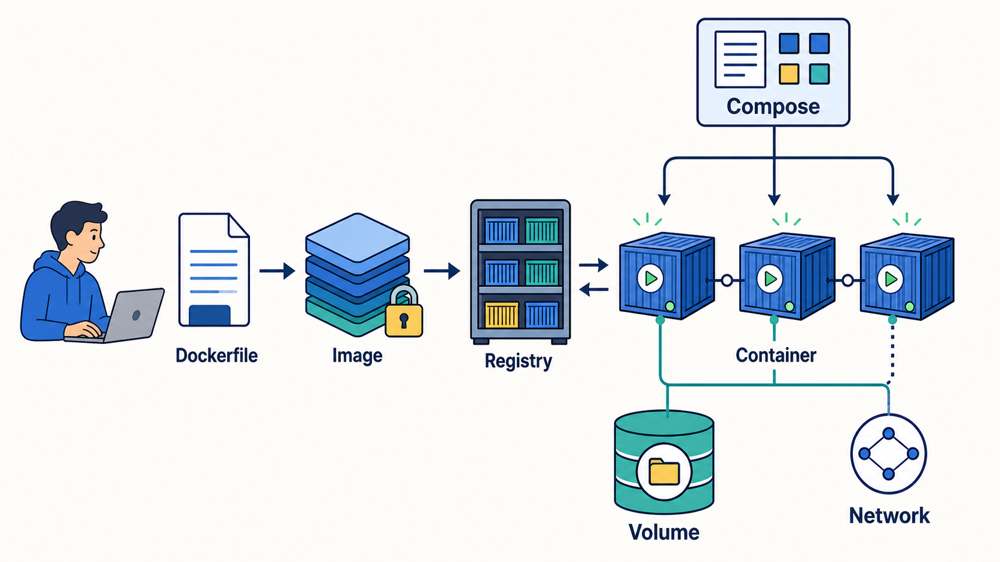

# Docker 从零入门到实践：从第一个容器到镜像构建、存储、网络、Compose 与排障

> **读者定位**：知道应用需要“安装环境后才能运行”，但还没有接触过 Docker，希望从零建立完整、可操作的知识体系。  
> **阅读主线**：先运行一个容器并观察现象 → 分清镜像、容器与仓库 → 理解 Docker 怎样完成构建和隔离 → 解决数据与通信问题 → 用 Compose 管理多容器应用 → 建立日常操作和故障排查方法。  
> **版本基线**：正文采用当前 Docker CLI、Docker Engine、BuildKit/Buildx 与 Compose Specification 的通用写法；Compose 命令统一写成 `docker compose`，不再把旧版 `docker-compose` 作为首选。  
> **示例环境**：命令以 Linux 容器为主，可在 Linux Docker Engine、macOS/Windows Docker Desktop 中执行。涉及 PowerShell 与 Bash 的差异时会单独说明。  
> **学习原则**：Docker 的重点不是背命令，而是始终回答四个问题——“从哪个镜像创建、主进程是否存活、数据写到哪里、流量怎样到达”。

---

## 先记住这段总纲

Docker 解决的核心问题，是把应用及其运行所需的文件、依赖和默认配置打包成一个可重复分发的**镜像**，再根据镜像创建相互隔离的**容器进程**。

可以先把几个最常见对象理解为：

- `Dockerfile`：怎样制作运行环境的“配方”；
- 镜像（Image）：按配方做出的、只读的标准化模板；
- 容器（Container）：镜像被启动后形成的运行实例；
- 仓库服务（Registry）：集中保存和分发镜像的服务；
- 卷（Volume）：脱离容器生命周期保存数据的空间；
- 网络（Network）：让容器彼此通信、让外部访问容器的通道；
- Docker Compose：用一份 YAML 文件描述并管理一组相互配合的容器。

它们之间最重要的关系是：

~~~mermaid
flowchart LR
    A["应用源码与依赖"] --> B["Dockerfile 构建配方"]
    B -->|"docker build"| C["Image 只读镜像"]
    C -->|"docker run"| D1["Container A 运行实例"]
    C -->|"docker run"| D2["Container B 运行实例"]
    C <-->|"push / pull"| R["Registry 镜像仓库服务"]
    D1 --- V1["Volume 持久数据"]
    D2 --- V2["Volume 持久数据"]
    D1 <-->|"Network"| D2
    P["Compose 声明整个应用"] -.管理.-> D1
    P -.管理.-> D2
    P -.创建.-> V1
    P -.创建.-> V2
~~~

上图可以浓缩成一句话：

> **Dockerfile 负责描述，镜像负责交付，容器负责运行，Registry 负责分发，Volume 负责留住数据，Network 负责连通服务，Compose 负责把它们作为一个应用统一管理。**

Docker 很有价值，但也不要把它理解成万能工具：

- 它不能自动修复应用代码中的错误；
- 它不能自动让单机应用获得高可用；
- 它不能代替数据库备份；
- 它不能仅靠“装进容器”就消除安全风险；
- Docker Compose 能很好地管理单机或开发环境中的多容器应用，但它不是完整的跨主机集群调度平台。

---

## 学习路线：为什么本文不从名词表开始

如果直接背“镜像、容器、卷、网络”，这些概念很容易互相混淆。本文先制造可以观察的现象，再逐层解释现象背后的对象。

~~~mermaid
flowchart TD
    S1["1. 运行现成容器 看到拉取、启动、端口映射"] -->
    S2["2. 建立对象模型 镜像、容器、Registry"] -->
    S3["3. 自己构建镜像 Dockerfile、层、缓存"] -->
    S4["4. 理解容器运行 主进程、生命周期、资源隔离"] -->
    S5["5. 处理状态与通信 Volume、Bind Mount、Network"] -->
    S6["6. 组织完整应用 Docker Compose"] -->
    S7["7. 进入工程使用 日志、限制、安全、发布"] -->
    S8["8. 系统排障 从客户端一直查到应用"]
~~~

初次阅读时，不必在每一个参数处停下来记忆。先顺着主线完整读一遍，再回到命令速查与排障章节实际操作，效果会更好。

## 阅读导航

| 学习阶段    | 建议章节     | 要解决的核心问题                                |
| ------- | -------- | --------------------------------------- |
| 建立直觉    | 总纲、0～3   | Docker 为什么存在，容器与虚拟机有什么不同，怎样运行第一个容器      |
| 理解对象与原理 | 4～8      | 镜像、容器、Registry 怎样关联，命令最后由哪些组件执行，容器为何退出  |
| 处理数据与通信 | 9～11     | 状态怎样保留，端口和 DNS 怎样工作，怎样注入配置并约束资源         |
| 组织与交付应用 | 12～13    | Compose 怎样描述多容器应用，镜像怎样进入 Registry 和不同环境 |
| 日常操作与排障 | 14～16    | 命令如何分类，怎样按证据定位问题，怎样从“能运行”走向“可维护”        |
| 巩固与复习   | 17～20、结语 | 通过连续练习、问答、术语表和官方资料形成长期记忆                |

---

## 0. 阅读约定与几个容易误解的词

### 0.1 Docker 既可以指平台，也可以指其中某个产品

日常交流中的“Docker”可能指：

| 说法           | 通常指什么                                           |
| ------------ | ----------------------------------------------- |
| 安装 Docker    | 安装 Docker Desktop，或在 Linux 上安装 Docker Engine    |
| Docker 命令    | `docker` 命令行客户端                                 |
| Docker 服务没启动 | Docker daemon（`dockerd`）或 Docker Desktop 后端没有运行 |
| Docker 镜像    | 符合容器镜像格式、可用于创建容器的只读包                            |
| Docker 容器    | 由镜像创建并受隔离、限制的运行进程                               |
| Docker 仓库    | 口语中可能混指 Registry 或其中的 Repository，需要结合上下文判断      |

本文在需要精确区分时，会使用 Docker CLI、Docker Engine、daemon、Registry、Repository 等完整名称。

### 0.2 “删除容器”不等于“删除镜像”

镜像和容器是不同对象：

~~~text
一个镜像
├── 容器 A：自己的进程、配置和可写层
├── 容器 B：自己的进程、配置和可写层
└── 容器 C：自己的进程、配置和可写层
~~~

删除容器，一般不会删除它所基于的镜像；删除镜像，也不会替你备份容器中的业务数据。后文会专门解释对象依赖和安全清理顺序。

### 0.3 “停止容器”与“删除容器”也不同

- 停止容器：主进程不再运行，但容器对象和它的可写层通常仍在；
- 启动已停止容器：继续使用原容器配置和可写层；
- 删除容器：容器对象及其可写层被移除；
- 命名卷：即使容器被删除，卷通常仍独立存在，除非明确删除它；
- `tmpfs`：放在内存中，容器停止后不保留。

因此，“容器停止后所有数据立刻消失”并不准确。更严谨的说法是：

> **写在容器可写层中的数据依附于该容器；停止再启动通常还在，删除并重建容器后就不应期待它还在。真正重要的数据应放到卷、绑定挂载或外部存储中。**

### 0.4 示例中的占位符

命令里的 `<CONTAINER>`、`<IMAGE>`、`<VOLUME>` 是占位符，执行时要替换，尖括号本身不要输入。例如：

~~~bash
docker logs <CONTAINER>
~~~

若容器名是 `web-demo`，实际执行：

~~~bash
docker logs web-demo
~~~

### 0.5 命令行差异

Docker CLI 在 PowerShell、CMD 和 Bash 中的主体语法相同，但以下内容属于 Shell，而不是 Docker：

- 多行续写符：Bash 常用反斜杠 `\`，PowerShell 常用反引号；
- 环境变量：Bash 使用 `$NAME`，PowerShell 使用 `$env:NAME`；
- 命令替换、引号、管道和路径展开方式不同；
- Windows 路径中的盘符和反斜杠，绑定挂载时尤其容易产生歧义。

为了便于复制，本文的 Docker 命令尽量写成单行。标为 Bash 或 PowerShell 的命令不要直接跨 Shell 照搬。

---

## 1. 为什么需要 Docker：先从“我的机器上明明能运行”说起

### 1.1 传统部署的问题不只是一句“环境不一致”

假设开发者把一个 Web 应用交给测试或运维人员，对方通常还需要知道：

- 应安装哪个语言运行时及具体版本；
- 应安装哪些系统库和第三方依赖；
- 配置文件放在哪里；
- 进程用什么用户启动；
- 监听哪个端口；
- 依赖的数据库、缓存和消息队列在哪里；
- 日志输出到哪里；
- 升级失败后怎样回到上一个版本。

如果这些条件靠口头说明、手工安装或一份长期未更新的文档维护，就很容易出现：

~~~text
开发环境：Python A + 系统库 B + 配置 C  ──► 可以运行
测试环境：Python A' + 系统库 B' + 配置 C  ──► 行为不同
生产环境：Python A'' + 遗留系统库 + 手工修改 ──► 难以复现
~~~

Docker 的思路不是把所有机器改造成完全相同，而是把应用运行所需的用户空间文件打包成镜像，并用同一套声明反复创建容器。

~~~text
源码 + 依赖 + 运行时 + 默认配置
              │
              ▼
          标准化镜像
       ┌──────┼──────┐
       ▼      ▼      ▼
      开发    测试    生产
    运行同一份镜像内容
~~~

这带来几项直接收益：

- **可重复**：同一镜像可反复创建相似的运行环境；
- **可交付**：分发镜像，而不是分发一长串安装步骤；
- **可隔离**：不同应用的进程、文件系统和网络环境可以分开；
- **可替换**：容器可以删除后按声明重新创建；
- **便于自动化**：构建、测试、推送和部署可进入 CI/CD 流程；
- **提高环境密度**：容器通常不需要为每个实例启动一套完整客户机操作系统。

### 1.2 Docker 适合哪些场景

常见适用场景包括：

- 为开发团队统一本地依赖环境；
- 在 CI 中创建一次性的构建和测试环境；
- 打包 Web 服务、后台任务、网关、数据库或中间件；
- 在同一台机器上隔离多个版本的服务；
- 快速创建和销毁演示、实验或集成测试环境；
- 用镜像作为开发、测试、生产之间的交付物；
- 为后续使用 Kubernetes、Swarm 等编排系统建立容器化基础。

### 1.3 哪些情况不要为了 Docker 而 Docker

以下场景需要先评估：

- 只是运行一个简单、稳定、已有成熟安装方式的桌面程序；
- 应用强依赖图形桌面、特殊内核模块或难以容器化的硬件；
- 团队没有容器运行、监控、备份和安全维护能力；
- 状态数据没有设计外部存储，却希望通过容器本身长期保存；
- 误以为容器天然等同于强安全沙箱；
- 只需要打包单个可执行文件，静态链接或普通安装包已经足够。

容器化本身也会引入镜像维护、Registry、网络、挂载、日志、权限和供应链安全等新问题。正确目标应是让交付和运行更可控，而不是单纯增加技术名词。

---

## 2. 容器与虚拟机：都能隔离，但隔离的层次不同

### 2.1 虚拟机通常携带自己的操作系统内核

传统虚拟机由 Hypervisor 提供虚拟硬件，每台虚拟机通常运行完整的客户机操作系统：

~~~text
物理机
└── 宿主操作系统 / Hypervisor
    ├── 虚拟机 A
    │   ├── 客户机内核
    │   └── 应用 A
    └── 虚拟机 B
        ├── 客户机内核
        └── 应用 B
~~~

这种边界通常更完整，但虚拟机镜像更大、启动更慢、每个实例需要维护自己的操作系统。

### 2.2 Linux 容器共享宿主侧的 Linux 内核

容器主要隔离进程看到的用户空间环境：

~~~text
Linux 主机内核
├── 容器 A：进程 + 根文件系统 + 网络视图 + 资源限制
├── 容器 B：进程 + 根文件系统 + 网络视图 + 资源限制
└── 主机普通进程
~~~

容器中可以看到类似 Ubuntu、Debian、Alpine 的文件和工具，但它并没有在每个容器里再启动一套独立 Linux 内核。镜像中所谓的“操作系统”，更准确地说主要是该发行版的用户空间文件。

| 对比维度 | 容器              | 虚拟机             |
| ---- | --------------- | --------------- |
| 隔离对象 | 进程及其文件、网络、资源视图  | 完整客户机系统         |
| 内核   | 同类容器通常共享宿主侧内核   | 每台虚拟机有客户机内核     |
| 启动速度 | 通常接近普通进程启动      | 通常要启动操作系统       |
| 体积   | 常见为几十 MB 到数 GB  | 常见为数 GB 或更多     |
| 资源开销 | 通常较低            | 通常较高            |
| 边界强度 | 依赖内核隔离与运行配置     | 通常具有更强的虚拟硬件边界   |
| 适用重点 | 应用交付、快速伸缩、高密度运行 | 强隔离、异构内核、完整系统环境 |

“容器比虚拟机轻量”不等于“容器在任何情况下都更好”。两者可以组合：Docker Desktop 在 Windows 或 macOS 上运行 Linux 容器时，通常先准备一个 Linux 虚拟化环境，再在其中运行 Linux 容器。

### 2.3 为什么 Windows 上可以运行 Linux 镜像

Linux 容器需要 Linux 内核能力。Windows Docker Desktop 可以借助 WSL 2、Hyper-V 等后端提供 Linux 内核环境：

~~~text
Windows
└── Docker Desktop
    └── Linux 虚拟化环境 / WSL 2 后端
        └── Linux 容器
~~~

因此：

- Windows 并不是直接把 Linux 系统调用变成 Windows 系统调用；
- Linux 容器与 Windows 容器是不同平台；
- 镜像还需要匹配 CPU 架构，例如 `linux/amd64` 与 `linux/arm64`；
- 遇到 `exec format error` 或 “no matching manifest” 时，要考虑操作系统和架构是否匹配。

---

## 3. 准备环境并运行第一个容器

### 3.1 选择安装方式

#### Windows

零基础用户通常使用 Docker Desktop，并优先采用适合大多数 Linux 容器开发场景的 WSL 2 后端。安装前先查看 [Docker Desktop for Windows 官方安装说明](https://docs.docker.com/desktop/setup/install/windows-install/)，因为受支持的 Windows、WSL 和硬件要求会变化。

可先在 PowerShell 查看或更新 WSL：

~~~powershell
wsl --version
wsl --update
~~~

安装后确认 Docker Desktop 已启动，并确认当前使用 Linux containers。

#### macOS

通常安装 Docker Desktop。macOS 本身不是 Linux 内核，Docker Desktop 会在后台提供运行 Linux 容器所需的虚拟化环境。

#### Linux

服务器通常按发行版安装 Docker Engine。应从 [Docker Engine 官方安装入口](https://docs.docker.com/engine/install/) 进入对应的 Ubuntu、Debian、CentOS、Fedora 等说明，不要长期依赖来历不明的一键脚本。

> **权限提醒**：在 Linux 上，把用户加入 `docker` 组通常意味着该用户可通过 Docker daemon 获得接近 root 的主机控制能力。它不是普通的无害用户组。个人学习环境可以按官方说明配置，生产环境应认真评估 rootless mode、权限边界和远程 API 暴露。

### 3.2 先做三个健康检查

~~~bash
docker version
docker info
docker compose version
~~~

三者关注点不同：

| 命令 | 主要确认什么 |
|---|---|
| `docker version` | 客户端版本、服务端版本，以及二者能否通信 |
| `docker info` | daemon、存储驱动、日志驱动、容器/镜像数量、运行平台等整体信息 |
| `docker compose version` | Compose 插件是否可用 |

如果 `docker version` 只显示 Client，随后提示无法连接 daemon，说明命令行客户端存在，但负责实际工作的服务端没有运行或连接目标不对。

### 3.3 运行 `hello-world`

~~~bash
docker run --rm hello-world
~~~

第一次执行时通常会看到本地找不到镜像、从 Registry 拉取镜像、创建容器、打印说明、进程退出等信息。

这一个命令背后至少发生了：

~~~mermaid
sequenceDiagram
    participant U as 用户
    participant C as Docker CLI
    participant D as Docker daemon
    participant R as Registry
    participant K as 容器进程

    U->>C: docker run --rm hello-world
    C->>D: 发送创建并运行请求
    D->>D: 检查本地镜像
    alt 本地没有镜像
        D->>R: 拉取镜像层
        R-->>D: 返回镜像内容与元数据
    end
    D->>K: 创建隔离环境并启动主进程
    K-->>U: 输出 hello-world 信息
    K-->>D: 进程退出
    D->>D: --rm，因此自动删除容器
~~~

这里的 `--rm` 表示容器停止后自动删除容器对象。镜像仍会保留在本地，所以第二次运行通常不必重新下载。

### 3.4 运行一个持续工作的 Web 容器

`hello-world` 打印完就退出，不适合观察运行状态。下面启动 Nginx：

~~~bash
docker run -d --name web-demo -p 127.0.0.1:8080:80 nginx:alpine
~~~

参数逐项解释：

| 参数 | 含义 |
|---|---|
| `docker run` | 根据镜像创建并启动一个新容器 |
| `-d` | 后台运行，命令行不持续占用当前终端 |
| `--name web-demo` | 给容器一个稳定、易读的名字 |
| `-p 127.0.0.1:8080:80` | 把主机本地地址的 8080 端口映射到容器 80 端口 |
| `nginx:alpine` | 使用 `nginx` Repository 中标签为 `alpine` 的镜像 |

浏览器访问：

~~~text
http://localhost:8080
~~~

然后观察：

~~~bash
docker ps
docker logs web-demo
docker inspect web-demo
docker port web-demo
~~~

进入容器执行一次命令：

~~~bash
docker exec web-demo nginx -v
~~~

如果需要交互式 Shell：

~~~bash
docker exec -it web-demo sh
~~~

`nginx:alpine` 通常提供 `sh`，但不一定提供 `bash`。容器镜像可以非常精简，缺少 `bash`、`curl`、`ping`、编辑器甚至包管理器都不奇怪。

退出 Shell 后停止、重新启动并删除容器：

~~~bash
docker stop web-demo
docker start web-demo
docker rm -f web-demo
~~~

最后一条使用 `-f` 会在容器仍运行时先强制处理再删除。日常更推荐先 `docker stop`，确认应用获得正常退出机会，再删除；这里只是展示语法。

### 3.5 `run`、`create` 与 `start` 的区别

~~~text
docker create IMAGE
    只创建容器，不启动

docker start CONTAINER
    启动一个已经存在的容器

docker run IMAGE
    相当于 create + start，并可附带端口、挂载、环境变量等创建配置
~~~

`docker run` 每执行一次都会创建一个**新容器**。如果只想重新启动原容器，应使用 `docker start` 或 `docker restart`，否则很容易得到多个名字不同、配置相似的容器。

---

## 4. 第一套核心概念：Dockerfile、镜像、容器与 Registry

### 4.1 Dockerfile 是可审查的构建说明

Dockerfile 是文本文件，用一条条指令描述：

- 从哪个基础镜像开始；
- 设置哪个工作目录；
- 安装哪些依赖；
- 复制哪些应用文件；
- 使用哪个用户；
- 默认执行什么命令。

它不是镜像本身，也不是启动多个服务的 Compose 文件。

~~~text
Dockerfile --docker build--> Image --docker run--> Container
~~~

### 4.2 镜像是只读模板，不是正在运行的进程

镜像包含运行容器所需的文件、二进制、库、配置和元数据。两个关键特征是：

1. **构建完成后的镜像内容按层组织，通常视为不可变**；
2. **镜像本身不运行，只有由它创建的容器进程才运行**。

“不可变”并不是说镜像文件在物理上永远不能被删除，而是说不应进入已有镜像现场修改后继续把它当成同一构建产物。要改变内容，应修改 Dockerfile 或构建上下文，再生成一个新镜像。

### 4.3 容器是镜像的运行实例

创建容器时，Docker 会在镜像只读层之上增加该容器自己的可写层，并保存运行配置：

~~~text
容器 A
┌──────────────────────────┐
│ A 的可写层：运行时改动      │
├──────────────────────────┤
│ 镜像层 3：应用代码           │
├──────────────────────────┤
│ 镜像层 2：依赖               │
├──────────────────────────┤
│ 镜像层 1：基础用户空间        │
└──────────────────────────┘

容器 B
┌──────────────────────────┐
│ B 的可写层：与 A 相互独立     │
├──────────────────────────┤
│ 共享同一组只读镜像层          │
└──────────────────────────┘
~~~

因此：

- 一个镜像可以创建多个容器；
- 多个容器可以共享镜像层，减少重复存储；
- 每个容器的进程、可写层、网络接口和运行配置可以不同；
- 在容器 A 中临时安装软件，不会自动修改镜像，也不会出现在容器 B 中；
- 删除容器 A 会删除 A 的可写层，但不会删除共享镜像层。

### 4.4 Registry、Repository、Tag 和 Digest

这四个词经常被统称为“仓库”，需要分清层次。

假设有一个完整镜像引用：

~~~text
registry.example.com/team/visitor-app:1.0
└────── Registry ──────┘ └── Repository ──┘ └Tag┘
~~~

- **Registry**：提供镜像存储、认证、上传和下载服务的系统，例如 Docker Hub 或企业私有 Registry；
- **Repository**：Registry 中一组相关镜像的逻辑集合，例如 `team/visitor-app`；
- **Tag**：Repository 中便于人阅读的标签，例如 `1.0`、`1.1`、`stable`；
- **Digest**：由内容计算出的不可变标识，常见形式为 `sha256:...`。

当引用中省略部分名称时，Docker 会使用默认值。例如：

~~~text
nginx
≈ docker.io/library/nginx:latest
~~~

这里省略了 Docker Hub 的 Registry 地址、官方镜像使用的 `library` namespace，以及默认 `latest` 标签。简写适合交互实验；需要审计和复现时，应把 Registry、Repository、版本标签乃至 digest 记录完整。

标签与摘要最关键的区别：

| 标识                       | 特点            | 适合用途       |
| ------------------------ | ------------- | ---------- |
| `visitor-app:1.0`        | 标签可以被重新指向其他内容 | 人类识别、版本约定  |
| `visitor-app@sha256:...` | 摘要与具体内容绑定     | 精确复现、供应链控制 |

`latest` 只是一个普通默认标签，不代表“自动判断出的最新稳定版”，也不保证一直指向同一内容。教学实验可以使用方便的标签，生产发布应制定不可覆盖的版本标签策略，重要环境还可以固定 digest。

### 4.5 拉取、打标签与推送

~~~bash
docker pull nginx:alpine
docker image ls
docker tag nginx:alpine registry.example.com/team/nginx-demo:1.0
docker login registry.example.com
docker push registry.example.com/team/nginx-demo:1.0
~~~

`docker tag` 不会复制整份镜像数据，它主要是给已有镜像增加一个新的引用名称。真正推送时，Registry 会按内容检查哪些层已经存在，只上传缺少的内容。

### 4.6 为什么不推荐靠 `docker commit` 制作正式镜像

`docker commit` 可以把容器可写层保存成新镜像，但操作过程难以审查和复现：

~~~text
进入容器手工修改
        │
        ▼
别人只看见结果，不知道完整步骤
~~~

正式工作流更推荐：

~~~text
修改源码 / 依赖清单 / Dockerfile
        │
        ▼
自动构建并测试
        │
        ▼
生成带版本和来源信息的镜像
~~~

`docker commit` 更适合临时实验、取证或保存调试现场，不适合作为长期构建规范。

---

## 5. Docker 的核心组件：一条命令最终由谁执行

### 5.1 客户端—服务端架构

Docker 使用客户端—服务端架构。输入 `docker run` 时，CLI 本身不会直接创建 Linux namespace，而是通过 Docker API 把请求交给 daemon。

~~~mermaid
flowchart LR
    U["用户"] --> CLI["Docker CLI docker"]
    CO["Docker Compose"] --> API["Docker API"]
    CLI --> API
    API --> D["Docker daemon dockerd"]
    D <--> REG["Registry"]
    D --> B["Buildx / BuildKit 构建镜像"]
    D --> CR["containerd 容器生命周期管理"]
    CR --> R["OCI Runtime 常见为 runc"]
    R --> K["Linux Kernel namespaces / cgroups 等"]
    D --> O["Images / Containers Networks / Volumes"]
~~~

### 5.2 Docker CLI

`docker` 是主要的人机交互入口。它可以：

- 查询镜像和容器；
- 发起构建；
- 创建、启动、停止和删除容器；
- 管理网络与卷；
- 与 Registry 交互；
- 读取日志、统计信息和检查结果。

CLI 可以连接本机 daemon，也可以通过 Docker context 或远程配置连接其他 daemon。因此“终端所在机器”和“容器实际运行机器”不一定相同。排障时要先确认当前 context 与 `DOCKER_HOST`。

### 5.3 Docker daemon（`dockerd`）

daemon 是 Docker Engine 的核心服务端，负责接收 API 请求并管理：

- 镜像；
- 容器；
- 网络；
- 卷；
- 构建与拉取操作；
- 运行时和宿主机资源之间的协调。

daemon 通常具有很高的主机权限。不要把未受保护的 Docker API 暴露在网络上，也不要随意把主机的 Docker socket 挂进普通业务容器。

### 5.4 Buildx 与 BuildKit

现代 Docker 构建通常由 Buildx 作为构建命令入口、BuildKit 作为构建后端。它们负责解析构建定义、组织依赖图、使用缓存、执行构建步骤，并输出本地镜像或推送结果。

BuildKit 相较旧式构建器的重要能力包括：

- 跳过最终结果不需要的阶段；
- 并行执行互不依赖的构建步骤；
- 更有效地传输构建上下文；
- 使用更精细的缓存；
- 支持多平台构建、缓存挂载和构建期 secret 等能力。

### 5.5 containerd 与 OCI Runtime

在常见 Linux Docker Engine 链路中：

- `dockerd` 处理 Docker API 和高层对象；
- `containerd` 管理容器生命周期、镜像内容和运行任务等；
- OCI Runtime（常见为 `runc`）按照 OCI 运行时规范创建具体容器进程。

这是理解责任分层的简化模型。Docker Desktop、不同版本和不同平台的内部实现细节可能有所差异，日常使用不需要直接操作这些内部组件。

### 5.6 namespace：限制“进程看见什么”

Linux namespace 为进程提供不同类型的隔离视图，例如：

| namespace | 隔离的主要内容 |
|---|---|
| PID | 进程编号和进程树视图 |
| NET | 网络接口、路由、端口等网络栈 |
| MNT | 挂载点和文件系统视图 |
| UTS | 主机名和域名 |
| IPC | 进程间通信资源 |
| USER | 用户与组 ID 映射 |

namespace 让容器内进程看起来像处在独立环境中，但它仍然是宿主内核调度的进程。

### 5.7 cgroup：限制和统计“进程能用多少”

Control Group（cgroup）用于对一组进程进行资源统计和限制，例如：

- CPU 时间；
- 内存；
- 进程数；
- I/O 等资源。

namespace 和 cgroup 解决的问题不同：

~~~text
namespace：你能看见哪些进程、网络和挂载？
cgroup：你最多能使用多少 CPU、内存和其他资源？
~~~

只做隔离而不设资源限制时，一个异常容器仍可能占满主机内存或 CPU。后文会给出限制示例。

### 5.8 分层文件系统

镜像由多个只读层组成，容器再叠加可写层。分层带来共享和缓存优势，但容器可写层并不适合承担数据库等重要持久数据：

- 与容器生命周期绑定；
- 宿主侧位置由存储驱动管理，不适合手工操作；
- 写时复制会带来额外语义和开销；
- 不便于备份、迁移和多个容器共享。

因此，镜像层解决“应用怎样交付”，Volume 等挂载解决“运行数据怎样保存”，不要混为一谈。

---

## 6. 自己构建第一个镜像

下面用一个小型“访问计数服务”贯穿后续章节。单独运行时它使用进程内计数；配置 Redis 后，它会把计数交给 Redis，从而演示容器通信与 Compose。

### 6.1 项目目录

~~~text
visitor-app/
├── app.py
├── requirements.txt
├── Dockerfile
└── .dockerignore
~~~

### 6.2 应用代码

`app.py`：

~~~python
import logging
import os
import socket
import threading
import time
import uuid

from flask import Flask, g, jsonify, request
from redis import Redis
from redis.exceptions import RedisError

def configure_logging() -> None:
    log_level = os.getenv("LOG_LEVEL", "INFO").upper()
    logging.basicConfig(
        level=getattr(logging, log_level, logging.INFO),
        format=(
            "%(asctime)s level=%(levelname)s logger=%(name)s "
            "message=%(message)s"
        ),
    )

configure_logging()
logger = logging.getLogger("visitor-app")
app = Flask(__name__)

redis_host = os.getenv("REDIS_HOST", "").strip()
redis_port = int(os.getenv("REDIS_PORT", "6379"))
redis_client = (
    Redis(
        host=redis_host,
        port=redis_port,
        decode_responses=True,
        socket_connect_timeout=2,
        socket_timeout=2,
    )
    if redis_host
    else None
)

counter_lock = threading.Lock()
local_counter = 0

@app.before_request
def log_request_start() -> None:
    g.request_id = request.headers.get("X-Request-ID", str(uuid.uuid4()))
    g.started_at = time.perf_counter()
    logger.info(
        "event=request_started request_id=%s method=%s path=%s remote_addr=%s",
        g.request_id,
        request.method,
        request.path,
        request.remote_addr,
    )

@app.after_request
def log_request_end(response):
    elapsed_ms = (time.perf_counter() - g.started_at) * 1000
    response.headers["X-Request-ID"] = g.request_id
    logger.info(
        "event=request_finished request_id=%s status=%s elapsed_ms=%.2f",
        g.request_id,
        response.status_code,
        elapsed_ms,
    )
    return response

def next_visit_count() -> tuple[int, str]:
    global local_counter

    if redis_client is None:
        with counter_lock:
            local_counter += 1
            count = local_counter
        logger.info("event=counter_incremented backend=memory count=%s", count)
        return count, "memory"

    count = int(redis_client.incr("visits"))
    logger.info("event=counter_incremented backend=redis count=%s", count)
    return count, "redis"

@app.get("/")
def index():
    try:
        count, backend = next_visit_count()
        return jsonify(
            message="Hello from Docker",
            visits=count,
            counter_backend=backend,
            hostname=socket.gethostname(),
        )
    except RedisError:
        logger.exception(
            "event=redis_operation_failed host=%s port=%s",
            redis_host,
            redis_port,
        )
        return jsonify(error="counter backend unavailable"), 503

@app.get("/health")
def health():
    if redis_client is None:
        return jsonify(status="healthy", counter_backend="memory"), 200

    try:
        redis_client.ping()
        return jsonify(status="healthy", counter_backend="redis"), 200
    except RedisError:
        logger.exception(
            "event=healthcheck_failed dependency=redis host=%s port=%s",
            redis_host,
            redis_port,
        )
        return jsonify(status="unhealthy", dependency="redis"), 503
~~~

代码中的日志刻意记录了：

- 请求何时开始；
- 请求 ID、方法、路径和来源地址；
- 使用了内存还是 Redis；
- 计数结果；
- 请求状态码和耗时；
- Redis 操作或健康检查失败时的异常堆栈。

容器应用最好把普通日志写到标准输出、错误日志写到标准错误，由 Docker 日志驱动收集，而不是只写容器内部某个难以持久化的文件。

### 6.3 依赖清单

`requirements.txt`：

~~~text
Flask>=3.1,<4.0
redis>=6.0,<7.0
gunicorn>=23.0,<24.0
~~~

为了让示例在同一大版本内更容易安装，这里使用版本范围。正式项目应通过锁文件、精确版本或哈希固定依赖，并建立依赖更新流程。

### 6.4 Dockerfile

~~~dockerfile
# syntax=docker/dockerfile:1
FROM python:3.13-slim-bookworm

ARG APP_UID=10001

ENV PYTHONDONTWRITEBYTECODE=1 \
    PYTHONUNBUFFERED=1 \
    PORT=8000

WORKDIR /app

RUN groupadd --gid $APP_UID appuser \
    && useradd --uid $APP_UID --gid appuser --no-create-home appuser

COPY requirements.txt ./
RUN pip install --no-cache-dir -r requirements.txt

COPY --chown=appuser:appuser app.py ./

USER appuser

EXPOSE 8000

HEALTHCHECK --interval=10s --timeout=3s --start-period=10s --retries=3 \
    CMD ["python", "-c", "import urllib.request; urllib.request.urlopen('http://127.0.0.1:8000/health', timeout=2).read()"]

CMD ["gunicorn", "--bind=0.0.0.0:8000", "--workers=2", "--access-logfile=-", "--error-logfile=-", "app:app"]
~~~

> **平台提示**：基础镜像标签会随时间变化。若该教学标签不再存在，应从官方镜像页面选择仍受支持的 Python 版本；生产环境还应评估固定 digest，而不是永远依赖可变标签。

### 6.5 `.dockerignore`

~~~gitignore
.git
.gitignore
.venv
__pycache__
*.pyc
*.log
.env
.idea
.vscode
README.md
~~~

`.dockerignore` 的作用是把无关或敏感文件排除在构建上下文之外。它不仅影响镜像最终内容，还影响发送给构建器的数据量和缓存计算。

### 6.6 构建镜像

在 `visitor-app` 目录执行：

~~~bash
docker build --progress=plain -t docker-learning/visitor-app:1.0 .
~~~

最后的点 `.` 表示当前目录是**构建上下文**。Dockerfile 中的 `COPY` 只能读取上下文内、且没有被 `.dockerignore` 排除的文件。

检查结果：

~~~bash
docker image ls docker-learning/visitor-app
docker image inspect docker-learning/visitor-app:1.0
docker image history docker-learning/visitor-app:1.0
~~~

### 6.7 运行镜像

~~~bash
docker run -d --name visitor-app -p 127.0.0.1:8000:8000 docker-learning/visitor-app:1.0
~~~

PowerShell 请求：

~~~powershell
Invoke-RestMethod http://localhost:8000/
Invoke-RestMethod http://localhost:8000/health
~~~

Bash 或已提供 curl 的终端：

~~~bash
curl http://localhost:8000/
curl http://localhost:8000/health
~~~

查看详细日志和健康状态：

~~~bash
docker logs --tail 100 -f visitor-app
docker inspect --format '{{json .State.Health}}' visitor-app
~~~

停止并删除：

~~~bash
docker stop visitor-app
docker rm visitor-app
~~~

### 6.8 逐条理解 Dockerfile

| 指令 | 核心作用 | 初学者常见误解 |
|---|---|---|
| `FROM` | 选择基础镜像，并开始一个构建阶段 | 基础镜像不是正在运行的容器 |
| `ARG` | 定义构建期变量 | 默认不会成为运行时环境变量，也不适合保存秘密 |
| `ENV` | 写入镜像默认运行环境 | 会进入镜像元数据，不应放密码 |
| `WORKDIR` | 设置后续指令和默认运行目录 | 比反复 `cd` 更明确 |
| `COPY` | 从构建上下文复制文件 | 不能随意复制上下文外路径 |
| `RUN` | 在构建阶段执行命令并形成层 | 不是容器每次启动都执行 |
| `USER` | 设置后续构建及默认运行用户 | 不写往往以 root 运行 |
| `EXPOSE` | 声明应用预期监听的容器端口 | 不会自动把端口发布到主机 |
| `HEALTHCHECK` | 定义怎样判断容器内服务是否健康 | 健康不等于进程一定退出或自动重启 |
| `CMD` | 提供容器默认命令或默认参数 | 可被 `docker run IMAGE ...` 覆盖 |
| `ENTRYPOINT` | 定义更固定的入口程序 | 与 `CMD` 的组合语义要分清 |
| `VOLUME` | 声明运行时挂载点 | 在 Dockerfile 中滥用会产生不易管理的匿名卷 |
| `ADD` | 具有额外的自动解包等语义 | 普通文件复制优先使用意图更明确的 `COPY` |

### 6.9 `RUN`、`CMD`、`ENTRYPOINT` 不要混

~~~text
RUN：构建镜像时执行
CMD：容器启动时使用的默认命令或参数
ENTRYPOINT：容器启动时较固定的入口程序
~~~

例如：

~~~dockerfile
ENTRYPOINT ["python"]
CMD ["app.py"]
~~~

默认运行 `python app.py`。如果执行：

~~~bash
docker run <IMAGE> --version
~~~

容器实际执行 `python --version`。

如果镜像只有：

~~~dockerfile
CMD ["python", "app.py"]
~~~

那么 `docker run <IMAGE> python --version` 会整体覆盖原 `CMD`。

### 6.10 exec 形式与 shell 形式

推荐主进程优先使用 JSON 数组形式：

~~~dockerfile
CMD ["gunicorn", "--bind=0.0.0.0:8000", "app:app"]
~~~

而不是：

~~~dockerfile
CMD gunicorn --bind=0.0.0.0:8000 app:app
~~~

前者通常直接启动目标程序，参数边界明确，信号处理也更自然；后者会经由 shell 解释，环境变量展开和信号传递语义不同。确实需要管道、重定向或变量展开时可以使用 shell，但应明确知道原因。

---

## 7. 镜像为什么分层：构建缓存、体积与可复现性

### 7.1 每条构建指令与层

可以把镜像想象成按顺序叠放的文件系统变更：

~~~text
FROM python:3.13-slim
        │ 基础镜像层
COPY requirements.txt
        │ 依赖清单变更层
RUN pip install ...
        │ 安装依赖层
COPY app.py
        │ 应用代码层
        ▼
最终镜像
~~~

实际存储和元数据比这张图更复杂，但这个模型足以解释缓存：当前一步及其依赖输入没有变化时，构建器可以复用已有结果；一旦某一步失效，依赖它的后续步骤通常也需要重新执行。

### 7.2 为什么先复制依赖清单，再复制源码

下面的顺序更利于缓存：

~~~dockerfile
COPY requirements.txt ./
RUN pip install --no-cache-dir -r requirements.txt
COPY app.py ./
~~~

应用代码经常变化，但依赖清单变化较少。只修改 `app.py` 时，安装依赖的层仍可能复用。

如果先复制整个项目：

~~~dockerfile
COPY . .
RUN pip install --no-cache-dir -r requirements.txt
~~~

任何被复制文件变化，都可能使后面的依赖安装缓存失效。

### 7.3 缓存不是“Docker 没发现我的修改”

构建器会根据指令和输入判断缓存是否可复用。排查构建结果异常时，可观察详细日志：

~~~bash
docker build --progress=plain -t docker-learning/visitor-app:1.0 .
~~~

需要完整重建时：

~~~bash
docker build --no-cache -t docker-learning/visitor-app:1.0 .
~~~

`--no-cache` 只是不复用构建缓存，不保证重新拉取基础镜像。若还要检查更新后的基础镜像：

~~~bash
docker build --pull --no-cache -t docker-learning/visitor-app:1.0 .
~~~

不应把 `--no-cache` 当作日常默认参数。正确的 Dockerfile 顺序和依赖锁定，比每次放弃缓存更重要。

### 7.4 删除文件不一定能让历史层变小

如果先在一层加入 500 MB 文件，再在下一层删除：

~~~dockerfile
RUN download-a-large-file
RUN rm large-file
~~~

最终可见文件虽然消失，但早期只读层可能仍保存其内容。应尽量在同一 `RUN` 中下载、使用并清理临时文件，或者使用多阶段构建。

### 7.5 多阶段构建

多阶段构建用多个 `FROM` 分离“编译环境”和“运行环境”，最后只复制运行需要的产物。

一个简化的 C++ 示例：

~~~dockerfile
# syntax=docker/dockerfile:1
FROM gcc:14 AS build

WORKDIR /src
COPY . .
RUN g++ -std=c++20 -O2 -Wall -Wextra -o /out/server main.cpp

FROM debian:bookworm-slim AS runtime

RUN groupadd --gid 10001 appuser \
    && useradd --uid 10001 --gid appuser --no-create-home appuser

COPY --from=build /out/server /usr/local/bin/server

USER appuser
ENTRYPOINT ["/usr/local/bin/server"]
~~~

最终阶段不包含 GCC、源码和编译中间文件，因此通常更小，攻击面也更低。

~~~mermaid
flowchart LR
    S["源码"] --> B["build 阶段 编译器 + 头文件 + 构建工具"]
    B --> A["可执行文件"]
    A --> R["runtime 阶段 仅运行时依赖"]
    B -.不进入最终镜像.-> X["编译器与中间文件"]
~~~

### 7.6 选择基础镜像时不要只看体积

较小镜像通常有下载快、攻击面小等优点，但也可能带来：

- 缺少常见诊断工具；
- C/C++ 运行库不同；
- DNS、证书、时区或字符集配置更精简；
- 原生扩展编译更困难；
- 团队不熟悉该发行版的包管理和安全更新方式。

选择时应综合考虑：

- 官方维护状态；
- CPU 架构和操作系统兼容；
- libc 等运行时兼容性；
- 安全更新节奏；
- 镜像体积；
- 调试与运维成本。

`alpine` 很小，但不代表它对每个应用都是最佳选择。

### 7.7 构建时不要把秘密写进镜像

以下做法不安全：

~~~dockerfile
ARG TOKEN
ENV API_TOKEN=secret-value
RUN echo "password" > /app/password.txt
~~~

即使后续删除，秘密仍可能出现在镜像层、构建缓存、历史或元数据中。需要在构建时访问私有依赖时，应使用 BuildKit secret 等专门机制；运行时秘密应由部署平台以 secret 文件或受控注入方式提供，而不是写进 Dockerfile、源码、`.env` 或公开 Compose 文件。

---

## 8. 容器怎样运行与退出：主进程决定生命周期

### 8.1 容器不是一台需要“开机”的小虚拟机

启动容器的核心动作，是在隔离环境中启动一个主进程。这个主进程通常是容器内 PID 1：

~~~text
容器
└── PID 1：主进程
    ├── 工作进程 A
    ├── 工作进程 B
    └── 工作进程 C
~~~

主进程存在，容器通常处于运行状态；主进程退出，容器就进入已退出状态。即使主进程曾经启动过后台子进程，也不能靠“容器里好像还有任务”维持容器生命周期。

这解释了初学者常见的困惑：

~~~bash
docker run ubuntu:24.04
~~~

它可能很快退出。原因不是 Ubuntu 安装失败，而是镜像的默认命令没有持续前台运行，或者没有交互输入，主进程结束了。

若要启动交互式 Shell：

~~~bash
docker run --rm -it ubuntu:24.04 bash
~~~

这里：

- `-i` 保持标准输入打开；
- `-t` 分配伪终端；
- `bash` 覆盖镜像默认命令；
- 退出 Bash 后主进程结束，容器退出；
- `--rm` 再自动删除已退出容器。

### 8.2 容器状态流转

~~~mermaid
stateDiagram-v2
    [*] --> Created: docker create
    Created --> Running: docker start
    Running --> Paused: docker pause
    Paused --> Running: docker unpause
    Running --> Exited: 主进程结束 / docker stop
    Exited --> Running: docker start
    Running --> Restarting: restart policy
    Restarting --> Running: 重启成功
    Restarting --> Exited: 重启失败或停止
    Created --> Removed: docker rm
    Exited --> Removed: docker rm
    Running --> Removed: docker rm -f
    Removed --> [*]
~~~

常用查询：

~~~bash
docker ps
docker ps -a
docker inspect --format '{{.State.Status}}' <CONTAINER>
docker inspect --format '{{.State.ExitCode}}' <CONTAINER>
docker inspect --format '{{.State.OOMKilled}}' <CONTAINER>
~~~

`docker ps` 默认只列运行中的容器。排查“容器不见了”时，第一反应应是 `docker ps -a`，因为它可能只是退出了。

### 8.3 `stop`、`kill`、`restart` 的差异

在 Linux 容器的常见语义中：

~~~text
docker stop
  先请求主进程正常终止
  等待宽限时间
  超时后再强制终止

docker kill
  默认直接发送强制终止信号

docker restart
  停止后再次启动同一个容器
~~~

正常退出很重要，因为应用可能需要：

- 停止接收新请求；
- 完成正在处理的请求；
- 刷新缓冲区；
- 提交或回滚事务；
- 关闭数据库连接；
- 释放锁；
- 写入退出日志。

可以设置停止等待时间：

~~~bash
docker stop --time 30 <CONTAINER>
~~~

应用也必须正确处理终止信号。若入口脚本吞掉信号，或者主程序不是实际 PID 1，容器可能直到超时才被强制终止。使用 Dockerfile 的 exec 形式、让入口脚本用 `exec` 交接主进程，或在需要时使用 `--init`，都有助于改善信号和僵尸子进程处理。

### 8.4 退出码能提供什么线索

| 退出码 | 常见含义 | 仍需确认什么 |
|---|---|---|
| `0` | 程序认为自己正常完成 | 它是否本来就应长期运行 |
| `1` | 通用应用错误 | 查看应用日志和启动参数 |
| `126` | 命令存在但无法执行 | 权限、挂载 `noexec`、解释器 |
| `127` | 找不到命令 | 镜像内是否存在命令、PATH 是否正确 |
| `137` | 常见于收到 SIGKILL | 是否 OOM、人工 kill 或超时强杀 |
| `143` | 常见于收到 SIGTERM 后退出 | 是否正常执行了停止流程 |

退出码只是线索，不是完整结论。看到 `137` 时应继续检查：

~~~bash
docker inspect --format '{{.State.OOMKilled}}' <CONTAINER>
docker inspect --format '{{.State.Error}}' <CONTAINER>
docker logs --tail 200 <CONTAINER>
docker stats --no-stream
~~~

### 8.5 `exec` 与 `attach`

`docker exec` 在运行中的容器里启动一个**新进程**：

~~~bash
docker exec <CONTAINER> env
docker exec -it <CONTAINER> sh
~~~

`docker attach` 则把当前终端附着到容器已有主进程的标准输入输出。使用 `attach` 时，按键可能直接影响主进程，退出方式也容易误伤容器，因此日常诊断更常用 `logs` 和 `exec`。

需要牢记：

- `exec` 只在容器运行时可用；
- exec 启动的进程不是镜像内容；
- 在 exec Shell 里手工改文件，只改当前容器可写层；
- 容器被删除重建后，这些现场修改会消失；
- 精简镜像没有 Shell 时，`docker exec -it ... sh` 也会失败。

### 8.6 不要默认在容器里运行 SSH

日常进入容器通常使用 `docker exec`，不需要给每个容器安装 SSH 服务。额外运行 SSH 会增加：

- 用户、密钥和端口管理；
- 长期驻留进程；
- 镜像体积；
- 攻击面；
- “登录机器手改现场”的不可复现操作。

如果生产环境不允许直接 exec，应通过受审计的运维平台、临时调试容器、日志和指标系统处理，而不是把容器重新变回需要人工维护的传统服务器。

### 8.7 容器应该可替换，而不是不可触碰

比较健康的部署模型是：

~~~text
配置或代码改变
    │
    ▼
构建新镜像
    │
    ▼
创建新容器并验证
    │
    ▼
切换流量
    │
    ▼
删除旧容器
~~~

重要状态放在 Volume、数据库或其他外部服务中，容器本身则尽量能够被停止、删除和重新创建。这种“可替换”不是要求应用完全没有状态，而是把**应用进程生命周期**与**重要数据生命周期**分开。

---

## 9. 数据放在哪里：容器可写层、Volume、Bind Mount 与 tmpfs

### 9.1 先按数据生命周期选择位置

容器里看到的路径，背后可能来自四种不同位置：

| 位置 | 数据由谁管理 | 容器删除后 | 典型用途 |
|---|---|---|---|
| 容器可写层 | Docker 存储驱动 | 随容器移除 | 临时运行文件、可丢弃缓存 |
| 命名 Volume | Docker | 默认保留 | 数据库数据、上传文件、持久状态 |
| Bind Mount | 主机文件系统 | 主机文件仍在 | 开发源码、明确的主机配置、证书 |
| `tmpfs` | 主机内存 | 不保留 | 临时秘密、中间数据、高速临时文件 |

无论背后是哪一种，应用在容器内看到的仍然是普通文件或目录。例如，数据库始终访问 `/var/lib/postgresql/data`，但该路径可以映射到 Volume。

较新的 Docker 还支持把另一个镜像以只读方式挂载为 **image mount**；Windows 场景也可能使用 named pipe。它们分别面向只读工具/资源复用和特定进程间通信，不是初学阶段保存普通业务数据的默认选择。

### 9.2 为什么数据库不能只写容器可写层

假设数据库把数据写在容器可写层：

~~~text
数据库容器
┌──────────────────────┐
│ 可写层：业务数据        │  ← 与该容器绑定
├──────────────────────┤
│ 数据库镜像只读层        │
└──────────────────────┘
~~~

升级镜像时常见做法是删除旧容器、创建新容器。新容器有新的可写层，不会自动继承旧容器的数据。更合理的结构是：

~~~text
数据库容器 A ──挂载──┐
                     ├── 命名 Volume：业务数据
数据库容器 B ──挂载──┘
   （先停 A，再按迁移流程启动 B）
~~~

这里表示 Volume 可以独立于容器存在，不代表两个不支持共享写入的数据库实例可以同时安全写同一目录。是否允许并发挂载，必须遵守具体应用和存储驱动的规则。

### 9.3 命名 Volume

创建并查看卷：

~~~bash
docker volume create redis-data
docker volume ls
docker volume inspect redis-data
~~~

让 Redis 把数据写进卷：

~~~bash
docker run -d --name redis-demo --mount type=volume,src=redis-data,dst=/data redis:7.4-alpine redis-server --appendonly yes
~~~

删除容器后，命名卷仍在：

~~~bash
docker rm -f redis-demo
docker volume ls
~~~

使用相同卷创建新容器：

~~~bash
docker run -d --name redis-demo-2 --mount type=volume,src=redis-data,dst=/data redis:7.4-alpine redis-server --appendonly yes
~~~

命名卷的优点：

- 生命周期独立于单个容器；
- 不必在应用配置中依赖具体主机目录；
- 可以由 Docker 的 Volume driver 对接本地或外部存储；
- 容易通过名称在 Compose 中声明和复用；
- 通常比直接操作容器可写层更适合持久数据。

不要手工进入 Docker 数据目录修改卷内部文件。卷的宿主侧位置属于 Docker 管理细节，直接修改可能破坏权限、元数据或一致性。

### 9.4 匿名 Volume

如果只写目标路径而没有给卷命名，Docker 可能创建随机 ID 的匿名卷：

~~~bash
docker run -d --name anonymous-demo -v /data redis:7.4-alpine
~~~

匿名卷也能独立于普通容器删除操作保留，但不易识别和复用，长期容易形成“这个随机卷属于谁”的问题。正式配置更推荐命名卷。

`docker run --rm` 在自动删除容器时会处理该容器关联的匿名卷，但不会删除显式指定的命名卷。

### 9.5 Bind Mount

Bind Mount 把一个明确的主机路径直接映射到容器路径：

~~~text
主机 D:\project 或 /home/user/project
              │
              ▼
容器 /workspace
~~~

典型用途：

- 本地开发时把源码映射进容器；
- 向容器提供由主机管理的配置；
- 挂载证书、静态资源或日志目录；
- 需要主机普通程序与容器共同访问同一文件。

Bash 示例：

~~~bash
docker run --rm --mount type=bind,src="$(pwd)",dst=/workspace,readonly alpine:3.21 ls -la /workspace
~~~

PowerShell 示例：

~~~powershell
docker run --rm --mount "type=bind,src=$($PWD.Path),dst=/workspace,readonly" alpine:3.21 ls -la /workspace
~~~

Docker Desktop 需要能访问该主机路径。路径含空格时必须正确引用；Windows、WSL 与 Linux 容器之间还可能存在文件权限、大小写、换行和 I/O 性能差异。

Bind Mount 的风险也更直接：

- 容器可读写主机文件；
- 容器内删除可能就是删除主机文件；
- 主机目录结构变化会使部署失败；
- 主机 UID/GID 或 Windows 权限可能与容器用户不匹配；
- 同一配置移到另一台机器时，路径未必存在。

只需读取时应显式设为只读：

~~~bash
--mount type=bind,src=<HOST_PATH>,dst=<CONTAINER_PATH>,readonly
~~~

### 9.6 `--mount` 与 `-v`

两种写法都常见：

~~~bash
docker run --mount type=volume,src=my-data,dst=/data <IMAGE>
docker run -v my-data:/data <IMAGE>
~~~

| 对比 | `--mount` | `-v` / `--volume` |
|---|---|---|
| 可读性 | 键值形式，意图清楚 | 短，但位置参数容易看错 |
| 类型 | 明确写 `type=volume/bind/tmpfs` | 根据冒号左侧推断 |
| Bind 源路径不存在 | 通常直接报错 | 某些情形会自动创建目录，容易掩盖拼写错误 |
| 复杂选项 | 更容易表达 | 简写更方便 |

教程与运维脚本优先使用 `--mount`，日常简单命令可以识别 `-v`。

### 9.7 挂载会遮住镜像原有内容

如果镜像中的 `/app/config` 已有文件，再把空目录挂载到同一路径：

~~~text
挂载前：看到镜像中的 /app/config/*
挂载后：看到挂载源中的内容
        镜像原内容被遮住，并非真的删除
~~~

这会造成“镜像里明明有文件，运行后却不见了”的现象。排查时检查：

~~~bash
docker inspect --format '{{json .Mounts}}' <CONTAINER>
~~~

命名卷第一次挂载到镜像内非空目录时，还可能发生已有内容向空卷复制的行为；可以使用相应选项禁用。不要把这种初始化副作用当成通用的数据迁移机制。

### 9.8 tmpfs

在 Linux 容器中，`tmpfs` 把数据放在内存中：

~~~bash
docker run --rm --mount type=tmpfs,dst=/run/temp,tmpfs-size=64m alpine:3.21 sh -c "echo transient > /run/temp/value && cat /run/temp/value"
~~~

适合：

- 明确不需要持久化的临时文件；
- 减少敏感临时数据落盘；
- 可丢弃的高速中间数据。

不适合：

- 数据库正式数据；
- 希望容器重启后仍存在的文件；
- 可能无限增长而没有内存限制的数据。

### 9.9 权限问题通常是 UID/GID 问题

容器内用户看到的 UID/GID 与挂载源权限必须相容。常见现象：

~~~text
容器进程以 UID 10001 运行
主机目录只允许 UID 1000 写入
                │
                ▼
        Permission denied
~~~

排查：

~~~bash
docker inspect --format '{{.Config.User}}' <CONTAINER>
docker exec <CONTAINER> id
docker exec <CONTAINER> ls -ld <MOUNT_PATH>
docker inspect --format '{{json .Mounts}}' <CONTAINER>
~~~

修复应优先从所有权、组权限、ACL、容器用户和挂载模式入手，不要一看到错误就使用 `chmod 777` 或让应用改成 root。

### 9.10 备份 Volume 时要保证应用一致性

文件级备份示例：

~~~bash
docker run --rm --mount type=volume,src=redis-data,dst=/source,readonly --mount type=bind,src=<ABSOLUTE_BACKUP_DIR>,dst=/backup alpine:3.21 sh -c "tar czf /backup/redis-data-backup.tgz -C /source ."
~~~

恢复到新卷：

~~~bash
docker volume create redis-data-restored
docker run --rm --mount type=volume,src=redis-data-restored,dst=/target --mount type=bind,src=<ABSOLUTE_BACKUP_DIR>,dst=/backup,readonly alpine:3.21 sh -c "tar xzf /backup/redis-data-backup.tgz -C /target"
~~~

但“成功打包目录”不等于“业务数据一致”。数据库正在写入时直接复制底层文件，可能得到不可用备份。正式环境应：

1. 使用数据库自身的逻辑备份、物理备份或快照协调机制；
2. 明确暂停写入、刷盘或进入备份模式的要求；
3. 加密并限制备份访问；
4. 定期执行恢复演练；
5. 记录数据版本、应用版本和恢复步骤。

Volume 负责持久化，不等于备份，更不等于异地容灾。

### 9.11 删除数据前必须分清对象

以下命令具有明显的数据删除风险：

~~~bash
docker volume rm <VOLUME>
docker volume prune
docker volume prune -a
docker system prune --volumes
docker compose down -v
~~~

执行前至少检查：

~~~bash
docker volume inspect <VOLUME>
docker ps -a --filter volume=<VOLUME>
docker system df -v
~~~

当前 Docker 中，`docker volume prune` 默认清理没有被任何容器引用的匿名卷；加 `-a` 后，未被容器引用的命名卷也会进入清理范围。`docker system prune --volumes` 额外清理的是未使用匿名卷，不会因此清理所有命名卷。无论哪一种，Docker 只判断“是否仍被容器引用”，并不知道其中数据对业务是否重要。

---

## 10. 容器怎样通信：先分清四条方向

网络问题最容易因为“都是一个端口”而混乱。先区分四条路径：

~~~mermaid
flowchart LR
    EXT["外部客户端"] -->|"访问主机 IP:已发布端口"| HOST["Docker 主机"]
    HOST -->|"端口映射"| WEB["web 容器:8000"]
    WEB -->|"服务名 redis:6379"| REDIS["redis 容器:6379"]
    WEB -->|"host.docker.internal 适用时"| HS["主机上的服务"]
    WEB -->|"默认允许出站"| NET["互联网 / 外部服务"]
~~~

对应四个问题：

1. 外部或主机怎样访问容器；
2. 同一主机上的容器怎样互相访问；
3. 容器怎样访问主机上的服务；
4. 容器怎样访问互联网或外部网络。

### 10.1 `localhost` 永远先指“当前网络环境中的自己”

在主机执行：

~~~text
http://localhost:8000
~~~

`localhost` 指主机。

在 Web 容器里连接：

~~~text
localhost:6379
~~~

`localhost` 指 Web 容器自己，不是 Redis 容器，也不是主机。

这是容器通信中最常见的错误之一：

~~~text
web 容器
├── localhost:8000  → web 容器自己的 8000
└── redis:6379      → 同一自定义网络中的 redis 容器
~~~

### 10.2 端口发布的方向

语法：

~~~text
-p [HOST_IP:]HOST_PORT:CONTAINER_PORT[/PROTOCOL]
~~~

例如：

~~~bash
docker run -d -p 127.0.0.1:8080:80 nginx:alpine
~~~

含义是：

~~~text
主机 127.0.0.1:8080 ──转发──► 容器:80
~~~

不是“容器 8080 映射到主机 80”。记忆方式是：

> **冒号左边属于主机，右边属于容器。**

### 10.3 `EXPOSE` 不等于 `-p`

Dockerfile：

~~~dockerfile
EXPOSE 8000
~~~

主要用于声明镜像中的应用预期监听 8000 端口，便于阅读和工具理解。它不会自动让主机访问该端口。

真正发布需要：

~~~bash
docker run -p 8000:8000 <IMAGE>
~~~

`-P` 可以把镜像声明的端口发布到随机主机端口：

~~~bash
docker run -d -P <IMAGE>
docker port <CONTAINER>
~~~

### 10.4 绑定到 `127.0.0.1` 与 `0.0.0.0`

~~~bash
-p 127.0.0.1:8000:8000
~~~

通常只允许从 Docker 主机本地访问。

~~~bash
-p 8000:8000
~~~

省略主机 IP 时通常绑定所有主机接口，即 `0.0.0.0`，若主机可被外网访问，就可能把服务暴露出去。

开发数据库、管理后台或调试端口没有远程访问需求时，优先绑定 `127.0.0.1`。生产暴露还需要结合主机防火墙、云安全组、反向代理、TLS 和认证设计。不能因为“容器有网络隔离”就忽略已发布端口。

### 10.5 容器内应用要监听可到达的地址

即使配置了 `-p 8000:8000`，如果应用只监听容器内 `127.0.0.1:8000`，转发到容器网络接口的流量仍可能被拒绝。

容器化 Web 服务通常监听：

~~~text
0.0.0.0:8000
~~~

然后由 Docker 的发布规则决定哪些主机接口可以访问。两层不要混：

~~~text
应用监听地址：容器内部是否接受来自容器网络接口的连接
端口发布地址：主机哪些接口把流量转给容器
~~~

### 10.6 默认 bridge 与用户自定义 bridge

Docker Engine 启动时通常有一个默认 `bridge` 网络。更推荐为应用创建用户自定义 bridge：

~~~bash
docker network create app-net
~~~

启动 Redis：

~~~bash
docker run -d --name redis --network app-net --mount type=volume,src=redis-data,dst=/data redis:7.4-alpine redis-server --appendonly yes
~~~

启动前文构建的应用：

~~~bash
docker run -d --name visitor-app --network app-net -e REDIS_HOST=redis -e REDIS_PORT=6379 -p 127.0.0.1:8000:8000 docker-learning/visitor-app:1.0
~~~

应用连接地址是 `redis:6379`。用户自定义网络提供容器名或网络别名的 DNS 解析，因此不应把 Redis 容器的动态 IP 写进配置。

验证：

~~~bash
docker network inspect app-net
docker logs --tail 100 visitor-app
~~~

在主机请求几次：

~~~powershell
Invoke-RestMethod http://localhost:8000/
Invoke-RestMethod http://localhost:8000/
~~~

返回的 `counter_backend` 应为 `redis`，计数保存在 Redis Volume 中。

### 10.7 容器互访通常使用容器端口，不使用主机发布端口

Web 与 Redis 在同一网络中时：

~~~text
正确：web ──► redis:6379
错误：web ──► localhost:6379
通常不必：web ──► 主机IP:主机发布端口
~~~

Redis 只供应用内部访问时，不必使用 `-p` 暴露给主机。少发布一个端口，就少一个外部入口。

### 10.8 一个容器可以连接多个网络

例如把反向代理、应用和数据库分层：

~~~mermaid
flowchart LR
    C["客户端"] --> P["proxy"]
    subgraph FRONT["front-net"]
        P <--> A["app"]
    end
    subgraph BACK["back-net"]
        A <--> D["database"]
    end
~~~

`proxy` 不加入 `back-net`，数据库不加入 `front-net`。只有 `app` 同时连接两个网络，从网络拓扑上减少不必要的可达关系。

~~~bash
docker network create front-net
docker network create back-net
docker network connect back-net <APP_CONTAINER>
docker network disconnect back-net <APP_CONTAINER>
~~~

网络分段是安全的一部分，但不能替代应用认证、数据库授权和主机防火墙。

### 10.9 容器访问主机

Docker Desktop 通常提供：

~~~text
host.docker.internal
~~~

让容器访问宿主侧服务。例如主机数据库监听允许的接口时，容器可以配置为 `host.docker.internal:5432`。

Linux Docker Engine 上可按环境使用：

~~~bash
docker run --add-host host.docker.internal:host-gateway <IMAGE>
~~~

仍需同时确认：

- 主机应用不是只监听对容器不可达的回环地址；
- 主机防火墙允许来自 Docker 网络的流量；
- 服务认证允许该来源；
- 不把主机网关地址硬编码进镜像。

### 10.10 常见网络驱动

| 驱动 | 核心作用 | 常见场景 |
|---|---|---|
| `bridge` | 同一 Docker 主机内的隔离网络 | 单机应用、Compose 默认网络 |
| `host` | 共享主机网络栈，弱化网络隔离 | 对网络开销或端口语义有特殊要求的 Linux 场景 |
| `none` | 不配置常规网络连接 | 完全离线的任务 |
| `overlay` | 跨多个 Docker daemon 建立覆盖网络 | Docker Swarm 多主机服务 |
| `macvlan` | 让容器像局域网中的独立设备 | 需要独立二层地址的特殊系统 |
| `ipvlan` | 以不同方式接入现有 IP 网络 | 对二层规模或网络策略有特定要求 |

初学和大多数单机 Compose 应用，先掌握用户自定义 `bridge`。`overlay`、`macvlan`、`ipvlan` 都有额外网络前提，不应仅凭名称选择。

### 10.11 网络排查不要依赖容器 IP

容器重建后 IP 可能变化。诊断时可以查看 IP，但配置应优先使用服务名：

~~~bash
docker inspect --format '{{json .NetworkSettings.Networks}}' <CONTAINER>
docker network inspect <NETWORK>
docker exec <CONTAINER> getent hosts <SERVICE_NAME>
docker exec <CONTAINER> cat /etc/resolv.conf
~~~

若业务镜像没有 `getent`、`nslookup` 或 `curl`，不要急着在生产容器中安装。可以启动连接同一网络的临时诊断容器：

~~~bash
docker run --rm --network app-net busybox:stable nslookup redis
docker run --rm --network app-net busybox:stable wget -qO- http://visitor-app:8000/health
~~~

---

## 11. 运行配置、资源限制、健康检查与日志

### 11.1 镜像保存默认值，环境提供差异值

同一镜像进入开发、测试和生产时，差异通常来自：

- 环境变量；
- 配置文件挂载；
- secret；
- 命令行参数；
- 网络地址；
- 资源限制；
- 平台提供的服务发现。

理想结构是：

~~~text
同一镜像
├── 开发配置 → 开发容器
├── 测试配置 → 测试容器
└── 生产配置 → 生产容器
~~~

不要为每个环境手工进入容器改配置，也不要把生产密码写死进镜像。

### 11.2 环境变量

~~~bash
docker run --rm -e LOG_LEVEL=DEBUG -e REDIS_HOST=redis <IMAGE>
docker run --rm --env-file ./app.env <IMAGE>
~~~

环境变量适合普通配置，但不天然保密：

- 可能被 `docker inspect` 看到；
- 可能出现在进程环境、诊断包或错误日志中；
- 可能被误提交到版本库；
- 子进程可能继承。

密码、私钥和长期令牌应使用平台提供的 secrets 管理能力，并缩小读取权限。

### 11.3 主进程使用非 root 用户

Dockerfile 中设置：

~~~dockerfile
USER appuser
~~~

可以降低应用被利用后对容器和挂载资源的控制范围。但非 root 不是万能隔离，还应配合：

- 正确的文件权限；
- 不使用 `--privileged`；
- 只添加真正需要的 Linux capabilities；
- 不挂载 Docker socket；
- 只读根文件系统；
- seccomp、AppArmor、SELinux 或其他平台安全策略；
- 及时更新基础镜像和依赖。

### 11.4 资源限制

示例：

~~~bash
docker run -d --name limited-app --memory 512m --cpus 1.0 --pids-limit 200 <IMAGE>
~~~

| 参数 | 作用 |
|---|---|
| `--memory 512m` | 限制容器可用内存 |
| `--cpus 1.0` | 限制可使用的 CPU 配额 |
| `--pids-limit 200` | 限制进程/线程数量 |

限制太小会造成延迟、OOM 或启动失败；完全不限制则可能让单个容器拖垮整台主机。应基于监控和压测设定请求值、限制值与容量冗余，而不是随意抄一个数字。

观察实时资源：

~~~bash
docker stats
docker stats --no-stream
docker top <CONTAINER>
~~~

### 11.5 健康检查判断“能否服务”，不只是“进程还在”

进程存在不代表应用可用：

~~~text
主进程仍在
├── 监听端口失败
├── 线程池耗尽
├── 依赖数据库不可用
├── 初始化未完成
└── 请求一直超时
~~~

Dockerfile 或 Compose 可以定义 `HEALTHCHECK`，状态通常经历：

~~~text
starting → healthy
         ↘ unhealthy
~~~

查询：

~~~bash
docker ps
docker inspect --format '{{json .State.Health}}' <CONTAINER>
~~~

健康检查应：

- 速度快；
- 超时明确；
- 不产生业务副作用；
- 能反映该实例是否适合接收流量；
- 不因为非关键外部依赖短暂抖动而引起连锁重启。

一个关键边界是：

> **普通独立容器变成 `unhealthy` 后，Docker Engine 不会仅凭健康状态自动重启它。**

重启策略主要响应容器进程退出；是否根据健康状态摘流量、重建实例，要由 Compose 启动依赖、Swarm、Kubernetes、外部监控或运维逻辑处理。

### 11.6 重启策略

~~~bash
docker run -d --restart unless-stopped <IMAGE>
docker update --restart unless-stopped <CONTAINER>
~~~

| 策略 | 含义 |
|---|---|
| `no` | 默认，不自动重启 |
| `on-failure[:N]` | 进程以非零状态退出时重启，可限制次数 |
| `always` | 容器停止后通常持续尝试重启；人工停止后有特殊抑制语义 |
| `unless-stopped` | 类似 `always`，但明确人工停止后，daemon 重启也不自动恢复 |

重启策略能提高偶发退出后的恢复能力，但会掩盖持续失败：

~~~text
启动 → 报错 → 退出 → 重启 → 报错 → 退出……
~~~

遇到 Restarting 循环，应先读日志和退出状态，而不是继续增加重试。

### 11.7 日志应写向标准输出和标准错误

~~~bash
docker logs <CONTAINER>
docker logs -f --tail 100 <CONTAINER>
docker logs --since 30m --timestamps <CONTAINER>
~~~

`docker logs` 只能展示应用实际交给日志驱动的内容。如果应用只把日志写到容器内 `/var/log/app.log`，Docker 不会自动理解这个文件。

良好的容器日志通常包含：

- 时间；
- 级别；
- 服务名；
- 请求 ID / Trace ID；
- 关键业务阶段；
- 状态码；
- 耗时；
- 错误类型和必要上下文；
- 异常堆栈。

同时应避免：

- 记录密码、Token、Cookie 和完整敏感请求体；
- 每个循环都输出无价值日志；
- 只写“失败了”而没有对象、阶段和错误原因；
- 用日志代替指标与分布式追踪。

### 11.8 日志也会占满磁盘

Docker daemon 使用日志驱动保存或转发容器标准输出。默认驱动依环境而异；Docker Engine 常见默认值是 `json-file`，若不配置轮转，日志可能持续增长。

单容器示例：

~~~bash
docker run -d --log-driver json-file --log-opt max-size=10m --log-opt max-file=3 <IMAGE>
~~~

daemon 级 `daemon.json` 示例：

~~~json
{
  "log-driver": "local"
}
~~~

修改 daemon 默认日志配置通常只影响之后创建的容器，已有容器需要重建才会采用新配置。正式修改前应验证 JSON、阅读当前平台说明，并评估重启 daemon 的影响。

检查：

~~~bash
docker info --format '{{.LoggingDriver}}'
docker inspect --format '{{json .HostConfig.LogConfig}}' <CONTAINER>
docker system df -v
~~~

---

## 12. Docker Compose：把一组容器声明成一个应用

### 12.1 为什么需要 Compose

前文手工启动应用与 Redis，需要记住：

- 网络名称；
- Volume 名称；
- 两个容器名；
- 镜像或构建路径；
- 端口；
- 环境变量；
- Redis 启动参数；
- 健康检查；
- 重启策略；
- 启动顺序。

命令越来越长后，会出现三个问题：

1. 别人很难准确复现；
2. 修改一个参数时容易漏改；
3. 启停和清理要操作多个对象。

Docker Compose 用一份 YAML 文件声明应用需要的服务、网络、卷和配置，再用 `docker compose` 管理整个生命周期。

~~~text
compose.yaml
├── services
│   ├── app
│   └── redis
├── networks
│   └── app-net
└── volumes
    └── redis-data
~~~

### 12.2 Compose 中的 Project、Service 与 Container

这三个层次不要混：

| 层次 | 含义 | 示例 |
|---|---|---|
| Project | 一份 Compose 应用及其资源边界 | `visitor-stack` |
| Service | 一类可独立创建、替换或扩缩的计算单元 | `app`、`redis` |
| Container | Service 的具体运行实例 | `visitor-stack-app-1` |

一个 Service 通常由一个镜像和一组运行参数定义。默认情况下每个 Service 创建一个容器，但某些服务可以扩成多个同配置实例。

### 12.3 当前 Compose 文件不必写顶层 `version`

现代 Compose 使用 Compose Specification。旧教程常见：

~~~yaml
version: "3.8"
~~~

顶层 `version` 目前只保留兼容信息，已经是过时字段，Compose 仍按它支持的最新 schema 解析。新文件可以直接从 `name` 或 `services` 开始。

同理，当前首选命令是：

~~~bash
docker compose up
~~~

而不是旧版独立程序形式：

~~~text
docker-compose up
~~~

阅读旧资料时需要认识后者，但新脚本不要无条件继续复制旧写法。

### 12.4 一份完整的 `compose.yaml`

把下面文件放在前文 `visitor-app` 项目目录：

~~~yaml
name: visitor-stack

services:
  app:
    build:
      context: .
    image: docker-learning/visitor-app:1.0
    ports:
      - "127.0.0.1:8000:8000"
    environment:
      REDIS_HOST: redis
      REDIS_PORT: "6379"
      LOG_LEVEL: INFO
    depends_on:
      redis:
        condition: service_healthy
        restart: true
    restart: unless-stopped
    init: true
    read_only: true
    tmpfs:
      - /tmp:size=64m
    security_opt:
      - no-new-privileges:true
    cap_drop:
      - ALL
    networks:
      - app-net

  redis:
    image: redis:7.4-alpine
    command: ["redis-server", "--appendonly", "yes"]
    volumes:
      - redis-data:/data
    healthcheck:
      test: ["CMD", "redis-cli", "ping"]
      interval: 5s
      timeout: 3s
      retries: 10
      start_period: 5s
    restart: unless-stopped
    networks:
      - app-net

networks:
  app-net:
    driver: bridge

volumes:
  redis-data:
~~~

这份声明完成了：

- 根据当前目录的 Dockerfile 构建 `app` 镜像；
- 启动 `app` 和 `redis` 两个 Service；
- 让二者加入 `app-net`；
- 让应用通过 `redis:6379` 连接 Redis；
- 只把应用 8000 发布到主机本地 8000；
- 不把 Redis 暴露给主机；
- 把 Redis 的 `/data` 挂到命名卷；
- 等 Redis 健康后再创建应用；
- 设置容器重启策略；
- 将应用根文件系统设为只读，并提供临时 `/tmp`；
- 去掉应用不需要的 Linux capabilities，并阻止进程获得新增权限。

> **兼容性提示**：`cap_drop`、`security_opt`、`tmpfs` 等行为还受容器平台影响。示例面向常见 Linux 容器；在 Windows containers 或其他实现上应按平台验证。

### 12.5 先解析配置，再启动

验证并查看最终配置：

~~~bash
docker compose config
docker compose config --services
~~~

`docker compose config` 会解析 YAML、变量插值、默认值和文件合并，是排查 Compose 文件的第一条命令。它能发现语法或字段问题，但不能证明应用一定能成功运行。

构建并后台启动：

~~~bash
docker compose up -d --build
~~~

观察：

~~~bash
docker compose ps
docker compose logs -f --tail 100
~~~

请求应用：

~~~powershell
Invoke-RestMethod http://localhost:8000/
~~~

连续请求后，应看到 Redis 计数递增。

当前 Compose 支持时，也可以让命令等待服务达到运行或健康状态：

~~~bash
docker compose up -d --build --wait
~~~

如果本机版本不支持某个参数，以 `docker compose up --help` 和当前官方文档为准。

### 12.6 `up`、`start` 与 `run`

| 命令 | 作用 | 典型用途 |
|---|---|---|
| `docker compose up` | 按声明创建或更新服务，并启动容器 | 日常启动整个应用 |
| `docker compose start` | 只启动已经存在且已停止的容器 | 配置和镜像都未改变时恢复 |
| `docker compose run` | 基于某个 Service 配置运行一次性容器 | 数据迁移、管理命令、临时任务 |

一次性任务示例：

~~~bash
docker compose run --rm app python -c "print('one-off task')"
~~~

`run` 不是“重启该服务的现有容器”，而是创建新的临时容器。它默认不会像 `up` 那样发布 Service 的端口，除非明确要求。

### 12.7 常用 Compose 操作

~~~bash
docker compose ps
docker compose top
docker compose stats
docker compose images
docker compose logs -f --tail 100 app
docker compose exec app sh
docker compose exec redis redis-cli
docker compose restart app
docker compose stop
docker compose start
docker compose pull
docker compose build
docker compose up -d --build
docker compose down
~~~

它们的作用范围由当前 Compose Project 决定。若终端不在 Compose 文件目录，可以指定文件：

~~~bash
docker compose -f <PATH_TO_COMPOSE_FILE> ps
~~~

### 12.8 `down` 默认保留命名卷，`down -v` 会删数据

~~~bash
docker compose down
~~~

通常删除项目创建的容器和网络，但保留命名卷。

~~~bash
docker compose down -v
~~~

会连同项目声明的卷一起删除。对本示例而言，Redis 计数会丢失。

> **安全原则**：只有在确认数据可丢弃、已备份或就是要重置实验环境时，才使用 `-v`。

### 12.9 Compose 网络与服务发现

即使没有显式写 `networks`，Compose 也会为 Project 创建默认网络，并把服务连接进去。服务可以使用 Service 名解析：

~~~text
app → redis:6379
~~~

容器名称和 IP 可能在重建后变化，Service 名是更稳定的应用内地址。显式声明网络适合：

- 需要前后端网络分段；
- 要设置网络驱动或子网；
- 多个 Service 只应加入部分网络；
- 需要连接外部已存在网络。

### 12.10 `depends_on` 不等于应用已经可用

短写法：

~~~yaml
depends_on:
  - redis
~~~

只保证依赖 Service 先启动，不保证它已经准备好接受请求。进程“Running”和服务“Ready”之间可能相差几秒甚至几分钟。

长写法配合健康检查：

~~~yaml
depends_on:
  redis:
    condition: service_healthy
~~~

可以让 Compose 等依赖健康后再创建当前服务。但应用仍应实现：

- 有上限的重试；
- 指数退避；
- 明确超时；
- 幂等初始化；
- 依赖运行期间中断后的恢复。

因为 Redis 在应用启动之后仍然可能重启或短暂断开，启动顺序不能替代运行期容错。

`depends_on` 下的：

~~~yaml
restart: true
~~~

表示当 Compose 显式更新或重启该依赖时，也重启依赖它的服务，以便重新建立连接。这与 Service 顶层的 `restart: unless-stopped` 是两套不同语义。

### 12.11 环境变量插值与 `env_file` 不要混

Compose 可以先用 Shell 环境或项目 `.env` 对 YAML 做变量替换：

~~~yaml
ports:
  - "127.0.0.1:${APP_PORT:-8000}:8000"
~~~

这里的 `APP_PORT` 决定 Compose 配置中的主机端口。

而：

~~~yaml
env_file:
  - app.env
~~~

主要把文件中的变量传给容器进程。

可以理解成：

~~~text
项目 .env / Shell 环境
    └── 先影响 Compose 文件怎样解析

services.<name>.environment / env_file
    └── 再决定容器进程看到哪些环境变量
~~~

`.env` 与 `env_file` 都不应被当成安全 secret 仓库。含秘密的文件至少应排除版本控制并限制文件权限，更推荐使用专门的 secrets 管理。

检查变量来源：

~~~bash
docker compose config
docker compose config --environment
~~~

### 12.12 不建议随意写 `container_name`

Compose 默认生成带 Project 和 Service 信息的容器名。强行设置：

~~~yaml
container_name: my-app
~~~

会带来：

- 不同 Project 之间容易重名；
- 同一 Service 无法扩到多个容器；
- 配置更依赖固定全局名称。

服务之间本来就可通过 Service 名通信，通常不需要 `container_name`。

### 12.13 扩容不是重复执行 `up`

某个无状态 Service 可以尝试：

~~~bash
docker compose up -d --scale app=3
~~~

但本示例固定发布 `127.0.0.1:8000:8000`，三个实例不能同时占用同一主机端口。真实扩容通常需要：

- 不给每个实例绑定同一个固定主机端口；
- 在前方放反向代理或负载均衡器；
- 让状态位于共享服务而非实例内存；
- 设计会话、并发和优雅退出；
- 评估单机 CPU、内存和网络容量。

Compose 扩到三个容器也仍然是在同一 Docker 主机上，不等于跨主机高可用。

### 12.14 多文件与环境覆盖

可以把公共配置与环境差异分开：

~~~text
compose.yaml
compose.override.yaml
compose.production.yaml
~~~

显式组合：

~~~bash
docker compose -f compose.yaml -f compose.production.yaml config
docker compose -f compose.yaml -f compose.production.yaml up -d
~~~

后面的文件会按 Compose 合并规则覆盖或扩展前面的内容。不要凭直觉猜数组、映射和空值如何合并，始终用 `docker compose config` 查看最终结果。

### 12.15 Config、Secret 与 Profile

Compose 模型还可以声明非敏感配置和 secret。一个简化的 secret 示例：

~~~yaml
services:
  app:
    image: example/app:1.0
    secrets:
      - api_token

secrets:
  api_token:
    file: ./secrets/api_token.txt
~~~

Linux 容器中的应用通常从 `/run/secrets/api_token` 读取它。与把值直接放进 `environment` 相比，文件形式更容易限制读取范围，也不必把 secret 写进镜像元数据。

但本地 Compose 的 `file` 来源仍是主机普通文件。它不会自动把明文变成集中式密钥保险箱，因此仍需：

- 不提交到版本库；
- 限制主机文件权限；
- 控制谁能读取 Compose Project；
- 在生产平台使用其正式 Secret 管理能力；
- 设计轮换、吊销和审计。

`configs` 适合声明非敏感配置文件，使用方式与 secret 类似，但安全语义不同。

Profile 可以让调试或管理 Service 默认不启动：

~~~yaml
services:
  admin:
    image: example/admin:1.0
    profiles: ["debug"]
~~~

显式启用：

~~~bash
docker compose --profile debug up -d
~~~

Profile 适合可选工具，不应让核心依赖在不同运行者之间悄悄缺失。

### 12.16 Compose 的边界

Compose 很适合：

- 本地开发；
- 自动化测试；
- 演示环境；
- 单机部署；
- 小规模、结构明确的服务组合。

它不自动提供：

- 跨主机调度；
- 多节点故障转移；
- 全局滚动发布控制；
- 复杂的服务网格；
- 完整的集群密钥、策略和弹性伸缩体系。

当需求进入多主机集群编排时，应评估 Kubernetes、Docker Swarm 或云平台容器服务，而不是把单机 Compose 文件误当成完整高可用系统。

---

## 13. 镜像怎样发布：从本地构建到 Registry

### 13.1 完整镜像名称决定推到哪里

以 Docker Hub 风格为例：

~~~text
<ACCOUNT_OR_ORG>/<REPOSITORY>:<TAG>
~~~

私有 Registry：

~~~text
registry.example.com/<TEAM>/<REPOSITORY>:<TAG>
~~~

给本地镜像增加发布名称：

~~~bash
docker tag docker-learning/visitor-app:1.0 registry.example.com/team/visitor-app:1.0.0
~~~

登录并推送：

~~~bash
docker login registry.example.com
docker push registry.example.com/team/visitor-app:1.0.0
~~~

另一台机器拉取：

~~~bash
docker pull registry.example.com/team/visitor-app:1.0.0
~~~

### 13.2 登录凭据不要出现在命令历史里

避免：

~~~text
docker login -u user -p plain-text-password ...
~~~

交互登录会更安全一些；CI 中可使用标准输入：

~~~bash
docker login registry.example.com --username <USER> --password-stdin
~~~

令牌应由 CI secret 系统通过标准输入提供，不要写进脚本、Dockerfile、Compose 文件或构建日志。Docker Desktop 和部分环境会使用 credential helper 保存凭据，应按操作系统保护相应凭据存储。

### 13.3 标签策略

一个构建结果可以有多个标签：

~~~text
visitor-app:1.4.2
visitor-app:1.4
visitor-app:stable
~~~

但要明确哪些标签可移动：

- `1.4.2`：通常约定不可覆盖；
- `1.4`：可随补丁版本移动；
- `stable`：可随发布移动；
- `latest`：只是普通标签，不应承担模糊的发布承诺。

生产环境更可靠的方式是记录：

- Git commit；
- 构建流水线 ID；
- 镜像 digest；
- 依赖和基础镜像来源；
- 测试结果；
- 发布时间与发布人。

### 13.4 “构建一次，到处晋级”

不推荐分别在测试和生产重新构建：

~~~text
源码 ──测试环境重新构建──► 镜像 A
源码 ──生产环境重新构建──► 镜像 B
                          两次依赖解析可能不同
~~~

更推荐：

~~~text
同一次受控构建
      │
      ▼
带唯一 digest 的镜像
      │
      ├──► 测试验证
      ├──► 预发布验证
      └──► 生产部署同一内容
~~~

环境差异通过运行配置注入，而不是重新打包出内容不明的“生产专用镜像”。

### 13.5 多平台镜像

镜像不仅有应用版本，还有平台：

~~~text
linux/amd64
linux/arm64
windows/amd64
~~~

同一标签可以通过 manifest list 指向多个平台镜像。Buildx 可以发起多平台构建：

~~~bash
docker buildx build --platform linux/amd64,linux/arm64 -t registry.example.com/team/visitor-app:1.0.0 --push .
~~~

多平台构建要确认：

- 基础镜像支持目标平台；
- 下载的二进制与目标架构匹配；
- C/C++ 原生依赖能够交叉编译或在目标平台构建；
- 测试覆盖目标架构；
- 模拟执行不会掩盖性能或兼容性问题。

### 13.6 镜像供应链基本要求

至少应做到：

- 优先选择来源可信、持续更新的基础镜像；
- 固定版本策略，定期重建；
- 删除不必要工具和依赖；
- 使用多阶段构建；
- 不把 secret 写入层；
- 在 CI 中扫描操作系统包和应用依赖漏洞；
- 生成并保存 SBOM（软件物料清单）；
- 限制 Registry 推送权限；
- 对重要镜像进行签名或来源证明；
- 部署时验证来源与 digest；
- 发现基础镜像修复后重新构建，而不是只在运行容器中手工打补丁。

容器镜像不是一劳永逸的压缩包。它需要像源码依赖一样持续维护。

### 13.7 `save/load` 与 `export/import`

没有 Registry 时，可以离线传递镜像：

~~~bash
docker image save -o visitor-app.tar docker-learning/visitor-app:1.0
docker image load -i visitor-app.tar
~~~

`save/load` 保存和恢复镜像层、标签等镜像信息。

另有：

~~~bash
docker container export -o container-rootfs.tar <CONTAINER>
docker image import container-rootfs.tar imported-image:1.0
~~~

`export` 主要导出容器合并后的文件系统：

- 不等价于完整镜像历史；
- 不包含 Volume 数据；
- 会丢失许多镜像构建元数据；
- 不适合作为常规镜像发布和容器备份方式。

需要迁移镜像时优先 Registry 或 `save/load`；需要备份数据时备份数据库和 Volume，不要指望 `export` 一条命令包办所有对象。

---

## 14. Docker 命令体系：按对象和目的记忆

### 14.1 命令的一般结构

~~~text
docker [全局选项] <对象> <动作> [动作选项] [参数]
~~~

例如：

~~~bash
docker container ls
docker image inspect nginx:alpine
docker volume create app-data
docker network inspect app-net
~~~

Docker 也保留很多常用短命令：

| 完整对象形式 | 常见短形式 |
|---|---|
| `docker container ls` | `docker ps` |
| `docker container run` | `docker run` |
| `docker container rm` | `docker rm` |
| `docker image ls` | `docker images` |
| `docker image rm` | `docker rmi` |

学习时按对象理解更清晰，工作中要能读懂短形式。

### 14.2 环境与连接

| 命令 | 作用 |
|---|---|
| `docker version` | 查看客户端与服务端版本、确认通信 |
| `docker info` | 查看 daemon 和整体运行信息 |
| `docker context ls` | 列出可连接的 Docker 环境 |
| `docker context show` | 显示当前 context |
| `docker context use <NAME>` | 切换 context |
| `docker system df -v` | 查看 Docker 对象磁盘占用 |
| `docker events` | 实时查看 daemon 对象事件 |

### 14.3 镜像与构建

| 命令 | 作用 |
|---|---|
| `docker pull <IMAGE>` | 拉取镜像 |
| `docker image ls` | 列出本地镜像 |
| `docker image inspect <IMAGE>` | 查看镜像详细元数据 |
| `docker image history <IMAGE>` | 查看镜像历史层信息 |
| `docker build -t <IMAGE:TAG> .` | 从当前上下文构建镜像 |
| `docker build --pull ...` | 构建前检查更新后的基础镜像 |
| `docker build --no-cache ...` | 不使用构建缓存 |
| `docker tag <SOURCE> <TARGET>` | 给镜像增加新引用 |
| `docker push <IMAGE>` | 推送到 Registry |
| `docker image rm <IMAGE>` | 删除本地镜像引用或镜像 |
| `docker builder prune` | 清理未使用构建缓存，执行前确认 |

### 14.4 容器生命周期

| 命令 | 作用 |
|---|---|
| `docker run [OPTIONS] <IMAGE>` | 创建并启动新容器 |
| `docker create [OPTIONS] <IMAGE>` | 只创建容器 |
| `docker start <CONTAINER>` | 启动已有容器 |
| `docker stop <CONTAINER>` | 请求正常停止 |
| `docker restart <CONTAINER>` | 重启同一容器 |
| `docker kill <CONTAINER>` | 发送信号，默认强制终止 |
| `docker pause <CONTAINER>` | 暂停进程 |
| `docker unpause <CONTAINER>` | 恢复进程 |
| `docker rename <OLD> <NEW>` | 重命名容器 |
| `docker rm <CONTAINER>` | 删除已停止容器 |
| `docker rm -f <CONTAINER>` | 强制删除运行中容器，谨慎使用 |

### 14.5 查看、日志与诊断

| 命令 | 作用 |
|---|---|
| `docker ps` | 查看运行中容器 |
| `docker ps -a --no-trunc` | 查看全部容器和完整命令/ID |
| `docker inspect <OBJECT>` | 查看对象完整 JSON 信息 |
| `docker logs -f --tail 100 <CONTAINER>` | 跟随最近日志 |
| `docker exec -it <CONTAINER> sh` | 在运行容器中启动交互 Shell |
| `docker top <CONTAINER>` | 查看容器进程 |
| `docker stats` | 查看实时资源使用 |
| `docker port <CONTAINER>` | 查看端口发布 |
| `docker diff <CONTAINER>` | 查看容器可写层的文件变化 |
| `docker wait <CONTAINER>` | 等待容器退出并返回退出码 |

### 14.6 文件复制

~~~bash
docker cp ./local-file.txt <CONTAINER>:/tmp/local-file.txt
docker cp <CONTAINER>:/tmp/result.txt ./result.txt
~~~

`docker cp` 适合临时诊断、提取结果或小规模文件操作。正式配置和持续数据应通过镜像构建、Bind Mount、Volume 或对象存储管理，不能靠人工反复 `docker cp` 维持部署状态。

### 14.7 Volume

| 命令 | 作用 |
|---|---|
| `docker volume create <VOLUME>` | 创建命名卷 |
| `docker volume ls` | 列出卷 |
| `docker volume inspect <VOLUME>` | 查看卷信息 |
| `docker volume rm <VOLUME>` | 删除指定卷，可能永久删数据 |
| `docker volume prune` | 删除未被容器引用的匿名卷，可能删数据 |
| `docker volume prune -a` | 删除未被容器引用的匿名卷和命名卷，危险 |

### 14.8 Network

| 命令 | 作用 |
|---|---|
| `docker network create <NETWORK>` | 创建网络 |
| `docker network ls` | 列出网络 |
| `docker network inspect <NETWORK>` | 查看子网、网关和连接容器 |
| `docker network connect <NETWORK> <CONTAINER>` | 把运行容器接入网络 |
| `docker network disconnect <NETWORK> <CONTAINER>` | 断开网络 |
| `docker network rm <NETWORK>` | 删除无活动端点的网络 |
| `docker network prune` | 清理未使用网络，执行前确认 |

### 14.9 Compose

| 命令 | 作用 |
|---|---|
| `docker compose config` | 解析并验证最终配置 |
| `docker compose build` | 构建 Service 镜像 |
| `docker compose pull` | 拉取 Service 镜像 |
| `docker compose up -d` | 创建/更新并后台启动 |
| `docker compose ps` | 查看 Project 中的容器 |
| `docker compose logs -f` | 聚合查看服务日志 |
| `docker compose exec <SERVICE> <CMD>` | 在现有服务容器执行命令 |
| `docker compose run --rm <SERVICE> <CMD>` | 启动一次性任务容器 |
| `docker compose stop/start/restart` | 管理现有服务容器 |
| `docker compose down` | 删除项目容器与网络，默认保留命名卷 |
| `docker compose down -v` | 同时删除卷，可能永久删数据 |

### 14.10 过滤与格式化输出

筛选已退出容器：

~~~bash
docker ps -a --filter status=exited
~~~

筛选某个名称：

~~~bash
docker ps -a --filter name=visitor
~~~

自定义列：

~~~bash
docker ps --format 'table {{.Names}}\t{{.Image}}\t{{.Status}}\t{{.Ports}}'
~~~

从 `inspect` 提取字段：

~~~bash
docker inspect --format '{{.State.Status}} exit={{.State.ExitCode}} oom={{.State.OOMKilled}}' <CONTAINER>
docker inspect --format '{{range .Mounts}}{{.Type}} {{.Source}} -> {{.Destination}}{{println}}{{end}}' <CONTAINER>
~~~

Go template 的引号在不同 Shell 中可能需要调整；出现模板解析问题时，先执行完整 `docker inspect` 查看 JSON。

### 14.11 清理命令的危险等级

| 命令 | 通常清理什么 | 风险提示 |
|---|---|---|
| `docker container prune` | 所有已停止容器 | 会失去其可写层和现场 |
| `docker image prune` | 悬空镜像 | 一般较低，但会失去部分回退对象 |
| `docker image prune -a` | 所有未被容器使用的镜像 | 下次可能需重新拉取，回退镜像可能消失 |
| `docker builder prune` | 未使用构建缓存 | 后续构建变慢 |
| `docker network prune` | 未使用网络 | 可能影响预先准备的网络 |
| `docker volume prune` | 未被容器引用的匿名卷 | **可能永久删除数据** |
| `docker volume prune -a` | 未被容器引用的匿名卷与命名卷 | **可能永久删除业务数据** |
| `docker system prune` | 已停止容器、未使用网络、悬空镜像和构建缓存等 | 范围较广，默认不清理 Volume |
| `docker system prune --volumes` | 在前项基础上再包括未使用匿名卷 | **可能永久删除数据** |

清理前先看：

~~~bash
docker system df -v
docker ps -a
docker image ls
docker volume ls
docker network ls
~~~

不要在不了解共享主机上其他项目的情况下运行全局 prune。

---

## 15. 问题排查：从 Docker 客户端一直查到应用

### 15.1 排障的第一原则：先保存证据，再改变现场

遇到问题时，最容易做的是：

~~~text
重启 Docker → 强删容器 → no-cache 重建 → system prune
~~~

这些操作可能暂时改变现象，却同时删除退出状态、日志、可写层和缓存，让真正原因更难追踪。更可靠的顺序是：

1. 记录失败命令和完整错误文本；
2. 确认当前 Docker context 与 daemon；
3. 查看对象是否存在、处于什么状态；
4. 读取应用日志、健康日志和退出信息；
5. 核对端口、网络、挂载与运行配置；
6. 检查资源、磁盘和宿主服务；
7. 形成原因假设；
8. 一次只改变一个因素；
9. 验证修复并记录根因。

### 15.2 一张分层排障图

~~~mermaid
flowchart TD
    A["命令失败或服务不可用"] --> B{"Docker CLI 能连接 daemon 吗？"}
    B -->|否| B1["检查 Docker Desktop / systemd context、DOCKER_HOST、权限、daemon 日志"]
    B -->|能| C{"对象是否创建？"}
    C -->|否| C1["检查 pull/build/create 错误 镜像、平台、YAML、权限"]
    C -->|是| D{"容器是否 Running？"}
    D -->|否| D1["ps -a、logs、inspect State Entrypoint、Cmd、ExitCode、OOM"]
    D -->|是| E{"容器是否 Healthy？"}
    E -->|否| E1["查看 Health.Log 依赖、监听、启动时间、检查命令"]
    E -->|是或无检查| F{"访问路径是哪一类？"}
    F -->|主机到容器| F1["端口发布、监听地址、防火墙、端口占用"]
    F -->|容器到容器| F2["同一网络、服务名、DNS、目标容器端口"]
    F -->|文件与数据| F3["Mounts、Volume、路径遮挡、UID/GID、只读"]
    F -->|性能与稳定性| F4["stats、OOM、CPU、磁盘、日志增长、主机负载"]
~~~

### 15.3 建立一次最小诊断快照

以下命令不会主动修复问题，主要用于收集事实：

~~~bash
docker context show
docker version
docker info
docker ps -a --no-trunc
docker system df -v
~~~

针对某个容器：

~~~bash
docker inspect <CONTAINER>
docker logs --timestamps --tail 200 <CONTAINER>
docker top <CONTAINER>
docker stats --no-stream <CONTAINER>
docker port <CONTAINER>
~~~

提取状态：

~~~bash
docker inspect --format 'status={{.State.Status}} running={{.State.Running}} exit={{.State.ExitCode}} oom={{.State.OOMKilled}} error={{.State.Error}}' <CONTAINER>
~~~

查看最近事件：

~~~bash
docker events --since 30m --filter container=<CONTAINER>
~~~

`docker events` 会持续等待新事件，收集到需要的信息后使用 Ctrl+C 结束；也可以按当前 CLI 支持情况加 `--until`。

### 15.4 无法连接 Docker daemon

常见错误：

~~~text
Cannot connect to the Docker daemon
Is the docker daemon running?
~~~

先执行：

~~~bash
docker context show
docker context ls
docker version
docker info
~~~

可能原因：

- Docker Desktop 没有启动或后端启动失败；
- Linux `docker.service` 没有运行；
- 当前 context 指向另一台不可达主机；
- `DOCKER_HOST`、`DOCKER_TLS_VERIFY` 等环境变量残留；
- 当前用户没有访问 Docker socket 的权限；
- daemon 配置错误，启动即退出；
- 磁盘、证书、代理或虚拟化后端故障。

PowerShell 查看相关环境变量：

~~~powershell
Get-ChildItem Env:DOCKER*
~~~

Bash：

~~~bash
env | grep '^DOCKER_'
~~~

Linux systemd 环境：

~~~bash
sudo systemctl status docker
sudo journalctl -xu docker.service
~~~

Docker Desktop 应先查看应用状态与 Troubleshoot 页面。若 daemon 配置刚修改，检查 `daemon.json` 是否是合法 JSON、同一选项是否同时出现在启动参数和配置文件中。

#### Docker socket 权限错误

常见错误：

~~~text
permission denied while trying to connect to the Docker daemon socket
~~~

不要用 `chmod 666 /var/run/docker.sock` 作为永久修复。应确认：

- 当前用户是否应被授予 Docker 管理能力；
- 用户组变更是否已在新登录会话生效；
- 是否应使用 `sudo`、rootless Docker 或受控远程 context；
- socket 所有者和服务状态是否正常。

访问 Docker daemon 通常相当于获得很高的主机权限，修复权限时要把它当成安全授权问题。

### 15.5 容器创建后立刻退出

第一组命令：

~~~bash
docker ps -a --no-trunc
docker logs --timestamps --tail 200 <CONTAINER>
docker inspect --format 'path={{.Path}} args={{json .Args}} exit={{.State.ExitCode}} error={{.State.Error}}' <CONTAINER>
~~~

常见原因：

| 现象 | 可能原因 |
|---|---|
| 退出码 0 | 主进程正常执行完，但原本期待它常驻 |
| 退出码 1 | 配置、参数、连接或应用初始化失败 |
| 退出码 126 | 文件没有执行权限、解释器不可用 |
| 退出码 127 | 命令或入口程序不在镜像中 |
| 退出码 137 | OOM、人工 kill 或超时强杀 |
| 日志为空 | 命令启动前失败，或应用只写文件日志 |

检查镜像默认入口：

~~~bash
docker image inspect --format 'entrypoint={{json .Config.Entrypoint}} cmd={{json .Config.Cmd}}' <IMAGE>
~~~

镜像有 Shell 时，可以覆盖入口做临时检查：

~~~bash
docker run --rm -it --entrypoint sh <IMAGE>
~~~

如果镜像是 distroless 或 `scratch`，没有 Shell 是设计结果。应使用：

- `docker inspect`；
- 应用自身诊断端点；
- 相同网络/Volume 的临时调试容器；
- 构建时专门保留的 debug stage；
- 平台提供的调试容器能力。

### 15.6 容器不断 Restarting

~~~bash
docker ps -a
docker logs --tail 200 <CONTAINER>
docker inspect --format 'restart={{.RestartCount}} exit={{.State.ExitCode}} error={{.State.Error}}' <CONTAINER>
docker inspect --format '{{json .HostConfig.RestartPolicy}}' <CONTAINER>
~~~

先判断：

1. 主进程为什么退出；
2. 重启策略为什么再次启动；
3. 每次失败是否完全相同；
4. 依赖服务是否尚未就绪；
5. 配置或 secret 是否缺失；
6. 是否 OOM；
7. 健康检查是否被误认为重启原因。

为了稳定观察现场，可以暂时在受控环境关闭重启策略：

~~~bash
docker update --restart no <CONTAINER>
docker stop <CONTAINER>
~~~

这会改变运行状态，执行前应确认不会影响生产可用性。

### 15.7 主机访问不到已运行的 Web 容器

按顺序检查：

#### 第一步：容器是否仍在运行

~~~bash
docker ps -a
docker logs --tail 100 <CONTAINER>
~~~

#### 第二步：端口是否发布

~~~bash
docker port <CONTAINER>
docker inspect --format '{{json .NetworkSettings.Ports}}' <CONTAINER>
~~~

确认方向是：

~~~text
HOST_PORT:CONTAINER_PORT
~~~

#### 第三步：应用是否在容器内正确监听

应用应监听预期端口，并通常监听 `0.0.0.0`，而不是只监听容器内 `127.0.0.1`。

若镜像有工具：

~~~bash
docker exec <CONTAINER> sh -c "ss -lntp || netstat -lntp"
~~~

若没有，使用同网络临时容器请求它：

~~~bash
docker run --rm --network container:<CONTAINER> busybox:stable wget -qO- http://127.0.0.1:<CONTAINER_PORT>/
~~~

#### 第四步：主机端口是否冲突

错误常见为：

~~~text
port is already allocated
address already in use
~~~

PowerShell：

~~~powershell
Get-NetTCPConnection -LocalPort 8000 -ErrorAction SilentlyContinue
~~~

Linux：

~~~bash
sudo ss -lntp '( sport = :8000 )'
~~~

可以换主机端口：

~~~bash
docker run -p 127.0.0.1:8081:8000 <IMAGE>
~~~

容器内应用仍监听 8000，变化的是主机入口。

#### 第五步：访问范围与防火墙

- 发布到 `127.0.0.1` 时，其他机器不能直接访问；
- 发布到 `0.0.0.0` 后，还要检查主机防火墙和云安全组；
- 反向代理是否转发到正确主机端口；
- HTTP 与 HTTPS 是否混用；
- 浏览器代理或 VPN 是否改变请求路径。

### 15.8 容器之间无法通信

先根据错误文字分类：

| 现象 | 更可能的方向 |
|---|---|
| `Name or service not known` | DNS 名称、网络连接、拼写 |
| `Connection refused` | 名称/IP 可达，但目标端口没有监听 |
| `Connection timed out` | 路由、防火墙、目标卡死或丢包 |
| 连接成功但认证失败 | 用户、密码、TLS、数据库授权 |

检查双方网络：

~~~bash
docker inspect --format '{{json .NetworkSettings.Networks}}' <SOURCE_CONTAINER>
docker inspect --format '{{json .NetworkSettings.Networks}}' <TARGET_CONTAINER>
docker network inspect <NETWORK>
~~~

DNS：

~~~bash
docker run --rm --network <NETWORK> busybox:stable nslookup <SERVICE_NAME>
~~~

端口：

~~~bash
docker run --rm --network <NETWORK> busybox:stable sh -c "nc -w 3 <SERVICE_NAME> <PORT> </dev/null"
~~~

重点核对：

- 是否在同一个用户自定义网络；
- 配置是否错误地使用 `localhost`；
- 是否使用目标**容器端口**，而不是主机发布端口；
- 服务名、容器名或网络 alias 是否正确；
- 目标应用是否监听 `0.0.0.0`；
- 依赖是否仍在初始化；
- 应用是否只允许特定来源或要求 TLS。

### 15.9 数据“不见了”

先不要创建更多同名卷。检查当前容器实际挂载：

~~~bash
docker inspect --format '{{range .Mounts}}{{.Type}} {{.Name}} {{.Source}} -> {{.Destination}} rw={{.RW}}{{println}}{{end}}' <CONTAINER>
docker volume ls
docker volume inspect <VOLUME>
~~~

常见原因：

- 数据写在容器可写层，容器已被删除重建；
- 挂载目标路径写错，应用实际写到另一路径；
- Compose Project 名变化，创建了另一个带前缀的新卷；
- 执行过 `docker compose down -v` 或 Volume prune；
- Bind Mount 使用了空的错误主机目录，遮住镜像原内容；
- 挂载是只读，应用写入失败；
- UID/GID 权限不匹配；
- 数据库没有按预期刷盘或持久化模式未开启；
- 连接的是另一套数据库实例。

Compose 查看实际资源名：

~~~bash
docker compose config
docker compose ps
docker volume ls --filter label=com.docker.compose.project
~~~

发现旧卷后，不要直接把新旧 `_data` 目录互相复制。先停止写入，识别数据版本，使用应用支持的备份恢复或迁移流程。

### 15.10 Bind Mount 出现 Permission denied

检查四个身份与权限层：

~~~text
主机文件所有者/ACL
      │
Docker Desktop 或 daemon 是否有权访问路径
      │
容器进程 UID/GID
      │
挂载是否 readonly，以及 SELinux/AppArmor 等策略
~~~

命令：

~~~bash
docker exec <CONTAINER> id
docker exec <CONTAINER> ls -ld <PATH>
docker inspect --format '{{json .Mounts}}' <CONTAINER>
docker inspect --format '{{json .HostConfig.SecurityOpt}}' <CONTAINER>
~~~

在启用 SELinux 的 Linux 发行版上，Bind Mount 还可能需要正确的安全上下文或 `:z` / `:Z` 语义。不要在不了解共享与隔离影响时随意重标记系统目录。

### 15.11 挂载后镜像文件消失

典型配置：

~~~bash
docker run --mount type=bind,src=<EMPTY_HOST_DIR>,dst=/app <IMAGE>
~~~

空主机目录遮住了镜像 `/app` 原内容。验证方法：

1. 检查 `docker inspect ... .Mounts`；
2. 不带该挂载启动一个临时容器；
3. 分别查看镜像原目录与挂载源；
4. 修正宿主路径或改到更具体的配置子目录。

不要把容器内看到“空目录”直接解释成镜像构建失败。

### 15.12 构建找不到文件

常见错误：

~~~text
COPY failed
file not found
failed to calculate checksum
~~~

检查：

- 最后一个构建上下文参数是否正确；
- Dockerfile 的 `COPY` 路径是否相对构建上下文；
- 文件是否被 `.dockerignore` 排除；
- 文件名大小写是否匹配；
- Compose 的 `build.context` 是否与想象一致；
- 多 Dockerfile 项目是否使用了对应 ignore 文件；
- 文件是否只存在于宿主的上下文外路径。

观察：

~~~bash
docker build --progress=plain -f <DOCKERFILE> <CONTEXT>
docker compose config
~~~

### 15.13 构建结果像是旧代码

先确认：

1. 构建上下文是不是正确目录；
2. `COPY` 是否包含修改文件；
3. `.dockerignore` 是否排除了它；
4. 实际运行的容器使用哪个镜像 ID；
5. Compose 是否重建并重建了容器；
6. Bind Mount 是否用主机旧文件遮住镜像新文件。

~~~bash
docker compose build --progress=plain
docker compose up -d --build
docker compose images
docker inspect --format '{{.Image}}' <CONTAINER>
docker image inspect --format '{{.Id}}' <IMAGE>
~~~

只有确认缓存判断确实需要排除时，再尝试：

~~~bash
docker build --no-cache --progress=plain -t <IMAGE> .
~~~

### 15.14 拉取镜像失败

| 错误片段 | 常见方向 |
|---|---|
| `pull access denied` | 仓库私有、未登录、名称或权限错误 |
| `manifest unknown` | 标签不存在或 Registry 中没有该引用 |
| `no matching manifest` | 当前操作系统/CPU 架构没有对应镜像 |
| `x509: certificate signed by unknown authority` | 私有 CA、代理或证书链配置 |
| `unauthorized` | 凭据过期、Scope 不足、Registry 地址错误 |
| `i/o timeout` | DNS、代理、防火墙或网络质量 |

检查完整引用，不要只看最后的标签：

~~~bash
docker pull <FULL_IMAGE_REFERENCE>
docker image inspect --format '{{.Os}}/{{.Architecture}}' <IMAGE>
docker buildx imagetools inspect <REMOTE_IMAGE>
~~~

私有 Registry 的证书问题应通过正确安装受信任 CA 和配置 daemon 解决，不要长期使用不安全 Registry 模式绕过 TLS 验证。

### 15.15 `exec format error`

常见原因有两类：

#### 架构或平台不匹配

例如在 `linux/arm64` 主机执行只提供 `linux/amd64` 的二进制。

检查：

~~~bash
docker image inspect --format '{{.Os}}/{{.Architecture}}' <IMAGE>
docker info --format '{{.OSType}}/{{.Architecture}}'
~~~

#### 脚本本身不可执行

- 缺少正确 shebang；
- Windows CRLF 导致解释器路径变成 `/bin/sh\r`；
- 文件没有执行位；
- shebang 指向镜像中不存在的解释器；
- `ENTRYPOINT` JSON 数组拼写错误。

检查 Dockerfile 的 `COPY --chmod=...`、Git 文件模式、换行格式和入口脚本第一行。

### 15.16 容器被 OOM Kill

~~~bash
docker inspect --format 'oom={{.State.OOMKilled}} exit={{.State.ExitCode}}' <CONTAINER>
docker stats --no-stream <CONTAINER>
docker events --since 30m --filter container=<CONTAINER>
~~~

要区分：

- 容器内存限制太小；
- 应用内存泄漏；
- 瞬时峰值过大；
- 主机整体内存压力；
- 并发或缓存配置过高；
- 多个容器争抢资源。

只把内存限制不断调大可能延迟故障，不会修复泄漏。应结合应用堆、GC、请求并发、工作进程数量和主机容量分析。

### 15.17 Docker 占满磁盘

先定位类别：

~~~bash
docker system df -v
docker image ls
docker ps -a --size
docker volume ls
~~~

Linux 还应检查主机文件系统：

~~~bash
df -h
df -i
sudo du -xh /var/lib/docker 2>/dev/null | sort -h | tail
~~~

Docker Desktop 应查看虚拟磁盘占用和应用提供的磁盘管理页面。

常见来源：

- 长期未清理的镜像与构建缓存；
- 大量已退出容器的可写层；
- 无轮转容器日志；
- 数据库 Volume 正常增长；
- 应用把临时文件写进可写层；
- inode 耗尽；
- BuildKit 多平台缓存。

清理前先分类。Volume 变大可能是正常业务数据，不能因为它占空间就 prune。

### 15.18 容器显示 unhealthy

查看健康检查历史：

~~~bash
docker inspect --format '{{range .State.Health.Log}}{{.End}} exit={{.ExitCode}} output={{printf "%q" .Output}}{{println}}{{end}}' <CONTAINER>
~~~

检查健康命令定义：

~~~bash
docker inspect --format '{{json .Config.Healthcheck}}' <CONTAINER>
~~~

常见原因：

- 检查命令本身不在精简镜像中；
- URL、端口或路径写错；
- 应用只监听另一接口；
- `start_period` 太短，初始化未完成；
- 检查依赖外部服务，短暂抖动导致级联 unhealthy；
- 认证、TLS 或 DNS 与业务请求不同；
- 超时太短；
- 检查命令在 Shell 与 exec 形式中的变量展开不同。

尝试在同一容器环境手工执行等价检查，并记录耗时与返回码。不要简单把重试次数调到极大而不查原因。

### 15.19 `docker logs` 没有内容

可能原因：

- 应用只写容器内日志文件；
- 使用 `none` 日志驱动；
- 日志被远程驱动转发，且当前没有可读缓存；
- 应用在初始化日志系统前就失败；
- 输出被缓冲；
- 查看了错误的旧容器或 Compose Project；
- 容器由 `--rm` 自动删除。

检查：

~~~bash
docker inspect --format '{{json .HostConfig.LogConfig}}' <CONTAINER>
docker inspect --format '{{.LogPath}}' <CONTAINER>
docker top <CONTAINER>
docker compose ps -a
~~~

不要直接编辑 daemon 管理的日志文件。应用应明确把运行日志送到标准输出/错误，日志平台再统一收集。

### 15.20 Compose 启动失败

推荐固定顺序：

~~~bash
docker compose version
docker compose config
docker compose config --environment
docker compose ps -a
docker compose logs --tail 200
docker compose events
~~~

常见问题：

- YAML 缩进错误；
- 复制旧文件后顶层 `version` 警告；
- 未设置变量被替换为空；
- `.env`、`env_file` 与 Shell 环境优先级理解错误；
- 相对路径按 Compose Project 目录解析，与当前想象不同；
- 主机端口已占用；
- Volume 或 Bind Mount 权限错误；
- 依赖只 Running 但未 Ready；
- 修改源码后没有重新 build；
- 项目名变化，得到另一套容器、网络和卷；
- 多个 Compose 文件合并结果与预期不同；
- 旧 Service 留下 orphan 容器。

必要时查看合并后的完整配置，而不是只读原始 YAML：

~~~bash
docker compose -f compose.yaml -f compose.production.yaml config
~~~

重建服务：

~~~bash
docker compose up -d --build
~~~

确认需要无条件重建容器时：

~~~bash
docker compose up -d --force-recreate
~~~

清理已经从配置中删除的旧 Service：

~~~bash
docker compose up -d --remove-orphans
~~~

这些命令都会改变运行现场，生产环境使用前应评估中断和数据影响。

### 15.21 一个实用的“现象—证据—方向”表

| 现象 | 第一证据 | 优先方向 |
|---|---|---|
| CLI 连接失败 | `docker version`、context | daemon、环境变量、权限 |
| 容器瞬间退出 | `ps -a`、logs、State | 主进程、入口、配置、退出码 |
| 一直重启 | RestartCount、logs | 根因退出 + restart policy |
| 主机无法访问 | `docker port`、监听地址 | 端口方向、0.0.0.0、防火墙 |
| 容器无法互访 | Network inspect、DNS | 网络、服务名、容器端口 |
| 数据消失 | Mounts、卷列表 | 新容器、错误路径、新 Project |
| Permission denied | UID/GID、Mounts | 所有权、只读、安全上下文 |
| 构建旧代码 | context、ignore、镜像 ID | 缓存之外先查上下文与挂载 |
| `137` | OOMKilled、events | OOM、SIGKILL、停止超时 |
| unhealthy | Health.Log | 检查命令、启动时间、依赖 |
| 磁盘满 | `system df -v`、主机 df | 日志、缓存、镜像、业务 Volume |
| no matching manifest | 镜像平台清单 | OS/架构不匹配 |

---

## 16. 从“能运行”到“可维护”：工程实践清单

### 16.1 镜像构建

- 使用 Dockerfile，而不是长期依赖手工 `docker commit`；
- 选择可信、受维护的基础镜像；
- 使用 `.dockerignore` 缩小上下文；
- 先复制依赖清单，合理利用缓存；
- 使用多阶段构建分离编译与运行环境；
- 不安装无关软件；
- 固定依赖和发布版本；
- 不把 secret 写进 `ARG`、`ENV`、层或构建日志；
- 定期用更新后的基础镜像重建并测试；
- 在 CI 中扫描漏洞、保存 SBOM 和构建来源。

### 16.2 容器运行

- 主进程以前台方式运行；
- 使用 exec 形式的 `ENTRYPOINT` / `CMD`；
- 正确处理 SIGTERM 和优雅退出；
- 默认使用非 root 用户；
- 必要时使用 `--init`；
- 设置 CPU、内存和进程数限制；
- 使用只读根文件系统和临时 `tmpfs`；
- 移除不需要的 capabilities；
- 避免 `--privileged`；
- 不把 Docker socket 挂给不可信容器。

### 16.3 数据

- 把重要数据放到 Volume、数据库或外部存储；
- 明确每个挂载的源、目标、读写模式和所有者；
- 不依赖容器可写层保存业务状态；
- 备份需要应用一致性；
- 定期验证恢复，不只验证“备份任务成功”；
- 执行 `down -v`、Volume prune 前确认对象和备份；
- 数据迁移遵循应用版本与格式要求。

### 16.4 网络

- 应用内部优先使用用户自定义网络；
- 通过 Service 名或网络 alias 发现服务；
- 不硬编码容器 IP；
- 只发布外部真正需要的端口；
- 开发管理端口优先绑定 `127.0.0.1`；
- 数据库只供内部使用时不发布到主机；
- 按职责把前端、应用和数据网络分段；
- 网络隔离之外仍要使用 TLS、认证和最小权限。

### 16.5 配置与 secret

- 镜像保存环境无关的运行内容；
- 普通差异通过环境变量或配置文件注入；
- secret 使用专门机制和最小读取权限；
- 不把 `.env` 当成安全保险箱；
- 配置变化应可审查、可回滚；
- 启动时记录非敏感配置摘要，帮助排障；
- 日志中对 Token、密码、Cookie 和个人信息脱敏。

### 16.6 可观测性与恢复

- 日志写标准输出/错误；
- 日志包含请求 ID、阶段、结果和耗时；
- 设置日志轮转或集中日志驱动；
- 为服务定义有意义的健康检查；
- 监控 CPU、内存、网络、磁盘、重启次数和延迟；
- 重启策略不能替代告警和根因修复；
- 记录镜像 digest、配置版本和部署事件；
- 故障时先保留证据，再重建；
- 定期演练容器替换、数据恢复和版本回滚。

### 16.7 “一个容器一个职责”比“一个容器只能有一个进程”更准确

常见原则是“一容器一进程”，它真正想强调的是职责清晰和生命周期一致。

例如 Nginx 主进程可以管理多个 worker，Gunicorn 主进程也可以启动多个 worker。它们仍属于一个服务职责。需要警惕的是把数据库、Web、定时任务、SSH 和日志代理全部塞进同一个容器，让它们：

- 无法独立升级；
- 无法独立扩缩；
- 相互影响资源；
- 共享模糊的退出和健康语义。

如果几个进程必须作为不可分割单元运行，应有明确的进程管理、信号转发、日志和故障策略，而不是单纯因为“少写一个容器”。

### 16.8 常见反模式

| 反模式 | 问题 | 更合理的方向 |
|---|---|---|
| 进入生产容器手工改代码 | 不可复现，重建即丢 | 修改源码并重新构建 |
| 永远使用 `latest` | 内容不确定，回滚困难 | 不可覆盖版本标签 + digest |
| 密码写 Dockerfile | 进入层与历史 | Build secret / runtime secret |
| 数据库不挂卷 | 重建丢数据 | Volume + 备份 |
| 所有端口都 `-p` | 扩大攻击面 | 只发布入口服务 |
| 容器全部 root | 漏洞影响扩大 | 非 root + 最小权限 |
| 默认无限资源 | 单容器拖垮主机 | 限制 + 监控 + 容量规划 |
| 故障先 prune | 删除证据甚至数据 | 先检查与备份 |
| `depends_on` 当就绪保证 | 运行不等于可用 | healthcheck + 应用重试 |
| 在容器里运行完整 init/SSH 套件 | 复杂且难维护 | 前台主进程 + exec/平台调试 |

---

## 17. 从零练习路线：每一步都要能验证

### 练习 1：确认 Docker 环境

执行：

~~~bash
docker version
docker info
docker compose version
~~~

完成标准：

- 能解释 Client 与 Server；
- 知道当前 context；
- 知道运行的是 Linux containers 还是 Windows containers；
- Compose 命令可用。

### 练习 2：观察一次完整的 `docker run`

~~~bash
docker run --rm hello-world
docker image ls hello-world
~~~

完成标准：

- 能说明本地没有镜像时为什么会 pull；
- 能说明容器为何退出；
- 能说明 `--rm` 删除的是容器而非镜像。

### 练习 3：运行并管理 Nginx

~~~bash
docker run -d --name web-demo -p 127.0.0.1:8080:80 nginx:alpine
docker ps
docker logs web-demo
docker port web-demo
docker stop web-demo
docker start web-demo
docker rm -f web-demo
~~~

完成标准：

- 浏览器能访问；
- 能解释 8080 与 80 分别属于谁；
- 能区分 stop、start、run 与 rm。

### 练习 4：构建访问计数应用

使用第 6 章的四个文件：

~~~bash
docker build -t docker-learning/visitor-app:1.0 .
docker run -d --name visitor-app -p 127.0.0.1:8000:8000 docker-learning/visitor-app:1.0
docker logs -f visitor-app
~~~

完成标准：

- `/` 和 `/health` 可访问；
- 日志中有 request ID、状态码和耗时；
- 能解释 Dockerfile 各指令；
- 修改 `app.py` 后能判断哪些构建层复用缓存。

### 练习 5：加入用户自定义网络和 Redis

~~~bash
docker network create app-net
docker volume create redis-data
docker run -d --name redis --network app-net --mount type=volume,src=redis-data,dst=/data redis:7.4-alpine redis-server --appendonly yes
docker run -d --name visitor-app --network app-net -e REDIS_HOST=redis -p 127.0.0.1:8000:8000 docker-learning/visitor-app:1.0
~~~

完成标准：

- 应用通过 `redis` 名称连接；
- Redis 没有发布到主机；
- 返回结果显示 `counter_backend=redis`；
- 能解释为什么不能配置 `localhost:6379`。

### 练习 6：验证数据独立于容器

1. 多次访问应用，记下计数；
2. 删除 `visitor-app` 容器并按相同配置重建；
3. 确认计数继续；
4. 删除 Redis 容器但保留 `redis-data`；
5. 用相同 Volume 重建 Redis；
6. 再次确认数据。

完成标准：

- 能指出哪些数据属于容器、哪些属于 Volume；
- 知道删除命名卷才会删除其数据；
- 不使用 `docker commit` 保存计数。

### 练习 7：改用 Compose

~~~bash
docker compose config
docker compose up -d --build
docker compose ps
docker compose logs -f
docker compose down
docker compose up -d
~~~

完成标准：

- 能解释 Project、Service、Container；
- `down` 后再 `up`，Redis 数据仍在；
- 知道 `down -v` 会造成什么结果；
- 能解释 `depends_on` 与健康检查。

### 练习 8：主动制造并排查故障

依次尝试，不要一次制造多个故障：

1. 把 `REDIS_HOST` 改成错误名称，观察 DNS/连接错误；
2. 占用主机 8000，再启动 Compose，观察端口冲突；
3. 临时停止 Redis，观察应用健康和日志；
4. 把应用端口写反，使用 `docker port` 定位；
5. 挂载空目录遮住 `/app`，观察入口失败；
6. 把内存限制设得过小，在实验环境观察 OOM；
7. 用错误 Project 名启动，观察为什么出现另一套卷。

每个故障都记录：

~~~text
现象
→ 第一条有效证据
→ 被排除的假设
→ 根因
→ 最小修复
→ 如何预防
~~~

### 练习 9：发布一个带版本的镜像

~~~bash
docker tag docker-learning/visitor-app:1.0 <REGISTRY>/<ACCOUNT>/visitor-app:1.0.0
docker login <REGISTRY>
docker push <REGISTRY>/<ACCOUNT>/visitor-app:1.0.0
docker image inspect <REGISTRY>/<ACCOUNT>/visitor-app:1.0.0
~~~

完成标准：

- 能拆解 Registry、Repository 和 Tag；
- 能找到 digest；
- 不在命令历史中暴露密码；
- 能解释为什么生产不应只依赖 `latest`。

---

## 18. 常见概念问答

### 18.1 镜像和容器有什么区别

镜像是用于创建容器的只读分层模板；容器是镜像加上运行配置、隔离环境、主进程和独立可写层形成的实例。一个镜像可以创建多个容器，删除容器通常不会删除镜像。

### 18.2 Dockerfile 和 Compose 文件有什么区别

Dockerfile 描述**一个镜像怎样构建**；Compose 文件描述**一个多容器应用怎样运行和连接**。Compose 可以引用 Dockerfile 构建某个 Service，但两者职责不同。

### 18.3 容器与虚拟机有什么区别

容器主要隔离进程并共享宿主侧内核；虚拟机通常虚拟硬件并运行独立客户机内核。容器通常更轻、更快，虚拟机通常提供更完整的系统边界。Docker Desktop 运行 Linux 容器时，本身也可能使用 Linux 虚拟化环境。

### 18.4 为什么容器一启动就退出

容器生命周期由主进程决定。主进程执行完成、启动失败或收到终止信号，容器就退出。先查 `docker ps -a`、`docker logs` 和 `docker inspect .State`。

### 18.5 为什么容器内的 `localhost` 连接不到另一个容器

每个容器通常有自己的网络 namespace。容器内 `localhost` 指当前容器。连接同一用户自定义网络的其他服务，应使用其 Service 名、容器名或网络 alias 加目标容器端口。

### 18.6 `EXPOSE` 与 `-p` 有什么区别

`EXPOSE` 是镜像元数据中的端口意图声明，不会自动对主机开放；`-p` 在创建容器时建立主机端口到容器端口的发布规则。

### 18.7 Volume 与 Bind Mount 怎样选择

由 Docker 管理、需要独立于容器持久保存的应用数据，优先命名 Volume；需要主机与容器直接共享明确路径的源码或配置，使用 Bind Mount。临时内存数据使用 `tmpfs`。

### 18.8 `CMD` 与 `ENTRYPOINT` 有什么区别

`ENTRYPOINT` 更适合定义固定入口程序，`CMD` 提供默认命令或默认参数。`docker run IMAGE ...` 通常覆盖 `CMD`；当两者都使用 exec 形式时，CMD 可作为 ENTRYPOINT 的默认参数。

### 18.9 Compose 的 `depends_on` 能保证数据库可用吗

短写法只保证启动顺序，不保证数据库已准备好。配合健康检查和 `condition: service_healthy` 可以改善启动等待，但应用仍需处理运行期间的断连、超时和重试。

### 18.10 为什么镜像要分层

分层允许多个镜像共享基础内容，减少重复存储和下载，并让构建器复用未变化步骤的缓存。代价是 Dockerfile 顺序、临时文件和层内删除会影响体积与缓存效果。

### 18.11 退出码 137 一定是 OOM 吗

不一定。137 常表示进程收到 SIGKILL，OOM killer 是常见来源，也可能是人工 `docker kill` 或正常停止超时后的强制终止。应检查 `State.OOMKilled`、事件、日志和主机资源。

### 18.12 Docker Compose 能实现生产高可用吗

Compose 可以管理单个 Docker 主机上的多容器应用，也能用于部分小规模生产场景，但它本身不提供跨主机调度和多节点故障转移。高可用还需要负载均衡、数据复制、节点冗余、监控和集群编排等设计。

---

## 19. 核心术语表

| 术语 | 简明解释 |
|---|---|
| Docker Engine | 构建和运行容器的核心平台，包含 daemon 与相关组件 |
| Docker Desktop | 面向 Windows、macOS、Linux 桌面的集成应用 |
| Docker CLI | `docker` 命令行客户端 |
| daemon / `dockerd` | 接收 API 请求并管理 Docker 对象的服务端 |
| Docker API | CLI、Compose 与 daemon 通信的接口 |
| Dockerfile | 构建镜像的文本配方 |
| Buildx | Docker 构建命令入口和客户端 |
| BuildKit | 现代 Docker 构建后端 |
| Build Context | 提交给构建器、供 `COPY` 等指令使用的文件集合 |
| Image | 用来创建容器的只读分层模板 |
| Layer | 镜像中的一组文件系统变更或元数据结果 |
| Container | 镜像的运行实例，包含进程、配置和可写层 |
| Registry | 存储与分发镜像的服务 |
| Repository | Registry 中一组相关镜像引用 |
| Tag | 易读但可变的镜像标签 |
| Digest | 与具体镜像内容绑定的哈希标识 |
| Volume | 由 Docker 管理、独立于容器生命周期的数据存储 |
| Bind Mount | 主机路径与容器路径的直接映射 |
| tmpfs | 位于内存、不持久化的挂载 |
| Network | 容器网络连接与隔离对象 |
| Port Publishing | 把主机端口转发到容器端口 |
| Compose | 用 YAML 声明并管理多容器应用的工具与规范 |
| Project | Compose 管理的一整套应用资源 |
| Service | Compose 中可独立创建、替换或扩缩的计算定义 |
| Healthcheck | 判断容器内服务是否健康的检查 |
| Restart Policy | 容器进程退出后是否自动重启的规则 |
| namespace | 隔离进程看到的进程、网络、挂载等视图 |
| cgroup | 统计和限制进程组资源的内核机制 |
| OCI | 容器镜像和运行时等开放规范体系 |

---

## 20. 官方资料与继续学习

本文以官方文档为术语和当前行为基线，核对日期为 **2026-08-24**。版本、平台要求和命令参数会继续变化，安装与生产配置应重新查看对应页面。

### 基础概念与架构

- [Docker overview：平台、架构、daemon、客户端、Registry 与对象](https://docs.docker.com/get-started/docker-overview/)
- [What is an image：镜像不可变与分层](https://docs.docker.com/get-started/docker-concepts/the-basics/what-is-an-image/)
- [What is a registry：Registry 与 Repository 的区别](https://docs.docker.com/get-started/docker-concepts/the-basics/what-is-a-registry/)
- [Docker Engine security：namespace、cgroup 与 daemon 安全边界](https://docs.docker.com/engine/security/)

### 安装

- [Docker Desktop for Windows](https://docs.docker.com/desktop/setup/install/windows-install/)
- [Docker Engine 安装入口](https://docs.docker.com/engine/install/)

### 构建

- [Docker Build overview：Buildx 与 BuildKit](https://docs.docker.com/build/concepts/overview/)
- [BuildKit](https://docs.docker.com/build/buildkit/)
- [构建上下文与 .dockerignore](https://docs.docker.com/build/concepts/context/)
- [Dockerfile 构建最佳实践](https://docs.docker.com/build/building/best-practices/)
- [多阶段构建](https://docs.docker.com/build/building/multi-stage/)

### 存储与网络

- [Docker Storage 总览](https://docs.docker.com/engine/storage/)
- [Volumes](https://docs.docker.com/engine/storage/volumes/)
- [Networking overview](https://docs.docker.com/engine/network/)
- [Bridge network driver](https://docs.docker.com/engine/network/drivers/bridge/)

### Compose

- [Docker Compose 总览](https://docs.docker.com/compose/)
- [Compose application model](https://docs.docker.com/compose/intro/compose-application-model/)
- [Compose file reference](https://docs.docker.com/compose/compose-file/)
- [Compose 网络](https://docs.docker.com/compose/how-tos/networking/)
- [Compose 启动顺序与健康条件](https://docs.docker.com/compose/how-tos/startup-order/)

### 运行与排障

- [容器自动重启策略](https://docs.docker.com/engine/containers/start-containers-automatically/)
- [容器日志](https://docs.docker.com/engine/logging/)
- [日志驱动配置](https://docs.docker.com/engine/logging/configure/)
- [Docker daemon 排障](https://docs.docker.com/engine/daemon/troubleshoot/)
- [读取 daemon 日志](https://docs.docker.com/engine/daemon/logs/)
- [`docker volume prune` 的当前清理范围](https://docs.docker.com/reference/cli/docker/volume/prune/)
- [`docker system prune` 的当前清理范围](https://docs.docker.com/reference/cli/docker/system/prune/)
- [Docker CLI reference](https://docs.docker.com/reference/cli/docker/)

---

## 结语：用四个问题贯穿所有 Docker 操作

无论遇到的是构建、运行、网络、数据还是故障，都可以回到四个问题：

~~~text
1. 从哪个镜像创建？
   └── 镜像内容、标签/digest、平台和构建过程是否明确？

2. 主进程是否存活？
   └── Entrypoint、Cmd、日志、退出码、健康状态和资源如何？

3. 数据写到哪里？
   └── 可写层、Volume、Bind Mount、tmpfs 还是外部存储？

4. 流量怎样到达？
   └── 监听地址、容器端口、主机端口、网络、DNS 和防火墙如何？
~~~

真正掌握 Docker，不是能背出最多命令，而是看到一个容器化应用时，能从 Dockerfile 追到镜像，从镜像追到容器主进程，从挂载追到数据生命周期，从网络追到每一跳地址，并在故障时用证据一步步缩小范围。
