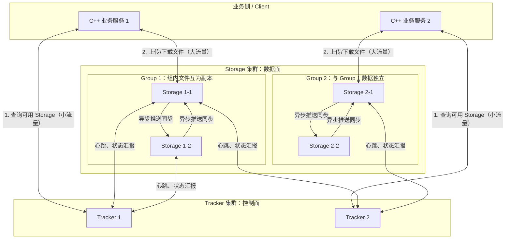
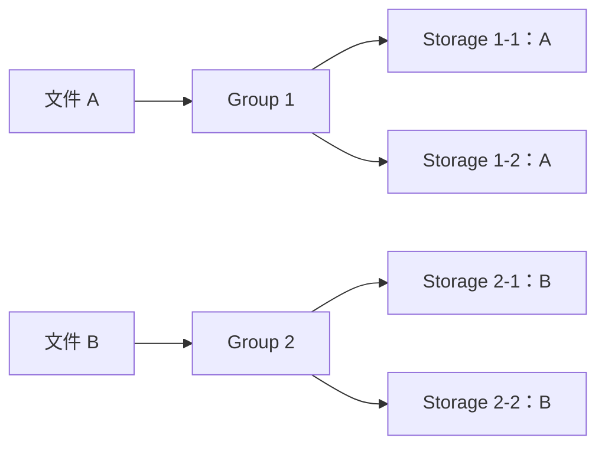
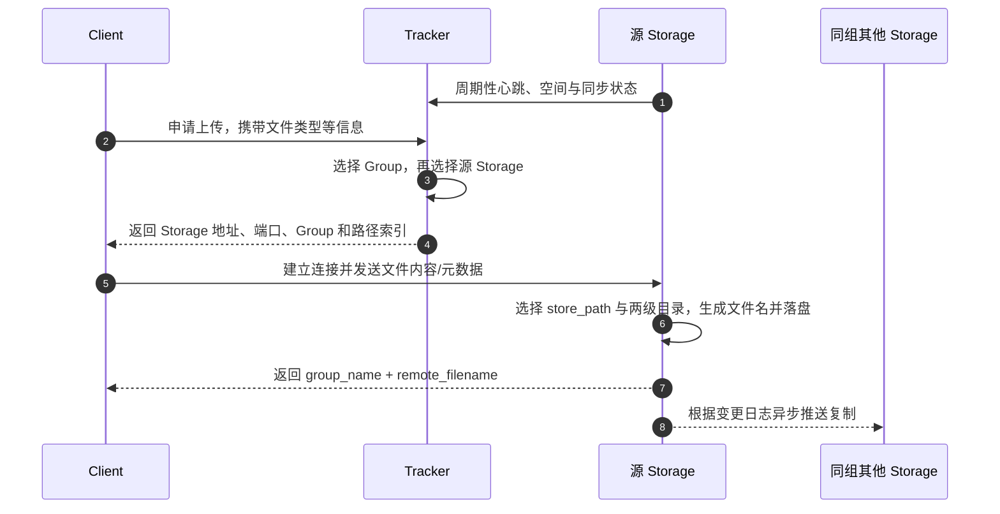
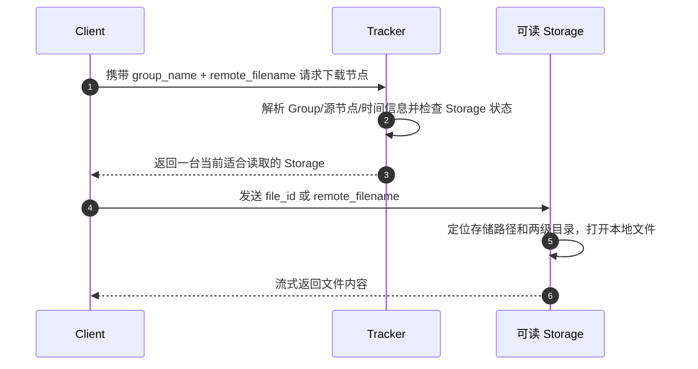

# FastDFS 架构剖析：从分布式、高性能、高可用到负载均衡

> **与当前网盘项目的边界：** 本文大部分内容讲 FastDFS 的通用集群原理，不代表 `D:\Desktop\AI_YunCunChu` 的实际部署。当前 Compose 只有 1 个 Tracker、1 个 Storage、1 个 Group 的单机学习环境，不能声称已验证组内副本、节点故障转移或多节点负载均衡。当前仓库也没有动态反馈调度改造或 Storage 侧 LRU-K 源码；这两项只可作为理论学习或后续方案。

> 读者定位：对分布式存储、高性能/高可用 C++ 服务端和负载均衡缺少系统认识，希望先真正理解，再能在面试或交流中讲清楚。
>
> 阅读主线：**问题是什么 -> FastDFS 怎样拆系统 -> 一次上传/下载怎样流动 -> 为什么它能扩容、提速和容错 -> 它又牺牲了什么。**

## 先记住这段总纲

> **本节导读**：这一节是全文的浓缩总纲。初学者可以先通读一遍"混个脸熟"，不必强求一次看懂；等读完正文再回头对照，你会发现这里的每一句话都有了具体的含义和支撑。

FastDFS 是面向文件访问场景的轻量级分布式文件系统，也可以把它理解为一种轻量级对象存储方案。它不追求像本地文件系统一样挂载后任意读写目录，而是让客户端通过一个由 `group name + remote filename` 组成的文件标识来上传、下载、删除文件。

系统主要有两类服务端角色：

- **Tracker**：只做协调、调度和负载均衡，告诉客户端应该访问哪台 Storage；
- **Storage**：真正接收、保存、读取和同步文件。

Client 是调用方。它先向 Tracker 问路，再绕过 Tracker 直接与 Storage 传输文件。因此，大文件数据不会把 Tracker 变成中转瓶颈。这是理解整套架构最关键的一点：

> **Tracker 走控制流，Storage 走数据流；Group 之间扩容量，Group 内部做副本。**

如果面试时只能说一句话，可以说：

> FastDFS 用无中心的 Tracker 集群负责调度，用按 Group 组织的 Storage 集群负责真实文件存储；文件上传时先选 Group、再选 Storage 和磁盘路径，数据由客户端直传 Storage；同组 Storage 通过异步复制互为副本，从而在容量、吞吐、可用性和一致性之间做了一个偏工程实用的取舍。

---

## 1. 为什么需要分布式文件存储

> **本节导读**：分布式文件存储（distributed file storage）的本质只有一句话：一台机器装不下、扛不住，就让多台机器一起干活，把文件分散存放在它们之上。它要解决的，是单台机器在容量、性能、可用性、运维四个维度上的硬上限。下面从一个最普通的图片服务出发，感受这些上限具体卡在哪里。

先想象一个最简单的图片服务：应用把图片写入服务器本机目录，再把路径保存到数据库。流量小时这很自然，但规模增长后会遇到四类上限。

### 1.1 容量上限

一台机器能挂载的磁盘有限。即使换更大的盘，仍然存在单机上限，而且纵向升级越来越贵。

### 1.2 吞吐上限

所有上传和下载都经过同一台机器，其网卡带宽、磁盘 IOPS、文件系统锁竞争、CPU 和连接数都会成为瓶颈。

### 1.3 可用性上限

机器宕机、磁盘损坏、进程崩溃或网络中断，都可能让整个文件服务不可访问。这叫**单点故障**（Single Point of Failure，SPOF）。

> **人话：牵一发而动全身**

### 1.4 运维上限

文件越来越多后，迁移、扩容、备份和故障恢复都会变得困难。不能只靠“再加一块盘”长期解决。

分布式存储的基本办法是：把容量和请求分摊到多台机器，并让重要数据有多份副本。代价是系统必须处理节点选择、数据同步、故障检测、一致性和恢复等新问题。

---

## 2. 五个基础概念先分清

> **本节导读**：**分布式、高性能、高可用、负载均衡、一致性**——这五个词是几乎所有分布式系统讨论中的"普通话"。它们经常被混用，其实各自回答一个问题：分布式解决"多台机器怎么协作"，高性能解决"快不快"，高可用解决"挂了怎么办"，负载均衡解决"请求给谁"，一致性解决"副本什么时候才一样"。先把这张表读懂，后面所有章节才有共同语言。

这些词经常一起出现，但解决的不是同一个问题。

| 概念   | 它回答的问题              | 常见手段                     | FastDFS 中的体现                             |
| ---- | ------------------- | ------------------------ | ---------------------------------------- |
| 分布式  | 怎样让多台机器共同完成一项服务？    | 分片、复制、节点发现、网络协议          | Tracker 与多组 Storage 协同                   |
| 高性能  | 单位时间能处理多少请求，单次请求多快？ | 并行、减少中转、内存状态、本地文件系统、连接复用 | Client 直连 Storage、Tracker 只调度、Group 横向分流 |
| 高可用  | 某些节点故障后，服务还能否继续？    | 冗余、健康检查、故障转移、超时重试        | 多 Tracker、同组多 Storage、心跳与读节点选择           |
| 负载均衡 | 请求应该交给哪个节点处理？       | 轮询、权重、最少连接、最小负载、哈希       | 选择 Group、Storage、存储路径和下载节点               |
| 一致性  | 多副本在什么时刻能看到相同数据？    | 同步复制、异步复制、仲裁、版本号         | 同组异步复制，通常体现为最终一致性                        |

### 2.1 高性能不是“单次请求一定更快”

分布式系统引入了网络交互，单个小请求有时反而比本地访问慢。所谓高性能，往往主要指：

- 多节点能并行处理更多请求，即**吞吐量**更高；
- 调度和数据传输路径较短，减少不必要复制；
- 在高并发下，尾延迟仍然可控。

常见指标包括 **QPS/TPS、吞吐量（MB/s）、平均延迟**，以及 **P95/P99/P999 尾延迟**。

| 指标                   | 核心关注点                 | 简单解释                                                                                                              | 类比                                         |
| -------------------- | --------------------- | ----------------------------------------------------------------------------------------------------------------- | ------------------------------------------ |
| **QPS / TPS**        | **处理能力** (每秒处理多少“活儿”) | **QPS** (Queries Per Second)：每秒查询数，主要指读请求。  <br>**TPS** (Transactions Per Second)：每秒事务数，主要指写/一组操作。                | 收费站每小时通过多少**辆车**。                          |
| **吞吐量**              | **数据流量** (每秒传输多少“数据”) | 单位时间内成功传输的数据量，常用 MB/s 等表示。与请求大小直接相关。                                                                              | 高速公路每小时运输多少**吨货物**。                        |
| **平均延迟**             | **响应快慢** (平均要“等多久”)   | 所有请求响应时间的平均值。**会掩盖长尾问题**。                                                                                         | **平均分**，但看不到落后同学的情况。                       |
| **P95/P99/P999 尾延迟** | **最差体验** (关注“最慢”的用户)  | **P95 延迟**：95%的请求都低于这个时间，5%可能很慢。  <br>**P99 延迟**：99%的请求都低于这个时间，1%可能很慢。  <br>**P999 延迟**：99.9%的请求都低于这个时间，0.1%可能很慢。 | **分数线**，如“P99 分数线”代表顶尖的 1% 学生成绩，关注最需要帮助的人。 |

### 2.2 高可用不等于数据绝对不丢

高可用关注的是“**系统是否在线**” ，而持久性关注的是“**数据是否还在**”。

例如：一个文件刚写入源 Storage、还没异步复制时源节点磁盘就永久损坏，服务集群也许仍然在线且**可用**，但这份新文件可能就永久丢失了。

| 维度        | 高可用                            | 持久性                                |
| --------- | ------------------------------ | ---------------------------------- |
| **核心目标**  | **减少停机时间** (服务不中断)             | **防止数据丢失** (数据不丢)                  |
| **应对问题**  | 服务器宕机、进程崩溃、网络分区                | 磁盘损坏、误删除、数据损坏                      |
| **实现手段**  | 集群、心跳检测、故障自动转移                 | 多副本同步写入、磁盘阵列、备份                    |
| **你这个例子** | ✅ **满足了**。服务能自动切换到备份节点，系统仍可读写。 | ❌ **没满足**。那份还未复制的新文件，随着物理损坏而永久丢失了。 |

### 2.3 负载均衡不只是 Nginx 转发

负载均衡的本质是**选择策略**。只要系统在多个候选资源之间做选择，就是负载均衡。FastDFS 至少在以下层次做选择：

1. 客户端选择 Tracker；
2. Tracker 选择 Storage Group；
3. Tracker 在 Group 内选择 Storage；
4. Storage 选择本机存储路径/磁盘；
5. 下载时 Tracker 选择一台当前适合读取的 Storage。

### 2.4 控制面与数据面

#### 1. 控制面：该找谁？

> 控制面是系统的大脑，负责管理元数据和做出决策。

**它的职责：**
- **保存拓扑和状态**：维护一份“活点地图”，记录整个集群里有哪些 Storage 节点是健康的、它们属于哪个组、剩余容量是多少。
- **制定和下发策略**：决定客户端上传或下载文件时，应该被分配到哪个 Storage 节点。
- **调度与决策**：这是它唯一干的重活。在 FastDFS 中，就是 **Tracker 集群**。

**技术特点：**
- **一致性要求极高**：如果 Tracker 之间的状态不一致，告诉客户错误的地址，整个系统就乱套了。因此 Tracker 之间需要高效的状态同步机制（FastDFS 的 Tracker 本身不存储状态，是通过 Storage 上报心跳，所以天然避免了 Tracker 间同步的复杂性，但逻辑上它依然是状态持有者）。
- **性能要求不高**：每秒处理的调度请求远小于数据面的文件传输请求。

#### 2. 数据面：把内容传过去

> 数据面是系统的肌肉，负责干所有脏活累活。

**它的职责：**
- **处理实际数据**：接收、存储、读取、同步文件数据。
- **执行决策**：根据控制面给的指令，执行具体的数据搬运。在 FastDFS 中，就是 **Storage 集群**。
    
**技术特点：**
- **高性能、高吞吐**：设计目标是跑满网络带宽或磁盘 I/O，处理海量数据流。
- **逻辑简单、无状态（对控制面而言）**：Storage 节点通常只需要被动处理请求，不需要知道全局信息。它只负责自己组内的文件读写。
- **可大规模线性扩展**：当需要更多存储空间或带宽时，只需要增加 Storage 组，数据面就扩充了，不影响控制面。

#### 3. 有什么用：

##### 1. 独立扩展，精确下药

这是最核心的收益。这两种请求的负载特征完全不同：

- **控制面请求（Tracker）**：体积小、频率高、消耗 CPU（做计算和决策）。
- **数据面请求（Storage）**：体积大、带宽消耗大、消耗内存和磁盘 I/O。

如果不分离，一个处理大文件下载的组件会把 CPU 或带宽吃满，导致它无法及时响应“该找谁”的小请求，整个系统就会表现为不可用。

分离后，你可以：
- **存储或带宽不够了？** 只扩 **Storage 集群**。Tracker 集群完全不用动。
- **并发请求量激增，导致调度变慢？** 只扩 **Tracker 集群**。Storage 集群完全不用动。
    
这让你可以针对不同瓶颈，进行精准、经济的扩容。

##### 2. 稳定性隔离，防止雪崩

这是一个关键的工程安全考量。控制面和数据面是两种“路况”：

- **数据面**：就像高速公路，车（数据包）大、速度快，容易出事故（故障）。
- **控制面**：就像紧急车道或应急通信通道，车（调度请求）小，但必须时刻保持畅通，用于指挥救援。

如果混在一起，高速路一塌方，就把应急车道也堵死了，整个系统失去控制。分离后，即使某个 Storage 组因为大流量下载而负载飙升甚至宕机，**控制面的 Tracker 集群依然可以正常工作**。它能检测到故障，并指挥新来的请求去别的地方，系统整体仍然可控。

##### 3. 简化设计与运维

- **解耦复杂性**：Tracker 的开发者可以专注于高效的负载均衡算法，而不用关心文件怎么存盘。Storage 的开发者可以专注于文件系统优化，而不用管全局调度。两部分可以独立进化。
- **独立监控与调优**：可以分别对 Tracker 集群（侧重于连接数、CPU）和 Storage 集群（侧重于磁盘 I/O、网络吞吐）建立完全不同的监控和告警体系。


FastDFS 中 Tracker 主要属于控制面，Storage 属于数据面。把小而频繁的调度请求与大流量文件传输拆开，能让两部分分别扩展。

> 控制面和数据面的概念，把“找”和“传”这两个动作在物理或逻辑上分开，让系统能够**分别应对控制流和数据流的不同挑战**，最终实现极高的可扩展性和稳定性。这正是几乎所有现代分布式系统（如服务网格、分布式数据库）都遵循的**基础设计原则**。

---

## 3. FastDFS 到底是什么，不是什么

> **本节导读**：FastDFS 是一个用 C 语言编写、在开源社区长期维护的轻量级分布式文件系统，最初正是为了解决海量图片、音视频等中小文件的在线存取而设计的。它不追求像本地盘那样挂载后任意读写，而是以文件标识为粒度提供上传、下载、删除等接口。认清它适合什么、不适合什么，是正确理解它的第一步。

### 3.1 它适合什么

原 PDF 将典型场景概括为以中小文件为载体的在线服务，例如图片和视频分享。官方项目当前也把 FastDFS 描述为高性能分布式文件系统，支持文件存储、同步和访问，并强调分组存储、负载均衡及小文件合并存储等能力。

典型使用方式是：

1. 业务服务通过 SDK 上传文件；
2. FastDFS 返回一个文件标识；
3. 业务数据库保存这个标识以及业务元数据；
4. 后续通过标识下载或删除文件。

### 3.2 它不等同于通用本地文件系统

FastDFS 属于“**类对象存储的非 POSIX 分布式文件系统**”，设计思想类似于“**Key-Value 型分布式存储系统**”。它借鉴了对象存储”按 ID 直访“的简洁寻址模式，并吸收了 KV 存储“扁平键值空间”的高效抽象，但摒弃了对象存储繁杂的 S3 协议与丰富元数据管理，也无需 KV 存储针对复杂数据结构（如 Hash/List）及高频事务更新的支持。

其与对象存储的思想有相似之处：**通过封装好的应用程序接口（API），提供对数据对象的特定操作**。

- **面向应用的高级接口**：接口是为应用定制的，简单直接，例如 `upload`、`download`、`append`、`delete`、`monitor` 等。没有 `seek` 或 `open` 这种**底层文件指针操作**或对象存储相关的**标准 S3 RESTful API** 。
- **扁平化的命名空间**：没有复杂的目录树。所有文件通常存储在一个大池子里，靠唯一的 ID 来访问。那个 ID 就是找到文件的唯一凭证。(**物理上虽分 Group（卷），但对应用层透明，逻辑上是一个大池子**。)
- **不支持随机读写**：这是与 POSIX 最根本的区别。你不能直接修改或读取文件**中间**的任意字节。其仅支持对文件的整体覆盖（Overwrite）、整体读取（Read All）和尾部追加（Append）。
- **集群状态最终一致性**：FastDFS 在数据存储上采用组内强一致性复制，但在集群拓扑与元数据状态上，则基于 Storage 对 Tracker 的上报心跳，遵循最终一致性模型。

而 **POSIX 分布式文件系统**，其以“**盘**”为核心。这类系统的核心思想是：**提供一个共享的、巨大的、看起来像本地硬盘的文件系统**：

- **标准的文件系统接口 (POSIX)**：不只是简单的 `upload/download`，而是支持 `open()`（打开）、`read()`（读取指定字节数）、`write()`（在指定偏移量写入）、`seek()`（移动文件指针）、`mkdir()`（创建目录）等完整的文件操作。
- **完整的目录树（层级命名空间）**：文件和文件夹通过路径组织，如 `/data/vm_images/img_001.raw`。你可以像操作本地电脑的 C 盘、D 盘一样，进行目录遍历、重命名、创建硬链接、修改权限等操作。
- **随机读写**：这是最关键的区别之一。系统支持修改一个巨大文件中间的任何一小块数据，而不需要读写整个文件。这对于数据库（需要随机访问数据页）和虚拟机镜像（需要修改虚拟磁盘内的特定扇区）是刚需。
- **强一致性保证**：通常提供更严格的一致性模型（如强一致性），确保多个客户端同时读写同一份数据时的正确性。这是通过复杂的分布式锁和缓存一致性协议实现的。

> **补充差异**：
> - **访问协议差异**：FastDFS 通常通过 SDK（API）或 HTTP 下载；POSIX 系统挂载在操作系统内核（VFS 层），应用层无感知，`ls` 命令就能看。
> - **元数据（Metadata）能力**：对象存储（S3）允许附带大量自定义标签（x-amz-meta-\*）；而 FastDFS 仅存储文件本身的少量属性（大小、CRC32、时间戳），元数据能力极弱，这使得它**不能直接作为数据湖的存储底座**。

> 当你的应用需要一个简单、快速、能存放海量静态文件的服务时，FastDFS 这种轻量级"**类对象"非 POSIX 存储**非常合适。但当你的**数据库文件**或**虚拟机磁盘文件**需要被多个节点同时、随机地读写时，一个标准的 POSIX 分布式文件系统就是必然的选择。

### 3.3 “三个角色”和“两类服务端角色”并不矛盾

原 PDF 说有 Tracker、Storage、Client 三个角色，这是从参与一次请求的组件看；官方架构说明称两类角色，是从 FastDFS 服务端进程看。更严谨的说法是：

- 两类服务端：Tracker、Storage；
- 一类调用方：Client。

---

## 4. 总体架构：先问路，再直传

> **本节导读**：看任何分布式系统，第一步都应该是画一张"数据怎么走"的图。FastDFS 的整体流程可以浓缩为六个字：先问路，再直传——Client 先向 Tracker 查询该找哪台 Storage（小流量），再绕过 Tracker 直接与 Storage 传文件（大流量）。两类角色各司其职、两条路径互不混流，这是后面所有设计的地基。



一次请求中存在两条完全不同的路径：

- **调度路径**：Client -> Tracker -> Client；
- **文件路径**：Client <-> Storage。

Tracker 不代理文件正文。因此，扩展 Tracker 是增加调度能力，扩展 Storage 才是增加文件吞吐或容量。

---

## 5. Tracker：调度者，而不是文件仓库

> **本节导读**：Tracker 是 FastDFS 的调度中枢，但它不保存任何文件正文。可以把它想象成图书馆的咨询台：它靠每台 Storage 定期上报的心跳与状态，掌握"哪个书架有书、还剩多少地方"，再告诉客户端去哪个书架。多个 Tracker 对等冗余，目的就是让"问路"这个环节不出现单点故障。

### 5.0 Tracker 集群：调度与导航中心

> **核心职责：元数据管理，负责告诉客户端“文件存在哪”。**

- **无中心化集群**：所有 Tracker 节点是对等的，没有主从之分。这是为了彻底消除单点故障。
- **不存储文件**：它只管理 Storage 集群的状态信息（如哪些卷在线、剩余容量），不存文件本身，内存占用很低。
- **核心工作流程**：
    - **上线注册**：Storage 节点启动时，会主动向所有 Tracker 注册，并定期上报心跳和剩余容量。
    - **提供路由**：客户端上传/下载前先问 Tracker，Tracker 根据策略返回一个最优的 Storage 地址和路径。
- **调度算法**：可以按轮询、最少并发数、最大剩余容量等策略分配，实现负载均衡。

简而言之，Tracker 集群通过多节点冗余解决了“找数据”环节的单点故障。

### 5.1 Tracker 管什么

Storage 启动后连接配置的 Tracker，报告自己所属 Group、地址、端口、磁盘空间、同步状态等信息，并周期性发送心跳和状态。Tracker 据此形成类似下面的运行时视图：

```text
group1 -> [storage-A: ACTIVE, storage-B: ACTIVE]
group2 -> [storage-C: ACTIVE, storage-D: OFFLINE]
```

Tracker 收到客户端请求后，基于这些状态和配置策略返回一台合适的 Storage。

### 5.2 为什么 Tracker 比较“轻”

Tracker 不保存文件正文，核心拓扑和状态主要由 Storage 汇报形成，并在内存中用于快速调度。这带来三个效果：

- 单次调度只处理很少的控制信息；
- Tracker 不承受文件大流量；
- 新增 Tracker 后，各 Storage 都可以向它汇报状态，便于水平扩展。

需要谨慎表述的是：原 PDF 的“Tracker 本身不需要持久化任何数据”是在强调**文件元信息和拓扑可由 Storage 重建**，不能推导为进程完全不落任何系统文件或日志。当前配置中仍有 `base_path` 用于系统数据和日志。

### 5.3 Tracker 集群为什么没有传统主从

多个 Tracker 彼此对等，都能接收 Storage 汇报，也都能回答客户端查询。它们不是“一主多从”，也不依赖某一台主 Tracker 才能工作。

这并不意味着客户端什么都不用做：客户端必须配置多个 Tracker 地址，并实现超时、切换和重试；否则只配置一个 Tracker，应用侧仍然会人为制造单点。

### 5.4 Tracker 的高可用边界

Tracker 对等能降低单节点故障影响，但仍要考虑：

- 所有 Tracker 是否部署在同一机架或同一交换机下；
- 客户端是否能在 Tracker 超时后快速切换；
- Storage 状态汇报和 Tracker 判断存活之间有检测窗口；
- 极端网络分区时，不同 Tracker 的视图可能暂时不同。

因此，“多 Tracker”只是高可用设计的一部分，不是自动获得 100% 可用性的魔法。

---

## 6. Storage：真正保存、读取和同步文件

> **本节导读**：与 Tracker 相对，Storage 是真正"干活"的角色：文件最终落在它本机的磁盘上，上传、下载、删除、同步都由它执行。它通过 Group 分组同时实现数据冗余与读负载均衡，又靠多磁盘路径、两级子目录等设计支撑海量小文件。理解 Storage 的职责，就理解了文件住在哪、怎样被找回来。

### 6.0 Storage 集群：存储与备份中心

> **核心职责：实际存取文件，并保证数据冗余。**

- **分组是核心**：集群由多个**组（Group）**构成。**同一组内的节点互为备份，数据完全一致**；不同组之间则共同构成完整的文件库，实现了水平扩容。
- **冗余方式**：数据在组内同步，实现了冗余和高可用。一个组可以只有一个节点，但这样存在单点故障风险。
- **核心工作流程**：
    - **写文件**：客户端拿到 Tracker 返回的组和路径后，**直接连接**该组的某台 Storage 写文件。写完主节点后，它会**异步**同步给组内其他节点。
    - **读文件**：直接访问 Storage，组内任意节点都能读取，实现了读负载均衡。
    - **故障切换**：当组内某节点宕机，其 IP 会被 Tracker 自动踢出，其上线的备份节点会自动顶上。
        
简而言之，Storage 通过分组机制，既实现了数据冗余，又实现了写入和读取的负载均衡。

### 6.1 Storage 的职责

Storage 负责：

- 接收上传数据并写入本地文件系统；
- 根据文件标识查找并返回文件；
- 删除、追加或修改相应文件；
- 维护文件相关元数据；
- 记录变更并向同组其他 Storage 同步；
- 向 Tracker 汇报心跳、空间和同步状态。

### 6.2 一台 Storage 可以使用多块盘

可配置多个 `store_path`，每个路径通常对应一块独立磁盘或挂载点。Tracker 选中 Storage 后，Storage 还需要在本机选择具体路径。原 PDF 列出轮询和最大剩余空间两种策略；当前官方 `tracker.conf` 也保留了相应的 `store_path` 选择配置。

### 6.3 为什么要创建两级子目录

如果几百万文件全放在同一目录，目录项查找、遍历、备份和运维都会变差。FastDFS 在每个存储路径下建立两级子目录，默认每级 256 个，即最多 `256 x 256 = 65,536` 个目录桶，让文件分散存放。

一个典型远程文件名形如：

```text
group1/M00/00/00/eBuDxWCelFCAEFUrAAAAKTIQHvk462.txt
```

可拆成：

```text
group1 / M00 / 00 / 00 / eBuDxWCelFCAEFUrAAAAKTIQHvk462.txt
  组名    路径索引  两级目录             文件名
```

原 PDF 将“两级目录选择”写成“按 file_id 两次 hash（猜测）”。更准确地说，目录分发行为受 Storage 的 `file_distribute_path_mode` 等配置控制：可按轮转方式分发，也可按哈希码随机分发，不能一概断言为固定的“两次 hash”。

### 6.4 为什么直接使用本地文件系统

FastDFS 没有重新实现一套底层磁盘格式，而是把普通文件或小文件合并结构放在本地文件系统之上。这样实现相对简单，并能利用操作系统页缓存、成熟文件系统和常规磁盘工具；但最终性能仍受磁盘、文件系统、页缓存、线程模型和同步策略影响。

> **FastDFS 的文件模型是一层抽象，它屏蔽了底层本地文件系统的复杂性。但同时，它又完全依赖本地文件系统来真正存储数据。**

这个配合流程是：

1. **抽象层（你看到和使用的）**：  
	- 客户端调用 `upload` API，文件被上传，返回一个简洁的 ID，如 `group1/M00/00/01/abcdefg.jpg`。客户端只需存好这个 ID，无需关心文件最终存在哪里。
2. **映射与执行层（Storage 服务内部完成的）**：  
	- 当 Storage 服务收到上传请求，它会把你给的 ID **翻译**成一个本地文件系统能理解的路径。过程如下：
	    - **Step 1：确定虚拟磁盘**：解析 ID 里的 `M00`，查找配置文件，发现 `M00` 映射到 `/data/fastdfs/data` 这个基础路径。
	    - **Step 2：拼接本地绝对路径**：Storage 服务把 ID 里的两级目录 `00/01` 和文件名拼接起来，生成最终的真实路径：  `/data/fastdfs/data/00/01/abcdefg.jpg`
	    - **Step 3：调用本地系统接口**：然后，它调用 Linux 系统的 `open()` 和 `write()` 函数，把文件数据写入这个本地路径。
        
**所以，FastDFS 不能脱离本地文件系统单独存在。** 它的文件模型，本质上是一个“翻译层”和“索引服务”，把对 ID 的操作，翻译成对指定本地磁盘上真实文件的操作。

### 6.5 Storage 在系统中的结构和功能

一个 Storage Node 可映射到**一个或多个**实际挂载点。

多个 Storage Node 组成一个 Group，Group 内文件完全相同，互为备份；Group 间文件不同。多个 Group 组成一整个 Storage 集群。

上传时，只需提交文件，FastDFS 自动选择 Storage 存入，并返回一个唯一的文件 ID。

读取时，客户端解析文件 ID 得到**组名**，向 Tracker 查询该组可用的 **Storage Node IP**。客户端再直接访问该 Storage，由 **Storage 服务**内部解析文件 ID，确定本地挂载点、用于分片的**二级目录**和具体文件名，最后调用本地文件系统接口，将文件提取并返回。

---

## 7. Group：扩容量与做副本的核心抽象

> **本节导读**：Group（卷）是 FastDFS 组织数据的基本单位，也是理解容量和副本的关键。它同时承担两种相反的角色：不同 Group 之间文件集合完全独立，靠增加 Group 来扩容；同一个 Group 内部多台 Storage 保存同一份文件，靠它们做副本。把"组间独立、组内备份"这八个字记住，Group 就不会再混淆。

### 7.0 Group 简介

Group 也称卷（volume）。它同时承担两件很容易混淆的事：

- **Group 之间**：文件集合彼此独立，用来横向扩容和分流；
- **同一 Group 内**：多台 Storage 保存相同文件集合，用来做副本和读负载均衡。
- Group 的有效容量受最小容量的 Storage 控制，比如一个 Group 中有 100TB 的 Storage 和 1TB的 Storage，则该 Group 的有效容量只有 1TB。
	- 一个 Group 内的所有节点存储的文件**完全相同**。因此，系统写入时，必须确保所有节点都有空间。这就导致 Group 的可用容量，完全受限于**组内容量最小的那个节点**。



### 7.1 用公式理解容量

假设：

- Group 1 内两台 Storage，可用容量分别为 10 TB 和 8 TB；
- Group 2 内两台 Storage，可用容量都为 12 TB。

因为同组数据要互为副本，Group 1 的有效容量受较小节点约束，可粗略理解为 8 TB；Group 2 是 12 TB。整个集群有效容量约为：

```text
8 TB + 12 TB = 20 TB
```

而不是四台机器容量相加的 42 TB。更一般地：

```text
集群有效容量 ≈ 各 Group 有效容量之和
单个 Group 有效容量 ≈ 组内最小 Storage 的可用容量
```

实际可写容量还会受保留空间、多个存储路径、只读路径、已用空间和运行状态影响。

### 7.2 加机器到底增加什么

这是最常考、也最容易答反的一点：

- **向已有 Group 增加 Storage**：主要增加副本数和读取并发，通常不增加该 Group 的逻辑容量（Group 容量受容量最小的节点所限制）；新节点还要补齐已有文件；
- **增加一个新 Group**：增加独立的数据分片，主要增加总容量和整体写吞吐。

### 7.3 Group 模型的优点

- 架构直观，不需要复杂的全局元数据服务；
- 可按业务、冷热或访问特征做隔离；
- 每组副本数可按需要设计；
- 通过增加 Group 做水平扩容。

### 7.4 Group 模型的代价

- 同组异构磁盘容易浪费大节点容量；
- 新节点加入已有大 Group 时，需要复制大量历史文件；
- Group 间文件独立，负载不均时不会自动获得完美再平衡；
- 某个 Group 的热点不会自然迁移到另一个 Group；
- 副本是异步形成的，刚写入时存在一致性和持久性窗口。

---

## 8. 上传全过程：四层选择，一次直传

> **本节导读**：一次文件上传，表面上是"把文件发出去"，实际上发生两件事：先完成四次"选谁"的决策——选 Tracker、选 Group、选源 Storage、选本机磁盘路径；再把文件内容直接传给最后选中的那台 Storage。四次选择层层递进，把流量逐步收敛到一台具体机器，这是负载均衡贯穿全链路的具体体现。

上传不是“把文件发给 Tracker”，而是先向 Tracker 查询，然后直接把文件发给 Storage。



### 8.1 第一层：客户端选择 Tracker

多个 Tracker 对等，客户端可以从已配置地址中选择一个。工程上不能只理解成“随机挑一台”：还需要连接超时、失败切换、健康缓存和退避，避免故障时大量线程同时阻塞。

### 8.2 第二层：Tracker 选择 Group

原 PDF 和官方配置给出三种典型策略：

| 策略              | 思路             | 优点             | 风险/适用场景       |
| --------------- | -------------- | -------------- | ------------- |
| Round robin     | 在 Group 间轮询    | 简单、请求数较均匀      | 不考虑文件大小和剩余空间  |
| Specified group | 固定写指定 Group    | 便于业务隔离、灰度或冷热分层 | 容易形成热点，需要容量规划 |
| Load balance    | 选剩余空间最大的 Group | 更重视容量均衡        | 只看空间不等于综合负载最低 |

这里的 “load balance” 主要按可用空间做决策，不等于同时综合 CPU、磁盘队列、网卡、连接数和尾延迟。

### 8.3 第三层：Tracker 在 Group 内选择源 Storage

典型策略包括：

- 组内轮询；
- 按 IP 排序取第一台；
- 按上传优先级取优先级最高的节点。

选出的节点叫**源 Storage**：客户端本次先把文件写到它，之后由它触发组内异步同步。按 IP 或固定优先级选第一台有利于确定性，但也更容易把写流量集中到少数节点；轮询更利于分摊上传压力。

### 8.4 第四层：选择本机 store_path 和子目录

Storage 收到上传请求后，再选择本机哪块磁盘/挂载路径，以及路径下的两级子目录。这样负载均衡从集群一直延伸到单机磁盘。

两级目录的核心目标是分散目录项，而不是提供业务语义。`M00/00/00` 不能当作用户可自由规划的目录树。

### 8.5 生成并返回文件标识

上传成功后，客户端得到：

```text
group1/M00/00/00/eBuDxWCelFCAEFUrAAAAKTIQHvk462.txt
```

FastDFS 语义上的文件标识由两部分组成：

```text
file_id = group_name + remote_filename
```

远程文件名内部编码了源 Storage 标识/IP、时间戳、文件大小、校验信息等实现相关字段，并带有存储路径和子目录。它带来的重要架构效果是：系统不需要为每个文件都在 Tracker 维护一条传统的“文件名 -> 物理节点”映射。

### 8.6 CRC32 能做什么，不能做什么

CRC32 可用于快速发现传输或存储中的随机错误，但它不是密码学哈希：

- 不能用于防恶意篡改；
- 不能作为强唯一标识；
- 不能直接代替 SHA-256 等安全校验。

### 8.7 上传成功到底意味着什么

通常可以把返回成功理解为：源 Storage 已按当前配置完成接收和本地写入，并生成了文件标识。由于**组内复制**异步进行，**上传接口返回成功不必然等于组内所有节点都已完成复制**。

还要区分“写入操作系统缓存”“执行 `fsync` 后稳定落盘”“其他 Storage 已复制”三个不同阶段。官方 Storage 配置中存在 `fsync_after_written_bytes` 等参数，持久性边界会受到配置影响。

| 阶段          | 数据位置   | 抵御风险      | 丢失风险                    | 此时返回成功，意味着...                 |
| ----------- | ------ | --------- | ----------------------- | ----------------------------- |
| **1. 内存缓存** | 操作系统内存 | 进程崩溃      | **物理断电**，数据瞬间蒸发。        | (不安全，不会在此返回)                  |
| **2. 本地落盘** | 单机物理磁盘 | 进程崩溃，机器断电 | 单机磁盘永久损坏。               | **“我这台机器存好了”**，这是默认承诺。        |
| **3. 组内复制** | 组内多机磁盘 | 单机磁盘永久损坏  | **异步窗口内的源机损坏**，导致新数据丢失。 | **“我和我兄弟都存好了”**，这是组内强一致的更高要求。 |

---

## 9. 下载全过程：先定位，再读合适的副本

> **本节导读**：下载和上传的难点不同：上传难在"决定写到哪"，下载难在"决定读哪个副本"。因为同组副本是异步同步的，刚上传完的文件并不保证每台同组 Storage 都有。所以下载前先通过 file_id 定位，再由 Tracker 依据同步进度挑一台确定有该文件的节点，客户端才去直连读取。



### 9.1 为什么不能简单随机读任意同组节点

同组 Storage 最终应有相同文件，但复制是异步的。刚上传完时，某些副本可能还没有该文件。如果 Tracker 立即随机选择一个落后的副本，用户就会遇到“上传成功却下载 404” 的情况。

### 9.2 Tracker 怎样降低读到未同步副本的概率

原 PDF 总结了可读 Storage 的判断思路，可理解为以下优先级/证据：

1. **优先源 Storage**：只要源节点存活，它最确定地拥有刚上传文件；
2. **同步进度已越过文件创建时间**：说明目标节点已经处理到该文件之后；
3. **文件已经足够老**：超过最大同步耗时或同步延迟阈值后，系统推定副本已经补齐；
4. 在候选可读节点中再应用下载节点选择策略。

官方 `tracker.conf` 中有 `storage_sync_file_max_time` 和 `storage_sync_file_max_delay`，原 PDF 举例分别是 5 分钟和 1 天。这些是用来辅助判断的时间边界，不等于强一致性证明。

> 由于 Group 内的文件同步是在后台异步进行的，因此读取时，文件可能尚未同步到某些 Storage Server。为了尽量避免客户端访问到这些尚未完成同步的 Storage，Tracker 会按照以下规则，选择 Group 内可读的 Storage：
> 
> 1. **优先选择源头 Storage**：该文件上传时写入的源头 Storage，只要处于存活状态，就一定包含该文件。源头 Storage 的地址被编码在文件 ID 中。
> 2. **同步时间戳匹配**：若某 Storage 的“被同步到的时间戳”等于文件的创建时间戳，说明该文件已同步至此。
> 3. **同步时间戳晚于文件创建**：若某 Storage 的“被同步到的时间戳”晚于文件的创建时间戳，则此时间戳之前的文件，都已确定同步完成。
> 4. **超过文件同步最大时间**：当 (当前时间 - 文件创建时间戳) 超过配置的文件同步最大时间（如 5 分钟）时，认为该文件肯定已完成同步。
> 5. **超过同步延迟阈值**：当 (当前时间 - 文件创建时间戳) 超过配置的同步延迟阈值（如一天）时，同样认为文件肯定已完成同步。

### 9.3 读己之写（read-your-writes）问题

> "**读己之写**"是指用户上传文件后，立即尝试读取该文件的场景。在 FastDFS 的异步复制模型下，这个问题尤为突出。

当用户刚上传完文件就立即读取时，Tracker 会优先将请求路由到**源 Storage**——因为此时只有源 Storage 保证持有该文件，组内其他节点可能尚未收到同步数据。这个设计是读己之写场景下最可靠的保障。

但这种可靠性是脆弱的：

- **短暂不可读**：如果源 Storage 在复制完成前宕机，即使它只是进程崩溃而非硬件损坏，Tracker 也会将其标记为不可用。此时，其他节点尚未同步到该文件，用户就会遭遇"刚上传成功却读不到"的尴尬。这是一个**一致性窗口**问题，等同步完成后即可恢复。
- **永久性丢失**：如果源 Storage 发生的是不可逆的物理损坏（如磁盘彻底报废），而那份刚上传的文件还没来得及复制给任何其他节点，那么这份文件就**永久丢失了**。这就不再是"稍后可见"，而是数据的彻底消失。这是一个**持久性窗口**问题。

而异步复制的本质，是用**写入延迟和一致性**去换取**写入吞吐和可用性**。

- **收益**：客户端上传文件，只需等待源 Storage 单机确认，无需等待网络同步的额外耗时。这让写入响应极快，系统吞吐高。
- **代价**：从"源 Storage 已写入"到"组内全部副本完成同步"之间，打开了一个**风险窗口**。在这个窗口内，文件仅存在于源 Storage 的单点之上，新数据是"裸奔"的。

窗口越长，读写不一致的体验问题越突出，数据永久丢失的风险也越大。

这揭示了分布式系统设计中一个根本性的规律：**性能、可用性和一致性，无法同时完美满足。**

在 FastDFS 的异步复制模型中：

-   **性能**：异步复制保证了极高的写入吞吐。
-   **可用性**：即使部分副本宕机，只要源 Storage 正常，写入服务就不受影响。
-   **一致性**：在同步窗口内，读操作可能拿不到最新数据，牺牲了强一致性。

FastDFS 选择了**优先保证性能和可用性，接受最终一致性**，并把这期间的持久性风险交由上层业务容忍或外部手段兜底。没有"三全其美"的最优解，只有面向场景的取舍。

### 9.4 HTTP 下载链路

原 PDF 指出 FastDFS 自带 HTTP 服务已弃用，常见做法是 Nginx 配合 `fastdfs-nginx-module` 提供下载。可以把链路理解为：

```text
浏览器/业务调用方 -> Nginx + 模块 -> 本机或相应 Storage 文件
```

Nginx 适合处理 HTTP 连接、静态内容发送、缓存、限速、Range 等外围能力；FastDFS 核心协议和客户端 SDK 则处理 Tracker 查询及 Storage 访问。生产方案还要结合所用版本、模块维护状态和实际部署拓扑验证，不能只靠一条 Nginx 配置就宣称获得完整高可用。

---

## 10. 同步机制：异步 Push 与最终一致性

> **本节导读**：副本不会自己变得一致，必须有同步机制来维持。FastDFS 采用异步 Push 的方式：文件先在源 Storage 落盘，后台同步线程再把变更推送给同组其他节点，目标节点收到后重放。这套机制让写入不必等待所有副本，响应更快，代价则是副本在一段时间内可能不一致——这正是"最终一致性"的由来。

### 10.1 同步发生在哪里

文件同步只在**同一个 Group 内部**进行。Group 1 的文件不会因为副本同步自动出现在 Group 2，因为不同 Group 本来就是不同数据分片。

### 10.2 Push 是什么意思

某台 Storage 上发生上传、删除、追加等变更后，它记录相关操作，后台同步线程再把变更主动推送给同组目标 Storage。目标节点不需要每次都扫描源节点全盘文件。

可以用日志复制的视角理解：

```text
源 Storage：写文件 -> 记录变更/binlog -> 同步线程读取记录 -> 推送目标 Storage
目标 Storage：接收同步操作 -> 重放并更新本地文件
```

官方 Storage 配置包含同步线程、空闲轮询间隔、同步时间窗、binlog 缓冲刷盘间隔和同步标记写入频率等参数，说明同步并不是上传请求线程里完成所有副本写入。

### 10.3 为什么选择异步复制

**优点：**
- 上传不必等待所有副本，响应更快；
- 某个副本短暂变慢时，不一定拖住所有写请求；
- 后台同步可以连续批量处理变更。

**代价：**
- 副本短时间不一致；
- 源节点在复制前永久损坏可能丢失新文件；
- 删除和修改也可能存在短暂传播延迟；
- Tracker 需要根据同步进度谨慎选择下载节点。

### 10.4 新 Storage 加入已有 Group

官方架构说明指出，新节点加入 Group 后会自动复制该组已有文件，完成后才切换到在线提供服务的状态。这个过程提高副本数，但会带来：

- 大量磁盘顺序/随机读写；
- 网络带宽占用；
- 历史文件补齐与新增变更追赶；
- 恢复期间对线上尾延迟的影响。

因此恢复速度本身也是高可用指标。副本很多但恢复一天，风险窗口仍可能很大。

### 10.5 一致性、可用性、持久性的故障推演

| 场景 | 服务是否还能响应 | 数据是否一致/安全 | 应对重点 |
| --- | --- | --- | --- |
| 一台 Tracker 宕机 | 可，前提是客户端配置其他 Tracker | 文件不受影响 | 快速超时与切换 |
| 同组一个已同步副本宕机 | 通常可从其他副本读写 | 已同步数据仍在 | 修复节点并监控副本数 |
| 新文件未同步时源 Storage 暂时断网 | 可能暂时读不到新文件 | 恢复后可能继续同步 | 读源节点失败处理、告警 |
| 新文件未同步时源磁盘永久损坏 | 集群可能仍在线 | 新文件可能丢失 | 备份、更强写确认或业务补偿 |
| 整个 Group 不可用 | 其他 Group 可能正常 | 该 Group 文件不可访问 | 跨机架/机房部署、灾备 |
| 网络分区导致状态视图滞后 | 部分请求可能失败或选到旧状态 | 副本视图暂时不一致 | 超时、重试、状态收敛与观测 |

---

## 11. 高性能来自哪里

> **本节导读**：高性能不是靠某一个开关或某一行代码，而是多个设计叠加的结果。FastDFS 至少同时用了六招：控制流与数据流分离、无全局逐文件元数据、Group 间并行、组内多副本分担读、本地文件系统加目录分散、网络与磁盘分工。但"设计上高效"不等于"线上就高效"，最终瓶颈必须靠压测数据来确认。

FastDFS 的高性能不是一个单独开关，而是多个设计共同作用。

### 11.1 控制流与数据流分离

Tracker 只返回 Storage 地址，不代理文件正文。假设上传 500 MB 文件，Tracker 只处理很小的调度消息，500 MB 数据从 Client 直达 Storage。这避免了 Tracker 的双倍网络流量和内存拷贝。

### 11.2 无全局逐文件元数据查询

文件标识本身包含定位所需的重要信息，Tracker 不必为每次读文件查询一个巨大的“所有文件表”（**这个查找操作在万亿级数据下是极其昂贵的**）。这降低了中心元数据服务的容量和访问压力。

### 11.3 Group 之间可并行

不同 Group 保存独立文件集合。更多 Group 可以提供更多磁盘、网卡和 CPU，让上传和下载并行分摊到更多机器。

### 11.4 组内多副本分摊读取

同步完成后，同组多个 Storage 都可提供读取。读多写少的图片/视频场景尤其能从副本读负载均衡中受益。（避免读取热点出现）

### 11.5 本地文件系统与目录分散

Storage 直接使用本地文件系统，并把文件分散到两级目录，避免单目录过多文件造成的性能和运维问题：
- **目录项（Dentry）缓存污染**：Linux 为了加速文件查找，会在内存中维护一个目录项缓存（Dentry Cache）。当你访问这个大目录时，内核试图将海量的文件名加载进缓存。这会**挤占掉其他热数据的缓存空间**（LRU算法失效），导致整个操作系统的文件访问性能急剧下降。
- **文件查找（Lookup）效率骤降**：虽然现代 Ext4/XFS 文件系统引入了**哈希索引（HTree）**，查找单个文件的复杂度是 O(log N)，看似没问题。但**创建和删除文件**时，内核需要修改目录块（Directory Block）并记录日志（Journal）。在高并发下，多个线程同时在大目录里增删文件，会引发激烈的**目录级别锁竞争（inode_lock）**，导致 CPU 大量空转在自旋锁（Spin Lock）上，吞吐量直接“膝盖斩”。
- **`ls` 与 `stat` 的系统调用灾难**：执行 `ls -l` 或文件备份扫描时，系统必须对目录内的**每一个文件**调用 `stat`（获取元数据）。这意味着海量的磁盘 I/O 和 CPU 中断。在千万级文件的目录下，一个简单的 `ls` 可能耗时 **10 分钟以上**，甚至直接卡死（Timeout）。
- **`rm -rf` 的噩梦**：Linux 删除文件时，需要逐项清理目录项并释放 inode。如果目录里有千万个文件，`rm -rf` 可能会运行**几个小时**。更糟的是，如果中途断电或 Ctrl+C 中断，文件系统会留下大量“孤儿节点”，下次挂载时 `fsck`（磁盘检查）会扫描整个磁盘元数据，**导致单次故障恢复时间长达数天**，这在生产环境是不可接受的。
- **参数列表过长（Argument list too long）**：当你想用 `rm *` 或 `ls *` 进行通配符操作时，Shell 会将所有文件名展开为参数，此时会直接报错 `Argument list too long`。你不得不改用 `find + xargs` 来处理，极大地增加了脚本编写的复杂度和出错风险。
- **备份与同步（Rsync/Scp）极慢**：备份工具在扫描目录结构时，需要遍历每一个文件，**大量的时间消耗在建立文件列表上**，而真正用于传输数据的时间占比很小。

> 总之是为了减少遍历文件带来的 `O(n)` 时间复杂度

### 11.6 网络与磁盘工作分工

当前 Storage 配置中可看到 accept 线程、网络 work 线程、磁盘读写分离线程、同步线程等参数。思路是利用**Reactor（反应器）多线程模型** + **基于生产者-消费者模式的并发流水线**，通过 **IO 合并**和**系统调度**，让连接接入、网络 I/O、磁盘 I/O 和副本同步不会挤在同一条执行路径上，令这些工作都可以并发甚至并行执行。

### 11.7 真正的瓶颈仍要测量

常见瓶颈包括：

- 网卡带宽和跨机房 RTT；
- 磁盘吞吐、IOPS、队列深度和 `fsync` 延迟；
- 小文件过多造成的 inode、目录项、系统调用和随机 I/O 压力；
- 连接建立、线程数、缓冲区与内存占用；
- 热门 Group 或热门文件造成的负载倾斜；
- 副本同步和新节点恢复抢占线上资源；
- 客户端错误的超时/重试引发重试风暴。

“用了 FastDFS 所以高性能”不是完整答案。正确做法是结合 P50/P95/P99 延迟、吞吐、磁盘 util/await、网卡利用率、连接数、错误率和同步积压进行压测与定位。

---

## 12. 高可用是怎样拼出来的

> **本节导读**：高可用（high availability）的意思不是"永不失败"，而是通过冗余和恢复，把故障导致的不可用概率与时长降到可接受的水平。FastDFS 从四个方面拼出高可用：调度层多 Tracker、数据层同组副本、健康状态驱动的调度、支持在线扩容。但组件冗余不等于完整业务高可用，这一节也会列出还缺什么。

> FastDFS的高可用性并非依靠单一技术，而是通过**多Tracker的调度层冗余**、**同组多Storage的数据层冗余**、**基于心跳的自动化故障转移**以及**支持在线扩容的弹性机制**这四个层面协同工作实现的。其从调度、数据、监控到扩容的每一个环节都进行了冗余和自动化设计，核心思想并非杜绝故障，而是确保在部分组件失效时，整个系统仍能持续、稳定地提供服务。
> 
> 它是一个设计上充分考虑到了生产环境各种故障场景的、成熟可靠的分布式文件系统。

### 12.1 调度层冗余：多 Tracker 对等集群

客户端访问 FastDFS 的第一步是连接 Tracker Server 获取存储节点信息。为了避免这个“调度中心”成为单点故障，FastDFS 支持部署多个**对等（Peer）** 的 Tracker Server 组成集群。

* **对等集群，无单点故障**：集群中的任意 Tracker 都拥有完整的集群拓扑和 Storage 节点状态信息，不存在主备之分。即使一个 Tracker 宕机，客户端也可以迅速切换到另一个，保证了调度服务本身的高可用。
* **无状态设计，易于扩展**：Tracker Server **不存储任何文件索引**，所有状态信息都由 Storage Server 主动上报。这种“无状态”设计使它的内存占用极小，也使得新增 Tracker 节点来扩展调度能力变得非常简单。

### 12.2 数据层冗余：同组多 Storage 副本

数据的可靠性是存储系统的核心。FastDFS通过 **“组（Group）”** 的概念来实现数据冗余。

* **组内多副本**：一个 Group 由多台 Storage Server 组成，它们互为备份，存储着**完全相同**的文件集合。Group 内 Storage 的数量即为数据的副本数。
* **自动同步机制**：当 Client 向 Group 内某一台 Storage 上传文件后，该节点会通过 **Binlog（二进制日志）** 以 **异步推送（Push）** 的方式，自动将文件同步给组内的其他 Storage 节点。
* **读负载均衡**：由于组内数据一致，当 Client 读取文件时，Tracker 可以根据各 Storage 的负载情况，将读请求分散到组内不同的节点上。

### 12.3 健康状态驱动的调度：智能故障转移

为了确保客户端总是能被调度到健康的节点，FastDFS构建了一套由**心跳**驱动的自动化故障发现与转移机制。

* **周期性心跳**：每个 Storage Server 启动后，会连接 Tracker 并定期（如每秒）发送心跳包，报告自己的磁盘容量、文件数量等状态。
* **自动故障剔除**：Tracker 会持续监控心跳。如果某个 Storage Server **长时间未发送心跳**， Tracker 会将其标记为`OFFLINE`（离线）或不可用状态，并**自动将其从集群中移除**。此后，所有对该节点的读写请求都会被转移到组内其他健康的 Storage 上。
* **精细化的节点状态**：Storage 节点拥有`INIT`, `WAIT_SYNC`, `SYNCING`, `ONLINE`, `ACTIVE`等多种状态。例如，一个新加入的节点在完成历史数据同步前，会处于`SYNCING`状态，此时 Tracker 不会将写请求调度给它，从而保证了数据一致性。只有状态变为`ACTIVE`后，节点才会被完全投入使用。

### 12.4 水平扩展与在线加入：动态扩容

当存储空间不足或需要提升性能时，FastDFS 支持在不停止服务的情况下进行在线扩容。

* **纵向扩容（增加组内节点）**：可以向一个现有的 Group 中**动态添加**新的 Storage Server。新节点加入后，会自动从组内其他节点**同步所有历史数据**。同步完成后，该节点会自动切换为`ACTIVE`状态，开始提供线上服务。
* **横向扩容（增加新 Group ）**：当整个集群容量不足时，可以创建一个新的 Group 并加入新的 Storage Server。新 Group 的加入对旧 Group 的数据和业务**完全无影响**，可以实现存储容量的线性扩展。
* **注意**：在进行扩容时，应确保同 Group 内所有 Storage 的**硬件配置（尤其是磁盘容量）保持一致**，否则整个 Group 的可用容量将受限于最小容量的那个节点，形成“木桶效应”。

### 12.5 高可用设计还缺什么

FastDFS 组件冗余不等于完整业务高可用，还需要：

- 多机架、多电源域或多可用区部署；
- 客户端多地址、超时、退避和熔断；
- Nginx/入口层自身高可用；
- 容量、错误、延迟、心跳和同步积压监控；
- 定期恢复演练，而不是只确认“有副本”；
- 独立备份或灾备，防止误删除、程序缺陷和整组故障同时影响所有副本；
- 对业务可接受的数据丢失量 RPO、恢复时间 RTO 做明确约定。

其中：

- **RPO**（Recovery Point Objective）：最多允许丢多少时间范围的数据；
- **RTO**（Recovery Time Objective）：故障后最多允许多久恢复服务。

异步复制通常有利于性能，却可能让 RPO 大于 0；这必须由业务风险而不是一句“高可用”决定。

---

## 13. 把 FastDFS 的负载均衡讲透

> **本节导读**：负载均衡的本质是一次"选择"：在多个候选节点里，依据某种策略挑一个来承接请求。FastDFS 的特殊之处在于，这种选择不是只发生在某一层，而是从客户端到单机磁盘贯穿了四个层级。把每一层的决策者、候选资源与依据理清楚，才算真正讲透它的负载均衡。

### 13.1 四级负载均衡

FastDFS 的负载均衡不是单一的"智能调度"，而是一条由浅入深、层层递进的选择链路。每一层解决不同规模的问题，层层过滤，最终把请求精准落到一块磁盘上。

| 层级            | 决策者                | 候选资源                     | 常见依据                                | 目标                               |
| :------------ | :----------------- | :----------------------- | :---------------------------------- | :------------------------------- |
| **Tracker 级** | Client 本身          | 多个 Tracker 节点            | 顺序轮询、随机、失败重试切换                      | 分散调度请求，避免单个 Tracker 成为瓶颈；提供调度层容错 |
| **Group 级**   | Tracker            | 多个 Group（卷/逻辑池）          | 轮询、固定组（指定 group）、**最大剩余空间**         | 在逻辑池之间分配新文件，控制容量分布，实现业务隔离        |
| **Storage 级** | Tracker            | 同 Group 内的多个 Storage 节点  | 轮询、IP 地址顺序、**上传优先级**、可读状态（是否同步完成）   | 在副本节点间分散读写压力，实现组内负载分担            |
| **Path 级**    | Tracker/Storage 配置 | 单台 Storage 上的多个存储路径（挂载点） | 轮询、**最大剩余空间**、目录分发模式（按文件名 hash 或轮询） | 在单机多块磁盘间分散 IO，避免单盘容量爆满或 IO 热点    |

#### 13.1.1 Tracker 级：调度入口的高可用与分流

客户端（如 `fdfs_upload_file` 或 SDK）通常会在配置文件中写入多个 Tracker 地址。启动时，客户端会尝试连接第一个 Tracker，如果失败则自动切换到下一个。

**负载均衡逻辑**：
- 客户端自身不承担复杂策略，仅做**简单的顺序/随机选择**与**故障转移（Failover）**。
- 这种设计的妙处在于：**Tracker 集群是无状态的**，客户端随便连哪个 Tracker，拿到的调度结果理论上应该一致（因为集群信息通过心跳同步）。

**配置示例**（`client.conf`）：
```
tracker_server = 192.168.1.101:22122
tracker_server = 192.168.1.102:22122
tracker_server = 192.168.1.103:22122
```

#### 13.1.2 Group 级：逻辑卷间的容量规划

Group（组）是 FastDFS 中**最粗粒度的数据分片单元**。当客户端上传文件时，Tracker 需要决定把文件放到哪个 Group 里。这个决策直接决定了文件的"老家"。

**常见策略**：
1. **轮询（Round Robin）**：按 Group 列表顺序依次分配。适合所有 Group 硬件配置相同、容量一致的场景。
2. **指定 Group**：客户端在请求时直接指定目标 Group（如 `group2`）。适合**业务隔离**场景——比如视频文件存 `group_video`，图片存 `group_image`。
3. **最大剩余空间（Max Free Space）**：Tracker 定期收到各 Storage 上报的磁盘剩余容量，优先选择剩余空间最大的 Group 写入。这是**最推荐的生产策略**，可以有效避免"木桶效应"——即部分 Group 写满而其他 Group 还很空，导致容量浪费和负载不均。

**关键配置**（`tracker.conf`）：
```
store_lookup = 2  # 0: 轮询；1: 指定 Group；2: 剩余容量优先
store_group =     # 当 store_lookup=1 时指定具体 Group 名
```

#### 13.1.3 Storage 级：副本节点间的流量分担

选中一个 Group 后，Tracker 需要在该 Group 内的多个 Storage 副本中挑一台来接收文件。这里的策略会**区分上传和下载**：

- **上传（写）**：策略相对固定，通常采用**轮询**或**IP 顺序**。但 FastDFS 还支持**上传优先级（Upload Priority）** 配置，可以手动指定某台 Storage 优先接收新文件（比如这台机器磁盘更新、性能更强）。
- **下载（读）**：策略更灵活。Tracker 会优先选择**状态为 `ACTIVE`** 的 Storage（即同步已追齐），避免把请求发到还在追赶历史数据的节点上，导致读取失败。在此基础上，可以叠加轮询或随机策略来分散读流量。

**关键配置**（`storage.conf`）：
```
upload_priority = 10  # 数值越小，优先级越高，默认为 10
```

#### 13.1.4 Path 级：单机多磁盘的精细分流

这是 FastDFS 负载均衡中**最容易被忽视的一层**。一台 Storage 服务器通常会挂载多块物理硬盘（如 `/data1`、`/data2`、`/data3`）。文件最终要落到其中一块盘的某个目录下。

**策略**：
1. **轮询**：依次使用 `/data1`、`/data2`……
2. **最大剩余空间**：优先选择剩余空间最大的磁盘。这是**最推荐的策略**，可以有效避免某块盘写满导致整台 Storage 拒绝写入的情况。
3. **目录分发模式**：配合前文提到的"两级目录"（256×256 个子目录），决定文件落入哪个子目录的算法。

**关键配置**（`storage.conf`）：
```
store_path = /data1
store_path = /data2
store_path = /data3
# 配合 store_path_count 和 store_path_choose_mode 使用
```

---
### 13.2 轮询为什么不一定均衡

很多系统新手有一个误区：**"轮询 = 均衡"**。我们来破除这个迷思。

假设一个 Group 内有两台 Storage：A 和 B。依次上传四个文件：

| 顺序 | 文件名 | 大小 | 轮询分配 | 存储节点 |
| :--- | :--- | :--- | :--- | :--- |
| 1 | `a.log` | 1 KB | A | A |
| 2 | `video_1.mp4` | 4 GB | B | B |
| 3 | `b.log` | 1 KB | A | A |
| 4 | `video_2.mp4` | 4 GB | B | B |

**结果**：
- **按请求数量**：A 处理了 2 个文件，B 处理了 2 个文件 —— ✅ **请求数量均衡**。
- **按数据总量**：A 存了 2 KB，B 存了 8 GB —— ❌ **磁盘容量极不均衡**。
- **按带宽负载**：B 在传输 4GB 文件时，A 可能早已空闲 —— ❌ **瞬时负载不均衡**。

所以，**"均衡"必须先问：均衡什么？** 

| 均衡目标           | 适用场景                  | FastDFS 内建支持    |
| :------------- | :-------------------- | :-------------- |
| 请求数量           | 所有文件大小接近的小文件场景        | ✅ 轮询            |
| 文件字节数 / 总容量    | 大文件混合场景，追求磁盘容量均衡      | ✅ 最大剩余空间优先      |
| 活跃连接数 / 并发度    | 高并发下载场景，避免单节点连接数过高    | ❌ 不支持（需外部负载均衡器） |
| CPU / 磁盘 IO 负载 | 混合读写混合场景，追求节点间资源利用率均衡 | ❌ 不支持           |
| 延迟或错误率         | 需要根据实时性能动态调整路由的自适应系统  | ❌ 不支持           |

**总结**：FastDFS 的内建策略是**确定性的、可预测的**，但不是**自适应的**。它不会根据当前节点的 CPU 使用率、磁盘 IO 等待时间、网卡带宽占用等动态指标来调整调度。如果你需要更智能的负载均衡，需要在 FastDFS 上层叠加**七层负载均衡器（如 Nginx、HAProxy）** 或**客户端侧的自定义路由逻辑**。

---

### 13.3 负载均衡与数据分片的区别

这是分布式系统中三个经常被混为一谈的概念。我们用一个"图书馆"的比喻来拆解：

| 概念       | 生活类比                                | FastDFS 中的体现                                | 决策时机                   |
| :------- | :---------------------------------- | :------------------------------------------ | :--------------------- |
| **负载均衡** | 今天有 100 个读者来借书，前台把读者分散到不同的书架管理员那里   | **Group 级调度** + **Storage 级调度** 决定"这次请求发给谁" | **每次请求时实时决策**          |
| **数据分片** | 图书馆按图书类别分区域：A 区放文学类，B 区放科技类，C 区放历史类 | **Group** 就是分片单位。文件根据策略（轮询/剩余空间）落入某个 Group  | **文件首次写入时决定，落定后一般不迁移** |
| **副本复制** | 图书馆把同一本书的复本分别放在 A 区的 1 号书架和 2 号书架   | **Group 内的多个 Storage** 保存同一份文件的不同副本         | **文件写入后由异步同步线程完成复制**   |

**三者关系图解**：

```
文件上传请求
    │
    ▼
┌──────────────────────────────────────────────────────┐
│ 负载均衡（第1层）：Tracker 级 —— 选一个 Tracker 处理   │
└──────────────────────────────────────────────────────┘
    │
    ▼
┌──────────────────────────────────────────────────────┐
│ 数据分片（Group 级）：选一个 Group（逻辑卷）存放        │
│   依据：轮询 / 剩余容量 / 固定组                      │
└──────────────────────────────────────────────────────┘
    │
    ▼
┌──────────────────────────────────────────────────────┐
│ 负载均衡（第2层）：Storage 级 —— 选 Group 内一台 Storage │
│   依据：轮询 / IP 顺序 / 上传优先级                   │
└──────────────────────────────────────────────────────┘
    │
    ▼
┌──────────────────────────────────────────────────────┐
│ 负载均衡（第3层）：Path 级 —— 选一块物理磁盘           │
│   依据：轮询 / 剩余空间                              │
└──────────────────────────────────────────────────────┘
    │
    ▼
┌──────────────────────────────────────────────────────┐
│ 副本复制（后台异步）：这台 Storage 把文件同步给同组兄弟  │
└──────────────────────────────────────────────────────┘
```

**关键洞察**：
- Group **同时承担了"分片"和"容量扩展单位"的双重角色**。增加 Group = 增加分片 = 增加总容量。
- Group 内的多个 Storage **互为副本**，同时也**参与读负载均衡**——下载时 Tracker 可以在多个副本中选择一个来响应。
- **分片一旦确定，文件永久归属该 Group**（除非手动迁移）。而负载均衡是在每次请求时实时决策的。

---

### 13.4 本章小结

FastDFS 的负载均衡是一个**四级流水线**：

1. **Tracker 级**：客户端选调度器，保证入口高可用。
2. **Group 级**：Tracker 选逻辑卷，决定文件的"归属地"。
3. **Storage 级**：Tracker 选副本节点，决定文件落在那台机器。
4. **Path 级**：Storage 选物理盘，决定文件落在那个硬盘。

每一层解决不同维度的问题：**可用性、容量分配、副本分担、单机 IO 分散**。

同时要清醒认识到：
- **轮询 ≠ 均衡**，必须明确均衡的指标（请求数、容量、负载、延迟）。
- FastDFS 的策略是**确定性的、可预测的**，但不是**自适应的**。它不感知实时负载，也不做动态调整。
- 需要更高级的负载均衡时，应配合**外部七层负载均衡器**或**客户端自定义路由**来补充。

理解这一章的核心，就是理解了一个问题：**"当一个文件上传请求到达时，FastDFS 内部到底经历了怎样的选择链条。"** —— 答案就是这四级负载均衡的逐层过滤。

---

## 14. 从高性能、高可用 C++ 客户端看工程实践

> **本节导读**：前面的章节都在讲服务端怎么设计，但架构能力最终要靠使用方正确落地。一个只会调用 upload API 的 C++ 服务，在高并发或故障时可能表现得很差。这一节从连接管理、分阶段超时、重试策略、日志链路、线程模型与背压五个角度，讲高性能、高可用的 C++ 客户端应该怎样设计。

FastDFS 的架构能力最终要由客户端正确使用。一个只会“调用 upload API”的 C++ 服务，仍可能在高并发或故障时表现很差。

### 14.1 连接管理
#### 为什么要做连接管理？

FastDFS 采用 Tracker + Storage 的分布式架构，客户端每次操作需要先连 Tracker 获取 Storage 地址，再连 Storage 完成文件读写[](https://nanhubrain.csdn.net/6a3cef4110ee7a33f2824906.html)。如果每次操作都新建 TCP 连接，会产生：

- **TCP 三次握手/四次挥手**的往返延迟，尤其在跨机房场景下影响明显；
- **端口耗尽风险**：TIME_WAIT 堆积会快速消耗可用端口；
- **系统调用开销**：`socket()`、`connect()`、`close()` 等系统调用在高并发下成为 CPU 瓶颈；
- **文件描述符泄漏**：连接未正确关闭会导致 fd 耗尽。

连接池的核心价值就是复用已建立的连接，避免这些重复开销。

我们需要注意：

- 连接是否已经被对端关闭；
- 最大连接数和等待超时；
- 空闲连接回收；
- Tracker 连接与 Storage 连接是否分开管理；
- 连接对象是否线程安全，能否跨线程复用；
- 节点摘除后如何清除旧连接。

#### 具体怎么做？

**1. 启用连接池并配置合理参数**

FastDFS 官方 Java 客户端默认启用连接池)，C 客户端通过 `libfastcommon/connection_pool.h` 提供基础能力。关键参数包括：

| 参数                    | 说明           | 建议值                                                                           |
| --------------------- | ------------ | ----------------------------------------------------------------------------- |
| `max_count_per_entry` | 每台服务器最大连接数   | 根据压测确定，一般 50-100[](https://nanhubrain.csdn.net/6a3cef4110ee7a33f2824906.html) |
| `max_idle_time`       | 空闲连接最大存活时间   | 30-60 秒[](https://nanhubrain.csdn.net/6a3cef4110ee7a33f2824906.html)          |
| `max_wait_time_in_ms` | 连接池满时的最大等待时间 | 根据业务容忍度，建议 500-2000ms                                                         |

连接池大小经验公式：`连接池大小 ≈ 平均并发数 × 2（预留缓冲）。

**2. Tracker 连接与 Storage 连接分开管理**

Tracker 和 Storage 承担不同职责，连接特性也不同——Tracker 连接轻量、短平快，Storage 连接承载大文件传输、时间长。应分别配置连接池参数，避免 Storage 的大流量连接挤占 Tracker 的调度通道。

**3. 连接健康检查**

从池中取出连接时，必须检查连接是否已被对端关闭。Java 客户端的 `ConnectionManager` 会在借用连接时进行有效性校验。C++ 实现可参考：

```cpp
bool is_connection_valid(Connection* conn) {
    if (!conn || conn->fd < 0) return false;
    // 用 getsockopt(SO_ERROR) 或非阻塞 peek 检测连接状态
    char buf[1];
    ssize_t ret = recv(conn->fd, buf, sizeof(buf), MSG_PEEK | MSG_DONTWAIT);
    if (ret == 0 || (ret < 0 && errno != EAGAIN && errno != EWOULDBLOCK)) {
        return false;  // 连接已关闭
    }
    return true;
}
```

**4. 节点摘除后清理旧连接**

当 Tracker 或 Storage 节点被摘除时，连接池中该地址的连接应立即失效。实现方式：维护 `server_addr -> connections` 的映射[](https://deepwiki.com/happyfish100/fastdfs-client-java/3.1-connection-management)，节点下线时主动关闭并移除对应连接，或在借出时校验地址是否仍在可用列表中。

**5. 线程安全与跨线程复用**

连接对象是否线程安全取决于具体 SDK。若不安全，应确保每个线程持有自己的连接，或使用连接池的 `borrowObject()` / `returnObject()` 模式保证同一时刻只有一个线程使用某个连接。

-----
### 14.2 超时必须分阶段

#### 为什么要分阶段设置超时？

只设一个笼统的“总超时”会导致两个问题：

- **故障扩散**：上游只给 800ms，但底层每个阶段都等 2s，系统发生故障时就会堆积线程和请求；
- **无法定位瓶颈**：总超时触发后，你不知道是 Tracker 连不上、Storage 连不上，还是数据传输出问题。

解决方法就是记录每个请求在链路中的处理时间，并设置阶段超时限制和总超时限制。如下：

> **触发错误 = 总截止时间耗尽（硬性指标）∪ 任意阶段超时（软性指标）**

- **总截止时间（Deadline）**：是请求的“**绝对生死线**”。不管底层发生了什么，只要过了这个点，请求必须立即放弃（快速失败）。
- **阶段超时（Stage Timeout）**：是每一层的“**性能承诺**”。如果 Tracker 查询超过 200ms，说明该环节出了问题，不必等到总时间耗尽。

FastDFS 本身提供了 `connect_timeout`（连接超时）和 `network_timeout`（读写超时）两个维度，但客户端还应在此基础上做更细粒度的控制、区分，并分别配置。比如：

|超时类型|说明|建议值|
|---|---|---|
|连接 Tracker 超时|与 Tracker 建立 TCP 连接|内网 2s，外网 5s|
|Tracker 查询响应超时|获取 Storage 地址的往返|3-5s|
|连接 Storage 超时|与 Storage 建立 TCP 连接|内网 2s，外网 5s|
|上传写超时|发送文件数据的网络超时|小文件 5-10s，大文件 30-60s[](https://nanhubrain.csdn.net/6a3cef4110ee7a33f2824906.html)|
|下载读超时|接收文件数据的网络超时|同上|
|业务总截止时间（deadline）|整个操作的绝对截止时间|由上游传递|

在 C++ 实现中，每次操作开始时应记录 `start_time`，每个阶段操作前检查 `now() - start_time < deadline - 当前阶段预估耗时`，若不足则直接快速失败，不发起新的网络请求。

-----
### 14.3 重试不是越多越好

#### 为什么要谨慎设计重试？

上传不同于查询——上传操作**不是天然幂等的**。客户端超时的时候，无法知道服务端是否已经写成功。比如这种情况：

```
Client 发完文件 → Storage 落盘成功 → 响应在网络中丢失 → Client 认为失败
```

此时盲目重试会生成**重复文件**，造成存储浪费和业务数据不一致。

#### 具体怎么做？

**1. 区分可重试与不可重试的错误**

|错误类型|是否可重试|说明|
|---|---|---|
|Tracker 不可达（ENOTCONN）[](https://adg.csdn.net/6972eedc437a6b40336b43a3.html)|✅ 可重试|换下一个 Tracker|
|Storage 磁盘满（ENOSPC）[](https://adg.csdn.net/6972eedc437a6b40336b43a3.html)|❌ 不可重试|重试也没空间，应换 Group|
|网络超时（ETIMEDOUT）|⚠️ 谨慎|不确定服务端状态|
|连接中断（EINTR）[](https://adg.csdn.net/6972eedc437a6b40336b43a3.html)|⚠️ 谨慎|不确定是否已写入|

**2. 幂等键 + 结果登记**

上传前生成业务幂等键（如 `业务类型 + 文件哈希 + 用户ID`），上传成功后记录 `file_id`。重试前先查询该幂等键是否已有结果：

```cpp
std::string idempotent_key = generate_key(file_hash, biz_type, user_id);
std::string cached_file_id = cache_get(idempotent_key);
if (!cached_file_id.empty()) {
    return cached_file_id;  // 已存在，直接返回
}
// 执行上传，成功后写入 cache
```

**3. 补偿清理**

对于上传结果不确定的情况，可启动补偿流程——异步查询 Storage 确认文件是否存在，若存在则记录 `file_id` 并去重；若不存在则重新上传。

**4. 重试退避**

重试应带退避策略（指数退避 + 随机抖动），避免所有失败请求在同一时刻同时重试，造成“重试风暴”。

-----
### 14.4 日志要能还原完整链路

#### 为什么要详细记录？

一句“上传失败”对排查问题毫无帮助。分布式系统中，一个操作经过 Tracker 调度、Storage 存储、网络传输等多个环节，没有足够上下文就无法定位是哪个环节出了问题。

#### 具体怎么做？

建议每次操作至少记录：

- `request_id` / `trace_id`；
- 操作类型：upload/download/delete；
- 当前尝试次数和剩余 deadline；
- 选择的 Tracker 地址；
- Tracker 返回的 Group、Storage 地址和路径索引；
- 文件大小、业务对象 ID；
- 返回的 file_id；
- 每阶段耗时；
- SDK/系统错误码、是否可重试；
- 最终状态。

这里有个简单的 json 格式日志示例：

```json
{
  "trace_id": "uuid-xxx",
  "operation": "upload",
  "attempt": 1,
  "deadline_ms": 800,
  "tracker_addr": "10.0.1.10:22122",
  "group": "group1",
  "storage_addr": "10.0.2.20:23000",
  "storage_path_index": 0,
  "file_size": 1048576,
  "biz_object_id": "order_12345_attachment",
  "file_id": "group1/M00/00/01/xxx.jpg",
  "cost_ms": {"connect_tracker": 5, "query": 12, "connect_storage": 8, "upload": 345},
  "error_code": 0,
  "retryable": false,
  "final_status": "success"
}
```

**注意事项**：
- `file_id` 若包含敏感业务信息，按安全要求脱敏；
- 不要记录文件内容或用户隐私；
- 日志轮转策略：按天 + 按大小（如 100MB）双保障，业务低峰期轮转。

-----
### 14.5 一个强调边界的 C++ 风格伪代码

下面不是特定 FastDFS SDK 的可编译封装，重点是展示高性能/高可用客户端应有哪些控制点和细粒度日志。

```cpp
UploadResult UploadWithDeadline(const UploadRequest& req,
                                std::chrono::steady_clock::time_point deadline) {
    const std::string request_id = GenerateRequestId();
    LOG_INFO("upload.begin request_id={} object_id={} bytes={} suffix={}",
             request_id, req.object_id, req.content.size(), req.suffix);

    for (int attempt = 1; attempt <= 2; ++attempt) {
        const auto remaining = RemainingMillis(deadline);
        if (remaining <= 0ms) {
            LOG_ERROR("upload.deadline_exceeded request_id={} attempt={}",
                      request_id, attempt);
            return UploadResult::DeadlineExceeded();
        }

        const auto tracker = tracker_pool_.Acquire(remaining);
        LOG_DEBUG("upload.tracker_acquired request_id={} attempt={} tracker={} "
                  "remaining_ms={}",
                  request_id, attempt, tracker.Endpoint(), remaining.count());

        auto route = tracker.QueryUploadRoute(req.preferred_group, remaining);
        if (!route.ok()) {
            LOG_WARN("upload.route_failed request_id={} attempt={} tracker={} "
                     "error_code={} retryable={}",
                     request_id, attempt, tracker.Endpoint(), route.error_code(),
                     route.retryable());
            if (route.retryable()) {
                tracker_pool_.MarkUnhealthy(tracker.Endpoint());
                continue;  // 查询未获得上传节点，可安全切换 Tracker。
            }
            return UploadResult::FromError(route.error());
        }

        LOG_INFO("upload.route_selected request_id={} group={} storage={} "
                 "store_path_index={}",
                 request_id, route.group(), route.storage_endpoint(),
                 route.store_path_index());

        const auto upload_start = std::chrono::steady_clock::now();
        auto result = storage_client_.Upload(route, req.content, req.suffix,
                                             RemainingMillis(deadline));
        const auto upload_ms = ElapsedMillis(upload_start);

        if (result.ok()) {
            LOG_INFO("upload.success request_id={} group={} storage={} file_id={} "
                     "bytes={} storage_elapsed_ms={} attempt={}",
                     request_id, route.group(), route.storage_endpoint(),
                     result.file_id(), req.content.size(), upload_ms, attempt);
            return result;
        }

        LOG_ERROR("upload.storage_failed request_id={} group={} storage={} "
                  "bytes={} elapsed_ms={} error_code={} send_state={}",
                  request_id, route.group(), route.storage_endpoint(),
                  req.content.size(), upload_ms, result.error_code(),
                  result.send_state());

        // 若请求可能已被 Storage 接收并落盘，直接重传可能制造重复文件。
        if (result.send_state() != SendState::kNothingSent) {
            LOG_WARN("upload.ambiguous_result request_id={} object_id={} "
                     "action=handoff_to_idempotency_reconciliation",
                     request_id, req.object_id);
            return UploadResult::Ambiguous();
        }
    }

    LOG_ERROR("upload.retries_exhausted request_id={} object_id={}",
              request_id, req.object_id);
    return UploadResult::Unavailable();
}
```

这段伪代码表达了四个重要原则：

1. 整条链路受统一 deadline 约束，deadline 应从最外层请求入口逐层传递，每个阶段执行前检查剩余时间；
2. Tracker 查询失败和文件正文发送失败分开处理；
3. 日志记录调度结果和阶段耗时，而不是只有一句“上传失败”；
4. 对结果不确定的上传停止盲目重试，转入幂等核对或补偿流程。

------
### 14.6 线程模型与背压

#### 为什么要关注线程模型和背压？

FastDFS 服务端本身采用 Reactor 模式，包含 accept 线程和工作线程（epoll 多路复用）。但客户端如果实现不当，会成为瓶颈：

- **线程池 + 阻塞 I/O**：每个请求占用一个线程，Storage 慢时线程池迅速耗尽；
- **无限排队**：请求积压导致内存暴涨，最终 OOM；
- **缺乏背压**：上游持续注入请求，下游已饱和，系统整体雪崩。

#### 具体怎么做？

**1. 线程模型选择**

| 模型             | 适用场景       | 注意事项             |
| -------------- | ---------- | ---------------- |
| 线程池 + 阻塞 I/O   | 并发量可控、文件较小 | 线程数不宜超过 CPU 核数太多 |
| 事件循环 + 非阻塞 I/O | 高并发、大文件    | 实现复杂，需处理状态机      |

服务端配置上，`work_threads` 建议与 CPU 核数匹配，`max_connections` 在 v5.04+ 可调大（增量预分配），同时需调整系统 `nofile` 限制。

**2. 背压机制**

当连接池、磁盘或 Storage 已饱和时：

- **限制队列长度**：请求队列超过阈值时直接返回 503 或快速失败；
- **拒绝策略**：`max_wait_time_in_ms` 超时后抛出异常而非无限等待[](https://deepwiki.com/happyfish100/fastdfs-client-java/2.1-clientglobal-configuration)；
- **降级**：返回临时占位符或提示稍后重试；
- **熔断**：连续失败达到阈值时，暂时停止向该 Storage 发请求。

**3. 监控指标**

建议监控以下维度：

- 活跃/空闲连接数及获取等待时间；
- 上传/下载队列长度；
- 各阶段超时率；
- 按 Tracker、Group、Storage 维度的延迟和错误率；
- 重试次数、模糊结果数、补偿任务积压；
- 进程 RSS、文件描述符、线程数、网络缓冲区占用。

-------
### 14.7 下载、删除与缓存

#### 为什么要关注这些？

- **下载幂等但放大风险**：下载失败重试是安全的，但热点文件故障时，重试会放大流量，压垮 Storage；
- **删除的异步性**：FastDFS 的删除可能涉及 group 内同步，业务需定义“重复删除”是否视为成功；
- **缓存一致性问题**：Nginx 缓存热门文件可大幅降低 Storage 压力，但删除/更新文件后缓存可能过期。
#### 具体怎么做？

**1. 下载**
- 下载是幂等的，可重试，但要**限制重试次数和总时间**，避免无限重试放大热点；
- 大文件**流式传输**，避免完整读入进程内存；
- 若下载方断开连接，应及时取消后端读取，释放连接和缓冲区。

**2. 删除**
- 定义删除语义：重复删除是否返回成功？建议幂等设计——删除已不存在的文件返回成功；
- 若删除是异步的（跨 group 同步），业务层需定义“删除成功”的判定标准（如本地删除完成即视为成功，或等待同步完成）。
    
**3. 缓存**
- 热门文件可通过 Nginx 缓存降低 Storage 压力；
- 缓存失效策略必须与删除/更新语义匹配：文件更新或删除后，应主动清除对应的 Nginx 缓存（如通过 `/purge/` 接口）；
- 可考虑 FastDFS + Redis 的多级缓存方案。

---

## 15. 一次完整故障推演

> **本节导读**：前面各节把组件和机制分开讲清了，这一节把它们拼成一次"故障沙盘推演"：给定一套具体的集群拓扑，逐种模拟 Tracker 宕机、副本未同步、磁盘永久损坏等场景，观察系统表现如何变化。能独立讲清这几种情况，说明你不再是在背诵名词，而是在用分布式系统的方式思考。

假设有两个 Tracker、两个 Group，每组两个 Storage。用户上传 `avatar.jpg`：

1. Client 向 Tracker 1 查询；
2. Tracker 1 选择 Group 1 的 Storage A；
3. Client 把文件直接传给 A；
4. A 返回 `group1/M00/...jpg`；
5. A 后台向同组 Storage B 异步同步。

现在分情况讨论：

### 情况 A：Tracker 1 在第 1 步前宕机

客户端连接超时，切换 Tracker 2，再完成正常调度。文件数据不经过 Tracker，所以 Tracker 1 宕机不会破坏已存文件。

### 情况 B：Tracker 1 在返回 Storage A 后宕机

客户端已经知道 A 的地址，通常仍可继续直传。说明控制面短暂故障未必打断已经建立的数据面操作。

### 情况 C：A 写成功并返回后、同步到 B 前暂时离线

客户端已经持有 file_id，但 B 可能还没有文件。读取会失败或等待 A 恢复，取决于 Tracker 的可读节点判断和业务重试策略。这是可用性下降，但未必已经丢数据。

### 情况 D：A 在同步前磁盘永久损坏

B 没有副本，新文件可能永久丢失。集群中的其他 Group 和 Tracker 仍可在线，所以这是“服务整体可用但局部数据丢失”的典型反例。

### 情况 E：B 已同步，A 再宕机

Tracker 可以选择 B 提供下载，已同步文件保持可访问。修复或替换 A 后，再从同组副本恢复数据。

能把这五种情况讲明白，就已经不只是背诵组件名称，而是在用分布式系统的方式思考。

---

## 16. 常见误解与更准确的说法

> **本节导读**：初学时最容易犯的错，是把自己"印象中的差不多"当成答案，例如以为 Tracker 保存文件、以为多副本就一定不丢数据。这一节把高频误解与更准确的说法并排放在一起，既可以当自查清单，也可以用来检验自己理解得是否到位。

| 容易说错的话                  | 更准确的说法                               |
| ----------------------- | ------------------------------------ |
| Tracker 保存所有文件          | Tracker 负责调度和运行时状态，文件正文保存在 Storage   |
| 上传文件先经过 Tracker         | 客户端先向 Tracker 查询，再直连 Storage 传输正文    |
| 三台同组 Storage，容量就是三台相加   | 同组是副本，逻辑容量受组内较小 Storage 约束           |
| 往 Group 加 Storage 就能扩容量 | 主要增加副本和读并发；增加新 Group 才主要扩总容量         |
| 同组任意 Storage 永远立刻有文件    | 组内异步同步，刚上传时副本可能尚未形成                  |
| 多副本就一定不丢数据              | 异步窗口、误删除、整组故障仍可能导致数据丢失               |
| 轮询就一定负载均衡               | 请求数可能均匀，但字节数、耗时、磁盘压力未必均匀             |
| 高可用就是服务永不失败             | 高可用是通过冗余和恢复降低中断概率/时间，必须配合 RTO/RPO 衡量 |
| CRC32 可以防篡改             | CRC32 适合发现随机错误，不是密码学完整性保护            |
| 两级目录固定由两次哈希选出           | 目录分发有轮转或哈希等配置，不能把原文“猜测”当定论           |
| Client 是一台固定服务器         | Client 是使用 SDK 的调用方，可以是多个业务进程或服务实例   |

---

## 17. 面试表达模板

> **本节导读**：理解了概念，还要能把它们组织成清晰的口头表达。这一节给出从 30 秒到两分钟的表达模板，并预演几个高频追问。模板的作用不是让你背稿，而是帮你把零散的知识点串成一条有逻辑、能临场发挥的叙述线。

### 17.1 30 秒版本

> FastDFS 是面向文件场景的轻量级分布式存储。服务端主要分 Tracker 和 Storage：Tracker 通过 Storage 的心跳和状态汇报做调度与负载均衡，Storage 真正保存和传输文件。客户端上传时先向任意 Tracker 查询目标 Group 和 Storage，再直连 Storage 传文件，所以控制流和数据流分离。Group 之间数据独立，用来扩容量；同组 Storage 保存相同文件并异步同步，用来做副本和读负载均衡。它的优势是架构简单、易扩展、Tracker 不在大数据链路上；代价是异步复制带来短暂不一致和未同步数据的风险窗口。

### 17.2 两分钟版本

> 我会从角色、数据组织和请求流程三个角度说。角色上，Tracker 是控制面，维护 Storage 汇报的组、存活、容量和同步状态；多个 Tracker 对等。Storage 是数据面，依赖本地文件系统保存文件，可以配置多个磁盘路径，并用两级子目录分散海量文件。Client 通过 SDK 使用服务。
>
> 数据组织上，FastDFS 以 Group 为单位。不同 Group 的文件集合独立，因此增加 Group 会增加总容量和整体吞吐；同一 Group 内各 Storage 是副本关系，所以组容量受较小节点约束，增加同组 Storage 主要提升副本数和读能力。
>
> 上传时 Client 先找 Tracker，Tracker 按轮询、指定组或最大剩余空间选择 Group，再在组内选源 Storage。Client 随后直连 Storage 传文件，Storage 选本机路径、落盘并返回由组名和远程文件名组成的 file_id，之后异步推送到同组其他节点。下载时 Tracker 根据 file_id 和同步状态选一台可读 Storage，Client 再直连读取。
>
> 性能主要来自控制/数据分离、无大规模逐文件中心元数据查询、Group 横向并行和本地文件系统；高可用来自多 Tracker 与同组副本。但因为副本是异步的，上传成功不代表所有副本已完成，所以它偏最终一致性，必须配合超时、重试幂等、监控、备份和故障演练。

### 17.3 追问：为什么 Tracker 不容易成为瓶颈

答题点：

- 不传输文件正文，只处理小控制消息；
- 运行时状态较少，主要由 Storage 汇报并在内存用于调度；
- 多 Tracker 对等，可水平增加；
- 但客户端必须正确配置多 Tracker，且仍需监控调度延迟和状态收敛。

### 17.4 追问：如何扩容

答题点：

- 容量不足时增加 Group；
- 读压力或副本不足时向已有 Group 增加 Storage；
- 新 Storage 需要复制历史数据，恢复流量要限速和观测；
- Group 内机器容量尽量一致；
- 扩容前要判断热点、磁盘、网卡还是 Tracker 才是真瓶颈。

### 17.5 追问：它是一致性系统吗

答题点：

- 同组副本异步同步，通常体现为最终一致性；
- 刚写入时优先读源 Storage，减少读不到新文件的概率；
- 源节点复制前永久损坏可能造成数据丢失；
- 若业务要求强一致或 RPO=0，需要额外机制或重新选择存储方案。

### 17.6 追问：C++ 客户端要注意什么

答题点：

- 连接池/长连接是否线程安全；
- 分阶段超时和统一 deadline；
- 查询 Tracker 失败与上传正文失败采用不同重试策略；
- 上传超时结果可能不确定，防止盲目重试生成重复文件；
- 流式 I/O、背压、限流、熔断；
- 按 Tracker/Group/Storage 记录细粒度日志和监控。

---

## 18. 自测：不用看答案先说一遍

> **本节导读**：检验理解最好的方式不是重读，而是合上文档自己讲一遍。下面的十个问题覆盖了全文最核心的考点，每个都值得展开 30 秒并配一个具体例子。如果能不看前文讲清楚，就说明你真正入门了。

1. 为什么文件正文不经过 Tracker？
2. Group 之间和 Group 内部的关系分别是什么？
3. 给已有 Group 加一台 Storage，为什么不一定增加逻辑容量？
4. 上传包含哪四层选择？
5. 为什么上传成功后立即从其他副本下载可能失败？
6. 异步复制提高了什么，又牺牲了什么？
7. 两个 Tracker 对等，客户端为什么仍要实现故障切换？
8. 轮询策略为什么可能让字节流量不均衡？
9. 高可用、强一致和数据持久性有什么区别？
10. 上传响应丢失时，为什么 C++ 客户端不应无脑重传？

如果能不看前文，围绕每题说出 30 秒，并给出一个故障例子，就已经达到“能理解并能说出点东西”的目标。

---

## 19. 一页速记

> **本节导读**：这一页是全文结论的浓缩版，把角色、数据组织、上传下载、性能、可用性、一致性压缩成几十行，适合考前或面试前快速过一遍。每一行都对应前文某个章节的结论，遇到看不懂的记得回翻对应章节。

```text
角色：
  Tracker = 控制面，收心跳/状态，选 Group 和 Storage
  Storage = 数据面，存文件、读文件、组内同步
  Client  = 先问 Tracker，再直连 Storage

数据组织：
  Group 之间 = 独立分片，扩容量/写吞吐
  Group 内部 = 同数据副本，提可用性/读吞吐
  组容量 ≈ 组内最小节点容量
  集群容量 ≈ 各组容量之和

上传：
  选 Tracker -> 选 Group -> 选源 Storage -> 选 store_path/目录
  -> Client 直传 -> 返回 file_id -> 后台异步复制

下载：
  file_id -> Tracker 判断可读 Storage -> Client 直连读取
  刚上传优先源 Storage，因为其他副本可能未同步

高性能：
  控制/数据分离 + 本地文件系统 + 目录分散 + 多组并行 + 多副本分担读

高可用：
  多 Tracker + 同组多 Storage + 心跳检测 + 客户端切换
  但必须补齐：超时/退避/熔断、监控、备份、跨故障域、恢复演练

一致性：
  组内异步 Push，偏最终一致性
  上传成功 != 所有副本完成

最重要的取舍：
  异步复制让写入更快、慢副本不阻塞，但存在副本延迟和新数据风险窗口
```

---

## 20. 原 PDF 中值得校正或补充的点

> **本节导读**：本文的主材料是一份仅 5 页的《FastDFS 架构分析》PDF。原文作为入门材料很精炼，但个别表述与当前官方实现存在出入。这一节把值得校正或补充的点集中列出，方便你在参考原始材料时带着更准确的理解。

1. “三个角色”适合描述参与者；从服务端架构看，更准确的是两类服务端角色加一个 Client 调用方。
2. “Tracker 不持久化任何数据”应理解为核心文件定位/拓扑不依赖一个集中持久化元数据表；Tracker 仍有系统目录和日志配置。
3. “两级目录通过两次 hash”在原文中本就标注为猜测；官方配置表明目录分发可按轮转或哈希模式，不应写成固定事实。
4. 原 PDF 所说文件名内部字段有助于理解，但具体二进制布局属于实现细节，可能随版本、Storage ID/IP 或 IPv6 配置变化；架构层应稳定记住 `group_name + remote_filename`。
5. “组内机器数量就是副本数”是很好的直观模型，但运行中某些节点可能离线或尚未追平，因此配置副本数不等于时刻都拥有同等数量的健康副本。
6. “高可用”不能只看多 Tracker 和多 Storage，还要把客户端切换、故障域、监控、备份、恢复速度和 RPO/RTO 纳入设计。

---

## 参考资料

> 以下为本节正文引用的原始材料和官方链接；配置项、默认值及模块生态会随版本变化，生产环境请以实际安装版本的文档与源码为准。

- 本文主材料：[《FastDFS架构分析.pdf》](C:/Users/Ayanami/Downloads/FastDFS架构分析.pdf)，共 5 页，覆盖架构、角色、上传/下载、HTTP 下载和同步机制。
- [FastDFS 官方 GitHub 仓库与架构说明](https://github.com/happyfish100/fastdfs)
- [官方 `tracker.conf` 示例](https://github.com/happyfish100/fastdfs/blob/master/conf/tracker.conf)
- [官方 `storage.conf` 示例](https://github.com/happyfish100/fastdfs/blob/master/conf/storage.conf)

> 版本说明：原 PDF 更适合作为架构入门材料；配置项、默认值、网络能力和模块生态会随版本变化。本文用官方仓库当前说明校正了核心概念，但生产部署必须以实际安装版本的配置、源码和压测结果为准。
