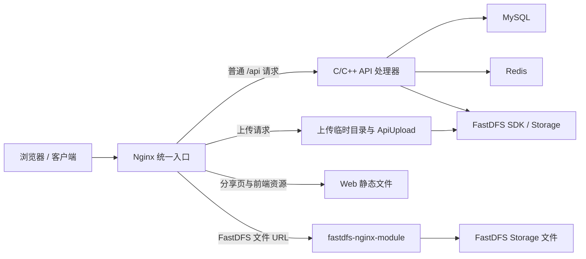
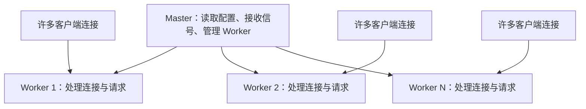
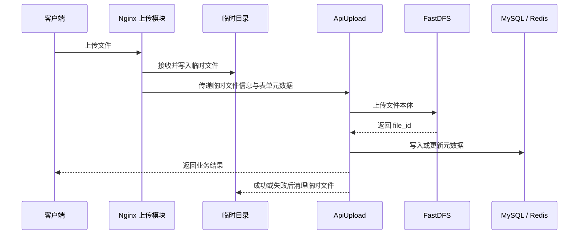
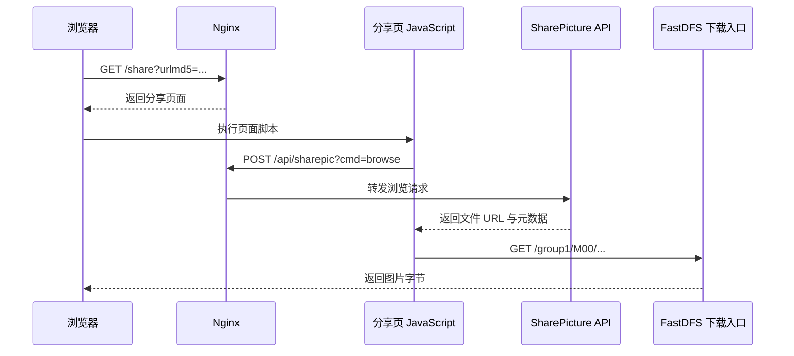

# Nginx 入门：从反向代理、上传下载到网盘项目实践

> **读者定位**：这不是一份指令字典，而是一篇“先建立心智模型，再读懂项目配置”的入门笔记。  
> **阅读主线**：项目为什么需要 Nginx → 一次请求怎样被选中和转发 → 上传、下载、分享各走哪条链路 → 性能与高可用从哪里来 → 配置出错时怎样排查。  
> **代码复核基线**：已读取 `D:\Desktop\AI_YunCunChu` 的 Nginx 配置、Docker Compose、启动脚本和业务源码。项目实际配置为 2 个 worker、HTTP 跳 HTTPS、React 静态资源、13 条 FastCGI TCP 路由和 `ngx_fastdfs_module` 下载；没有 `nginx-upload-module` 指令、没有 `upstream`、没有多业务实例负载均衡。下文通用 Nginx 示例仍是教学设计，不能冒充项目现状。

---

## 先记住这段总纲

Nginx 可以先被理解成站在客户端与后端服务之间的“统一接待台”：

- 客户端只需要访问一个域名和端口；
- Nginx 根据域名、路径等规则决定由谁处理请求；
- 页面、CSS、JavaScript 等静态文件可以直接返回；
- 普通 API 可以转交给 C/C++ 业务处理器；
- 上传请求可以先落到临时目录，再交给上传处理器；
- FastDFS 文件可以通过专用下载模块返回；
- 多个后端实例存在时，Nginx 还能分配流量、记录链路耗时并限制异常请求。

放到本网盘项目中，一句话就是：

> **Nginx 负责“接入、分流和传输”，C/C++ API 负责业务规则，MySQL/Redis 负责状态，FastDFS 负责文件本体。**

四者不能相互替代。

```text
客户端
  │
  ▼
Nginx：域名、TLS、路由、静态文件、上传入口、下载出口、日志、限流
  ├─ /api/...    ──► C/C++ API ──► MySQL / Redis / FastDFS SDK
  ├─ /share      ──► 分享页面
  ├─ /assets/... ──► CSS / JavaScript / 图片资源
  └─ /group1/... ──► fastdfs-nginx-module ──► FastDFS Storage
```

如果面试时只能说一句话：

> **Nginx 是事件驱动的 Web 服务器和反向代理；本项目用它统一接入请求，并把 API、上传、分享页和 FastDFS 下载导向不同处理链路。**

---

## 0. 阅读约定：哪些是事实，哪些是教学重建

> **本节导读**：没有源代码时，最危险的不是不知道，而是把推测写成事实。

本文使用三种标记：

| 标记 | 含义 | 示例 |
|---|---|---|
| **可确认** | 当前源码与配置直接证明 | 13 条 API 使用 `fastcgi_pass`；普通上传正文由 `upload_cgi` 读取；下载使用 `ngx_fastdfs_module` |
| **设计示例** | 用于学习但未在当前配置中启用 | `upstream` 多实例、限流、签名下载、Nginx upload module |
| **教学示例** | 为帮助学习而给出的通用配置 | `upstream image_api` 中的端口、超时和实例数 |

特别注意：

1. `ngx_fastdfs_module` 不是 Nginx 官方核心模块；当前配置没有使用 `nginx-upload-module`；
2. 项目接口资料对上传正文的描述存在不一致：一处写 `application/octet-stream`，示例又具有 `multipart/form-data` 特征；
3. 因此，本文只确认“先由 Nginx 接收并落临时文件，再通知上传处理器”这一层，不虚构具体第三方模块指令；
4. 普通 `/api/...` 已确认走 FastCGI TCP 端口 `10000`～`10012`，不是 HTTP `proxy_pass`。

这份笔记的目标是让你得到一套可迁移的理解方法，而不是背诵一份未经验证的配置。

---

## 1. 为什么项目需要 Nginx

> **本节导读**：先看到“没有它会怎样”，才能理解它为什么位于架构最前面。

假设客户端直接访问每一个 C/C++ 处理器，会出现一串问题：

- 注册、登录、文件列表、上传、下载可能暴露不同端口；
- 客户端必须知道后端实例地址，后端扩容会迫使客户端改配置；
- 每个业务进程都要重复处理 TLS、静态资源、连接管理和访问日志；
- 大文件上传会长时间占用业务进程，临时文件和失败清理更难统一；
- FastDFS Storage 地址一旦直接写进业务数据，机器迁移和故障切换会很痛苦；
- 任何一个后端实例过载或下线，都可能直接暴露给用户。

Nginx 加入后，外部世界只看见一个稳定入口：



Nginx 带来的不是“多加一层就一定更快”，而是职责分离：

| 问题         | 更适合由谁处理      | 原因           |
| ---------- | ------------ | ------------ |
| 域名、端口、TLS  | Nginx        | 所有请求的共同入口能力  |
| URI 路由     | Nginx        | 可在进入业务前完成分流  |
| 用户是否有权删除文件 | C/C++ API    | 需要业务数据与授权规则  |
| Token 会话   | Redis + API  | 属于业务身份状态     |
| 文件元数据      | MySQL        | 需要查询、约束和事务   |
| 文件二进制内容    | FastDFS      | 面向分布式文件存储    |
| 静态页面与大文件传输 | Nginx / 专用模块 | 避免业务进程重复搬运字节 |

### 1.1 正向代理与反向代理不要混

**正向代理**代表客户端访问外部服务，外部服务通常不知道真实客户端是谁。

```text
客户端 ──► 正向代理 ──► 互联网服务
          代理的是“客户端”
```

**反向代理**代表服务端接收客户端请求，再转给内部后端；客户端通常不知道真正处理请求的是哪台机器。

```text
客户端 ──► Nginx ──► API-1 / API-2 / API-3
          代理的是“服务端”
```

本项目使用的是反向代理思路。

---

## 2. Nginx 到底是什么，不是什么

> **本节导读**：把能力边界讲清楚，比堆很多“支持某某功能”的名词更重要。

### 2.1 它是什么

Nginx 的常见角色包括：

- Web 服务器：直接返回静态文件；
- 反向代理：把请求转给 HTTP、FastCGI、gRPC 等后端；
- 七层负载均衡器：在多个应用实例之间分配 HTTP 请求；
- TLS 终止点：集中处理 HTTPS 证书和加密连接；
- HTTP 缓存、压缩、限流和访问日志入口；
- 借助第三方模块，扩展上传处理或特定存储系统的下载能力。

同一个 Nginx 可以同时承担多种角色。角色由配置决定，不是安装时二选一。

### 2.2 它不是什么

Nginx 不是：

- 业务服务：它不知道“这个用户是否拥有这个文件”；
- 数据库：不能替代 MySQL 的查询、约束和事务；
- 会话存储：不能替代 Redis 中的 Token 状态；
- 分布式文件系统：不能替代 FastDFS 的文件放置与副本同步；
- 自动获得的高可用方案：一台 Nginx 仍然是单点；
- 万能加速器：后端 SQL 慢、磁盘满、网络堵塞时，Nginx 不能凭空消除瓶颈。

### 2.3 入口层、业务层和存储层

可以把项目分成三层：

```text
入口层：Nginx
  关心“请求从哪里来、交给谁、传输是否正常”

业务层：C/C++ API
  关心“用户要做什么、有没有权限、业务状态如何变化”

存储层：MySQL / Redis / FastDFS
  关心“元数据、临时状态和文件内容怎样保存”
```

边界越清楚，故障越容易定位。

---

## 3. 为什么 Nginx 能承接大量连接

> **本节导读**：高性能首先是并发模型问题，不是某个神奇参数。

### 3.1 Master 与 Worker

Nginx 典型地包含一个 Master 进程和多个 Worker 进程：



- **Master** 主要负责配置、信号和进程生命周期；
- **Worker** 才处理实际请求；
- `worker_processes auto;` 可以让 Nginx按可用 CPU 自动选择 Worker 数量；
- Worker 通常采用事件驱动方式，一个 Worker 可以管理许多处于不同状态的连接。

### 3.2 事件驱动的人话解释

“一个请求一个线程”的思路像让服务员在厨房等一道菜做完，期间不能招待别人。

事件驱动更像：

1. 服务员记录 A 桌点单；
2. 厨房处理期间，服务员继续接待 B、C、D 桌；
3. A 桌菜好后，系统通知服务员送菜；
4. 服务员不必为每张桌子全程阻塞等待。

这特别适合网络连接多、等待时间多的场景。

### 3.3 高并发不等于单请求零延迟

Nginx 的优势主要体现在：

- 用较少进程管理大量连接；
- 避免为每个连接创建一个重量级线程；
- 高效转发网络数据和静态文件；
- 将慢客户端与后端服务适度隔离。

但一次请求的总耗时仍近似由这些部分组成：

```text
总耗时
≈ 客户端到 Nginx 的网络时间
+ Nginx 排队与处理时间
+ Nginx 到上游的连接时间
+ 上游业务与数据库时间
+ 响应传输时间
```

如果 MySQL 查询花了两秒，Nginx 不会把业务计算变成两毫秒。

### 3.4 不要死背“最大并发公式”

常见说法是：

```text
并发上限 ≈ worker_processes × worker_connections
```

它只能当非常粗糙的起点，不能当真实容量。官方文档明确指出，`worker_connections` 统计的不只是客户端连接，还包括到代理后端的连接，并且最终还受文件描述符上限约束。

一次普通代理请求往往同时占用：

```text
客户端 ── 连接 1 ── Nginx ── 连接 2 ── 上游
```

长连接、WebSocket、上游 Keepalive、慢客户端、磁盘 I/O 和内存也会改变真实容量。正确做法是配置合理上限后进行压测和观测。

---

## 4. 配置文件的五层心智模型

> **本节导读**：先知道每条指令应该放在哪一层，配置就不会只剩“复制粘贴”。

一个简化的结构如下：

```nginx
# main：进程级配置
worker_processes auto;
error_log /var/log/nginx/error.log warn;

events {
    # 连接处理级配置
    worker_connections 2048;
}

http {
    # 所有 HTTP 虚拟服务器共享的配置
    include mime.types;
    sendfile on;

    upstream image_api {
        # 一组后端实例
        server 127.0.0.1:9001;
        server 127.0.0.1:9002;
    }

    server {
        # 一个虚拟服务器
        listen 80;
        server_name image.example.com;

        location /api/ {
            # 一类 URI 的处理规则
            proxy_pass http://image_api;
        }
    }
}
```

可以把它记成：

```text
main
├─ events
└─ http
   ├─ upstream
   └─ server
      └─ location
```

### 4.1 简单指令与块指令

- 简单指令通常以分号结束，如 `sendfile on;`；
- 块指令用花括号包含子配置，如 `http { ... }`；
- 指令只能放在允许的上下文中；
- 很多指令可以从外层继承到内层，但每个模块的继承规则不完全相同。

因此，遇到不熟悉的指令，至少查清四件事：

| 问题 | 为什么要查 |
|---|---|
| 语法是什么 | 参数数量和单位不能猜 |
| 默认值是什么 | “没写”不等于“关闭” |
| 允许放在哪个上下文 | 放错层级会导致配置检查失败 |
| 是否继承、怎样继承 | 子级覆盖可能让父级规则失效 |

### 4.2 配置目录不是跨系统统一标准

很多 Ubuntu/Debian 教程使用：

```text
/etc/nginx/sites-available/
/etc/nginx/sites-enabled/
```

这是发行版打包约定，不是 Nginx 核心语法。容器镜像、源码安装或其他发行版可能只有 `nginx.conf` 与 `conf.d/*.conf`。

判断当前机器真正加载了什么，应使用：

```bash
nginx -V
nginx -T
```

其中 `nginx -V` 可查看版本、编译参数和模块，`nginx -T` 会在检查配置的同时打印最终配置。

### 4.3 修改配置的安全动作

```bash
# 1. 检查语法与引用文件
nginx -t

# 2. 检查成功后再平滑重载
nginx -s reload
```

由 systemd 管理时，常见命令是：

```bash
systemctl reload nginx
```

平滑重载的关键过程是：

1. Master 先验证新配置；
2. 验证成功后启动新 Worker；
3. 旧 Worker 停止接新请求，并在完成已有请求后退出；
4. 如果新配置无法应用，旧配置继续工作。

所以“改配置”与“让线上请求全部中断”不是一回事，但前提仍是先执行 `nginx -t`。

---

## 5. 一次请求到底匹配哪个配置

> **本节导读**：Nginx 入门最值得吃透的不是指令数量，而是请求选择顺序。

请求到来后，可以按三步理解：

```text
第 1 步：listen
  先看目标 IP 和端口

第 2 步：server_name
  再用 Host 选择虚拟服务器

第 3 步：location
  在选中的 server 内，根据 URI 路径选择处理规则
```

### 5.1 Server 的选择

假设多个 `server` 都监听 80 端口，Nginx 会比较请求的 Host 与 `server_name`。如果没有匹配，就由该监听地址的默认服务器处理。

```nginx
server {
    listen 80 default_server;
    server_name _;
    return 444;
}

server {
    listen 80;
    server_name image.example.com;
    # 网盘站点配置
}
```

`default_server` 属于 `listen` 对应的地址和端口，不是某个域名的全局属性。

### 5.2 Location 的核心优先级

先记住一个够用的版本：

1. `=`：精确匹配，命中后立即停止；
2. 普通前缀：先保存“最长前缀”候选；
3. `^~`：若最长前缀带它，则不再检查正则；
4. `~`、`~*`：按配置书写顺序测试，第一条命中的正则获胜；
5. 正则都不命中时，使用刚才保存的最长前缀。

```nginx
location = /api/login {
    # 只处理登录路径
}

location ^~ /assets/ {
    # 静态资源前缀；命中后不让后面的正则截走
}

location /api/ {
    # 其他 API 前缀
}

location / {
    # 最后的兜底
}
```

这不是“从上到下第一条都算”。普通前缀会比较长度，正则才与书写顺序密切相关。

### 5.3 查询参数不参与 Location 匹配

这是本项目最实用的一条：

```text
/api/myfiles?cmd=count
/api/myfiles?cmd=normal
/api/myfiles?cmd=pvasc
```

三者的 URI 路径都是 `/api/myfiles`，因此会进入同一个 Location。`cmd` 由后端程序读取，或者由 Nginx 通过 `$arg_cmd` 访问，但不参与 Location 的路径选择。

同理：

```nginx
location = /api/myfiles {
    # 会匹配 /api/myfiles?cmd=count
}
```

有些社区教程会把查询参数也算进精确匹配，这是不准确的。官方说明中的 Location 匹配对象是规范化后的 URI，参数属于 `args`，不属于路径。

### 5.4 用项目路由做一次手算

```nginx
location = /api/upload { ... }
location ^~ /assets/   { ... }
location /api/         { ... }
location = /share      { ... }
location /             { ... }
```

| 请求 | 命中规则 | 原因 |
|---|---|---|
| `POST /api/upload` | `= /api/upload` | 精确匹配 |
| `POST /api/login` | `/api/` | 最长可用前缀 |
| `GET /assets/app.js` | `^~ /assets/` | 静态资源前缀 |
| `GET /share?urlmd5=...` | `= /share` | 参数不影响路径精确匹配 |
| `GET /unknown` | `/` | 兜底 |

---

## 6. 项目中的四条 Nginx 链路

> **本节导读**：配置的本质，是把不同类型的请求放进正确的处理流水线。

### 6.1 普通 API 链路

项目资料列出了这些主要入口：

| URI | 对应职责 |
|---|---|
| `/api/reg` | 注册 |
| `/api/login` | 登录 |
| `/api/myfiles` | 个人文件数量与列表 |
| `/api/sharefiles` | 公共共享列表 |
| `/api/dealfile` | 分享、取消分享、删除、下载量等操作 |
| `/api/dealsharefile` | 转存等共享文件操作 |
| `/api/sharepic` | 图片分享创建、浏览与取消 |
| `/api/md5` | MD5 秒传判断 |
| `/api/upload` | 真实上传 |

普通请求的共同骨架是：

```text
客户端
  └─► Nginx
       └─► C/C++ API 处理器
            ├─► Redis：Token、排行榜或缓存状态
            ├─► MySQL：用户与文件元数据
            └─► FastDFS SDK：需要操作文件时调用
```

Nginx 只负责把请求交到正确入口，不应在配置中重写注册、鉴权、删除等业务规则。

### 6.2 上传链路

当前项目没有配置 `nginx-upload-module`。普通上传的实际链路是：Nginx 把 multipart 请求体通过 FastCGI 传给 `upload_cgi`，该程序全量读取请求体并自行写本地临时文件。下面上传模块流程仅作为另一种架构方案，不代表当前实现：



这里有三个重要边界：

1. **临时落盘不是上传完成**：只有 FastDFS 与业务元数据都达到约定状态，业务才算成功；
2. **临时目录是容量风险点**：超时、进程崩溃、磁盘满都可能留下孤儿文件；
3. **协议必须以真实配置为准**：第三方模块可能重写请求正文或将文件路径放进参数，后端未必收到原始上传流。

### 6.3 FastDFS 下载链路

项目资料给出的下载形态类似：

```text
GET /group1/M00/00/00/xxxx.jpg
```

链路是：

```text
客户端
  └─► Nginx + fastdfs-nginx-module
       └─► FastDFS Storage 上的文件
            └─► 文件字节返回客户端
```

`fastdfs-nginx-module` 属于 FastDFS 生态，不是官方 `proxy_pass` 的同义词。它需要和 FastDFS 的组、存储路径及模块配置配合。

项目还把下载量 `pv` 作为单独业务动作上报。于是：

```text
“文件成功返回”与“下载量成功加一”是两个不同结果
```

如果文件返回成功但 PV 上报失败，统计会偏小；反过来，过早上报可能让失败下载也计数。Nginx 负责传文件，精确统计口径仍属于业务设计。

### 6.4 分享页面链路

图片分享不是简单地把页面 URL 当成文件 URL：



同一个 Nginx 在这条链路上连续扮演了三种角色：

- 返回静态页面；
- 反向代理分享 API；
- 输出 FastDFS 图片。

---

## 7. 反向代理：把 API 交给后端

> **本节导读**：反向代理最核心的指令只有几条，真正容易出错的是 URI、请求头和超时语义。

### 7.1 最小可读示例

```nginx
upstream image_api {
    server 127.0.0.1:9001;
    server 127.0.0.1:9002;
}

server {
    listen 80;
    server_name image.example.com;

    location /api/ {
        proxy_pass http://image_api;

        proxy_http_version 1.1;
        proxy_set_header Host $host;
        proxy_set_header X-Real-IP $remote_addr;
        proxy_set_header X-Forwarded-For $proxy_add_x_forwarded_for;
        proxy_set_header X-Forwarded-Proto $scheme;
        proxy_set_header X-Request-ID $request_id;

        proxy_connect_timeout 3s;
        proxy_send_timeout 60s;
        proxy_read_timeout 60s;
    }
}
```

各指令解决的问题：

| 指令 | 作用 | 常见误解 |
|---|---|---|
| `proxy_pass` | 指定上游地址或上游组 | 不是浏览器重定向，客户端看不到内部地址 |
| `proxy_set_header` | 重定义或补充发给上游的请求头 | 原始 Host 并不会在所有情况下原样传递 |
| `proxy_connect_timeout` | 等待与上游建立连接 | 不是整个请求的总超时 |
| `proxy_send_timeout` | 向上游两次写操作之间的超时 | 不是上传总时长 |
| `proxy_read_timeout` | 从上游两次读操作之间的超时 | 不是响应完整传输的总时长 |

### 7.2 `proxy_pass` 末尾斜杠陷阱

下面两段看起来只差一个斜杠，转给后端的 URI 却不同。

**不带 URI：保留原请求 URI**

```nginx
location /api/ {
    proxy_pass http://image_api;
}
```

```text
/api/login  ──►  http://image_api/api/login
```

**带 URI `/`：用它替换命中的 Location 前缀**

```nginx
location /api/ {
    proxy_pass http://image_api/;
}
```

```text
/api/login  ──►  http://image_api/login
```

选择哪一种，不取决于“哪个更标准”，而取决于后端究竟注册了 `/api/login` 还是 `/login`。改斜杠相当于改接口契约，不能凭感觉。

### 7.3 为什么要传这些请求头

Nginx 与后端之间建立的是新连接。若不显式传递信息，后端看到的直接对端通常是 Nginx，而不是用户。

```text
客户端 IP 203.0.113.10
    │
    ▼
Nginx 127.0.0.1
    │
    ▼
后端看到的 TCP 对端：127.0.0.1
```

因此常传：

- `Host`：用户访问的站点；
- `X-Real-IP`：直接客户端地址；
- `X-Forwarded-For`：经过的代理地址链；
- `X-Forwarded-Proto`：外部使用 HTTP 还是 HTTPS；
- `X-Request-ID`：跨 Nginx、API、数据库日志关联一次请求。

安全边界也必须记住：

> 后端只能信任由受控 Nginx 写入的转发头，不能对公网客户端自带的 `X-Forwarded-For` 无条件信任。

如果 Nginx 前面还有云负载均衡器，应先正确配置 Real IP 信任范围，否则限流与审计看到的可能全是负载均衡器地址。

### 7.4 响应缓冲与请求缓冲不是一回事

| 指令 | 控制方向 | 默认行为 |
|---|---|---|
| `proxy_buffering` | 上游响应 → Nginx → 客户端 | 通常开启响应缓冲 |
| `proxy_request_buffering` | 客户端请求体 → Nginx → 上游 | 默认开启请求体缓冲 |

开启请求缓冲时，Nginx 先接收客户端请求体，再转给上游，有助于隔离慢客户端；关闭后，请求体会更接近流式地送到上游，但上游连接会更早、更久地被占用。

对本项目上传而言，不能简单照抄 `proxy_request_buffering off;`：实际后端是 FastCGI，`upload_cgi` 还会把整个请求体读入内存并自行落临时文件。缓冲策略必须结合 `fastcgi_request_buffering`、12 MiB 请求上限和后端内存行为验证。

### 7.5 当前后端实际使用 FastCGI

原始配置已确认普通 API 使用 FastCGI，并把不同路径映射到不同 TCP 端口。入口形态如下：

```nginx
location /api/ {
    include fastcgi_params;

    fastcgi_param QUERY_STRING   $query_string;
    fastcgi_param REQUEST_METHOD $request_method;
    fastcgi_param CONTENT_TYPE   $content_type;
    fastcgi_param CONTENT_LENGTH $content_length;
    fastcgi_param REQUEST_URI    $request_uri;

    fastcgi_pass unix:/run/image-api.sock;
}
```

`proxy_pass` 面向 HTTP 上游，`fastcgi_pass` 面向 FastCGI 上游，二者不能只改指令名就认为完全等价。参数映射和后端协议必须一起确认。

---

## 8. 静态文件：分享页为什么不必经过业务进程

> **本节导读**：能直接从文件系统安全返回的内容，不必让 C/C++ API 再读一遍、写一遍。

### 8.1 `root` 与 `alias`

假设请求是 `/assets/app.js`。

```nginx
location /assets/ {
    root /srv/image-web;
}
```

文件路径是：

```text
/srv/image-web + /assets/app.js
= /srv/image-web/assets/app.js
```

如果使用：

```nginx
location /assets/ {
    alias /srv/image-web/static/;
}
```

文件路径则是：

```text
/srv/image-web/static/ + app.js
= /srv/image-web/static/app.js
```

记忆方式：

- `root` 会保留完整 URI 路径；
- `alias` 用指定目录替换匹配到的 Location 前缀。

斜杠和实际目录必须一起验证，不能只看配置是否通过语法检查。

### 8.2 用 `try_files` 明确失败路径

```nginx
server {
    root /srv/image-web;

    location = /share {
        try_files /share.html =404;
    }

    location ^~ /assets/ {
        try_files $uri =404;
    }
}
```

`try_files` 会按顺序检查文件；都不存在时明确返回 404。它比“让请求在多个规则里偶然兜转”更容易理解和排错。

### 8.3 `sendfile` 的意义

```nginx
http {
    sendfile on;
}
```

它允许 Nginx 使用操作系统的 `sendfile()` 能力传送文件，减少不必要的数据复制路径。它不是“所有文件场景都自动最快”的保证，大文件、异步 I/O、缓存和磁盘类型仍需实测。

### 8.4 哪些内容适合缓存

项目中更适合设置长期缓存的是带版本号或内容哈希的静态资源：

```nginx
location ^~ /assets/ {
    try_files $uri =404;
    expires 7d;
}
```

以下内容不要不加区分地缓存：

- 登录与 Token 响应；
- “我的文件”这类个性化数据；
- 分享、删除、转存等状态变更；
- 权限尚未厘清的 FastDFS 私有文件。

缓存的第一问题不是“能省多少性能”，而是“旧响应被重复使用是否仍然正确”。

---

## 9. 上传与下载：真正的难点是边界和失败窗口

> **本节导读**：大文件链路不是“把超时调大”这么简单，内存、磁盘、后端连接和业务一致性都会参与。

### 9.1 三个容易混淆的请求体配置

| 配置 | 回答的问题 | 典型现象 |
|---|---|---|
| `client_max_body_size` | 最大允许上传多大 | 超过后返回 413 |
| `client_body_buffer_size` | 请求体在内存中缓冲多少 | 超出缓冲后可能写临时文件 |
| `client_body_temp_path` | 临时请求体写到哪里 | 磁盘满或权限错误导致上传失败 |

官方文档给出的 `client_max_body_size` 默认值是 1m。网盘项目显然需要根据产品限制显式设置，而不是让用户上传稍大图片时才发现 413。

```nginx
server {
    client_max_body_size 50m;
    client_body_temp_path /var/lib/nginx/client-body 1 2;
}
```

这里的 50m 只是教学值。真实值应同时满足：

```text
产品允许的文件上限
≤ Nginx 请求上限
≤ 上传模块与后端可接受上限
≤ FastDFS 与运维容量策略允许上限
```

如果各层限制不一致，用户会得到难以解释的失败。

### 9.2 上传不是一个原子动作

一次真实上传至少可能跨越：

1. Nginx 接收请求；
2. 临时文件写入；
3. ApiUpload 读取临时文件；
4. FastDFS 保存文件并返回 `file_id`；
5. MySQL 写文件元数据；
6. Redis 更新计数、缓存或排行；
7. 临时文件清理。

这些系统之间没有天然的单一事务。典型失败窗口包括：

| 失败位置 | 可能结果 | 补偿思路 |
|---|---|---|
| 临时文件写完，ApiUpload 未执行 | 临时目录出现孤儿文件 | 定时清理超过安全期限的文件 |
| FastDFS 成功，MySQL 失败 | 有文件本体但无业务记录 | 记录待补偿任务，删除或补写 |
| MySQL 成功，响应丢失 | 客户端以为失败而重试 | 幂等键、唯一约束、查询最终状态 |
| 删除元数据成功，FastDFS 删除失败 | 数据库不可见但存储仍占空间 | 异步重试与对账 |

Nginx 可以帮助稳定传输，却不能替代跨存储的一致性设计。

### 9.3 不要盲目重试上传和写操作

读请求失败后换一台上游，通常较容易理解；写请求重试则可能重复产生副作用。

```text
客户端上传成功
  └─ 响应返回途中连接中断
       └─ 客户端或代理重试
            └─ 同一文件可能再次写入
```

所以：

- 不要为了“高可用”随意允许非幂等 POST 在多个上游间重放；
- 秒传、上传、分享、转存、删除应设计业务幂等性；
- 可用 `request_id` 或专门的幂等键关联一次操作；
- MySQL 唯一约束要成为最后一道防线，而不是只依赖“先查再写”。

### 9.4 直接下载与受控下载

项目返回类似 `/group1/M00/...` 的永久文件地址，适合公共图片，但也带来一个边界：

> 只要知道 URL 就能直接访问时，业务 API 的 Token 校验不会自动保护这次下载。

可以按文件属性选择两类方案：

| 文件类型 | 建议链路 |
|---|---|
| 公共图片 | 直接通过 FastDFS 下载入口，配合缓存和防盗链策略 |
| 私有文件 | 先由业务 API 鉴权，再签发短期 URL，或内部跳转到受保护下载 Location |

一种通用的受控下载思路是：

```text
客户端请求 /api/download?id=...
  └─► API 校验 Token、文件归属与状态
       └─► 返回内部跳转信息
            └─► Nginx 内部 Location 发送文件
```

对于 FastDFS 第三方模块，内部跳转的具体 Location 与模块指令必须根据真实安装版本验证，本文不伪造可粘贴配置。

---

## 10. 负载均衡：把请求分出去，不等于问题消失

> **本节导读**：负载均衡负责“选哪台后端”，但会话、幂等性、健康检查和容量仍由整个系统共同保证。

### 10.1 最基本的 Upstream

```nginx
upstream image_api {
    server 127.0.0.1:9001 max_fails=3 fail_timeout=10s;
    server 127.0.0.1:9002 max_fails=3 fail_timeout=10s;
    keepalive 32;
}

location /api/ {
    proxy_http_version 1.1;
    proxy_set_header Connection "";
    proxy_pass http://image_api;
}
```

如果不写算法，HTTP Upstream 默认使用轮询。常见选择还有：

| 算法 | 核心思想 | 更适合什么情况 |
|---|---|---|
| 轮询 | 请求依次分给各节点 | 后端能力和请求成本接近 |
| `least_conn` | 优先给活动连接较少的节点 | 请求耗时差异较大 |
| `ip_hash` | 同类客户端 IP 尽量落到同一节点 | 必须保持简单会话粘性时 |
| `hash` | 按指定键稳定映射 | 需要按租户或资源键路由时 |
| 权重 | 高配置节点接更多流量 | 节点容量不相同 |

“轮询”均衡的是请求次数倾向，不一定均衡 CPU、数据库耗时或文件大小。

### 10.2 本项目为什么不应依赖粘性会话

项目 Token 状态位于 Redis，文件元数据位于 MySQL，而不是只放在某个 API 进程内存里。理想情况下，任意 API 实例都能处理同一用户的下一次请求：

```text
第一次登录  ──► API-1
下一次列表  ──► API-2
下一次分享  ──► API-3
               仍可从 Redis / MySQL 获取状态
```

这比强依赖 `ip_hash` 更利于扩缩容和故障转移。

如果实际代码仍保存了进程内会话或未共享状态，就应先修正状态设计，不能用粘性负载均衡长期掩盖问题。

### 10.3 被动失败判断不是完整健康检查

开源 Nginx 可以根据连接失败、超时等请求结果暂时避开异常节点，这属于被动判断。它不能自动证明：

- MySQL 依赖是否健康；
- Redis 是否可访问；
- 磁盘是否只读或已满；
- 某个关键业务接口是否仍能正确返回。

完整方案通常还需要：

- 应用提供只读、轻量的健康接口；
- 外部负载均衡器或监控系统主动探测；
- 就绪检查与存活检查分开；
- 故障节点自动摘除后仍能告警，而不是静默少一台机器。

### 10.4 单台 Nginx 仍然是单点

```text
客户端 ──► 单台 Nginx ──► 多台 API
              ▲
              └─ 它一旦故障，后端再多也进不来
```

入口高可用通常需要：

```text
客户端
  └─► 云负载均衡 / 四层 VIP / Keepalived 等入口
       ├─► Nginx-1
       └─► Nginx-2
            └─► 多台 API 与多节点存储
```

当前 Compose 只有一个 Nginx 容器，也没有 VIP、云负载均衡或第二个入口实例，因此明确不是入口高可用。

---

## 11. Nginx 的高性能到底来自哪里

> **本节导读**：高性能来自工作模型和数据路径，不来自随手抄一组“调优参数”。

### 11.1 主要来源

| 能力 | 减少了什么 |
|---|---|
| 事件驱动 Worker | 大量阻塞线程及上下文切换 |
| 静态文件直接服务 | 业务进程重复读写文件 |
| `sendfile()` | 某些场景中的用户态数据复制 |
| 上游连接复用 | 频繁建立后端连接的成本 |
| 请求/响应缓冲 | 慢客户端对后端连接的长期占用 |
| 压缩与缓存 | 重复传输和重复计算 |
| 统一限流 | 异常流量直接冲击业务服务 |

### 11.2 项目中更可能先遇到的瓶颈

网盘系统常见瓶颈不只在 Nginx：

```text
上传入口
  ├─ 临时目录磁盘写入
  ├─ Nginx 与 ApiUpload 间的交接
  ├─ 到 FastDFS 的网络
  └─ Storage 磁盘

普通 API
  ├─ MySQL 慢查询与锁
  ├─ Redis 连接和热点 Key
  └─ C/C++ 线程池或连接池

下载入口
  ├─ Storage 磁盘读
  ├─ Nginx/Storage 网卡
  └─ 大量慢客户端连接
```

因此调优顺序应是：

1. 先定义指标和目标；
2. 用访问日志分解 Nginx 与上游耗时；
3. 用系统指标确认 CPU、内存、磁盘、网络和文件描述符；
4. 找到瓶颈后再改一个变量；
5. 重新压测，确认吞吐、延迟和错误率都改善。

### 11.3 不建议新手直接照抄的参数

以下参数常出现在“性能模板”里，但没有测量依据时不要随意改：

- 强行指定事件模型；
- 盲目把 Worker 数量设得远大于 CPU；
- 把 `worker_connections` 调得极高，却不调整文件描述符和内存规划；
- 全局关闭缓冲；
- 对所有响应开启超大缓存区；
- 把所有超时都改成数十分钟；
- 不区分 API 和大文件下载，使用一套限速与连接策略。

“参数更大”经常只是把失败推迟到内存耗尽或磁盘爆满。

---

## 12. 日志：让一次请求能够被完整还原

> **本节导读**：日志不是越多越好，而是要回答“慢在哪里、错在哪台、是否到过上游”。

### 12.1 Access Log 与 Error Log

| 日志 | 主要回答 |
|---|---|
| Access Log | 谁在何时请求了什么、状态码、总耗时、上游地址和上游耗时 |
| Error Log | 建连失败、超时、权限、文件不存在、模块错误、配置运行问题 |

一个偏项目排障的 JSON 访问日志示例：

```nginx
log_format project_json escape=json
    '{"time":"$time_iso8601",'
    '"request_id":"$request_id",'
    '"remote_addr":"$remote_addr",'
    '"method":"$request_method",'
    '"uri":"$uri",'
    '"status":$status,'
    '"bytes":$body_bytes_sent,'
    '"request_time":$request_time,'
    '"upstream_addr":"$upstream_addr",'
    '"upstream_status":"$upstream_status",'
    '"upstream_connect_time":"$upstream_connect_time",'
    '"upstream_response_time":"$upstream_response_time"}';

access_log /var/log/nginx/image-access.log project_json;
error_log  /var/log/nginx/image-error.log warn;
```

### 12.2 用两个时间快速定位

```text
request_time 很大
upstream_response_time 也很大
  └─ 更可能慢在 API、数据库或上游网络

request_time 很大
upstream_response_time 很小
  └─ 更可能慢在客户端传输、响应缓冲或大文件发送

upstream_connect_time 很大
  └─ 更可能是上游过载、网络问题、监听队列或建连失败
```

这只是第一轮定位，不是最终定论，但比只看状态码有效得多。

### 12.3 日志中的安全边界

不要为了“排障方便”长期记录：

- 请求正文 `$request_body`；
- Token、密码和 Cookie；
- 上传文件内容；
- 带敏感查询参数的完整 `$request`；
- 内部密钥或签名 URL 的完整值。

本文示例使用 `$uri` 而非完整请求行，正是为了避免默认把查询参数全部写入结构化日志。若业务确需记录参数，也应先脱敏和白名单化。

### 12.4 关联 Nginx 与应用日志

```nginx
proxy_set_header X-Request-ID $request_id;
add_header X-Request-ID $request_id always;
```

C/C++ API 应在每条关键日志中带上同一个请求 ID，并在重要阶段记录：

```text
请求进入
Token 校验结果
路由命令 cmd
MySQL / Redis / FastDFS 操作开始与结束
受影响的业务对象 ID
耗时、结果和可重试性
```

不要记录密码、完整 Token、文件正文等敏感数据。

---

## 13. 限流、TLS 与安全边界

> **本节导读**：Nginx 是很好的第一道门，但安全规则需要与业务鉴权相互补充。

### 13.1 限制请求速率

```nginx
http {
    limit_req_zone $binary_remote_addr zone=api_per_ip:10m rate=10r/s;

    server {
        location /api/ {
            limit_req zone=api_per_ip burst=20 nodelay;
            proxy_pass http://image_api;
        }
    }
}
```

这表示按客户端地址维护状态，并允许一定突发流量。具体速率不能照抄，应区分：

- 登录接口：防暴力尝试；
- 列表接口：防高频爬取；
- MD5 查询：防探测和滥用；
- 上传：更应结合并发连接数、文件大小和用户配额；
- FastDFS 下载：更关注连接数、带宽和热点文件。

如果前面还有代理，应先恢复可信真实客户端 IP，否则所有用户可能共享同一个限流键。

### 13.2 请求大小和超时也是保护

安全并不只有“拒绝坏人”。以下限制也用于保护资源：

- 请求体上限，防止无限大上传；
- 请求头和正文读取超时，防止慢速占用连接；
- 上游连接、发送、读取超时，防止故障无限拖住；
- 临时目录容量与 inode 告警；
- API 与下载链路采用不同的连接和带宽策略。

超时不是越短越安全，也不是越长越稳定。它应略高于正常业务高分位耗时，并结合用户体验和重试策略。

### 13.3 HTTPS 终止

典型结构：

```text
浏览器 ══ HTTPS ══► Nginx ── HTTP 或 HTTPS ──► 内部 API
```

Nginx 可以集中管理证书，并把外部协议信息通过 `X-Forwarded-Proto` 传给后端。

```nginx
server {
    listen 80;
    server_name image.example.com;
    return 301 https://$host$request_uri;
}

server {
    listen 443 ssl;
    server_name image.example.com;

    ssl_certificate     /etc/nginx/certs/fullchain.pem;
    ssl_certificate_key /etc/nginx/certs/private.key;

    # 其余 Location
}
```

证书申请、协议版本和密码套件要根据当前 Nginx/OpenSSL 与组织安全基线配置。不要从过时教程复制固定的“最佳密码套件”。

### 13.4 Nginx 能做与不能做的安全检查

| 检查 | Nginx 适合做吗 | 原因 |
|---|---|---|
| TLS、请求大小、基础限流 | 适合 | 与所有请求共同相关 |
| 简单来源控制、防盗链 | 适合做第一层 | 可快速拒绝明显异常 |
| Token 是否有效 | 通常由 API 或鉴权子请求负责 | 需要会话与业务状态 |
| 用户是否拥有文件 | 必须由业务层判断 | 需要数据库关系 |
| 删除是否破坏共享引用 | 必须由业务层判断 | 涉及一致性与引用计数 |

---

## 14. 一份面向本项目的教学配置

> **本节导读**：下面的目标是把前文概念拼起来。它不是项目原配置，也不能在缺少第三方模块时直接上线。

### 14.1 只使用官方核心能力的骨架

```nginx
worker_processes auto;
error_log /var/log/nginx/image-error.log warn;

events {
    worker_connections 2048;
}

http {
    include mime.types;
    default_type application/octet-stream;
    sendfile on;

    log_format project_json escape=json
        '{"time":"$time_iso8601",'
        '"request_id":"$request_id",'
        '"remote_addr":"$remote_addr",'
        '"method":"$request_method",'
        '"uri":"$uri",'
        '"status":$status,'
        '"request_time":$request_time,'
        '"upstream_addr":"$upstream_addr",'
        '"upstream_status":"$upstream_status",'
        '"upstream_response_time":"$upstream_response_time"}';

    upstream image_api {
        least_conn;
        server 127.0.0.1:9001 max_fails=3 fail_timeout=10s;
        server 127.0.0.1:9002 max_fails=3 fail_timeout=10s;
        keepalive 32;
    }

    limit_req_zone $binary_remote_addr zone=api_per_ip:10m rate=20r/s;

    server {
        listen 80;
        server_name image.example.com;

        root /srv/image-web;
        client_max_body_size 50m;

        access_log /var/log/nginx/image-access.log project_json;

        location = /share {
            try_files /share.html =404;
        }

        location ^~ /assets/ {
            try_files $uri =404;
            expires 7d;
        }

        location /api/ {
            limit_req zone=api_per_ip burst=40 nodelay;

            proxy_http_version 1.1;
            proxy_set_header Connection "";
            proxy_set_header Host $host;
            proxy_set_header X-Real-IP $remote_addr;
            proxy_set_header X-Forwarded-For $proxy_add_x_forwarded_for;
            proxy_set_header X-Forwarded-Proto $scheme;
            proxy_set_header X-Request-ID $request_id;

            proxy_connect_timeout 3s;
            proxy_send_timeout 60s;
            proxy_read_timeout 60s;

            # 不带 URI，保留 /api/... 路径
            proxy_pass http://image_api;
        }

        location / {
            try_files $uri =404;
        }
    }
}
```

这份骨架表达的是：

```text
/share      → 分享页
/assets/... → 静态资源
/api/...    → HTTP API 集群
其他路径    → 文件存在则返回，否则 404
```

### 14.2 把项目第三方模块放回拓扑

项目真实架构还需要两个特殊 Location，但由于缺少模块版本和原配置，只能安全地写成结构占位：

```nginx
server {
    # 精确上传入口优先于通用 /api/ 前缀
    location = /api/upload {
        # 仅作可选方案；当前项目未配置 nginx-upload-module
        # 目标：请求体写临时文件，再把文件信息交给 ApiUpload
    }

    location /api/ {
        # 普通 API：proxy_pass 或 fastcgi_pass，以真实后端协议为准
    }

    location ^~ /group1/ {
        # fastdfs-nginx-module 的真实指令与 mod_fastdfs.conf
        # 必须匹配 FastDFS Group、Storage 和 store_path 配置
    }
}
```

这段代码是“配置地图”，不是可执行成品。要恢复真实配置，需要同时取得：

1. Nginx 版本与 `nginx -V`；
2. 动态或静态编译的第三方模块版本；
3. 主配置及所有 `include` 文件；
4. `mod_fastdfs.conf`；
5. 上传临时目录、权限与清理任务；
6. C/C++ 进程监听的协议、地址和端口；
7. 域名、证书与前置负载均衡信息。

### 14.3 上线前的最小验证

```bash
# 查看编译模块和路径
nginx -V

# 检查并打印最终配置
nginx -T

# 只检查语法
nginx -t

# 测试普通 API
curl -i http://image.example.com/api/login

# 测试分享页面及查询参数匹配
curl -i "http://image.example.com/share?urlmd5=test"

# 测试静态资源
curl -I http://image.example.com/assets/app.js

# 上传测试应使用项目真实 Content-Type、字段和认证方式
```

不要只验证“能返回 200”。还要验证：

- 请求是否到达预期处理器；
- 后端收到的 URI 是否保留了 `/api`；
- Host、客户端 IP、协议和请求 ID 是否正确；
- 413、404、502、504 等失败是否符合预期；
- 上传失败后临时文件是否清理；
- FastDFS URL 是否通过稳定域名生成，而不是写死单机 IP。

---

## 15. 状态码与故障排查

> **本节导读**：排障时先沿请求链路缩小范围，不要看到 502 就重启所有服务。

### 15.1 常见现象

| 现象 | 优先检查 | 典型原因 |
|---|---|---|
| 404 | 命中的 Server、Location、文件路径 | Host 错、`root/alias` 错、URI 被改写 |
| 413 | `client_max_body_size` 与各层上传上限 | 文件超过限制 |
| 502 | Error Log、上游地址、监听状态、协议 | 连接拒绝、后端崩溃、把 FastCGI 当 HTTP |
| 504 | 上游耗时与 `proxy_read_timeout` | 后端无数据返回、依赖超时 |
| 请求很慢但 200 | Nginx 与上游分段耗时 | SQL 慢、客户端慢、文件大、磁盘或网络瓶颈 |
| 客户端 IP 全相同 | 代理头和 Real IP 配置 | 看到的是上一级负载均衡器 |
| 配置重载失败 | `nginx -t` 和 Error Log | 语法、证书、文件权限、模块不存在 |

### 15.2 一条从外到内的排查路径

```text
1. DNS 是否指向正确入口
2. 端口和 TLS 是否能建立连接
3. 命中了哪个 server
4. 命中了哪个 location
5. URI 是否被 proxy_pass 的斜杠改变
6. Nginx 能否连接上游
7. 上游是否正确处理并访问 MySQL / Redis / FastDFS
8. 响应是否在回程或客户端侧失败
```

对应工具：

```bash
curl -v http://image.example.com/api/...
curl -I http://image.example.com/assets/...
nginx -t
nginx -T
ss -lntp
tail -f /var/log/nginx/image-access.log
tail -f /var/log/nginx/image-error.log
```

### 15.3 用临时响应确认 Location

在测试环境中，可以短暂地给候选 Location 加不同响应头：

```nginx
location /api/ {
    add_header X-Debug-Location api always;
    proxy_pass http://image_api;
}
```

然后：

```bash
curl -I http://image.example.com/api/login
```

看到 `X-Debug-Location: api` 就能确认路由。确认后应删除调试头，避免把内部信息长期暴露给外部。

### 15.4 开启 Debug Log 要克制

`error_log ... debug;` 需要 Nginx 以调试能力构建，并会产生大量日志。它适合短时间、受控范围定位复杂匹配或模块问题，不适合在高流量生产环境长期全局开启。

---

## 16. 十个常见误解

> **本节导读**：能主动指出边界，比说“我会配反向代理”更能体现真正理解。

### 误解 1：有 Nginx 就是高可用

错。单台 Nginx 仍是单点；后端多实例也无法绕过入口故障。

### 误解 2：Nginx 会自动理解业务接口

错。它只按配置处理协议、域名、URI、请求头等信息，不知道 `cmd=share` 的业务含义。

### 误解 3：Location 按书写顺序第一条命中

错。精确、最长前缀、`^~` 和正则有明确选择规则；只有同阶段正则特别依赖顺序。

### 误解 4：查询参数会决定 Location

错。`?cmd=count` 不参与 URI 路径匹配。

### 误解 5：`proxy_pass` 末尾斜杠只是风格

错。它可能改变传给后端的 URI。

### 误解 6：把超时调大就更稳定

错。过长超时会让故障连接、Worker 连接槽位和上游资源占用更久。

### 误解 7：关闭缓冲一定能降低上传延迟

错。它也可能让慢客户端更久占用上游；项目上传模块还可能依赖临时落盘。

### 误解 8：FastDFS 直链天然受 Token 保护

错。能直接访问的永久 URL 可能绕过业务 API 鉴权。

### 误解 9：返回 200 就说明配置正确

错。请求可能进错后端、丢失真实 IP、错误重写 URI，或写入了错误业务状态。

### 误解 10：网上的完整配置可以直接用于生产

错。模块版本、操作系统、发行版目录、Nginx 版本、上游协议和安全基线都可能不同。教程用于理解，官方文档用于确认语义，实际配置必须在目标环境验证。

---

## 17. 面试时怎样讲清楚

> **本节导读**：先讲项目链路，再讲原理与边界，比背功能列表更自然。

### 17.1 30 秒版本

> 这个网盘项目把 Nginx 放在最前面作为统一入口。当前配置用 2 个 worker，HTTP 重定向 HTTPS，直接返回 React 静态资源，并把 13 条 `/api/*` 路由通过 FastCGI TCP 端口交给业务进程。普通上传正文也走 FastCGI，由 `upload_cgi` 全量读取并落临时文件；下载通过 `ngx_fastdfs_module` 返回 `/group...` 文件。当前没有 `upstream`、限流或多实例负载均衡，单 Nginx 仍是单点。

### 17.2 两分钟版本

> 我理解 Nginx 的核心不是“会写 proxy_pass”，而是先选择 Server，再按 URI 选择 Location，最后执行静态服务、代理或第三方模块处理。本项目里，`/api/myfiles?cmd=...` 的查询参数不会影响 Location，多个 cmd 会进入同一路径，再由业务层分派。普通 HTTP 代理要特别注意 `proxy_pass` 末尾斜杠会不会删掉 `/api` 前缀，还要传递 Host、真实客户端地址、外部协议和请求 ID。
>
> 上传与下载是两条特殊链路。当前普通上传在 FastCGI 程序中全量缓冲请求体并写临时文件；大文件被前端切成 10 MiB 后顺序上传，单请求受 Nginx 12 MiB 上限约束。下载模块直接返回文件，但永久 URL 不自动具备 Token 权限。要完善性能与高可用，还需要流式处理、有界背压、多入口、多业务实例和共享/持久化状态；这些不是当前实现。

### 17.3 追问时可以展开的四条线

| 追问 | 展开方向 |
|---|---|
| 为什么快 | 事件驱动、连接复用、缓冲、静态文件数据路径 |
| 怎么路由 | listen → server_name → location → 具体处理器 |
| 上传怎样保证可靠 | 临时盘、大小限制、超时、幂等、补偿与对账 |
| 如何高可用 | 多入口、多 API、共享状态、健康检查、禁止盲目重试 |

---

## 18. 自测题

> **本节导读**：如果能不看答案讲清这些问题，Nginx 入门框架就已经建立。

1. Nginx 在本项目中至少扮演哪四种角色？
2. Master 与 Worker 分别负责什么？
3. 为什么 `worker_processes × worker_connections` 不能直接当最大用户并发？
4. Nginx 怎样从多个 `server` 中选择一个？
5. 精确 Location、最长前缀、`^~` 和正则的关系是什么？
6. `/api/myfiles?cmd=count` 与 `?cmd=normal` 会进入不同 Location 吗？
7. `proxy_pass http://backend;` 与 `proxy_pass http://backend/;` 可能有什么区别？
8. 为什么后端不能无条件相信客户端自带的 `X-Forwarded-For`？
9. `client_max_body_size`、请求缓冲和临时目录分别解决什么问题？
10. 为什么上传成功不能只定义成“临时文件写完”？
11. 为什么写请求重试比读请求危险？
12. FastDFS 永久直链为什么可能绕过 Token 鉴权？
13. Redis 中共享 Token 状态为什么有利于 API 负载均衡？
14. `request_time` 与 `upstream_response_time` 怎样帮助判断慢在哪里？
15. 为什么两台 API 加一台 Nginx 仍不算入口高可用？

### 18.1 核心答案

1. 统一入口、API 代理、静态服务、上传接入、FastDFS 下载出口、日志/限流/TLS，答出四项即可；
2. Master 管配置、信号和 Worker，Worker 处理连接与请求；
3. 上游连接也计数，还受文件描述符、内存、长连接和数据路径约束；
4. 先按监听地址和端口，再按 Host/`server_name`；
5. 精确优先；保存最长前缀；`^~` 可阻止后续正则；正则按顺序；无正则命中回到最长前缀；
6. 不会，查询参数不参与路径 Location 匹配；
7. 后者带 URI `/`，可能替换掉匹配的 `/api/` 前缀；
8. 该头可被公网客户端伪造，必须由可信代理覆盖并建立信任边界；
9. 分别限制总大小、决定请求体如何交给上游、决定溢出正文写到哪里；
10. 后面还有 FastDFS、元数据、响应和清理等步骤；
11. 可能重复上传、分享、转存或删除；
12. 文件入口未必执行 API 的业务授权；
13. 任意 API 节点都能读取会话，不必依赖单机内存粘性；
14. 两者都慢更像上游慢，只有总时间慢则要检查客户端传输与 Nginx 数据路径；
15. Nginx 自己仍是唯一入口。

---

## 19. 一页记忆卡片

### 19.1 一张图

```text
                    ┌─► C/C++ API ─► MySQL
                    │              ├► Redis
客户端 ─► Nginx ────┤              └► FastDFS SDK
                    ├─► 上传临时目录 ─► ApiUpload
                    ├─► 分享页 / 静态资源
                    └─► FastDFS 下载模块 ─► Storage
```

### 19.2 五层配置

```text
main → events → http → server → location
                  └→ upstream
```

### 19.3 三步选路

```text
listen → server_name → location
```

### 19.4 Location 口诀

```text
精确立即停
前缀取最长
^~ 阻正则
正则看顺序
都不中回最长
查询参数不入场
```

### 19.5 四个项目边界

```text
Nginx 路由，不决定业务权限
上传落盘，不代表业务成功
FastDFS 直链，不代表自动鉴权
单台 Nginx，不代表入口高可用
```

### 19.6 六个排障关键词

```text
nginx -t
nginx -T
Location
proxy_pass 斜杠
request_time
upstream_response_time
```

---

## 20. 参考资料与交叉核对说明

### 20.1 项目内资料

- [网盘项目架构与 HTTP 接口学习文档](网盘项目架构与HTTP接口学习文档.md)
- [FastDFS 架构与分布式高性能高可用入门](./FastDFS架构与分布式高性能高可用入门.md)
- 《架构和功能分析.pdf》
- 《项目接口文档.pdf》

### 20.2 Nginx 官方资料：用于确认配置语义

- [Beginner’s Guide](https://nginx.org/en/docs/beginners_guide.html)：进程模型、配置结构、静态文件、代理与平滑重载
- [How nginx processes a request](https://nginx.org/en/docs/http/request_processing.html)：Server 与 Location 的请求选择过程
- [HTTP Core Module](https://nginx.org/en/docs/http/ngx_http_core_module.html)：Location、请求体限制、`root`、`alias`、`try_files`、`sendfile`
- [HTTP Proxy Module](https://nginx.org/en/docs/http/ngx_http_proxy_module.html)：`proxy_pass`、请求头、缓冲、超时和 URI 替换
- [HTTP FastCGI Module](https://nginx.org/en/docs/http/ngx_http_fastcgi_module.html)：`fastcgi_pass` 与参数传递
- [HTTP Upstream Module](https://nginx.org/en/docs/http/ngx_http_upstream_module.html)：上游组与负载均衡
- [HTTP Log Module](https://nginx.org/en/docs/http/ngx_http_log_module.html)：访问日志与 `log_format`
- [HTTP Request Limiting Module](https://nginx.org/en/docs/http/ngx_http_limit_req_module.html)：请求速率限制
- [Configuring HTTPS servers](https://nginx.org/en/docs/http/configuring_https_servers.html)：HTTPS Server 的基础配置

### 20.3 入门教程：用于吸收讲解顺序与常见问题

- [DigitalOcean：How To Configure Nginx as a Reverse Proxy](https://www.digitalocean.com/community/tutorials/how-to-configure-nginx-as-a-reverse-proxy-on-ubuntu-22-04)
- [DigitalOcean：Nginx Server and Location Block Selection Algorithms](https://www.digitalocean.com/community/tutorials/understanding-nginx-server-and-location-block-selection-algorithms)
- [DigitalOcean：Nginx Location Directive](https://www.digitalocean.com/community/tutorials/nginx-location-directive)
- [DigitalOcean：Understanding the Nginx Configuration File Structure and Configuration Contexts](https://www.digitalocean.com/community/tutorials/understanding-the-nginx-configuration-file-structure-and-configuration-contexts)
- [Better Stack：How to Configure Nginx as a Reverse Proxy](https://betterstack.com/community/guides/scaling-nodejs/nodejs-reverse-proxy-nginx/)

本文综合了这些教程更适合初学者的组织方式，例如“先讲动机，再给最小配置，再解释常见陷阱”；涉及默认值、匹配顺序、URI 替换、上下文和模块能力时，以 Nginx 官方文档为校验基准。

### 20.4 仍需从真实项目确认的清单

- 普通 API 已确认使用 FastCGI TCP 端口；
- `/api/upload` 已确认是 multipart，经 FastCGI 由 `upload_cgi` 手工解析，没有上传模块重写参数；
- 两个第三方模块的版本、编译方式和完整指令；
- 上传临时目录、清理策略和磁盘告警；
- FastDFS 下载 Location 与 `mod_fastdfs.conf`；
- 外部域名、TLS、前置负载均衡和多 Nginx 架构；
- API 超时、重试、限流与文件大小的真实业务指标；
- 公共文件与私有文件的下载授权策略。

拿到这些材料后，应先运行 `nginx -T` 获取最终生效配置，再把教学示例替换为经过验证的项目事实。
