# 云存储项目功能实现以及分析

> 原文：[CSDN《云存储项目功能实现以及分析》](https://blog.csdn.net/weixin_52259848/article/details/127156546)  
> 作者账号：`weixin_52259848`  
> 抓取日期：2026-08-12  
> 抓取范围：仅 `//*[@id="content_views"]` 正文节点；为便于离线学习，已转换为 Markdown。

> [!WARNING]
> 原文是教学项目实现记录，其中包含明文配置示例、字符串拼接 SQL、手写 multipart 解析、弱随机 Token 等代码。请用于理解历史实现，不要直接作为生产代码。

## 一、云存储项目架构分析

项目的系统架构如下图所示：  
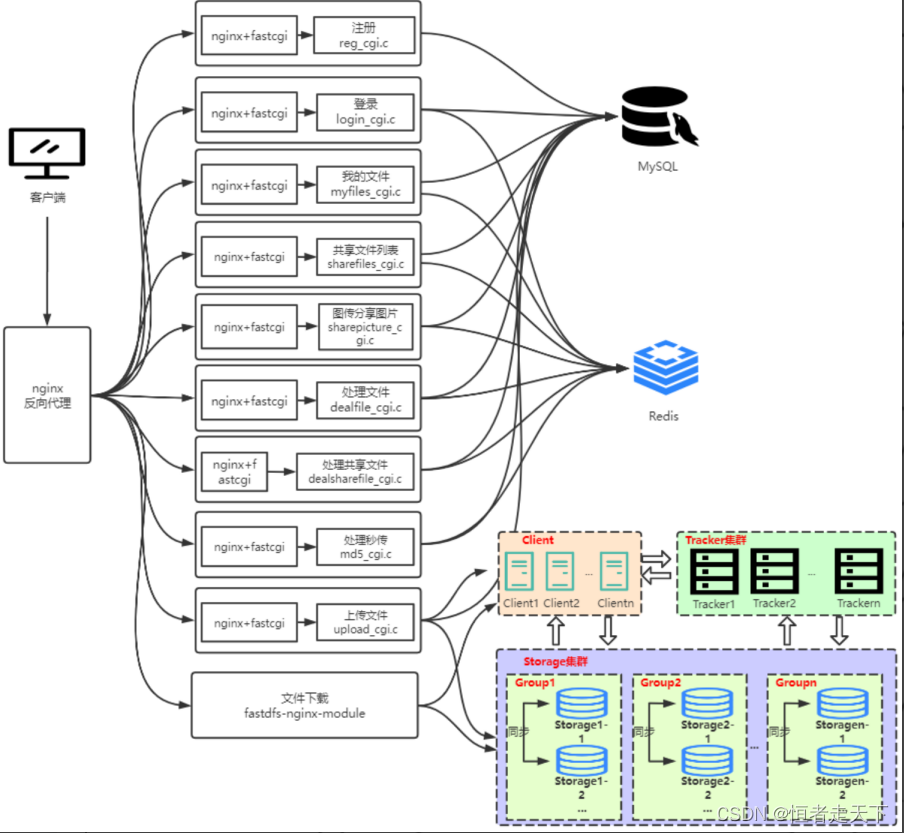  
下文将按照功能模块，依次分析各项功能的实现过程。

## 二、注册功能

注册功能的实现流程如下图所示：  
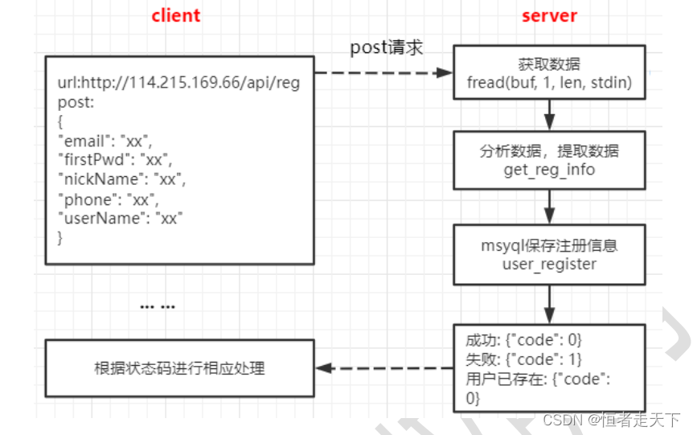  
本项目由 FastCGI 处理的业务请求采用相同的接入方式。关于 FastCGI 的基础用法，可参考[《FastCGI 了解与学习使用》](http://t.csdn.cn/tgb5b)。注册功能首先进入 FastCGI 的请求接收循环：

```cpp
//阻塞等待用户连接
    while (FCGI_Accept() >= 0)
    {
        //获得http的长度
        char *contentLength = getenv("CONTENT_LENGTH");
        int len;

        printf("Content-type: text/html\r\n\r\n");
```

完成 FastCGI 请求接入后，注册功能按照以下步骤处理业务数据。

#### （1）读取请求体

根据 `CONTENT_LENGTH` 指定的长度，从标准输入读取请求体：

```cpp
char buf[4*1024] = {0};
int ret = 0;
char *out = NULL;
ret = fread(buf, 1, len, stdin); //从标准输入(web服务器)读取内容
```

本项目使用 JSON 传输注册数据。读取请求体后，下一步是解析其中的注册字段。

#### （2）解析用户注册 JSON

```cpp
/*json数据如下
{
	userName:xxxx,
	nickName:xxx,
	firstPwd:xxx,
	phone:xxx,
	email:xxx
}
*/
cJSON * root = cJSON_Parse(reg_buf);
if(NULL == root)
{
	LOG(REG_LOG_MODULE, REG_LOG_PROC, "cJSON_Parse err\n");
	ret = -1;
	goto END;
 }
//返回指定字符串对应的json对象
//用户
cJSON *child1 = cJSON_GetObjectItem(root, "userName");
```

注册信息通过 `cJSON_Parse()` 解析为 cJSON 对象，再使用 `cJSON_GetObjectItem()` 按键读取各字段。

#### （3）读取数据库配置

项目将各项服务配置集中写入 JSON 配置文件：  
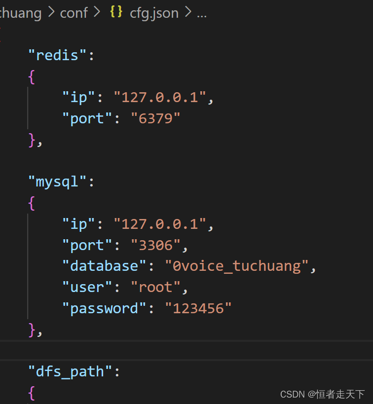  
注册模块需要读取该文件，并通过 cJSON 解析数据库地址、用户名、密码和数据库标识等配置。

```cpp
 //只读方式打开文件
 fp = fopen(profile, "rb");
 fseek(fp, 0, SEEK_END);//光标移动到末尾
 long size = ftell(fp); //获取文件大小
 fseek(fp, 0, SEEK_SET);//光标移动到开头
 buf = (char *)calloc(1, size+1); //动态分配空间
 //读取文件内容
 fread(buf, 1, size, fp);
 //解析一个json字符串为cJSON对象
 cJSON * root = cJSON_Parse(buf);
 //返回指定字符串对应的json对象
 cJSON * father = cJSON_GetObjectItem(root, title);
```

#### （4）连接数据库并检查用户是否存在

数据库连接代码如下：

```cpp
 MYSQL *conn = NULL; //MYSQL对象句柄
 //用来分配或者初始化一个MYSQL对象，用于连接mysql服务端
 conn = mysql_init(NULL);
 //mysql_real_connect()尝试与运行在主机上的MySQL数据库引擎建立连接
 mysql_real_connect(conn, NULL, user_name, passwd, db_name, 0, NULL, 0);
```

连接成功后，根据用户名查询用户是否已经存在：

```cpp
  //设置数据库编码，主要处理中文编码问题
  mysql_query(conn, "set names utf8");
  //查询数据库中是否已经存在user_name
  char sql_cmd[SQL_MAX_LEN] = {0};
  sprintf(sql_cmd, "select * from user_info where user_name = '%s'", user_name);
  mysql_query(conn, sql_cmd);//查询
  MYSQL_RES *res_set = NULL;  //结果集结构的指针
  res_set = mysql_store_result(conn);//生成结果集
  //mysql_num_rows接受由mysql_store_result返回的结果结构集，并返回结构集中的行数
  line = mysql_num_rows(res_set);
  /*根据行数进行判断，如果为0行说明，没有存入该用户信息；否则，说明用户信息已经插入*/
```

#### （5）保存用户信息

```cpp
  //当前时间戳
  struct timeval tv;
  struct tm* ptm;
  char time_str[128];
  //使用函数gettimeofday()函数来得到时间。它的精度可以达到微妙
  gettimeofday(&tv, NULL);
  ptm = localtime(&tv.tv_sec);//把从1970-1-1零点零分到当前时间系统所偏移的秒数时间转换为本地时间
  //strftime() 函数根据区域设置格式化本地时间/日期，函数的功能将时间格式化，或者说格式化一个时间字符串
  strftime(time_str, sizeof(time_str), "%Y-%m-%d %H:%M:%S", ptm);

  //sql 语句, 插入注册信息
  sprintf(sql_cmd, "insert into user_info (user_name, nick_name, password, phone, email, create_time) values ('%s', '%s', '%s', '%s', '%s', '%s')", user_name, nick_name, pwd, tel, email, time_str);
  mysql_query(conn, sql_cmd);
```

#### （6）向前端返回状态

处理结果通过 JSON 返回给前端：

```cpp
/*
注册：
 成功：{"code": 0}
 失败：{"code":1}
 该用户已存在：{"code":2}*/
//返回前端情况，NULL代表失败, 返回的指针不为空，则需要free
char * return_status(int ret_code)
{
    //ret_code 0 1 2
    char *out = NULL;
    cJSON *root = cJSON_CreateObject();  //创建json项目
    cJSON_AddItemToObject(root, "code", cJSON_CreateNumber(ret_code));// 
    out = cJSON_Print(root);//cJSON to string(char *)

    cJSON_Delete(root);

    return out;
}
```

## 三、登录功能

登录功能的实现流程如下图所示：  
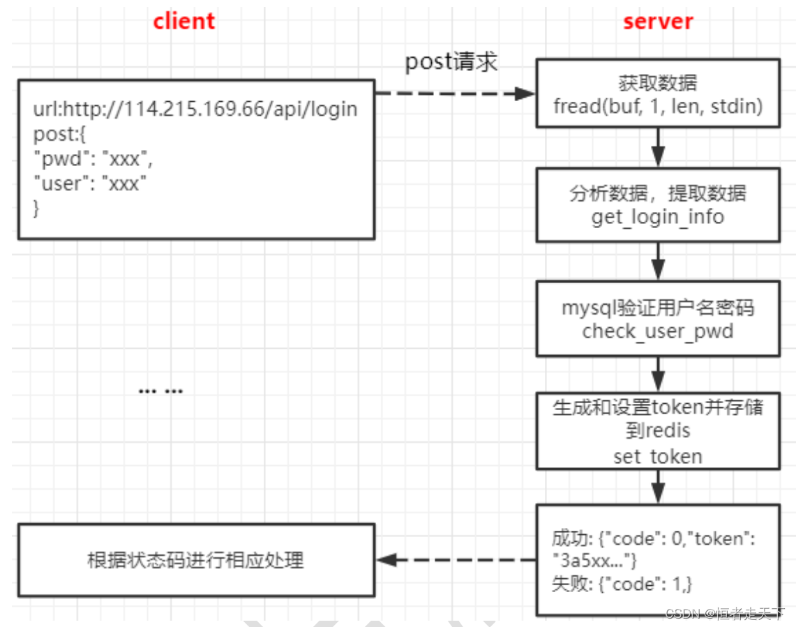  
登录功能同样通过 FastCGI 接收请求，其请求体读取方式与注册功能一致。下面从登录数据解析开始说明。

#### 解析用户名和密码

```cpp
//获取登陆用户的信息
char username[512] = {0};
char pwd[512] = {0};

//解析json包
//解析一个json字符串为cJSON对象
cJSON * root = cJSON_Parse(buf);
//返回指定字符串对应的json对象
//用户
cJSON *child1 = cJSON_GetObjectItem(root, "user");
strcpy(username, child1->valuestring); //拷贝内容
```

#### 校验登录信息

登录模块首先读取数据库配置并建立连接，具体方式与注册功能相同。连接成功后，查询用户对应的密码并进行比较：

```cpp
    //设置数据库编码，主要处理中文编码问题
    mysql_query(conn, "set names utf8");
    //sql语句，查找某个用户对应的密码
    char sql_cmd[SQL_MAX_LEN] = {0};
    sprintf(sql_cmd, "select password from user_info where user_name='%s'", username);
    /*验证密码是否正确与注册功能(4)判断用户信息是否存在一样，只不过多了个把查询到的密码信息保存下来，与pwd进行比较而已*/
```

#### 生成 Token 并存入 Redis

登录验证成功后，需要连接 Redis。Redis 的 IP 和端口来自 `cfg.json`，读取方式与数据库配置相同。  

Redis 连接代码如下：

```cpp
    //redis 服务器ip、端口
    char redis_ip[30] = {0};
    char redis_port[10] = {0};
    uint16_t port = atoi(redis_port);

    redisContext *conn = NULL;
    conn = redisConnect(redis_ip, port);
```

该程序使用“随机数、Base64 编码和 MD5”生成 Token。随机数生成代码如下：

```cpp
    //产生4个1000以内的随机数
    int rand_num[4] = {0};
    int i = 0;
    
    //设置随机种子
    srand((unsigned int)time(NULL));
    for(i = 0; i < 4; ++i)
    {
        rand_num[i] = rand()%1000;//随机数
    }

	char tmp[1024] = {0};
    sprintf(tmp, "%s%d%d%d%d", username, rand_num[0], rand_num[1], rand_num[2], rand_num[3]);   // token唯一性

    //加密
    #define  USER_PASSWORD_KEY "abcd1234"
    char enc_tmp[1024*2] = {0};
    int enc_len = 0;
    
    int				rv;
	unsigned char	*padDate = NULL;
	unsigned int	padDateLen = 0;
    CW_dataPadAdd(0, tmp, (unsigned int )strlen(tmp), &padDate, &padDateLen);
    rv = myic_DESEncrypt((unsigned char *)USER_PASSWORD_KEY, strlen(USER_PASSWORD_KEY),
		padDate, (int)padDateLen, enc_tmp, &enc_len);
```

随后对中间数据进行 Base64 编码；该部分代码原文未展示。

Token 通过 Redis Key 的过期机制设置有效时间，相关命令如下：

```cpp
	redisReply *reply = NULL;
    reply = redisCommand(conn, "setex %s %u %s", key, seconds, value);
```

Token 生成并保存成功后，将其放入 JSON 响应并返回前端：

```cpp
    cJSON *root = cJSON_CreateObject();  //创建json项目
    cJSON_AddStringToObject(root, "token", token);// {"token":"token"}
    cJSON_Delete(root);
```

## 四、上传文件

### 4.1 秒传文件

秒传功能的实现流程如下图所示：  
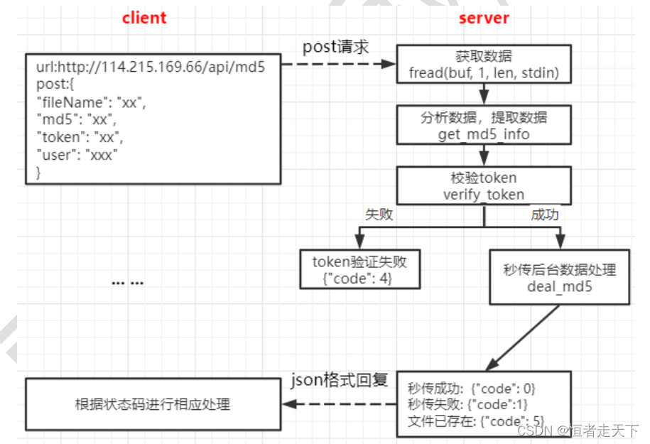  
该功能同样通过 FastCGI 接收请求。以下从请求数据解析开始说明。

#### 解析用户及文件信息

解析 JSON 请求体，获取用户、Token、文件 MD5 和文件名：

```cpp
   //读取内容
   char buf[4*1024] = {0};
   int ret = 0;
   ret = fread(buf, 1, len, stdin); //从标准输入(web服务器)读取内容
   
   //解析json数据包
   /*
   {
       user:xxxx,
       token: xxxx,
       md5:xxx,
       fileName: xxx
   }
   */
   char user[128] = {0};
   char md5[256] = {0};
   char token[256] = {0};
   char filename[128] = {0};
   cJSON * root = cJSON_Parse(buf);
   //用户
   cJSON *child1 = cJSON_GetObjectItem(root, "user");
   strcpy(user, child1->valuestring); //拷贝内容
   //MD5
   cJSON *child2 = cJSON_GetObjectItem(root, "md5");
   strcpy(md5, child2->valuestring); //拷贝内容
   /*其他一样不再赘述*/
```

#### 验证 Token

连接 Redis 后，以 `user` 为 Key 读取已保存的 Token，并与请求中的 Token 比较：

```cpp
   //获取user对应的value
   ret = rop_get_string(redis_conn, user, tmp_token);
   if(ret == 0)
   {
       if( strcmp(token, tmp_token) != 0 ) //token不相等
       {
           ret = -1;
       }
   }
```

#### 执行秒传

秒传的核心是复用服务器中已有的文件实体，而不是再次传输文件内容。客户端在上传前先计算文件的 MD5，并将 MD5、用户名和文件名等信息发送给服务器。

服务器收到请求后，需要依次完成两次判断：

1. **判断文件实体是否已经存在**：根据 MD5 查询 `file_info`。如果没有查到记录，说明服务器中尚无该文件，无法秒传，客户端需要继续执行真实上传；如果查到记录，则取出当前引用计数 `count`，继续下一步判断。
2. **判断当前用户是否已经拥有该文件**：查询 `user_file_list`。如果记录已经存在，说明该文件已在用户的文件列表中，无需重复建立引用；只有服务器已存在文件实体、但当前用户尚未拥有它时，才能执行秒传。

查询当前用户文件列表的 SQL 示例：

```cpp
   //查看此用户是否已经有此文件，如果存在说明此文件已上传，无需再上传
   sprintf(sql_cmd, "select * from user_file_list where user = '%s' and md5 = '%s' and file_name = '%s'", user, md5, filename);
```

确认可以秒传后，后端需要完成三项数据更新。

1. **增加文件引用计数**

   将 `file_info.count` 加 1，表示又有一个用户引用该文件实体。

```cpp
   //1、修改file_info中的count字段，+1 （count 文件引用计数）
   sprintf(sql_cmd, "update file_info set count = %d where md5 = '%s'", ++count, md5);//前置++
   mysql_query(conn, sql_cmd);
```

2. **写入用户文件列表**

   向 `user_file_list` 插入一条记录，建立当前用户与该文件之间的引用关系。新记录同时保存文件名、创建时间、分享状态和下载量等信息。

```cpp
   //当前时间戳
   struct timeval tv;
   struct tm* ptm;
   char time_str[128];
   //使用函数gettimeofday()函数来得到时间。它的精度可以达到微妙
   gettimeofday(&tv, NULL);
   ptm = localtime(&tv.tv_sec);//把从1970-1-1零点零分到当前时间系统所偏移的秒数时间转换为本地时间
   //strftime() 函数根据区域设置格式化本地时间/日期，函数的功能将时间格式化，或者说格式化一个时间字符串
   strftime(time_str, sizeof(time_str), "%Y-%m-%d %H:%M:%S", ptm);

   //插入
   sprintf(sql_cmd, "insert into user_file_list(user, md5, create_time, file_name, shared_status, pv) values ('%s', '%s', '%s', '%s', %d, %d)", user, md5, time_str, filename, 0, 0);
   mysql_query(conn, sql_cmd)
```

3. **更新用户文件总数**

   更新 `user_file_count`。如果该用户尚无计数记录，则插入一条 `count = 1` 的记录；如果记录已经存在，则将原计数加 1。

```cpp
   //数据库插入此记录
   sprintf(sql_cmd, " insert into user_file_count (user, count) values('%s', %d)", user, 1);
  
   //更新用户文件数量count字段
   count = atoi(tmp);
   sprintf(sql_cmd, "update user_file_count set count = %d where user = '%s'", count+1, user);
   
   mysql_query(conn, sql_cmd)
```

综上，秒传不会创建新的文件实体，而是在已有文件上增加引用计数，并为当前用户新增一条文件归属记录。如果服务器中不存在对应 MD5 的文件，则秒传未命中，必须转入真实上传流程。

### 4.2 真实上传文件

真实上传的实现流程如下图所示：  
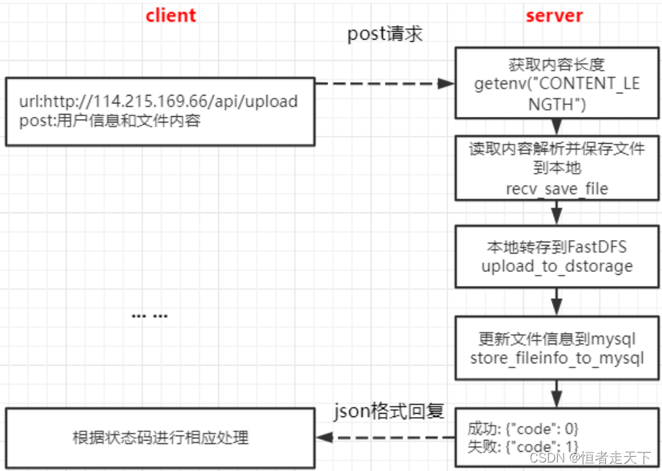

#### （1）读取 MySQL 配置
 
首先读取 MySQL 配置，方式与注册功能中的配置读取过程相同。

```cpp
"mysql":
	{
		"ip": "127.0.0.1",
		"port": "3306",
		"database": "0voice_tuchuang",
		"user": "root",
		"password": "123456"
	},
```

#### （2）解析上传请求并保存本地临时文件

首先解析客户端发送的 POST 请求。示例请求体结构如下：

```xml
------WebKitFormBoundary88asdgewtgewx\r\n
Content-Disposition: form-data; user = "milo"; filename = "xxx.jpg"; md5 = "xxxx"; size = 1024\r\n
Content-Type: application/octet-stream\r\n
\r\n
真正的文件内容\r\n
------WebKitFormBoundary88asdgewtgewx
```

下面的代码用于从请求体中定位文件内容：

```cpp
    /* 存储变量的定义*/
    int ret = 0;
    char *file_buf = NULL;  //数据信息的存储
    char *buf_end = NULL;
    char *begin = NULL;
    char *p1, *p2, *p3, *p4, *p5, *p6, *end;
    char *p, *q, *k;
    char *file_start = NULL;    // 文件内容的起始位置
    char *file_end = NULL;       // 文件内容的结束位置
    char size_text[64+1] = {0}; //文件头部信息
    char boundary[TEMP_BUF_MAX_LEN] = {0};     //分界线信息

    
    //==========> 开辟存放文件的 内存 <===========
    file_buf = (char *)malloc(len);
    int ret2 = fread(file_buf, 1, len, stdin); //从标准输入(web服务器)读取内容（post请求）
    begin = file_buf;    //内存起点
    buf_end = file_buf + len;
    p = begin;
	// 1. 跳过分界线
    p1 = strstr(begin, "\r\n");  // 作用是返回字符串中首次出现子串的地址
    //拷贝分界线
    strncpy(boundary, begin, p1-begin);  // 缓存分界线, 比如：WebKitFormBoundary88asdgewtgewx
    boundary[p1-begin] = '\0';   //字符串结束符
    // 文件内容在Content-Type: image/jpeg 之后
    file_start = strstr(begin, "Content-Type:");
    file_start = strstr(file_start, "\r\n");        /// 得到文件的起始位置
    file_start += strlen("\r\n");       // 跳过Content-Type:所在行
    file_start += strlen("\r\n");        // 文件内容前还有空白换行
    file_end = strstr(file_start, boundary);      // 得到文件的结束位置, 文件太大遍历有问题？
    //遍历得到文件的末位置
    //得到文件的长度
    for (i = 0; i <= total_len - seplen; i++) 
    {
        if (memcmp(buf + from , sep, seplen) == 0)
            break;
        ++from;
    }
	
	file_end -= strlen("\r\n"); // 要减去换行的长度
	/*到此已经获得了上传文件的起始位置和末尾位置*/
```

定位文件内容后，继续解析请求中的 `user`、`filename`、`md5` 和 `size`。

```xml
Content-Disposition: form-data; user = "milo"; filename = "xxx.jpg"; md5 = "xxxx"; size = 1024\r\n
```

这些字段采用相似的指针定位方式。原文仅展示 `filename` 的解析代码：

```cpp
	p2 = strstr(p1, "filename=");  // 查找到filename=起始位置
    p2 += strlen("filename=\"");    // 跳过filename=" ，获取到p2的起始位置。
    LOG(UPLOAD_LOG_MODULE, UPLOAD_LOG_PROC,"%s %d\n", __FUNCTION__, __LINE__);
    end = strstr(p2, "\"");         // 查到filename="test-animal1.jpg"的"的结束位置
    strncpy(filename, p2, end-p2); 
    filename[end-p2] = '\0';
```

解析完成后，将文件内容写入本地临时文件：

```cpp
fd = open(filename, O_CREAT|O_WRONLY, 0644);  //可见文件是保存在本地服务器上的（这里是要优化的点）
//ftruncate会将参数fd指定的文件大小改为参数length指定的大小
ftruncate(fd, file_end - file_start);
write(fd, file_start, file_end - file_start);
close(fd);
```

#### （3）将本地临时文件上传至 FastDFS

该步骤的流程如下图所示：  
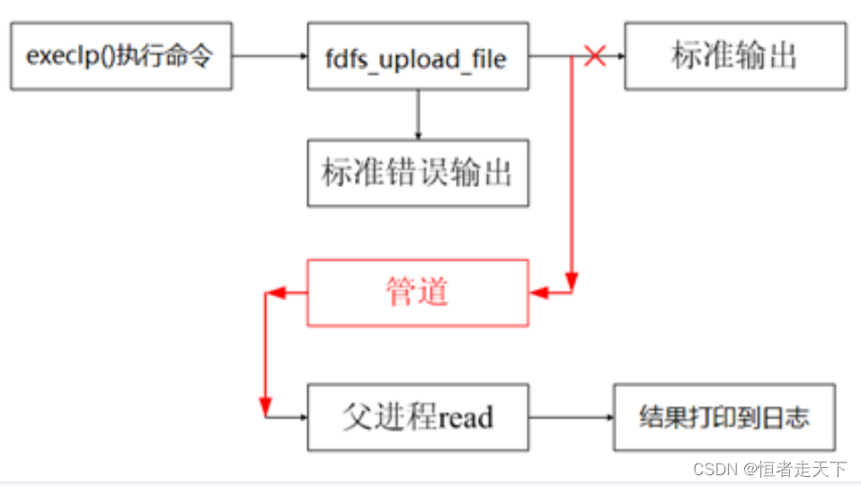  
该实现创建子进程，并在子进程中通过 `execlp()` 执行 FastDFS 客户端程序 `fdfs_upload_file`：

```powershell
fdfs_upload_file 客户端的配置文件(/etc/fdfs/client.conf) 要上传的文件
```

`fdfs_upload_file` 成功后输出文件 ID，例如 `group1/M00/00/00/wKj3h1vC-PuAJ09iAAAHT1YnUNE31352.c`。子进程的标准输出通过管道传递给父进程。

具体代码如下：

```cpp
   //子进程
   if(pid == 0)
    {
        //关闭读端
        close(fd[0]);

		//此时就是把该进程的printf输出到fd[1]文件里，其实该进程打印到终端的就是group1/M00/00/00/wKj3h1vC-PuAJ09iAAAHT1YnUNE31352.c（类似这东西）
        //将标准输出 重定向 写管道
        dup2(fd[1], STDOUT_FILENO); // 往标准输出写的东西都会重定向到fd所指向的文件, 当fileid产生时输出到管道fd[1]

        //读取fdfs client 配置文件的路径
        char fdfs_cli_conf_path[256] = {0};
        get_cfg_value(CFG_PATH, "dfs_path", "client", fdfs_cli_conf_path);
        // fdfs_upload_file /etc/fdfs/client.conf 123.txt
        LOG(UPLOAD_LOG_MODULE, UPLOAD_LOG_PROC, "fdfs_upload_file %s %s\n", fdfs_cli_conf_path, filename);
        //通过execlp执行fdfs_upload_file  如果函数调用成功,进程自己的执行代码就会变成加载程序的代码,execlp()后边的代码也就不会执行了.
        execlp("fdfs_upload_file", "fdfs_upload_file", fdfs_cli_conf_path, filename, NULL);
        //或者使用下面这种方式条用
        //int temp = upload_to_dstorage_1(filename, fdfs_cli_conf_path, fileid);
        //LOG(UPLOAD_LOG_MODULE, UPLOAD_LOG_PROC, "ret:%d!\n", temp);

        //执行失败
        LOG(UPLOAD_LOG_MODULE, UPLOAD_LOG_PROC, "execlp fdfs_upload_file error\n");

        close(fd[1]);
    }

	//父进程
	 else
    {
        //关闭写端
        close(fd[1]);

        //从管道中去读数据
        read(fd[0], fileid, TEMP_BUF_MAX_LEN);  // 等待管道写入然后读取

        //去掉一个字符串两边的空白字符
        trim_space(fileid);

        if (strlen(fileid) == 0)
        {
            LOG(UPLOAD_LOG_MODULE, UPLOAD_LOG_PROC,"[upload FAILED!]\n");
            ret = -1;
            goto END;
        }

        LOG(UPLOAD_LOG_MODULE, UPLOAD_LOG_PROC, "get [%s] succ!\n", fileid);

        wait(NULL); //等待子进程结束，回收其资源
        close(fd[0]);
    }
```

#### （4）删除本地临时文件

上传完成后，调用 `unlink()` 删除本地临时文件。函数原型如下：

`unlink()` 删除 `pathname` 指定的目录项。如果该目录项是文件的最后一个链接，但仍有进程打开该文件，则文件内容会在相关文件描述符全部关闭后释放；如果 `pathname` 指向符号链接，则删除符号链接本身。

调用成功返回 `0`，失败返回 `-1`，错误原因记录在 `errno` 中。

```cpp
   unlink(filename);
```

#### （5）获取 Storage 地址并拼接 HTTP URL

该步骤同样采用子进程与管道通信：执行 `fdfs_file_info` 获取文件信息，从输出中提取 Storage 的 `host_name`，再与文件 ID 拼接为完整 HTTP URL。

```cpp
   /*读取存储文件的信息文件，利用fastdfs自带的fdfs_file_info进程*/
   //使用“fdfs_file_info”可以查看到文件的详细存储信息，也是跟上客户端的配置文件以及储服务器返回给我们的文件的路径
   execlp("fdfs_file_info", "fdfs_file_info", fdfs_cli_conf_path, fileid, NULL);

   /*从输出的文件信息提取出完整的url：http://host_name/group1/M00/00/00/D12313123232312.png*/
   //还是从输出的字符串中截取字符串，不再展示了，很繁琐
```

#### （6）将文件信息写入数据库

最后将文件信息写入数据库，主要涉及 `file_info` 和 `user_file_list` 两张表。

```cpp
/*
       -- =============================================== 文件信息表
       -- md5 文件md5
       -- file_id 文件id
       -- url 文件url
       -- size 文件大小, 以字节为单位
       -- type 文件类型： png, zip, mp4……
       -- count 文件引用计数， 默认为1， 每增加一个用户拥有此文件，此计数器+1
       */
```

```cpp
/*
       -- =============================================== 用户文件列表
       -- user 文件所属用户
       -- md5 文件md5
       -- create_time 文件创建时间
       -- file_name 文件名字
       -- shared_status 共享状态, 0为没有共享， 1为共享
       -- pv 文件下载量，默认值为0，下载一次加1
       */
```

原文未继续展示具体的插入语句。

## 五、获取用户文件列表

获取用户文件列表的实现流程如下图所示：  
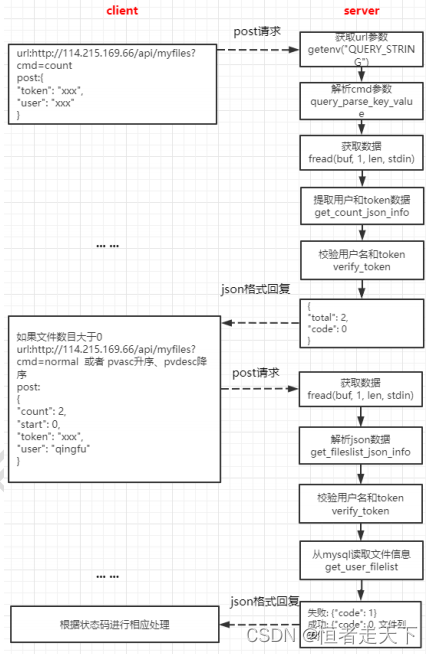  
接口通过 URL 查询参数 `cmd` 区分具体操作，并通过 `start` 和 `count` 分批获取文件列表。

#### 解析 URL 查询参数 `cmd`

不同的 `cmd` 对应不同操作，例如：

```
获取用户文件个数   http://127.0.0.1:80/myfiles?cmd=count
获取用户文件信息   http://127.0.0.1:80/myfiles?cmd=normal
按下载量升序      http://127.0.0.1:80/myfiles?cmd=pvasc
按下载量降序      http://127.0.0.1:80/myfiles?cmd=pvdesc
```

`cmd` 的解析代码如下：

```cpp
  char cmd[20];
  // 获取URL地址 "?" 后面的内容
  char *query = getenv("QUERY_STRING");

  //解析命令
  char *temp = NULL;
  char *end = NULL;
  int value_len =0;

  //找到是否有cmd
  temp = strstr(query, "cmd");
  temp += strlen("cmd");//=
  temp++;//cmd
  //get value
  end = temp;
  while ('\0' != *end && '#' != *end && '&' != *end )
  {
       end++;
  }
  value_len = end-temp;
  strncpy(cmd, temp, value_len);
  cmd[value_len] ='\0';
```

#### 根据 `cmd` 执行对应操作

**1. `cmd=count`：获取用户文件数量**

首先从 POST 请求体中获取用户和 Token：

```cpp
   /*解析收到的post*/
   //格式如下
   //{   "user": "kevin",   "token": "xxxx"   }
   //解析json包
   cJSON *root = cJSON_Parse(buf);
   cJSON *child1 = cJSON_GetObjectItem(root, "user");
   strcpy(user, child1->valuestring); //拷贝内容
   cJSON *child2 = cJSON_GetObjectItem(root, "token");
   strcpy(token, child2->valuestring); //拷贝内容
```

随后验证 Token：

```cpp
   /*先获得redis中存储的user的token*/
   redisReply *reply = NULL;
   reply = redisCommand(conn, "get %s", key);
   strncpy(value, reply->str, reply->len);
   value[reply->len] = '\0'; //字符串结束符
   freeReplyObject(reply);

   /*进行比较*/
   strcmp(token, value);
```

验证通过后，查询该用户的文件数量：

```cpp
   /*连接数据库进行获取*/
   sprintf(sql_cmd, "select count from user_file_count where user='%s'", user);
   process_result_one(conn, sql_cmd, tmp); //指向sql语句
   line = atol(tmp); //字符串转长整形

   /*把情况返回给前端*/
   cJSON *root = cJSON_CreateObject(); //创建json项目
   cJSON_AddItemToObject(root, "code", cJSON_CreateNumber(ret_code));
   cJSON_AddItemToObject(root, "total", cJSON_CreateNumber(total));
   out = cJSON_Print(root); // cJSON to string(char *)
   cJSON_Delete(root);
   printf(out); //给前端反馈信息
   free(out);   //记得释放
```

**2. 获取用户文件列表**

该接口根据 `cmd` 选择排序方式：

- `cmd=normal`：获取普通文件列表；
- `cmd=pvasc`：按下载量升序排列；
- `cmd=pvdesc`：按下载量降序排列。

请求处理仍需验证用户和 Token；与数量查询不同，列表请求还包含分页参数 `start` 和 `count`。

验证通过后，根据 `cmd` 生成相应的列表查询语句：

```cpp
   //不同的cmd执行不同的查询语句
   //多表指定行范围查询
   if (strcmp(cmd, "normal") == 0) //获取用户文件信息
   {
       // sql语句
       sprintf(sql_cmd, "select user_file_list.*, file_info.url, file_info.size, file_info.type from file_info, user_file_list where user = '%s' and file_info.md5 = user_file_list.md5 limit %d, %d", user, start, count);
   }
   else if (strcmp(cmd, "pvasc") == 0) //按下载量升序
   {
       // sql语句
       sprintf(sql_cmd, "select user_file_list.*, file_info.url, file_info.size, file_info.type from file_info, user_file_list where user = '%s' and file_info.md5 = user_file_list.md5  order by pv asc limit %d, %d", user, start, count);
    }
    else if (strcmp(cmd, "pvdesc") == 0) //按下载量降序
    {
        // sql语句
        sprintf(sql_cmd, "select user_file_list.*, file_info.url, file_info.size, file_info.type from file_info, user_file_list where user = '%s' and file_info.md5 = user_file_list.md5 order by pv desc limit %d, %d", user, start, count);
    }
    mysql_query(conn, sql_cmd);
    res_set = mysql_store_result(conn); /*生成结果集*/
    int line = 0;
    // mysql_num_rows接受由mysql_store_result返回的结果结构集，并返回结构集中的行数
    line = mysql_num_rows(res_set);
```

查询完成后，将结果编码为 JSON 并返回前端：

```cpp
   cJSON *root = NULL;
   root = cJSON_CreateObject();
   cJSON *array = NULL;
   array = cJSON_CreateArray();
   // mysql_fetch_row从使用mysql_store_result得到的结果结构中提取一行，并把它放到一个行结构中。
   // 当数据用完或发生错误时返回NULL.
   while ((row = mysql_fetch_row(res_set)) != NULL)
   {
   		// array[i]:
        cJSON *item = cJSON_CreateObject();
        int column_index = 1;
		//-- user	文件所属用户
        if (row[column_index] != NULL)
        {
            cJSON_AddStringToObject(item, "user", row[column_index]);
        }
        column_index++;
        //-- md5 文件md5
        if (row[column_index] != NULL)
        {
            cJSON_AddStringToObject(item, "md5", row[column_index]);
        }
        column_index++;
        //-- createtime 文件创建时间
        if (row[column_index] != NULL)
        {
            cJSON_AddStringToObject(item, "create_time", row[column_index]);
        }
		column_index++;
        //-- filename 文件名字
        if (row[column_index] != NULL)
        {
            cJSON_AddStringToObject(item, "file_name", row[column_index]);
        }
        column_index++;
        //-- shared_status 共享状态, 0为没有共享， 1为共享
        if (row[column_index] != NULL)
        {
            cJSON_AddNumberToObject(item, "share_status", atoi(row[column_index]));
        }
        column_index++;
        //-- pv 文件下载量，默认值为0，下载一次加1
        if (row[column_index] != NULL)
        {
            cJSON_AddNumberToObject(item, "pv", atol(row[column_index]));
        }

        column_index++;
        //-- url 文件url
        if (row[column_index] != NULL)
        {
            cJSON_AddStringToObject(item, "url", row[column_index]);
        }
        column_index++;
        //-- size 文件大小, 以字节为单位
        if (row[column_index] != NULL)
        {
            cJSON_AddNumberToObject(item, "size", atol(row[column_index]));
        }
        column_index++;
        //-- type 文件类型： png, zip, mp4……
        if (row[column_index] != NULL)
        {
            cJSON_AddStringToObject(item, "type", row[column_index]);
        }
        cJSON_AddItemToArray(array, item);
   }
   cJSON_AddItemToObject(root, "files", array);
   cJSON_AddItemToObject(root, "count", cJSON_CreateNumber(line)); 
   cJSON_AddItemToObject(root, "total", cJSON_CreateNumber(total)); 
   out = cJSON_Print(root);
   printf(out);
```

返回给前端的 JSON 结构如下：  
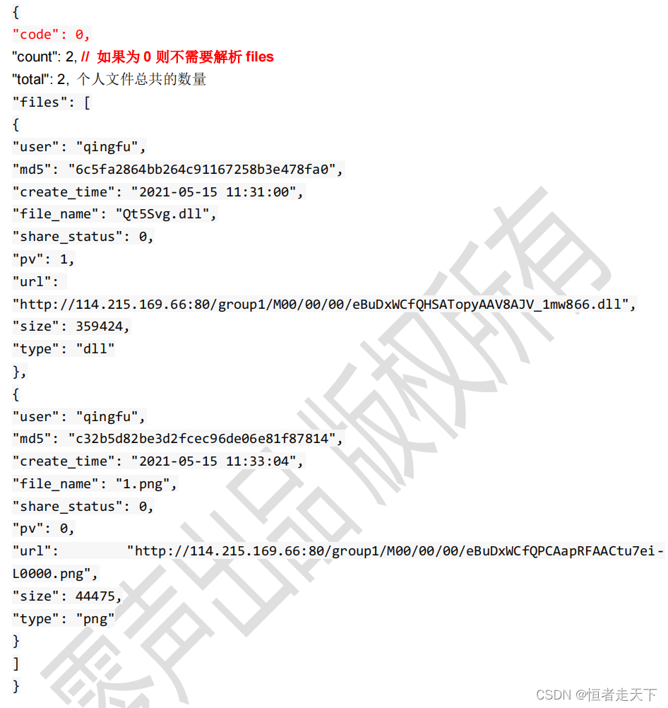

## 六、获取共享文件或下载榜

获取共享文件列表和下载排行榜的实现流程如下图所示：  
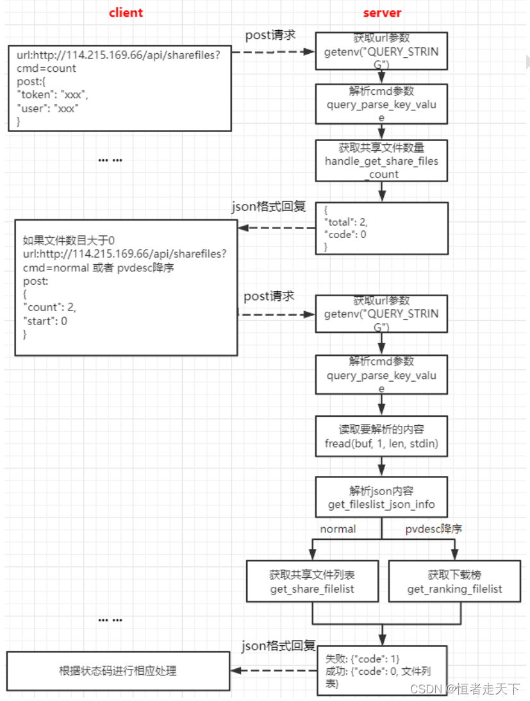  
该接口同样根据 URL 查询参数 `cmd` 选择具体操作。

```cpp
获取共享文件个数    http://114.215.169.66/api/sharefiles?cmd=count
获取共享文件列表    http://114.215.169.66/api/sharefiles?cmd=normal
获取共享文件下载排行榜     http://114.215.169.66/api/sharefiles?cmd=pvdesc
```

`cmd` 的解析方式与用户文件列表接口相同。

#### 获取共享文件数量

当 `cmd=count` 时，查询共享文件总数：

```cpp
   /*首先向数据库中进行获得count*/
   sprintf(sql_cmd, "select count from user_file_count where user='%s'", "xxx_share_xxx_file_xxx_list_xxx_count_xxx");
   char tmp[512] = {0};
   mysql_query(conn, sql_cmd);
   res_set = mysql_store_result(conn);//生成结果集
   //mysql_fetch_row从结果结构中提取一行，并把它放到一个行结构中。当数据用完或发生错误时返回NULL.
   row = mysql_fetch_row(res_set);
   strcpy(tmp, row[0]);
   
   /*生成json文件返回给前端*/
   line = atol(tmp); //字符串转长整形
   cJSON *root = cJSON_CreateObject(); //创建json项目
   cJSON_AddItemToObject(root, "code", cJSON_CreateNumber(HTTP_RESP_OK)); 
   cJSON_AddItemToObject(root, "total", cJSON_CreateNumber(line));
   out = cJSON_Print(root); // cJSON to string(char *)
   printf("%s", out);       //给前端反馈的信息
   cJSON_Delete(root);
   if(out)
      free(out);
```

列表和排行榜请求还需要解析分页参数：

#### 解析分页参数

```cpp
   cJSON *root = cJSON_Parse(buf);
   //文件起点
   cJSON *child2 = cJSON_GetObjectItem(root, "start");
   int *p_start=child2->valueint;
   //文件请求个数
   cJSON *child3 = cJSON_GetObjectItem(root, "count");
   int *p_count= child3->valueint;
```

#### 获取共享文件列表

当 `cmd=normal` 时，从数据库查询共享文件列表：

```cpp
   /*向数据库执行查询操作*/
   // sql语句
   sprintf(sql_cmd, "select share_file_list.*, file_info.url, file_info.size, file_info.type from file_info, share_file_list where file_info.md5 = share_file_list.md5 limit %d, %d", start, count);
   mysql_query(conn, sql_cmd);
   MYSQL_RES *res_set =mysql_store_result(conn); /*生成结果集*/
   // mysql_num_rows接受由mysql_store_result返回的结果结构集，并返回结构集中的行数
   int line = mysql_num_rows(res_set);

   /*写入到json文件中，并返回*/
   cJSON *root = NULL;
   cJSON *array = NULL;
   root = cJSON_CreateObject();
   array = cJSON_CreateArray();
   MYSQL_ROW row;
   // mysql_fetch_row从使用mysql_store_result得到的结果结构中提取一行，并把它放到一个行结构中。
   // 当数据用完或发生错误时返回NULL.
   /*与获取用户列表操作一样不再展示*/
```

#### 获取共享文件下载排行榜

排行榜的处理过程如下：

1. 分别获取 MySQL 和 Redis 中记录的共享文件数量；
2. 比较两者是否一致；
3. 如果数量不一致，则清空 Redis 中的相关数据，并根据 MySQL 的共享记录重建 Redis 数据；
4. 从 Redis 读取排行榜并返回前端。

执行上述步骤前，需要先连接 MySQL 和 Redis。

**1. 获取 MySQL 中的共享文件数量**

```cpp
   sprintf(sql_cmd, "select count from user_file_count where user='%s'", "xxx_share_xxx_file_xxx_list_xxx_count_xxx");
   MYSQL_RES *res_set =mysql_store_result(conn);//生成结果集
   MYSQL_ROW row=mysql_fetch_row(res_set);
   char tmp[512] = {0};
   strcpy(tmp, row[0]);
   int sql_num = atoi(tmp); //字符串转长整形
```

**2. 获取 Redis 中的共享文件数量**

```cpp
   redisReply *reply = NULL;
   reply = redisCommand(conn, "ZCARD %s", "FILE_PUBLIC_ZSET");
   int cnt =reply->integer;
   freeReplyObject(reply);
```

**3. 比较数量并在不一致时重建 Redis 数据**

```cpp
   if (redis_num != sql_num)
   {
   		//清空redis有序数据
   		redisReply *reply = NULL;
   		reply = redisCommand(conn, "DEL %s","FILE_PUBLIC_ZSET");
   		reply =redisCommand(conn, "DEL %s","FILE_NAME_HASH");
   		freeReplyObject(reply);

		//从mysql中导入数据到redis
		strcpy(sql_cmd, "select md5, file_name, pv from share_file_list order by pv desc");
		mysql_query(conn, sql_cmd);
		res_set = mysql_store_result(conn); /*生成结果集*/
		MYSQL_ROW row;
        // mysql_fetch_row从使用mysql_store_result得到的结果结构中提取一行，并把它放到一个行结构中。
        // 当数据用完或发生错误时返回NULL.
        while ((row = mysql_fetch_row(res_set)) != NULL)
        {
        	char fileid[1024] = {0};
            sprintf(fileid, "%s%s", row[0], row[1]); //文件标示，md5+文件名
            //增加有序集合成员
            reply = redisCommand(conn, "ZADD %s %ld %s","FILE_PUBLIC_ZSET", atoi(row[2]), fileid);
            //增加hash记录
            reply =  redisCommand(conn, "hset %s %s %s","FILE_NAME_HASH", fileid, row[1]);
        }
   }
```

**4. 从 Redis 读取数据并返回前端**

## 七、删除文件

删除文件的实现流程如下图所示：  
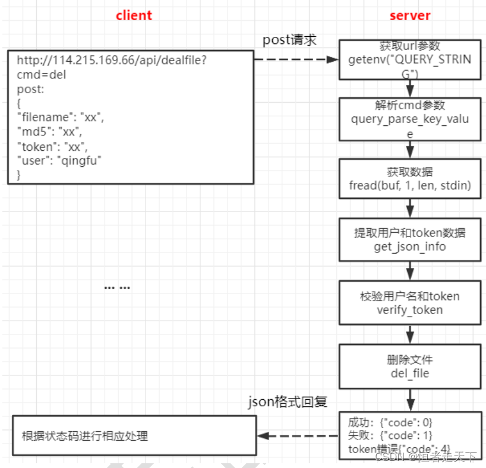  
处理请求时，先解析 URL 中的 `cmd`，确认当前操作为删除；再从 JSON 请求体中读取 `user`、`token`、`md5` 和 `filename`，并验证 Token。下面重点说明删除文件涉及的数据更新。

删除流程分为以下步骤：

#### （1）判断文件是否已经分享

```cpp
   //===1、先判断此文件是否已经分享，判断集合有没有这个文件，如果有，说明别人已经分享此文件
   //文件标示，md5+文件名
   sprintf(fileid, "%s%s", md5, filename);
   redisReply *reply= redisCommand(conn, "zlexcount %s [%s [%s","FILE_PUBLIC_ZSET", fileid, fileid);
   int retn = reply->integer;
   freeReplyObject(reply);
   if(retn == 1) //存在
   {
       share = 1;  //共享标志
       flag = 1;   //redis有记录
   }
   else if(retn == 0) //不存在
   {
   		//2、如果集合没有此元素，可能因为redis中没有记录，再从mysql中查询，如果mysql也没有，说明真没有(mysql操作)
		//查看该文件是否已经分享了
        sprintf(sql_cmd, "select shared_status from user_file_list where user = '%s' and md5 = '%s' and file_name = '%s'", user, md5, filename);
        /*向mysql的查询操作，已经用了很多遍，也不再赘述了*/
   }
```

#### （2）清理文件的分享记录

```cpp
   if(share == 1)
   {
   		/*分别删除mysql中的分享列表的数据和共享文件数量减1*/
   		/*这里只把对应的sql语句贴出了，不贴对应的操作了，已经展示很多遍了*/
   		//删除在共享列表的数据
        sprintf(sql_cmd, "delete from share_file_list where user = '%s' and md5 = '%s' and file_name = '%s'", user, md5, filename);
        //共享文件的数量-1
        sprintf(sql_cmd, "update user_file_count set count = %d where user = '%s'", count-1, "xxx_share_xxx_file_xxx_list_xxx_count_xxx");

		/*接下来判断Redis中是否有对应的存储记录*/
		if(1 == flag)
		{
			reply = redisCommand(conn, "ZREM %s %s","FILE_PUBLIC_ZSET", fileid);
			 //从hash移除相应记录
            redisCommand(conn, "hdel %s %s", "FILE_NAME_HASH", field);
		}
   }
```

#### （3）删除用户文件记录并更新计数

```cpp
   /*这里也只展示对应的sql操作*/
   //查询用户文件数量
   sprintf(sql_cmd, "select count from user_file_count where user = '%s'", user);
   if(count >= 1)
   {
   		sprintf(sql_cmd, "update user_file_count set count = %d where user = '%s'", count-1, user);
   }
   //删除用户文件列表数据
   sprintf(sql_cmd, "delete from user_file_list where user = '%s' and md5 = '%s' and file_name = '%s'", user, md5, filename);
   
   //文件信息表(file_info)的文件引用计数count，减去1
   //查看该文件文件引用计数
   sprintf(sql_cmd, "select count from file_info where md5 = '%s'", md5);
   sprintf(sql_cmd, "update file_info set count=%d where md5 = '%s'", count-1, md5);
```

#### （4）引用计数归零后删除 Storage 文件

```cpp
   if(count == 0) //说明没有用户引用此文件，需要在storage删除此文件
   {
   		//查询文件的id
        sprintf(sql_cmd, "select file_id from file_info where md5 = '%s'", md5);
        //删除文件信息表中该文件的信息
        sprintf(sql_cmd, "delete from file_info where md5 = '%s'", md5);
        //删除storage的文件
        char cmd[1024*2] = {0};
   	   sprintf(cmd, "fdfs_delete_file %s %s", fdfs_cli_conf_path, fileid);
   }
```

## 八、分享文件

分享文件的实现流程如下图所示：  
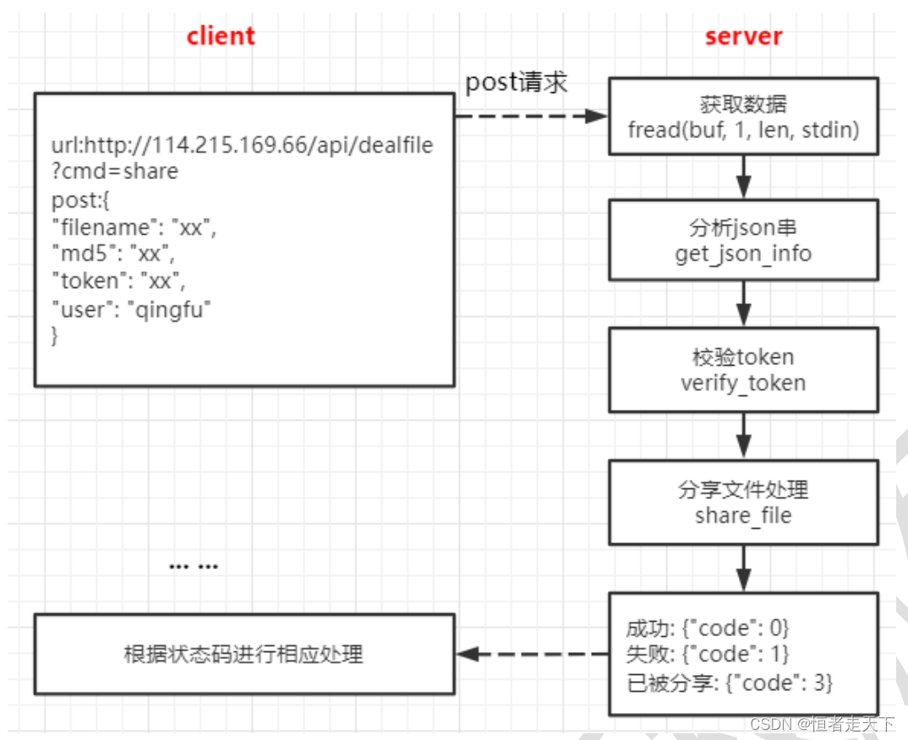  
分享处理先检查文件是否已有共享记录，再根据 Redis 和 MySQL 的查询结果执行相应操作。

#### （1）查询 Redis 中是否已有共享记录

如果 Redis 中已经存在该文件的共享记录，则停止后续共享操作并直接返回结果。原文未展示具体查询代码。

#### （2）Redis 无记录但 MySQL 有记录

这表示 Redis 与 MySQL 中的共享状态不一致。此时先根据 MySQL 记录更新 Redis，再向前端返回结果。

#### （3）Redis 和 MySQL 均无共享记录

这表示该文件当前尚未分享，可以继续执行共享操作。

#### （4）写入共享数据

执行共享所需的数据库更新；原文未展示具体代码。

## 九、更新文件下载计数

更新文件下载计数的实现流程如下图所示：  
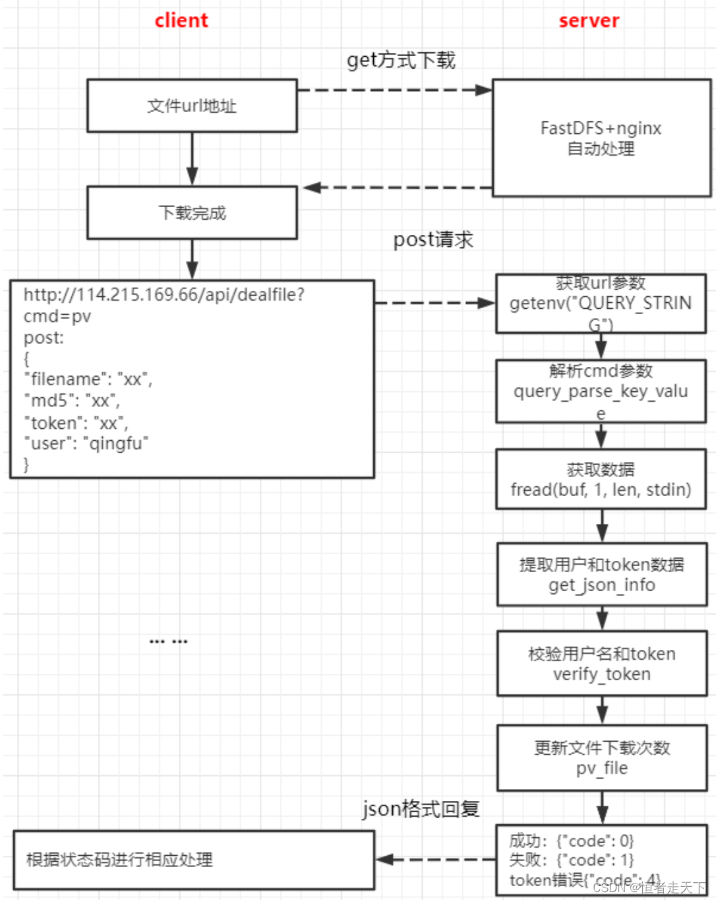  

该操作更新 `user_file_list` 中对应用户文件记录的 `pv` 下载量：

```cpp
   //查看该文件的pv字段
   sprintf(sql_cmd, "select pv from user_file_list where user = '%s' and md5 = '%s' and file_name = '%s'", user, md5, filename);
   //更新该文件pv字段，+1
   sprintf(sql_cmd, "update user_file_list set pv = %d where user = '%s' and md5 = '%s' and file_name = '%s'", pv+1, user, md5, filename);
```

## 十、处理分享文件

处理分享文件的功能流程如下图所示：  
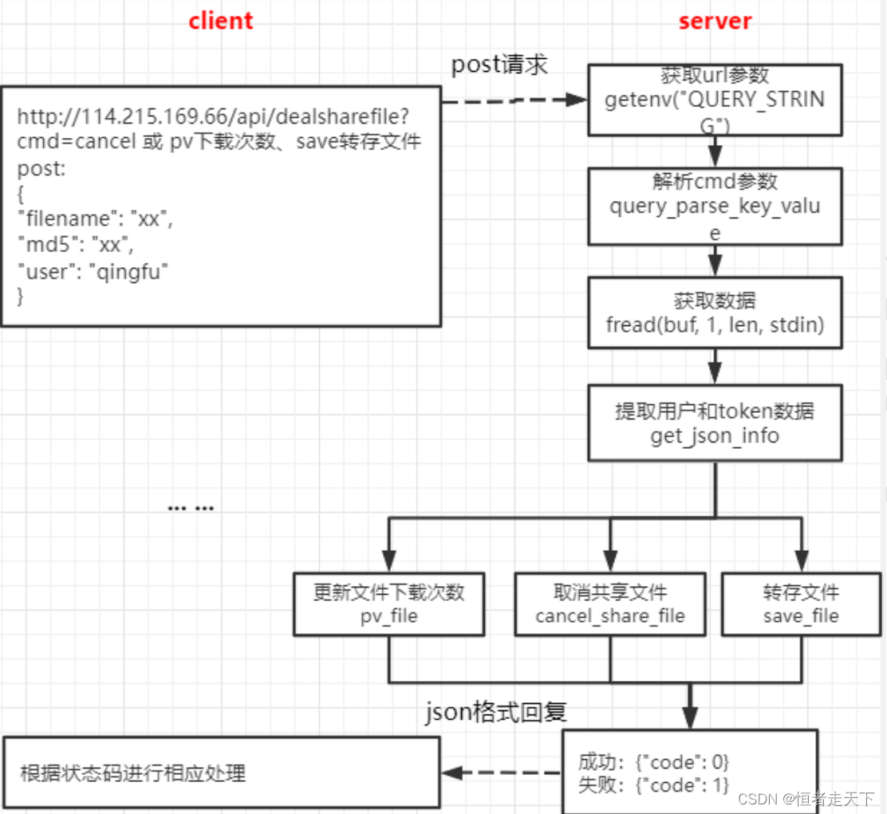  
该模块包括取消分享、转存文件和下载共享文件三个功能。

#### 10.1 取消分享文件

取消分享按以下步骤处理：

1. 从 `user_file_count` 查询共享文件数量；
2. 如果共享文件数量为 1，则删除对应的共享文件计数记录；
3. 如果共享文件数量大于 1，则将共享文件数量减 1；
4. 从 `share_file_list` 删除该文件；
5. 从 `FILE_PUBLIC_ZSET` 排行榜删除该文件。

相关代码如下：

```cpp
   /*这里只显示下sql语句的操作，对于操作数据库就不展示了，前面赘述太多了*/
   //改变分享状态
   sprintf(sql_cmd, "update user_file_list set shared_status = 0 where user = '%s' and md5 = '%s' and file_name = '%s'", user, md5, filename);
   //查询共享文件数量
   sprintf(sql_cmd, "select count from user_file_count where user = '%s'", "xxx_share_xxx_file_xxx_list_xxx_count_xxx");
   if(count == 1)
   {
        //删除数据
        sprintf(sql_cmd, "delete from user_file_count where user = '%s'", "xxx_share_xxx_file_xxx_list_xxx_count_xxx");
   }
   else
   {
        sprintf(sql_cmd, "update user_file_count set count = %d where user = '%s'", count-1, "xxx_share_xxx_file_xxx_list_xxx_count_xxx");
   }
   //删除在共享列表的数据
   sprintf(sql_cmd, "delete from share_file_list where user = '%s' and md5 = '%s' and file_name = '%s'", user, md5, filename);

   /*删除在redis中的操作*/
   ret = rop_zset_zrem(redis_conn, FILE_PUBLIC_ZSET, fileid);
   ret = rop_hash_del(redis_conn, FILE_NAME_HASH, fileid);
```

#### 10.2 转存文件

转存文件按以下步骤处理：

1. 查询目标用户的个人文件列表，判断该文件是否已经存在；
2. 将 `file_info.count` 加 1，表示新增一个文件引用；
3. 向目标用户的 `user_file_list` 添加一条文件记录；
4. 更新目标用户的 `user_file_count`。

```cpp
   //查看此用户，文件名和md5是否存在，如果存在说明此文件存在
   sprintf(sql_cmd, "select * from user_file_list where user = '%s' and md5 = '%s' and file_name = '%s'", user, md5, filename);
   //文件信息表，查找该文件的计数器
   sprintf(sql_cmd, "select count from file_info where md5 = '%s'", md5);
   //1、修改file_info中的count字段，+1 （count 文件引用计数）
   sprintf(sql_cmd, "update file_info set count = %d where md5 = '%s'", count+1, md5);
   //用户文件列表
   sprintf(sql_cmd, "insert into user_file_list(user, md5, create_time, file_name, shared_status, pv) values ('%s', '%s', '%s', '%s', %d, %d)", user, md5, time_str, filename, 0, 0);
   
```

#### 10.3 下载共享文件

下载共享文件后需要更新两处计数：

1. 更新 `share_file_list` 中的 `pv` 值；
2. 更新 Redis 中 `FILE_PUBLIC_ZSET` 的对应分数，用于生成排行榜。

## 十一、图床分享图片

#### 图片分享

图片分享的功能流程如下图所示：  
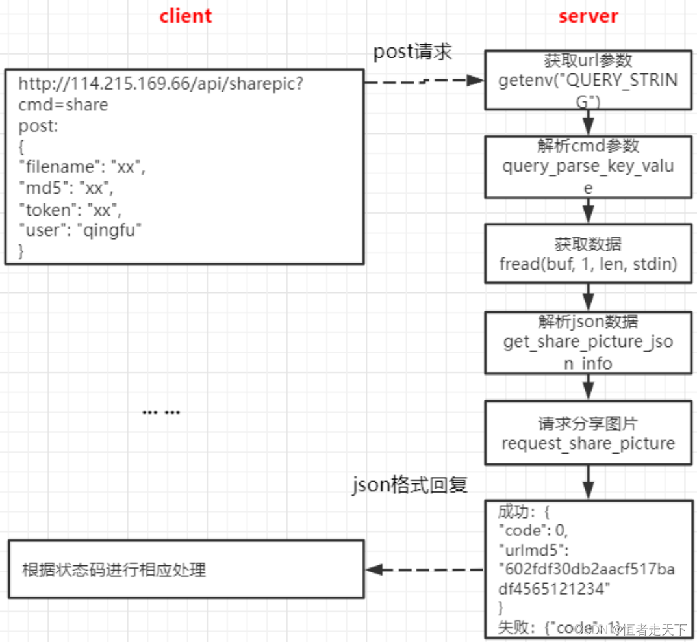
