# 云存储项目·实测部署与 Q&A 补充

> 依据：当前仓库源码 + 2026-09-08 本机 Docker 三容器真实部署（`/home/ayanami/AI_YunCunChu`）。
> 收录口径：只写能实证的代码事实与部署结果；与主口径一致处用「精确化」，与实证有出入处用「修正」标注；理想能力一律标为「改进」。
> 主口径见 `实际面经整理与原始归档.md`；本文不展开 AI 能力（同主口径约定，仅在第 1 节拓扑中如实现象地提及存在 ai 监听进程）。

---

## 一、架构与部署（Q&A 口径 + 实证）

### 1.1 实际容器/进程/端口拓扑

三容器单机 Compose，自定义 bridge `my_net`，子网 `172.30.0.0/16`，静态 IP：

| 容器                    | 镜像                   | IP         | 对外发布端口                  | 容器内进程                                                  |
| --------------------- | -------------------- | ---------- | ----------------------- | ------------------------------------------------------ |
| tc_fcgi_mysql         | docker-tc_mysql      | 172.30.0.2 | 3307→3306               | mysqld（healthcheck：mysqladmin ping）                    |
| tc_fcgi_nginx_fastdfs | docker-nginx_fastdfs | 172.30.0.3 | 80→80、443→443           | nginx（2 worker）+ 1 tracker(:22122) + 1 storage(:23000) |
| tc_fcgi_app           | docker-fastcgi_app   | 172.30.0.4 | 10000-10012→10000-10012 | redis(127.0.0.1:6379) + 13 个 spawn-fcgi 监听进程           |

- 一个容器内同时跑 nginx + tracker + storage，是「三容器」的真正含义，不要表述为「Nginx 单独一容器」。
- fastcgi 容器内有 redis（随启动脚本 daemonize）；redis 无数据 volume、每次都是全新实例，容器重建（--force-recreate/down+up）即丢失全部 Token/分片会话，需要重新登录——由「无持久化」机制决定，属于确定结论。
- MySQL、FastDFS 数据用命名 volume（mysql_data、fastdfs_data），`docker compose down` 不丢。

### 1.2 13 条路由 ↔ 端口 ↔ 模块（代码核对）

| 端口    | 路由                 | 模块            | 是否 verify_token           |
| ----- | ------------------ | ------------- | ------------------------- |
| 10000 | /api/login         | login         | 无（登录本身）                   |
| 10001 | /api/reg           | register      | 无（注册本身）                   |
| 10002 | /api/upload        | upload        | **无**                     |
| 10003 | /api/md5           | md5           | 有                         |
| 10004 | /api/myfiles       | myfiles       | 有                         |
| 10005 | /api/dealfile      | dealfile      | 有                         |
| 10006 | /api/sharefiles    | sharefiles    | **无**（公共分享列表）             |
| 10007 | /api/dealsharefile | dealsharefile | **无**（取消/转存/公共下载计数在此，越权点） |
| 10008 | /api/sharepic      | sharepicture  | 有                         |
| 10009 | /api/chunk_init    | chunk_init    | 有                         |
| 10010 | /api/chunk_upload  | chunk_upload  | **无**                     |
| 10011 | /api/chunk_merge   | chunk_merge   | 有                         |
| 10012 | /api/ai            | ai（扩展，不进主口径）  | 有                         |

- 每个端口是 `spawn-fcgi -a 0.0.0.0 -p X -f /app/bin_cgi/模块` 起的**单实例**，`main()` 里 `FCGI_Accept()` 循环，天然**串行**处理；说「13 个常驻进程」即可，不要说成 13 进程高并发。
- nginx 全部 `fastcgi_pass 172.30.0.4:PORT`（写死容器 IP），`http{}` 里**没有 upstream**，所以没有应用层负载均衡；这也是「框架可集群、本项目单实例」的证据。

### 1.3 一条 API 请求实测路径（/api/login）

浏览器 → `https://127.0.0.1:443`（http:80 全部 301）→ nginx 443 server → `location /api/login` 加 CORS 头 → `fastcgi_pass 172.30.0.4:10000` → login CGI → MySQL(172.30.0.2)/Redis(127.0.0.1) → 回 `{"code":0,"token":…}`。

实测回显（字段要对得上，否则 code1）：
- 注册：`{"userName","nickName","firstPwd","phone","email"}`，firstPwd = MD5(明文)。返回 `{"code":0}`。
- 登录：`{"user","pwd"}`，pwd = MD5(明文)。返回 `{"code":0,"token":"32位hex"}`。
- 用明文密码直接手测登录会得到 code1 —— 前端在 Login.js:94-95 先 `calculateMD5(password)` 再发。

### 1.4 一条文件下载实测路径

`https://127.0.0.1/group1/M00/00/00/xxx` → nginx `location ~/group([0-9])/M([0-9])([0-9])` → ngx_fastdfs 模块在本容器读 storage 本地路径返回。

实测合并出的 223,219,546 B 的 mp4：
- HEAD → HTTP 200，Content-Type video/mp4，Content-Length 与上传声明**完全一致**；
- Range → HTTP 206，字节正确（mp4 头可读）。说明文件正文确实落盘且由 nginx 按真实长度服务。

### 1.5 前端「内网地址绕行」细节（主口径没提，面试可讲）

- cfg.json：`web_server/storage_web_server = 172.30.0.3:80`，DB `file_info.url` 存的就是 `http://172.30.0.3:80/group1/M00/…`（内网地址，浏览器不可达）。
- 前端 `config/index.js` 把 `STORAGE_URL` 设成同样的 `http://172.30.0.3:80`，`images/share/ai` 拿到 url 后做 `url.replace(STORAGE_URL, BASE_URL='')` → 变成同源相对路径 `/group1/M00/…`，再由当前域名的 nginx 反代。
- 优点：避免把 docker 内网 IP 暴露给浏览器。弱点：纯字符串替换，只要后端 URL 格式（协议/端口/host）和 STORAGE_URL 不完全一致，替换就失效，图片直接裂。这也是「为什么不能在前端存死内网地址」的现实依据。

---

## 二、注册、登录与安全（Q&A 口径 + 实证）

1. **密码几次摘要、盐在哪**：前端 1 次 MD5 → 服务端 reg 生成随机盐存 `user_info.salt`，存 `MD5(salt + 前端MD5)`（reg_cgi.c 计算加盐哈希）。登录时取出 salt 与存储 hash，重算 `MD5(salt + 客户端pwd)` 比对，所以客户端要传的是 MD5 而不是明文。
2. **为什么带盐双层 MD5 仍不适合生产**：MD5 本身快、无 KDF 拉伸；盐随机、逐用户，但仍是弱口令可离线爆破的对象；应换 bcrypt/scrypt/argon2 的「改进」，不是现状。
3. **Token 怎么生成 / Redis 结构 / TTL**：`token = MD5hex( base64( DES( username + 4×(rand%1000) ) ) )`（login_cgi.c set_token，192 行的逻辑），即用户名拼接随机数后 DES→base64→MD5 定长 32 hex。Redis `SETEX username 86400 token`：**key = 用户名**（实测键名就是 "123123"），value = token，TTL 固定 86400 s。校验 `verify_token` 读 key=用户名 的 value 直接 strcmp，只读不续期。
4. **为什么不是 JWT / 不是滑动过期**：是无状态的客户端自校验就没有；这里 token 是 Redis 里的服务端状态，Redis 丢（重建容器/重启）就要重新登录；TTL 固定不续期。
5. **同用户再登录 / 多设备**：同一 key（用户名）SETEX 覆盖旧值 → 旧设备 token 立即失效，语义上「单会话」，不是多设备独立会话。要向「每会话一条记录」改进。
6. **哪些写接口缺 Token（越权面，代码核实）**：`upload`(10002)、`chunk_upload`(10010)、`dealsharefile`(10007) 未调 verify_token；`dealsharefile` 承载取消分享/转存/公共下载计数，是文档已确认的越权点。带 token 的接口清单见 1.2 表。
7. **SQL 拼接 / 敏感日志 / CORS**：全部 `sprintf` 拼 SQL（无预处理语句），用户名/文件名可控 → SQL 注入风险；login 日志把请求里密码字段原文打出（实测日志 `pwd = …` 可见）；nginx 对所有 /api 配了 `Access-Control-Allow-Origin $http_origin` + `*` Methods 的宽放 CORS。全部属于「当前缺陷 → 改进」。
8. **正确推导身份**：服务端应从 token（服务端签发、能反查会话）得到 user_id，而不是信任请求体/参数里的 username；现状是多数接口把用户名当入参、token 仅做开关校验（chunk_merge 甚至用请求里的 user 查库），是统一鉴权的改进点。

---

## 三、秒传与普通上传（Q&A 口径 + 实证）

1. **/api/md5 的分支与返回码**（md5_cgi.c，code 注释：004/005/006）：
   - 用户已有同名同 md5 目录项 → 直接返回已存在（不再上传也不重复计引用）；
   - 物理文件存在但用户未拥有 → 加用户关系 + `file_info.count` 引用计数 + `user_file_count` 用户计数，算「秒传」；
   - 物理文件不存在 → 返回不能秒传，走真实上传。
2. **秒传仍写关系/计数**：文件正文在 `file_info` 只有一份，秒传本质是让多个用户的目录项共享同一正文，必须写 `user_file_list` 关系与两个计数。
3. **是否有 Redis 暂存预期 MD5**：普通上传/秒传**没有**；Redis 只在登录 Token、分片会话（`chunk:{md5}` Hash）、分享排行这些场景用。不要把分片 Hash 与秒传混谈。
4. **普通上传是否校验 Token / 重算正文 MD5**：upload_cgi **未调 verify_token**；`recv_save_file` 只按解析出的正文长度与请求声明比对，**不重算内容摘要**。客户端声明的 md5 是信任输入。
5. **为什么全量读 multipart 有内存问题**：upload_cgi 里 `malloc(len)` 一次读整个请求体进内存再解析（代码 `file_buf = malloc(len); fread(file_buf,1,len,stdin)`），文件越大占用越大；而大文件已走分片，所以小文件接口还在可接受范围，这是「为何拆小文件/大文件两条链路」的一个理由。
6. **上传后查 MD5 仍不能解决并发去重**：两请求同时「查 MD5 不存在 → 各自上传」就是经典的检查—执行竞态；之后补查只能事后发现重复，无法阻止重复正文写入。要「唯一内容记录 + UPLOADING/READY/FAILED 占位 + 原子争抢」改进。
7. **fork/exec + 管道串联**（upload_cgi.c 实证）：
   - `pipe()` → `fork()` → 子进程 `dup2(fd[1], STDOUT_FILENO)` → `execlp("fdfs_upload_file", conf_path, filename)`；文件正文经 FastDFS 客户端上 tracker/storage，file_id 从管道读出；
   - 再 `fork/execlp("fdfs_file_info", conf, fileid)` 拿 size/信息回填。
   - 所以上传不是项目内嵌 FastDFS API 的服务器，而是外部可执行文件 + 管道取回显，进程模型接近「传统 CGI + 外部命令」。
8. **FastDFS 成功、MySQL 失败留什么**：FastDFS 已写正文、`file_info` 可能没写或写一半 → 留孤儿正文；反之 DB 记了但 FastDFS 失败 → 关系指向不存在的正文。多处 sprintf 更新无事务（本项目无外键/无整体事务）。
9. **完善链路**：唯一占位 + 用户关系唯一键 + 事务 + outbox/补偿任务清理孤儿，属「改进」。
10. **MD5→SHA-256 解决/不解决什么**：解决碰撞/长度扩展类顾虑与更符合现代规范；不能解决检查—执行竞态、鉴权缺失、无事务这些一致性/安全问题。

---

## 四、分片与续传（Q&A 口径 + 实证 + 事故）

### 4.1 实测会话与文件布局

- 阈值与分片都 10 MiB（`config/index.js`：CHUNK_SIZE/CHUNK_THRESHOLD = 10*1024*1024）。
- 前端逐片 `await`（顺序上传，不是并发）。
- 初始化：chunk_init 校验 Token，Redis `chunk:{md5}` Hash 字段实测为：`filename / filesize / chunk_count / user / uploaded`，并 `EXPIRE chunk:{md5} 86400`（chunk_init_cgi.c:200）。
- 分片落盘 `/tmp/chunks/{md5}/{0..N-1}`（chunk_upload 按 URL `?md5=&index=` 写文件）。
- 单片上传：不验 Token/所有者/编号范围/单片大小/摘要；`uploaded` 是**先读后拼的逗号字符串**（非原子读改写）。
- 合并（chunk_merge）只 `verify_all_chunks` 检查各编号文件**存在**，不核对大小/哈希/总大小；随后首片 `storage_upload_appender_by_filename1`，后续 `storage_append_by_filename1` 按序追加，每片 append 完就 `unlink` 本地片。

### 4.2 实测一次完整合并（可引用的真数据，非编造）

- 文件 `[Sakura_Trick][01][720p][BDrip].mp4`，22 片，总字节 223,219,546（21×10 MiB + 末片 3,018,586）。
- 合并成功 file_id：`group1/M00/00/00/rB4AA2qfx4uENU2KAAAAAOGqdOw946.mp4`。
- 复验：HTTP 200 + Content-Length 与声明一致 + Range 206 正常；`user_file_list`/`file_info` 记录齐全（file_info.url 为内网 `http://172.30.0.3:80/…`）。
- 这条证明「分片→appender→nginx 下载」整条链路在真实部署里可用。

### 4.3 Q&A 补充口径

1. **为什么只用 MD5 当会话 ID 会跨用户碰撞**：Redis key、目录名都用客户端给的 md5，A 用户可在不知道 B 内容的情况下用同 md5 撞到 B 的会话/目录；会话应含用户维度（user+md5）或服务端签发 upload_id。
2. **边追加边删分片的后果**：任一后续分片 append 失败，已删的本地片无法重传补齐，只能整批重来；append 未做整体校验，失败无法定位到片。本次代码行 300/322 可见 `unlink`。
3. **Redis TTL 到期不删 /tmp/chunks**：Redis 只管理 `chunk:{md5}` 键的 86400 秒；`/tmp/chunks` 目录没有任何 GC/定时清理，键过期后磁盘残留目录与分片——孤儿文件累积。需「过期回收任务」改进。
4. **能否跨容器重建续传**：`/tmp/chunks` 在 fastcgi 容器可写层（无 volume），Redis 也无数据 volume，重建容器后分片与会话都不复存在；只能讲「同一容器生命周期内的缺片补传」。
5. **理想设计**：服务端 `upload_id`、Bitmap/原子位图标记已传片、单片哈希与大小校验、`PENDING/READY/MERGING/FAILED` 状态机、可持久化分片目录 + 过期 GC。全部属「改进」。

### 4.4 真实事故复盘：chunk_merge 10011「启动即崩」

- 现象：容器 healthy，但分片上传完成后合并请求全部失败；`lsof -i:10011` 无监听；docker logs 只有 spawn 行无报错；`/app/logs/cgi/…/chunk_merge-08.log` 只有初始化一行就停。
- 根因：start.sh **先 spawn chunk_merge、后 mkdir** `/fastdfs_data_and_log/client`。chunk_merge `main()` 里 `read_cfg()` 后立即 `fdfs_client_init()`，而 FastDFS client 需要 base_path 目录存在；目录缺失时 init 直接 abort，进程死、端口不监听。做了**可控复现**：删掉该目录再 spawn，10011 立刻起不来；恢复目录则正常。
- 修复：把 `mkdir -p /tmp/chunks /fastdfs_data_and_log/client /data/faiss` 提前到所有 spawn 之前；重 build fastcgi 镜像 + 冷启动后 10000-10012 全部监听、无崩溃日志。
- 面试价值：① 容器健康检查只查 `lsof -i:10000`（或 nginx 查 443），**10011 挂了容器仍 healthy** → 健康检查 ≠ 高可用，也 ≠ 端口全覆盖，本次直接踩到；② FastCGI 进程的启动顺序/前置目录/外部依赖要在启动脚本里显式先就绪。

---

## 五、分享、转存与删除（Q&A 口径 + 实证）

- 分享创建接口 sharepicture **校验 Token**；取消失效/转存/公共下载计数集中在 dealsharefile（**未校验 Token**，越权面）。
- MySQL 分享行是持久事实源；Redis ZSet/Hash 是缓存，未命中回查可回填（与主口径一致）。
- 转存只新增目标用户 `user_file_list` 关系并把 `file_info.count` +1，不重复上传正文。
- 删除：删用户关系 → 计数减一 → 归零才删物理记录与 FastDFS 正文；跨存储无事务、无补偿表 → 中途失败留不一致。
- 图片分享：sharepicture 建 `urlmd5` 与 4 位 `key`，但创建响应**不返回 key**、浏览接口只按 `urlmd5` 查（sharepicture_cgi.c 中 browse 只解析 urlmd5），所以「提取码保护」**未生效**，只能说生成了一列但没有强制校验。

---

## 六、真实部署故障复盘（两起 + 一坑）

### 6.1 CRLF 行尾导致容器崩溃循环（Windows/Linux 转义）

- 现象：fastcgi_app `Restarting (255)`，`docker logs` 反复 `exec /app/start.sh: no such file or directory`。
- 根因：仓库大量文件是 CRLF（Windows 检出/提交），start.sh 被 `COPY` 进镜像后首行 `#!/bin/sh\r`，内核把解释器当成 `/bin/sh\r` → 找不到 → 起不来。不只是 sh：Makefile/nginx.conf/FastDFS conf/dockerfile 全 CRLF，各自有隐患。
- 修复：全仓库 88 个 tracked 文本文件归一 LF；新增 `.gitattributes`（`* text=auto eol=lf`）；**必须重 build**（CRLF 已在镜像层里，光重启没用）。
- 面试价值：Linux 下可执行脚本/构建上下文对行尾敏感；git 跨平台协作要靠 attributes 而非依赖编辑器；复制进镜像的内容等于最终运行内容，改文件要重建镜像。

### 6.2 宿主机 80 被系统 nginx 抢占，前端「连不上」

- 现象：`http://127.0.0.1` 返回的是另一份 nginx 默认欢迎页（HTTP 200 但不是本项目），443 无监听；docker 发布 80:80 一直失败。
- 处理：`systemctl stop/disable nginx` 释放 80，compose 才能发布 80/443。
- 面试价值：端口占用是「本地部署连不上前端」的第一排查点；先 `ss -tlnp` 看监听归属，别只盯 docker。

### 6.3 排障方法论沉淀（可直接讲）

- `docker compose ps` 看健康态 ≠ 功能可用；结合 `docker exec … lsof -i` 逐端口核对监听。
- FastCGI/常驻进程「没日志多半是没起来」，用 `spawn-fcgi` 前台/手动执行 + 看 `/app/logs/cgi/*.log` 定位启动中断点。
- 怀疑环境因素时做**可控复现**（删目录→spawn→复现崩溃；补目录→正常）比猜代码更高效。

---

## 七、对《实际面经整理》统一口径的精确化清单

主文档基本事实准确，以下按本次实证做精确化/小修正：

| 原口径 | 本次实测后的精确化 |
| --- | --- |
| Token Redis 是「用户名 -> Token」 | 键就是**用户名**（如 `123123`），SETEX 86400；同 key 覆盖 = 单会话语义。 |
| 13 个 FastCGI 程序 ↔ 13 条路由 | 端口 10000-10012 共 13 个 listener，全 spawn-fcgi 单实例、串行；其中 ai(10012) 不进主口径。 |
| 「三容器」 | 精确为：MySQL 一容器；nginx+tracker+storage **同容器**；FastCGI+redis 同容器。 |
| 健康检查不等于高可用 | 实例佐证：fastcgi 只查 10000、nginx 只查 443 2xx，10011 挂了容器仍 healthy（本次事故）。 |
| 分片会话 TTL 24 小时 | 代码 `EXPIRE chunk:{md5} 86400`；但 /tmp/chunks **无 GC**，键过期文件仍在。 |
| 登录失败=用户不存在？ | 更精确：登录传 `{user,pwd}` 且 pwd 要是 **MD5(明文)**；明文直接手测会 code1（前端先 MD5）。别把「字段/加密不对」当成后端故障。 |
| 下载/去重 | 普通上传不重算 MD5、只比对声明长度，已实证；MD5/秒传的分支返回码是 004/005/006。 |
| 越权写接口 | 代码核实：upload、chunk_upload、dealsharefile 未调 verify_token；受保护面清单见 1.2。 |
| — | 新增：前端用 `url.replace(STORAGE_URL,'')` 把内网 `172.30.0.3:80` 文件地址转同源相对路径；DB 里 file_info.url 存的就是内网地址。 |
| — | 新增：redis 无数据 volume、容器重建即全新实例，Token/分片会话丢失需重新登录（由无持久化机制决定）。 |

「改进」清单与主文档第六部分一致：统一写鉴权、SHA-256 复算 + 唯一内容记录、upload_id/位图/状态机续传、MySQL 事务 + FastDFS outbox、分片目录持久化与 GC、图片 key/签名下载/SQL 参数化。

---

## 八、实测证据附录（面试可引用的真数据）

- 静态 IP/端口/容器名：见 1.1 表。
- Redis：`keys *` 曾出现 `123123 / chunk:7e0674… / t_…`；`hgetall chunk:7e0674…` → `filename/filesize(223219546)/chunk_count(22)/user(123123)/uploaded(0..21)`。
- 合并实例：`fileid=group1/M00/00/00/rB4AA2qfx4uENU2KAAAAAOGqdOw946.mp4`；HEAD Content-Length=223219546、video/mp4；Range→206。
- 启动修复前后：修复前 10011 无监听且容器 healthy；修复后冷启动 10000-10012 全部 LISTEN，日志无 buffer/abort。
- 一条端到端 API：注册 code0 → 登录 code0+token（MD5 密码）→（该 token 曾在 redis 为 `123123` 键值）。

> 所有数字仅来自本次本地部署，不推广到任意环境；压测/并发/性能数据未做，不提供。

---

## 九、核心功能调用链图与面试回答口径

> 本章整理自源码复核后的问答，只描述当前项目已经存在的调用关系。FastCGI 多实例、受保护下载、点对点分享、签名 URL、完整事务与补偿机制均属于改进方案，不能表述为现有功能。

### 9.1 Nginx、FastCGI 程序与业务层

核心关系：FastCGI 是 Nginx 与业务进程之间的通信协议，不是另一个类似 Nginx 的调度程序。当前项目把 FastCGI 接入代码和业务代码编译在同一个可执行程序中。

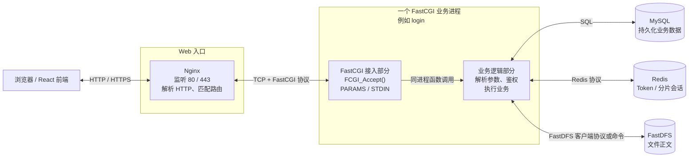

一次请求的协议转换如下：

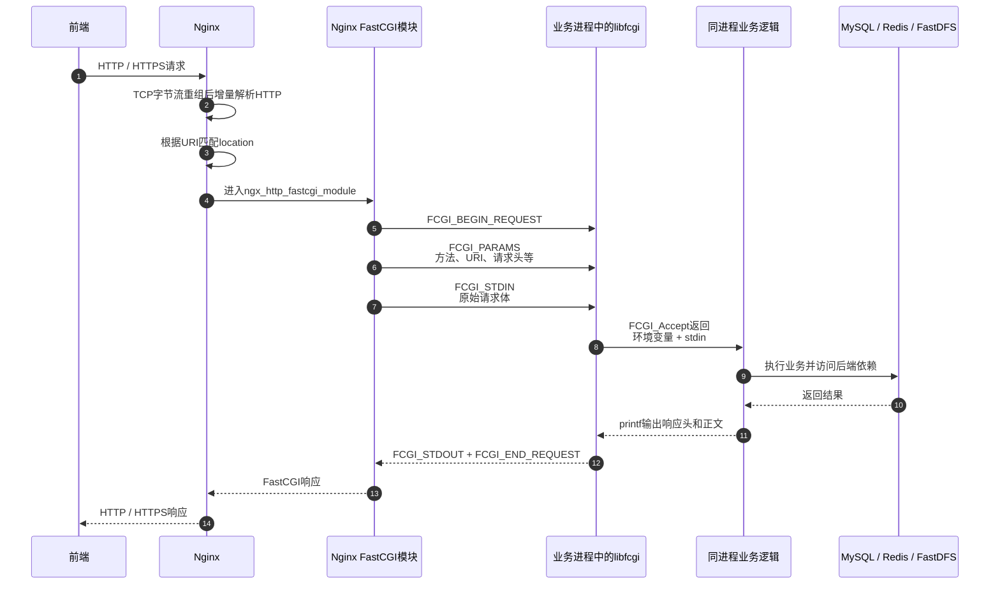

HTTP 转 FastCGI 只是“换协议外壳”，Nginx 不负责解析 JSON 或 multipart 的业务字段：

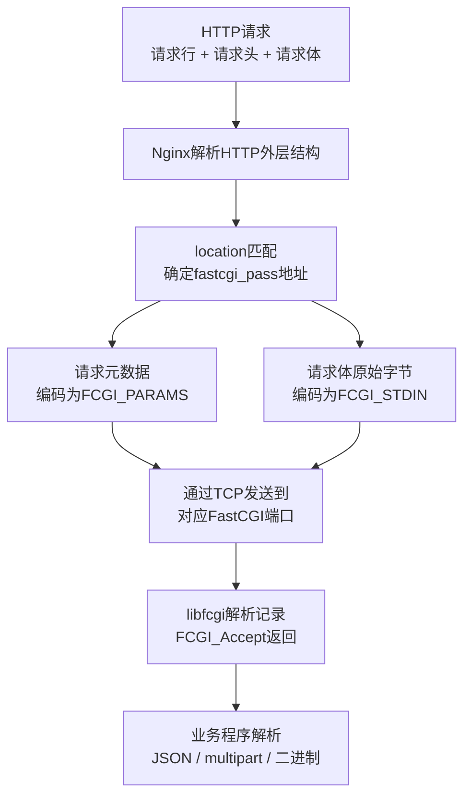

当前 13 条业务路由由 Nginx 直接映射到 13 个单实例 FastCGI 进程：

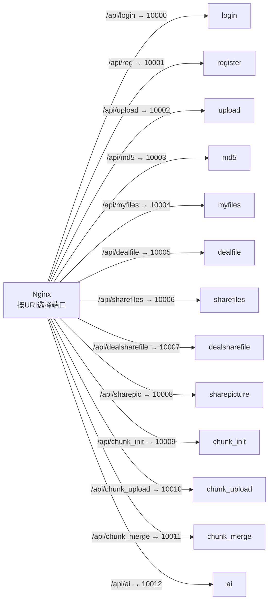

`spawn-fcgi` 只参与启动，不是每次请求的中转层：

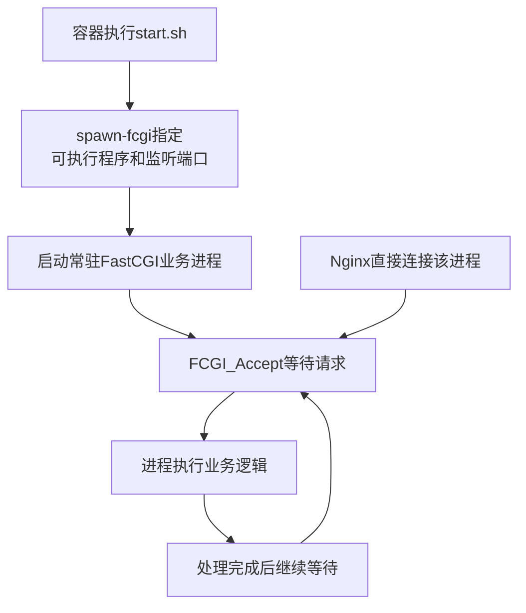

**面试口径：** 前端使用 HTTP/HTTPS 访问 Nginx；Nginx 根据 URI 路由到指定端口，并把 HTTP 元数据封装为 `FCGI_PARAMS`、请求体封装为 `FCGI_STDIN`。业务程序通过 `libfcgi` 接入请求，在同一进程中执行业务，再以 FastCGI 响应返回 Nginx。当前每个模块只有一个常驻进程，没有 FastCGI 多实例池或业务线程池，同一模块基本串行处理请求。

### 9.2 文件数据的存储职责

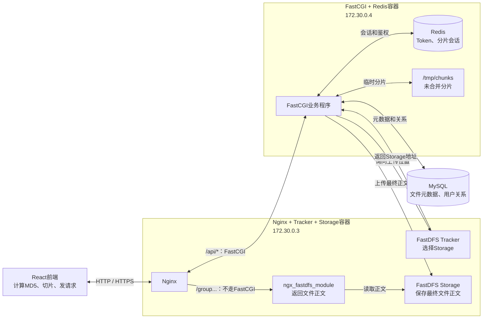

- MySQL 保存 `md5`、`file_id`、URL、大小、类型、引用计数和用户目录关系，不保存文件正文。
- Redis 保存 Token、分片会话和公共分享缓存，不保存最终正文。
- `/tmp/chunks` 暂存未合并分片。
- FastDFS Storage 保存最终文件正文。

### 9.3 秒传预检与上传分流

所有文件先在前端计算完整 MD5，再调用 `/api/md5`：

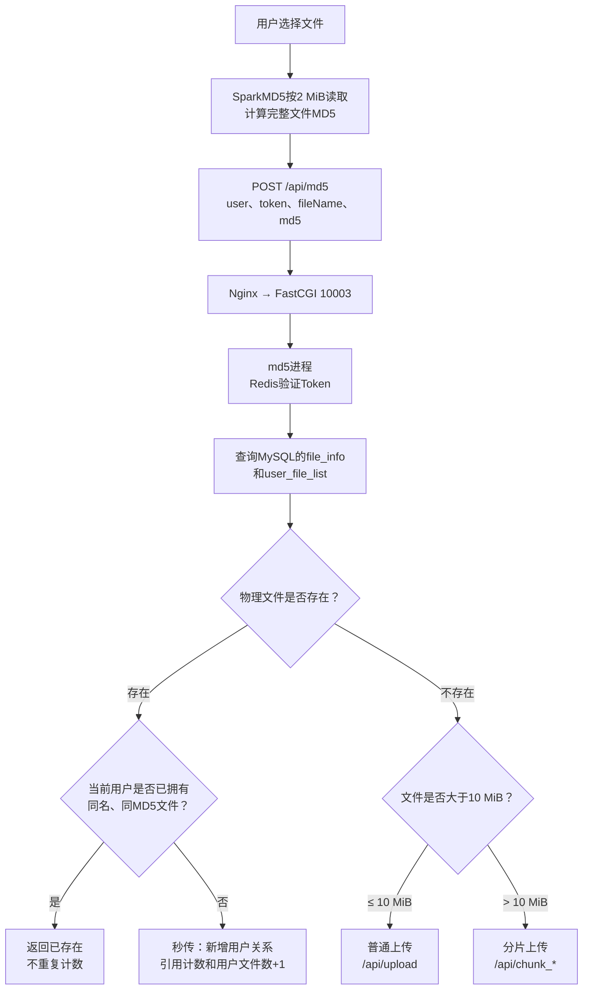

**面试口径：** 用户已拥有则直接返回；物理正文存在但当前用户未拥有时，只新增 `user_file_list` 并增加 `file_info.count`，不传正文；物理文件不存在时才进入普通上传或分片上传。当前秒传依赖客户端 MD5，服务端不复算正文摘要。

### 9.4 普通上传链路

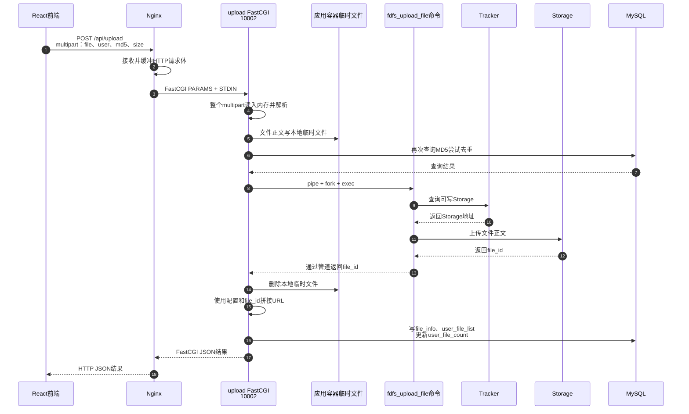

**面试口径：** 不超过 10 MiB 的文件以 multipart 发送给 `upload_cgi`。该程序全量读取请求体并落本地临时文件，再通过 `fork/exec` 调用 `fdfs_upload_file`；Tracker 只选择 Storage，正文最终写入 Storage。成功后保存 `file_id`、URL和用户关系。当前 `/api/upload` 不验 Token、不复算真实 MD5，多表写入也没有事务。

### 9.5 大文件分片、续传与合并

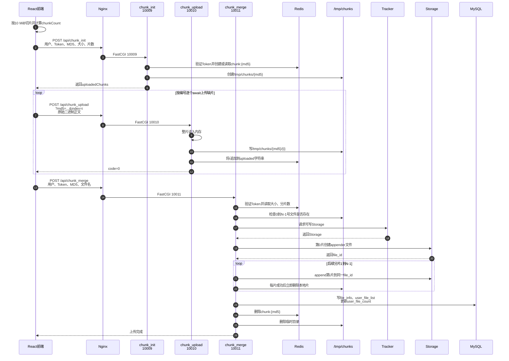

**面试口径：** 大于 10 MiB 的文件每片 10 MiB，前端按编号顺序上传。`chunk_init` 校验 Token，并用 Redis Hash 保存 24 小时会话；`chunk_upload` 把原始分片写入 `/tmp/chunks/{md5}/{index}`；`chunk_merge` 用第一片创建 FastDFS appender 文件，再依次追加后续分片。当前单片上传不验 Token和摘要，合并只检查分片是否存在，失败时可能留下远端半成品。

### 9.6 文件列表与正文下载

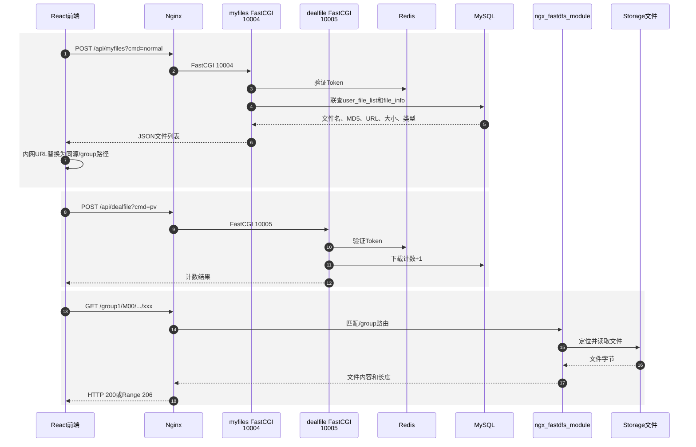

**面试口径：** FastCGI 只参与获取文件信息和更新下载计数；真正的正文请求匹配 Nginx 的 `/group...` 路由，由 `ngx_fastdfs_module` 直接读取 Storage 文件并返回，不经过 FastCGI、MySQL或Redis。计数请求与正文请求相互独立，因此当前 `pv` 只是可绕过、可重复的点击统计，不是下载授权。

### 9.7 `file_id`、URL 与下载路径

`file_id` 是 FastDFS 返回的内部逻辑标识；URL 是项目根据 Web 访问地址拼接出的 HTTP 地址：

```text
file_id = group1/M00/00/00/xxx.mp4

url = http://172.30.0.3:80/
    + file_id
    = http://172.30.0.3:80/group1/M00/00/00/xxx.mp4
```

```mermaid
flowchart LR
    Upload["文件写入Storage"]
    ID["FastDFS返回file_id<br/>group1/M00/.../xxx"]
    Build["FastCGI程序拼接<br/>协议 + Web地址 + file_id"]
    DB["file_info同时保存<br/>file_id和url"]
    List["文件列表API返回url"]
    Replace["前端去掉内网前缀<br/>得到/group..."]
    Nginx["Nginx匹配/group路由"]
    Module["ngx_fastdfs_module"]
    Storage["Storage文件正文"]

    Upload --> ID --> Build --> DB --> List --> Replace --> Nginx --> Module --> Storage
```

- `file_id` 用于 FastDFS 查询、删除和 appender 追加，是更基础的存储标识。
- URL 用于 HTTP 访问，是环境相关的可推导字段；当前前端把 `http://172.30.0.3:80` 替换为空字符串，再按同源路径访问。
- 同时永久保存完整 URL 会与部署地址耦合；合理改进是持久化 `file_id`，在响应时动态生成相对或公共 URL。

### 9.8 普通分享、公共列表、转存与取消分享

普通分享是“发布到公共窗口”，不是指定接收人的点对点授权。分享和转存都不会复制 FastDFS 正文：

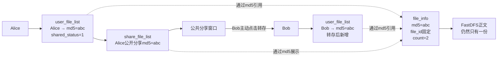

创建分享链路：

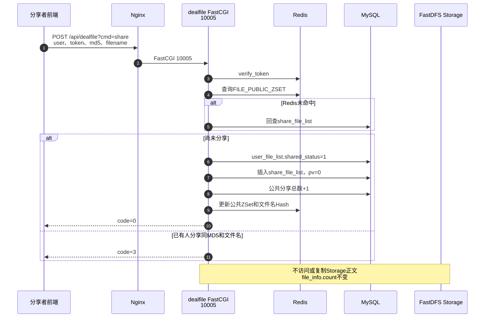

公共列表与转存链路：

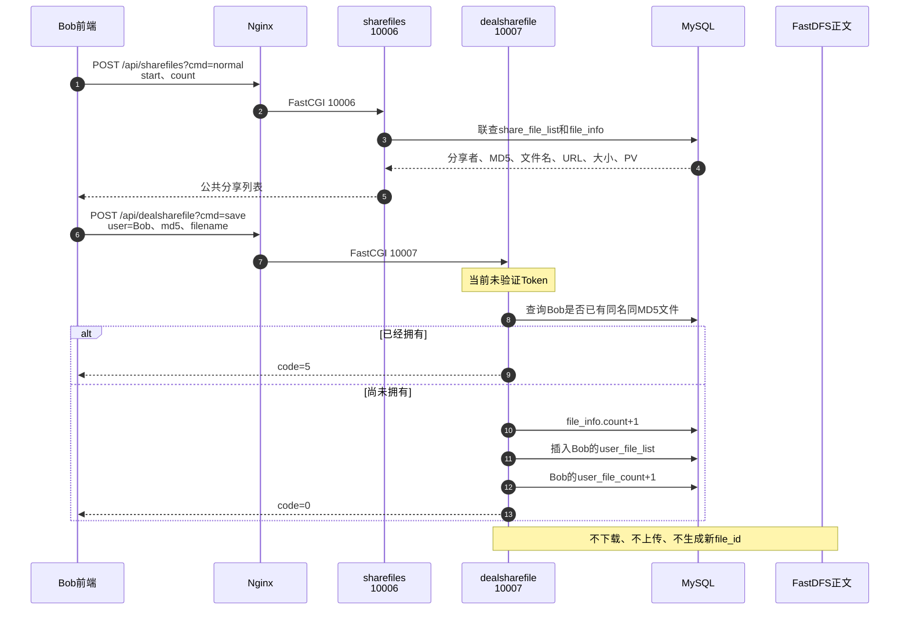

公共分享下载仍分为“计数”和“正文”两条请求：

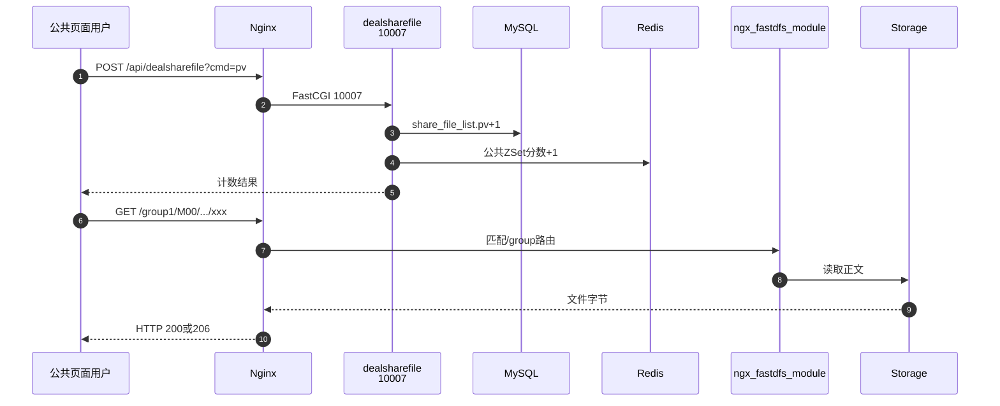

取消分享链路：

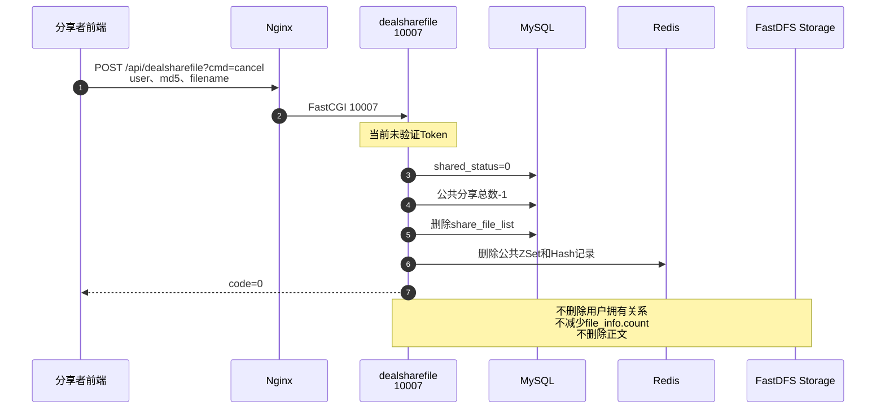

一份正文从上传到最终删除的状态变化：

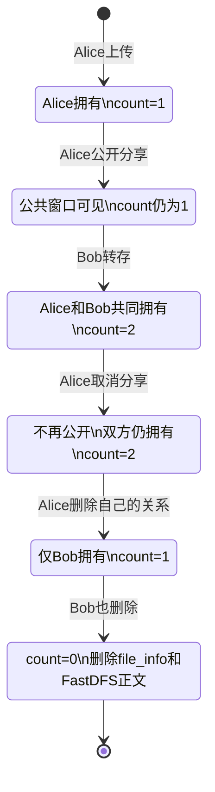

**面试口径：** 分享只把原目录项标记为已分享，并新增 `share_file_list` 和 Redis 公共列表缓存，不增加物理引用计数；转存给目标用户新增 `user_file_list` 并把 `file_info.count` 加一，继续引用同一个 `file_id`；取消分享只移除公开关系，不撤销别人已经完成的转存，也不删除正文。

### 9.9 当前是公共发布，不是点对点分享

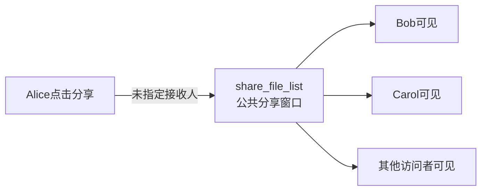

当前请求中没有 `receiver_user`、接收者授权、权限级别、有效期或分享授权表。用户也可以把永久 `/group...` 地址私下发送给别人，但这只是直链传播，不是受系统权限控制的点对点分享。图片分享子系统虽然有 `urlmd5` 和 `key` 字段，但当前前端未完整接入，浏览链路也没有强制校验提取码。

真正的点对点模型应显式记录发送者、接收者与权限：

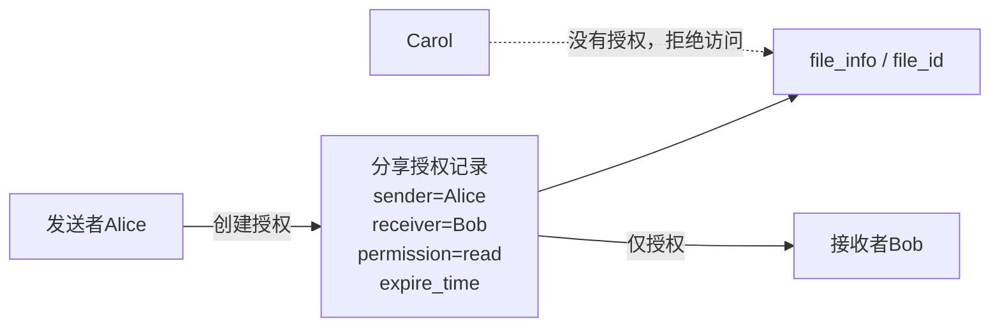

### 9.10 Token 遗漏与真实安全边界

前端页面要求登录不等于后端已经鉴权：

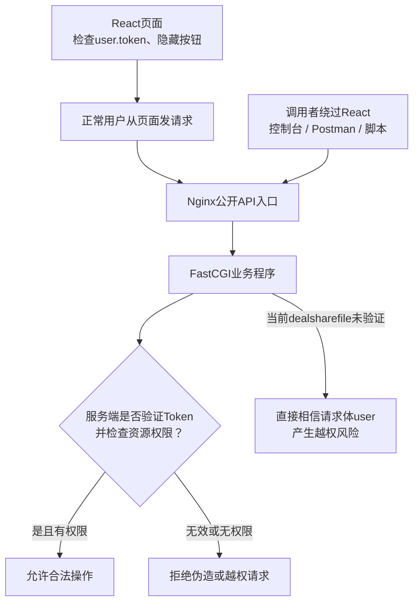

当前鉴权结论：

| 操作 | 当前 Token 状态 | 判断 |
| --- | --- | --- |
| 创建普通分享 `dealfile?cmd=share` | 校验 | 符合预期，但还应检查资源所有权 |
| 查看公共分享列表 `sharefiles?cmd=normal` | 不校验 | 若定义为公共窗口可以接受 |
| 转存 `dealsharefile?cmd=save` | **不校验** | 明确的服务端鉴权遗漏 |
| 取消分享 `dealsharefile?cmd=cancel` | **不校验** | 可伪造分享者，属于越权风险 |
| 公共下载计数 `dealsharefile?cmd=pv` | **不校验** | 可匿名计数，但独立接口可刷、可绕过 |
| 私有/公开正文 `/group...` | **不校验** | 知道永久URL即可直达，未区分私有与公开 |

结合前后端代码，最合理的判断不是“为了避免 Token 过期导致插入失败”，而是开发者把前端登录门禁误当成安全边界，遗漏了直接调用 API 和 `/group...` URL 的路径。Token 过期时拒绝转存、取消等写操作才是正确行为。

合理改进：

1. 转存、取消等写接口必须携带并校验 Token，真实用户应由服务端会话确定，不能信任请求体中的 `user`。
2. 转存前确认分享记录仍有效；取消前确认当前用户就是分享创建者。
3. 多表计数和关系更新使用事务、唯一约束与幂等设计。
4. 下载统一经过授权入口，校验私有拥有关系或公开分享状态，再使用短期签名 URL 或 `X-Accel-Redirect` 让 Nginx 返回正文。
5. 公共下载计数应与真实下载响应关联，而不是依赖前端单独调用可伪造的 `pv` 接口。

### 9.11 一分钟综合回答

> 前端通过 HTTP/HTTPS 访问 Nginx，Nginx 按 URI 把 `/api/*` 请求用 FastCGI 协议交给对应的常驻业务进程。文件上传前先由前端计算完整 MD5并调用 `/api/md5`：用户已拥有则结束，物理文件存在但用户未拥有则只新增引用完成秒传，物理文件不存在才上传正文。小文件经 `upload_cgi` 落临时文件后调用 `fdfs_upload_file`；大文件按 10 MiB 顺序上传到 `/tmp/chunks`，再用 FastDFS appender 合并。MySQL 保存元数据和用户关系，Redis 保存 Token、分片会话和公共分享缓存，Storage 保存最终正文。下载时 FastCGI 只负责查询 URL 和更新计数，正文由 Nginx 的 `ngx_fastdfs_module` 直接从 Storage 返回。普通分享只是发布到公共窗口，转存只给目标用户新增对同一 `file_id` 的引用，不复制正文。当前转存、取消分享和公共计数缺少服务端 Token 校验，`/group...` 永久直链也没有区分私有与公开，这是把前端登录限制误当安全边界造成的鉴权缺口。
