# 云存储项目·实测部署与 Q&A 补充

> 本文以当前仓库源码和 2026-09-08 在本机完成的 Docker 三容器部署为依据，项目路径为 `/home/ayanami/AI_YunCunChu`。
> 文中只记录能够通过源码或实际部署结果验证的事实。对于与主文档一致、但需要补充细节的内容，本文标记为「精确化」；对于与实测结果存在出入的内容，本文标记为「修正」；尚未实现的理想方案则统一标记为「改进」。
> 项目的主要面试口径见 `实际面经整理与原始归档.md`。按照主文档的约定，本文不展开介绍 AI 能力，仅在第 1 节的部署拓扑中如实说明当前存在 ai 监听进程。

---

## 一、架构与部署（Q&A 口径 + 实证）

### 1.1 实际容器/进程/端口拓扑

当前项目使用 Docker Compose 在一台主机上启动三个容器。三个容器都接入自定义 bridge 网络 `my_net`，该网络的子网为 `172.30.0.0/16`，每个容器都配置了固定 IP。具体拓扑如下：

| 容器                    | 镜像                   | IP         | 对外发布端口                  | 容器内进程                                                  |
| --------------------- | -------------------- | ---------- | ----------------------- | ------------------------------------------------------ |
| tc_fcgi_mysql         | docker-tc_mysql      | 172.30.0.2 | 3307→3306               | mysqld（healthcheck：mysqladmin ping）                    |
| tc_fcgi_nginx_fastdfs | docker-nginx_fastdfs | 172.30.0.3 | 80→80、443→443           | nginx（2 worker）+ 1 tracker(:22122) + 1 storage(:23000) |
| tc_fcgi_app           | docker-fastcgi_app   | 172.30.0.4 | 10000-10012→10000-10012 | redis(127.0.0.1:6379) + 13 个 spawn-fcgi 监听进程           |

- 这里所说的「三容器」并不意味着 Nginx、Tracker 和 Storage 分别占用一个容器。实际上，`tc_fcgi_nginx_fastdfs` 容器同时运行了 Nginx、一个 Tracker 进程和一个 Storage 进程，因此在介绍架构时，应说明这三个组件部署在同一个容器中。
- `tc_fcgi_app` 容器除了运行 13 个 FastCGI 进程，还会通过启动脚本以 daemonize 方式启动 Redis。不过，Redis 没有挂载数据卷，因此每次重建容器都会得到一个全新的实例。执行 `--force-recreate` 或 `docker compose down` 后再启动时，原有的 Token 和分片会话都会丢失，用户也需要重新登录。这是由 Redis 未持久化直接导致的确定行为。
- MySQL 和 FastDFS 的数据分别保存在 `mysql_data`、`fastdfs_data` 命名卷中。因此，普通的 `docker compose down` 不会删除这些业务数据；只有显式删除对应的数据卷时，数据才会随之消失。

### 1.2 13 条路由 ↔ 端口 ↔ 模块（代码核对）

| 端口    | 路由                 | 模块            | 是否 verify_token           |
| ----- | ------------------ | ------------- | ------------------------- |
| 10000 | /api/login         | login         | 无（登录本身）                   |
| 10001 | /api/reg           | register      | 无（注册本身）                   |
| 10002 | /api/upload        | upload        | **无**                     |
| 10003 | /api/md5           | md5           | 有                         |
| 10004 | /api/myfiles       | myfiles       | 有                         |
| 10005 | /api/dealfile      | dealfile      | 有                         |
| 10006 | /api/sharefiles    | sharefiles    | **无**（公共分享列表）             |
| 10007 | /api/dealsharefile | dealsharefile | **无**（取消/转存/公共下载计数在此，越权点） |
| 10008 | /api/sharepic      | sharepicture  | 有                         |
| 10009 | /api/chunk_init    | chunk_init    | 有                         |
| 10010 | /api/chunk_upload  | chunk_upload  | **无**                     |
| 10011 | /api/chunk_merge   | chunk_merge   | 有                         |
| 10012 | /api/ai            | ai（扩展，不进主口径）  | 有                         |

- 每个端口都由一条 `spawn-fcgi -a 0.0.0.0 -p X -f /app/bin_cgi/模块` 命令启动，并且每个模块只启动一个实例。进程进入 `main()` 后，会通过 `FCGI_Accept()` 循环逐个接收请求，因此单个模块内部采用的是串行处理方式。更准确的说法是「项目运行了 13 个常驻 FastCGI 进程」，而不是「项目依靠 13 个进程实现了高并发」。
- Nginx 通过 `fastcgi_pass 172.30.0.4:PORT` 将请求直接转发到写死的容器 IP 和端口，`http {}` 中没有配置 `upstream`。这说明当前部署没有在应用层进行负载均衡，也能作为「整体架构可以继续扩展为集群，但当前项目仍是单实例」的实际依据。

### 1.3 一条 API 请求实测路径（/api/login）

以 `/api/login` 为例，浏览器首先访问 `https://127.0.0.1:443`。如果用户访问的是 80 端口，Nginx 会先返回 301，将请求重定向到 HTTPS。请求进入 443 端口对应的 server 后，会匹配 `location /api/login`，由 Nginx 补充 CORS 响应头，再通过 `fastcgi_pass 172.30.0.4:10000` 转发给 login CGI。随后，login CGI 会访问位于 `172.30.0.2` 的 MySQL，并使用本容器内 `127.0.0.1:6379` 上的 Redis，最终向客户端返回 `{"code":0,"token":…}`。

实测时，请求字段和密码形式都必须与接口约定一致，否则接口会返回 `code1`。注册与登录的具体要求如下：

- 注册接口接收 `{"userName","nickName","firstPwd","phone","email"}`。其中，`firstPwd` 不是明文密码，而是明文密码经过一次 MD5 计算后的结果。注册成功时，接口返回 `{"code":0}`。
- 登录接口接收 `{"user","pwd"}`，其中 `pwd` 同样是明文密码的 MD5 值。登录成功后，接口返回 `{"code":0,"token":"32位hex"}`。
- 如果我们在手工测试时直接传入明文密码，登录接口会返回 `code1`。这是因为正常情况下，前端会在 `Login.js:94-95` 中先调用 `calculateMD5(password)`，然后再发送请求。

### 1.4 一条文件下载实测路径

当浏览器访问 `https://127.0.0.1/group1/M00/00/00/xxx` 时，请求会先匹配 Nginx 中的 `location ~/group([0-9])/M([0-9])([0-9])`。随后，`ngx_fastdfs` 模块会根据文件标识找到本容器内 Storage 对应的本地文件，并将文件内容返回给浏览器。

为了确认下载链路确实可用，我们对分片合并后生成的一个 223,219,546 B 的 MP4 文件进行了验证：

- 首先发送 HEAD 请求，服务端返回 HTTP 200，`Content-Type` 为 `video/mp4`，而且 `Content-Length` 与上传时声明的大小完全一致。
- 然后发送 Range 请求，服务端返回 HTTP 206，响应中的字节内容也符合预期，MP4 文件头能够正常读取。

这些结果说明，文件正文已经真实写入 Storage，并且 Nginx 能够按照文件的实际长度提供完整下载和分段读取服务。

### 1.5 前端对内网文件地址的转换（主文档未提及，面试时可以补充）

- 在 `cfg.json` 中，`web_server/storage_web_server` 被配置为 `172.30.0.3:80`，因此数据库的 `file_info.url` 字段保存的是类似 `http://172.30.0.3:80/group1/M00/…` 的地址。这个地址属于 Docker 内网，用户的浏览器通常无法直接访问。
- 为了解决这个问题，前端在 `config/index.js` 中把 `STORAGE_URL` 配置成相同的 `http://172.30.0.3:80`。当 `images`、`share` 或 `ai` 页面拿到文件 URL 后，前端会执行 `url.replace(STORAGE_URL, BASE_URL='')`，把原地址转换为 `/group1/M00/…` 这样的同源相对路径。浏览器随后通过当前域名访问该路径，再由 Nginx 完成文件读取。
- 这种处理方式可以避免浏览器直接访问 Docker 内网 IP，但它依赖严格的字符串匹配。只要后端返回的协议、端口或主机名与 `STORAGE_URL` 不完全一致，替换就会失败，图片也会因为访问不到内网地址而无法显示。因此，这一实现也说明了为什么前端不应长期写死内部存储地址，更稳妥的做法是由后端统一返回可访问的地址或相对路径。

---

## 二、注册、登录与安全（Q&A 口径 + 实证）

1. **密码经过几次摘要，盐又保存在哪里？** 前端首先对明文密码计算一次 MD5，并将结果发送给服务端。用户注册时，服务端会生成随机盐，将其保存到 `user_info.salt`，然后再计算并保存 `MD5(salt + 前端MD5)`，这部分逻辑位于 `reg_cgi.c`。用户登录时，服务端会取出该用户的盐和已保存的哈希值，再用客户端传来的 `pwd` 计算 `MD5(salt + 客户端pwd)` 并进行比较。因此，客户端需要传入明文密码的 MD5，而不是直接传入明文。
2. **为什么使用随机盐和双层 MD5 后，仍然不适合直接用于生产环境？** 随机盐可以避免相同密码得到完全相同的存储结果，但 MD5 的计算速度很快，而且没有密钥派生函数提供的计算成本。攻击者一旦获得用户表，仍然可以对弱密码进行高效率的离线猜测。当前项目确实使用了逐用户随机盐，但如果要用于生产环境，仍需要进一步改为 bcrypt、scrypt 或 Argon2。这属于后续改进方向，并不是项目已经具备的能力。
3. **Token 如何生成，Redis 又如何保存它？** `login_cgi.c` 中的 `set_token` 会先把用户名和四个 `rand()%1000` 随机数拼接起来，然后依次进行 DES 加密、Base64 编码和 MD5 计算，最终得到长度固定为 32 位十六进制字符串的 Token，即 `MD5hex(base64(DES(username + 4×(rand%1000))))`。生成 Token 后，服务端通过 `SETEX username 86400 token` 将其写入 Redis。这里的 key 就是用户名，实测中可以直接看到名为 `123123` 的键；value 是 Token，过期时间固定为 86400 秒。进行身份校验时，`verify_token` 会根据用户名读取 Token，再用 `strcmp` 直接比较，而且读取操作不会刷新过期时间。
4. **为什么这个 Token 既不是 JWT，也不属于滑动过期？** JWT 通常可以依靠签名在服务端完成无状态校验，而当前项目必须到 Redis 中读取会话状态后才能确认 Token 是否有效。因此，一旦 Redis 数据因容器重建等原因丢失，用户就必须重新登录。另外，Token 的 TTL 在写入时就固定为 86400 秒，后续访问不会延长有效期，所以它也不是滑动过期。
5. **同一个用户再次登录时，多台设备能否保持独立会话？** 由于 Redis 始终使用用户名作为 key，同一用户再次登录时，新执行的 `SETEX` 会覆盖旧 Token，旧设备上的 Token 会立即失效。因此，当前实现表达的是「一个用户只保留一个有效会话」，并不支持多个设备各自维护独立会话。若要支持多设备登录，可以改为每个会话保存一条独立记录。
6. **哪些写接口没有校验 Token？** 经过代码核对，`upload`（10002）、`chunk_upload`（10010）和 `dealsharefile`（10007）都没有调用 `verify_token`。其中，`dealsharefile` 同时承担取消分享、文件转存和公共下载计数等操作，因此这里已经构成了明确的越权风险。其余接口是否携带 Token，可参考 1.2 节中的表格。
7. **SQL、日志和 CORS 配置还存在哪些安全问题？** 当前代码普遍使用 `sprintf` 拼接 SQL，没有使用预处理语句，而用户名和文件名又可能由用户控制，因此存在 SQL 注入风险。与此同时，login 模块会把请求中的密码字段直接写入日志，实测日志中可以看到 `pwd = …`。Nginx 还为所有 `/api` 接口配置了较宽松的 CORS 规则，包括 `Access-Control-Allow-Origin $http_origin` 和允许全部方法的配置。这些都属于当前实现中的安全缺陷，需要在后续版本中改进。
8. **服务端应该如何确认用户身份？** 更合理的方式是让服务端根据自己签发的 Token 找到对应会话，再从会话中取得可信的 `user_id`，而不是直接相信请求体或查询参数中的用户名。当前多数接口仍把用户名当作输入参数，Token 更多只是一个“是否允许继续执行”的校验开关。例如，`chunk_merge` 甚至会使用请求中传入的 `user` 查询数据库。因此，统一身份推导方式和鉴权逻辑，是后续安全改造中的重点。

---

## 三、秒传与普通上传（Q&A 口径 + 实证）

1. **`/api/md5` 会根据什么条件选择后续流程？** `md5_cgi.c` 使用 004、005 和 006 三类返回码来区分不同情况。首先，如果当前用户已经拥有文件名和 MD5 都相同的目录项，接口会直接返回“文件已存在”，不会再次上传，也不会重复增加引用计数。其次，如果物理文件已经存在，但当前用户还没有对应目录项，服务端会新增用户与文件之间的关系，同时增加 `file_info.count` 引用计数和 `user_file_count` 用户文件计数，这才是项目中的“秒传”。最后，如果物理文件也不存在，接口会告诉前端当前无法秒传，前端随后进入真实上传流程。
2. **为什么秒传仍然需要写入用户关系和计数？** `file_info` 中只保留一份文件正文信息，而秒传并不是再复制一份正文，而是让不同用户的目录项共同引用同一个物理文件。因此，服务端虽然不需要上传文件内容，但仍然需要写入 `user_file_list` 关系，并同步维护文件引用计数和用户文件计数。
3. **普通上传或秒传是否会在 Redis 中暂存预期 MD5？** 当前实现不会这样做。Redis 主要用于保存登录 Token、分片会话的 `chunk:{md5}` Hash，以及分享排行等数据。分片会话中的 Hash 与秒传判断是两套不同的逻辑，介绍项目时需要把它们区分开。
4. **普通上传是否校验 Token，又是否重新计算正文 MD5？** `upload_cgi` 没有调用 `verify_token`，因此普通上传接口目前不会校验 Token。`recv_save_file` 也只是比较解析出的正文长度和请求中声明的长度，并不会根据实际文件内容重新计算摘要。换句话说，服务端直接信任了客户端提交的 MD5。
5. **为什么一次性读取 multipart 请求会带来内存问题？** `upload_cgi` 会先执行 `malloc(len)`，为整个请求体分配内存，再通过 `fread(file_buf,1,len,stdin)` 一次性读入并解析。文件越大，这种方式占用的内存也就越多。当前项目已经让大文件进入分片上传流程，因此这个接口主要处理小文件，内存压力暂时还在可接受范围内。这也是项目把小文件上传和大文件上传拆成两条链路的原因之一。
6. **为什么上传完成后再查询一次 MD5，仍然无法解决并发去重问题？** 假设两个请求几乎同时查询到“该 MD5 不存在”，它们就会各自继续上传，这就是典型的“先检查、后执行”竞态。上传后的补查只能发现已经出现了重复文件，却无法阻止两份正文被写入。要从根本上解决这个问题，需要建立唯一的内容记录，在上传前通过 `UPLOADING`、`READY`、`FAILED` 等状态完成占位，并使用原子操作决定由哪个请求负责真实上传。
7. **普通上传如何调用 FastDFS？** 从 `upload_cgi.c` 可以看出，项目没有把 FastDFS API 直接嵌入上传模块。首先，父进程通过 `pipe()` 创建管道，再执行 `fork()`。子进程使用 `dup2(fd[1], STDOUT_FILENO)` 把标准输出重定向到管道，然后通过 `execlp("fdfs_upload_file", conf_path, filename)` 启动 FastDFS 命令行程序。文件正文会由该客户端上传到 Tracker 和 Storage，而父进程则从管道中读取返回的 `file_id`。接着，程序会再次通过 `fork/execlp("fdfs_file_info", conf, fileid)` 查询文件大小等信息并写入数据库。整体来看，这是一种“FastCGI 程序调用外部命令，再通过管道读取结果”的实现方式，进程模型更接近传统 CGI 与外部工具的组合。
8. **FastDFS 与 MySQL 只有一方操作成功时，会留下什么问题？** 如果 FastDFS 已经保存了正文，而 `file_info` 写入失败或只完成了一部分，存储中就会留下没有数据库记录引用的孤儿文件。反过来，如果数据库记录已经写入，但 FastDFS 上传失败，用户关系就会指向一个实际不存在的文件。当前项目的多处数据库更新由 `sprintf` 拼接并分别执行，既没有外键约束，也没有覆盖完整链路的事务，因此中途失败时容易产生不一致数据。
9. **怎样进一步完善上传链路？** 可以先为文件内容建立唯一占位记录，再为用户关系增加唯一键，并将相关数据库写入放进事务。对于 MySQL 与 FastDFS 之间无法直接使用同一事务的问题，还可以通过 outbox 或补偿任务清理孤儿文件。这些方案都属于后续改进，并非当前项目已经实现的功能。
10. **把 MD5 换成 SHA-256 能解决哪些问题？** SHA-256 能够降低摘要碰撞等风险，也更符合现代安全规范。不过，更换摘要算法并不能自动解决并发条件下的“检查—执行”竞态，也无法补上鉴权或事务。因此，摘要算法升级与一致性、安全性改造需要分别处理。

---

## 四、分片与续传（Q&A 口径 + 实证 + 事故）

### 4.1 实测会话与文件布局

- 项目把大文件上传阈值和单个分片大小都设置为 10 MiB，对应 `config/index.js` 中的 `CHUNK_SIZE` 和 `CHUNK_THRESHOLD`，两者的值均为 `10*1024*1024`。
- 前端会对每个分片逐一执行 `await`，只有当前分片上传完成后，才会继续上传下一个分片。因此，当前采用的是顺序上传，而不是多分片并发上传。
- 分片上传开始前，前端会先调用 `chunk_init`。该接口首先校验 Token，然后在 Redis 中创建 `chunk:{md5}` Hash。实测可以看到其中包含 `filename`、`filesize`、`chunk_count`、`user` 和 `uploaded` 字段。`chunk_init_cgi.c:200` 还会执行 `EXPIRE chunk:{md5} 86400`，因此这条会话记录的有效期为 24 小时。
- 单个分片会按照 `/tmp/chunks/{md5}/{0..N-1}` 的形式落盘。`chunk_upload` 从 URL 的 `?md5=&index=` 参数中取得文件摘要和分片编号，再把收到的内容写入对应文件。
- 当前的单片上传接口不会校验 Token、会话所有者、分片编号范围、单片大小或分片摘要。`uploaded` 字段也只是先读取旧值，再拼接新的分片编号并写回 Redis 的逗号分隔字符串，因此这一步不是原子操作。
- 所有分片上传完成后，`chunk_merge` 会先调用 `verify_all_chunks`。不过，该函数只检查各编号对应的文件是否存在，并不会核对单片大小、单片哈希或合并后的总大小。检查通过后，程序首先使用 `storage_upload_appender_by_filename1` 上传第一个分片，再用 `storage_append_by_filename1` 按顺序追加后续分片。每个分片追加成功后，对应的本地文件就会被 `unlink` 删除。

### 4.2 一次完整合并的实测结果

- 本次测试使用的文件是 `[Sakura_Trick][01][720p][BDrip].mp4`。该文件共拆分为 22 片，总大小为 223,219,546 B，其中前 21 片各为 10 MiB，最后一片为 3,018,586 B。
- 文件合并成功后，FastDFS 返回的 `file_id` 为 `group1/M00/00/00/rB4AA2qfx4uENU2KAAAAAOGqdOw946.mp4`。
- 随后，我们又对合并结果进行了复验。普通请求返回 HTTP 200，`Content-Length` 与上传时声明的大小一致，Range 请求也能正常返回 HTTP 206。与此同时，`user_file_list` 和 `file_info` 中的记录都已完整写入，其中 `file_info.url` 保存的是 `http://172.30.0.3:80/…` 形式的内网地址。
- 这次测试说明，从分片上传、appender 合并到 Nginx 下载的整条链路，已经能够在当前真实部署环境中正常运行。

### 4.3 Q&A 补充口径

1. **为什么只使用 MD5 作为会话 ID，可能让不同用户发生冲突？** 当前 Redis key 和分片目录名都直接使用客户端提供的 MD5，而且没有加入用户维度。这样一来，A 用户只要提交与 B 用户相同的 MD5，就可能访问或影响 B 用户对应的会话和分片目录，并不需要事先知道 B 用户的文件内容。更合理的做法是至少使用 `user + md5` 共同标识会话，或者让服务端为每次上传签发独立的 `upload_id`。
2. **一边追加、一边删除本地分片会带来什么后果？** 当前代码会在每个分片追加成功后立刻执行 `unlink`，相关逻辑可以在代码第 300 行和第 322 行附近看到。如果某个后续分片追加失败，前面已经删除的本地分片就无法继续用于重试，用户通常只能重新上传整批文件。由于追加过程也没有进行完整性校验，发生失败时，系统很难准确判断最终文件已经损坏到什么位置。
3. **Redis 会话过期后，`/tmp/chunks` 中的分片会一起删除吗？** 不会。Redis 只负责让 `chunk:{md5}` 键在 86400 秒后过期，`/tmp/chunks` 目录本身没有垃圾回收或定时清理机制。因此，即使 Redis 中的会话已经消失，磁盘上的目录和分片仍然可能长期保留，并逐渐形成孤儿文件。后续需要增加与会话过期时间相配合的回收任务。
4. **容器重建后还能继续断点续传吗？** 当前不能。`/tmp/chunks` 位于 FastCGI 容器的可写层，没有挂载数据卷；Redis 同样没有数据卷。容器重建后，本地分片和 Redis 会话都会消失。因此，当前能力更准确地说是「在同一容器生命周期内查询缺失分片并继续上传」，还不支持跨容器重建的断点续传。
5. **理想的分片上传设计还需要哪些能力？** 服务端可以先签发独立的 `upload_id`，再用 Bitmap 或原子位图记录已经上传的分片，并对每一片的大小和哈希进行校验。与此同时，上传会话可以引入 `PENDING`、`READY`、`MERGING`、`FAILED` 等状态，并将分片目录持久化，最后通过过期回收任务清理无效数据。这些都属于后续改进方向。

### 4.4 真实故障复盘：chunk_merge 10011 启动后立即退出

- **故障现象：** 容器在 Docker 中一直显示为 healthy，但所有分片完成上传后，合并请求都会失败。进一步检查发现，`lsof -i:10011` 没有任何监听结果；`docker logs` 只记录了 spawn 命令，看不到明确报错；`/app/logs/cgi/…/chunk_merge-08.log` 也只写入了一行初始化信息，随后便不再继续。
- **问题根因：** `start.sh` 先启动 `chunk_merge`，之后才创建 `/fastdfs_data_and_log/client` 目录。`chunk_merge` 进入 `main()` 后，会在 `read_cfg()` 执行完成后立即调用 `fdfs_client_init()`，而 FastDFS 客户端要求配置中的 `base_path` 目录已经存在。如果目录尚未创建，初始化过程就会直接 abort，导致进程退出，10011 端口自然也不会开始监听。为了验证这一判断，我们进行了可控复现：先删除该目录再手动 spawn，10011 立即无法启动；重新创建目录后，进程则恢复正常。
- **修复过程：** 我们首先把 `mkdir -p /tmp/chunks /fastdfs_data_and_log/client /data/faiss` 移到所有 spawn 命令之前，确保进程所依赖的目录已经准备完成。然后重新构建 FastCGI 镜像并进行冷启动。修复后，10000—10012 端口全部处于监听状态，日志中也不再出现崩溃迹象。
- **复盘结论：** 这次故障首先说明，容器通过健康检查并不代表所有功能都可用。当前 FastCGI 健康检查只验证 10000 端口，Nginx 健康检查也只验证 443 端口，因此即使 10011 已经退出，容器仍然可以显示为 healthy。其次，FastCGI 进程依赖的目录、配置和外部服务应当在启动脚本中先完成初始化，再启动业务进程。健康检查也需要覆盖真正关键的功能，而不能只检查单个代表性端口。

---

## 五、分享、转存与删除（Q&A 口径 + 实证）

- 用户创建分享时会调用 `sharepicture`，该接口会校验 Token。不过，取消分享、文件转存和公共下载计数等操作都集中在 `dealsharefile` 中，而这个接口没有校验 Token，因此存在越权操作的风险。
- 分享记录以 MySQL 中的数据为持久化事实来源，Redis 中的 ZSet 和 Hash 只承担缓存作用。当缓存没有命中时，服务端仍可以回查 MySQL，并把查询结果重新写回 Redis。这一点与主文档中的介绍一致。
- 用户转存文件时，系统不会再次上传文件正文。服务端只会为目标用户新增一条 `user_file_list` 关系，再将 `file_info.count` 加一。因此，多个用户保存同一个文件时，实际共享的是同一份物理内容。
- 用户删除文件时，服务端首先删除该用户与文件之间的关系，然后把引用计数减一。只有计数归零时，系统才会继续删除物理文件记录和 FastDFS 中的正文。不过，MySQL 与 FastDFS 之间没有统一事务，也没有补偿表。如果删除过程在中途失败，两边的数据就可能出现不一致。
- 图片分享接口会生成 `urlmd5` 和一个 4 位 `key`。但是，创建接口的响应不会把这个 key 返回给用户，而浏览接口只会解析并查询 `urlmd5`，相关逻辑位于 `sharepicture_cgi.c` 的 browse 分支。这意味着当前所谓的“提取码保护”实际上没有生效：系统虽然生成并保存了这一字段，却没有在访问过程中强制校验它。

---

## 六、真实部署故障复盘（两起 + 一坑）

### 6.1 CRLF 行尾导致容器反复崩溃（Windows 与 Linux 的行尾差异）

- **故障现象：** `fastcgi_app` 容器不断显示 `Restarting (255)`，`docker logs` 反复输出 `exec /app/start.sh: no such file or directory`。虽然日志看起来像是脚本不存在，但镜像中实际可以找到这个文件。
- **问题根因：** 仓库中的大量文本文件使用了 Windows 的 CRLF 行尾。`start.sh` 被 `COPY` 进镜像后，首行实际变成了 `#!/bin/sh\r`，Linux 内核于是把解释器路径识别为并不存在的 `/bin/sh\r`，最终导致脚本无法启动。这个问题并不只影响 Shell 脚本，仓库中的 Makefile、`nginx.conf`、FastDFS 配置文件和 Dockerfile 当时也使用了 CRLF，因此都存在不同程度的兼容隐患。
- **修复过程：** 我们将仓库中 88 个已跟踪的文本文件统一转换为 LF，并新增 `.gitattributes`，通过 `* text=auto eol=lf` 约束后续提交的行尾格式。完成修改后还必须重新构建镜像，因为带有 CRLF 的旧文件已经进入镜像层，只重启原容器不会更新这些内容。
- **复盘结论：** Linux 对可执行脚本和部分构建配置的行尾格式较为敏感，跨平台协作时不能只依赖每位开发者的编辑器设置，而应通过 `.gitattributes` 在仓库层面统一规则。另外，复制进镜像的文件就是容器最终使用的文件，因此这类源文件发生变化后，需要重新构建镜像才能让修复真正生效。

### 6.2 宿主机 80 端口被系统 Nginx 占用，导致项目页面无法访问

- **故障现象：** 访问 `http://127.0.0.1` 时，浏览器返回的是另一套 Nginx 的默认欢迎页。虽然 HTTP 状态码为 200，但页面并不属于当前项目，同时 443 端口也没有监听。Docker 在启动过程中始终无法完成 `80:80` 的端口发布。
- **处理过程：** 进一步检查后发现，宿主机上的系统 Nginx 已经占用了 80 端口。我们先执行 `systemctl stop nginx` 停止该服务，再通过 `systemctl disable nginx` 禁用其自动启动。释放端口后，Docker Compose 才能正常发布 80 和 443 端口。
- **复盘结论：** 当本地部署出现“前端无法访问”或“访问到了错误页面”时，首先需要确认宿主机端口由哪个进程占用。可以先使用 `ss -tlnp` 查看监听进程，再检查 Docker 的端口映射，而不能只根据容器状态判断问题是否出在 Docker 内部。

### 6.3 排障方法总结（面试时可以直接说明）

- 首先，`docker compose ps` 展示的健康状态只能说明预设的健康检查已经通过，不能证明所有业务功能都可用。我们还需要结合 `docker exec … lsof -i`，逐个确认关键端口是否真的处于监听状态。
- 如果 FastCGI 等常驻进程几乎没有产生日志，进程有可能并未成功启动。此时可以手动执行 `spawn-fcgi`，或者以前台方式直接运行目标程序，再结合 `/app/logs/cgi/*.log` 判断初始化在哪一步中断。
- 当问题看起来与环境或启动条件有关时，可以通过可控复现缩小范围。例如，先删除依赖目录并重新 spawn，确认崩溃能够稳定出现；然后恢复目录再次启动，观察进程是否恢复正常。这种对照方式能够形成清晰证据，比单纯猜测代码原因更可靠。

---

## 七、对《实际面经整理》统一口径的精确化清单

主文档中的基本事实与本次实测结果一致。结合源码核对和实际部署过程，我们对部分表述补充了更准确的边界，并对少量细节进行了修正：

| 原口径 | 本次实测后的精确化 |
| --- | --- |
| Token Redis 是「用户名 -> Token」 | Redis 中的 key 就是用户名，例如实测中的 `123123`。服务端通过 `SETEX` 将 TTL 设置为 86400 秒；同名 key 会被新 Token 覆盖，因此当前实现属于单会话语义。 |
| 13 个 FastCGI 程序 ↔ 13 条路由 | 10000—10012 端口共有 13 个监听进程。它们都通过 `spawn-fcgi` 以单实例方式启动，并在各自进程内串行处理请求。其中 ai（10012）属于扩展模块，不纳入主要面试口径。 |
| 「三容器」 | 更准确的拓扑是：MySQL 单独使用一个容器；Nginx、Tracker 和 Storage 运行在同一个容器中；FastCGI 与 Redis 运行在另一个容器中。 |
| 健康检查不等于高可用 | 本次故障提供了直接证据：FastCGI 容器只检查 10000 端口，Nginx 容器只检查 443 是否返回 2xx，因此 10011 退出后，容器仍然显示为 healthy。 |
| 分片会话 TTL 24 小时 | 代码会执行 `EXPIRE chunk:{md5} 86400`，所以 Redis 会话在 24 小时后过期。不过，`/tmp/chunks` 没有垃圾回收机制，键过期后磁盘文件仍会保留。 |
| 登录失败=用户不存在？ | 登录接口要求传入 `{user,pwd}`，并且 `pwd` 必须是明文密码的 MD5。手工测试时如果直接传明文，接口会返回 `code1`，因为正常前端会先计算 MD5。因此，出现 `code1` 时还需要检查字段名和密码形式，不能直接判断为用户不存在或后端故障。 |
| 下载/去重 | 实测确认，普通上传不会重新计算正文 MD5，只会比较正文长度与声明长度。`/api/md5` 则使用 004、005、006 返回码区分文件已存在、可以秒传和需要真实上传三种情况。 |
| 越权写接口 | 代码核对表明，`upload`、`chunk_upload` 和 `dealsharefile` 均未调用 `verify_token`。需要 Token 的接口清单见 1.2 节。 |
| — | 前端会使用 `url.replace(STORAGE_URL,'')`，把包含内网地址 `172.30.0.3:80` 的文件 URL 转换为同源相对路径；数据库的 `file_info.url` 保存的确实是原始内网地址。 |
| — | Redis 没有挂载数据卷，因此容器重建后会得到一个全新实例，原有 Token 和分片会话都会丢失，用户需要重新登录。 |

后续改进方向与主文档第六部分保持一致。首先，需要为所有写接口补充统一鉴权，并由服务端根据 Token 推导用户身份。然后，可以在上传阶段重新计算 SHA-256，建立唯一的内容记录，并使用 `upload_id`、位图和状态机完善断点续传。对于跨存储一致性问题，可以结合 MySQL 事务、FastDFS outbox 和补偿任务处理。除此之外，项目还需要持久化分片目录并增加垃圾回收，同时真正启用图片提取码或签名下载，并使用参数化 SQL 替代字符串拼接。

---

## 八、实测证据附录（面试可引用的真数据）

- 容器名称、静态 IP 和端口映射均来自实际运行环境，完整信息见 1.1 节中的拓扑表。
- 执行 Redis 的 `keys *` 时，曾实际看到 `123123`、`chunk:7e0674…` 和 `t_…` 等键。继续执行 `hgetall chunk:7e0674…` 后，可以读到 `filename`、`filesize(223219546)`、`chunk_count(22)`、`user(123123)` 和 `uploaded(0..21)` 等字段。
- 分片合并成功后，系统返回 `fileid=group1/M00/00/00/rB4AA2qfx4uENU2KAAAAAOGqdOw946.mp4`。对该文件发送 HEAD 请求时，`Content-Length` 为 223219546，类型为 `video/mp4`；发送 Range 请求时，服务端正常返回 HTTP 206。
- 在修复启动顺序之前，10011 端口没有监听，但容器仍显示为 healthy。完成修复并冷启动后，10000—10012 端口全部进入 LISTEN 状态，日志中也没有再出现 buffer 或 abort 相关异常。
- 端到端接口测试按照“注册—登录—保存会话”的顺序完成：注册接口返回 `code0`，使用 MD5 密码登录后返回 `code0` 和 Token，该 Token 随后以用户名 `123123` 为 key 保存在 Redis 中。

> 上述数字和现象都只来自本次本地部署，可以作为当前环境的实测证据，但不能直接推广到其他部署环境。由于本次没有进行压力测试或并发性能测试，本文也不提供吞吐量、延迟或并发能力方面的结论。

---

## 九、核心功能调用链图与面试回答口径

> 本章整理自源码复核后的问答，只描述当前项目已经存在的调用关系。FastCGI 多实例、受保护下载、点对点分享、签名 URL、完整事务与补偿机制均属于改进方案，不能表述为现有功能。

### 9.1 Nginx、FastCGI 程序与业务层

核心关系：FastCGI 是 Nginx 与业务进程之间的通信协议，不是另一个类似 Nginx 的调度程序。当前项目把 FastCGI 接入代码和业务代码编译在同一个可执行程序中。

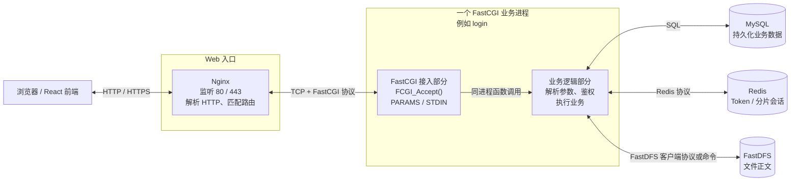

一次请求的协议转换如下：

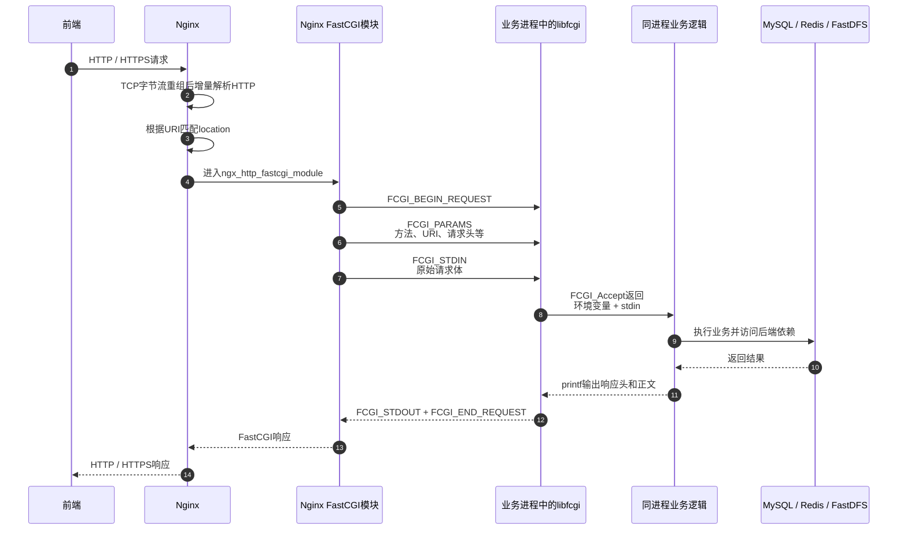

HTTP 转 FastCGI 只是“换协议外壳”，Nginx 不负责解析 JSON 或 multipart 的业务字段：

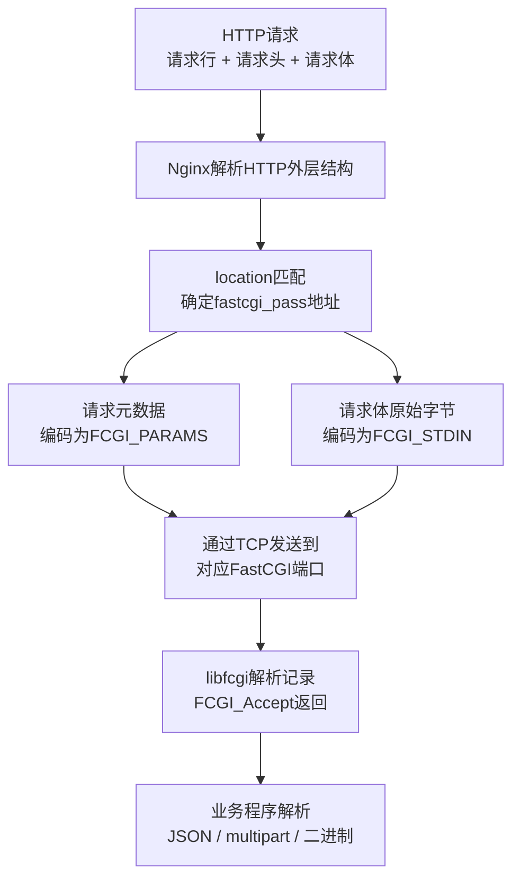

当前 13 条业务路由由 Nginx 直接映射到 13 个单实例 FastCGI 进程：

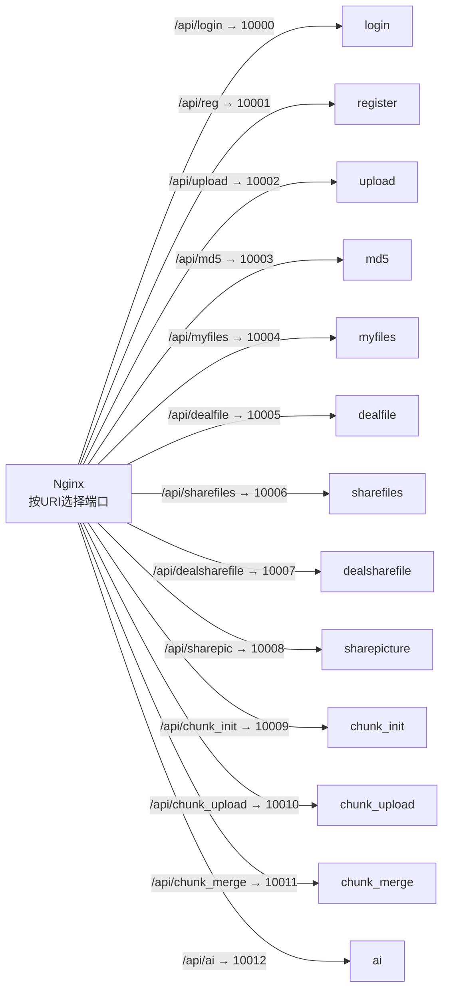

`spawn-fcgi` 只参与启动，不是每次请求的中转层：

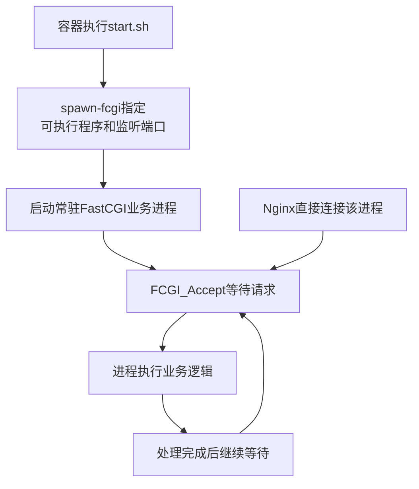

**面试口径：** 前端使用 HTTP/HTTPS 访问 Nginx；Nginx 根据 URI 路由到指定端口，并把 HTTP 元数据封装为 `FCGI_PARAMS`、请求体封装为 `FCGI_STDIN`。业务程序通过 `libfcgi` 接入请求，在同一进程中执行业务，再以 FastCGI 响应返回 Nginx。当前每个模块只有一个常驻进程，没有 FastCGI 多实例池或业务线程池，同一模块基本串行处理请求。

### 9.2 文件数据的存储职责

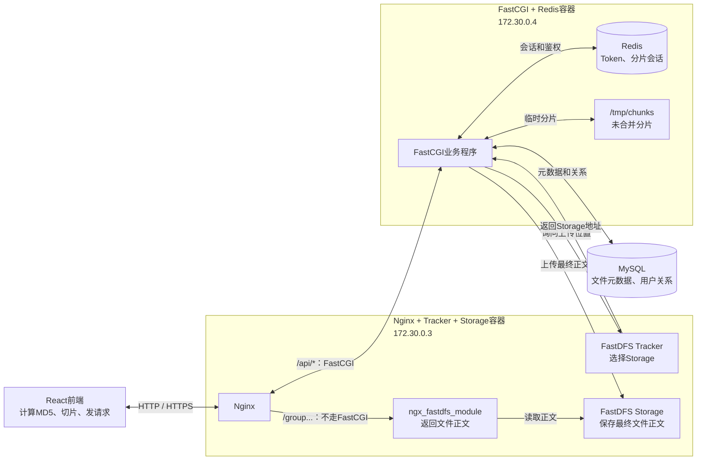

- MySQL 保存 `md5`、`file_id`、URL、大小、类型、引用计数和用户目录关系，不保存文件正文。
- Redis 保存 Token、分片会话和公共分享缓存，不保存最终正文。
- `/tmp/chunks` 暂存未合并分片。
- FastDFS Storage 保存最终文件正文。

### 9.3 秒传预检与上传分流

所有文件先在前端计算完整 MD5，再调用 `/api/md5`：

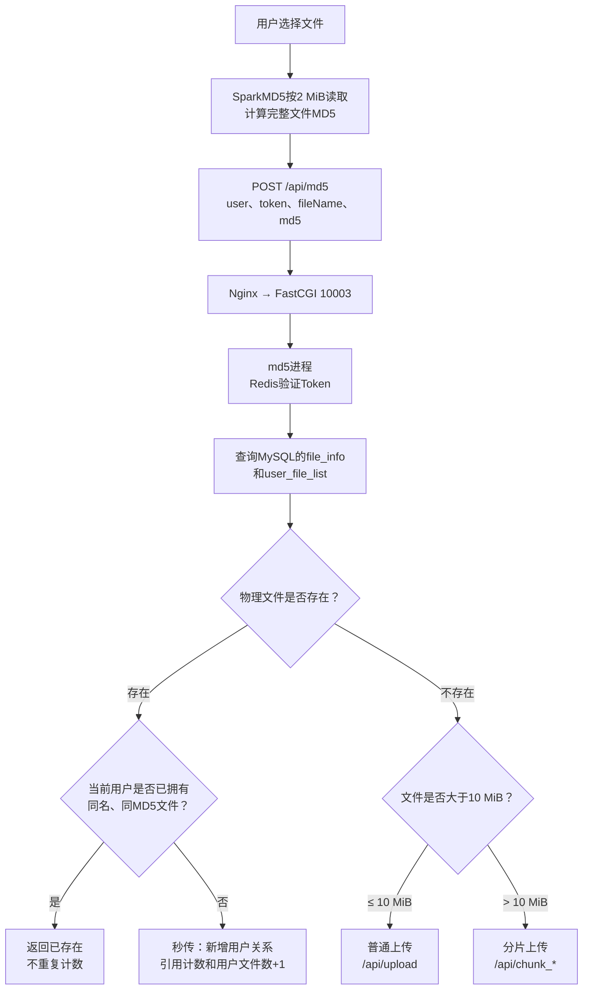

**面试口径：** 用户已拥有则直接返回；物理正文存在但当前用户未拥有时，只新增 `user_file_list` 并增加 `file_info.count`，不传正文；物理文件不存在时才进入普通上传或分片上传。当前秒传依赖客户端 MD5，服务端不复算正文摘要。

### 9.4 普通上传链路

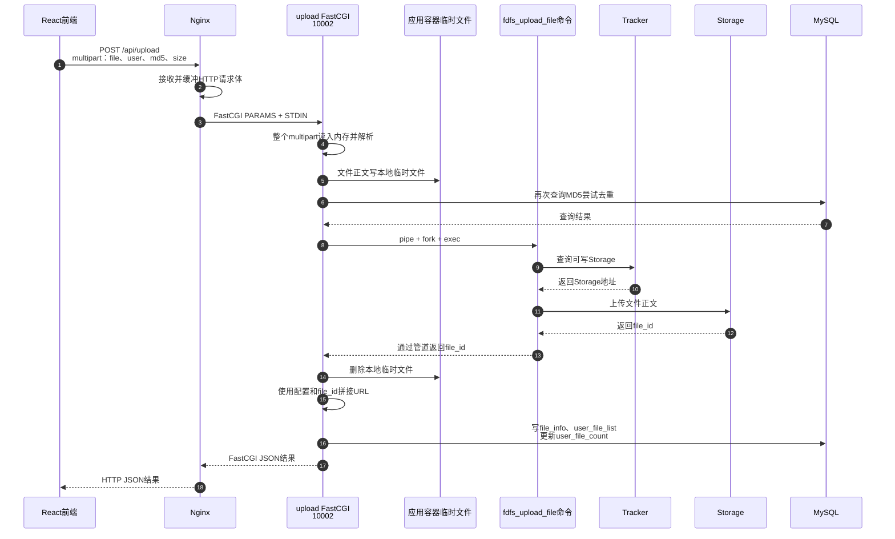

**面试口径：** 不超过 10 MiB 的文件以 multipart 发送给 `upload_cgi`。该程序全量读取请求体并落本地临时文件，再通过 `fork/exec` 调用 `fdfs_upload_file`；Tracker 只选择 Storage，正文最终写入 Storage。成功后保存 `file_id`、URL和用户关系。当前 `/api/upload` 不验 Token、不复算真实 MD5，多表写入也没有事务。

### 9.5 大文件分片、续传与合并

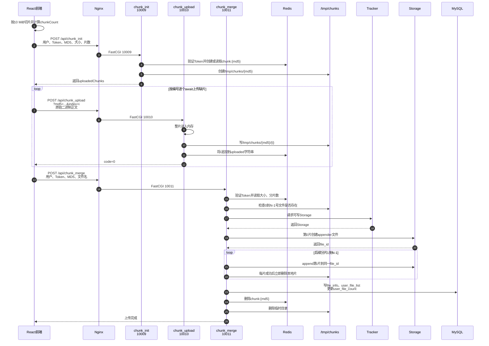

**面试口径：** 大于 10 MiB 的文件每片 10 MiB，前端按编号顺序上传。`chunk_init` 校验 Token，并用 Redis Hash 保存 24 小时会话；`chunk_upload` 把原始分片写入 `/tmp/chunks/{md5}/{index}`；`chunk_merge` 用第一片创建 FastDFS appender 文件，再依次追加后续分片。当前单片上传不验 Token和摘要，合并只检查分片是否存在，失败时可能留下远端半成品。

### 9.6 文件列表与正文下载

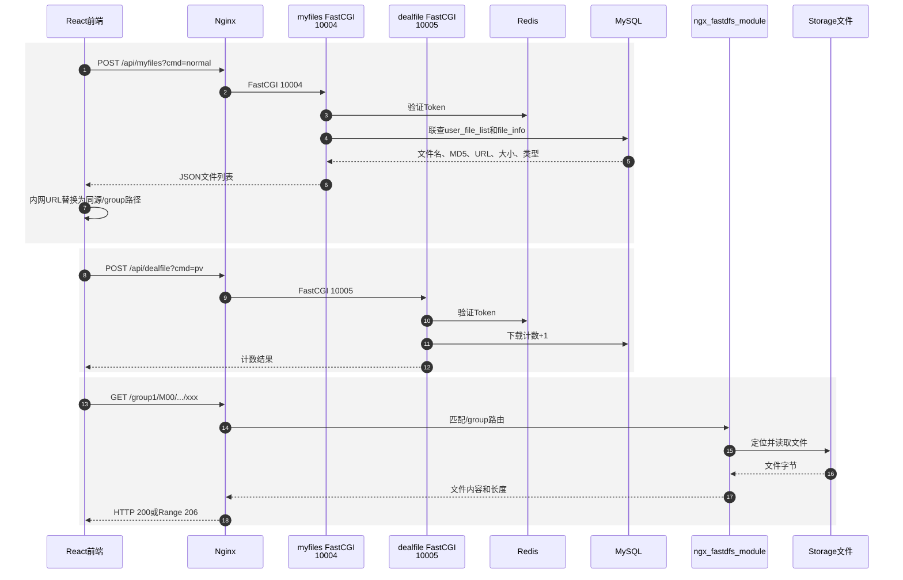

**面试口径：** FastCGI 只参与获取文件信息和更新下载计数；真正的正文请求匹配 Nginx 的 `/group...` 路由，由 `ngx_fastdfs_module` 直接读取 Storage 文件并返回，不经过 FastCGI、MySQL或Redis。计数请求与正文请求相互独立，因此当前 `pv` 只是可绕过、可重复的点击统计，不是下载授权。

### 9.7 `file_id`、URL 与下载路径

`file_id` 是 FastDFS 返回的内部逻辑标识；URL 是项目根据 Web 访问地址拼接出的 HTTP 地址：

```text
file_id = group1/M00/00/00/xxx.mp4

url = http://172.30.0.3:80/
    + file_id
    = http://172.30.0.3:80/group1/M00/00/00/xxx.mp4
```

```mermaid
flowchart LR
    Upload["文件写入Storage"]
    ID["FastDFS返回file_id<br/>group1/M00/.../xxx"]
    Build["FastCGI程序拼接<br/>协议 + Web地址 + file_id"]
    DB["file_info同时保存<br/>file_id和url"]
    List["文件列表API返回url"]
    Replace["前端去掉内网前缀<br/>得到/group..."]
    Nginx["Nginx匹配/group路由"]
    Module["ngx_fastdfs_module"]
    Storage["Storage文件正文"]

    Upload --> ID --> Build --> DB --> List --> Replace --> Nginx --> Module --> Storage
```

- `file_id` 用于 FastDFS 查询、删除和 appender 追加，是更基础的存储标识。
- URL 用于 HTTP 访问，是环境相关的可推导字段；当前前端把 `http://172.30.0.3:80` 替换为空字符串，再按同源路径访问。
- 同时永久保存完整 URL 会与部署地址耦合；合理改进是持久化 `file_id`，在响应时动态生成相对或公共 URL。

### 9.8 普通分享、公共列表、转存与取消分享

普通分享是“发布到公共窗口”，不是指定接收人的点对点授权。分享和转存都不会复制 FastDFS 正文：

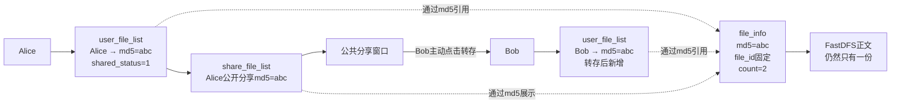

创建分享链路：

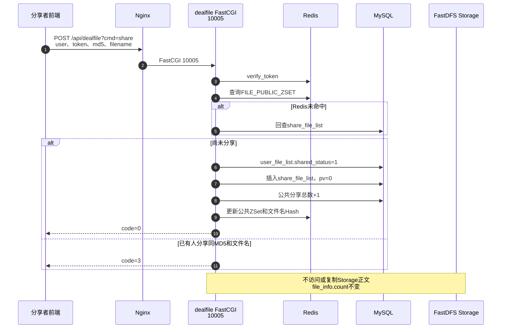

公共列表与转存链路：

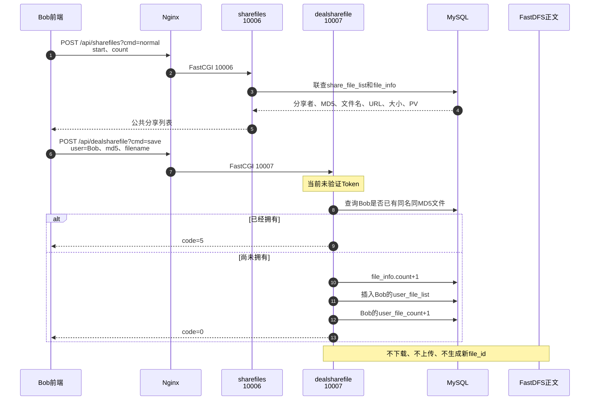

公共分享下载仍分为“计数”和“正文”两条请求：

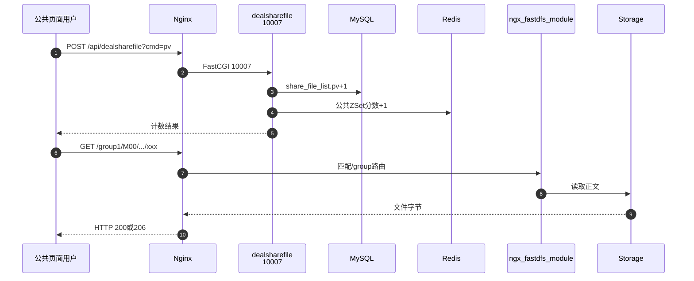

取消分享链路：

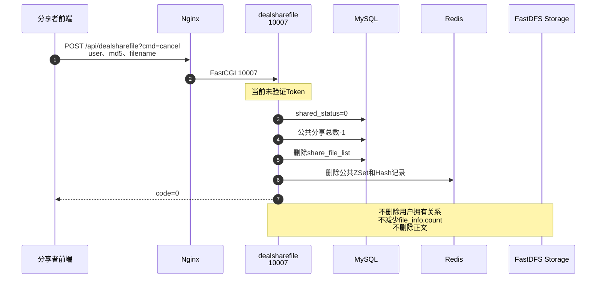

一份正文从上传到最终删除的状态变化：

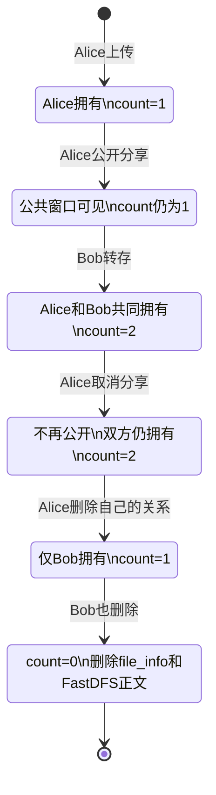

**面试口径：** 分享只把原目录项标记为已分享，并新增 `share_file_list` 和 Redis 公共列表缓存，不增加物理引用计数；转存给目标用户新增 `user_file_list` 并把 `file_info.count` 加一，继续引用同一个 `file_id`；取消分享只移除公开关系，不撤销别人已经完成的转存，也不删除正文。

### 9.9 当前是公共发布，不是点对点分享

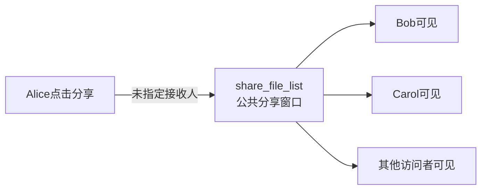

当前请求中没有 `receiver_user`、接收者授权、权限级别、有效期或分享授权表。用户也可以把永久 `/group...` 地址私下发送给别人，但这只是直链传播，不是受系统权限控制的点对点分享。图片分享子系统虽然有 `urlmd5` 和 `key` 字段，但当前前端未完整接入，浏览链路也没有强制校验提取码。

真正的点对点模型应显式记录发送者、接收者与权限：

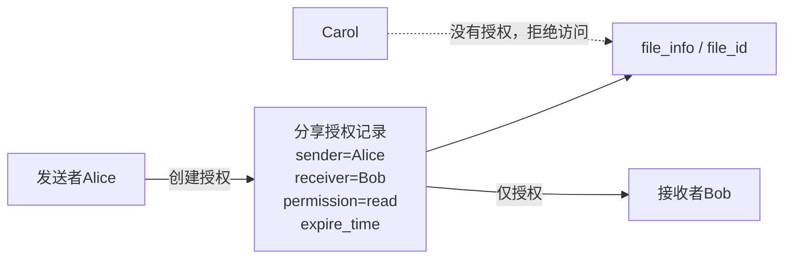

### 9.10 Token 遗漏与真实安全边界

前端页面要求登录不等于后端已经鉴权：

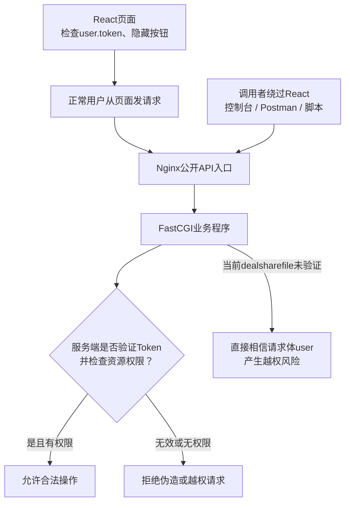

当前鉴权结论：

| 操作 | 当前 Token 状态 | 判断 |
| --- | --- | --- |
| 创建普通分享 `dealfile?cmd=share` | 校验 | 符合预期，但还应检查资源所有权 |
| 查看公共分享列表 `sharefiles?cmd=normal` | 不校验 | 若定义为公共窗口可以接受 |
| 转存 `dealsharefile?cmd=save` | **不校验** | 明确的服务端鉴权遗漏 |
| 取消分享 `dealsharefile?cmd=cancel` | **不校验** | 可伪造分享者，属于越权风险 |
| 公共下载计数 `dealsharefile?cmd=pv` | **不校验** | 可匿名计数，但独立接口可刷、可绕过 |
| 私有/公开正文 `/group...` | **不校验** | 知道永久URL即可直达，未区分私有与公开 |

结合前后端代码，最合理的判断不是“为了避免 Token 过期导致插入失败”，而是开发者把前端登录门禁误当成安全边界，遗漏了直接调用 API 和 `/group...` URL 的路径。Token 过期时拒绝转存、取消等写操作才是正确行为。

合理改进：

1. 转存、取消等写接口必须携带并校验 Token，真实用户应由服务端会话确定，不能信任请求体中的 `user`。
2. 转存前确认分享记录仍有效；取消前确认当前用户就是分享创建者。
3. 多表计数和关系更新使用事务、唯一约束与幂等设计。
4. 下载统一经过授权入口，校验私有拥有关系或公开分享状态，再使用短期签名 URL 或 `X-Accel-Redirect` 让 Nginx 返回正文。
5. 公共下载计数应与真实下载响应关联，而不是依赖前端单独调用可伪造的 `pv` 接口。

### 9.11 一分钟综合回答

> 前端通过 HTTP/HTTPS 访问 Nginx，Nginx 按 URI 把 `/api/*` 请求用 FastCGI 协议交给对应的常驻业务进程。文件上传前先由前端计算完整 MD5并调用 `/api/md5`：用户已拥有则结束，物理文件存在但用户未拥有则只新增引用完成秒传，物理文件不存在才上传正文。小文件经 `upload_cgi` 落临时文件后调用 `fdfs_upload_file`；大文件按 10 MiB 顺序上传到 `/tmp/chunks`，再用 FastDFS appender 合并。MySQL 保存元数据和用户关系，Redis 保存 Token、分片会话和公共分享缓存，Storage 保存最终正文。下载时 FastCGI 只负责查询 URL 和更新计数，正文由 Nginx 的 `ngx_fastdfs_module` 直接从 Storage 返回。普通分享只是发布到公共窗口，转存只给目标用户新增对同一 `file_id` 的引用，不复制正文。当前转存、取消分享和公共计数缺少服务端 Token 校验，`/group...` 永久直链也没有区分私有与公开，这是把前端登录限制误当安全边界造成的鉴权缺口。
