# 网盘项目架构与 HTTP 接口学习文档

> 本文基于《架构和功能分析.pdf》（45 页）和《项目接口文档.pdf》（29 页）整理，并对照 CSDN 文章《云存储项目功能实现以及分析》中的 53 个 C/C++/SQL/命令片段修订。这些代码片段可以直接证实 FastCGI 接入、Redis Token、排行榜重建、FastDFS CLI 调用与引用计数等实现；但它们不是完整仓库，也未包含 Nginx 配置和 DDL，因此仍严格区分“资料明确”“博客代码证据”“综合归纳”和“待完整源码确认”。
>
> 文档中的 IP、Token、MD5、文件 URL 都是历史示例，不应视为仍然可用的线上地址或真实凭证；本文统一使用 `{BASE_URL}` 表示部署地址。

## 0. 阅读约定与结论速览

### 0.1 信息可信度标记

| 标记        | 含义                        | 使用方式                      |
| --------- | ------------------------- | ------------------------- |
| **资料明确**  | 两份 PDF 直接给出的接口、字段、模块名或流程  | 可作为理解原项目的主要依据             |
| **项目实情补充** | 来自项目实际运行或实现情况、但 PDF 未完整说明的信息 | 作为已知实现事实；具体配置参数仍需以源码和配置为准 |
| **博客代码证据** | 博客直接展示的 C/C++、SQL、Redis 或 CLI 片段 | 可证明某一教学版本的实现方式；不自动等于当前仓库或生产实现 |
| **综合归纳**  | 由多页内容拼合得到，资料没有用一句话完整表述    | 可信度较高，但仍应以源码和数据库定义为准      |
| **待源码确认** | 文档互相矛盾、字段缺失，或只能从函数名和流程图推断 | 实现或联调前必须核对源码、配置、DDL 或实际响应 |
| **改进建议**  | 面向现代生产系统的安全性、可靠性和接口设计建议   | 不是对原项目实现的事实描述             |

### 0.2 一句话理解项目

这是一个由 **Nginx 统一接入 HTTP 请求**、通过 **FastCGI** 将请求交给多个 **C/C++ API 处理进程**、以 **MySQL 保存用户与文件元数据**、以 **Redis 保存 Token 和共享排行榜**、以 **FastDFS 保存文件实体** 的网盘/图床后台。

最值得掌握的六条主线：

1. **文件内容与文件关系分离**：FastDFS 保存字节，MySQL 保存“谁拥有哪个文件”等关系。
2. **MD5 秒传与引用计数**：同一物理文件可被多个用户引用，`file_info.count` 记录引用数。
3. **HTTP 与 FastCGI 分层**：客户端和 Nginx 之间使用 HTTP；Nginx 与 C/C++ API 进程之间使用 FastCGI，而不是再次发送 HTTP 请求。
4. **路由复用**：同一个路径借助 `cmd` 分发多个操作，例如 `/api/myfiles?cmd=normal`。
5. **MySQL 与 Redis 分工**：MySQL 偏持久化事实，Redis 偏 Token、共享榜单与快速查询。
6. **跨存储一致性是核心难点**：一次业务可能同时修改 MySQL、Redis 和 FastDFS，失败补偿与并发控制比单个接口本身更难。

### 0.3 建议阅读顺序

```text
先看系统全景
    |
    v
理解五张核心表与引用计数
    |
    v
理解 Token、MD5 秒传、真实上传
    |
    v
理解分享、转存、删除、下载量
    |
    v
最后检查一致性、安全性与文档歧义
```

---

## 1. 系统全景

### 1.1 总体架构

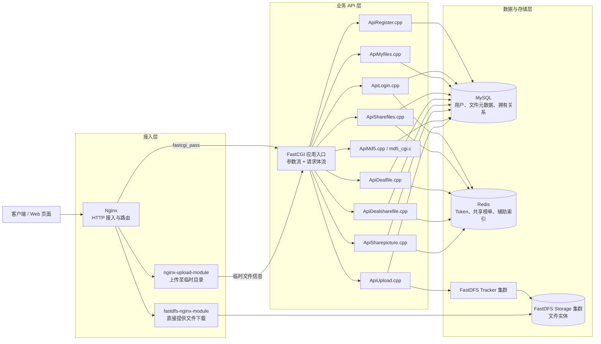
```mermaid
flowchart LR
    Client["客户端 / Web 页面"]

    subgraph Gateway["接入层"]
        Nginx["Nginx\nHTTP 接入与路由"]
        UploadModule["nginx-upload-module\n上传至临时目录"]
        DownloadModule["fastdfs-nginx-module\n直接提供文件下载"]
    end

    subgraph ApiLayer["业务 API 层"]
        FastCGI["FastCGI 应用入口\n参数流 + 请求体流"]
        Register["ApiRegister.cpp"]
        Login["ApiLogin.cpp"]
        Myfiles["ApiMyfiles.cpp"]
        Sharefiles["ApiSharefiles.cpp"]
        Dealfile["ApiDealfile.cpp"]
        Dealsharefile["ApiDealsharefile.cpp"]
        Sharepicture["ApiSharepicture.cpp"]
        Md5["ApiMd5.cpp / md5_cgi.c"]
        Upload["ApiUpload.cpp"]
    end

    subgraph DataLayer["数据与存储层"]
        MySQL[("MySQL\n用户、文件元数据、拥有关系")]
        Redis[("Redis\nToken、共享榜单、辅助索引")]
        Tracker["FastDFS Tracker 集群"]
        Storage[("FastDFS Storage 集群\n文件实体")]
    end

    Client --> Nginx
    Nginx -->|"fastcgi_pass"| FastCGI
    FastCGI --> Register
    FastCGI --> Login
    FastCGI --> Myfiles
    FastCGI --> Sharefiles
    FastCGI --> Dealfile
    FastCGI --> Dealsharefile
    FastCGI --> Sharepicture
    FastCGI --> Md5
    Nginx --> UploadModule
    UploadModule -->|"临时文件信息"| FastCGI
    FastCGI --> Upload
    Nginx --> DownloadModule

    Register --> MySQL
    Login --> MySQL
    Login --> Redis
    Myfiles --> MySQL
    Sharefiles --> MySQL
    Sharefiles --> Redis
    Dealfile --> MySQL
    Dealfile --> Redis
    Dealsharefile --> MySQL
    Dealsharefile --> Redis
    Sharepicture --> MySQL
    Sharepicture --> Redis
    Md5 --> MySQL
    Upload --> MySQL
    Upload --> Tracker --> Storage
    DownloadModule --> Storage
```

这张图表达的是“组件职责和协议边界”，不是精确的进程拓扑。资料中的总图明确展示了 Nginx、各 API 模块、MySQL、Redis、FastDFS Tracker/Storage、上传模块和下载模块；项目实际实现进一步确认普通业务 API 走 FastCGI。当前仍未确认 `fastcgi_pass` 使用 TCP 端口还是 Unix Socket，也未确认进程管理器、进程数量、负载均衡策略和部署机器数。

### 1.2 控制面与数据面

可以把系统分成两条相对独立的通路：

```text
控制面：登录、列表、分享、转存、计数
客户端 --HTTP--> Nginx --FastCGI--> C/C++ API -> MySQL / Redis -> JSON

数据面：上传、下载
上传：客户端 --HTTP--> nginx-upload-module -> 临时文件；Nginx --FastCGI（临时文件路径/参数）--> ApiUpload -> FastDFS
下载：客户端 -> 文件 URL -> fastdfs-nginx-module -> FastDFS Storage
```

分离的好处是：大文件字节流不需要全部穿过普通 JSON API；元数据查询和文件传输可以分别扩容。代价是：上传、删除等操作要同时维护“文件实体”和“元数据”，更容易出现跨系统不一致。

### 1.3 组件职责

| 组件                     | 资料明确的职责                                            | 学习重点                  |
| ---------------------- | -------------------------------------------------- | --------------------- |
| 客户端                    | 注册、登录、计算 MD5、上传/下载文件、成功下载后上报 `pv`                  | 请求顺序、Token 保存、分页、失败重试 |
| Nginx                  | 对外接收 HTTP；根据 `/api/...` 路由，通过 `fastcgi_pass` 把普通业务请求交给后端 | HTTP/FastCGI 边界、路由、参数映射、上传和下载模块 |
| FastCGI                | 在 Nginx 与 C/C++ API 进程之间传递请求参数、请求体和响应内容             | `fastcgi_params`、标准输入/输出映射、常驻进程生命周期 |
| `nginx-upload-module`  | 先把上传内容写入临时目录，再通知 `/api/upload` 后端                  | 大文件流式接收、临时文件生命周期      |
| C/C++ API 模块           | 作为 FastCGI 应用接收请求，解析路径和 `cmd`、读取请求体、校验 Token、执行业务并编码 JSON | Accept 循环、处理器模板、错误码、资源管理、细粒度日志 |
| MySQL                  | 保存用户、物理文件信息、个人文件关系、共享文件关系及计数                       | 表关系、事务、索引、引用计数不变量     |
| Redis                  | 保存带过期时间的 Token、共享排行榜、文件名辅助映射等                      | TTL、有序集合、缓存与数据库一致性    |
| FastDFS Tracker        | 为上传选择 Storage，提供定位服务                               | Tracker 无文件实体、避免单点    |
| FastDFS Storage        | 保存文件实体，在组内同步                                       | Group、复制、容量与故障恢复      |
| `fastdfs-nginx-module` | 根据 FastDFS 路径直接提供下载                                | 下载链路、鉴权绕过风险、缓存策略      |

### 1.4 API 模块与路由映射

| 路由族                  | 处理模块                             | 主要 `cmd` 或动作                       | 主要依赖               |
| -------------------- | -------------------------------- | ---------------------------------- | ------------------ |
| `/api/reg`           | `ApiRegister.cpp`                | 注册                                 | MySQL              |
| `/api/login`         | `ApiLogin.cpp`                   | 登录、签发 Token                        | MySQL、Redis        |
| `/api/myfiles`       | `ApiMyfiles.cpp`                 | `count`、`normal`、`pvasc`、`pvdesc`  | MySQL、Redis Token  |
| `/api/sharefiles`    | `ApiSharefiles.cpp`              | `count`、`normal`、`pvdesc`          | MySQL、Redis 排行榜    |
| `/api/dealfile`      | `ApiDealfile.cpp`                | `share`、`del`、`pv`                 | MySQL、Redis        |
| `/api/dealsharefile` | `ApiDealsharefile.cpp`           | `cancel`、`save`、`pv`               | MySQL、Redis        |
| `/api/sharepic`      | `ApiSharepicture.cpp`            | `share`、`browse`、`normal`、`cancel` | MySQL、Redis、文件 URL |
| `/api/md5`           | `ApiMd5.cpp`；资料标题也出现 `md5_cgi.c` | 秒传判断                               | MySQL、Redis Token  |
| `/api/upload`        | `ApiUpload.cpp`                  | 真实上传                               | 临时目录、FastDFS、MySQL |

> **项目实情补充 + 待源码确认**：普通业务 API 已确认使用 FastCGI。资料在部分位置同时使用 `ApiMd5.cpp` 与 `md5_cgi.c`，也同时出现 `ApiSharepicture.cpp` 与 `sharepicture_cgi.c`；文件名中的 `_cgi` 不代表它一定采用“每个请求启动一个进程”的传统 CGI，FastCGI 程序也常沿用该命名。具体源码文件名和版本关系仍需核对。

---

## 2. 请求处理的共同骨架

### 2.1 典型处理流水线

架构文档中的多张流程图反复出现相同结构，可以归纳为：

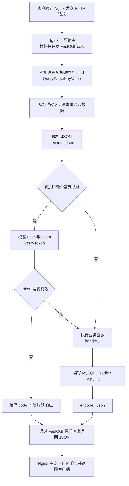
```mermaid
flowchart TD
    A["客户端向 Nginx 发送 HTTP 请求"] --> A2["Nginx 匹配路由\n封装并转发 FastCGI 请求"]
    A2 --> B["API 进程解析路径与 cmd\nQueryParseKeyValue"]
    B --> C["从标准输入 / 请求体读取数据"]
    C --> D["解析 JSON\ndecode...Json"]
    D --> E{"该接口是否需要认证"}
    E -- "是" --> F["校验 user 与 token\nVerifyToken"]
    F --> G{"Token 是否有效"}
    G -- "否" --> H["编码 code=4 等错误响应"]
    G -- "是" --> I["执行业务函数\nhandle..."]
    E -- "否" --> I
    I --> J["读写 MySQL / Redis / FastDFS"]
    J --> K["encode...Json"]
    H --> L["通过 FastCGI 标准输出返回 JSON"]
    K --> L
    L --> M["Nginx 生成 HTTP 响应并返回客户端"]
```

项目实际使用 FastCGI。`fread(buf, 1, len, stdin)` 与 `QueryParseKeyValue` 也符合这一处理方式：Nginx 把请求元数据映射为 FastCGI 参数，把请求体送入 FastCGI 标准输入；应用从参数和输入流取得查询串、方法、长度与 JSON 数据，再通过 FastCGI 标准输出返回响应。这里的 `stdin/stdout` 是 FastCGI 库为当前请求提供的流抽象，不等于 Nginx 为每次请求启动一个新进程。

**博客代码证据**：注册入口直接展示 `while (FCGI_Accept() >= 0)` 常驻接受循环，通过 `getenv("CONTENT_LENGTH")` 读取请求体长度，再用 `fread(..., stdin)` 读体，并先输出 `Content-type: text/html\r\n\r\n`。这使“普通 API 为 FastCGI 常驻程序”从架构推断升级为有代码片段支持的结论。不过片段未展示长度上限、短读循环、超时和每次请求的资源清理，不应直接照搬。

### 2.2 HTTP 与 FastCGI 的协议边界

| 边界 | 使用的协议/接口 | 主要承载内容 |
|---|---|---|
| 客户端 -> Nginx | HTTP/1.1（历史示例为明文 HTTP） | 方法、URL、Header、Body |
| Nginx -> C/C++ API | FastCGI | `REQUEST_METHOD`、`QUERY_STRING`、`CONTENT_LENGTH` 等参数，请求体流和响应流 |
| API -> MySQL / Redis / FastDFS | 各组件的客户端协议或 SDK | 业务数据、缓存状态、文件操作 |

因此，`fastcgi_pass` 不能写成 `proxy_pass` 后就视为等价：`proxy_pass` 的上游会收到 HTTP 请求，FastCGI 后端收到的是 FastCGI 记录及参数。源码审阅时应重点寻找 FastCGI Accept 循环，以及 Nginx 中的 `fastcgi_pass`、`include fastcgi_params`/`fastcgi.conf` 和自定义 `fastcgi_param`。FastCGI 服务究竟由何种进程管理器拉起、监听 TCP 还是 Unix Socket、每个进程处理多少并发，仍属于待配置确认项。

### 2.3 处理器函数名线索

以下名称直接来自流程图，适合用来反推源码阅读顺序：

| 模块     | 资料中出现的函数/步骤                                                                                                                 | 可推断职责                   |
| ------ | --------------------------------------------------------------------------------------------------------------------------- | ----------------------- |
| 注册     | `ApiRegisterUser`、`decodeRegisterJson`、`registerUser`、`encodeRegisterJson`                                                  | 接收注册请求、解析字段、写用户表、编码状态码  |
| 登录     | `decodeLoginJson`、`verifyUserPassword`、`setToken`、`encodeLoginJson`                                                         | 校验账号密码、生成并写入 Token      |
| 我的文件   | `decodeCountJson`、`VerifyToken`、`handleUserFilesCount`、`getUserFilesCount`、`decodeFilesListJson`、`getUserFileList`          | 数量与分页列表查询               |
| 秒传     | `decodeMd5Json`、`handleDealMd5`                                                                                             | 检查物理文件和用户拥有关系，维护引用计数    |
| 上传     | `rename`、`uploadFileToFastDfs`、`getFullUrlByFileid`、`storeFileinfo`、`unlink`                                                | 处理临时文件、上传 FastDFS、入库、清理 |
| 共享列表   | `handleGetShareFilesCount`、`get_fileslist_json_info`、`handleGetShareFilelist`、`handleGetRankingFilelist`                    | 共享数量、普通列表和下载榜           |
| 个人文件操作 | `decodeDealfileJson`、`handleShareFile`、`handleDeleteFile`、`handlePvFile`                                                    | 分享、删除、个人下载量             |
| 共享文件操作 | `decodeDealsharefileJson`、`handleCancelShareFile`、`handleSaveFile`、`handlePvFile`                                           | 取消分享、转存、共享下载量           |
| 图片分享   | `decodeSharePictureJson`、`handleSharePicture`、`handleBrowsePicture`、`handleGetSharePicturesList`、`handleCancelSharePicture` | 生成分享标识、浏览、列表、取消         |

### 2.4 无源码时应重点追踪的边界

如果后续拿到源码，应优先搜索并回答：

1. Nginx 的 `fastcgi_pass` 指向哪个 TCP 地址或 Unix Socket，API 进程由谁拉起和守护？
2. 路由如何映射到各 FastCGI 可执行程序或处理器，Accept 循环如何退出和恢复？
3. `cmd` 未提供或未知时返回什么？
4. 请求体长度从哪个 FastCGI 参数取得，Nginx 与应用是否都限制最大值？
5. JSON 字段缺失、类型错误、超长时是否统一报错？
6. Token 是 `user -> token`、`token -> user`，还是二者都存？
7. 数据库连接是否池化，事务边界在哪里？
8. MySQL 成功、Redis 失败时是否补偿或重试？
9. FastDFS 上传成功、MySQL 入库失败时是否删除孤儿文件？
10. 每条日志是否包含 Nginx 请求 ID、FastCGI 进程标识、用户、接口、阶段、耗时和错误码，同时避免记录密码、Token 全文？

---

## 3. 数据模型与核心不变量

### 3.1 五张核心表

架构文档明确列出以下五张表及重点字段。

| 表                 | 关键字段                                          | 作用                                               | 典型写入时机                 |
| ----------------- | --------------------------------------------- | ------------------------------------------------ | ---------------------- |
| `user_info`       | `user_name`、`password`                        | 用户身份信息；用户名唯一，资料称密码保存为 MD5                        | 注册                     |
| `file_info`       | `md5`、`file_id`、`url`、`size`、`type`、`count` | 一份物理文件的全局记录；`file_id` 对应 FastDFS 路径，`count` 为引用数 | 新文件上传；秒传/转存时增加引用；删除时减少 |
| `user_file_list`  | `user`、`md5`、`create_time`、`file_name`、`shared_status`、`pv` | 用户拥有的文件清单；通过 `md5` 找到 `file_info`                | 上传、秒传、转存、分享状态变化、个人下载计数 |
| `user_file_count` | `user`、`count`                                | 每个用户拥有的文件数量                                      | 上传、秒传、转存、删除            |
| `share_file_list` | `user`、`md5`、`file_name`、`pv`                 | 公共共享文件清单                                         | 分享、取消分享、删除、共享下载计数      |

注册接口还接收 `email`、`nickName`、`phone`，说明 `user_info` 很可能还有相应列，但架构文档没有给出完整 DDL，字段名和约束需要待源码或数据库确认。

**博客代码证据**：表注释补齐了 `file_info.size/type` 和 `user_file_list.create_time`，并明确 `count` 默认为 1、`shared_status` 为 0/1、`pv` 默认为 0。这些是字段语义证据，不是完整 DDL；主键、唯一索引、默认约束是否真正在数据库层声明仍需确认。

### 3.2 关系图

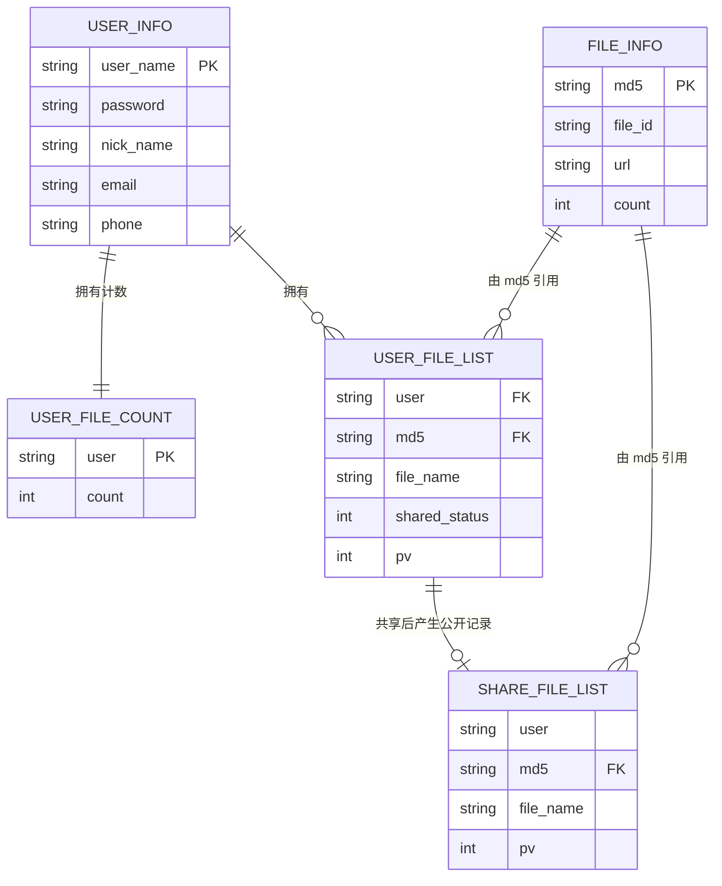
```mermaid
erDiagram
    USER_INFO ||--|| USER_FILE_COUNT : "拥有计数"
    USER_INFO ||--o{ USER_FILE_LIST : "拥有"
    FILE_INFO ||--o{ USER_FILE_LIST : "由 md5 引用"
    FILE_INFO ||--o{ SHARE_FILE_LIST : "由 md5 引用"
    USER_FILE_LIST ||--o| SHARE_FILE_LIST : "共享后产生公开记录"

    USER_INFO {
        string user_name PK
        string password
        string nick_name
        string email
        string phone
    }
    FILE_INFO {
        string md5 PK
        string file_id
        string url
        int count
    }
    USER_FILE_LIST {
        string user FK
        string md5 FK
        string file_name
        int shared_status
        int pv
    }
    USER_FILE_COUNT {
        string user PK
        int count
    }
    SHARE_FILE_LIST {
        string user
        string md5 FK
        string file_name
        int pv
    }
```

> **综合归纳**：`USER_FILE_LIST` 与 `SHARE_FILE_LIST` 的对应关系应由 `(user, md5, file_name)` 一类复合键建立，资料只给出业务字段，没有给出主键、唯一索引和外键。图中的 PK/FK 是概念关系，不代表原库一定声明了数据库外键。

### 3.3 必须长期成立的不变量

把计数当作缓存字段时，最重要的是明确它们与事实记录的关系：

1. `file_info.count = 引用该 md5 的 user_file_list 记录数`。
2. `user_file_count.count = 该 user 在 user_file_list 中的记录数`。
3. `user_file_list.shared_status = 1` 时，应能找到相应共享记录或等价的公开索引。
4. 共享榜单中的成员应能映射到有效的共享文件，不能指向已经删除的记录。
5. 当 `file_info.count > 0` 时，FastDFS 中的文件实体必须仍然存在。
6. 只有当最后一个引用被删除，才有资格删除 FastDFS 文件实体和 `file_info` 记录。

这些不变量需要事务、唯一约束和并发控制共同保证。只在应用层执行“先查再改”，会在并发秒传、转存或删除时产生竞态。

### 3.4 Redis 数据结构

资料明确或流程图中出现的 Redis 用途如下：

| 名称/用途 | 可能的数据结构 | 资料给出的语义 | 待确认点 |
|---|---|---|---|
| 登录 Token | String | 代码调用 `SETEX key seconds value`，一次性写入 Token 并设 TTL | `key` 是否就是用户名、TTL 时长、续期策略 |
| `FILE_PUBLIC_ZSET` | Sorted Set | 公共文件排行榜；成员标识为 `md5 + filename`，分数应为 `pv` | 拼接分隔符、碰撞处理、是否包含 user |
| `FILE_NAME_HASH` | Hash | 保存文件标识与文件名的映射 | Field 和 Value 的精确定义 |
| 共享文件数量 | String/Hash | 文档出现形如 `xxx_share_xxx_file_xxx_list_xxx_count_xxx` 的特殊用户/Key | 这是宏、常量值还是实际 Key |

Redis 在这里既承担认证状态，也承担派生索引。认证状态丢失会让用户掉线；派生索引丢失理论上可由 MySQL 重建。两类数据应采用不同的恢复、持久化和监控策略。

**博客代码证据**：获取下载榜时，教学版本用 `ZCARD FILE_PUBLIC_ZSET` 与 MySQL 中的共享总数比较；数量不一致就删除 `FILE_PUBLIC_ZSET` 和 `FILE_NAME_HASH`，再从 `share_file_list` 全量 `ZADD/HSET` 重建。这证实了“MySQL 为事实源、Redis 为派生索引”的思路，但“数量相等”不能证明成员和分数正确，且先 `DEL` 再重建会暴露空榜窗口。更稳妥的做法是在新 Key 中重建、校验后原子切换。

### 3.5 FastDFS 中的标识

需要区分三个容易混淆的概念：

| 名称 | 示例形态 | 含义 |
|---|---|---|
| `md5` | `a89390d8...` | 文件内容摘要，用于去重和关联元数据 |
| `file_id` | `group1/M00/00/00/xxx.png` | FastDFS 返回的逻辑文件路径 |
| `url` | `http://host/group1/M00/00/00/xxx.png` | 在 `file_id` 前拼接下载域名/地址形成的完整访问 URL |

`md5` 不是 FastDFS 路径，`file_id` 也不是数据库主键的必然形式。后端上传成功后先得到 `file_id`，再通过类似 `getFullUrlByFileid` 的步骤形成完整 URL，最后写入 `file_info`。

**博客代码证据**：教学版本并非始终通过 FastDFS SDK 直连调用，而是 `fork + pipe + dup2 + execlp` 执行 `fdfs_upload_file <client.conf> <local-file>`，从子进程标准输出取得 `file_id`；随后执行 `fdfs_file_info <client.conf> <file_id>` 解析 `host_name` 并拼 URL。这种 CLI 包装法容易学习，但必须检查 `fork/exec/read/wait` 所有返回值、限制输出长度，且绝不能把用户输入拼成 shell 命令。

---

## 4. HTTP API 契约总览

### 4.1 基础地址不是接口契约的一部分

两份资料使用了不同的示例地址：

- 接口文档主要使用 `http://42.194.128.13`。
- 架构分析主要使用 `http://114.215.169.66`。
- 返回示例中还出现 `172.16.0.15` 私网下载地址。

这说明资料来自不同部署阶段或环境。学习时只保留路径，将调用形式写为：

```text
{BASE_URL}/api/...
```

真实项目应通过配置注入域名、协议和端口，不能把示例 IP 写死在客户端或服务端代码中。

### 4.2 共通规则

1. HTTP 版本均标为 1.1。
2. 除共享文件数量查询外，大多数业务接口使用 `POST`。
3. 普通接口主要传 `application/json`。
4. 分页统一使用 `start` 和 `count`：`start` 是起始偏移，`count` 是本次期望条数。
5. 列表响应中的 `count` 是本页实际返回数，`total` 是满足条件的总数；当 `count = 0` 时不应继续解析 `files`。
6. 受保护接口把 `token` 和 `user` 放在 JSON 请求体中，而不是标准 `Authorization` 请求头。
7. 文档主要通过 JSON 内的 `code` 表示业务结果，没有说明 HTTP 状态码的使用规则。

### 4.3 全量接口目录

以下共 21 个实际操作，是把两份资料中的路径与 `cmd` 展开后得到的结果。

| 分组 | 方法与路径 | 文档中的认证要求 | 关键请求字段 | 关键响应字段 |
|---|---|---|---|---|
| 用户 | `POST /api/reg` | 无 Token | `email?`、`firstPwd`、`nickName`、`phone?`、`userName` | `code` |
| 用户 | `POST /api/login` | 用户名密码 | `user`、`pwd` | `code`、`token` |
| 我的文件 | `POST /api/myfiles?cmd=count` | `user + token` | `user`、`token` | `code`、`total` |
| 我的文件 | `POST /api/myfiles?cmd=normal` | `user + token` | `user`、`token`、`start`、`count` | `code`、`count`、`total`、`files` |
| 我的文件 | `POST /api/myfiles?cmd=pvasc` | `user + token` | 同 `normal` | 同 `normal`，按 `pv ASC` |
| 我的文件 | `POST /api/myfiles?cmd=pvdesc` | `user + token` | 同 `normal` | 同 `normal`，按 `pv DESC` |
| 公共共享 | `GET /api/sharefiles?cmd=count` | 无；资料明确称公共请求 | 无 | `code`、`total` |
| 公共共享 | `POST /api/sharefiles?cmd=normal` | 无 | `start`、`count` | `code`、`count`、`total`、`files` |
| 公共共享 | `POST /api/sharefiles?cmd=pvdesc` | 无 | `start`、`count` | `code`、`count`、`total`、`files[{filename,pv}]` |
| 个人文件操作 | `POST /api/dealfile?cmd=share` | `user + token` | `user`、`token`、`md5`、`filename` | `code` |
| 个人文件操作 | `POST /api/dealfile?cmd=del` | `user + token` | `user`、`token`、`md5`、`filename` | `code` |
| 个人文件操作 | `POST /api/dealfile?cmd=pv` | `user + token` | `user`、`token`、`md5`、`filename` | `code` |
| 共享文件操作 | `POST /api/dealsharefile?cmd=cancel` | 文档未提供 Token，流程图明确“暂且不做 token 认证” | `user`、`md5`、`filename` | `code` |
| 共享文件操作 | `POST /api/dealsharefile?cmd=save` | 文档未提供 Token | `user`、`md5`、`filename` | `code` |
| 共享文件操作 | `POST /api/dealsharefile?cmd=pv` | 文档未提供 Token | `user`、`md5`、`filename` | `code` |
| 上传 | `POST /api/md5` | `user + token` | `user`、`token`、`md5`、`filename` | `code` |
| 上传 | `POST /api/upload` | Token 位置不清晰 | 文件内容及 `user`、`filename`、`md5`、`size` 等元数据 | `code` |
| 图片分享 | `POST /api/sharepic?cmd=share` | `user + token` | `user`、`token`、`md5`、`filename` | `code`、`urlmd5` |
| 图片分享 | `POST /api/sharepic?cmd=browse` | 无 | `urlmd5` | `code`、`url`、`user`、`time`、`pv` |
| 图片分享 | `POST /api/sharepic?cmd=normal` | `user + token` | `user`、`token`、`start`、`count` | `code`、`count`、`total`、`files` |
| 图片分享 | `POST /api/sharepic?cmd=cancel` | 两份资料矛盾 | `urlmd5`，接口文档还要求 `user + token` | `code` |

`?` 表示可选字段。注册接口明确把 `email`、`phone` 标为可选，其余注册字段为必填。

### 4.4 `code` 不是全局统一枚举

| `code` | 出现位置 | 语义 |
|---:|---|---|
| `0` | 几乎所有接口 | 成功；在 `/api/md5` 中特指“秒传成功” |
| `1` | 几乎所有接口 | 一般失败；在 `/api/md5` 中更像“秒传未命中，需要继续真实上传” |
| `2` | 注册 | 用户已存在 |
| `2` | 图片浏览 | 文件已经被删除 |
| `3` | 分享个人文件 | 已经有人分享该文件 |
| `4` | 多个受保护接口 | Token 校验失败 |
| `5` | `/api/md5` | 当前用户的文件列表中已存在该文件 |
| `5` | 转存共享文件 | 目标用户已存在该文件 |

因此客户端必须按“接口 + `code`”解释响应，不能只维护一个全局 `code -> 文案` 字典。更稳妥的设计是统一错误结构，例如 `code`、`message`、`requestId`、`details`，并同时使用合适的 HTTP 状态码。

### 4.5 通用文件对象

`myfiles` 与公共共享列表返回的文件对象大致如下：

| 字段 | 含义 | 备注 |
|---|---|---|
| `user` | 文件所属/分享用户 | 公共列表中是分享者 |
| `md5` | 文件内容 MD5 | 关联 `file_info` |
| `create_time` | 创建或上传时间 | 文档也曾写成 `time` |
| `file_name` | 文件名 | 请求字段通常写作 `filename`，命名不一致 |
| `share_status` | 是否共享 | `0` 未共享，`1` 已共享；文档也出现 `shared_status` |
| `pv` | 下载量 | 个人列表与共享列表分别维护不同 `pv` |
| `url` | 完整下载 URL | 指向 FastDFS 文件 |
| `size` | 文件字节数 | 示例为整数 |
| `type` | 文件类型/扩展名 | 示例出现 `dll`、`png`、`h` 和字符串 `null` |

规范化示例：

```json
{
  "code": 0,
  "count": 1,
  "total": 2,
  "files": [
    {
      "user": "demo",
      "md5": "a89390d867d5da18c8b1a95908d7c653",
      "create_time": "2021-05-15 11:31:00",
      "file_name": "example.png",
      "share_status": 0,
      "pv": 1,
      "url": "{FILE_BASE_URL}/group1/M00/00/00/example.png",
      "size": 44475,
      "type": "png"
    }
  ]
}
```

### 4.6 图片分享对象

`/api/sharepic?cmd=normal` 返回的 `files` 元素包含：

| 字段 | 含义 |
|---|---|
| `user` | 分享者 |
| `filemd5` | 原文件 MD5；文档注释称前端可不显示 |
| `file_name` | 文件名 |
| `urlmd5` | 图片分享标识，用于访问和取消分享 |
| `pv` | 浏览次数 |
| `create_time` | 分享时间 |
| `size` | 文件大小 |

图片浏览接口不直接返回文件内容，而是根据 `urlmd5` 返回真实下载 `url` 和展示信息。Web 页面再使用这个 URL 加载图片。

### 4.7 分页语义

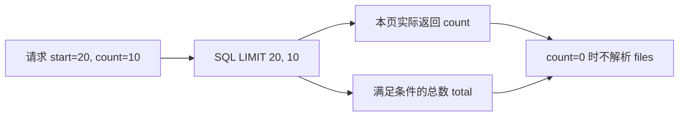
```mermaid
flowchart LR
    Request["请求 start=20, count=10"] --> Query["SQL LIMIT 20, 10"]
    Query --> Page["本页实际返回 count"]
    Query --> Total["满足条件的总数 total"]
    Page --> Client["count=0 时不解析 files"]
    Total --> Client
```

建议对 `start`、`count` 做以下校验：

- `start >= 0`；
- `1 <= count <= 服务端上限`；
- 排序字段固定白名单，不能直接拼接客户端输入；
- 大数据量时用稳定的次级排序键，或改用游标分页，避免相同 `pv` 导致翻页重复/遗漏。

---

## 5. 文档中的矛盾、笔误与联调陷阱

这部分非常重要：原 PDF 更适合“理解项目”，不应原样当作可自动生成 SDK 的严格 OpenAPI 契约。

### 5.1 路径和示例错误

1. **主机地址不一致**：接口文档使用 `42.194.128.13`，架构文档使用 `114.215.169.66`。
2. **标题中的查询串写法有误**：架构文档多处标题写成 `/api/myfiles&cmd=...`，实际示例和 HTTP 语法应为 `/api/myfiles?cmd=...`。
3. **分享文件的调用示例写错路径**：`/api/dealfile?cmd=share` 章节的示例却调用了 `cmd=pv`。应以章节 URL 和流程图中的 `cmd=share` 为准，源码仍需确认。
4. **总架构图中路径换行或单复数不稳定**：例如共享列表路径被换行显示，不能据此推断真实路由拼写。

### 5.2 字段命名不一致

| 语义 | 文档中出现的写法 | 建议统一写法 |
|---|---|---|
| 文件名请求字段 | `filename`、`fileName` | `filename` 或统一为 `file_name` |
| 文件名响应字段 | `file_name`、个别说明写 `filename` | `file_name` |
| 共享状态 | `share_status`、`shared_status` | `share_status` |
| 分页返回数 | `count`、表格中误写 `cout` | `count` |
| 时间 | `create_time`、`time` | 根据业务区分 `created_at` / `shared_at` |
| 文件 MD5 | `md5`、图片列表中的 `filemd5` | 明确区分 `file_md5` 与 `share_key` |
| 注册用户名 | `userName` | 若其他接口均为 `user`，应统一命名策略 |
| 注册密码 | `firstPwd` | 与登录的 `pwd` 语义不统一 |

### 5.3 示例 JSON 并非全部合法

PDF 中存在以下格式问题：

- 使用中文弯引号 `“code”` 或中文冒号；
- 在 JSON 内加入 `//` 注释；
- 尾随逗号；
- 图片列表中 `urlmd5` 后缺逗号；
- 缩进造成字段看似嵌套但实际应处于同一层；
- 示例中的长 URL 因分页自动换行并插入连字符。

联调时必须先把示例规范化为合法 JSON，不能直接复制进测试工具。

### 5.4 认证要求互相矛盾

- `/api/dealsharefile` 的取消、转存、更新下载量都没有 Token 参数；流程图甚至明确写“这里暂且不做 token 认证”。如果客户端可自行提交 `user`，就可能冒充任意用户操作。
- 图片取消分享在接口文档中要求 `token + user + urlmd5`，但架构文档的表格和流程图只显示 `user + urlmd5`。
- 上传接口的参数表写了 `token`，但示例将 `user`、`filename`、`md5`、`size` 放在类似 multipart 的头部，未清楚展示 Token 放在哪里。

这些不是小笔误，而是授权边界问题。拿到源码后应把它们列为第一批审计项。

### 5.5 上传协议描述不自洽

文档把 `/api/upload` 的 `Content-Type` 写为 `application/octet-stream`，示例却使用了带 Boundary 和 `Content-Disposition` 的 multipart 风格内容。两种协议的服务端解析方式完全不同：

- 纯 `application/octet-stream` 通常把整个请求体视为文件字节，元数据放请求头或查询参数；
- `multipart/form-data; boundary=...` 才会用 Boundary 分隔表单字段和文件。

现有资料实际展示了两套上传路径：

1. PDF 架构路径：`nginx-upload-module` 先落临时文件，后端接收模块重写后的文件路径和元数据。
2. 博客代码路径：FastCGI 进程按 `CONTENT_LENGTH` 把请求体读入内存，用 `strstr/strncpy` 手工查找 Boundary、`filename`、`md5`、`size` 和文件起止位置，再写入本地文件。

两者可能对应不同实现版本，不能合并成一条唯一事实。实际契约必须核对 Nginx 配置与对应版本的 `ApiUpload`。博客的手写解析还存在明显风险：整体读入会放大内存占用，`strstr` 不适合在任意二进制内容上定位边界，字段缺失时的空指针和越界也未被完整处理。

### 5.6 处理原则

在尚未直接核对源码和部署配置前，本文采用以下统一口径：

1. 路径以章节标题、请求 URL、流程图三者多数一致的形式为准。
2. 字段以接口表格为主，示例用于补充，不把非法 JSON 写法当成契约。
3. 把文档明确缺少 Token 的接口视为“高风险待确认”，不擅自假设后台一定补做了认证。
4. 把 `code=1` 解释为接口局部语义，尤其不能把 `/api/md5` 的未命中当成整个上传流程失败。
5. 所有示例地址、Token 和文件 URL 仅用于理解，不发起真实请求。

---

## 6. 注册、登录与 Token

### 6.1 注册流程

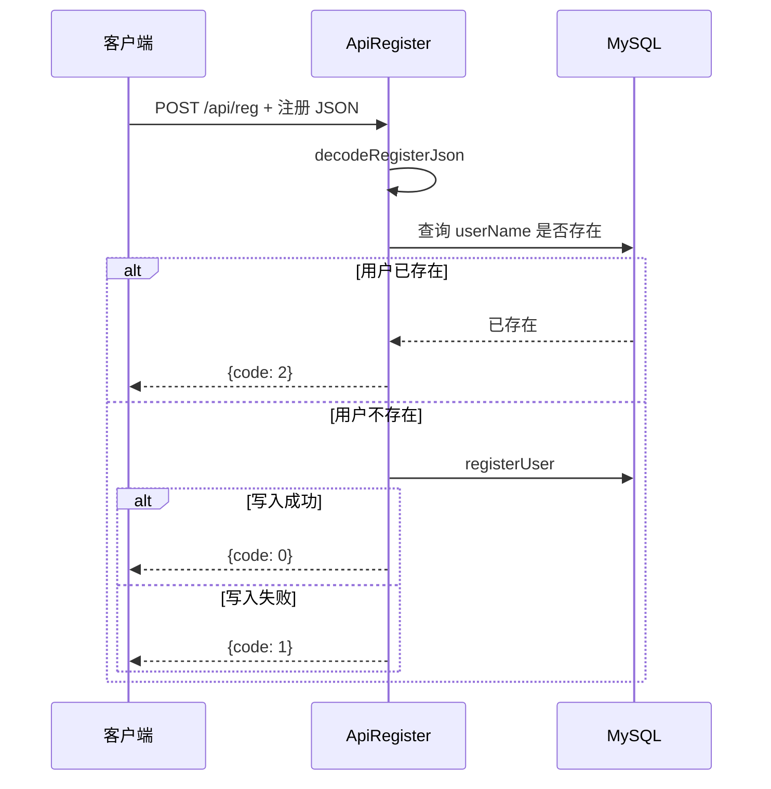
```mermaid
sequenceDiagram
    participant C as 客户端
    participant R as ApiRegister
    participant DB as MySQL

    C->>R: POST /api/reg + 注册 JSON
    R->>R: decodeRegisterJson
    R->>DB: 查询 userName 是否存在
    alt 用户已存在
        DB-->>R: 已存在
        R-->>C: {code: 2}
    else 用户不存在
        R->>DB: registerUser
        alt 写入成功
            R-->>C: {code: 0}
        else 写入失败
            R-->>C: {code: 1}
        end
    end
```

请求字段：

| 字段 | 必填 | 资料约束 |
|---|---:|---|
| `email` | 否 | 符合 Email 规范 |
| `firstPwd` | 是 | 客户端先计算 MD5 后提交 |
| `nickName` | 是 | 不超过 32 个字符 |
| `phone` | 否 | 不超过 16 个字符 |
| `userName` | 是 | 不超过 32 个字符，逻辑上应唯一 |

**资料明确**：客户端不提交明文密码，数据库保存 MD5 结果。

**改进建议**：客户端 MD5 不能代替安全的密码存储。固定 MD5 值本身会变成可重放的“等价密码”，且 MD5 计算快、无盐，容易被字典和彩虹表攻击。现代方案应为：全链路 HTTPS，服务端对密码使用 Argon2id、scrypt、bcrypt 或 PBKDF2，并为每个用户使用独立随机盐。

### 6.2 登录与 Token 签发

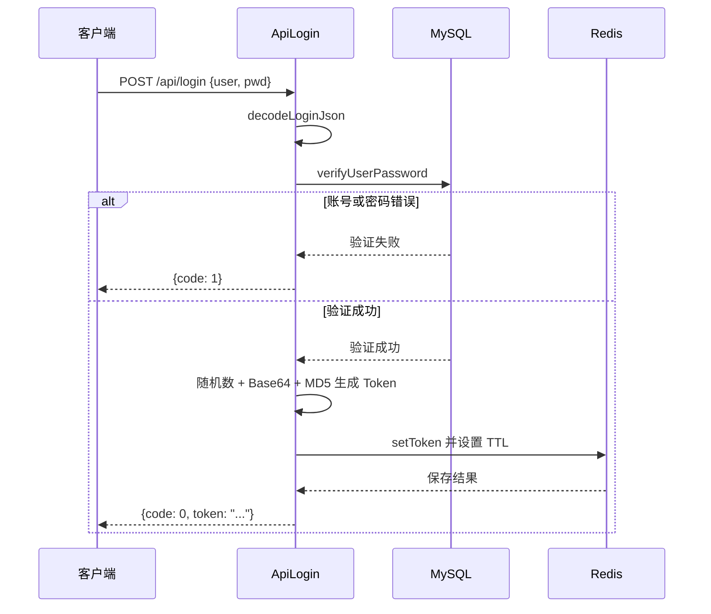
```mermaid
sequenceDiagram
    participant C as 客户端
    participant L as ApiLogin
    participant DB as MySQL
    participant R as Redis

    C->>L: POST /api/login {user, pwd}
    L->>L: decodeLoginJson
    L->>DB: verifyUserPassword
    alt 账号或密码错误
        DB-->>L: 验证失败
        L-->>C: {code: 1}
    else 验证成功
        DB-->>L: 验证成功
        L->>L: 随机数 + Base64 + MD5 生成 Token
        L->>R: setToken 并设置 TTL
        R-->>L: 保存结果
        L-->>C: {code: 0, token: "..."}
    end
```

资料把 Token 描述为类似 HTTP Session 的服务端状态：服务端生成随机 Token，保存到 Redis，并依赖 Redis Key 的过期时间实现会话失效。它不是 JWT；客户端不能只靠解析 Token 判断身份。

**博客代码证据**：保存语句为 `SETEX key seconds value`，校验片段则以 `user` 取 Redis 值并与请求中的 `token` 比较，因此该版本极可能是 `user -> token` 的单值会话模型：同一用户再登录会覆盖旧 Token。可是博客没有展示 `key/value` 赋值全过程，所以仍保留“极可能”而不写成绝对事实。

### 6.3 Token 校验必须同时完成认证与授权

受保护接口通常同时提交 `user` 和 `token`。安全的校验不能只是“Token 在 Redis 中存在”，还必须确认：

```text
Token 有效
AND Token 尚未过期
AND Token 对应的用户 == 请求体中的 user
AND 该 user 有权操作请求中的文件
```

否则攻击者可能拿自己的有效 Token，把 `user` 改成其他用户名实施越权。

### 6.4 Token 实现的待确认项

1. Token 的随机数是否来自密码学安全随机源。
2. Redis Key 是以用户名还是 Token 为索引。
3. 同一用户再次登录后，旧 Token 是立即失效还是并存。
4. TTL 多久，访问时是否滑动续期。
5. 登出是否主动删除 Token。
6. Token 是否在日志、URL 或错误信息中泄露。
7. Redis 故障时采用拒绝服务、降级还是本地缓存。

---

## 7. 我的文件与公共列表

### 7.1 获取个人文件数量

`POST /api/myfiles?cmd=count` 的内部主线：

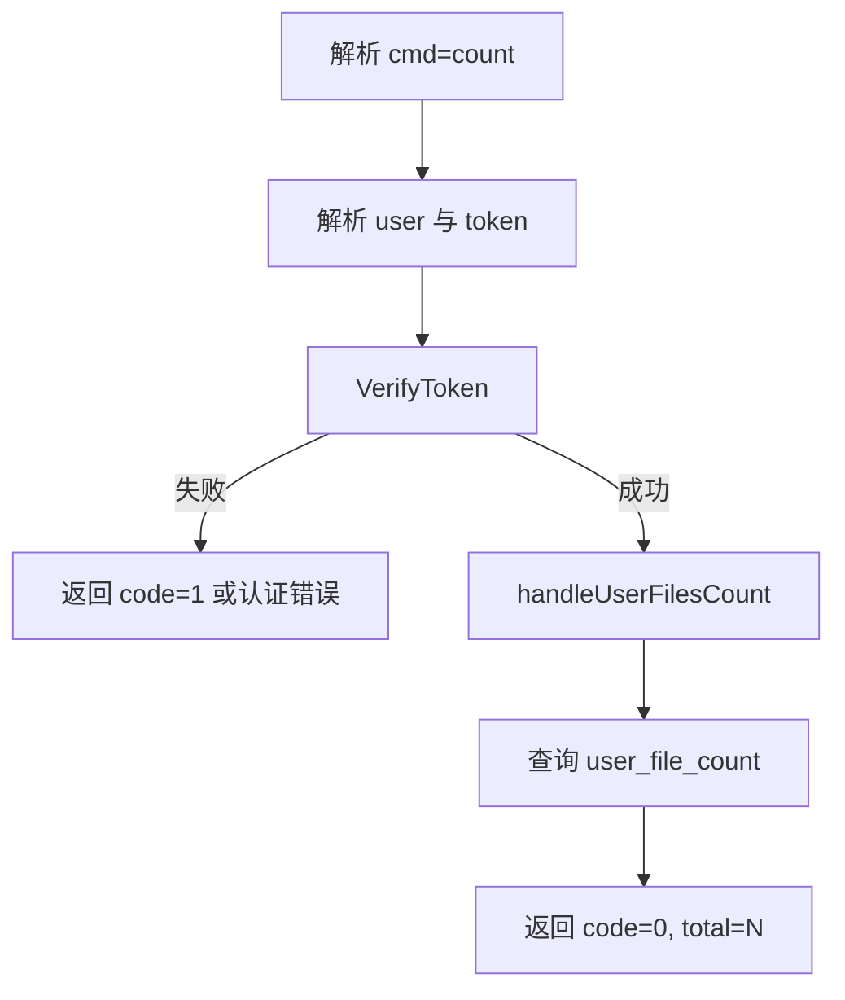
```mermaid
flowchart TD
    A["解析 cmd=count"] --> B["解析 user 与 token"]
    B --> C["VerifyToken"]
    C -->|"失败"| D["返回 code=1 或认证错误"]
    C -->|"成功"| E["handleUserFilesCount"]
    E --> F["查询 user_file_count"]
    F --> G["返回 code=0, total=N"]
```

资料的接口表只列 `code=0/1`，而其他受保护接口常用 `code=4` 表示 Token 失败。这里究竟返回 `1` 还是 `4` 必须以源码为准。

### 7.2 获取个人文件列表

`normal`、`pvasc`、`pvdesc` 共用大部分逻辑，只改变排序方式：

| `cmd` | 排序语义 | 概念 SQL |
|---|---|---|
| `normal` | 默认顺序，文档未说明 | `ORDER BY <待确认>` |
| `pvasc` | 下载量升序 | `ORDER BY pv ASC` |
| `pvdesc` | 下载量降序 | `ORDER BY pv DESC` |

流程图显示服务端会先取得总数，再读取当前页文件信息，并将 `user_file_list` 与 `file_info` 的信息拼成完整文件对象。概念查询可能类似：

```sql
SELECT
    u.user,
    u.md5,
    u.file_name,
    u.shared_status,
    u.pv,
    f.url,
    f.size,
    f.type,
    f.create_time
FROM user_file_list AS u
JOIN file_info AS f ON f.md5 = u.md5
WHERE u.user = ?
ORDER BY u.pv DESC
LIMIT ?, ?;
```

这只是帮助理解的概念 SQL；资料没有给出完整列名、表结构和原始 SQL。

### 7.3 获取公共共享列表

公共共享接口不要求 Token：

- `GET /api/sharefiles?cmd=count`：公共共享总数；
- `POST /api/sharefiles?cmd=normal`：共享文件分页列表；
- `POST /api/sharefiles?cmd=pvdesc`：按共享下载量得到下载榜。

`normal` 与 `pvdesc` 的分支流程可归纳为：

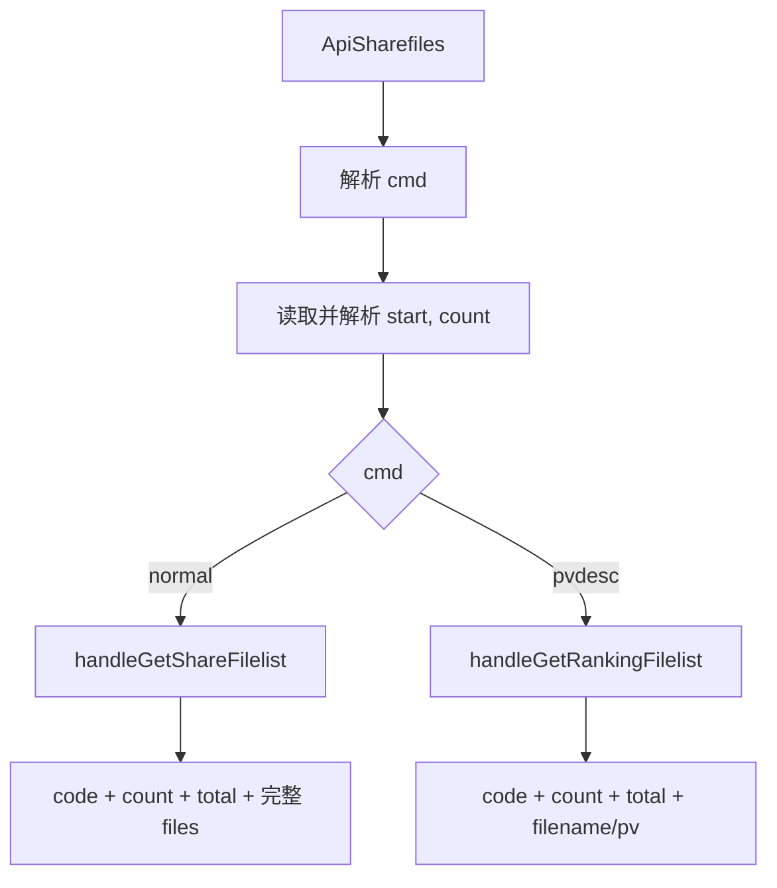
```mermaid
flowchart TD
    A["ApiSharefiles"] --> B["解析 cmd"]
    B --> C["读取并解析 start, count"]
    C --> D{"cmd"}
    D -->|"normal"| E["handleGetShareFilelist"]
    D -->|"pvdesc"| F["handleGetRankingFilelist"]
    E --> G["code + count + total + 完整 files"]
    F --> H["code + count + total + filename/pv"]
```

如果排行榜完全从 Redis `FILE_PUBLIC_ZSET` 读取，服务端还需要使用 `FILE_NAME_HASH` 或 MySQL 把成员标识转换成文件名。资料没有明确正常列表和榜单各自以 MySQL 还是 Redis 为主，需查源码确认。

### 7.4 列表接口的测试边界

- 用户没有文件：`{code: 0, total: 0}` 或 `{code: 0, count: 0}`；
- `start == total`：返回 `count=0`；
- `start > total`：应稳定返回空页而不是数据库错误；
- `count=0`、负数或超大值：应拒绝或规范化；
- 相同 `pv` 的稳定排序；
- 文件元数据存在但 FastDFS 实体丢失；
- `user_file_count` 与真实列表条数不一致；
- Token 正确但 user 不匹配；
- 文件名含中文、空格、特殊字符和超长 UTF-8 字节序列。

---

## 8. MD5 秒传与真实上传

### 8.1 秒传的本质

“秒传”不是把文件瞬间重新上传，而是服务器已经有相同内容时，只新增一条用户拥有关系：

```text
物理文件已经存在
    + 新用户的 user_file_list 记录
    + file_info.count 加 1
    + user_file_count 加 1
    = 秒传成功
```

### 8.2 `/api/md5` 决策树

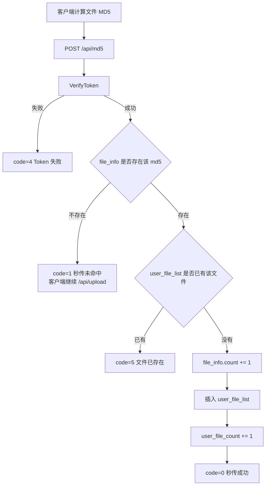
```mermaid
flowchart TD
    A["客户端计算文件 MD5"] --> B["POST /api/md5"]
    B --> C["VerifyToken"]
    C -->|"失败"| T["code=4 Token 失败"]
    C -->|"成功"| D{"file_info 是否存在该 md5"}
    D -->|"不存在"| E["code=1 秒传未命中\n客户端继续 /api/upload"]
    D -->|"存在"| F{"user_file_list 是否已有该文件"}
    F -->|"已有"| G["code=5 文件已存在"]
    F -->|"没有"| H["file_info.count += 1"]
    H --> I["插入 user_file_list"]
    I --> J["user_file_count += 1"]
    J --> K["code=0 秒传成功"]
```

| 条件 | 数据变化 | 返回码 | 客户端动作 |
|---|---|---:|---|
| Token 无效 | 无 | `4` | 重新登录或终止 |
| 全局不存在 MD5 | 无 | `1` | 调用 `/api/upload` |
| 全局存在，当前用户已拥有 | 无 | `5` | 提示重复文件 |
| 全局存在，当前用户未拥有 | 引用数和个人列表增加 | `0` | 上传流程结束 |

`code=1` 在这里是业务分支，不应被客户端当作整个上传任务的终止错误。

### 8.3 并发秒传的正确性

两个请求可能同时看到“当前用户还没有该文件”，随后都插入记录并增加计数。需要至少具备：

- `file_info.md5` 唯一索引；
- `user_file_list` 上能表达用户文件唯一性的复合唯一索引；
- MySQL 事务；
- 原子更新 `SET count = count + 1`，避免读改写丢失更新；
- 唯一键冲突后的幂等处理；
- 在事务提交后再返回秒传成功。

文件唯一键是否应包含 `filename` 是业务选择：相同内容可否以不同文件名同时存在于同一用户目录？原资料同时使用 `md5` 和 `filename` 操作文件，说明仅靠 MD5 可能不足以定位“用户目录项”。

### 8.4 `/api/upload` 真实上传流程

现有资料对“谁负责把 HTTP 文件体落到本地临时文件”有两个版本，应分开学习。

**PDF 中的 Nginx 上传模块路径：**

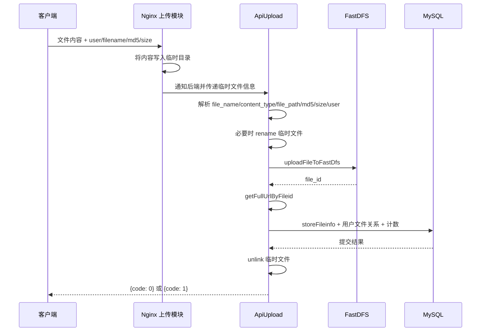
```mermaid
sequenceDiagram
    participant C as 客户端
    participant N as Nginx 上传模块
    participant A as ApiUpload
    participant F as FastDFS
    participant DB as MySQL

    C->>N: 文件内容 + user/filename/md5/size
    N->>N: 将内容写入临时目录
    N->>A: 通知后端并传递临时文件信息
    A->>A: 解析 file_name/content_type/file_path/md5/size/user
    A->>A: 必要时 rename 临时文件
    A->>F: uploadFileToFastDfs
    F-->>A: file_id
    A->>A: getFullUrlByFileid
    A->>DB: storeFileinfo + 用户文件关系 + 计数
    DB-->>A: 提交结果
    A->>A: unlink 临时文件
    A-->>C: {code: 0} 或 {code: 1}
```

**博客代码的 FastCGI 直读路径：**

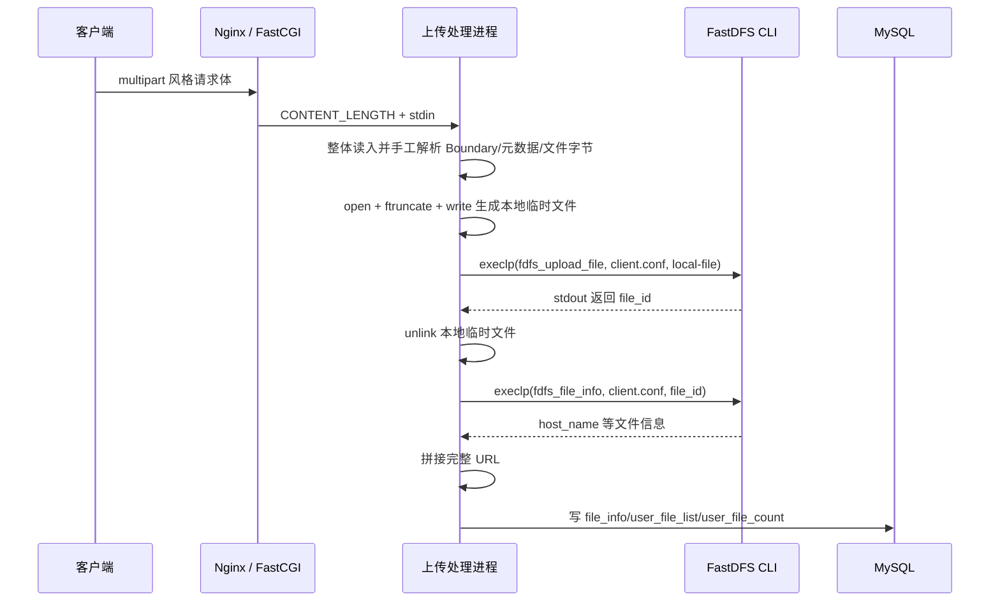
```mermaid
sequenceDiagram
    participant C as 客户端
    participant N as Nginx / FastCGI
    participant A as 上传处理进程
    participant CLI as FastDFS CLI
    participant DB as MySQL

    C->>N: multipart 风格请求体
    N->>A: CONTENT_LENGTH + stdin
    A->>A: 整体读入并手工解析 Boundary/元数据/文件字节
    A->>A: open + ftruncate + write 生成本地临时文件
    A->>CLI: execlp(fdfs_upload_file, client.conf, local-file)
    CLI-->>A: stdout 返回 file_id
    A->>A: unlink 本地临时文件
    A->>CLI: execlp(fdfs_file_info, client.conf, file_id)
    CLI-->>A: host_name 等文件信息
    A->>A: 拼接完整 URL
    A->>DB: 写 file_info/user_file_list/user_file_count
```

两套资料共同的业务步骤顺序是：

1. 解析文件名；
2. 解析内容类型和临时路径；
3. 解析 MD5、大小和用户名；
4. 必要时重命名临时文件；
5. 上传 FastDFS 并得到 `file_id`；
6. 根据 `file_id` 形成完整下载 URL；
7. 保存文件信息到数据库；
8. 删除临时文件；
9. 返回 JSON。

博客代码还表明了两个实现细节：上传 CLI 的标准输出通过管道传回父进程；完整 URL 并非只从 `file_id` 做纯字符串拼接，而是先运行 `fdfs_file_info` 获取 Storage `host_name`。这是历史实现事实，现代实现更宜使用 SDK 和统一的外部下载域名，避免把某台 Storage 的 `host_name` 持久化为稳定接口。

### 8.5 上传链路的失败窗口

| 失败位置 | 可能后果 | 建议处理 |
|---|---|---|
| 临时文件写入失败 | 客户端上传中断或磁盘打满 | 限额、独立分区、磁盘监控、明确错误码 |
| FastDFS 上传失败 | 临时文件残留 | `finally` 清理、失败目录和定时回收 |
| FastDFS 成功，MySQL 失败 | FastDFS 出现孤儿文件 | 立即补偿删除，或写任务表异步清理 |
| MySQL 部分语句成功 | 计数和列表不一致 | 单库事务覆盖 `file_info`、列表、计数 |
| 响应丢失 | 客户端重试导致重复提交 | 以 MD5/幂等键去重，返回可重复查询结果 |
| `unlink` 失败 | 临时目录持续增长 | 记录路径和错误，后台回收任务 |
| 整个 multipart 读入内存 | 大文件放大内存并可导致 OOM | 严格限制 `CONTENT_LENGTH`，使用流式 multipart 解析或 Nginx 落盘 |
| `fork/exec` 或管道读取异常 | 无 `file_id`、子进程泄漏或请求卡住 | 检查每个系统调用、限时等待、按 PID 回收并记录阶段日志 |

### 8.6 MD5 的边界

MD5 适合作为这个教学项目的快速内容指纹，但不应被当作对抗恶意输入的强唯一标识。生产系统可同时保存 SHA-256，并在判定重复时结合文件大小，必要时对内容做二次确认。无论采用何种摘要，都应把数据库唯一约束和并发事务设计好。

---

## 9. 分享、转存、删除与下载计数

### 9.1 文件状态与引用关系

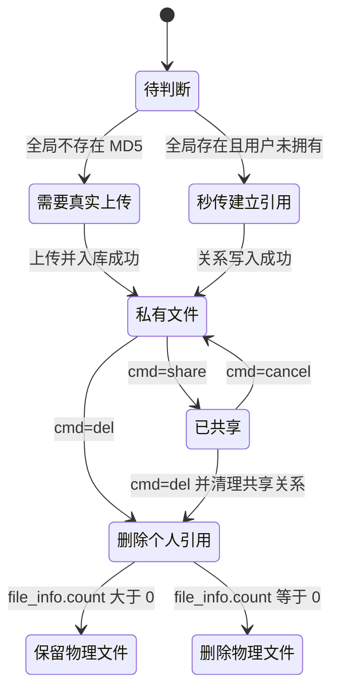
```mermaid
stateDiagram-v2
    [*] --> 待判断
    待判断 --> 需要真实上传: 全局不存在 MD5
    待判断 --> 秒传建立引用: 全局存在且用户未拥有
    需要真实上传 --> 私有文件: 上传并入库成功
    秒传建立引用 --> 私有文件: 关系写入成功
    私有文件 --> 已共享: cmd=share
    已共享 --> 私有文件: cmd=cancel
    私有文件 --> 删除个人引用: cmd=del
    已共享 --> 删除个人引用: cmd=del 并清理共享关系
    删除个人引用 --> 保留物理文件: file_info.count 大于 0
    删除个人引用 --> 删除物理文件: file_info.count 等于 0
```

状态图中的“引用归零后删除物理文件”已有博客代码支持：教学版本在 `count == 0` 时查询 `file_id`、删除 `file_info`，并构造 `fdfs_delete_file <client.conf> <file_id>` 操作删除 Storage 文件。

> **重要校正**：片段中的 `count` 到底是“减一前”还是“减一后”的值并不清楚，而且展示顺序是先删 MySQL `file_info`、再删 Storage。如果 Storage 删除失败，将留下无元数据的孤儿文件。安全实现应用事务和条件更新原子夺取“最后引用删除权”，将文件标记为 `deleting`，再由可重试任务删 Storage 并最终清理元数据。

### 9.2 分享个人文件 `cmd=share`

资料给出的主要逻辑：

1. 校验 Token；
2. 使用 `md5 + filename` 形成成员标识，在 `FILE_PUBLIC_ZSET` 判断是否已有其他人分享；
3. 若已存在，返回 `code=3`；
4. 把当前用户 `user_file_list` 中的文件设置为分享状态；
5. 更新共享文件数量；
6. 更新 `FILE_PUBLIC_ZSET` 排行榜；
7. 更新 `FILE_NAME_HASH` 中标识到文件名的映射；
8. 返回 `code=0`。

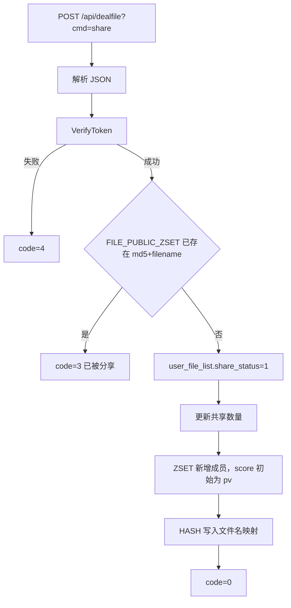
```mermaid
flowchart TD
    A["POST /api/dealfile?cmd=share"] --> B["解析 JSON"]
    B --> C["VerifyToken"]
    C -->|"失败"| D["code=4"]
    C -->|"成功"| E{"FILE_PUBLIC_ZSET 已存在 md5+filename"}
    E -->|"是"| F["code=3 已被分享"]
    E -->|"否"| G["user_file_list.share_status=1"]
    G --> H["更新共享数量"]
    H --> I["ZSET 新增成员，score 初始为 pv"]
    I --> J["HASH 写入文件名映射"]
    J --> K["code=0"]
```

待确认：如果两名用户拥有内容相同但文件名不同的文件，是否允许分别分享；如果文件名相同但 MD5 不同，拼接标识如何避免歧义；MySQL 和 Redis 更新失败时如何回滚。

### 9.3 取消分享 `cmd=cancel`

`POST /api/dealsharefile?cmd=cancel` 接收 `user`、`md5`、`filename`。资料描述：查询共享文件数量；如果数量为 1，删除对应计数行；大于 1 则减 1，同时清理该用户的共享状态/共享记录。

流程图明确表示 `cancel`、`save`、`pv` 共用 `ApiDealsharefile` 入口，并写有“这里暂且不做 token 认证”。这是严重的横向越权风险：调用者可能仅修改 `user` 就取消别人的分享。正确实现必须校验当前身份和目标资源所有权。

### 9.4 转存共享文件 `cmd=save`

转存不是复制 FastDFS 文件，而是增加对同一 `file_info` 的引用：

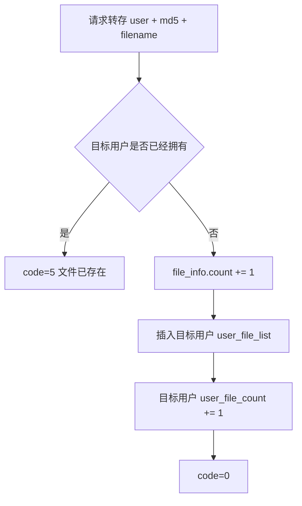
```mermaid
flowchart TD
    A["请求转存 user + md5 + filename"] --> B{"目标用户是否已经拥有"}
    B -->|"是"| C["code=5 文件已存在"]
    B -->|"否"| D["file_info.count += 1"]
    D --> E["插入目标用户 user_file_list"]
    E --> F["目标用户 user_file_count += 1"]
    F --> G["code=0"]
```

资料明确指出：转存完成后，即使原分享者删除自己的文件，也不影响转存者，因为物理文件仍有其他引用。

### 9.5 删除个人文件 `cmd=del`

资料给出的删除逻辑同时检查 Redis 和 MySQL：

1. 判断该文件是否处于分享状态；
2. 先查 Redis 集合/排行榜是否有共享记录；
3. Redis 没有时再查 MySQL，避免因缓存缺失误判；
4. MySQL 有、Redis 无时只处理 MySQL 中存在的事实；
5. Redis 有时，MySQL 和 Redis 的相关记录都需要处理；
6. 删除个人拥有关系并维护各类计数；
7. 引用数归零时才删除全局文件记录和 FastDFS 实体。

“删除自己的文件是否同时取消分享”属于业务规则。原资料采用的倾向是：拥有者删除时，该用户对应的共享记录也删除；其他已转存用户不受影响。

### 9.6 下载量 `pv` 的两套计数

个人文件和公共共享文件分别有计数入口：

| 场景 | 下载方式 | 下载后调用 | 更新位置 |
|---|---|---|---|
| 下载自己的文件 | 对文件 URL 发 GET，由 FastDFS + Nginx 返回 | `/api/dealfile?cmd=pv` | `user_file_list.pv` |
| 下载共享文件 | 对共享文件 URL 发 GET | `/api/dealsharefile?cmd=pv` | `share_file_list.pv` 和 `FILE_PUBLIC_ZSET` score |

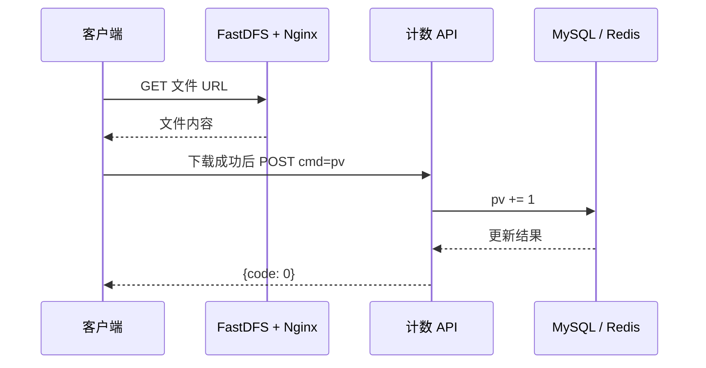
```mermaid
sequenceDiagram
    participant C as 客户端
    participant D as FastDFS + Nginx
    participant A as 计数 API
    participant DB as MySQL / Redis

    C->>D: GET 文件 URL
    D-->>C: 文件内容
    C->>A: 下载成功后 POST cmd=pv
    A->>DB: pv += 1
    DB-->>A: 更新结果
    A-->>C: {code: 0}
```

这种“下载完成后由客户端另行上报”的设计无法保证准确：客户端可以不报、重复报或伪造请求。若计数只用于展示，可以接受最终近似；若用于计费或权益，必须把计数放到可信的下载链路中，并设计幂等事件 ID、防刷和异步聚合。

---

## 10. 图片分享子系统

### 10.1 四个操作

| 操作 | 路径 | 目的 |
|---|---|---|
| 分享图片 | `/api/sharepic?cmd=share` | 为已上传文件创建图片分享，返回 `urlmd5` |
| 浏览图片 | `/api/sharepic?cmd=browse` | 用 `urlmd5` 换取真实下载 URL、分享者、时间和浏览量 |
| 我的图片分享 | `/api/sharepic?cmd=normal` | 分页列出当前用户创建的图片分享 |
| 取消图片分享 | `/api/sharepic?cmd=cancel` | 使 `urlmd5` 对应的分享失效 |

`urlmd5` 应理解为“不透明的分享标识”。资料没有给出生成算法，不能因为名称中含 `md5` 就假设它一定等于文件 MD5、URL 的 MD5 或可由客户端预测。

### 10.2 创建与浏览的完整链路

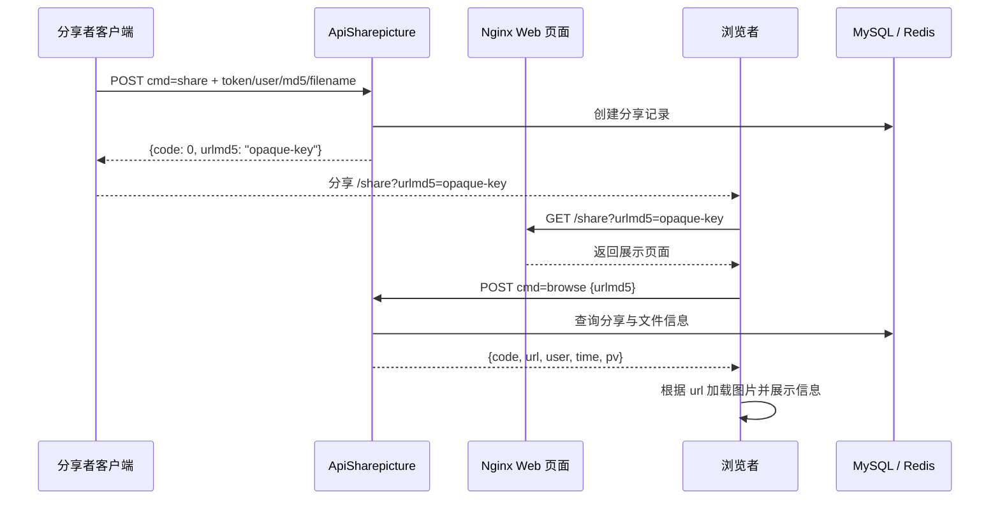
```mermaid
sequenceDiagram
    participant Owner as 分享者客户端
    participant API as ApiSharepicture
    participant Web as Nginx Web 页面
    participant Viewer as 浏览者
    participant Store as MySQL / Redis

    Owner->>API: POST cmd=share + token/user/md5/filename
    API->>Store: 创建分享记录
    API-->>Owner: {code: 0, urlmd5: "opaque-key"}

    Owner-->>Viewer: 分享 /share?urlmd5=opaque-key
    Viewer->>Web: GET /share?urlmd5=opaque-key
    Web-->>Viewer: 返回展示页面
    Viewer->>API: POST cmd=browse {urlmd5}
    API->>Store: 查询分享与文件信息
    API-->>Viewer: {code, url, user, time, pv}
    Viewer->>Viewer: 根据 url 加载图片并展示信息
```

### 10.3 浏览响应

| `code` | 含义 |
|---:|---|
| `0` | 成功取得下载 URL |
| `1` | 提取码/分享标识错误 |
| `2` | 文件已经被删除 |

成功时还返回 `url`、`user`、`time`、`pv`。资料称浏览一次 `pv + 1`，但没有说明是在 `browse` 查询内同步增加、页面加载完成后增加，还是另有事件。源码需要确认。

### 10.4 取消分享的版本冲突

- 接口文档：请求包含 `token`、`user`、`urlmd5`，Token 失败可返回 `code=4`。
- 架构文档接口表：只列 `token`、`urlmd5`，示例却又包含 `user`。
- 架构流程图：只展示 `user`、`urlmd5`，没有 Token 校验节点。

安全实现应至少要求有效 Token，并验证分享记录属于当前用户；不能只凭可转发的 `urlmd5` 取消分享。

---

## 11. FastDFS 集群的学习模型

### 11.1 Tracker、Group 与 Storage

总架构图显示：客户端/API 与 Tracker 集群交互，文件最终进入某个 Storage Group；同一 Group 内的多个 Storage 节点进行同步。

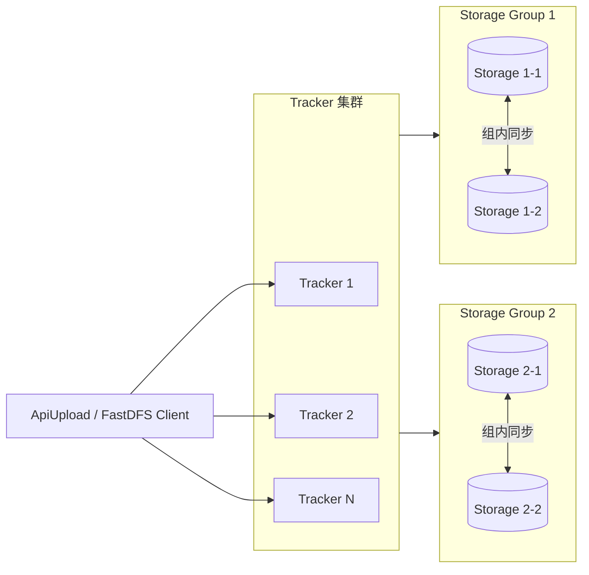
```mermaid
flowchart LR
    Upload["ApiUpload / FastDFS Client"]

    subgraph Trackers["Tracker 集群"]
        T1["Tracker 1"]
        T2["Tracker 2"]
        TN["Tracker N"]
    end

    subgraph G1["Storage Group 1"]
        S11[("Storage 1-1")]
        S12[("Storage 1-2")]
        S11 <-->|"组内同步"| S12
    end

    subgraph G2["Storage Group 2"]
        S21[("Storage 2-1")]
        S22[("Storage 2-2")]
        S21 <-->|"组内同步"| S22
    end

    Upload --> T1
    Upload --> T2
    Upload --> TN
    Trackers --> G1
    Trackers --> G2
```

从学习角度可以这样记：

- Tracker 负责“到哪里存、到哪里找”的协调，不保存业务数据库中的用户关系；
- Storage 保存文件实体；
- Group 是容量和副本组织单位；
- MySQL 中的 `file_id` 保存 FastDFS 逻辑路径，`url` 是外部访问形式；
- `fastdfs-nginx-module` 让下载请求直接命中 Storage/Nginx 链路。

### 11.2 URL 不应绑定单机 IP

示例把完整 IP 地址写入 `file_info.url`。如果域名、端口、HTTPS、CDN 或 Storage 入口改变，历史记录就可能失效。更稳妥的做法是：数据库只保存稳定的 `file_id`，响应时根据当前配置拼接下载域名，或通过统一下载服务生成 URL。

### 11.3 下载直链的授权边界

如果 `url` 是公开可访问且永久有效的直链，拿到 URL 的人可能绕过 API Token 直接下载“我的文件”。项目需要明确：

- 文件究竟默认公开还是私有；
- 私有下载是否使用短期签名 URL；
- 是否通过受控下载网关检查权限；
- URL 泄露后如何撤销；
- CDN 和缓存是否会扩大暴露范围。

---

## 12. 跨 MySQL、Redis、FastDFS 的一致性

### 12.1 各操作影响的存储

| 操作 | MySQL | Redis | FastDFS/文件系统 |
|---|---|---|---|
| 注册 | 写 `user_info` | - | - |
| 登录 | 读 `user_info` | 写 Token + TTL | - |
| 秒传命中 | 写 `file_info.count`、`user_file_list`、`user_file_count` | 读 Token | 不上传文件 |
| 真实上传 | 写文件及用户元数据 | 可能读 Token | 临时目录写入、FastDFS 上传、临时文件删除 |
| 分享 | 更新个人共享状态和共享记录/数量 | 更新 ZSET、Hash | 不复制文件 |
| 取消分享 | 更新共享记录/数量 | 删除或更新共享索引 | 不删除仍被引用的文件 |
| 转存 | 增加引用与个人文件关系 | 可能只用于辅助 | 不复制文件 |
| 删除 | 删除个人/共享关系，引用数减少 | 清理共享索引 | 引用归零时删除实体 |
| 个人 `pv` | 更新 `user_file_list.pv` | 读 Token | - |
| 共享 `pv` | 更新 `share_file_list.pv` | 更新 ZSET 分数 | - |
| 图片分享 | 写分享记录 | 可能写分享索引 | 复用已有文件 URL |

同一个 MySQL 事务能覆盖多张表，却无法原子覆盖 Redis 和 FastDFS。因此项目需要接受“短暂不一致”，再通过补偿、重试和对账恢复。

### 12.2 推荐的事务边界

以秒传为例，以下三步必须处于同一 MySQL 事务：

```text
file_info.count += 1
INSERT user_file_list
user_file_count.count += 1
```

以分享为例，可把 MySQL 作为事实源：先在事务内写共享事实和 Outbox 事件，事务提交后由可靠消费者更新 Redis 排行榜。这样 Redis 暂时失败不会丢失“应该更新”的信息。

### 12.3 常见失败模式

| 场景 | 可观察问题 | 根因 | 修复方向 |
|---|---|---|---|
| `file_info.count` 大于真实拥有记录数 | 删除后物理文件永不回收 | 非事务更新或重复重试 | 对账并重算；唯一索引；幂等 |
| `user_file_count` 与列表数不一致 | UI 总数和分页不匹配 | 派生计数写失败 | 定期从列表重建；事务更新 |
| MySQL 已分享，Redis 榜单没有 | 公共列表与下载榜不一致 | Redis 写失败 | Outbox/重试；以 MySQL 重建 Redis |
| Redis 有成员，MySQL 无共享记录 | 榜单出现幽灵文件 | 删除路径漏清理 | 读取时校验；异步清理 |
| FastDFS 有文件，MySQL 无记录 | 孤儿文件占空间 | 上传后入库失败 | 补偿删除；孤儿扫描 |
| MySQL 有 URL，FastDFS 无文件 | 列表正常但下载 404 | 存储故障或错误删除 | 副本修复；状态标记；告警 |
| `pv` 在 MySQL 与 ZSET 不同 | 榜单顺序异常 | 双写部分失败 | 事件化更新；定期校准 |
| Token 保存失败但登录返回成功 | 用户立即无法访问 | 忽略 Redis 错误 | Token 持久化成功后才返回 |

### 12.4 对账任务

建议至少有四类周期任务：

1. **引用对账**：按 `user_file_list` 重算 `file_info.count`。
2. **用户计数对账**：按用户重算 `user_file_count.count`。
3. **共享索引对账**：用 MySQL 共享事实重建 Redis ZSET/Hash。
4. **存储对账**：发现“有元数据无实体”和“有实体无元数据”的对象。

对账程序不要直接静默修改所有异常。应先输出请求 ID/任务批次、对象标识、旧值、新值、证据来源和处理结果，保留可审计记录。

### 12.5 幂等性设计

用户重试、Nginx 重试和网络超时都可能让同一请求执行多次。以下操作必须考虑幂等：

- 注册同一用户名；
- 同一用户秒传同一文件；
- 上传完成但响应丢失后的重试；
- 重复分享或重复取消分享；
- 重复转存；
- 重复删除；
- 下载计数重复上报。

可使用唯一约束、幂等请求 ID、状态机条件更新和“重复执行返回当前状态”的方式处理。不要仅依赖“客户端不会重复请求”。

---

## 13. 安全性分析

### 13.1 高优先级风险

| 优先级 | 风险 | 资料依据 | 建议 |
|---|---|---|---|
| P0 | 示例全部使用 HTTP | 两份文档 URL 均为 `http://` | 部署 HTTPS，禁止明文传输密码等价物和 Token |
| P0 | 密码使用无盐 MD5 | 注册和登录章节明确说明 | 服务端使用专用密码哈希和每用户随机盐 |
| P0 | `dealsharefile` 暂不做 Token 认证 | 架构流程图明确标注 | 所有写操作认证，并验证资源所有权 |
| P0 | 图片取消分享认证要求矛盾 | 两份资料字段和流程不一致 | 以服务端统一鉴权中间件强制执行 |
| P1 | 请求同时接受 `user` 和 Token | 多个接口 | Token 身份必须与 `user` 绑定，避免横向越权 |
| P1 | 永久直链可能绕过权限 | 列表直接返回 FastDFS URL | 私有资源使用鉴权下载或短时签名 URL |
| P1 | 客户端上报 `pv` 可伪造 | 下载完成后另调计数 API | 服务端可信下载事件、限流、防重 |
| P1 | 上传协议和校验不明确 | `/api/upload` 文档不自洽 | 限大小、MIME/魔数校验、文件名清洗、恶意文件扫描 |
| P0 | SQL 注入 | 博客代码大量用 `sprintf` 把 `user_name/user/filename/md5` 拼入 SQL | 全面改为预编译语句与参数绑定，不以输入过滤代替参数化 |
| P0 | 手写 multipart 可导致越界、截断或 OOM | 博客代码整体 `malloc(CONTENT_LENGTH)` 后使用 `strstr/strncpy` | 使用经验证的流式解析器，在 Nginx 和应用双重限制体积与字段长度 |
| P1 | Token 随机性不足 | 博客片段使用 `srand(time(NULL))` 和多个 `rand()%1000` | 使用 CSPRNG 生成至少 128 bit 不可预测 Token，不把 MD5/Base64 当随机源 |
| P1 | 文件名/命令参数注入 | 博客上传通过 `execlp` 传本地文件名，删除片段还展示字符串命令 | 保持 argv 调用而非 shell，本地文件用服务端随机名，对 `file_id` 做格式白名单 |

### 13.2 输入验证

每个接口至少校验：

- JSON 是否可解析、字段是否存在、类型是否正确；
- `user`、`nickName`、`filename` 的字符数与 UTF-8 字节数；
- `md5` 是否为 32 位十六进制，而不是任意字符串；
- `start`、`count` 是否在范围内；
- 文件大小是否与实际临时文件一致；
- 文件名是否包含路径分隔符、`..`、控制字符或 NUL；
- MIME 类型是否与文件魔数相符；
- `cmd` 是否在白名单；
- 数据库查询是否使用参数绑定而不是字符串拼接。

### 13.3 日志原则

该项目跨组件较多，细粒度日志非常重要。建议每个请求记录：

- `request_id` / `trace_id`；
- 路由、`cmd`、HTTP 方法，以及 Nginx 传入的请求 ID；
- FastCGI 进程/Worker 标识、请求接收与响应完成状态；
- 认证结果和用户标识；
- 当前阶段：解析、鉴权、MySQL、Redis、FastDFS、编码响应；
- 数据库影响行数、FastDFS `file_id`、业务 `code`；
- 各阶段耗时；
- 异常类型和可重试性。

严禁记录密码、完整 Token、文件正文和敏感个人信息。MD5、URL、文件名等也应按业务敏感级别决定是否脱敏。

### 13.4 现代化错误响应建议

原项目仅返回整数 `code`，排查困难。可以规范为：

```json
{
  "code": "AUTH_TOKEN_EXPIRED",
  "message": "登录状态已过期",
  "requestId": "01H...",
  "data": null
}
```

同时配合 HTTP 状态码：请求格式错误用 400，未认证用 401，无权限用 403，资源不存在用 404，冲突用 409，内部错误用 500。业务客户端仍可读取稳定的字符串错误码。

---

## 14. 无源码条件下的实现重建方法

### 14.1 先建立分层，而不是照 PDF 堆函数

如果用现代方式重新实现，可按职责拆分：

```text
transport/      FastCGI 接入、参数与输入输出流适配
api/            路由、请求 DTO、响应 DTO、鉴权入口
service/        注册、登录、秒传、上传、分享、转存、删除
repository/     user_info、file_info、user_file_list 等数据访问
storage/        FastDFS 适配器、临时文件管理
cache/          Token、ZSET、Hash 适配器
transaction/    事务和 Outbox
observability/  日志、指标、追踪、审计
```

旧流程图中的 `decode...Json`、`handle...`、`encode...Json` 恰好对应“输入适配 -> 业务服务 -> 输出适配”的边界。

### 14.2 统一处理器模板

下面是与资料流程一致的伪代码；日志只记录阶段和脱敏后的业务标识：

```cpp
Response handleRequest(const Request& request) {
    const auto requestId = createRequestId();
    LOG_INFO("request_started", requestId, request.path(), request.command());

    try {
        const auto input = parseAndValidate(request);
        LOG_INFO("request_validated", requestId, input.userMasked());

        const auto principal = authenticateIfRequired(input);
        LOG_INFO("authentication_completed", requestId, principal.userMasked());

        const auto result = dispatchBusinessCommand(input, principal);
        LOG_INFO("business_completed", requestId, result.code(), result.affectedRows());

        return encodeResponse(requestId, result);
    } catch (const ValidationError& error) {
        LOG_WARN("validation_failed", requestId, error.field(), error.reason());
        return badRequest(requestId, error);
    } catch (const std::exception& error) {
        LOG_ERROR("request_failed", requestId, classify(error));
        return internalError(requestId);
    }
}
```

### 14.3 先写契约测试，再写业务实现

由于原文存在字段和示例矛盾，重建时应先人为确定一份规范化契约：

1. 固定路径、方法、Content-Type；
2. 固定字段命名和类型；
3. 固定每个接口的认证要求；
4. 固定错误码和 HTTP 状态码；
5. 为 21 个操作编写请求/响应样例；
6. 再根据契约实现服务端和客户端。

若目标是兼容旧客户端，可以在边界层兼容 `fileName`/`filename` 等别名，但内部模型只能保留一个规范字段，并记录兼容分支的使用量以便后续下线。

---

## 15. 测试清单

### 15.1 接口契约测试

- 每个接口的正常请求；
- 缺字段、字段为 `null`、错误类型、超长字段；
- 非法 JSON、错误 Content-Type、未知 `cmd`；
- `code` 与 HTTP 状态码是否符合约定；
- 列表空页、第一页、最后一页、越界页；
- 中文文件名、同 MD5 不同文件名、同文件名不同 MD5；
- 示例中曾出现的字段别名是否接受或明确拒绝。

### 15.2 鉴权与授权测试

- 无 Token、错误 Token、过期 Token；
- 用户 A 的 Token 配合用户 B 的 `user`；
- 用户 A 删除、分享、取消用户 B 的文件；
- 普通用户直接调用 `dealsharefile` 三个写操作；
- 使用他人的 `urlmd5` 取消图片分享；
- Token 重放、并发登录、登出后继续调用。

### 15.3 并发与幂等测试

- 两个请求同时秒传同一用户同一文件；
- 多个用户同时秒传同一全局文件；
- 同一分享请求重试；
- 转存与原分享者删除同时发生；
- 最后两个引用并发删除；
- 下载计数重复上报；
- Redis 写失败后的自动重试是否重复加分。

### 15.4 故障注入测试

- MySQL 提交前/后断开；
- Redis 超时、主从切换、Key 被清空；
- Tracker 不可用；
- Storage 上传成功但响应超时；
- 临时目录无空间或无权限；
- FastDFS 删除失败；
- Nginx 到后端连接中断；
- 客户端上传一半主动断开。

### 15.5 不变量断言

每轮集成测试结束后自动检查：

```text
file_info.count == 对应 user_file_list 行数
user_file_count.count == 用户对应 user_file_list 行数
Redis 共享成员均有 MySQL 共享事实
所有有效 file_info.file_id 均能定位到文件实体
引用数为 0 的文件没有长期残留
```

---

## 16. 学习路线与复习提纲

### 16.1 七阶段学习路线

| 阶段 | 目标 | 产出 |
|---:|---|---|
| 1 | 记住组件和数据流 | 能默画 Nginx --FastCGI--> C/C++ API、MySQL、Redis、FastDFS 总图 |
| 2 | 理解五张表 | 能解释物理文件、用户目录项和共享记录的区别 |
| 3 | 掌握认证 | 能复述登录、Token TTL、认证与授权的区别 |
| 4 | 掌握上传 | 能完整讲解 MD5 秒传和真实上传两条路径 |
| 5 | 掌握分享生命周期 | 能解释分享、取消、转存、删除时引用计数如何变化 |
| 6 | 掌握一致性 | 能列出 MySQL、Redis、FastDFS 双写/三写的失败窗口 |
| 7 | 完成设计复盘 | 写出改进后的 API 契约、事务方案、测试矩阵和日志方案 |

### 16.2 高频自测题

1. 为什么 `file_info` 和 `user_file_list` 不能合成一张表？
2. 秒传命中后为什么还要修改三处 MySQL 数据？
3. `/api/md5` 返回 `code=1` 后客户端应该做什么？
4. 为什么转存后原分享者删除文件不影响转存者？
5. `file_info.count` 在并发下如何防止丢失更新？
6. `user_file_count` 既然可以 `COUNT(*)` 得到，为什么还要单独保存？代价是什么？
7. Redis ZSET 为什么适合排行榜？如果 Redis 丢数据如何恢复？
8. FastDFS 上传成功但 MySQL 失败会产生什么？
9. 客户端在下载后另调 `pv` 接口为什么不可信？
10. 只验证 Token 存在，不验证它与 `user` 的对应关系，会出现什么漏洞？
11. `urlmd5` 为什么应被视为不透明标识？
12. 永久 FastDFS 直链为什么可能绕过权限？
13. 客户端到 Nginx、Nginx 到 API 分别使用什么协议？为什么 `fastcgi_pass` 不能直接等同于 `proxy_pass`？

### 16.3 自测题核心答案

1. 一份物理文件可被多用户引用，合表会重复保存 `file_id/url`，难以做全局去重。
2. 需要增加物理文件引用数、增加用户目录项、增加用户文件总数。
3. 继续调用 `/api/upload` 上传真实文件内容。
4. 转存只新增引用；物理文件仍有引用数，不应被删除。
5. 使用事务、唯一约束和 `count = count + 1` 原子更新，处理唯一键冲突。
6. 预计算计数可加速高频查询，但会引入一致性和对账成本。
7. ZSET 按 score 排序；MySQL 作为事实源时可重建 Redis。
8. 产生 FastDFS 孤儿文件，需要补偿删除或后台清理。
9. 客户端可漏报、重报、伪造，计数不是可信事实。
10. 攻击者可用自己的 Token 冒充别的用户名，形成横向越权。
11. 资料未定义其算法；客户端只应保存和传回，不能解析或预测。
12. 知道 URL 的人可能绕过业务 API 和 Token 直接读取文件。
13. 前一段是 HTTP，后一段是 FastCGI；FastCGI 通过参数记录和输入输出流传递请求/响应，而 `proxy_pass` 的上游接收的是 HTTP 请求。

### 16.4 面试表达模板

可以用下面这段话快速介绍项目：

> 项目由 Nginx 接收客户端 HTTP 请求，再通过 FastCGI 将普通业务请求交给常驻的 C/C++ API 进程。项目把文件实体与用户文件关系分开：FastDFS 保存文件，MySQL 的 `file_info` 保存物理文件元数据，`user_file_list` 保存用户到文件的引用。上传前先用 MD5 查询全局文件；命中时只在事务内增加引用和用户目录项，实现秒传，未命中才经 Nginx 上传模块落临时文件，再由 FastCGI 上传处理器上传 FastDFS。Redis 负责 Token TTL 和共享排行榜。难点不在单个 CRUD，而在 FastCGI 请求边界、引用计数并发，以及 MySQL、Redis、FastDFS 之间的失败补偿、幂等和对账。

---

## 17. 原资料页码索引

### 17.1 《架构和功能分析.pdf》

| 主题 | 页码 |
|---|---:|
| 总体架构图 | 1 |
| 五张核心表和字段 | 2 |
| 注册、MD5 密码说明 | 2-5 |
| 登录、Token、Base64 | 5-8 |
| 我的文件数量、列表、排序 | 8-13 |
| MD5 秒传 | 14-16 |
| 真实上传与 Nginx 上传模块 | 16-18 |
| 公共共享列表与下载榜 | 18-24 |
| 分享、删除、个人下载计数 | 24-31 |
| 取消分享、转存、共享下载计数 | 32-36 |
| 图片分享、浏览、列表、取消 | 37-45 |

### 17.2 《项目接口文档.pdf》

| 主题 | 页码 |
|---|---:|
| 注册、登录 | 1-3 |
| 我的文件数量、列表、排序 | 3-10 |
| 公共共享列表 | 10-12 |
| 分享、删除、个人下载计数 | 12-15 |
| 取消分享、转存、共享下载计数 | 15-19 |
| 下载榜、MD5 秒传 | 19-21 |
| 真实上传 | 21-23 |
| 图片分享 | 23-24 |
| 图片浏览 | 25-26 |
| 我的图片分享 | 26-28 |
| 取消图片分享 | 28-29 |

### 17.3 CSDN《云存储项目功能实现以及分析》

本地离线文章：[云存储项目功能实现以及分析](云存储项目功能实现以及分析/云存储项目功能实现以及分析.md)；原始网页：[CSDN 文章](https://blog.csdn.net/weixin_52259848/article/details/127156546)。

| 主题 | 可直接核对的实现证据 |
|---|---|
| FastCGI 接入 | `FCGI_Accept`、`CONTENT_LENGTH`、`stdin/stdout` |
| 注册与登录 | cJSON 解析、MySQL 查询、Token 生成、Redis `SETEX` |
| MD5 秒传 | 用户去重、`file_info.count`、用户文件列表与计数联动 |
| 真实上传 | 手工 multipart 解析、本地临时文件、`fdfs_upload_file`、`fdfs_file_info`、`unlink` |
| 列表与榜单 | `cmd`、SQL `LIMIT`、`ORDER BY pv`、Redis ZSET/Hash 重建 |
| 删除与分享 | `share_file_list`、`FILE_PUBLIC_ZSET`、引用计数归零、`fdfs_delete_file` |

> 博客的行级代码是对 PDF 流程的有价值补充，也暴露了 SQL 拼接、手写 multipart、弱随机 Token、先删元数据后删存储等风险。学习时应同时回答“它怎么做”和“为什么不能照搬到生产”。

---

## 18. 最终记忆卡片

```text
入口：客户端 --HTTP--> Nginx --FastCGI--> C/C++ API
业务：由 Api*.cpp 等源码构建的常驻 FastCGI 处理进程，路径 + cmd 分发
身份：MySQL 校验密码，Redis SETEX 保存 Token + TTL
元数据：MySQL
排行榜：Redis ZSET
文件实体：FastDFS
上传：先 /api/md5，未命中再 /api/upload
下载：FastDFS + Nginx，成功后另调 pv
秒传：不传字节，只新增引用
转存：不复制字节，只新增引用
删除：先删用户引用，引用归零才删实体
版本差异：PDF 展示 Nginx 上传模块落盘；博客展示 FastCGI 直读 multipart
历史实现：fork/exec 调用 FastDFS CLI，MySQL 数量对账后重建 Redis 榜单
不可照搬：字符串拼 SQL、手写 multipart、rand() Token、非原子跨存储删除
最大难点：鉴权、并发引用计数、跨存储一致性
```

如果后续获得源码和部署配置，第一轮核对顺序应是：**Nginx 路由、`fastcgi_pass` 与上传模块配置 -> 博客与 PDF 是否对应同一上传版本 -> FastCGI 进程管理与 Accept 循环 -> 数据库 DDL 和唯一索引 -> SQL 是否全部参数化 -> Token Key 与随机源 -> 秒传事务 -> 上传失败补偿 -> 删除引用计数与 `fdfs_delete_file` 顺序 -> Redis 排行榜一致性 -> 图片取消分享鉴权**。

---

## 19. 面试扩展：秒传的现代化优化（MD5 -> SHA-256）

> 本节区分“原项目如何实现”和“如果面向生产重新设计会如何优化”。原项目继续使用 MD5 是历史实现事实；现代化方案建议使用 SHA-256，但不能把优化简化为替换算法名和扩大字段长度。

### 19.1 先给结论：可以换，但这不是单点性能优化

可以把秒传使用的 MD5 升级为 SHA-256。这样做主要提升的是**抗恶意碰撞能力和内容标识可靠性**，不保证让秒传更快。秒传命中时本来就不传文件字节，因此用户感知速度主要取决于接口往返、数据库查询和事务提交，而不是摘要算法本身。

更完整的生产方案应是：

```text
SHA-256 + 文件大小
    + 服务端对真实上传内容重新计算摘要
    + 跨用户秒传时验证文件持有证明
    + 稳定的物理文件对象 ID
    + 数据库唯一约束、事务和幂等
    + FastDFS 失败补偿与可观测日志
```

只做 `md5 -> sha256` 字段替换，可以降低 MD5 碰撞风险，但不能解决客户端伪造摘要、越权秒传、并发计数错误和跨存储一致性问题。

### 19.2 从现有实现发现问题

#### 19.2.1 MD5 不只是校验值，而是全链路业务标识

原项目把 MD5 同时用于：

- `file_info` 中物理文件记录的查找和概念主键；
- `user_file_list`、`share_file_list` 与物理文件的关联；
- `/api/md5`、分享、转存、删除、下载计数等接口参数；
- Redis 排行榜中的 `md5 + filename` 成员标识；
- 引用计数增加、减少和归零删除的定位条件。

因此，升级摘要算法会影响客户端、HTTP 契约、FastCGI 处理器、MySQL 表结构和索引、SQL、Redis Key、日志、测试与存量数据，不能只修改 `ApiMd5.cpp`。

#### 19.2.2 当前可见资料没有证明服务端校验了真实文件摘要

博客片段展示的是客户端提交 `md5`，上传处理器从请求元数据中解析该值，再写入文件信息；可见片段没有展示“服务端读取真实文件字节、重新计算 MD5、与客户端声明值比较”的步骤。在没有完整源码前不能断言项目一定未校验，但应把它列为第一优先级核对项。

客户端提交的摘要只能作为**候选匹配提示**，不能直接成为可信事实。否则攻击者不需要制造 MD5 碰撞，只要上传任意文件并谎报另一个摘要，就可能污染全局文件映射。换成 SHA-256 后，如果服务端仍然盲目信任客户端字符串，这个问题依旧存在。

#### 19.2.3 “知道摘要”不等于“持有文件”

当前全局秒传逻辑近似于：只要用户提交了一个已存在摘要，就给该用户新增文件引用。这可能产生：

- 文件存在性泄露：根据命中/未命中响应探测服务器是否保存某个文件；
- 未授权认领：从公开渠道得到某个文件摘要后，把并未持有的私有文件加入自己的列表；
- 热门文件摘要枚举与批量滥用。

SHA-256 只能让构造碰撞更困难，不能阻止用户提交一个已经知道的正确 SHA-256。跨用户秒传还需要文件持有证明，或者缩小去重范围。

#### 19.2.4 摘要变化不能修复并发和跨存储一致性

两个请求仍可能同时判断“文件不存在”或“用户还未拥有”，随后重复上传、重复插入并错误增加引用计数。FastDFS 上传成功而 MySQL 失败时也仍会产生孤儿文件。摘要算法变化不会自动修复这些问题。

### 19.3 推荐的数据模型：摘要负责识别内容，ID 负责建立关系

不建议继续让摘要直接充当所有业务表的主键和外键。可以引入稳定的物理文件对象 ID：

```text
file_object
  object_id           BIGINT，内部稳定主键
  hash_algorithm      SHA256 / 算法编号
  content_digest      VARBINARY(32)
  size                BIGINT UNSIGNED
  storage_file_id     FastDFS file_id
  url                 对外访问地址或下载定位信息
  ref_count           引用计数
  status              uploading / active / deleting / error
  created_at

唯一约束：(hash_algorithm, content_digest, size)

user_file_entry
  entry_id            用户目录项 ID
  user_id
  object_id           引用 file_object.object_id
  filename
  shared_status
  pv
  created_at

share_file_entry
  share_id            分享记录 ID
  entry_id / object_id
  owner_user_id
  pv
```

设计时需要明确“同一用户能否以不同文件名保存相同内容”：

- 若允许，用户目录项唯一键可使用 `(user_id, object_id, filename)`；
- 若不允许，唯一键可使用 `(user_id, object_id)`；
- 无论哪种规则，都不应仅靠摘要定位一个带文件名、分享状态和下载量的目录项。

如果新系统只保存 SHA-256，可使用 `BINARY(32)`；如果迁移期同时保存 16 字节 MD5 和 32 字节 SHA-256，可使用带算法字段的 `VARBINARY(32)`，或暂时保留两列。HTTP 边界仍可传 64 位十六进制 SHA-256，服务端验证后解码成 32 字节入库，避免文本大小写和字符集排序规则影响查询。

Redis 排行榜成员更适合使用稳定的 `share_id`，文件名作为展示字段单独保存，不再使用 `摘要 + filename` 的字符串拼接作为身份。

### 19.4 推荐的秒传与真实上传流程

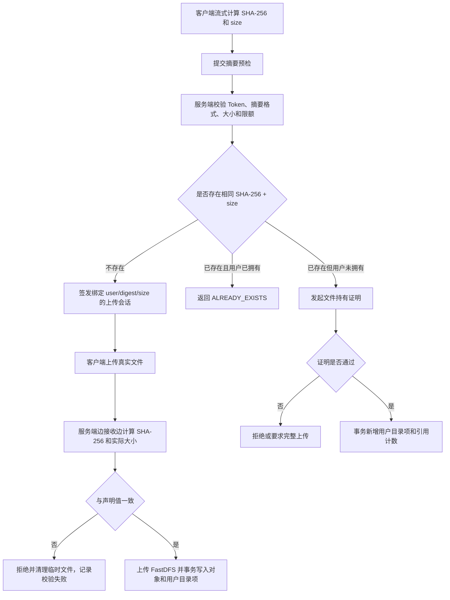
```mermaid
flowchart TD
    A["客户端流式计算 SHA-256 和 size"] --> B["提交摘要预检"]
    B --> C["服务端校验 Token、摘要格式、大小和限额"]
    C --> D{"是否存在相同 SHA-256 + size"}
    D -->|"不存在"| E["签发绑定 user/digest/size 的上传会话"]
    E --> F["客户端上传真实文件"]
    F --> G["服务端边接收边计算 SHA-256 和实际大小"]
    G --> H{"与声明值一致"}
    H -->|"否"| I["拒绝并清理临时文件，记录校验失败"]
    H -->|"是"| J["上传 FastDFS 并事务写入对象和用户目录项"]
    D -->|"已存在且用户已拥有"| K["返回 ALREADY_EXISTS"]
    D -->|"已存在但用户未拥有"| L["发起文件持有证明"]
    L --> M{"证明是否通过"}
    M -->|"否"| N["拒绝或要求完整上传"]
    M -->|"是"| O["事务新增用户目录项和引用计数"]
```

#### 19.4.1 真实上传必须由服务端复算

服务端应在接收文件流或写临时文件时增量计算 SHA-256，同时统计实际字节数，避免为了校验再完整读取一次文件。只有在以下条件同时满足时才能写入正式元数据：

```text
actual_sha256 == declared_sha256
actual_size   == declared_size
```

不一致时应返回稳定错误，例如 `DIGEST_MISMATCH` 或 `SIZE_MISMATCH`，删除临时文件，并记录请求 ID、用户、算法、摘要前缀、声明/实际大小、失败阶段和耗时；不能记录完整 Token 或文件正文。

#### 19.4.2 命中时增加文件持有证明

一种可解释的面试方案是：服务端返回随机 `nonce` 和若干随机文件分块位置，客户端读取本地文件对应分块并返回带 `nonce` 的分块摘要，服务端根据存储文件或预计算分块摘要进行验证。验证通过后才能建立跨用户引用。

如果当前 FastDFS 访问方式不适合随机读取，或者项目暂时不准备维护分块摘要，可选择：

1. 只在同一用户范围内秒传；
2. 只允许跨用户秒传已经公开分享的文件；
3. 命中后仍要求完整上传，由服务端复算并去重，牺牲“秒传”换取清晰的安全边界。

需要强调：随机分块证明主要证明客户端持有文件内容，不天然证明其获得文件的方式合法；高敏感业务仍需结合租户边界、权限和审计策略。

#### 19.4.3 上传会话要绑定预检结果

预检未命中后，可由服务端签发短时有效、一次性使用的 `upload_session_id`，绑定：

- 认证用户；
- `hash_algorithm`、`content_digest` 和 `size`；
- 文件名或目标目录；
- 过期时间、文件大小上限和使用状态。

`/api/upload` 必须携带该会话，服务端不能仅凭客户端再次提交的一组自由字段入库。这样可以降低绕过预检、篡改元数据和重放请求的风险。

### 19.5 API 契约不要与具体算法名称绑定

历史接口可以暂时保留 `/api/md5`，新版本建议使用算法无关的路径，例如：

```http
POST /api/files/instant-upload
Authorization: Bearer <token>
Content-Type: application/json
```

```json
{
  "algorithm": "sha256",
  "digest": "64位十六进制摘要",
  "size": 1048576,
  "filename": "example.zip"
}
```

建议使用明确的业务状态，而不是继续让 `code=0/1/5` 在不同接口中表达不同含义：

| 业务状态 | 含义 | 客户端下一步 |
|---|---|---|
| `UPLOAD_REQUIRED` | 全局没有候选对象 | 使用上传会话传真实文件 |
| `PROOF_REQUIRED` | 有候选对象，但需证明持有文件 | 完成分块挑战 |
| `INSTANT_UPLOAD_CREATED` | 已安全创建用户引用 | 上传结束 |
| `ALREADY_EXISTS` | 当前用户目录已存在 | 提示重复或定位已有目录项 |
| `DIGEST_MISMATCH` | 实际内容摘要不一致 | 终止并检查文件/客户端实现 |
| `UPLOAD_SESSION_EXPIRED` | 上传会话过期或已使用 | 重新预检 |

用户身份应从 Token 中取得；如果请求体仍携带 `user`，服务端必须验证它与 Token 身份一致，不能把客户端提交的用户名当作授权依据。

### 19.6 并发、事务与幂等仍是正确性的核心

秒传事务可以按以下原则设计：

1. 尝试插入用户目录项，由唯一约束裁决是否已经存在；
2. 只有目录项确实新增一行时，才执行 `ref_count = ref_count + 1`；
3. 同一事务内更新或生成 `user_file_count`；
4. 唯一键冲突按幂等结果返回，不重复增加计数；
5. 事务提交后才能返回成功。

不要使用“先读出 `count`，在应用层加一，再覆盖写回”的方式，应使用原子更新：

```sql
UPDATE file_object
SET ref_count = ref_count + 1
WHERE object_id = ? AND status = 'active';
```

真实上传还存在“两个请求同时预检未命中并同时上传”的竞态。数据库中 `(algorithm, digest, size)` 的唯一约束应作为最终裁决者：一个请求创建正式物理对象，另一个请求在唯一键冲突后转为引用已存在对象，并补偿删除自己刚上传的重复 FastDFS 文件。补偿失败时写入可重试任务，不能只打印错误后遗忘。

客户端重试可使用 `Idempotency-Key` 或业务请求 ID。相同用户、相同目标目录项和相同幂等键的重复请求，应返回第一次执行后的稳定结果。

### 19.7 从 MD5 平滑迁移到 SHA-256

MD5 不能推导出 SHA-256，存量对象必须重新读取 FastDFS 文件内容才能计算新的摘要。可以分阶段迁移：

| 阶段 | 动作 | 关键检查 |
|---:|---|---|
| 1 | 增加稳定 `object_id`、SHA-256/通用摘要字段和迁移状态 | 不破坏旧 MD5 查询与关联 |
| 2 | 新上传由服务端同时计算并保存 SHA-256，必要时临时保留 MD5 | 校验实际大小和摘要，监控失败率 |
| 3 | 后台按 `storage_file_id` 流式读取存量文件并回填 SHA-256 | 文件丢失、大小不符、读取失败均单独标记 |
| 4 | 新接口优先按 SHA-256 查询，旧 `/api/md5` 作为兼容入口 | 双读结果一致，不能静默关联到不同对象 |
| 5 | 关联表改用 `object_id`，Redis 改用 `share_id` 并重建索引 | 对账引用数、目录项数和排行榜成员 |
| 6 | 客户端全部升级后停止 MD5 写入，再评估删除旧字段 | 先观察一段时间并保留可回滚方案 |

回填时如果发现多个旧记录得到相同 SHA-256，需要先核对真实内容、文件大小和用户引用，再决定是否合并物理对象。不能直接删除其中一条记录，因为它可能仍被用户目录项、分享记录或 Redis 索引引用。

### 19.8 性能优化应该放在正确的位置

SHA-256 与 MD5 都需要完整扫描文件，时间复杂度都是 `O(n)`。SHA-256 的单字节计算成本通常更高，但现代 CPU 可能有 SHA 指令加速；网盘上传更常见的瓶颈仍是磁盘和网络，因此不能脱离目标机器、密码库、文件大小分布直接断言哪一个更快。

建议实际优化：

- 客户端和服务端都使用流式摘要，避免把整个大文件读入内存；
- 服务端在写临时文件时同步计算摘要，避免第二次磁盘扫描；
- 数据库使用二进制摘要和复合索引，避免 `CHAR(64)` 的额外空间与排序规则问题；
- 大文件使用分块上传、断点续传和分块校验；
- 若需要块级去重，可保存分块摘要并使用 Merkle Root 表示整文件；单个全文件 SHA-256 只能做整文件去重；
- 对摘要预检、证明接口和失败重试进行限流，防止摘要枚举和资源滥用；
- 通过基准测试比较摘要吞吐、磁盘吞吐、上传耗时和 CPU 占用，再决定线程数与是否启用硬件加速。

不要为了阻止摘要枚举而给每个文件摘要直接加入随机盐：随机盐会让相同内容得到不同摘要，从而破坏全局去重。如果隐私优先，可以改为租户内去重，或研究基于租户密钥的 HMAC/收敛加密方案，但后者会引入密钥管理和确认攻击等新的复杂性。

### 19.9 细粒度日志、指标与测试矩阵

建议为秒传和迁移链路记录结构化事件：

```text
instant_check_started / instant_check_result
proof_issued / proof_verified / proof_failed
upload_session_issued / upload_session_rejected
upload_hash_verified / upload_hash_mismatch
file_object_created / user_reference_created
duplicate_upload_detected / duplicate_object_cleanup
transaction_committed / transaction_rolled_back
sha256_backfill_started / sha256_backfill_completed / sha256_backfill_failed
```

每条日志至少包含 `request_id`、阶段、用户内部 ID、算法、摘要前缀、声明/实际大小、`object_id`、数据库影响行数、FastDFS `file_id`、业务结果、耗时和可重试性。严禁记录完整 Token、密码、文件正文；对文件名和完整摘要也应按敏感级别脱敏。

最低测试矩阵：

| 类型 | 必测场景 |
|---|---|
| 格式 | SHA-256 长度错误、非十六进制、大小为负数/超限、字段缺失 |
| 真实性 | 声明摘要与真实内容不一致、声明大小不一致、直接绕过预检上传 |
| 权限 | Token 与用户不一致、只知道摘要但不持有文件、证明过期或重放 |
| 并发 | 同一用户重复秒传、多个用户同时秒传、两个客户端同时上传同一新文件 |
| 一致性 | FastDFS 成功但 MySQL 失败、事务提交后响应丢失、补偿删除失败 |
| 生命周期 | 秒传与删除并发、最后引用删除与新引用并发、对象处于 `deleting` 状态时命中 |
| 迁移 | 仅有 MD5 的旧对象、回填失败、实体丢失、相同 SHA-256 的重复物理对象 |
| 对账 | `ref_count` 与目录项数量一致、用户文件计数一致、Redis 可由 MySQL 重建 |

### 19.10 面试时可以这样回答

#### 30 秒回答

> 原项目用 MD5 做全局内容指纹，实现方式是客户端先上报 MD5，服务端命中后只新增用户文件关系和引用计数。教学项目这样做容易理解，但生产环境不应把 MD5 当作对抗恶意输入的强唯一标识。我会升级到 SHA-256，并结合文件大小查询；不过更关键的是服务端要在真实上传时流式复算摘要，跨用户秒传要做文件持有证明。同时我会用稳定的 `object_id` 建表关系，以唯一约束、事务、幂等和失败补偿处理并发与 FastDFS/MySQL 一致性。这样才是完整优化，而不是只把 32 位 MD5 换成 64 位 SHA-256。

#### 进一步追问与回答要点

| 面试官追问 | 回答要点 |
|---|---|
| 为什么不用原来的 MD5？ | 非恶意场景下意外碰撞概率虽低，但系统接收客户端可控输入，MD5 已不适合作为强内容标识；SHA-256 的抗碰撞能力和生态更合适。 |
| 换 SHA-256 会明显变慢吗？ | 不一定，取决于硬件和库；网盘常受网络/磁盘限制。通过流式计算避免额外 I/O，并用基准测试验证，不凭感觉判断。 |
| 为什么还要文件大小？ | 可快速排除明显不匹配、校验请求一致性、减少无效查询；它是辅助条件，不替代摘要和真实内容校验。 |
| SHA-256 已经很安全，为什么服务端还要复算？ | 算法安全不等于输入可信。客户端可以直接谎报一个 SHA-256，而不需要制造碰撞；服务端必须以实际收到的字节为准。 |
| 服务端复算会不会破坏秒传？ | 未命中真实上传时复算；命中时通过文件持有证明验证，因此不需要再次上传完整文件。 |
| 为什么不能知道 SHA-256 就直接秒传？ | 摘要可能公开或可猜测，知道摘要不能证明持有内容，还可能泄露文件是否存在。 |
| 为什么不继续用摘要做数据库主键？ | 摘要算法可能迁移，目录项还有文件名、所有者和分享状态等独立身份；稳定 `object_id` 能降低算法与业务关系的耦合。 |
| 两个用户同时上传相同新文件怎么办？ | 以 `(algorithm, digest, size)` 唯一约束做最终裁决；一个创建对象，另一个转为新增引用，并补偿删除重复的 FastDFS 文件。 |
| 存量 MD5 怎样迁移成 SHA-256？ | 无法直接转换，必须重新读取每个 FastDFS 对象计算 SHA-256；采用双写、回填、双读、切流、停写的渐进迁移。 |
| 给摘要加盐是否更安全？ | 随机盐会破坏相同内容得到相同摘要的性质，从而失去全局去重；隐私要求高时应考虑租户内去重，而不是简单加盐。 |
| 密码字段也能直接换成 SHA-256 吗？ | 不能。文件内容摘要和密码存储是两个问题；密码应使用 Argon2id、scrypt、bcrypt 或 PBKDF2，并使用每用户随机盐。 |

### 19.11 最终记忆卡片

```text
原项目：MD5 既做内容指纹，又充当跨表和接口标识
升级目标：SHA-256 + size，但它是可靠性/安全升级，不是必然的提速
信任边界：客户端摘要只用于预检，真实上传必须由服务端流式复算
跨用户秒传：知道摘要不等于持有文件，需要持有证明或缩小去重范围
数据模型：摘要识别内容，object_id 建立业务关系
并发正确性：唯一约束 + 事务 + 原子计数 + 幂等
跨存储一致性：FastDFS 成功、MySQL 失败必须补偿或进入可重试任务
迁移：MD5 不能推导 SHA-256，只能重新读取实体并渐进回填
性能：避免二次读取和整文件入内存；大文件进一步做分块与断点续传
面试重点：不要只回答“SHA-256 比 MD5 安全”，要说明信任、权限、并发和迁移
```
