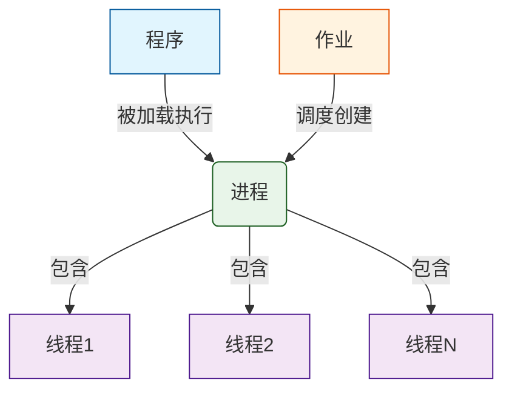

# 《操作系统》知识点与考点整理

> 依据工作区内六份课件 PDF 整理：第一章操作系统概论、第二章处理器管理、第三章同步通信与死锁、第四章存储管理、第五章设备管理、第六章文件管理。本文面向期末复习，尽量把“是什么、为什么、怎么考”放在一起说明。

## 使用说明

这份文档适合按“先看框架、再读考点、最后刷例题”的顺序使用。阅读时优先关注每章开头的“本章速览”，以及正文中的“重点提示、易混提醒、解题入口”。这些位置通常对应选择题、简答题和计算题中最容易设问的地方。

### 标注约定

| 标注       | 含义               | 建议用法         |
| -------- | ---------------- | ------------ |
| **本章速览** | 说明这一章主要解决什么问题    | 通读前先看，建立章节地图 |
| **重点提示** | 必须记住的定义、公式、条件或结论 | 考前快速背诵       |
| **易混提醒** | 容易混淆、容易选错的概念     | 做选择题、判断题前复看  |
| **解题入口** | 计算题或综合题的第一步      | 训练做题顺序       |
| **对比表**  | 相似概念的异同整理        | 简答题、辨析题可直接借鉴 |

### 快速目录

1. [操作系统概论](#一操作系统概论)：操作系统作用、特性、发展、系统调用与结构。
2. [处理器管理](#二处理器管理)：中断、进程、线程、调度算法。
3. [同步、通信与死锁](#三同步通信与死锁)：临界区、信号量、经典同步问题、死锁。
4. [存储管理](#四存储管理)：连续分配、分页、分段、虚拟存储、页面置换。
5. [设备管理](#五设备管理)：I/O 控制、缓冲、磁盘调度、SPOOLing。
6. [文件管理](#六文件管理)：文件目录、inode、文件物理结构、共享、空闲空间管理。
7. [常见考试题型速记](#七常见考试题型速记)：概念辨析、计算题、PV 题、简答模板。

---

## 一、操作系统概论

> **本章速览：** 本章回答“操作系统是什么、为什么需要它、它怎样向用户和程序提供服务”。复习重点是操作系统的资源管理作用、四大特性、系统调用以及几种常见系统结构。
### 前情提要：操作系统的概念：
#### 1. 操作系统的定义：

- **教材定义**：操作系统（Operating System，简称OS）是**管理系统资源**、**控制程序执行**、**改善人机界面**、**提供各种服务**、**合理组织计算机工作流程**和为用户有效使用计算机**提供良好运行环境**的一种**系统软件**。
- 其他权威定义：操作系统是一组控制和管理计算机硬件和软件资源，合理对各类作业进行调度，以及方便用户使用的程序的集合

#### 2. 操作系统的作用：

1. **服务用户观点：** 操作系统作为==用户接口==和==公共服务程序==
	- 用户对计算机系统的需求和现有硬件功能之间存在巨大差距；
	- 从内部看，操作系统对计算机硬件进行改造和扩充，为应用程序提供支持；
	- 从外部看，操作系统提供友好的人机接口，使用户能够方便、安全、高效地使用硬件；
	- 操作系统还能够合理地组织计算机的工作流程，协调各个机器部件有效地工作。
2. **进程交互观点**：操作系统作为==进程执行的控制者和执行者==。
	- 进程是执行中的程序，操作系统内部有多个进程在执行，操作系统会协调进程的执行，并解决进程之间同步、通信和死锁问题。
3. **系统实现观点：** 操作系统作为==扩展机或虚拟机==。
	- 裸机提供的是机器语言接口，难懂难用；操作系统对裸机逐层添加功能，使得裸机更易用；
	- 扩充后的虚拟机并没有从物理上增加裸机的功能，只 是从逻辑上扩充了计算机的硬件功能。
	- 例：进程管理、虚拟存储管理、I/O 设备管理、文件管理、窗口管理；
4. **资源管理观点**：操作系统作为==资源的管理者和控制者==
	- 在操作系统中，能分配给用户使用的各种硬件和软件设施总称为资源；
	- 资源包括两大类：**硬件资源**和**信息资源**
		- 硬件资源主要包括：处理器、存储器、I/O设备等
		- 信息资源主要包括：程序和数据等
	- 操作系统课程内容的体系结构正是从操作系统是计算机系统资源管理者的角度来组织和构建的

> **总结：操作系统既是“管理员”，又是“服务员”** 
> - **对内**作为“管理员”，做好计算机系统软硬件资源的管理、控制与调度，提高系统效率和资源利用率；
> - **对外**作为“服务员”，是用户和硬件之间的接口和人机界面，为用户提供尽可能友善的运行环境和最佳服务

#### 3. 操作系统的功能：
- 操作系统的基本功能主要包括：**处理机管理、存储管理、设备管理、文件管理、联网与通信管理**。
	- **处理机管理**：处理中断事件，进行处理器调度；具体涉及进程控制与管理、进程同步与互斥、进程通信与死锁、线程控制与管理，以及高级（作业）调度、中级（中程）调度、低级（进程）调度。
	- **存储管理**：负责存储分配、存储共享、地址转换与存储保护、存储扩充。
	- **设备管理**：处理中断，管理缓冲区，提供设备独立性并完成逻辑设备到物理设备的映射，负责外设分配与回收、共享设备驱动调度和虚拟设备实现。
	- **文件管理**：提供文件的逻辑组织、物理组织、存取方法和使用方法，完成目录管理、共享与安全控制、存储空间管理。
	- **联网与通信管理**：负责网络资源管理、数据通信管理、应用服务以及故障、安全、性能、日志和配置等网络管理工作。
--- 
### 1.1 操作系统与计算机系统

#### **1. 知识点：操作系统的位置与作用**

操作系统是==最靠近硬件的一层软件==，其处在硬件与用户程序之间。向下，它管理处理器、内存、设备、文件等硬件资源；向上，它为用户和程序提供方便、安全、统一的使用接口。

通俗地说，用户并不直接和磁盘扇区、内存地址、设备寄存器打交道，而是通过“进程、文件、虚拟内存、系统调用”等抽象来使用计算机。

> **重点提示：** 这类题常考“操作系统是资源管理者还是扩展机器”。前者强调管理 CPU、内存、设备、文件；后者强调把复杂硬件包装成好用的抽象。

> **例题讲解：**
> 
> 题：下列哪一项最能体现操作系统“扩展机器”的作用？  
> A. 提高 CPU 主频  
> B. 把磁盘抽象为文件  
> C. 增大内存条容量  
> D. 改变显示器分辨率
> 
> 答案：B。  
> 讲解：扩展机器强调“把难用的硬件包装成好用的抽象”。磁盘本来由柱面、磁道、扇区组成，操作系统把它变成用户熟悉的文件和目录，这正是扩展机器的体现。

---

#### **2. 知识点：资源管理技术**

操作系统常用三类资源管理技术：

1. **资源复用**：多个程序共享同一类资源。空分复用是把资源按空间分开，如内存分区；时分复用是按时间轮流使用，如 CPU 时间片。
2. **资源虚化**：把一个物理资源变成多个逻辑资源，如一台 CPU 通过进程调度表现为多个“虚处理器”。
3. **资源抽象**：隐藏硬件细节，提供更高层的使用对象，如文件、进程、虚存。

> **例题讲解：**
> 
> 题：多道程序系统中，多个进程轮流占用 CPU，这属于哪种资源管理技术？
> 
> 答案：时分复用。  
> 讲解：CPU 同一时刻只能执行一个进程，但操作系统通过定时中断和调度，让多个进程按时间片交替执行，用户感觉它们像是在同时运行。

---

#### **3. 知识点：操作系统的基本抽象**

常见基础抽象包括：

1. **进程抽象**：运行中的程序，是系统进行资源分配和调度的重要对象。
2. **虚存抽象**：让每个进程拥有独立、连续、较大的逻辑地址空间。
3. **文件抽象**：把外存信息组织成可命名、可保护、可共享的数据对象。

> **例题讲解：**
> 
> 题：为什么说进程不是程序本身？
> 
> 答案：程序是静态代码，进程是程序的一次动态执行。  
> 讲解：同一个浏览器程序可以启动多个窗口或多个进程，它们代码相同，但运行状态、打开文件、寄存器内容、内存数据可能不同，所以进程更像“程序运行起来后的生命体”。

---
#### 📊 操作系统：资源管理技术 vs 基本抽象 对比表

| 对比维度        | 资源管理技术 (Resource Management)                                                            | 基本抽象 (Basic Abstraction)                                          |
| :---------- | :-------------------------------------------------------------------------------------- | :---------------------------------------------------------------- |
| **核心定义**    | 操作系统**如何高效、公平地分配和控制**硬件资源的策略与手段。                                                        | 操作系统**向用户/程序提供的简化视图**，隐藏底层硬件复杂性。                                  |
| **本质属性**    | **“怎么做”**：是一种管理机制、调度算法或复用策略。                                                            | **“是什么”**：是一种逻辑概念、接口模型或数据结构。                                      |
| **主要目的**    | 提高资源利用率、保证公平性、避免冲突与死锁。                                                                  | 降低编程复杂度、提供统一接口、实现隔离与保护。                                           |
| **面向对象**    | 面向**物理硬件资源**（CPU、内存、磁盘、I/O设备）。                                                          | 面向**程序员/用户**，提供比硬件更易用的逻辑实体。                                       |
| **典型分类/实例** | ① **资源复用**：空分复用（内存分区）、时分复用（CPU时间片）② **资源虚化**：虚拟处理器、虚拟内存③ **资源抽象**（作为管理手段时）：将裸设备封装为可管理对象 | ① **进程**：运行中程序的动态执行实体② **虚存**：独立、连续的逻辑地址空间③ **文件**：可命名、可保护的外存数据对象 |
| **相互关系**    | 是**实现**抽象的底层支撑。例如：通过“时分复用”和“资源虚化”技术，才能实现“进程”这一抽象。                                       | 是资源管理技术的**上层呈现**。例如：“虚存抽象”是“空分复用+资源虚化”等技术共同作用后对用户暴露的结果。           |
| **类比理解**    | 像餐厅的**后厨管理系统**：排班表（时分复用）、灶台分区（空分复用）、把大锅拆成小份（虚化）。                                        | 像餐厅的**菜单和点餐界面**：顾客只需说“宫保鸡丁”（文件），不需要知道哪个厨师在哪口锅上炒的。                 |

- **看问题角度**：
	- 如果描述的是"多个实体如何共享/竞争一个物理资源"，属于**资源管理技术**；
	- 如果描述的是"给用户提供了一个什么样的逻辑对象/接口"，属于**基本抽象**。
- **注意交叉术语**：
	- "资源抽象"本身既是三类管理技术之一，其产物又构成了"基本抽象"。
	- **区分关键在于语境**——当强调"把裸盘变成可管理的块设备"这一**过程/手段**时，它是管理技术；当强调"文件这个概念本身"作为**编程接口**时，它是基本抽象。
- **考试判断技巧**：
	- 题目问"操作系统用什么方法让多进程共用CPU"→ 答**时分复用**（管理技术）；
	- 题目问"操作系统给程序员提供了什么来表示一个正在运行的程序"→ 答**进程**（基本抽象）。

---
### 1.2 操作系统的定义、功能与特性

#### **4. 知识点：操作系统定义**

操作系统是控制和管理计算机硬件与软件资源、合理组织计算机工作流程、方便用户使用计算机的系统软件。

这个定义常从四个角度理解：

1. **用户服务观点**：提供命令、图形界面、程序接口等服务。
2. **资源管理观点**：管理 CPU、内存、设备、文件。
3. **进程交互观点**：协调并发进程之间的竞争与协作。
4. **系统实现观点**：由内核、系统程序、接口等共同构成。

> **例题讲解：**
> 
> 题：操作系统是应用软件吗？
> 
> 答案：不是，它是系统软件。  
> 讲解：应用软件面向具体任务，如写文档、浏览网页；操作系统面向所有程序，为它们提供运行环境和资源管理能力。

---

#### **5. 知识点：操作系统四大特性（基本特征）**

1. **并发性**：多个程序在同一时间段内推进。
2. **共享性**：系统资源可被多个进程共同使用。
3. **虚拟性**：把一个物理实体变成多个逻辑实体，或把多个物理实体表现为一个逻辑实体。
4. **异步性**：进程推进速度不可预知，受调度、中断、资源等待影响。

- **并发与共享互为条件**：没有并发，就谈不上多个进程同时争用资源；没有共享，并发程序很难协作完成任务。
- 没有并发和共享，虚拟和异步也无从谈起。

> **易混提醒：** 并发强调“同一时间段内都在推进”，并行强调“同一时刻真的同时执行”。单核 CPU 可以并发，不一定能并行。

> **例题讲解：**
> 
> 题：某程序每次运行结果都可能受其他进程影响，这主要体现了操作系统的哪一特性？
> 
> 答案：异步性。  
> 讲解：多道程序环境中，进程什么时候被调度、什么时候被中断、什么时候获得资源都不完全确定，因此执行顺序可能变化。

---
### 1.3 操作系统的发展与分类

> **本节脉络：** 操作系统不是一开始就完整出现的，而是在“人机矛盾”和“CPU 与慢速 I/O 设备矛盾”不断加剧的过程中逐步形成的。复习时应抓住每一阶段的主要特点、暴露的问题，以及下一阶段如何解决这些问题。

#### **操作系统形成与发展的阶段梳理**

| 发展阶段       | 主要特点                                                                           | 暴露的问题                                                          | 解决思路或后续发展                                    |
| ---------- | ------------------------------------------------------------------------------ | -------------------------------------------------------------- | -------------------------------------------- |
| 人工操作阶段     | 1. 用户独占整台计算机；2. 程序、数据、结果输出都依赖人工装入和操作；3. 程序执行过程与输入输出过程联机进行                      | 1. 手工操作多，容易出错；2. CPU 经常等待人工和慢速 I/O；3. 从上机到下机时间长，系统资源利用率低       | 需要把重复操作自动化，减少人工干预，提高处理机利用率                   |
| 执行系统阶段     | 1. 引入控制程序或执行系统，自动完成“装入、编译/汇编、执行、输出”等步骤；2. 用户通过作业控制语言描述作业处理过程；3. 作业可成批输入并自动顺序执行 | 1. 自动化程度提高，但主存中通常仍主要运行一道作业；2. 当作业等待 I/O 时，CPU 仍可能空闲；3. 用户交互能力弱 | 通过成批处理和作业自动切换减少人工等待，并进一步需要让多个程序共享系统资源        |
| 多道程序设计阶段   | 1. 多个程序同时进入主存，在宏观上并发运行，微观上轮流占用 CPU；2. 依靠中断、通道等硬件基础，使 CPU 与外设尽可能并行工作            | 1. 每个作业自身的完成时间可能变长；2. 作业周转时间可能增加；3. 缺乏交互能力；多道程序道数不能无限增加        | 形成资源管理、处理器调度、存储保护、I/O 管理等操作系统核心功能，推动操作系统正式形成 |
| 多道批处理操作系统  | 1. 将多个作业成批提交，由系统自动调度和控制执行；2. 目标是提高资源利用率和系统吞吐量                                  | 1. 用户脱机工作，交互性差；2. 不适合频繁调试和即时反馈的任务                              | 发展出分时系统，让多个联机用户通过终端交互使用计算机                   |
| 分时操作系统     | 1. 多个终端用户同时联机使用主机；2. CPU 按时间片轮流为用户服务；用户感觉像独占计算机                                | 1. 时间片过短会导致切换开销大，过长会导致响应慢；2. 主要面向通用交互，不适合严格截止时间任务              | 引入更合理的调度策略和交互机制；对有严格时间要求的场景发展出实时系统           |
| 实时操作系统     | 1. 外部事件或数据到来时，系统必须在规定时间内响应并完成处理；2. 常用于过程控制、信息查询、事务处理等场景                        | 1. 设计目标更专用，对可靠性、及时性和调度策略要求高；2. 并不追求一般意义上的用户交互便利                | 采用中断机制、优先级调度、抢占式调度等方式保证实时响应                  |
| 现代操作系统扩展阶段 | 在批处理、分时、实时基础上继续发展出微机、并行、网络、分布式、嵌入式等操作系统                                        | 计算机体系结构、网络环境、用户需求不断变化，单一形态难以覆盖全部应用                             | 操作系统继续围绕资源利用率、用户便利性、可靠性、安全性和新硬件支持不断演进        |


> **重点提示：** 这张表的主线可以概括为：人工操作解决不了效率问题，于是出现执行系统；执行系统仍难以充分利用 CPU，于是出现多道程序设计；多道程序设计推动了处理器管理、存储管理、设备管理和文件管理等核心功能，操作系统由此正式形成。

---

#### **6. 知识点：多道程序设计**

多道程序设计是把多个作业同时装入内存，让它们共享系统资源并交替执行。它提高了 CPU 和 I/O 设备利用率，也提高了系统吞吐量。

需要注意：多道程序设计提升的是“系统整体效率”，并不一定使每个作业都更快完成。

> **例题讲解：**
> 
> 题：为什么多道程序设计能提高 CPU 利用率？
> 
> 答案：当一个程序等待 I/O 时，CPU 可以转去执行另一个程序。  
> 讲解：单道环境中，程序读磁盘时 CPU 可能空闲；多道环境中，操作系统把 CPU 分给就绪进程，使 CPU 尽量少等待。

---

#### **7. 知识点：操作系统的基本类型：批处理、分时、实时系统**

1. **实时操作系统**：用户把要计算的应用问题编成程序，连同数据和作业说明书一起交给操作员，操作员集中一批作业，输入到计算机中。 然后，由操作系统来调度和控制作业的执行。这种批量化处理作业方式的操作系统称为批处理操作系统。
	- **用户编程 → 批量输入 → 脱机运行 → 成批处理 → 作业调度**
2. **分时操作系统**：允许多个联机用户**同时**使用一台计算机系统进行计算的操作系统称分时操作系统
	- 在一台主机上连接有多个终端，每个用户在各自的终端上以问答方式控制程序运行，主机中央处理器轮流为每个终端用户服务一段很短的时间，这段时间称为一个时间片，若一个终端用户的程序在一个时间片内未执行完，则挂起， 等待再次分到时间片时继续运行。这样使得每个用户感到自己好像在独占一台计算机。
	- **同时性**：若干个终端用户同时联机使用计算机
	- **独立性**：每个用户感到自己好像独占一台计算机
	- **及时性**：用户发出的命令能够很快被主机响应 
	- **交互性**：人机交互，联机工作，方便调试、修改程序
3. **实时操作系统**：指当外界事件或数据产生时，能接收并以**足够快的速度**予以处理，处理的结果又能在**规定时间**内来控制监控的生产过程或对处理系统作出快速响应，并控制所有实时任务**协 调一致运行**的操作系统。
	- **过程控制系统**：如生产过程控制系统、导弹制导系统、飞机自动驾驶系统、火炮自动控制系统；
	- **信息查询系统**：计算机同时从成百上千的终端接受服 务请求和提问，并在短时间内作出回答和响应。如情报检索系统
	- **事务处理系统**：计算机不仅要对终端用户及时作出响应，还要频繁更新系统中的文件或数据库。如银行业务系统。

|比较维度|批处理操作系统|分时操作系统|实时操作系统|
|---|---|---|---|
|设计目标|提高资源利用率和作业吞吐量|满足多个联机用户的即时响应（快速交互）|保证任务在严格时限内完成（确定性响应）|
|作业性质|适应已调试好的大型作业（离线、非交互）|适应正在调试的小型作业（在线、交互式）|适应外部事件驱动的紧急任务（如控制、监测）|
|用户交互方式|无直接交互；用户提交作业控制说明书后脱机工作|多用户联机交互；通过终端键盘直接输入命令控制作业运行|通常无传统用户交互；由传感器/设备触发任务，系统自动响应|
|资源使用率|较高（减少人工干预空闲时间）|相对较低（为响应时间牺牲部分效率）|视具体类型而定；硬实时系统常优先保障时效性而非利用率|
|作业控制方式|用户预先提交作业控制说明书（JCL）|用户实时输入命令直接控制作业执行过程|由事件触发 + 调度算法自动控制（如优先级抢占）|
|典型应用场景|科学计算、大数据批量处理|多用户终端系统（如早期UNIX、Linux终端）|工业控制、航空航天、汽车电子、医疗设备等|
|系统类型定位|专用型（面向后台计算）|通用型（提供交互式开发/运行环境）|专用型（面向特定实时需求）|
|是否属于通用OS？|否|是（常作为通用OS核心功能之一）|否（但现代通用OS可集成实时扩展）|

- 若一个操作系统**同时具备批处理、分时、实时中两种或全部功能**，则称为**通用操作系统**（如现代Linux可通过配置支持实时调度，也支持批处理与分时交互）。

> 1. **批处理系统**：成批处理作业，追求吞吐量，交互性弱。
> 2. **分时系统**：多个用户通过终端交互使用系统，追求较短响应时间。
> 3. **实时系统**：要求在规定时间内完成响应，强调及时性和可靠性。

> **例题讲解：**
> 
> 题：银行 ATM、飞机控制系统、学生机房分别更接近哪类系统？
> 
> 答案：ATM 和学生机房更偏分时/交互系统，飞机控制系统属于实时系统。  
> 讲解：实时系统的关键不是“速度快”，而是“必须在截止时间前完成”。飞机控制晚几秒可能就失去意义。

---
### 1.4 用户接口、系统调用与操作系统结构

#### **8. 知识点：系统调用**

系统调用是用户程序请求操作系统内核服务的接口。常见系统调用包括进程控制、文件操作、设备操作、信息维护、通信等。

系统调用不同于普通函数调用：普通函数通常在用户态内部完成；系统调用会引起从用户态到内核态的切换，由内核完成受保护的操作。

> **例题讲解：**
> 
> 题：`printf()` 一定是系统调用吗？
> 
> 答案：不一定。  
> 讲解：`printf()` 是 C 库函数。它可能先在用户态格式化和缓冲数据，真正需要输出到终端或文件时，才通过 `write` 等系统调用进入内核。

---

#### **9. 知识点：操作系统结构**

常见结构包括：

1. **单体式结构**：内核功能集中，效率高，但模块边界不清，维护难度较大。
2. **层次式结构**：按层组织，每层只依赖低层，结构清晰。
3. **虚拟机结构**：在真实硬件上模拟多个虚拟机器。
4. **微内核结构**：内核只保留最基本功能，如进程通信、低级调度、基本内存管理；其他服务放到用户态。

> **例题讲解：**
> 
> 题：微内核结构为什么可靠性较好？
> 
> 答案：许多系统服务运行在用户态，某个服务出错不一定导致整个内核崩溃。  
> 讲解：微内核把系统拆得更细，故障隔离更好，但用户态服务和内核之间通信更多，可能带来额外开销。

---

## 二、处理器管理

> **本章速览：** 本章围绕“CPU 怎样安全、有效地交给不同程序使用”展开。中断负责把控制权交回内核，PCB 负责保存进程信息，调度算法负责决定下一个运行者。

### 2.1 处理器状态与中断

#### **10. 知识点：内核态与用户态**

处理器通常至少有两种运行状态：

1. **用户态**：运行普通用户程序，不能执行特权指令。
2. **内核态**：运行操作系统内核，可执行特权指令并访问受保护资源。

设置两种状态的目的，是防止用户程序随意修改设备、内存管理、时钟等关键资源。

> **例题讲解：**
> 
> 题：用户程序想直接执行关闭中断的指令，会发生什么？
> 
> 答案：会触发异常或中断，转由操作系统处理。  
> 讲解：关闭中断属于特权操作。如果普通程序能随意关闭中断，系统调度和设备响应都会被破坏。

---

#### **11. 知识点：中断、异常与系统调用**

中断是指程序执行过程中，当发生某个事件时，中止CPU上现行程序的运行，并引出处理该事件的程序执行的一整个过程

中断是改变处理器正常执行顺序的一种机制，使操作系统能及时处理外部事件或程序内部错误。

1. **外中断**：来自 CPU 外部，如 I/O 完成、时钟中断。
2. **内中断/异常**：来自当前指令执行过程，如除零、越界、缺页。
3. **访管中断/系统调用**：用户程序主动请求内核服务。

> **易混提醒：** 判断中断类型时先看来源：外设或时钟来自外部，除零和越界来自当前指令，打开文件这类主动请求通常属于系统调用。

> **例题讲解：**
> 
> 题：键盘输入、除零错误、打开文件请求分别属于什么类型？
> 
> 答案：键盘输入是外中断；除零错误是异常；打开文件请求通常通过系统调用进入内核。  
> 讲解：判断来源即可：外设来的属于外中断，程序执行出错属于异常，程序主动请求服务属于系统调用。

---
### 2.2 进程及其实现

#### **12. 知识点：进程的定义与属性**

进程是具有独立功能的程序关于某个数据集合的一次执行过程，也是操作系统进行资源分配和保护的基本单位。

进程具有：

1. **动态性**：有创建、运行、暂停、终止过程。
2. **并发性**：可与其他进程并发执行。
3. **独立性**：拥有相对独立的资源和地址空间。
4. **异步性**：推进速度不可预知。

> **例题讲解：**
> 
> 题：两个进程能执行同一个程序吗？
> 
> 答案：能。  
> 讲解：程序是代码文件，进程是运行实例。两个终端同时运行同一个编辑器，就是两个进程执行同一程序。

---
### **补充**：进程和程序的区别：
| 维度   | 程序 (Program) | 进程 (Process)           |
| :--- | :----------- | :--------------------- |
| 性质   | 静态的指令和数据集合   | 动态的执行活动实体              |
| 存在形式 | 存储在磁盘等介质上的文件 | 驻留在内存中，有生命周期           |
| 组成   | 代码段、数据段      | 程序段 + 数据段 + PCB（进程控制块） |
| 状态   | 无状态变化        | 有创建、就绪、运行、阻塞、终止等状态     |
| 并发性  | 本身不具备并发特征    | 具有并发、异步等动态特征           |
| 生命周期 | 永久存在（除非删除文件） | 临时存在（随执行结束而消亡）         |

---
#### **13. 知识点：进程状态转换**

三态模型包括：

1. **运行态**：正在占用 CPU。
2. **就绪态**：具备运行条件，只差 CPU。
3. **等待态/阻塞态**：等待某事件完成，如 I/O 完成。

典型转换：

1. 就绪态到运行态：被调度。
2. 运行态到就绪态：时间片用完或被抢占。
3. 运行态到等待态：请求 I/O 或等待事件。
4. 等待态到就绪态：等待事件完成。

> **重点提示：** 阻塞态不能直接变成运行态。等待事件完成后只能先回到就绪态，是否马上运行还要由调度器决定。

> **例题讲解：**
> 
> 题：进程等待磁盘读操作完成时处于什么状态？读完成后一定马上运行吗？
> 
> 答案：等待时处于阻塞态；读完成后转为就绪态，不一定马上运行。  
> 讲解：读完成只是说明条件满足，能不能立刻运行还要看调度器是否把 CPU 分给它。

---
#### **14. 知识点：PCB 与进程映像**

PCB 即进程控制块，是操作系统管理进程的核心数据结构。它记录进程标识、状态、优先级、程序计数器、寄存器现场、内存信息、打开文件、调度信息等。

进程映像通常包括程序、数据、栈和 PCB。考试常问：操作系统根据什么管理进程？答案通常是 PCB。

> **例题讲解：**
> 
> 题：进程切换时为什么要保存寄存器和程序计数器？
> 
> 答案：为了将来恢复该进程时能从中断处继续执行。  
> 讲解：切换好比给当前执行现场拍照。没有保存现场，进程下次回来就不知道执行到哪一步了。

---

#### **15. 知识点：进程切换与模式切换**

模式切换是用户态与内核态之间的切换；进程切换是 CPU 从一个进程转到另一个进程。

模式切换是进程切换的**必要前提**，但==二者不等价==：系统调用会发生模式切换，但如果在系统调用结束后仍返回原进程继续执行，就没有发生进程切换。

| 比较维度          | 模式切换 (Mode Switch)                          | 进程切换 (Process Switch)                               |
| :------------ | :------------------------------------------ | :-------------------------------------------------- |
| 基本定义          | CPU在用户态（User Mode）与内核态（Kernel Mode）之间的状态转换。 | CPU从正在运行的进程A切换到另一个进程B的执行权转移。                        |
| 触发原因          | 中断、异常、系统调用（Trap）或中断返回指令。                    | 进程调度（如时间片用完、I/O阻塞、高优先级抢占等）。                         |
| 是否改变当前进程      | ❌ 不改变。仅改变CPU特权级，仍在同一进程内执行。                  | ✅ 改变。CPU开始执行另一个完全不同的进程。                             |
| 涉及的数据结构       | 仅需保存少量寄存器（如PC、PSW、栈指针），通常保存在内核栈或固定硬件区域。     | 需完整保存/恢复进程上下文：通用寄存器、PC、PSW、页表基址寄存器、打开文件表等，操作对象为PCB。 |
| 开销大小          | 🟢 较小（微秒级甚至更低），仅涉及少量寄存器读写和权限位翻转。            | 🔴 较大（数十微秒到毫秒级），除寄存器外还涉及TLB刷新、Cache失效、内存映射切换等。      |
| 执行主体          | 由硬件中断装置自动完成正向切换（用户→内核）；由OS执行返回指令完成反向切换。     | 完全由操作系统内核调度程序（Scheduler）软件实现。                       |
| 对TLB/Cache的影响 | 通常无影响（地址空间未变）。                              | 通常需要刷新TLB（因页表基址改变），可能导致Cache命中率下降。                  |
| 发生频率          | 极高（每次系统调用、中断都会发生）。                          | 相对较低（仅在调度决策点发生）。                                    |
| 依赖关系          | 是进程切换的前提条件（进程切换必须在内核态下完成，因此必然包含模式切换）。       | 包含模式切换，但远不止于此。                                      |
```
所有模式切换 
├── ✅ 不导致进程切换（占绝大多数！） 
│ ├── 系统调用返回用户态（read/write 完成后回到原进程） 
│ ├── 中断处理完毕返回被中断的进程（时钟中断后继续跑原进程） 
│ ├── 异常/缺页处理完毕返回原进程 
│ └── 信号处理函数执行完毕返回用户态 
│
└── ❌ 导致进程切换（仅少数情况） 
	├── 时间片耗尽（时钟中断 → schedule() → 切换到新进程） 
	├── I/O阻塞（read 无数据 → sleep → schedule() → 切换） 
	├── 主动让出CPU（yield/sleep/mutex_lock 阻塞） 
	├── 高优先级进程就绪（抢占式调度） 
	└── 进程终止（exit → schedule() → 切换）
```

> **例题讲解：**
> 
> 题：一次系统调用一定导致进程切换吗？
> 
> 答案：不一定。  
> 讲解：系统调用一定进入内核态，但内核处理完后可能继续运行原进程；只有调度器选择了另一个进程，才发生进程切换。

---
### 2.3 线程

#### **16. 知识点：线程与进程的关系**

线程是进程内的执行流。一个进程可以包含多个线程，线程共享进程的地址空间和资源，但每个线程有自己的程序计数器、寄存器和栈。

引入线程的主要目的，是降低并发执行的开销，提高程序响应性和并行性。

> **例题讲解：**
> 
> 题：多线程程序中，一个线程崩溃是否可能影响同进程的其他线程？
> 
> 答案：可能。  
> 讲解：同一进程内线程共享地址空间，一个线程写坏共享数据，其他线程也会受到影响。这也是多线程编程需要同步的原因。

| 对比维度    | 进程                                 | 线程                                             |
| :------ | :--------------------------------- | :--------------------------------------------- |
| 本质定义    | 资源分配的基本单位                          | CPU调度和执行的基本单位                                  |
| 资源拥有    | 拥有独立的内存空间（代码段、数据段、堆）、文件描述符等完整资源    | 不独立拥有系统资源，仅拥有少量运行必备资源（栈、寄存器、程序计数器），共享所属进程的全部资源 |
| 内存关系    | 进程间内存相互隔离，地址空间独立                   | 同一进程内的线程共享堆、全局变量、静态存储区，各自拥有私有栈空间               |
| 创建/销毁开销 | 大（需分配/回收独立内存空间、建立页表、初始化PCB等）       | 小（仅需创建TCB和私有栈，无需复制内存）                          |
| 切换开销    | 大（涉及虚拟内存切换、TLB刷新、页表加载等）            | 小（同一进程内切换无需切换地址空间，TLB通常有效）                     |
| 通信方式    | 需借助IPC机制（管道、消息队列、共享内存、信号量、Socket等） | 可直接读写共享内存中的数据，但需同步机制（互斥锁、条件变量等）保证安全            |
| 健壮性/隔离性 | 强（一个进程崩溃通常不影响其他进程）                 | 弱（一个线程崩溃可能导致整个进程终止，因共享地址空间）                    |
| 并发性     | 可并发执行，但受限于资源开销，并发粒度较粗              | 可实现更细粒度的并发，适合高并发、I/O密集型场景                      |
| 典型应用场景  | 需要强隔离、独立运行的任务（如不同应用程序、微服务）         | 需要高效协作、共享数据的并行任务（如Web服务器请求处理、GUI响应与后台计算分离）     |

---
### 补充：作业、进程、线程和程序间的关系：

> 这四个概念是操作系统中从“静态代码”到“动态执行”再到“系统管理”的不同抽象层次，它们之间的关系可以概括为：**程序是基础，作业是用户视角的任务单元，进程是系统视角的执行与资源实体，线程是进程内部的轻量级执行流。**
#### 1. 核心定义与关系解析
- **程序**
    - **本质**：一组指令的有序集合，是**静态**的文本文件（如磁盘上的 `.exe` 或 ELF 文件）。
    - **关系**：程序是进程和作业的**物质基础**。没有程序，就没有后续的执行实体。一个程序可以被多个进程同时加载执行（如多个用户同时运行 `vim`）。
- **作业**
    - **本质**：用户在一次计算过程中要求计算机系统完成的一个**完整任务序列**。它是**面向用户**的概念，通常包含程序、数据以及作业说明书（控制命令）。
    - **关系**：作业是进程创建的**触发源**。在批处理系统中，一个作业被调度进入内存后，操作系统会为其创建一个或多个进程来执行。在多道程序环境下，一个作业可能对应一个进程，也可能对应一组协同工作的进程。
- **进程**
    - **本质**：程序的一次执行过程，是系统进行**资源分配和调度的基本单位**。它是**动态**的，具有生命周期（创建、就绪、运行、阻塞、终止）。
    - **关系**：进程是程序的**动态实例化**，也是作业执行的**载体**。进程拥有独立的地址空间和系统资源，是线程存在的容器。
- **线程**
    - **本质**：进程内的一个**独立执行流**，是CPU调度和分派的基本单位。
    - **关系**：线程是进程的**组成部分**。一个进程至少包含一个主线程，也可以包含多个线程。线程共享进程的资源，但拥有独立的执行栈和寄存器状态，实现了进程内部的并发。

可以用以下层级结构理解它们的包含与依赖关系：


| 概念  | 状态属性    | 核心角色   | 与程序的关系    | 与进程的关系         |
| :-- | :------ | :----- | :-------- | :------------- |
| 程序  | 静态      | 指令集合   | 自身        | 是进程的代码模板       |
| 作业  | 动态（任务级） | 用户任务单元 | 包含程序及控制信息 | 一个作业可对应一个或多个进程 |
| 进程  | 动态（执行级） | 资源分配单位 | 是程序的一次执行  | 是线程的容器         |
|线程|动态（执行级）|CPU调度单位|执行程序的代码段|是进程的组成部分|

---

#### **17. 知识点：用户级线程与内核级线程**

1. **用户级线程**：线程管理在用户空间完成，切换快；但一个线程阻塞可能导致整个进程阻塞，内核也难以按线程分配多核 CPU。
2. **内核级线程**：由内核感知和调度，阻塞影响较小，能利用多处理器；但创建、切换开销较大。

**对比表：线程实现方式**

| 比较项      | 用户级线程          | 内核级线程              | 混合式线程       |
| -------- | -------------- | ------------------ | ----------- |
| 管理位置     | 用户空间线程库        | 操作系统内核             | 用户空间与内核共同管理 |
| 内核是否感知线程 | 通常只感知进程        | 能感知每个线程            | 感知部分内核线程    |
| 创建与切换开销  | 小              | 较大                 | 介于二者之间      |
| 阻塞影响     | 一个线程阻塞可能影响整个进程 | 一个线程阻塞通常不影响同进程其他线程 | 取决于映射关系     |
| 多核并行能力   | 较弱             | 较强                 | 较强          |
| 常见考点     | “快但内核看不见”      | “内核能调度但开销大”        | “兼顾灵活性与并行性” |

> **例题讲解：**
> 
> 题：为什么纯用户级线程难以发挥多核优势？
> 
> 答案：内核只看到一个进程，看不到内部多个用户级线程。  
> 讲解：如果内核调度单位不是这些线程，就无法把它们分别放到多个 CPU 核上真正并行。

---
### 2.4 处理器调度

#### **18. 知识点：调度层次**

1. **高级调度/作业调度**：决定哪些作业进入内存。
2. **中级调度**：通过挂起与激活调节内存负载。
3. **低级调度/进程调度**：决定就绪队列中哪个进程获得 CPU。

**对比表：处理器调度层次**

| 调度层次 | 又称               | 调度对象                    | 触发时机                   | 主要任务           | 发生频率 | 典型问题            |
| ---- | ---------------- | ----------------------- | ---------------------- | -------------- | ---- | --------------- |
| 高级调度 | 作业调度、长程调度        | 后备作业                    | 后备队列有新作业+此时内存有空闲       | 决定哪些作业进入内存     | 较低   | 控制多道程序道数        |
| 中级调度 | 平衡负载调度、内存调度、交换调度 | 被==挂起==的进程（已有PCB，只搬运映像） | 内存紧张时/内存恢复时            | 换入、换出进程，调节内存压力 | 中等   | 缓解内存不足          |
| 低级调度 | 进程调度、短程调度        | ==就绪==进程（已在内存中，等待CPU）   | 进程时间片用完/进程抢占/进程阻塞/进程终止 | 决定谁获得 CPU      | 很高   | FCFS、SJF、RR 等算法 |

> **例题讲解：**
> 
> 题：时间片轮转属于哪一级调度？
> 
> 答案：低级调度。  
> 讲解：时间片轮转是在就绪进程之间分配 CPU，直接决定下一个运行进程。

---

#### **19. 知识点：调度性能指标**

常用公式：

1. 周转时间 = 完成时间 - 到达时间。
2. 带权周转时间 = 周转时间 / 服务时间。
3. 等待时间 = 周转时间 - 服务时间。
4. 响应比 = 1 + 已等待时间 / 估计运行时间。
5. 平均周转时间：
6. 平均带权周转时间：

> **解题入口：** 调度计算题先画甘特图，再填完成时间，最后算周转时间、等待时间、带权周转时间。不要一开始就套平均值，最容易漏掉到达时间和抢占。

> **例题讲解：**
> 
> 题：作业 A 到达时间为 2，运行 6 个时间单位，完成时间为 14。求周转时间、等待时间、带权周转时间。
> 
> 答案：周转时间 12，等待时间 6，带权周转时间 2。  
> 讲解：周转时间是从到达到完成：14 - 2 = 12；其中真正运行 6，所以等待 12 - 6 = 6；带权周转时间为 12 / 6 = 2。

---

#### **20. 知识点：FCFS、SJF、SRTF、HRRF**

1. **FCFS**：先来先服务，简单公平，但可能让短作业长时间等待。
2. **SJF**：短作业优先，平均等待时间较小，但可能使长作业饥饿。
3. **SRTF**：最短剩余时间优先，是抢占式 SJF。
4. **HRRF**：高响应比优先，兼顾等待时间和服务时间，能缓解饥饿。

**对比表：常见处理器调度算法**

| 算法                  | 基本思想         | 是否抢占    | 优点               | 缺点                       | 适用场景/常见考法                                                              |
| ------------------- | ------------ | ------- | ---------------- | ------------------------ | ---------------------------------------------------------------------- |
| FCFS（先来先服务）         | 按到达先后执行      | 非抢占     | 简单、公平、不会饥饿       | 短作业可能等待很久，平均周转时间受提交顺序影响大 | 常考甘特图、平均周转时间                                                           |
| SJF（短作业优先）          | 优先运行服务时间最短者  | 通常非抢占   | 平均等待时间和周转时间较小    | 需要估计运行时间，长作业可能饥饿         | 常与 FCFS 比较                                                             |
| SRTF/SRNT（最短剩余时间优先） | 优先运行剩余时间最短者  | 抢占      | 对短作业更友好，平均等待时间较低 | 切换较频繁，仍需估计运行时间           | 常考新作业到达后是否抢占                                                           |
| HRRF（高响应比优先）        | 响应比最高者优先     | 非抢占     | 兼顾等待时间和运行时间，较少饥饿 | 每次调度都要计算响应比              | 常考响应比公式：$\text{响应比}=\frac{\text{等待时间} + \text{要求服务时间}}{\text{要求服务时间}}$ |
| 优先级调度               | 优先级高者先运行     | 可抢占或非抢占 | 能体现任务紧急程度        | 低优先级可能饥饿                 | 常考静态/动态优先级                                                             |
| RR（时间片轮转）           | 按时间片轮流运行     | 抢占      | 响应快，适合分时系统       | 时间片过小切换多，过大退化为 FCFS      | 常考时间片大小影响                                                              |
| MLFQ（多级反馈队列调度算法）    | 多个优先级队列，逐级反馈 | 抢占      | 兼顾交互任务和长任务       | 参数较多，实现复杂                | 常考“短任务响应快、长任务不饿死”                                                      |

> **读表方法：** 做选择题时先判断“是否抢占”，再判断“按什么排序”。做计算题时重点关注到达时间、运行时间、时间片和当前是否允许抢占。

**易混提醒：调度算法选择口诀**

| 题目关键词            | 优先考虑的算法      | 判断理由              |
| ---------------- | ------------ | ----------------- |
| “先到先服务”“提交顺序”    | FCFS         | 完全按到达顺序排队         |
| “平均等待时间尽量小”“短作业” | SJF/SRTF     | 短任务优先完成           |
| “新到达作业能抢占”       | SRTF 或抢占式优先级 | 需要重新比较当前运行者与新到达者  |
| “等待越久优先级越高”      | HRRF 或动态优先级  | 用等待时间缓解饥饿         |
| “分时系统”“时间片”      | RR           | 每个就绪进程轮流运行一个时间片   |
| “多级队列”“用完时间片降级”  | MLFQ         | 高优先级短时间片，低优先级长时间片 |

> **例题讲解：**
> 
> 题：四个作业到达与运行时间如下：A(0,8)，B(1,4)，C(2,9)，D(3,5)。采用 SRTF，平均等待时间是多少？
> 
> 答案：6.5。  
> 讲解：调度顺序为 A 运行 0-1；B 到达后剩余时间 4 小于 A 的 7，B 运行 1-5；此后 D 最短，运行 5-10；A 运行 10-17；C 运行 17-26。等待时间分别为：A=17-0-8=9，B=5-1-4=0，C=26-2-9=15，D=10-3-5=2，平均等待时间为 (9+0+15+2)/4=6.5。

---

#### **21. 知识点：优先级、时间片轮转与多级反馈队列**

1. **优先级调度**：按优先级选进程，可分静态和动态；可能发生低优先级饥饿。
2. **时间片轮转 RR**：适合分时系统，时间片过小切换开销大，过大则接近 FCFS。
3. **多级反馈队列 MLFQ**：新进程先进入高优先级短时间片队列；用完时间片未完成则降低级别。它照顾交互式短任务，也能让长任务最终运行。

**对比表：时间片大小的影响**

| 时间片大小 | 系统表现 | 优点 | 问题 |
|---|---|---|---|
| 过小 | 进程切换非常频繁 | 单个进程响应看似及时 | 上下文切换开销大，CPU 有效利用率下降 |
| 适中 | 响应时间与系统开销较平衡 | 适合分时系统 | 需要结合负载调整 |
| 过大 | 一个进程可连续运行较久 | 切换开销小 | 响应变慢，极端情况下接近 FCFS |

> **例题讲解：**
> 
> 题：为什么时间片不能无限小？
> 
> 答案：进程切换本身有开销，时间片太小会让系统大量时间消耗在切换上。  
> 讲解：理想上小时间片响应快，但每次切换都要保存和恢复现场。如果时间片接近切换开销，CPU 就忙着“换人”而不是“干活”。

---

## 三、同步、通信与死锁

> **本章速览：** 本章解决并发程序的秩序问题：共享数据要互斥，先后关系要同步，资源申请不当会死锁。复习重点是 PV 操作、生产者-消费者、读者-写者、哲学家进餐和银行家算法。

### 3.1 并发进程与临界区

#### 前情提要：并发进程间的关系
```
并发进程间的关系 
├── 有制约关系 
│   ├── 同步关系（直接制约 → 协调时序） 
│   ├── 互斥关系（间接制约 → 争夺资源） 
│   └── 异常状态：死锁 / 饥饿 
├── 通信关系（数据交换，常作为同步的实现手段）
└── 无制约关系（完全独立，可自由并行）
```

------
#### 21.5：顺序程序与并发程序：

1. **顺序程序设计**：
	- **传统**的程序设计方法是顺序程序设计，即**把一个程序设计成一个顺序执行的程序模块**，不同程序之间也是按序执行的
		- **程序执行的顺序性**：一个程序在处理器上的执行是严格按序的，即每个操作必须在下一个操作开始之前结束；
		- **程序环境的封闭性**：运行程序独占全部资源，除初始状态外，其所处的环境由程序本身决定，只有程序本身的动作才能改变其环境 
		- **程序执行结果的确定性**：程序执行过程中允许被中断，但这种中断对程序的最终结果无影响，也即程序的执行结果与它的执行速率无关
		- **计算过程的可再现性**：在同一个数据集合上重复执行一个程序会得到相同结果，因而错误也可以重现，便于分析。
2. **并发程序设计**：
	- 使一个程序分成若干个**可同时执行的程序模块**的方法称为并发程序设计
		- 如果这些模块都属于一个进程，在进程内部执行,则称为并发多线程程序设计；
		- 若模块属于不同进程,则称为并发多进程程序设计
	- 并发可以是程序内部语句之间或模块之间的并发，也可以是程序与程序之间的并发；
	- 并发进程之间的关系分为两类：**无关**的和**交互**的：
		- **无关的并发进程**：一组并发进程分别在**不同的变量集合**上操作，一个进程的执行与其他并发进程的进展无关，即一个并发进程不会改变另一个并发进程的变量值
		- **交互的并发进程**：一组并发进程**共享**某些变量，一个进程的执行可能影响其他并发进程的执行结果。交互的并发进程之间具有制约关系，这种交互**必须是有控制的**，否则会出现不正确的结果

#### **22. 知识点：并发程序的特点**

并发程序失去了顺序程序的封闭性和可再现性。多个进程共享数据时，执行先后不同可能导致结果不同，这就是与时间有关的错误。

> **重点提示：** 并发题的核心不是“多个程序同时存在”，而是它们是否访问共享资源、是否存在执行顺序约束。

> **例题讲解：**
> 
> 题：两个进程同时执行 `count = count + 1`，初值为 0，最终一定为 2 吗？
> 
> 答案：不一定。  
> 讲解：该语句通常包含读、加、写三个步骤。两个进程可能都先读到 0，再分别写回 1，最终结果变成 1。这说明共享变量访问需要互斥。

-----

#### **23. 知识点：临界资源、临界区与互斥**

并发进程中与共享变量有关的程序段叫“临界区”， 共享变量代表的资源叫“临界资源”

临界资源是一次只允许一个进程使用的资源；访问临界资源的代码段称为临界区。临界区管理应满足：

1. **互斥进入**：一次至多一个进程在临界区。
2. **空闲让进**：临界区空闲时，应允许请求者进入。
3. **有限等待**：进程不应无限期等待。
4. **让权等待**：不能进入时应释放 CPU，避免忙等浪费。

> **例题讲解：**
> 
> 题：只用一个共享变量 `turn` 规定轮到谁进入临界区，有什么问题？
> 
> 答案：可能违反空闲让进。  
> 讲解：如果轮到 P1，但 P1 此时不想进入临界区，P0 即使想进入也可能被挡住。临界区空着却不让进，效率低且不符合要求。

-----
### 3.2 信号量与 PV 操作

#### **24. 知识点：信号量含义**

信号量是表示资源数量或同步条件的整型变量，只能通过 P、V 操作访问。

1. **P 操作**：申请资源或等待条件；若不能满足，则阻塞。
2. **V 操作**：释放资源或发出事件；可能唤醒等待进程。

常见用法：

1. 互斥信号量初值为 1。
2. 资源计数信号量初值为可用资源数。
3. 同步信号量初值常为 0，用来表示“某事件尚未发生”。

> **易混提醒：** 互斥信号量看“资源一次只允许几个进程进入”，同步信号量看“某件事发生前谁必须等待”。初值为 1 常表示互斥，初值为 0 常表示等待事件。

> **例题讲解：**
> 
> 题：有 3 台打印机，用信号量控制申请和释放，信号量初值应是多少？
> 
> 答案：3。  
> 讲解：信号量表示可用打印机数量。每个进程打印前执行 P，数量减 1；打印完执行 V，数量加 1。

-----

#### **25. 知识点：用信号量实现互斥**

典型写法：

```text
semaphore mutex = 1;

P(mutex);
访问临界区;
V(mutex);
```

P、V 必须成对使用，且临界区前 P、临界区后 V。漏掉 V 会造成其他进程永久等待；漏掉 P 会破坏互斥。

> **例题讲解：**
> 
> 题：某进程进入临界区前执行 `P(mutex)`，退出时忘记执行 `V(mutex)`，会怎样？
> 
> 答案：其他进程可能永远无法进入临界区。  
> 讲解：互斥信号量初值为 1。该进程 P 后变为 0，退出不 V，信号量无法恢复，后续进程执行 P 时会被阻塞。

-----

#### **26. 知识点：生产者-消费者问题**

有界缓冲区常用三个信号量：

1. `mutex = 1`：互斥访问缓冲区。
2. `empty = n`：空缓冲区数量。
3. `full = 0`：满缓冲区数量。

生产者顺序：`P(empty) -> P(mutex) -> 放入产品 -> V(mutex) -> V(full)`。  
消费者顺序：`P(full) -> P(mutex) -> 取出产品 -> V(mutex) -> V(empty)`。

> **解题入口：** PV 综合题先找两类东西：一类是“资源数量”，如空缓冲区、满缓冲区；另一类是“互斥访问”，如缓冲区本身。资源数量用计数信号量，互斥访问用 `mutex`。

> **例题讲解：**
> 
> 题：为什么生产者要先 P(empty) 再 P(mutex)？
> 
> 答案：先确认有空位，再进入临界区放产品。  
> 讲解：如果先占有 `mutex` 后发现没有空位而阻塞，消费者就无法进入缓冲区取走产品，可能造成死锁。同步条件通常放在互斥锁之前检查。

------

#### **27. 知识点：读者-写者问题**

读者之间可以并发读，写者必须独占文件。常见考点是区分“读者优先”“写者优先”“公平策略”。

读者优先可能导致写者饥饿：只要不断有读者到来，写者就迟迟不能写。

> **例题讲解：**
> 
> 题：为什么多个读者可以同时进入临界区，而写者不行？
> 
> 答案：读操作不改变共享数据，多个读者不会互相破坏；写操作会改变数据，必须独占。  
> 讲解：如果读写同时发生，读者可能看到一半新一半旧的数据；如果两个写者同时写，结果也会混乱。

-----

#### **28. 知识点：哲学家进餐问题**

哲学家进餐问题用于考查死锁与资源分配。若每个哲学家都先拿左筷子再拿右筷子，可能所有人都拿到一只筷子后互相等待，形成死锁。

常见解决方法：

1. 至多允许 4 个哲学家同时尝试拿筷子。
2. 要求一次性拿到两只筷子。
3. 奇偶编号哲学家拿筷子顺序相反。

> **例题讲解：**
> 
> 题：5 个哲学家中只允许 4 个同时进入取筷子阶段，为什么能避免死锁？
> 
> 答案：至少有一双相邻筷子不会被“各拿一只”完全占住，总有人能拿到两只并吃完。  
> 讲解：死锁的关键是 5 人都占有一只并等待另一只。限制为 4 人后，破坏了这种环形等待局面。


------
### 3.3 管程与进程通信

#### **29. 知识点：管程**

管程是操作系统中的一种同步机制，由共享资源的数据及在该数据上的一组操作组成。

管程把共享数据、访问共享数据的过程、同步条件封装在一起。任一时刻只允许一个进程在管程内执行，因此互斥由语言或系统机制保证。

条件变量用于等待某个条件，常见操作为 `wait` 和 `signal`。

> **例题讲解：**
> 
> 题：管程比信号量更不容易出错的原因是什么？
> 
> 答案：管程把互斥封装起来，程序员不必到处手工配对 P、V。  
> 讲解：信号量很灵活，但 P、V 顺序写错就可能死锁或破坏互斥；管程把共享数据保护在统一入口里，结构更清晰。

------

#### **30. 知识点：进程通信方式**

进程通信从低到高可分为：

1. **信号通信**：通知某事件发生，信息量少。
2. **管道通信**：按字节流在亲缘进程或命名管道之间传递。
3. **共享存储区**：多个进程映射同一内存区，速度快，但需要同步。
4. **消息传递**：通过发送、接收消息完成通信，可直接通信或经邮箱间接通信。

**对比表：进程通信方式**

| 通信方式 | 信息量 | 速度 | 是否需要额外同步 | 典型特点 |
|---|---|---|---|---|
| 信号 | 很少 | 快 | 一般不用于大量数据同步 | 适合通知事件，如终止、定时 |
| 管道 | 中等 | 中等 | 管道自身提供一定顺序控制 | 单向字节流，常用于父子进程 |
| 共享内存 | 大 | 很快 | 需要信号量、互斥锁等 | 少复制，适合大量数据交换 |
| 消息传递 | 中等到较大 | 取决于实现 | 发送/接收本身可带同步语义 | 结构清楚，适合分布式或模块化通信 |

> **例题讲解：**
> 
> 题：为什么共享内存速度快但仍需要信号量或锁？
> 
> 答案：数据复制少，所以快；但多个进程同时读写同一内存，仍会产生竞争。  
> 讲解：共享内存只解决“在哪里交换数据”，没有自动解决“谁先写、谁后读、能不能同时写”的同步问题。

------
### 3.4 死锁

#### **31. 知识点：死锁定义与四个必要条件**

死锁是多个进程因竞争资源而互相等待，若无外力作用都无法继续推进的状态。

死锁产生的四个必要条件：

1. **互斥条件**：资源一次只能被一个进程使用。
2. **占有并等待（请求和保持）**：进程占有部分资源，同时等待新资源。
3. **不可剥夺**：资源不能被强行夺走，只能主动释放。
4. **循环等待**：存在进程资源等待环。

> **例题讲解：**
> 
> 题：破坏“占有并等待”可怎样预防死锁？
> 
> 答案：要求进程一次性申请全部资源，或申请新资源前先释放已占资源。  
> 讲解：这样进程不会一边拿着资源一边等别的资源，死锁链条就难以形成。但代价是资源利用率可能降低。

-----
#### **32. 知识点：死锁预防、避免、检测与解除**

1. **预防**：破坏死锁必要条件之一，方法简单但限制强。
2. **避免**：分配前判断是否会进入不安全状态，代表算法是银行家算法。
3. **检测**：允许死锁发生，定期检测等待图或资源分配图。
4. **解除**：撤销进程、抢占资源或回滚。

**对比表：死锁处理策略**

| 策略   | 基本思想         | 是否允许死锁发生 | 优点         | 缺点           | 典型方法           |
| ---- | ------------ | -------- | ---------- | ------------ | -------------- |
| 死锁预防 | 事先破坏四个必要条件之一 | 不允许      | 思路直接，容易说明  | 限制强，资源利用率可能低 | 一次性申请、资源有序分配   |
| 死锁避免 | 每次分配前判断是否安全  | 不允许      | 比预防灵活      | 需要最大需求等先验信息  | 银行家算法          |
| 死锁检测 | 运行中定期检查是否死锁  | 允许       | 资源利用率较高    | 检测和恢复有代价     | 资源分配图（RAG）、等待图 |
| 死锁解除 | 检测到死锁后打破僵局   | 已经发生后处理  | 可作为检测策略的配套 | 可能牺牲进程或回滚工作  | 撤销进程、剥夺资源、回滚   |

**对比表：四个必要条件与破坏方法**

| 必要条件         | 含义            | 常见破坏方法                                                       | 代价                                                                               |
| ------------ | ------------- | ------------------------------------------------------------ | -------------------------------------------------------------------------------- |
| 互斥           | 资源一次只能被一个进程使用 | 把独占资源改造成共享资源，如 SPOOLing                                      | 并非所有资源都能共享，可行性不高（仅适用于部分物理设备，对**逻辑互斥**资源无效）                                       |
| 占有并等待（请求和保持） | 已占有资源还继续申请新资源 | 一次性申请全部资源，或申请前释放已有资源                                         | 一次性申请：**资源利用率低 + 饥饿**；申请前释放：**性能开销大 + 逻辑复杂**                                     |
| 不可剥夺         | 已分配资源不能强行收回   | 1. 允许系统从其他进程剥夺某些资源；2. 申请资源得不到满足时，进程必须立即释放持有的所有资源，待以后需要时重新申请； | 实现复杂；剥夺资源可能导致进程的已执行工作失效；反复剥夺、分配、申请和释放资源导致系统开销大，可能导致饥饿                            |
| 循环等待         | 存在进程等待环       | 给资源统一编号，按序申请                                                 | 编号和申请规则可能不灵活；不方便添加新设备（插入新设备可能要修改所有设备的编号顺序）；会导致资源浪费；用户编程很麻烦（强耦合、违反模块化原则、动态资源难以编号） |

> **例题讲解：**
> 
> 题：不安全状态一定是死锁状态吗？
> 
> 答案：不一定。  
> 讲解：不安全状态只是“找不到保证所有进程完成的安全序列”，它有可能发展成死锁，但当前未必已经死锁。

----

#### 补充：死锁检测：进程资源图（RAG）与RAG的化简方法

##### 1. 核心概念

在进行化简之前，必须明确进程资源图（RAG）的构成要素及其语义：

- **节点类型**
    - **进程节点 ($P$)**：通常用圆形或椭圆形表示，代表系统中的并发执行实体。
    - **资源类节点 ($R$)**：通常用矩形表示，代表某一类资源。矩形内部的小圆点数量代表该类资源的**总实例数**。
- **边类型**
    - **请求边 (Request Edge)**：有向边 $P_i \to R_j$，表示进程 $P_i$ 正在请求一个 $R_j$ 类资源实例，但尚未获得。
    - **分配边 (Allocation Edge)**：有向边 $R_j \to P_i$，表示一个 $R_j$ 类资源实例已分配给进程 $P_i$ 持有。
- **关键定理**
    - 若每类资源仅有**单个实例**：图中存在环 $\iff$ 系统处于死锁状态。
    - 若每类资源有**多个实例**：图中存在环 $\nRightarrow$ 死锁（环是死锁的必要非充分条件），**必须使用化简法**进行准确判定。
- **可用资源向量** 化简过程中需要动态维护一个向量 $\vec{Available}$，其第 $j$ 个分量表示当前 $R_j$ 类资源中**未被分配的空闲实例数**。计算公式为： $$Available[j] = Total[j] - \sum_{i} Allocation[i][j]$$
##### 2. 化简算法详细步骤

化简过程是一个迭代消除的过程，具体算法如下：

1. **初始化**：计算当前的 $\vec{Available}$ 向量。
2. **查找可运行进程**：在图中寻找一个满足以下条件的非孤立进程节点 $P_k$： $$Request[k] \leq Available$$ 即该进程请求的所有资源类型及数量，均不超过当前可用资源量。
3. **模拟执行与释放**：假设 $P_k$ 获得所需资源后能顺利运行至结束，执行以下操作：
    - 删除 $P_k$ 的所有请求边和分配边。
    - 将 $P_k$ 持有的资源归还：$\vec{Available} \leftarrow \vec{Available} + \vec{Allocation}[k]$。
    - 将 $P_k$ 标记为孤立点（已完成）。
4. **循环判定**：重复步骤2-3，直到找不到满足条件的进程为止。
5. **结论输出**：
    - 若所有进程均变为孤立点 $\Rightarrow$ **无死锁**。
    - 若仍有进程节点带有边且无法继续化简 $\Rightarrow$ **存在死锁**，剩余子图中的进程即为死锁进程集。

> **注意**：化简顺序不影响最终结果。无论以何种顺序选择可化简进程，"能否完全化简"的结论是唯一的。

> 简单来说，就是以现有资源与RAG中的节点进行比较，如果节点请求的资源少于现有资源，则可以删除所有指向它和由它引出的边，并将其持有的资源收回。
> 一直重复这个步骤，直到RAG变为孤立点集（无死锁）或存在无法化简的子图（存在死锁，子图节点为死锁进程集）。

> **例题讲解：**
> 
> 某系统有3类资源 $R_1, R_2, R_3$，总实例数分别为 $(3, 3, 2)$。当前时刻的资源分配与请求情况如下表所示，请用RAG化简法判断系统是否处于死锁状态。

|进程|已分配 (Allocation)|请求 (Request)|
|:--|:--|:--|
|$P_1$|(1, 0, 1)|(1, 1, 0)|
|$P_2$|(0, 1, 0)|(0, 1, 1)|
|$P_3$|(1, 1, 0)|(0, 0, 1)|
|$P_4$|(1, 0, 0)|(1, 0, 0)|

> **解：**
> 
> **第一步：计算初始可用资源**：
> $Total = (3, 3, 2)$
> $\text{Allocated}_{\text{sum}} = (1+0+1+1,\ 0+1+1+0,\ 1+0+0+0) = (3, 2, 1)$ 
> $\vec{\text{Available}} = (3,3,2) - (3,2,1) = (0, 1, 1)$
> 
> **第二步：第一轮化简**：
> 1. 检查各进程的请求是否 $\leq \vec{\text{Available}}(0,1,1)$：
> 	- $P_1$: 请求 $(1,1,0)$，$1 > 0$ ❌ 不满足
> 	- $P_2$: 请求 $(0,1,1)$，$(0,1,1) \leq (0,1,1)$ ✅ **可化简**
> 	- $P_3$: 请求 $(0,0,1)$，$(0,0,1) \leq (0,1,1)$ ✅ 也可化简（任选一个即可）
> 	- $P_4$: 请求 $(1,0,0)$，$1 > 0$ ❌ 不满足
> 2. 根据计算结果，选择 $P_2$ 进行化简：
> 	- 移除 $P_2$ 的所有边，释放其已分配资源 $(0,1,0)$。
> 	- 更新：$\vec{Available} = (0,1,1) + (0,1,0) = (0, 2, 1)$
> 
> **第三步：第二轮化简**：
> 1. 用新的 $\vec{Available}(0,2,1)$ 重新检查剩余进程：
> 	- $P_1$: 请求 $(1,1,0)$，$1 > 0$ ❌
> 	- $P_3$: 请求 $(0,0,1)$，$(0,0,1) \leq (0,2,1)$ ✅ **可化简**
> 	- $P_4$: 请求 $(1,0,0)$，$1 > 0$ ❌
> 2. 选择 $P_3$ 进行化简：
> 	- 释放 $P_3$ 已分配资源 $(1,1,0)$。
> 	- 更新：$\vec{Available} = (0,2,1) + (1,1,0) = (1, 3, 1)$
> 
> **第四步：第三轮化简** 
> 1. 用新的 $\vec{Available}(1,3,1)$ 重新检查：
> 	- $P_1$: 请求 $(1,1,0)$，$(1,1,0) \leq (1,3,1)$ ✅ **可化简**
> 	- $P_4$: 请求 $(1,0,0)$，$(1,0,0) \leq (1,3,1)$ ✅ **可化简**
> 2. 依次化简 $P_1$ 和 $P_4$，所有进程均变为孤立点。
> 
> **✅ 最终结论** ：该进程资源图**可以完全化简**，因此系统当前**不存在死锁**。

> **易错提醒**：在多实例场景下，即使画出RAG后发现图中存在环，也**不能直接断定死锁**。如上例中，若初始状态下 $P_1 \to R_1 \to P_4 \to R_1$ 形成环路，但由于 $P_2$、$P_3$ 可先行完成并释放资源，环路最终被打破。这正是化简法存在的意义。

---

#### **33. 知识点：避免死锁的方法——使用“银行家算法”寻找安全序列**

银行家算法的核心数据：

1. `Available`：当前可用资源。
2. `Max`：每个进程最大需求。
3. `Allocation`：已经分配资源。
4. `Need = Max - Allocation`：还需要的资源。

判断步骤：先看请求是否不超过 `Need` 和 `Available`，再试分配，最后寻找安全序列。能找到安全序列则分配，否则等待。

> **解题入口：** 银行家算法先算 `Need = Max - Allocation`，再用当前 `Available` 找能完成的进程。每找到一个能完成的进程，就把它已分配的资源加回 `Available`。

> **例题讲解：**
> 
> 题：系统有 12 个同类资源。P1 最大需求 10、已分 5；P2 最大需求 4、已分 2；P3 最大需求 9、已分 2。当前可用 3。是否安全？
> 
> 答案：安全，安全序列可为 P2 -> P1 -> P3。  
> 讲解：当前 Need 分别为 P1=5，P2=2，P3=7。Available=3，先满足 P2，P2 完成释放 2，Available=5；再满足 P1，P1 完成释放 5，Available=10；最后满足 P3。因此存在安全序列。

--- 
##### 📝 补充例题：资源请求的试探性分配与安全性检查

在银行家算法中，**“系统处于安全状态”并不等于“可以立即满足当前请求”**。当进程提出 `Request` 时，系统必须进行==**试探性分配（Trial Allocation）**==，并验证分配后的新状态是否依然安全。

以下是一个专门针对“请求处理流程”的补充例题：

> **题：** 系统有 3 类资源 (A, B, C)，总量为 (10, 5, 7)。当前 T0 时刻的资源分配情况如下表所示。**此时 P1 发出请求 Request(1, 0, 2)**，请问系统能否将资源分配给 P1？请写出完整的判断过程。

| 进程  | Max (A,B,C) | Allocation (A,B,C) | Need (A,B,C) |
| :-- | :---------- | :----------------- | :----------- |
| P0  | 7, 5, 3     | 0, 1, 0            | 7, 4, 3      |
| P1  | 3, 2, 2     | 2, 0, 0            | **1, 2, 2**  |
| P2  | 9, 0, 2     | 3, 0, 2            | 6, 0, 0      |
| P3  | 2, 2, 2     | 2, 1, 1            | 0, 1, 1      |
| P4  | 4, 3, 3     | 0, 0, 2            | 4, 3, 1      |
**当前 Available = (3, 3, 2)**

> ✅ 答案与讲解
> 
> **结论：可以分配。** P1 的请求是合法的，且试探性分配后系统仍处于安全状态。
> 
> 🔍 **完整判断步骤（三步走）**:
> 
> 处理 `Request` 必须严格按照以下顺序执行，缺一不可：
> 
> **第一步：合法性检查（Request ≤ Need?）**
> 
> - P1 的 Need = (1, 2, 2)
> - P1 的 Request = (1, 0, 2)
> - 验证：(1≤1, 0≤2, 2≤2) → **✅ 合法**。若此步失败，说明进程越界申请，直接报错拒绝。
> 
> **第二步：可用性检查（Request ≤ Available?）**
> 
> - 当前 Available = (3, 3, 2)
> - P1 的 Request = (1, 0, 2)
> - 验证：(1≤3, 0≤3, 2≤2) → **✅ 可用**。若此步失败，P1 必须阻塞等待，不能进行后续操作。
> 
> **第三步：试探性分配 + 安全性算法（核心！）**
> 
> ⚠️ **关键概念**：前两步通过 ≠ 可以分配！==必须假设已经分配==，然后==再次运行安全性算法==，进行新状态下的安全序列查询。
> 
> 1. **修改数据结构（试探）：**
>     - `Available` = (3,3,2) - (1,0,2) = **(2, 3, 0)**
>     - `Allocation[P1]` = (2,0,0) + (1,0,2) = **(3, 0, 2)**
>     - `Need[P1]` = (1,2,2) - (1,0,2) = **(0, 2, 0)**
>   
> 2. **在新状态下执行安全性算法：**
>     - Work = Available = (2, 3, 0)
>     - 寻找 Need ≤ Work 的进程：
>         - P3: Need(0,1,1) ≤ (2,3,0) ✅ → P3完成，释放(2,1,1)，Work = (4,4,1)
>         - P1: Need(0,2,0) ≤ (4,4,1) ✅ → P1完成，释放(3,0,2)，Work = (7,4,3)
>         - P4: Need(4,3,1) ≤ (7,4,3) ✅ → P4完成，释放(0,0,2)，Work = (7,4,5)
>         - P0: Need(7,4,3) ≤ (7,4,5) ✅ → P0完成，释放(0,1,0)，Work = (7,5,5)
>         - P2: Need(6,0,0) ≤ (7,5,5) ✅ → P2完成
>     - **找到安全序列：{P3, P1, P4, P0, P2}**
> 3. **最终决策：** 存在安全序列 → **正式分配资源给 P1**。
>     
##### 💡 总结

| 检查步骤                | 失败后果                | 易错点提醒                   |
| :------------------ | :------------------ | :---------------------- |
| Request ≤ Need      | 报错/终止进程             | 防止进程恶意或错误地超额申请          |
| Request ≤ Available | 进程阻塞等待              | 资源不够时**不要**进入安全性算法      |
| 试探分配后是否安全           | **回滚**试探过程，进程继续阻塞等待 | 即使前两步都通过，不安全也**绝对不能**分配 |

----
#### 补充2：银行家算法和RAG化简的区别：

- **死锁检测** → **RAG化简** → 基于**实际请求量** → **事后检测**（"现在死锁了吗？"）
- **死锁避免** → **银行家算法** → 基于**最大剩余需求量 (Need)** → **事前避免**（"答应这个请求后，未来还安全吗？"）
- 但这俩的执行方式差不多。

---
## 四、存储管理

> **本章速览：** 本章解决“程序地址怎样映射到内存、内存不够时怎么办”。前半部分关注地址转换和分配方式，后半部分关注虚拟存储、缺页中断与页面置换。

### 4.1 地址转换与存储保护

#### **34. 知识点：逻辑地址、物理地址与重定位**

程序中使用的地址通常是逻辑地址，内存实际单元地址是物理地址。地址转换负责把逻辑地址转换为物理地址。

重定位方式：

1. **静态重定位**：装入时一次性改地址，运行中不能移动。
2. **动态重定位**：运行时借助硬件寄存器转换，便于移动和保护。

> **例题讲解：**
> 
> 题：基址寄存器为 1000，逻辑地址为 200，则物理地址是多少？
> 
> 答案：1200。  
> 讲解：动态重定位中，物理地址 = 基址 + 逻辑地址，即 1000 + 200。

----

#### **35. 知识点：存储保护**

存储保护防止进程访问不属于自己的内存区域。常用方法是基址寄存器和限长寄存器：访问地址必须落在允许范围内，否则产生越界异常。

> **例题讲解：**
> 
> 题：基址为 5000，限长为 1000，逻辑地址 1200 是否合法？
> 
> 答案：不合法。  
> 讲解：逻辑地址必须小于限长 1000。1200 超出范围，即使加上基址能得到物理地址，也不能访问。

---
### 4.2 连续存储管理

#### **36. 知识点：固定分区与可变分区**

1. **固定分区**：内存预先划分为固定大小分区，管理简单，但容易产生内部碎片。
2. **可变分区**：按进程需要动态分配，减少内部碎片，但会产生外部碎片。

> **例题讲解：**
> 
> 题：一个 10MB 分区装入 6MB 程序，剩下 4MB 不能给其他程序使用，这是什么碎片？
> 
> 答案：内部碎片。  
> 讲解：浪费发生在已分配分区内部，所以叫内部碎片。外部碎片则是分散在已分配区之间的空闲小块。

---

#### **37. 知识点：可变分区分配算法**

常见算法：

1. **首次适应**：从头找第一个足够大的空闲区，速度较快。
2. **最佳适应**：找最小且足够大的空闲区，容易留下很小碎片。
3. **最坏适应**：找最大的空闲区，试图保留较大的剩余空间。
4. **循环首次适应**：从上次查找位置继续找，分布更均匀。

> **例题讲解：**
> 
> 题：空闲区为 100KB、500KB、200KB、300KB，申请 180KB。首次适应和最佳适应分别选哪块？
> 
> 答案：首次适应选 500KB，最佳适应选 200KB。  
> 讲解：首次适应从前往后遇到第一个足够大的 500KB；最佳适应在所有够用的块中选最小的 200KB。

---

#### **38. 知识点：移动、对换、覆盖与伙伴系统**

1. **移动/紧凑**：移动内存中的程序，把碎片合并成大空闲区。
2. **对换**：把暂不运行的进程换出到外存，需要时换回。
3. **覆盖**：程序员把不会同时使用的程序段安排在同一内存区域。
4. **伙伴系统**：按 2 的幂分配内存，便于分裂和合并。

> **例题讲解：**
> 
> 题：伙伴系统中申请 70KB，若块大小按 2 的幂分配，至少应分配多大？
> 
> 答案：128KB。  
> 讲解：64KB 不够，下一档是 128KB。伙伴系统牺牲一部分空间换取快速分配与合并。

---
### 4.3 分页、分段与段页式管理

#### **39. 知识点：分页存储管理**

分页把逻辑地址空间划分为固定大小的页，把物理内存划分为同样大小的页框。逻辑地址通常分为页号和页内位移，通过页表找到页框号。

物理地址 = 页框号 × 页大小 + 页内位移。

> **解题入口：** 分页地址转换题先用逻辑地址除以页大小：商是页号，余数是页内位移。再查页表得到页框号，最后拼出物理地址。

> **例题讲解：**
> 
> 题：页大小为 1KB，逻辑地址 2500，页表中第 2 页对应页框 8，求物理地址。
> 
> 答案：8644。  
> 讲解：1KB=1024B。2500 / 1024 得页号 2、页内位移 452。物理地址 = 8×1024 + 452 = 8644。

---

#### **40. 知识点：快表 TLB**

快表是高速缓存形式的页表项副本，用于减少地址转换访问内存的次数。若 TLB 命中，可直接得到页框号；未命中才访问内存中的页表。

> **例题讲解：**
> 
> 题：访问内存时间为 100ns，TLB 查询 10ns，TLB 命中率 90%。忽略其他开销，有效访问时间约为多少？
> 
> 答案：约 120ns。  
> 讲解：命中时 10+100=110ns；未命中时 10+100 查页表 +100 访问数据 =210ns。平均为 0.9×110 + 0.1×210 =120ns。

---

#### **41. 知识点：多级页表与反置页表**

多级页表把页表再分页，只为实际用到的地址范围建立页表页，节省页表空间。反置页表则按物理页框建立表项，页框数远小于虚拟页数时可节省空间。

> **例题讲解：**
> 
> 题：为什么 32 位或 64 位系统常需要多级页表？
> 
> 答案：虚拟地址空间很大，单级页表可能占用大量连续内存。  
> 讲解：多级页表只给实际使用的部分分配页表页，未使用的大段虚拟地址无需占用页表空间。

---

#### **42. 知识点：分段与分页比较**

分页面向系统管理，页大小固定，用户通常无感；分段面向程序逻辑，段大小可变，如代码段、数据段、栈段。

分页容易产生内部碎片；分段可能产生外部碎片。段页式管理先分段，再把段分页，兼顾逻辑保护与离散分配。

**对比表：分页、分段与段页式管理**

| 比较项 | 分页 | 分段 | 段页式 |
|---|---|---|---|
| 划分依据 | 固定大小页面 | 程序逻辑模块 | 先按逻辑分段，再把段分页 |
| 用户是否可见 | 通常不可见 | 可见或更贴近程序员视角 | 段可见，页主要由系统管理 |
| 地址结构 | 页号 + 页内位移 | 段号 + 段内位移 | 段号 + 页号 + 页内位移 |
| 碎片类型 | 可能有内部碎片 | 可能有外部碎片 | 段内分页后主要是内部碎片 |
| 共享与保护 | 粒度较机械 | 按逻辑段保护更自然 | 兼顾逻辑保护和离散分配 |
| 典型考点 | 地址转换、页表、TLB | 段表、越界保护、共享段 | 两级地址转换过程 |

> **例题讲解：**
> 
> 题：共享一个函数库时，分段为什么更自然？
> 
> 答案：函数库可以作为一个逻辑段被多个进程共享。  
> 讲解：分段按程序逻辑划分，便于对“代码段只读共享、数据段私有”这类需求进行保护和共享。

---
### 4.4 虚拟存储管理

#### **43. 知识点：虚拟存储**

**虚拟存储器**（Virtual Memory）是操作系统提供的一种内存管理抽象机制。它使得每个进程都认为自己拥有连续、独占且容量巨大的主存空间，而实际上物理内存可能远小于该逻辑空间，且被多个进程分时复用。

其核心思想可以概括为以下三点：

- **地址抽象**：将程序的"逻辑地址"与硬件的"物理地址"解耦，程序只使用逻辑地址，由OS和MMU负责动态映射。
- **局部性原理**：基于时间局部性和空间局部性，程序在任意时刻只需访问一小部分页面/段，因此无需将整个程序装入内存。
- **按需调入 + 置换**：仅当访问的数据不在内存时（缺页），才从磁盘调入；内存不足时，通过置换算法将暂时不用的页面换出到磁盘。

虚拟存储让程序不必一次性全部装入内存，而是在运行中按需调入。它基于局部性原理：程序在一段时间内倾向于访问较小范围的代码和数据。

虚拟存储的容量受外存和地址结构限制，不是简单等于内存容量。

> **例题讲解：**
> 
> 题：虚拟内存是否意味着程序运行不需要物理内存？
> 
> 答案：不是。  
> 讲解：正在执行的指令和数据最终仍必须在物理内存中。虚拟内存只是让暂时不用的部分放在外存，需要时再调入。

---

#### **44. 知识点：缺页中断**

请求分页系统中，页表项会记录页面是否在内存。访问不在内存的页面时产生缺页中断，操作系统负责把页面从外存调入内存；若没有空闲页框，还要选择页面淘汰。

> **例题讲解：**
> 
> 题：缺页中断与普通中断有什么不同？
> 
> 答案：缺页中断由当前指令访问的页面不在内存引起，处理后通常要重新执行该指令。  
> 讲解：比如访问数组元素时缺页，系统把对应页调入后，还要让这条访问指令重新完成。

---

#### **45. 知识点：页面置换算法 OPT、FIFO、LRU、CLOCK**

1. **OPT**：淘汰以后最长时间不再访问的页，理论最优但实际不可实现。
2. **FIFO**：淘汰最早进入内存的页，简单但可能出现 Belady 异常。
3. **LRU**：淘汰最长时间未被访问的页，效果较好但实现成本较高。
4. **CLOCK**：用引用位近似 LRU，兼顾效率与效果。

> **解题入口：** 页面置换题一定画页框表。FIFO 看“谁最早进入”，LRU 看“谁最久没被访问”，OPT 看“谁未来最晚再用或不再用”。

**对比表：页面置换算法**

| 算法 | 淘汰依据 | 是否可实际精确实现 | 优点 | 缺点 | 常见考点 |
|---|---|---|---|---|---|
| OPT | 未来最长时间不用的页 | 不能 | 缺页次数理论最少 | 需要知道未来访问序列 | 常作为性能比较基准 |
| FIFO | 最早进入内存的页 | 能 | 简单，开销小 | 可能淘汰常用页，有 Belady 异常 | 常考队列变化 |
| LRU | 最近最久未使用的页 | 精确实现成本高 | 符合局部性，效果较好 | 需要硬件或复杂记录 | 常考“向前看最近一次使用” |
| NRU | 引用位为 0 的页优先 | 能近似实现 | 实现比 LRU 简单 | 精度受清零周期影响 | 常考引用位 R |
| CLOCK | 循环扫描，引用位为 1 则给第二次机会 | 能 | 开销小，近似 LRU | 不是最优，需维护指针 | 常考指针移动与引用位清零 |
| 改进 CLOCK | 综合引用位和修改位 | 能 | 减少写回磁盘次数 | 判断过程更复杂 | 常考 `(r,m)` 四类页面 |

> **易混提醒：** FIFO 的“老”指进入内存早；LRU 的“老”指最近使用时间早。两者不是一回事，所以缺页次数常常不同。

> **例题讲解：**
> 
> 题：3 个页框，访问序列为 7,0,1,2,0,3,0,4。分别用 FIFO 和 LRU，缺页次数是多少？
> 
> 答案：FIFO 为 7 次，LRU 为 6 次。  
> 讲解：前三次 7、0、1 均缺页并装满页框。FIFO 后续遇到 2、3、0、4 时按进入先后淘汰，合计 7 次；LRU 会保留最近访问过的 0，因此在访问 0 时命中更多，合计 6 次。

---

#### **46. 知识点：工作集与缺页率**

工作集是一段时间窗口内进程实际访问的页面集合。给进程的页框太少，会频繁缺页，严重时发生抖动：系统大部分时间忙于换页，真正执行程序的时间很少。

> **例题讲解：**
> 
> 题：系统 CPU 利用率很低，但磁盘换页很频繁，可能是什么问题？
> 
> 答案：可能发生抖动。  
> 讲解：进程需要的工作集装不进内存，刚调入的页很快又被换出，系统在“搬页面”而不是执行有效计算。

---

## 五、设备管理

> **本章速览：** 本章关注“慢速外设怎样与高速 CPU 协同工作”。复习重点是 I/O 控制方式、缓冲技术、磁盘调度算法以及 SPOOLing 如何把独占设备虚拟成共享设备。

#### 前情提要：I/O设备的概念及分类方式：

1. 概念：可以将数据输入到计算机，或可以接收计算机输出数据的外部设备，属于计算机中的硬件部件。其由**设备控制器**和**物理设备**两部分组成，通过设备控制器与主机进行数据交换。
2. 分类：
	1. **按使用特性分类****：
		- **人机交互类外部设备**：用于人机交互，人机友好，但数据传输速率制约于人类输入/输出速度，比较慢。
		- **存储设备**：用于数据存储，数据传输速率快；
		- **网络通信设备**：用于网络通信，速率介于二者之间。
	2. **按传输速率分类**：
		- **低速设备**：如鼠标、键盘。传输速率为几字节~几百字节/s
		- **中速设备**：如激光打印机。传输速率为数千字节~上万字节/s
		- **高速设备**：如磁盘。传输速率在数百MB/s ~ 数GB/s甚至更高，且最高速率随时代发展和技术进步而不断提升
	3. **按 I/O 控制方式分类**：
		- **程序直接控制方式**：CPU全程轮询等待，效率最低，仅用于极低速设备
		- **中断驱动方式**：设备完成后主动通知CPU，CPU无需忙等，适用于中低速字符设备
		- **DMA方式**：数据直接在设备与内存间传输，CPU仅在开始和结束时介入，适用于高速块设备
		- **通道/IOP方式**：专用I/O处理器独立执行I/O指令序列，CPU进一步解放，多用于大型机/高性能服务器
	4. **按信息交换的单位分类**：

|对比项|块设备|字符设备|
|:--|:--|:--|
|信息交换单位|块（512B/4KB等）|字符/字节流|
|可寻址性|✅ 可随机访问任意块|❌ 顺序访问，不可寻址|
|缓冲方式|通常有缓冲区/缓存（如页缓存）|通常无缓冲或直接传递|
|I/O控制方式|DMA为主|中断驱动/轮询为主|
|典型例子|磁盘、SSD、U盘|键盘、鼠标、串口、终端|

-------
### 5.1 I/O 硬件与控制方式

#### **47. 知识点：I/O 控制方式**

常见 I/O 控制方式：

1. **程序直接控制方式**：CPU 不断查询设备状态，简单但浪费 CPU。
2. **中断方式**：设备完成后中断通知 CPU，提高 CPU 利用率。
3. **DMA 方式**：数据在设备和内存之间成块传送，CPU 只负责启动和结束处理。
4. **通道方式**：由专门的 I/O 处理器管理复杂 I/O 操作。

**对比表：I/O 控制方式**

| 控制方式 | CPU 参与程度 | 数据传送单位 | 优点 | 缺点 | 适用场景 |
|---|---|---|---|---|---|
| 程序直接控制 | 很高，反复查询 | 字或字节 | 实现简单 | CPU 浪费严重 | 简单低速设备 |
| 中断方式 | 中等，完成后响应中断 | 字或字节为主 | CPU 不必一直等待 | 中断频繁时开销大 | 键盘、鼠标等低速设备 |
| DMA | 较低，启动和结束参与 | 数据块 | 适合高速成块传输 | 需要 DMA 控制器 | 磁盘、网卡等 |
| 通道方式 | 更低 | 一组 I/O 操作 | I/O 能力强，可管理复杂操作 | 硬件复杂 | 大型机或高性能 I/O 系统 |

> **例题讲解：**
> 
> 题：磁盘把一大块数据读入内存，哪种方式最能减少 CPU 干预？
> 
> 答案：DMA 方式。  
> 讲解：DMA 控制器可以直接在设备和内存之间传送数据，CPU 不必逐字节搬运，只在开始和结束时参与。

---

#### **48. 知识点：设备控制器**

设备控制器位于 CPU/内存与外部设备之间，负责接收命令、控制设备、缓冲数据、报告状态并产生中断。

> **例题讲解：**
> 
> 题：为什么操作系统通常不直接控制设备机械动作，而是通过控制器？
> 
> 答案：设备细节复杂且速度差异大，控制器能屏蔽细节并协调数据传输。  
> 讲解：CPU 给控制器发命令，控制器再按设备协议操作硬件，这样操作系统可以用相对统一的方式管理设备。

---

### 5.2 I/O 软件与缓冲

#### **49. 知识点：I/O 软件层次**

I/O 软件从上到下通常分为四层：

1. **用户空间 I/O 软件：**
	- 实现**与用户交互的接口**，用户可直接调用在用户层提供的、 与IO操作有关的库函数，对设备进行操作。
2. **独立于设备（与设备无关）的 I/O 软件：**
	- 执行**适用于所有设备**的常用I/O功能，并向用户层软件提供**一致性接口**；
	- 设备无关软件完成的功能：
		1. 设备命名与保护（禁止直接访问 I/O 设备）；
		2. 提供与设备无关的数据块尺寸：
			- 其屏蔽“不同设备的数据操作单元大小不同”这一物理事实，转而向高层软件提供统一的数据块尺寸，实现存储抽象。
		3. 缓冲技术：
			- 通过缓冲区来消除填满速率和清空速率的影响，所以缓冲的方式和缓冲区的大小会极其影响I/O性能；
		4. 设备分配和状态跟踪：
			- 静态分配、动态分配、虚拟分配；
			- 根据设备忙闲状态决定是否接受/拒绝请求；
		5. 错误处理和报告（处理**与设备无关**的错误）
3. **I/O 设备驱动程序：**
	- **把用户提交的逻辑I/O请求转化为物理I/O操作的启动和执行**，如：设备名转化为端口地址；逻辑记录转化为物理记录；逻辑操作转化为物理操作；监督设备是否正确执行；管理数据缓冲区，进行必要的纠错处理。
	- 功能：
		1. **设备初始化**：在系统初次启动或设备传输数据时，预置设备和控制器以及通道的状态
		2. **执行设备驱动例程**：
			- 负责启动设备，进行数据传输；
			- 对于具有通道的I/O系统，负责生成通道指令和通道程序，启动通道工作。
		3. **调用和执行中断处理程序**：负责处理设备和控制器及通道所发出的各种中断。
			- 这里是书上的概念。其实更准确来说，设备驱动程序负责**注册/设置**中断处理程序（告诉内核当中断发生时该执行哪段代码），而中断处理程序本身是被硬件中断机制**被动触发**执行的。两者是“注册-触发”关系，而非函数级的“调用”关系。
4. **I/O 中断处理程序：**
	- 通常是设备驱动程序的重要组成部分，与硬件设备密切相关的软件，与系统其余部分尽可能少发生联系。
		- 这句话的核心含义是**隔离硬件差异**。中断处理程序只与特定硬件寄存器打交道，不关心上层是哪个进程发起的请求、也不关心文件系统结构。它只做三件事：读状态、清中断、通知上层（唤醒/调度）。这种设计使得更换硬件时只需修改这一层的内容。
	- 功能：
		1. 检查设备状态寄存器内容，判断产生中断的原因；
		2. 根据I/O操作的完成情况进行相应处理：
			- 若数据传输有错，应向上层软件报告设备出错信息，让其**重新执行**I/O操作；
				- 错误是一层层向上传的，底层软件会试着处理，实在无法处理的情况会交给高层，由高层进行进一步处理。
			- 若正常结束，应**唤醒等待传输的进程**，使其转换为就绪态；
			- 若有等待传输的I/O命令，应**通知相关软件启动下一个I/O请求**；

分层的好处是把“通用管理”和“具体设备细节”分开。

> **例题讲解：**
> 
> 题：设备驱动程序的主要作用是什么？
> 
> 答案：把通用 I/O 请求转换为具体设备能执行的命令。  
> 讲解：上层只说“读磁盘块”，驱动程序需要知道该磁盘控制器的寄存器、命令格式和中断处理方式。

> 题：I/O软件分四个层次，试说明以下各个工作是在哪一层完成的： 
>（1）向设备寄存器发写命令； 
>（2）设备缓冲区管理； 
>（3）逻辑地址转换为物理地址； 
>（4）唤醒请求I/O的进程； 
>（5）检查设备状态寄存器内容； 
>（6）将二进制整数转化为ascii码以便打印； 
>（7）用户进程请求打印一个输出文件
>
> 答案：

|序号|工作内容|所属层次|说明|
|:--|:--|:--|:--|
|(1)|向设备寄存器发写命令|设备驱动程序层|设备驱动程序是唯一了解具体硬件细节（如寄存器地址、控制字格式）的软件层，负责直接操作硬件寄存器来启动 I/O 操作。|
|(2)|设备缓冲区管理|与设备无关的 I/O 软件层|缓冲区的分配、回收和管理策略（如单缓冲、双缓冲、循环缓冲等）是通用的，不依赖于具体设备类型，因此在与设备无关层实现。|
|(3)|逻辑地址转换为物理地址|与设备无关的 I/O 软件层|这里的"逻辑地址"指 I/O 中的逻辑块号/逻辑记录号。将文件的逻辑块号映射为设备的物理扇区号是与设备无关层的职责（注：若指内存虚拟地址转物理地址则属 MMU/内核内存管理，但在 I/O 四层模型语境下通常指 I/O 逻辑地址到物理地址的映射）。|
|(4)|唤醒请求 I/O 的进程|中断处理程序层|当 I/O 完成时，硬件产生中断，中断处理程序响应中断后，需要唤醒因等待该 I/O 而阻塞的进程，将其从等待队列移入就绪队列。|
|(5)|检查设备状态寄存器内容|设备驱动程序层 / 中断处理程序层|主要由设备驱动程序在发起 I/O 前或轮询时检查状态寄存器以判断设备是否就绪；中断处理程序在中断发生时也会读取状态寄存器以确定中断原因。两者都涉及，但常规的状态查询属于驱动程序层。|
|(6)|将二进制整数转化为 ASCII 码以便打印|用户级 I/O 软件层|数据格式化（如 printf 中的格式转换）是在用户空间的库函数中完成的，属于用户级 I/O 软件的范畴，与具体设备完全无关。|
|(7)|用户进程请求打印一个输出文件|用户级 I/O 软件层|用户进程通过系统调用接口（如 write()、print()）发起 I/O 请求，这一层提供了面向用户的 API 和 spooling 技术等，是 I/O 请求的入口点。|

---

#### **50. 知识点：缓冲技术**

缓冲区用于协调 CPU、内存和外设速度差异，减少等待并提高并行性。

1. **单缓冲**：一个缓冲区，设备和进程交替使用。
2. **双缓冲**：一个缓冲区输入时，另一个可被进程处理。
3. **多缓冲/缓冲池**：多个缓冲区统一管理，提高吞吐。

> **重点提示：** 缓冲的本质是“解耦速度差异”。它不只是为了存数据，更重要的是让 CPU 处理和设备传输尽量重叠。

> **例题讲解：**
> 
> 题：为什么双缓冲通常比单缓冲快？
> 
> 答案：它能让 I/O 传输和 CPU 处理部分重叠。  
> 讲解：单缓冲常出现“设备等 CPU”或“CPU 等设备”；双缓冲中，CPU 处理一块数据时，设备可以同时填充另一块。


-----
#### 题目补充：

> **题1：** 用户程序发出磁盘 I/O 请求后，系统的正确处理流程是（ ）。
> 
> 选项：
> 
> - A. 用户程序 → 系统调用处理程序 → 中断处理程序 → 设备驱动程序
> - B. 用户程序 → 系统调用处理程序 → 设备驱动程序 → 中断处理程序
> - C. 用户程序 → 设备驱动程序 → 系统调用处理程序 → 中断处理程序
> - D. 用户程序 → 设备驱动程序 → 中断处理程序 → 系统调用处理程序

解：

当用户程序发起 I/O 请求（如读写磁盘），典型流程如下：
1. **用户程序**通过系统调用（如 `read()` / `write()`）发起请求；
2. 进入**系统调用处理程序**（内核态），进行参数检查、上下文切换等；
3. 系统调用处理程序调用对应的**设备驱动程序**（如磁盘驱动），驱动程序向硬件发送命令（如设置DMA、发指令到控制器）；
4. 驱动程序通常会**阻塞当前进程**，等待 I/O 完成；
5. 硬件完成操作后，触发**中断**；
	- ⚠️ 注意：**中断处理程序是在 I/O 完成后才执行的**，不是在请求刚发出时就执行。
6. CPU 响应中断，进入**中断处理程序**（ISR），由 ISR 唤醒等待的进程、处理完成状态等；
7. 最终返回用户程序。

所以选B

> 下列关于设备驱动程序的叙述中，正确的是（ ）。
> 
> I. 与设备相关的中断处理过程是由设备驱动程序完成的  
> II. 由于驱动程序与 I/O 设备（硬件）紧密相关，故必须全部用汇编语言书写  
> III. 磁盘的调度程序是在设备驱动程序中运行的  
> IV. 一个计算机系统配置了 2 台同类绘图机和 3 台同类打印机，为了正确驱动这些设备，系统应该提供 5 个设备驱动程序
> 
> **A. 仅 I、III           B. 仅 II、III           C. 仅 I、III、IV            D. I、II、III、IV**

解析：

**I. ✅ 正确**
设备驱动程序通常负责注册中断处理函数（ISR），并在中断发生时响应。虽然中断入口由内核管理，但具体中断服务例程（如读取寄存器、清除中断标志、唤醒进程等）是由驱动程序提供的。因此，“与设备相关的中断处理过程是由设备驱动程序完成的”是合理的说法。

**II. ❌ 错误**
现代操作系统中，设备驱动程序主要用**贴近底层的高级语言**，比如 C 语言编写（如 Linux、Windows WDM 驱动），仅极少数对性能/硬件控制要求极高的部分（如启动代码、某些底层初始化）可能为了极致的性能优化而采用汇编。说“必须全部用汇编”是错误的。

**III. ✅ 正确**
磁盘调度算法（如 FCFS、SSTF、SCAN）通常实现在**设备驱动程序内部或其上层的块设备层**（如 Linux 的 I/O 调度器在 block layer，但属于驱动框架的一部分）。广义上可认为调度程序是驱动程序功能的一部分。多数教材将磁盘调度归入设备驱动程序职责范围。

**IV. ❌ 错误**
对于**同类设备**（如 2 台同型号绘图机、3 台同型号打印机），只需**一个设备驱动程序**即可支持所有该类设备。驱动程序通过设备号/实例号区分不同物理设备。所以总共只需要 **2 个驱动程序**（1 个绘图机驱动 + 1 个打印机驱动），不是 5 个

因此，正确的陈述是：**I 和 III**，选A

---
### 5.3 磁盘调度

#### **51. 知识点：磁盘访问时间**

磁盘访问时间主要包括寻道时间、旋转延迟和传输时间。其中寻道时间通常与磁头移动柱面数有关，是磁盘调度重点优化对象。

> **例题讲解：**
> 
> 题：磁盘调度算法主要想减少什么？
> 
> 答案：减少磁头移动距离，从而降低寻道时间。  
> 讲解：机械磁盘访问慢，很大一部分慢在磁头移动和等待盘片旋转到位。调度请求顺序可以减少来回移动。

---

#### **52. 知识点：FCFS、SSTF、SCAN、LOOK、C-SCAN**

1. **FCFS**：按请求到达顺序服务，公平但寻道距离可能大。
2. **SSTF**：优先服务离当前磁头最近的请求，性能好但可能饥饿。
3. **SCAN**：磁头像电梯一样向一个方向移动，沿途服务，到端点后反向。
4. **LOOK**：SCAN 的改进，没有请求就不必走到磁盘端点。
5. **C-SCAN**：只在一个方向服务，到末端后快速回到起点，等待时间更均匀。

> **解题入口：** 磁盘调度题先画磁道数轴，标出当前磁头位置和移动方向。SCAN/LOOK 类题如果不看方向，几乎一定会排错访问序列。

**对比表：磁盘调度算法**

| 算法                | 调度规则                  | 优点             | 缺点             | 是否可能饥饿 | 典型考点          |
| ----------------- | --------------------- | -------------- | -------------- | ------ | ------------- |
| FCFS（先来先服务）       | 按请求到达顺序访问             | 公平，实现简单        | 磁头移动距离可能很大     | 不容易饥饿  | 直接按序相加移动距离    |
| SSTF（最短寻找时间优先）    | 先访问离当前磁头最近的请求         | 平均寻道距离较短       | 远处请求可能长期等待     | 可能     | 每一步重新找最近请求    |
| SCAN（扫描算法）        | 按一个方向扫描到端点，再反向        | 性能较稳定          | 端点附近请求等待特征不均   | 较少     | 要看当前移动方向      |
| LOOK（边移动边观察/电梯算法） | 像 SCAN，但到该方向最后一个请求即反向 | 比 SCAN 少走无请求区域 | 实现略复杂          | 较少     | 不必走到 0 或最大柱面  |
| C-SCAN（循环扫描）      | 只沿一个方向服务，到端点后回到起点     | 等待时间更均匀        | 回程不服务，移动距离可能较大 | 较少     | 回程是否计入移动距离看题意 |

> **易混提醒：** SCAN 会走到磁盘端点再返回，LOOK 只走到当前方向最后一个请求就返回。题目若写“电梯调度”，多数教材语境下常按 LOOK 思路处理，但要结合题干是否要求到端点。

> **例题讲解：**
> 
> 题：磁头当前在 105 号磁道，向磁道号增大的方向移动。请求序列为 35,45,12,68,110,180,170,195。采用电梯调度，访问序列是什么？
> 
> 答案：110,170,180,195,68,45,35,12。  
> 讲解：先沿当前方向处理大于 105 的请求，按从小到大为 110、170、180、195；该方向没有请求后反向，再按从大到小处理 68、45、35、12。

---
### 5.4 设备分配与 SPOOLing

#### **53. 知识点：设备独立性**

设备独立性指用户程序使用逻辑设备名，操作系统再映射到具体物理设备。这样程序不依赖某一台具体设备，设备更换也不必修改程序。

> **例题讲解：**
> 
> 题：程序输出到“打印机”而不是指定某台打印机编号，有什么好处？
> 
> 答案：提高程序可移植性和设备管理灵活性。  
> 讲解：操作系统可以根据空闲情况分配真实打印机，程序只关心“我要打印”。

---

#### **54. 知识点：SPOOLing 与虚拟设备**

SPOOLing技术（Simultaneous Peripheral Operation On-Line）是操作系统实现**设备虚拟化**的关键技术，其通过联机方式**模拟脱机操作**，通过**磁盘存储**作为缓冲，将物理I/O设备**虚拟**为多个独占逻辑设备，将独占设备改造为共享设备，从而使多个用户能够共享物理设备资源。其最大核心作用是提升I/O操作效率。

SPOOLing系统由**输入井/输出井**、**输入/输出缓冲区**和**输入/输出进程**构成。
- 输入进程SPi负责将数据从输入设备传输至输入井；
- 输出进程SP0则将输出井数据传送至输出设备。
- 通过预输入和缓输出机制，作业执行时直接从输入井读取数据，结束后由输出井统一输出，实现CPU与外部设备的并行工作。

典型例子是打印系统：多个进程的打印输出先进入磁盘输出井，再由后台进程按顺序送到打印机。

> **例题讲解：**
> 
> 题：SPOOLing 如何把独占打印机改造成共享设备？
> 
> 答案：用户进程不直接占用打印机，而是把打印数据写入磁盘队列，由系统后台统一打印。  
> 讲解：对用户来说，提交打印任务后即可继续运行；对打印机来说，它仍然一次打印一个任务，但多个任务可排队等待。

---

## 六、文件管理

> **本章速览：** 本章从“用户看到的文件”一路讲到“磁盘上的块”。复习时抓住文件目录、inode、文件物理结构、文件共享和空闲空间管理这几条线。

### 6.1 文件概念、属性与存取方法

#### **55. 知识点：文件与文件系统**

- 文件是由**文件名字**标识的**一组信息的集合**。
- 文件是一个**抽象机制**，提供了把文件保存在磁盘上，用户不必了解信息存储细节且便于读取的方法，这一抽象机制中最重要的是**文件命名**。
- 文件的分类：
	1. 按保护级别：只读文件、读写文件、不保护文件；
	2. 按存放时限：临时文件、永久文件、档案文件；
	3. 按设备类型：磁盘文件、磁带文件、软盘文件；
	4. 按文件的逻辑结构分类：记录式文件、流式文件
	5. 按文件的物理结构分类：顺序文件结构、连接文件结构、索引文件结构、直接文件结构；

文件系统负责文件的存储、检索、更新、共享和保护，并实现从逻辑文件到物理存储的映射。

**文件系统的功能**：
- 文件的按名存取
- 实现逻辑文件到物理文件的转换
- 文件目录建立和维护
- 文件的查找和定位
- 文件存储空间的分配和管理
- 提供合适的文件存取方法和文件存储结构
- 实现文件的共享、保护和保密
- 提供一组易用的文件操作和命令
- 提供与设备管理交互的统一接口

> **例题讲解：**
> 
> 题：为什么说文件既有逻辑结构又有物理结构？
> 
> 答案：用户看到的是记录、字节流等逻辑组织；系统还必须决定数据实际放在哪些磁盘块中。  
> 讲解：同一个“成绩表”文件，对用户是若干记录；对磁盘是若干块，可能连续也可能分散。

---

#### **56. 知识点：文件属性与存取方法**

**文件属性包括：**
1. 文件基本属性：文件名字、扩展名、文件属主ID、文件所属组ID；
2. 文件类型属性：普通文件、目录文件、系统文件、隐式文件、设备文件、ASCII码文件、二进制文件；
3. 文件保护属性：可读、可写、可执行、可更新、可删除；
4. 文件管理属性：文件创建时间、最后存取时间、最后修改时间；
5. 文件控制属性：
	- 文件的逻辑结构信息：记录键、记录类型、记录个数、记录长度、成组因子数、文件物理结构信息；
	- 文件的物理结构信息：文件所在设备名、物理设备类型、存放的盘块号/文件信息首盘块号/文件索引表的位置/etc.
 
**存取方法：**
1. **顺序存取**：按顺序读写，适合日志、磁带。
2. **直接/随机存取**：按位置访问，适合数据库、磁盘文件。
3. **索引存取**：通过索引快速定位记录。

> **例题讲解：**
> 
> 题：数据库按学号查找学生记录，更适合哪种存取方法？
> 
> 答案：索引存取或直接存取。  
> 讲解：如果每次都从头顺序扫描，效率低；通过索引能更快定位到目标记录。

#### 补充：绝对路径和相对路径：

| 对比维度         | 绝对路径 (Absolute Path)                        | 相对路径 (Relative Path)                        |
| :----------- | :------------------------------------------ | :------------------------------------------ |
| 定义           | 从文件系统的**根目录**开始，指向目标位置的**完整路径**。            | 从当前工作目录出发，指向目标位置的路径。                        |
| 起点           | 固定为根目录（Linux/macOS: `/`；Windows: `C:\` 等）。  | 动态的，取决于用户或进程当前所在的目录。                        |
| 标识特征         | Linux/macOS 以 `/` 开头；Windows 以盘符如 `C:\` 开头。 | 不以根符号或盘符开头，常包含 `.`（当前目录）或 `..`（上级目录）。       |
| 唯一性          | ✅ 全局唯一，一个绝对路径只对应一个确定的文件或目录。                 | ❌ 不唯一，同一相对路径在不同工作目录下可能指向完全不同的位置。            |
| 与当前位置的关系     | 无关：无论当前在哪个目录，解析结果始终相同。                      | 强相关：切换工作目录后，同一条相对路径的含义会改变。                  |
| 可移植性         | ❌ 较差：硬编码的绝对路径在不同机器/用户环境下容易失效。               | ✅ 较好：项目内部引用时，相对路径随项目整体迁移而保持有效。              |
| 典型使用场景       | 系统配置文件、Shell 脚本、定时任务(cron)、服务启动命令、跨目录引用。    | 项目内部文件引用、日常命令行操作、代码中的模块导入、版本控制(Git)。        |
| 示例 (Linux)   | `/home/user/project/src/main.py`            | `./src/main.py` 或 `../config/settings.yaml` |
| 示例 (Windows) | `D:\Projects\App\src\main.py`               | `.\src\main.py` 或 `..\config\settings.yaml` |
|              |                                             |                                             |

---
### 6.2 文件目录

#### **57. 知识点：FCB、目录与 inode**

文件控制块 FCB 保存文件管理所需信息，目录是 FCB 或目录项的集合。Linux/UNIX 常把文件名与文件元数据分开：目录项保存文件名和 inode 号，inode 保存文件属性和数据块地址。

> **重点提示：** Linux 中“文件名不在 inode 里”是高频易错点。目录项把文件名映射到 inode，inode 再描述文件属性和数据块位置。

> **例题讲解：**
> 
> 题：Linux 中目录项主要保存什么？
> 
> 答案：文件名和 inode 号。  
> 讲解：文件大小、权限、数据块位置等主要在 inode 中。这样硬链接可以让多个文件名指向同一个 inode。

---

#### **58. 知识点：目录结构**

目录结构经历了单级目录、二级目录和树形目录。现代系统多采用树形目录，支持路径名、分层管理和更好的命名隔离。

> **例题讲解：**
> 
> 题：为什么单级目录不适合多用户系统？
> 
> 答案：所有文件名放在同一层，容易重名，也难以按用户和项目组织。  
> 讲解：树形目录允许不同目录下存在同名文件，如 `A/report.doc` 和 `B/report.doc`。

---
### 6.3 文件组织与数据存储

#### **59. 知识点：文件逻辑结构**

文件逻辑结构主要有：

1. **流式文件**：按字节序列组织，如普通文本文件。
2. **记录式文件**：按记录组织，如学生成绩记录。

记录式文件还涉及记录成组、分解、跨块记录和记录键等考点。

> **例题讲解：**
> 
> 题：文本文件通常属于流式文件还是记录式文件？
> 
> 答案：流式文件。  
> 讲解：文本文件通常按连续字符或字节处理，换行只是内容中的字符，并不一定由文件系统作为固定记录管理。

---

#### **60. 知识点：文件物理结构**

常见物理结构：

1. **顺序文件/连续分配**：访问快，适合顺序和随机访问，但扩展困难且有外部碎片。
2. **链接文件**：文件块用指针连接，扩展方便，无外部碎片，但随机访问慢。
3. **索引文件**：索引块记录数据块地址，支持随机访问，索引本身占空间。
4. **多级索引**：支持大文件，如 Linux inode 的直接、一级间接、二级间接、三级间接索引。

**对比表：文件物理结构**

| 物理结构     | 存储方式         | 顺序访问 | 随机访问   | 文件增长      | 空间问题        | 常见考点       |
| -------- | ------------ | ---- | ------ | --------- | ----------- | ---------- |
| 连续分配     | 文件占用连续磁盘块    | 快    | 快      | 困难，需预留或搬移 | 外部碎片        | 起始块号 + 长度  |
| 链接分配     | 每块保存下一块指针    | 较快   | 慢      | 容易        | 指针占空间，无外部碎片 | 随机访问需沿链查找  |
| 显式链接/FAT | 链接指针集中在表中    | 较快   | 比隐式链接好 | 容易        | FAT 表可能较大   | FAT 项与块号对应 |
| 索引分配     | 索引块保存所有数据块地址 | 较快   | 快      | 较容易       | 小文件也需索引开销   | 索引块容量计算    |
| 多级索引     | 直接块 + 多级间接块  | 较快   | 快      | 支持大文件     | 地址转换层级增加    | 最大文件大小计算   |

> **例题讲解：**
> 
> 题：一个文件经常随机读取第 1000 块，更适合链接分配还是索引分配？
> 
> 答案：索引分配。  
> 讲解：链接分配要从头沿指针找很多次；索引分配可通过索引表较快找到第 1000 块的位置。

---

#### **61. 知识点：多重索引容量计算**

若一个 inode 有若干直接地址项和间接地址项，计算最大文件大小时要先算每个索引块能存多少块号。

> **解题入口：** 多重索引题先算“一个索引块能放几个块号”，再分别计算直接块、一级间接、二级间接、三级间接能表示的数据块数，最后乘以块大小。

> **例题讲解：**
> 
> 题：块大小 1KB，块号占 4B，一个 inode 有 10 个直接块、1 个一级间接块。最多可表示多少数据？
> 
> 答案：266KB。  
> 讲解：一个索引块可存 1024/4=256 个块号。总数据块数为 10+256=266 块，每块 1KB，所以最大为 266KB。

---
### 6.4 文件系统实现、共享与空间管理

#### **62. 知识点：文件打开与关闭**

打开文件时，系统根据路径查目录，找到 inode 或 FCB，把相关信息放入系统打开文件表，并在进程打开文件表中建立表项。之后读写可通过文件描述符快速进行，不必每次重新查路径。

> **例题讲解：**
> 
> 题：为什么程序读文件前通常要先打开文件？
> 
> 答案：打开过程完成权限检查、目录检索和内核数据结构建立。  
> 讲解：打开后返回文件描述符，后续读写只需使用描述符，效率更高，也便于系统维护读写位置。

---

#### **63. 知识点：文件共享：硬链接与符号链接**

1. **硬链接**：多个目录项指向同一 inode；不能轻易跨文件系统，通常不能链接目录。
2. **符号链接**：一种特殊文件，内容是目标路径；可跨文件系统，但目标删除后可能悬空。

> **易混提醒：** 硬链接共享 inode，符号链接保存路径。判断删除后是否还能访问时，就看它依赖的是 inode 还是路径。

> **例题讲解：**
> 
> 题：删除原文件名后，硬链接和符号链接分别会怎样？
> 
> 答案：硬链接通常仍可访问文件内容；符号链接可能失效。  
> 讲解：硬链接共享 inode，只要链接计数不为 0，文件数据仍存在；符号链接保存路径，路径目标没了就找不到。

---

#### **64. 知识点：文件空间管理**

常见空闲空间管理方法：

1. **位示图**：每个磁盘块用一位表示空闲或占用，查找连续空间方便。
2. **空闲区表**：记录连续空闲区的起始块号和长度。
3. **空闲块链**：把空闲块连成链，适合动态增删，但分配多个块效率较低。
4. **成组空闲块链**：把空闲块分组管理，UNIX/Linux 常见，兼顾链式管理和批量效率。

**对比表：空闲磁盘空间管理**

| 方法 | 记录内容 | 分配效率 | 回收效率 | 优点 | 缺点 |
|---|---|---|---|---|---|
| 位示图 | 每个磁盘块对应 1 位 | 查找连续块较方便 | 修改对应位即可 | 紧凑，适合快速判断空闲状态 | 磁盘很大时位图也会变大 |
| 空闲区表 | 起始块号 + 连续空闲块数 | 连续分配方便 | 需合并相邻空闲区 | 适合连续空闲区较多情况 | 表项维护较复杂 |
| 空闲块链 | 每个空闲块指向下一个空闲块 | 分配单块方便，分配多块较慢 | 挂回链表即可 | 实现直观，无需大表 | 随机访问和批量分配效率低 |
| 空闲块列表 | 保存空闲块号列表 | 较快 | 较快 | 可缓存部分列表 | 列表可能很大 |
| 成组空闲块链 | 把空闲块分组，组内用栈式管理 | 较快 | 较快 | 兼顾链式扩展和批量管理 | 理解和实现较复杂 |

> **例题讲解：**
> 
> 题：磁盘共有 8192 块，用位示图管理，每块对应 1 位，位示图需要多少字节？
> 
> 答案：1024 字节。  
> 讲解：8192 位 = 8192/8 = 1024 字节。位示图的优点是紧凑，且容易判断某块是否空闲。

---

#### **65. 知识点：内存映射文件与虚拟文件系统**

- **内存映射文件**，也称映射文件I/O （Memory Mapped File，MMF） ，是一种将磁盘访问转变为内存访问的手段。
- 其是结合虚存管理和文件管理技术创立的另一种文件访问方法，可解决**文件读写操作效率低下**的问题。
- 其把进程需要访问的文件**映射**到其虚地址空间中，于是，便可通过直接读写相应的虚地址进行文件访问。
- 内存映射文件通过文件名建立映射，一旦映射建立，后续对文件内容的访问就**完全通过虚地址（内存地址）进行**：
	- 多个进程可同时把同一个文件映射到各自的虚地址空间中，且虚地址不必相同；
	- 随着进程的运行，被引用的映射文件由存储管理程序装入内存，多个进程读写虚存的映射文件区，就可以共享文件信息

- **虚拟文件系统（VFS）** 实质上是一种存在于内存中的，支持多种类型具体文件系统的运行环境，功能有：
	- 记录安装的文件系统类型；
	- 建立底层设备与文件系统的联系（挂载（Mount）机制）；
	- 实现面向文件的通用操作，为应用程序提供标准接口（文件系统API）；
	- 将通用操作映射到具体的文件系统中去。

> **例题讲解：**
> 
> 题：为什么 VFS 能让 Linux 支持 ext、FAT、网络文件系统等多种文件系统？
> 
> 答案：VFS 定义统一抽象和操作接口，具体文件系统只需实现这些接口。  
> 讲解：上层系统调用面对的是统一的文件对象、inode、目录项等抽象；底层由不同文件系统模块完成具体读写。

---
#### **66. 知识点：文件系统可靠性与一致性**

文件系统可能因断电、系统崩溃导致元数据和数据不一致。例如位图显示某块空闲，但某文件 inode 又指向该块。系统需要一致性检查、日志或写时复制等机制提高可靠性。

> **例题讲解：**
> 
> 题：为什么文件系统只写了一半就断电会造成严重问题？
> 
> 答案：文件数据、目录项、inode、空闲块信息之间可能只更新了一部分。  
> 讲解：例如文件数据块已经分配，但 inode 没写好，系统重启后可能不知道这些块属于谁，造成空间泄漏或数据损坏。

---

## 七、常见考试题型速记

> **本章速览：** 这一章适合考前最后一轮快速复盘。遇到计算题先画表，遇到简答题按“定义、原因、特点、例子”组织，遇到 PV 题先找资源和先后关系。

#### **67. 概念辨析题**

重点辨析：

1. 程序与进程。
2. 用户态与内核态。
3. 中断、异常与系统调用。
4. 并发与并行。
5. 死锁、不安全状态与饥饿。
6. 分页与分段。
7. 硬链接与符号链接。

> **例题讲解：**
> 
> 题：饥饿是否等于死锁？
> 
> 答案：不等于。  
> 讲解：饥饿是某进程长期得不到资源，但系统整体仍在推进；死锁是一组进程互相等待，若无外力都无法推进。

---

#### **68. 计算题**

高频计算包括：

1. 调度算法的完成时间、周转时间、带权周转时间、等待时间。
2. 银行家算法安全序列。
3. 分页地址转换与 TLB 有效访问时间。
4. 页面置换缺页次数。
5. 磁盘调度访问序列与移动柱面数。
6. 文件索引最大容量、位示图大小。

> **例题讲解：**
> 
> 题：看到计算题应先做什么？
> 
> 答案：先画状态表或时间轴。  
> 讲解：调度题画甘特图，页面置换题画页框表，银行家算法列 Need/Available，磁盘调度题在数轴上标磁道。操作系统计算题最怕直接心算，画表能显著减少失误。

---

#### **69. PV 同步题**

解题步骤：

1. 找共享资源，设置互斥信号量。
2. 找先后关系，设置同步信号量。
3. 判断初值：资源数量为资源数，事件未发生通常为 0，互斥为 1。
4. 检查 P、V 顺序：先等条件，再进临界区；先出临界区，再通知别人。

> **例题讲解：**
> 
> 题：A 必须先执行，B 才能执行，应如何设置信号量？
> 
> 答案：设 `S=0`，A 完成后 `V(S)`，B 开始前 `P(S)`。  
> 讲解：初值 0 表示条件尚未满足。B 执行 P 会等待；A 执行 V 后，B 才能继续。

---

#### **70. 简答题答题模板**

简答题建议按“定义 + 原因 + 特点/步骤 + 例子”作答。比如问“为什么引入虚拟存储”，可答：

1. 虚拟存储按需装入程序页面。
2. 它解决内存容量有限与程序规模较大的矛盾。
3. 它依赖局部性原理、页表、缺页中断和页面置换。
4. 例如程序只执行某个函数时，暂时不必装入其他函数所在页面。

**例题讲解：**

> 题：简述系统调用与普通函数调用的区别。
> 
> 答案：普通函数调用通常在用户态完成，只改变用户程序内部控制流；系统调用会通过陷入机制进入内核态，请求操作系统执行受保护服务，如文件读写、进程创建等。  
> 讲解：这类题不要只写“一个进内核，一个不进内核”，最好补充“为什么需要进内核”：因为涉及硬件、文件、内存等受保护资源。

---
## 八、实际题目中遇到的知识点补充：

### 1. CPU利用率计算：

> 核心是利用“多道程序下CPU空闲概率”的模型来求解
#### 一、核心公式（多道程序CPU利用率模型）

当内存中有 $n$ 个进程，且每个进程等待I/O的时间比例为 $p$ （即**阻塞概率**， $0<p<1$ ）时：
- CPU**空闲的概率** = 所有进程同时等待I/O的概率 = $p^n$（因为每个进程独立等待I/O，概率相乘）。
- CPU**利用率** = $1−\text{CPU空闲概率}=1−p_n$

#### 二、解题步骤（分3步走）

##### 步骤1：计算“可用内存”和“初始/新增进程数”
- **总内存**：注意单位统一（如MB转KB，1MB=1024KB）。
- **可用内存** = 总内存 - 操作系统占用内存。
- **进程数** = 向==下==取整（$\lfloor \frac{\text{可用内存}}{\text{单进程占用内存}} \rfloor$），因为**进程数必须是整数**。
##### 步骤2：计算“初始CPU利用率”
已知每个进程等待I/O的比例 $p$ （如题目中“等待I/O时间为80%”，则 $p=0.8$ ），结合初始进程数 $n_1$​ ，代入公式：$初始CPU利用率=1−p^{n_1}$​
##### 步骤3：计算“新增内存后的CPU利用率”及“提升量”
- 新增内存后，重复步骤1，计算新的可用内存和新进程数 $n_2$。
- 新CPU利用率 = $1 - p^{n_2}$。
- **CPU利用率提升量** = 新利用率 - 初始利用率。

#### 三、例题演示

> **题目条件**：
> - 总内存：1MB（1024KB），操作系统占200KB → 初始可用内存 = $1024 - 200 = 824\text{KB}$。
> - 单进程占用：200KB → 初始进程数 $n1=\lfloor \frac{824}{200} \rfloor=4$（因为 $200×4=800≤824$ ， $200×5=1000>824$ ）。
> - 等待I/O比例：$p=0.8$（80%时间等I/O）。
##### 1. 初始CPU利用率

代入公式：$初始利用率=1−(0.8)^4=1−0.4096=0.5904$ (即 59.04%) 
##### 2. 新增1MB内存后的状态
- 新总内存：$1 + 1 = 2\text{MB} = 2048\text{KB}$。
- 新可用内存 = $2048 - 200 = 1848\text{KB}$。
- 新进程数 $n_2=\lfloor \frac{1848}{200} \rfloor=9$ （因为 $200×9=1800≤1848$ ， $200×10=2000>1848$）。
##### 3. 新增内存后的CPU利用率
代入公式：$\text{新利用率}=1−(0.8)^9$
计算 $(0.8)9≈0.1342$ ，因此：$新利用率≈1−0.1342=0.8658$ (即 86.58%)
##### 4. CPU利用率提升量
$\text{提升量}=86.58\%−59.04\%=27.54\%$
#### 四、注意事项
1. **单位统一**：内存单位必须一致（如都用KB或都用MB），避免计算错误。
2. **进程数取整**：进程数是“向下取整”（$\lfloor x \rfloor$），因为剩余空间不足一个进程时无法容纳新进程。
3. **阻塞概率p的理解**：“等待I/O的时间比例”就是进程处于“阻塞态”的概率，因此多个进程同时阻塞的概率是 $p^n$。

------
## 2. 指标ji'suan


---
## 3. 试从调度、并发性、拥有资源和系统开销四方面对传统进程和多线程进程进行比较

> 说白了就是进程与线程的区别。
#### 1. 调度 (Scheduling)
- **传统进程**：
    - 进程既是**资源分配的基本单位**，也是**CPU调度的基本单位**。
    - 当进程被调度时，必须进行完整的上下文切换（包括内存映射、寄存器状态等），切换代价较大。
    - 同一进程内的代码只能串行执行，无法利用多核并行。
- **多线程进程**：
    - **线程**是CPU调度和分派的基本单位，而**进程**仅作为资源分配的单位。
    - 同一进程内的线程切换只需保存/恢复少量寄存器和栈信息，**无需切换地址空间**，因此调度切换速度远快于进程切换。
    - 不同进程的线程之间切换仍需进行进程级上下文切换。
#### 2. 并发性 (Concurrency)
- **传统进程**：
    - 进程之间可以并发执行，但**进程内部是串行的**。
    - 要提高并发度，必须创建多个进程，这会带来较高的资源消耗。
- **多线程进程**：
    - 不仅进程之间可以并发，**同一进程内的多个线程也可以并发（甚至在多核上并行）执行**。
    - 多线程显著提高了系统的并发程度和吞吐量，特别适合I/O密集型或需要同时处理多个任务的场景（如Web服务器、GUI应用）。

#### 3. 拥有资源 (Resource Ownership)
- **传统进程**：
    - 进程是系统中**独立的资源拥有者**，拥有独立的地址空间、文件描述符、信号处理机制等。
    - 进程间通信（IPC）需要通过共享内存、消息队列、管道等机制，较为复杂且开销大。
- **多线程进程**：
    - 线程**本身几乎不拥有系统资源**，只拥有少量运行必不可少的资源（如线程ID、程序计数器、寄存器集合、栈）。
    - 同一进程的所有线程**共享**该进程的地址空间、全局变量、打开的文件、信号量等资源。
    - 线程间通信可以直接读写共享数据，效率高，但需要同步机制（如互斥锁、条件变量）来避免竞态条件。

#### 4. 系统开销 (System Overhead)
- **传统进程**：
    - **创建/撤销开销大**：需要分配/回收独立的PCB、地址空间、页表等。
    - **切换开销大**：涉及TLB刷新、Cache失效、页表切换等。
    - **通信开销大**：IPC通常需要内核介入和数据拷贝。
- **多线程进程**：
    - **创建/撤销开销小**：只需分配线程控制块（TCB）和栈空间，无需复制地址空间。
    - **切换开销小**：同进程内线程切换不涉及地址空间变更，Cache和TLB命中率更高。
    - **通信开销小**：共享内存使得数据传递几乎零拷贝，但需注意同步开销。
#### 📊 总结对比表

|比较维度|传统进程（单线程）|多线程进程|
|:--|:--|:--|
|**调度单位**|进程本身|线程（进程是资源分配单位）|
|**并发粒度**|进程级并发，进程内串行|进程级 + 线程级并发/并行|
|**资源拥有**|独立拥有全部资源|线程共享进程资源，自身仅有栈和寄存器|
|**创建/销毁开销**|高|低|
|**切换开销**|高（需切换地址空间）|低（同进程内无需切换地址空间）|
|**通信方式**|IPC机制（复杂、开销大）|直接读写共享变量（高效、需同步）|

> **💡 核心思想**：多线程模型通过将"调度"与"资源分配"解耦，在保留进程隔离性的同时，大幅降低了并发执行的开销，是现代操作系统提升性能和响应性的关键技术。